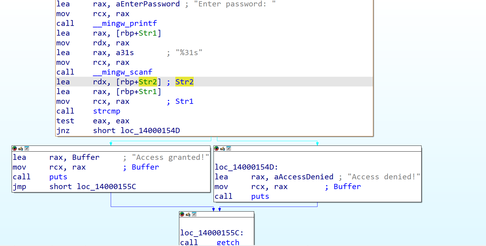

# Challenge Info


# File Info

- This is a **64-bit executable file**.


# Testing Inputs

- I started by testing with the string `"TEST"` as input. 
- The program responded with **Access Denied**, which suggests it’s validating the input against a different, predefined string. We can clearly observe this in IDA.


- **IDA View:**



- **Pseudocode (IDA-generated):**


```c
int __fastcall main(int argc, const char **argv, const char **envp)
{
  char Str2[8]; // [rsp+21h] [rbp-2Fh] BYREF
  _BYTE v5[7]; // [rsp+29h] [rbp-27h] BYREF
  char Str1[32]; // [rsp+30h] [rbp-20h] BYREF

  _main(argc, argv, envp);
  *(_DWORD *)v5 = 1129925455;
  *(_DWORD *)&v5[3] = 421010243;
  decrypt(Str2, v5, 42, 7);
  _mingw_printf("Enter password: ");
  _mingw_scanf("%31s", Str1);
  if ( !strcmp(Str1, Str2) )
    puts("Access granted!");
  else
    puts("Access denied!");
  getch();
  return 0;
}
```

- To investigate further, I used **x64dbg** and began searching for **static strings** that could help in pinpointing the password verification logic.  
    Examples include:
    1. `"Access granted!"`
    2. `"Access denied!"`
    3. References to `strcmp`
    4. Other suspicious instructions that might hint at password handling.


- After setting breakpoints, I ran the program until it hit the relevant instruction.


- At this point, I entered the test input string: **`JEEL`**.


- I then continued execution to the section where the **string comparison** occurs.  
    These instructions are particularly interesting because they load the two strings into registers before the `strcmp` call:
    - First string → `RDX` (the user’s input)
    - Second string → `RAX` (the stored, correct password)


- **`strcmp` Call Instruction:**


- **Register values at the moment of comparison:**
    - User’s input: `"JEEL"`
    - Stored password: `"easi123"` — which is the correct key/flag for the program.


