- **Category: Malware Analysis and Reverse Engineering**
- **Difficulty: Easy/Medium/Hard**
- File: [2015_FLAREOn_Challenges.zip](/uploads/Flare-On/2015_FLAREOn_Challenges.zip)

# Challenge 1:

## Stage 1 Extracting CAB File 

### Initial Triage


- File Type: PE32+ executable for MS Windows 5.02 (GUI), x86-64
- Size: 183KB
- SHA256: a0b3e6ab4a53bf745319177035017f222634d2601ba8708292d5fbe440467387

### Basic Static Analysis

- Detect it Easy (Die) show that this file is **self-extracted CAB/SFX style packing**, where the executable includes a compressed Microsoft Cabinet file (CAB) and extracts/executes it at runtime and it is just a **wrapper/loader**.
- The `.rsrc` section is compressed, which is why the tool flags **high entropy**, classic sign of packing or encryption.
- Compression algorithm used inside the CAB is **LZX** (as shown), which is common in Microsoft CAB archives.
- So we have to first extract the actual exe from this and analyze it,

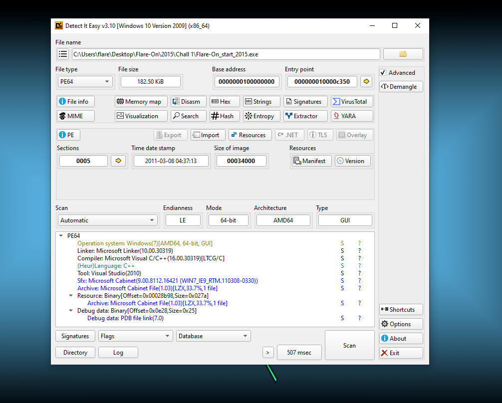

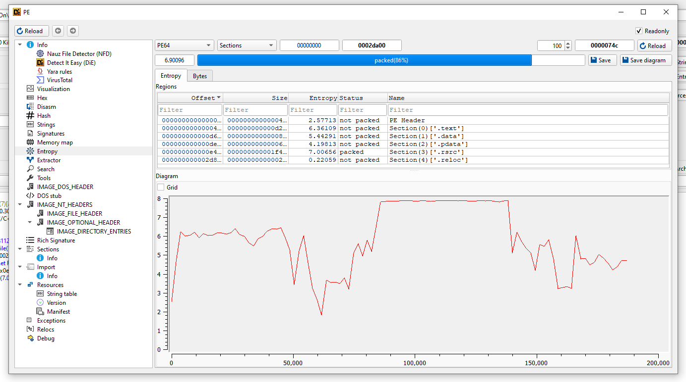

- We can extract it using [cabextract](https://www.cabextract.org.uk/) tool, and it will written in `Flare-On_start_2015.exe` file,

```bash
┌──(b14cky㉿DESKTOP-VRSQRAJ)-[~/]
└─$ cabextract Flare-On_start_2015.exe
Extracting cabinet: Flare-On_start_2015.exe
  extracting i_am_happy_you_are_to_playing_the_flareon_challenge.exe

All done, no errors.
```

## Stage 2 Understanding the ASMx86 Compiled EXE

### Initial Triage


- File Type: PE32 executable for MS Windows 4.00 (console), Intel i386
- Size: 2KB
- SHA256: 5d35789ac904bc5f4639119391ad1078f267a157ca153f2906f05df94e557e11

### Basic Static Analysis

- It gives `i_am_happy_you_are_to_playing_the_flareon_challenge.exe`.
- By running `die` on it, and it is written in **assembly**, not C/CPP.
- Also, it has missing DOS Header which means most of the automatic tools fail here because of these setup.

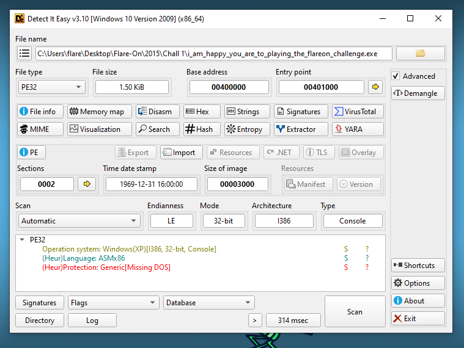

- Running `floss` for strings analysis,

```bash
┌──(b14cky㉿DESKTOP-VRSQRAJ)-[~/]
└─$ /opt/floss i_am_happy_you_are_to_playing_the_flareon_challenge.exe
.
.
.
 ───────────────────────────
  FLOSS STATIC STRINGS (18)
 ───────────────────────────

+----------------------------------+
| FLOSS STATIC STRINGS: ASCII (18) |
+----------------------------------+

.text
.data
Pj*h
Pj2hX!@
h.!@
kernel32.dll
LoadLibraryA
GetProcAddress
GetLastError
GetStdHandle
AttachConsole
WriteConsoleA
WriteFile
ReadFile
Let's start out easy
Enter the password>
You are success
You are failure

+------------------------------------+
| FLOSS STATIC STRINGS: UTF-16LE (0) |
+------------------------------------+
 ─────────────────────────
  FLOSS STACK STRINGS (0)
 ─────────────────────────
 ─────────────────────────
  FLOSS TIGHT STRINGS (0)
 ─────────────────────────
 ───────────────────────────
  FLOSS DECODED STRINGS (0)
 ───────────────────────────
```

- These are the the `kernel32.dll` APIs,
- It can be used for **Dynamic API Resolution** + **I/O Execution Flow**. (Just a hypothesis)

```bash
LoadLibraryA
GetProcAddress
GetLastError
GetStdHandle
AttachConsole
WriteConsoleA
WriteFile
ReadFile
```

- Something related to password/licence checking,

```bash
Let's start out easy
Enter the password>
You are success
You are failure
```

- Now, to confirm the imports i used `pestudio` and indeed it is using those,

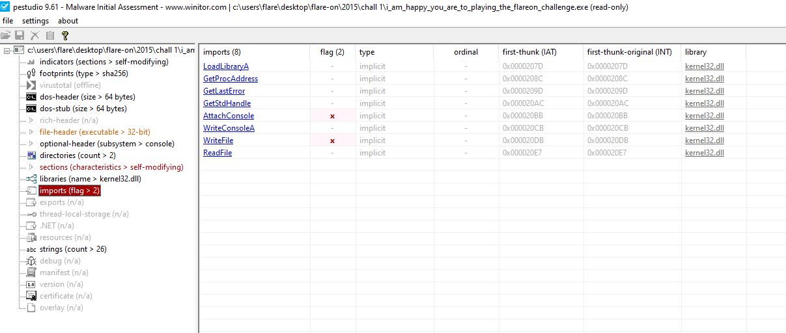

### Advance Static Analysis

- So, to analyze it opened it in IDA with manual load because sometimes auto load fails in these kind of binaries, and found that it has only one `start` function is which is doing something, 

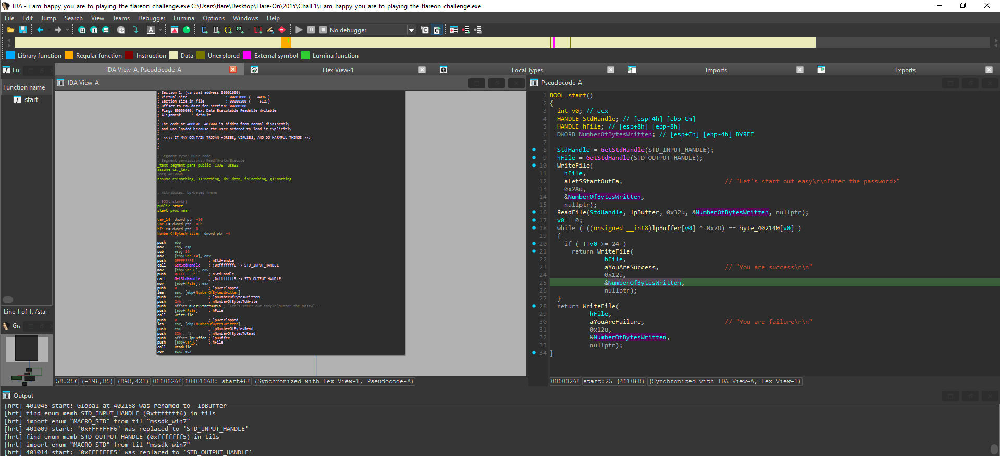

- `GetStdHandle()` is called with:
	    - `STD_INPUT_HANDLE` → stdin
	    - `STD_OUTPUT_HANDLE` → stdout
	- Return values (in `EAX`) are saved as handles for input/output.
- I/O Operations
	- `WriteFile()` → prints prompt to console (stdout)
	- `ReadFile()` → reads up to **50 bytes** into `input_buffer` (`0x402158`)

```c
BOOL start()
{
  int v0; // ecx
  HANDLE StdHandle; // [esp+4h] [ebp-Ch]
  HANDLE hFile; // [esp+8h] [ebp-8h]
  DWORD NumberOfBytesWritten; // [esp+Ch] [ebp-4h] BYREF

  StdHandle = GetStdHandle(STD_INPUT_HANDLE);
  hFile = GetStdHandle(STD_OUTPUT_HANDLE);
  WriteFile(
    hFile,
    aLetSStartOutEa,                            // "Let's start out easy\r\nEnter the password>"
    0x2Au,
    &NumberOfBytesWritten,
    nullptr);
  ReadFile(StdHandle, lpBuffer, 0x32u, &NumberOfBytesWritten, nullptr);
  v0 = 0;
  while ( ((unsigned __int8)lpBuffer[v0] ^ 0x7D) == byte_402140[v0] )
  {
    if ( ++v0 >= 24 )
      return WriteFile(
               hFile,
               aYouAreSuccess,                  // "You are success\r\n"
               0x12u,
               &NumberOfBytesWritten,
               nullptr);
  }
  return WriteFile(
           hFile,
           aYouAreFailure,                      // "You are failure\r\n"
           0x12u,
           &NumberOfBytesWritten,
           nullptr);
}
```

- Expected C code,

```c
for (i = 0; i < 24; i++) {
    if ((input[i] ^ 0x7D) != encoded[i]) {
        print("failure");
        return;
    }
}
print("success");
```

- Here is the flow of code,
	1. Print prompt
	2. Read input
	3. For each character:
	    - XOR with `0x7D`
	    - Compare with stored value
	4. If all 24 match → success
	5. Else → failure

- This are the sequence of bytes which are being XORed with key `0x7D`. 

```
1F 8 13 13 4 22 0E 11 4D 0D 18 3D 1B 11 1C 0F 18 50 12 13 53 1E 12 10
```

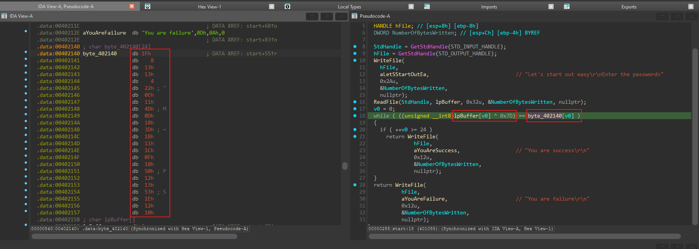

- Got the flag!!

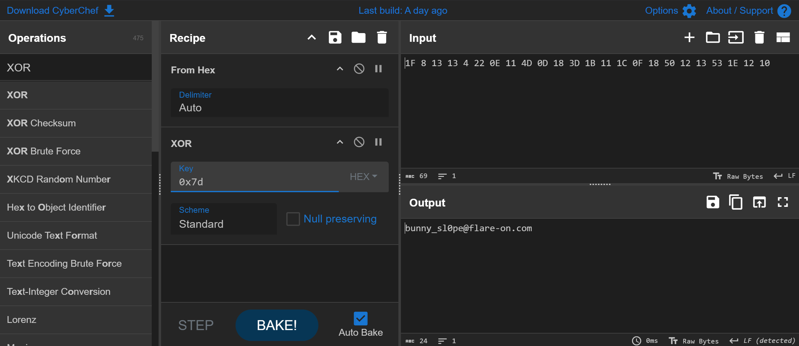

```yml
bunny_sl0pe@flare-on.com
```

- You can also apply this `IDApython` script which will manually patch the bytes, (only for IDA pro).

```python
import idc

for i in range(0x00402140, 0x00402158):
    b = 0x7D ^ idc.get_wide_byte(i)
    idc.patch_byte(i, b)
```

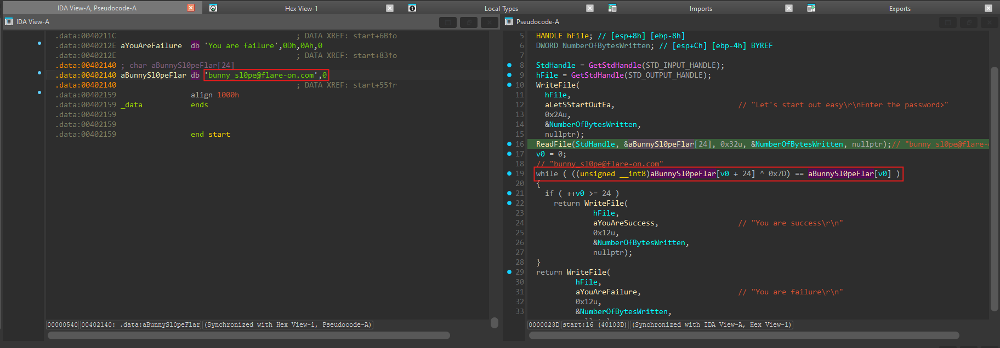

# Challenge 2:
## Stage 1 Understanding the ASMx86 Compiled exe

### Initial Triage


- File Type: PE32 executable for MS Windows 4.00 (console)
- Size: 2KB
- SHA256: 9852afb172bc03a50d291c70faa724c69a10af9e6ee88457185ce5e0705216f0

### Basic Static Analysis

- By running `die` on it, and it is written in **assembly**.
- Also, it has missing DOS Header which means most of the automatic tools fail 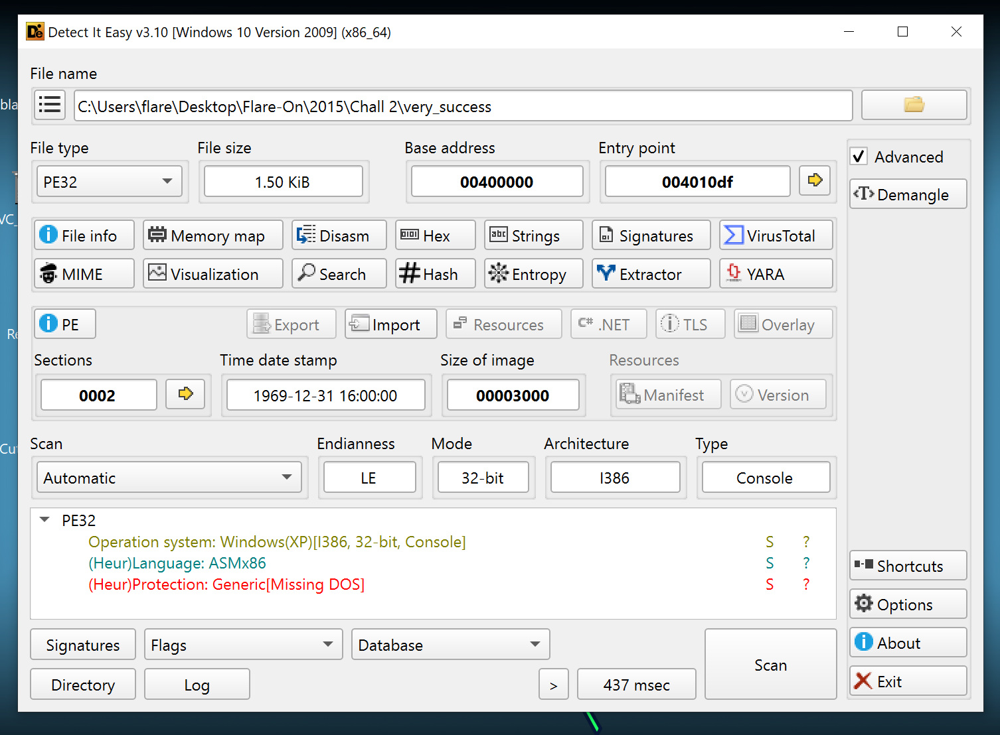

- I ran `floss` for strings analysis and here is what i get,

```bash
┌──(b14cky㉿DESKTOP-VRSQRAJ)-[~/]
└─$ /opt/floss very_success
.
.
.
 ───────────────────────────
  FLOSS STATIC STRINGS (20)
 ───────────────────────────
+----------------------------------+
| FLOSS STATIC STRINGS: ASCII (20) |
+----------------------------------+

.text
.data
PjCh
Pj2hY!@
hY!@
h5!@
hG!@
kernel32.dll
LoadLibraryA
GetProcAddress
GetLastError
GetStdHandle
AttachConsole
WriteConsoleA
WriteFile
ReadFile
You crushed that last one! Let's up the game.
Enter the password>
You are success
You are failure
+------------------------------------+
| FLOSS STATIC STRINGS: UTF-16LE (0) |
+------------------------------------+
 ─────────────────────────
  FLOSS STACK STRINGS (0)
 ─────────────────────────
 ─────────────────────────
  FLOSS TIGHT STRINGS (0)
 ─────────────────────────
 ───────────────────────────
  FLOSS DECODED STRINGS (0)
 ───────────────────────────
```

- It gives some `kernel32.dll` API functions,
- Hypothesis: (console-based loader/tool using dynamic API resolution + file I/O operations).

```bash
LoadLibraryA
GetProcAddress
GetLastError
GetStdHandle
AttachConsole
WriteConsoleA
WriteFile
ReadFile
```

- Some string related to password things,

```
You crushed that last one! Let's up the game.
Enter the password>
You are success
You are failure
```
### Advance Static Analysis

- I opened it in IDA, and it has only `2 functions` and `start function`,
	- `sub_401000`
	- `sub_401084`

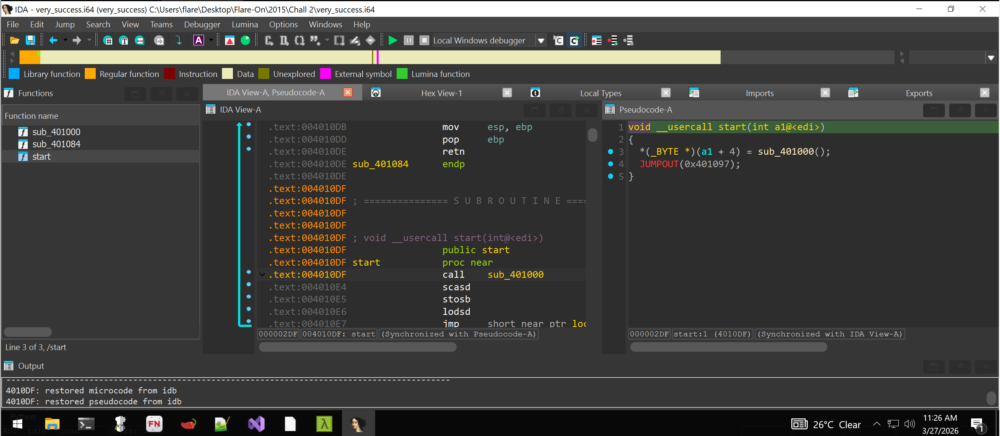

- Func1: `sub_401000`

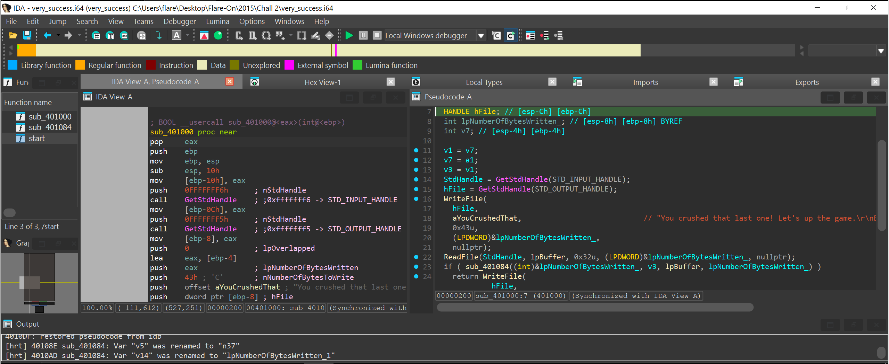

- Func2: `sub_401084`

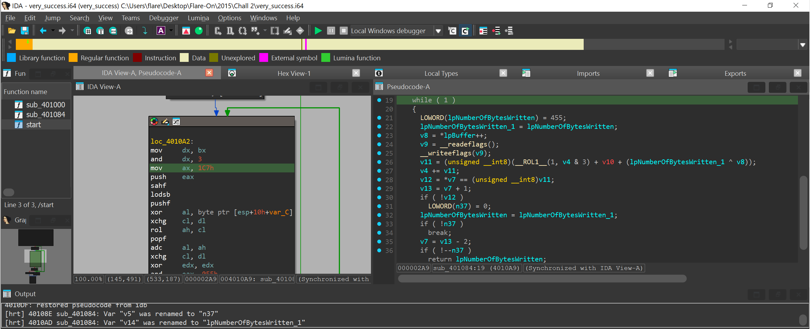

- This is flow of the whole program,

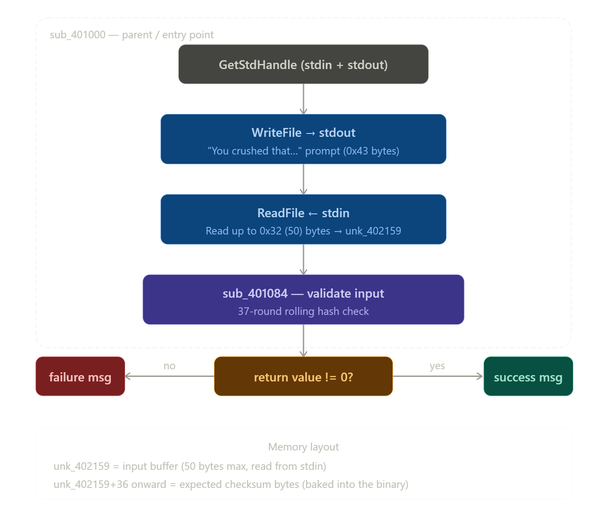
- Gets stdin/stdout handles via `GetStdHandle`.
- Prints a prompt to stdout.
- Reads up to 50 bytes from stdin into buffer `unk_402159`.
- Passes that buffer to the validator function.
- Prints success or failure message based on return value.

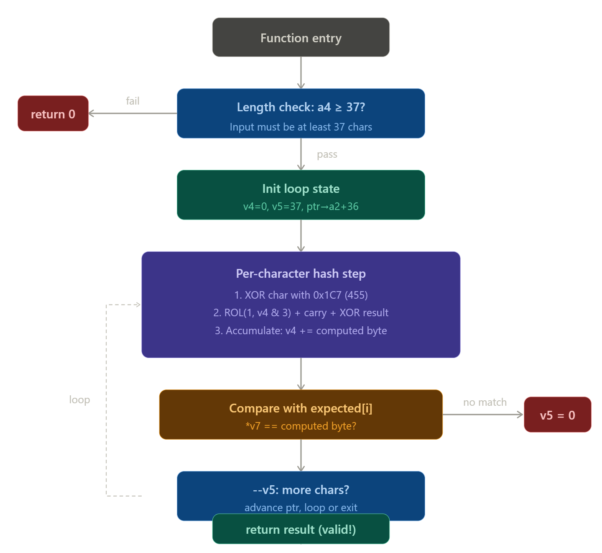

- Buffer `unk_402159` holds both your input AND the expected hash bytes
- Bytes 0–36 → your typed input
- Bytes 36+ → hardcoded expected values baked into `.data`
- So the correct key is exactly **37 chars long**.
#### Validator Logic (sub_401084)

- Arguments,
	- `a2` → pointer to expected checksum array (read from `a2+36` backwards)
	- `a3` → your input string
	- `a4` → input length
- **Step 1 — Length check:** input < 37 → return 0 (fail) immediately
- **Step 2 — 37-round rolling hash:**
	- XOR each char with `0xC7` (low byte of 455)
	- Rotate `1` left by `(v4 & 3)` bits, add x86 carry flag + XOR result
	- Accumulate result into `v4` → affects next round's rotation
- **Step 3 — Compare:** computed byte must match `expected[i]`, mismatch sets `v5=0` and breaks early
- **Returns** non-zero if all 37 match, `0` otherwise

#### Flag Calculation using angr framework 

- Now this is where it gets interesting. **We know the binary takes input, runs it through a 37-round rolling hash, and compares the result against hardcoded expected bytes**. "Reversing that hash manually is painful because each round depends on the previous one (stateful accumulator + x86 carry flag)". 
- So instead of reversing it by hand, we let a tool do the heavy lifting.
- We use `angr`, a binary analysis framework that converts execution into a math problem using **symbolic execution**. 
- Instead of running the binary with a real input, angr runs it with symbolic unknowns (think algebra variables), tracks every constraint the binary puts on those unknowns, and hands the whole thing to a solver (Z3) which figures out the exact values that satisfy all constraints.
- In short, angr runs the binary with unknown input, explores all possible execution paths simultaneously, and finds the one input that reaches the success branch.
- More on [angr](https://angr.io/)...

```bash
pip install angr claripy
```

```python
import angr
import claripy

proj = angr.Project('very_success.exe', auto_load_libs=False)

flag = [claripy.BVS(f'c{i}', 8) for i in range(37)]
state = proj.factory.full_init_state(stdin=claripy.Concat(*flag, claripy.BVV(b'\n')))

for c in flag:
    state.solver.add(c >= 0x20, c <= 0x7e)

simgr = proj.factory.simulation_manager(state)
simgr.use_technique(angr.exploration_techniques.Veritesting())
simgr.explore(find=0x0040106B, avoid=0x00401072)

if simgr.found:
    s = simgr.found[0]
    print(b''.join(s.solver.eval(c, cast_to=bytes) for c in flag))
```
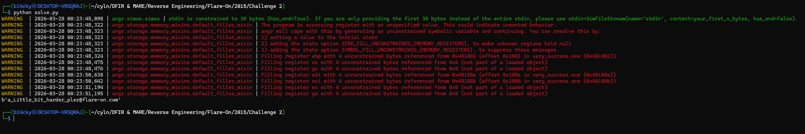

- Here is the flag,

```yml
a_Little_b1t_harder_plez@flare-on.com
```

# Challenge 3:

## Stage 1 - Analyzing the PyInstaller Compiled EXE

### Initial Triage

- File Type: PE32 executable for MS Windows 5.00 (console), Intel i386
- Size: 11.6MB
- SHA256: 6b82463eaa13aba88aab9050f08bcc7658067f4dc4d6ca04f49bbda2201cc70b
### Basic Static Analysis

Running the sample through **Detect It Easy (DIE)** immediately tells us something interesting:

- 32-bit Windows executable (~11.6 MB)
- Built with Visual C++ 2008 — but wait, it's actually a **Python program packed with PyInstaller**
- DIE flags it as **packed/compressed**
- There's a **large overlay** at the end of the file containing **zlib-compressed data**

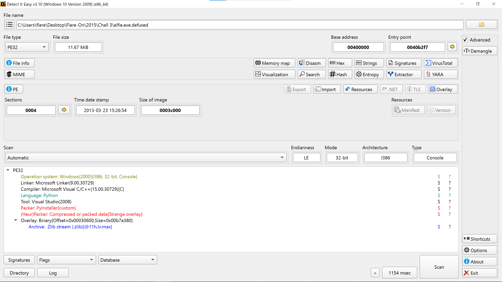

Yep, it's packed alright.

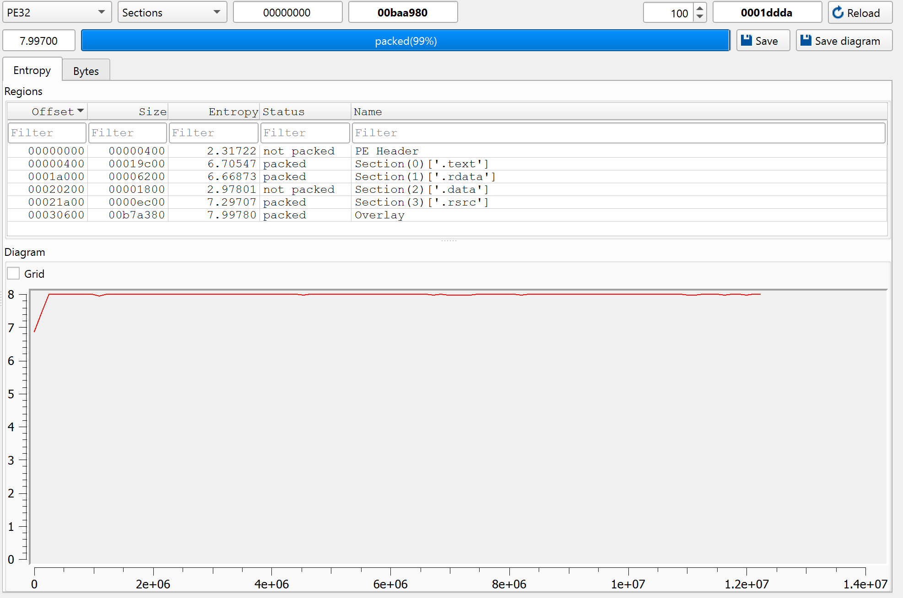

This is classic **PyInstaller** behaviour. When you bundle a Python script with PyInstaller, it doesn't compile it like C/C++ — instead it does something sneakier:

1. **Bundles everything together** — your Python script, the Python interpreter, and all required libraries
2. **Packs it into one EXE** — the front part is a small C loader, and the actual Python code + libs are stuffed at the end
3. **Stores everything in an overlay** — this data is appended after the PE structure, often **zlib-compressed**, which is exactly why DIE throws up the "strange overlay" warning
4. **At runtime**, the loader quietly extracts the embedded data and runs the Python code from memory or a temp folder

So the strategy here is straightforward - we need to unpack it and get to the actual Python code. We can extract the `.pyc` (compiled bytecode) files using **pyinstxtractor**:

```
https://sourceforge.net/projects/pyinstallerextractor/
```

```bash
┌──(b14cky㉿DESKTOP-VRSQRAJ)-[~]
└─$ python pyinstxtractor.py elfie

[*] Processing elfie
[*] Pyinstaller version: 2.1+
[*] Python version: 27
[*] Length of package: 12034944 bytes
[*] Found 26 files in CArchive
[*] Beginning extraction...please standby
[!] Warning: The script is running in a different python version than the one used to build the executable
    Run this script in Python27 to prevent extraction errors(if any) during unmarshalling
[*] Found 244 files in PYZ archive
[+] Possible entry point: _pyi_bootstrap
[+] Possible entry point: pyi_carchive
[+] Possible entry point: elfie
[*] Successfully extracted pyinstaller archive: elfie

You can now use a python decompiler on the pyc files within the extracted directory
```

```bash
┌──(b14cky㉿DESKTOP-VRSQRAJ)-[~/]
└─$ ls
elfie  elfie_extracted  pyinstxtractor.py

┌──(b14cky㉿DESKTOP-VRSQRAJ)-[~/elfie_extracted]
└─$ ls
bz2.pyd                      msvcp90.dll              pyi_carchive          python27.dll            _ssl.pyd
elfie                        msvcr90.dll              pyi_importers         QtCore4.dll             struct
elfie.exe.manifest           out00-PYZ.pyz            pyi_os_path           QtGui4.dll              unicodedata.pyd
_hashlib.pyd                 out00-PYZ.pyz_extracted  pyside-python2.7.dll  select.pyd
Microsoft.VC90.CRT.manifest  pyi_archive              PySide.QtCore.pyd     shiboken-python2.7.dll
msvcm90.dll                  _pyi_bootstrap           PySide.QtGui.pyd      _socket.pyd

┌──(b14cky㉿DESKTOP-VRSQRAJ)-[~/elfie_extracted]
└─$ file elfie
elfie: ASCII text
```

The `elfie` file sitting in the extraction directory is our next target — it's a large blob of obfuscated Python code. Time to dig deeper.

## Stage 2 - Analyzing of Python Blob

### Initial Triage

- File Type:  Python script, ASCII text executable, with very long lines (65463)
- Size: 1348KB
- SHA256: 922cc911074008ad494967b41fa48db712293e2572af53e8a5e823ff64c39761
### Basic Static Analysis

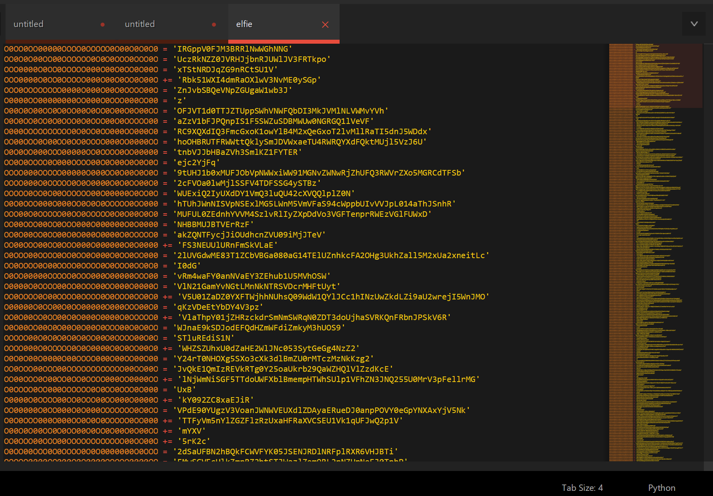

- Opening it up, we're greeted with this beautiful disaster:

```python
O0OO0OO00000OOOO0OOOOO0O00O0O0O0 = 'IRGppV0FJM3BRRlNwWGhNNG'
OO0O0O00OO00OOOOOO0O0O0OOO0OOO0O = 'UczRkNZZ0JVRHJjbnRJUWlJV3FRTkpo'
OOO0000O0OO0OOOOO000O00O0OO0O00O = 'xTStNRDJqZG9nRCtSU1V'
OOO0000O0OO0OOOOO000O00O0OO0O00O += 'Rbk51WXI4dmRaOXlwV3NvME0ySGp'
...
O00OO00OOO0OOOO0OOOO0OO00000OOO0 += 'RabTBrZE'
O00OO00OOO0OOOO0OOOO0OO00000OOO0 += 'VXWFY3QUtiTXFXQVYrenh4amxJZXI1MXd1YWJiWkRaWDRQV0'
O00OO00OOO0OOOO0OOOO0OO00000OOO0 += 'xDUmhGcnRDcnd4VkF5'
O00OO00OOO0OOOO0OOOO0OO00000OOO0 += 'aTBTMXd3OC8yY0ZqdzBIU0JMT0tEcktGckJUTkpvRGw2d'
O00OO00OOO0OOOO0OOOO0OO00000OOO0 += 'nNocTB'
import base64
exec(base64.b64decode(OOO0OOOOOOOO0000O000O00O0OOOO00O +
...
OOO0000O0OO0OOOOO000O00O0OO0O00O + OOO0O00O00OOOOOOO00OOOO0000O0O00 + O0O00OO00O0O00O0O00O0OOO00O0O0OO + O00OOOOO000O00O0O00000OOO0000OOO + O0O0OOO000O000OO0O0O0OOOOO0OO000))
```

- Classic obfuscation, variable names that are just random sequences of `0` and `O` to make it visually impossible to read. 
- The trick here is simple though: instead of letting `exec()` run the decoded payload blindly, we just swap it out for `print()` and let it tell us what it was about to execute.

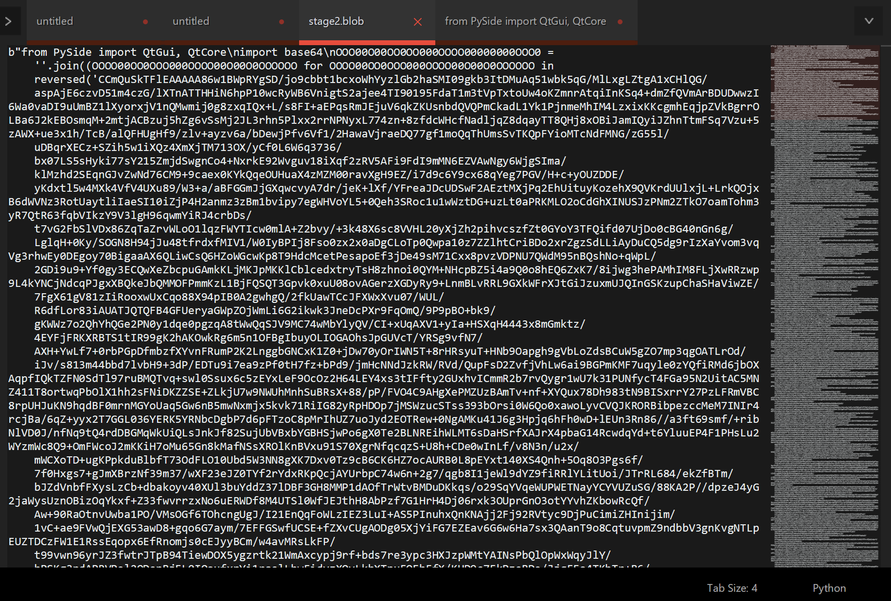

- Still pretty messy. After cleaning it up a bit, renaming some variables and fixing the formatting, it starts to look more sensible:

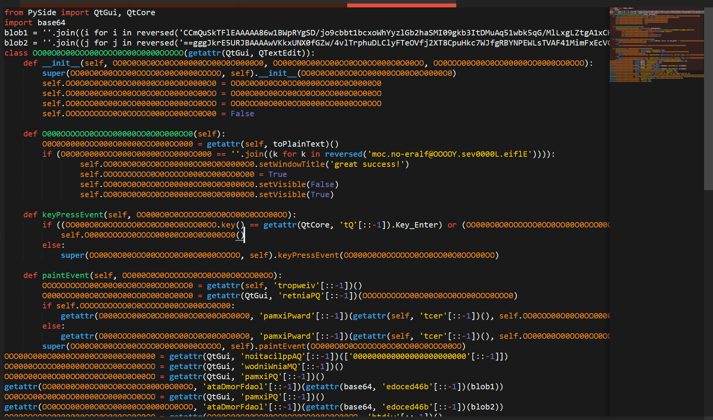

- There are **two large base64 blobs** in there. 
- I decode both of them, and notice they're also **reversed**, so I reverse them before decoding. Let's see what's inside.

**Blob 1:**

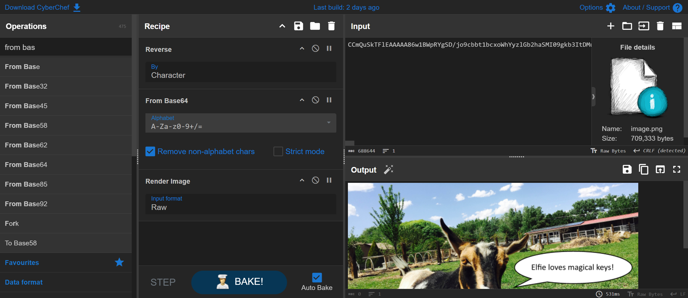


A glorious meme. 😂 Classic CTF energy.

**Blob 2:**

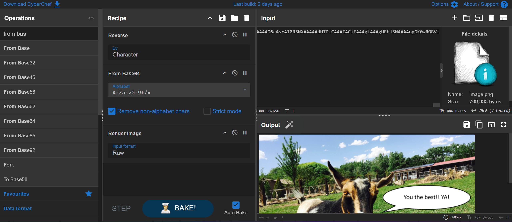


Another image. 😗

- And then, hiding right there in plain sight the flag, in plaintext, reversed:

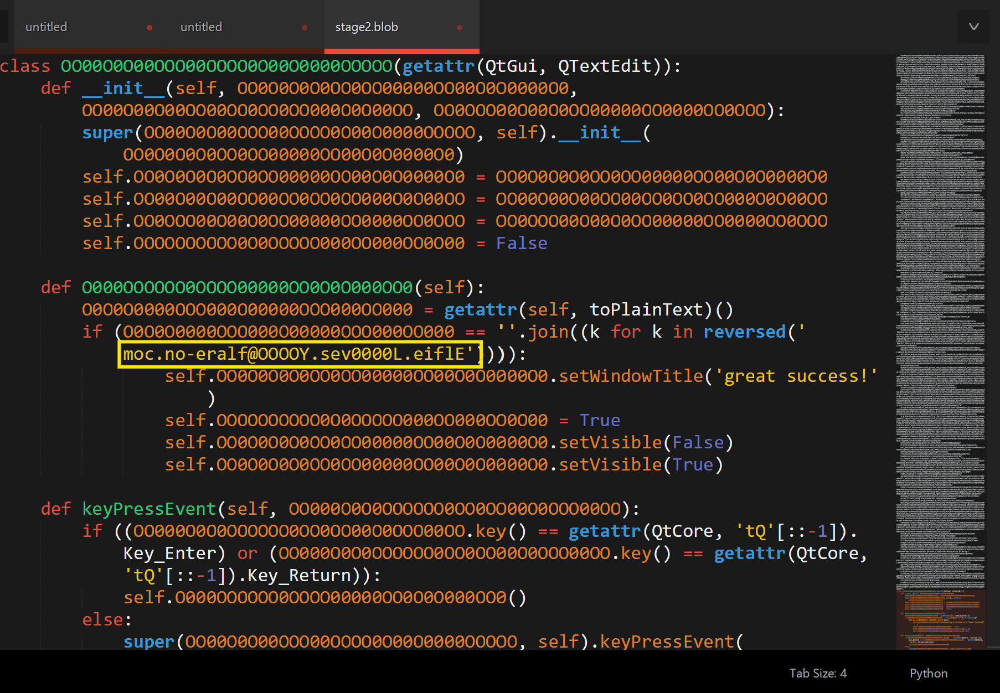

Flip it around and we're done:

```yml
Elfie.L0000ves.YOOOO@flare-on.com
```