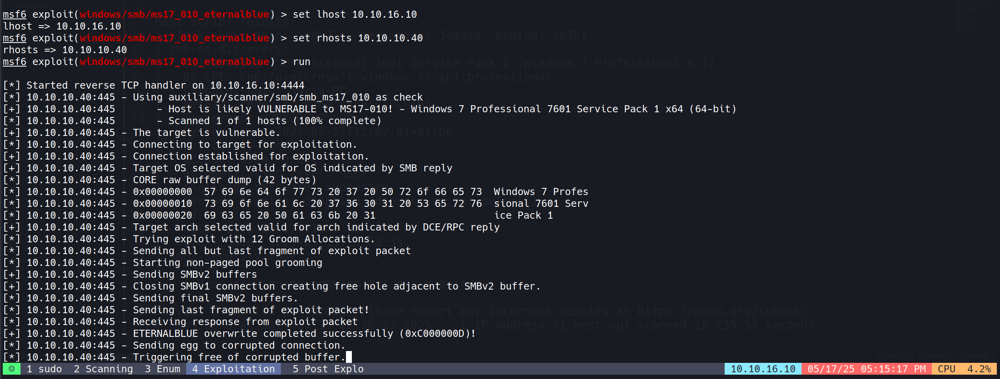

# Scanning

## Rustscan


```bash
rustscan -a 10.10.10.40 -r 1-65535 -b 100
```


## Nmap Full Scan


```bash
nmap -sC -sV -T5 -oA nmap/initials 10.10.10.40 -Pn
```


```bash
# Nmap 7.94SVN scan initiated Sat May 17 16:32:23 2025 as: nmap -sC -sV -T5 -oA nmap/initials -Pn 10.10.10.40
Warning: 10.10.10.40 giving up on port because retransmission cap hit (2).
Nmap scan report for 10.10.10.40
Host is up (0.26s latency).
Not shown: 532 closed tcp ports (conn-refused), 460 filtered tcp ports (no-response)
PORT      STATE SERVICE      VERSION
135/tcp   open  msrpc        Microsoft Windows RPC
139/tcp   open  netbios-ssn  Microsoft Windows netbios-ssn
445/tcp   open  microsoft-ds Windows 7 Professional 7601 Service Pack 1 microsoft-ds (workgroup: WORKGROUP)
49152/tcp open  msrpc        Microsoft Windows RPC
49153/tcp open  msrpc        Microsoft Windows RPC
49154/tcp open  msrpc        Microsoft Windows RPC
49155/tcp open  msrpc        Microsoft Windows RPC
49157/tcp open  msrpc        Microsoft Windows RPC
Service Info: Host: HARIS-PC; OS: Windows; CPE: cpe:/o:microsoft:windows
Host script results:
|_clock-skew: mean: -18m21s, deviation: 34m34s, median: 1m35s
| smb-os-discovery: 
|   OS: Windows 7 Professional 7601 Service Pack 1 (Windows 7 Professional 6.1)
|   OS CPE: cpe:/o:microsoft:windows_7::sp1:professional
|   Computer name: haris-PC
|   NetBIOS computer name: HARIS-PC\x00
|   Workgroup: WORKGROUP\x00
|_  System time: 2025-05-17T12:07:01+01:00
| smb-security-mode: 
|   account_used: guest
|   authentication_level: user
|   challenge_response: supported
|_  message_signing: disabled (dangerous, but default)
| smb2-time: 
|   date: 2025-05-17T11:06:58
|_  start_date: 2025-05-15T15:03:33
| smb2-security-mode: 
|   2:1:0: 
|_    Message signing enabled but not required
Service detection performed. Please report any incorrect results at https://nmap.org/submit/ .
# Nmap done at Sat May 17 16:36:23 2025 -- 1 IP address (1 host up) scanned in 239.53 seconds
```

- The scan reveals several open ports, with SMB (445) being the most interesting target.
- The target is identified as Windows 7 Professional with Service Pack 1.
- Several concerning security configurations are observed:
    - SMB message signing is disabled (dangerous)
    - Guest account is being used for authentication
    - Authentication level is set to "user" rather than a more secure option
- Given the Windows 7 operating system and SMB configuration, this machine may be vulnerable to known SMB exploits.

# Enumeration


```bash
Starting Nmap 7.94SVN ( https://nmap.org ) at 2025-05-17 17:05 IST
Nmap scan report for 10.10.10.40
Host is up (0.37s latency).
PORT    STATE SERVICE
445/tcp open  microsoft-ds
Host script results:
| smb-vuln-ms17-010: 
|   VULNERABLE:
|   Remote Code Execution vulnerability in Microsoft SMBv1 servers (ms17-010)
|     State: VULNERABLE
|     IDs:  CVE:CVE-2017-0143
|     Risk factor: HIGH
|       A critical remote code execution vulnerability exists in Microsoft SMBv1
|        servers (ms17-010).
|           
|     Disclosure date: 2017-03-14
|     References:
|       https://technet.microsoft.com/en-us/library/security/ms17-010.aspx
|       https://blogs.technet.microsoft.com/msrc/2017/05/12/customer-guidance-for-wannacrypt-attacks/
|_      https://cve.mitre.org/cgi-bin/cvename.cgi?name=CVE-2017-0143
Nmap done: 1 IP address (1 host up) scanned in 5.76 seconds
```

- Used Nmap's vulnerability scanning scripts to check for common SMB vulnerabilities.
- The target is confirmed vulnerable to MS17-010, also known as EternalBlue.
- This vulnerability allows for remote code execution with SYSTEM privileges on Windows systems.
- EternalBlue is particularly dangerous because it requires no authentication and can provide direct system-level access.
- The vulnerability was patched by Microsoft in March 2017, but many systems remain unpatched.

## EternalBlue (MS17-010) Vulnerability Explained

- EternalBlue exploits a vulnerability in SMBv1's handling of specially crafted packets, allowing attackers to send malicious SMB messages to execute arbitrary code. The flaw exists in how the SMB server handles certain requests, enabling buffer overflow in the Windows kernel. 
- This exploit became notorious as part of the WannaCry ransomware attack in 2017, affecting over 200,000 computers worldwide. 
- Despite being patched, many systems remain vulnerable due to delayed patching or legacy system requirements.

# Exploitation

- I used Metasploit for exploiting this vulnerability due to its reliability and ease of use.
- The specific module used was `exploit/windows/smb/ms17_010_eternalblue`.
- Configured the module with the target IP and appropriate payload settings.

  

- Upon successful exploitation, gained immediate SYSTEM-level privileges.
- This demonstrates the severity of the vulnerability - no user interaction required and immediate highest-level access obtained.
- The exploitation process worked on the first attempt, indicating the target was highly vulnerable.


- User Flag:

```lua
471a09faae9f0ade2aa13e768432be08
```


- Root Flag 


```lua
c04174bbf3de303ee031b55c3acf1d0d
```
