- **Sherlock Scenario**
	- Forela needs your help! A whole portion of our UNIX servers have been hit with what we think is ransomware. We are refusing to pay the attackers and need you to find a way to recover the files provided.
- **Category: Malware-Analysis**
- **Difficulty: Easy**
- File:- [lockpick1.zip](/uploads/HTB_Sherlock_Lockpick/lockpick1.zip)

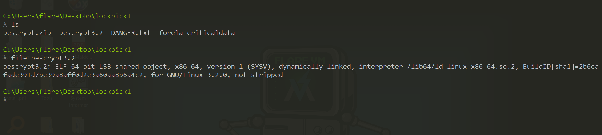

- By extracting `lockpick1.zip` file, we get one another `bescrypt.zip` and after extracting it using password given in the `DANGER.txt` we get `elf binary` which is linux executable. 

# Task 1

## Please confirm the encryption key string utilized for the encryption of the files provided?

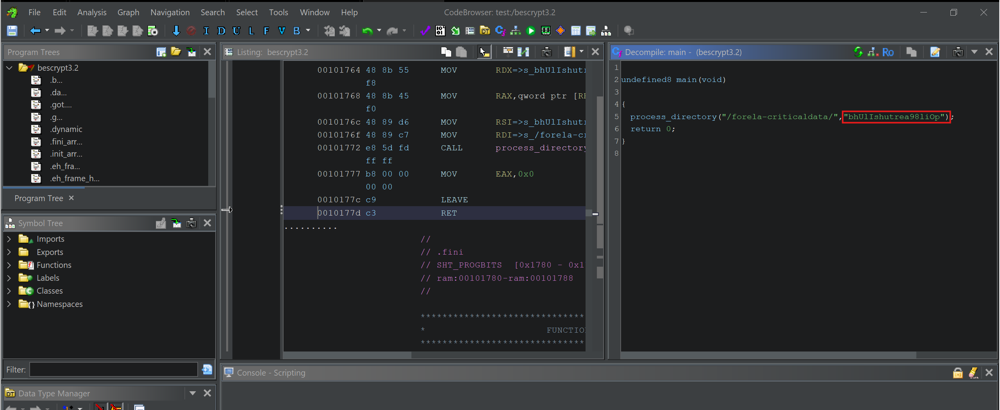

- Here is the decompiled code of `main`,

```c
undefined8 main(void)
{
  process_directory("/forela-criticaldata/","bhUlIshutrea98liOp");
  return 0;
}
```

- Here is the decompiled code of `process_directory`,

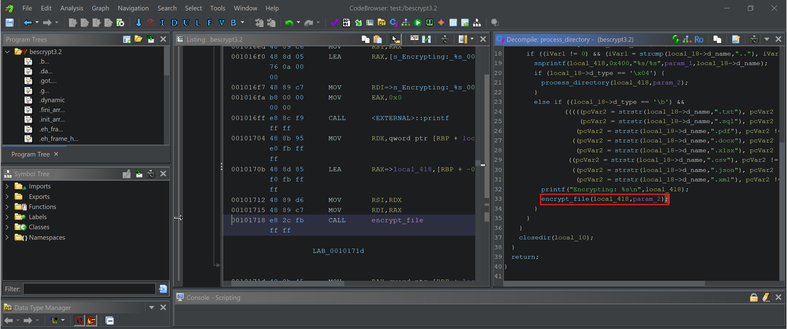

```c
void process_directory(char *param_1,undefined8 param_2)

{
  int iVar1;
  char *pcVar2;
  char local_418 [1024];
  dirent *local_18;
  DIR *local_10;
  
  local_10 = opendir(param_1);
  if (local_10 == (DIR *)0x0) {
    printf("Error opening directory: %s\n",param_1);
  }
  else {
    while (local_18 = readdir(local_10), local_18 != (dirent *)0x0) {
      iVar1 = strcmp(local_18->d_name,".");
      if ((iVar1 != 0) && (iVar1 = strcmp(local_18->d_name,".."), iVar1 != 0)) {
        snprintf(local_418,0x400,"%s/%s",param_1,local_18->d_name);
        if (local_18->d_type == '\x04') {
          process_directory(local_418,param_2);
        }
        else if ((local_18->d_type == '\b') &&
                (((((pcVar2 = strstr(local_18->d_name,".txt"), pcVar2 != (char *)0x0 ||
                    (pcVar2 = strstr(local_18->d_name,".sql"), pcVar2 != (char *)0x0)) ||
                   (pcVar2 = strstr(local_18->d_name,".pdf"), pcVar2 != (char *)0x0)) ||
                  ((pcVar2 = strstr(local_18->d_name,".docx"), pcVar2 != (char *)0x0 ||
                   (pcVar2 = strstr(local_18->d_name,".xlsx"), pcVar2 != (char *)0x0)))) ||
                 ((pcVar2 = strstr(local_18->d_name,".csv"), pcVar2 != (char *)0x0 ||
                  ((pcVar2 = strstr(local_18->d_name,".json"), pcVar2 != (char *)0x0 ||
                   (pcVar2 = strstr(local_18->d_name,".xml"), pcVar2 != (char *)0x0)))))))) {
          printf("Encrypting: %s\n",local_418);
          encrypt_file(local_418,param_2);
        }
      }
    }
    closedir(local_10);
  }
  return;
}
```

- `param_2` is passed in `encrypt_file` function and `param_2` is  `bhUlIshutrea98liOp` which means this is the key for encryption of file,

```c
encrypt_file(local_418,param_2);
```

```
bhUlIshutrea98liOp
```

# Task 2

## We have recently received an email from [wbevansn1@cocolog-nifty.com](mailto:wbevansn1@cocolog-nifty.com) demanding to know the first and last name we have him registered as. They believe they made a mistake in the application process. Please confirm the first and last name of this applicant.

- `encrypt_file` function is doing simple XOR operation to encrypt a file using given key,

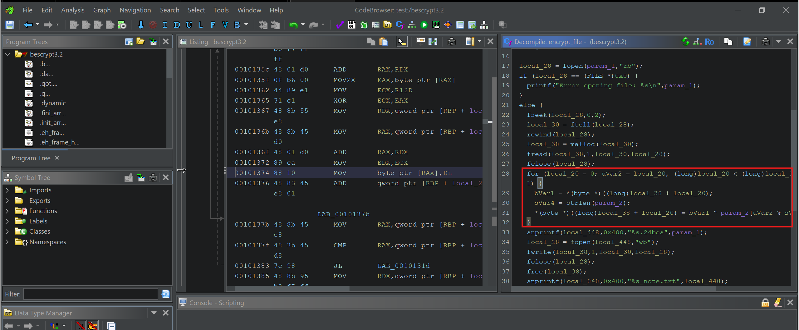

```c
    for (local_20 = 0; uVar2 = local_20, (long)local_20 < (long)local_30; local_20 = local_20 + 1) {
      bVar1 = *(byte *)((long)local_38 + local_20);
      sVar4 = strlen(param_2);
      *(byte *)((long)local_38 + local_20) = bVar1 ^ param_2[uVar2 % sVar4];
    }
```

- So simple take the key `bhUlIshutrea98liOp` and try to decrypt any file, let's say `complaints.csv.24bes` and it works so i made simple `decryptor.py` to decrypt all the file, 

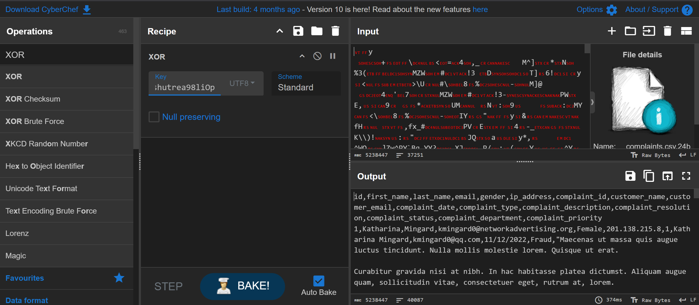

- Here is `decryptor.py` code,

```python
import os

def decrypt_file(filename, key):
    try:
        with open(filename, "rb") as file:
            encrypted_data = file.read()
        
        print(f"Encrypted file size: {len(encrypted_data)}")
        
        # Decrypt using XOR with the key
        key_length = len(key)
        decrypted_data = bytearray(
            encrypted_data[i] ^ ord(key[i % key_length]) for i in range(len(encrypted_data))
        )
        
        # Generate original filename
        if filename.endswith(".24bes"):
            original_filename = filename[:-6]
        else:
            original_filename = filename + ".decrypted"
        
        print(f"Original filename generated: {original_filename}")
        
        try:
            with open(original_filename, "wb") as file:
                file.write(decrypted_data)
            print(f"Successfully wrote decrypted file: {original_filename}")
        except Exception as e:
            print(f"Error writing file {original_filename}: {e}")
    except Exception as e:
        print(f"Error decrypting file {filename}: {e}")

def decrypt_all_files(directory, key):
    for root, _, files in os.walk(directory):
        print(f"Checking directory: {root}")
        for file in files:
            print(f"Found file: {file}")
            if file.endswith(".24bes"):
                print(f"Decrypting: {file}")
                decrypt_file(os.path.join(root, file), key)

def main():
    directory = "."
    key = "bhUlIshutrea98liOp"
    print(f"Starting decryption in {directory} with key: {key}")
    decrypt_all_files(directory, key)
    print("Decryption process completed.")

if __name__ == "__main__":
    main()
```

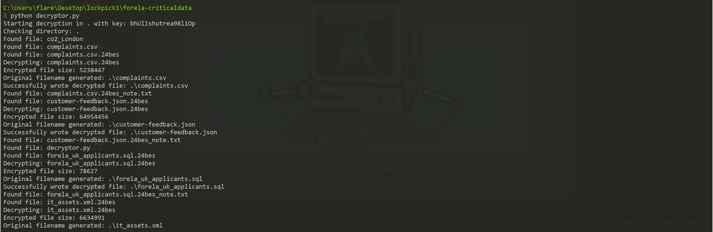

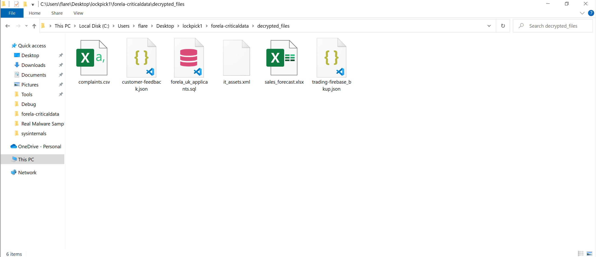

- So just simple apply this command so see is whether is there any related strings present,
	- And i found the name related to this email,

```bash 
cat * | grep -Rin 'wbevansn1@cocolog-nifty.com'
```

- This string is present in `forela_uk_applicants.sql` file and in `872` line no,

```csv
(830,'Walden','Bevans','wbevansn1@cocolog-nifty.com','Male','Aerospace Manufacturing','2023-02-16'),
```

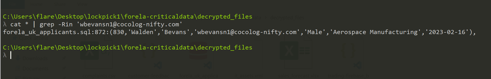

```
Walden Bevans
```

# Task 3

## What is the MAC address and serial number of the laptop assigned to Hart Manifould?

- This info must be available in `it_assets.xml` file because it is asking about laptop,
- So i tried to open that file but it seems very unappropriated so i used this tool to format it and i got this file,

```bash
xmllint --format it_assets.xml > formated_it_assets.xml
```

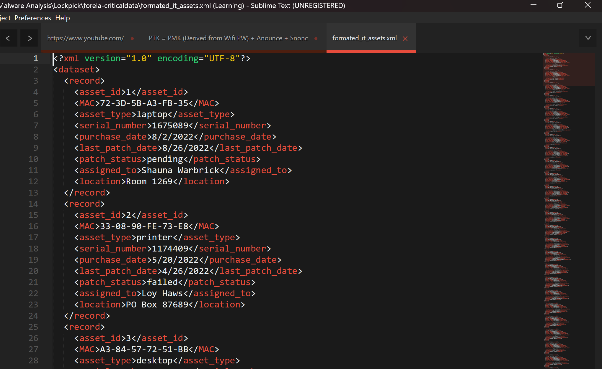

- So i tried to find this name `Hart Manifould` and i got associated `MAC Address` and `Serial Number`,

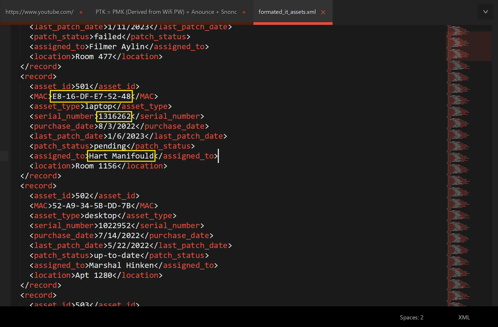

```
E8-16-DF-E7-52-48, 1316262
```

# Task 4

## What is the email address of the attacker?

- This is asking about attackers email which is written in ransom note of any file like this, `complaints.csv.24bes_note.txt`.

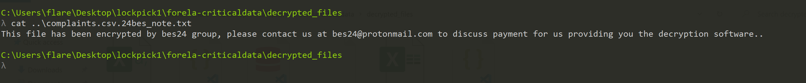

```
bes24@protonmail.com
```

# Task 5

## City of London Police have suspicions of some insider trading taking part within our trading organization. Please confirm the email address of the person with the highest profit percentage in a single trade alongside the profit percentage.

- File will be most probably `trading-firebase_bkup.json` 
- For this task i used `jq` tool which is best for json filtration,
- Here is command i used,

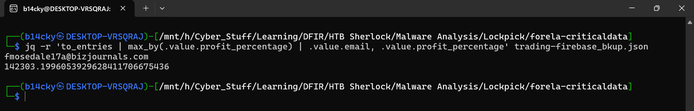

- `to_entries` converts the object into an array of `{key, value}` objects
- `max_by(.value.profit_percentage)` finds the entry with the highest profit percentage
- `.value.email` prints email
- `.value.profit_percentage` prints profit %

```bash
jq -r 'to_entries | max_by(.value.profit_percentage) | .value.email, .value.profit_percentage' trading-firebase_bkup.json
```

```
fmosedale17a@bizjournals.com, 142303.1996053929628411706675436
```

# Task 6

## Our E-Discovery team would like to confirm the IP address detailed in the Sales Forecast log for a user who is suspected of sharing their account with a colleague. Please confirm the IP address for Karylin O'Hederscoll.

- This data will be present on `sales_forecast.xlsx` file,

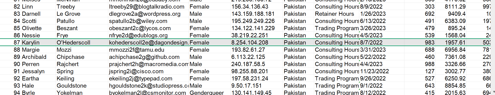

```csv
87,"Karylin","O'Hederscoll","kohederscoll2e@dagondesign.com","Female","8.254.104.208","Pakistan","Consulting Hours","8/7/2022",983,1957.61,503.49,494930.67,1924330.63,1429399.96,415
```

```
8.254.104.208
```

# Task 7

## Which of the following file extensions is not targeted by the malware? `.txt, .sql, .ppt, .pdf, .docx, .xlsx, .csv, .json, .xml`

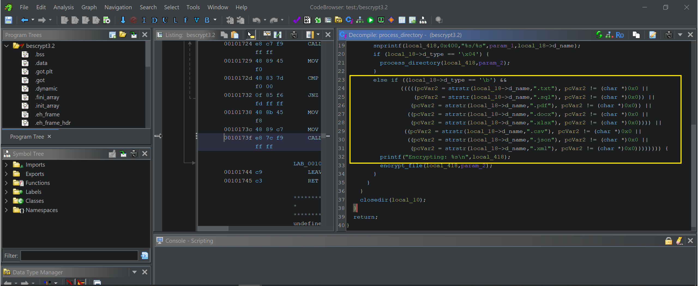

```c
else if ((local_18->d_type == '\b') &&
(((((pcVar2 = strstr(local_18->d_name,".txt"), pcVar2 != (char *)0x0 ||
(pcVar2 = strstr(local_18->d_name,".sql"), pcVar2 != (char *)0x0)) ||
 (pcVar2 = strstr(local_18->d_name,".pdf"), pcVar2 != (char *)0x0)) ||
((pcVar2 = strstr(local_18->d_name,".docx"), pcVar2 != (char *)0x0 ||
 (pcVar2 = strstr(local_18->d_name,".xlsx"), pcVar2 != (char *)0x0)))) ||
 ((pcVar2 = strstr(local_18->d_name,".csv"), pcVar2 != (char *)0x0 ||
((pcVar2 = strstr(local_18->d_name,".json"), pcVar2 != (char *)0x0 ||
 (pcVar2 = strstr(local_18->d_name,".xml"), pcVar2 != (char *)0x0)))))))) {
printf("Encrypting: %s\n",local_418);
```

```
.ppt
```

# Task 8

## We need to confirm the integrity of the files once decrypted. Please confirm the MD5 hash of the applicants DB.

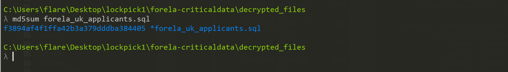

```
f3894af4f1ffa42b3a379dddba384405
```

# Task 9

## We need to confirm the integrity of the files once decrypted. Please confirm the MD5 hash of the trading backup.


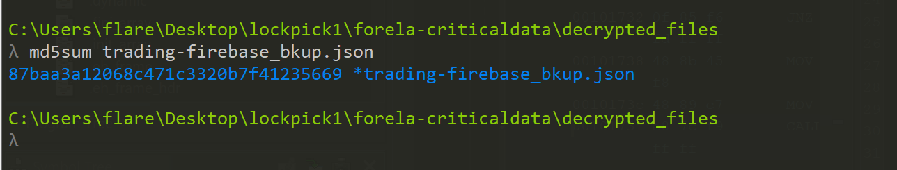

```
87baa3a12068c471c3320b7f41235669
```

# Task 10

## We need to confirm the integrity of the files once decrypted. Please confirm the MD5 hash of the complaints file.


```
c3f05980d9bd945446f8a21bafdbf4e7
```