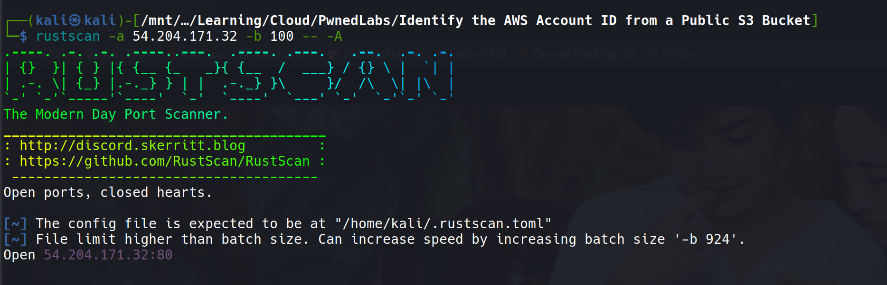

# Scenario

- The ability to expose and leverage even the smallest oversights is a coveted skill in cybersecurity.
- A global Logistics Company has reached out to our cybersecurity firm for assistance and provided the IP address of their website.
- **Objective**: Start the engagement and use this IP address to identify their AWS account ID via a public S3 bucket to commence the enumeration process.

# Real-World Context & Impact

Understanding the significance of AWS Account ID exposure is crucial for both attackers and defenders:

## Attack Vectors with AWS Account ID:

1. **IAM User/Role Enumeration**: Threat actors can identify IAM roles and users tied to the account by exploiting detailed error messages from AWS services
2. **Username/Role Verification**: AWS returns different error messages for non-existent vs. existing usernames/roles, allowing attackers to compile target lists
3. **Public Resource Discovery**: Filter public EBS and RDS snapshots by AWS Account ID ownership
4. **Cross-Account Resource Access**: Attempt to access misconfigured resources that allow cross-account permissions
5. **Social Engineering**: Use legitimate-looking AWS account information for targeted phishing campaigns

## Why This Matters:

- AWS Account IDs are meant to be semi-sensitive identifiers
- Once obtained, they provide a foundation for further AWS-specific reconnaissance
- Many organizations unknowingly expose these through misconfigured S3 buckets, CloudTrail logs, or web applications

# Scanning

## Rust Scan

- Initially attempted to use `rustscan` on the target IP, but the tool became unresponsive and failed to provide nmap output
- This is a common issue with some network configurations or when targets have specific firewall rules

```bash
rustscan -a 54.204.171.32 -b 100 -- -A 
```



## Nmap

- Proceeded with manual nmap scanning to identify open services:

```bash
nmap -T5 -A -p80 -oA nmap/80 54.204.171.32 -Pn
```


**Scan Results Analysis:**

- Target is running Apache HTTP Server version 2.4.52
- Port 80 is open and serving web content
- Used `-Pn` flag to skip host discovery (ping) as the target might be blocking ICMP packets
- The `-A` flag enables OS detection, version detection, script scanning, and traceroute

# AWS Configuration

## Provided Credentials

The engagement provided the following AWS credentials:


- IP address: `54.204.171.32`
- Access key ID: `AKI*****************(All Ready Given)`
- Secret access key: `UdUVhr+voMlt****************************(All Ready Given)`


## AWS CLI Setup

- Installing and configuring AWS CLI with the provided credentials:

```bash
sudo apt install awscli
aws configure 
```


**Configuration Details:**

- Access Key ID: The public identifier for the AWS user
- Secret Access Key: The private key used for authentication
- Default region: Set to us-east-1 (common default)
- Output format: JSON for structured responses

## Credential Verification

- Verifying the credentials are valid and functional:

```bash
aws sts get-caller-identity
```


**Response Analysis:**

```json
{
    "UserId": "AIDAWHEOTHRF62U7I6AWZ",
    "Account": "427648302155",
    "Arn": "arn:aws:iam::427648302155:user/s3user"
}
```

This reveals:

- **UserId**: Unique identifier for the IAM user
- **Account**: AWS Account ID (427648302155) - this is the account that owns these credentials
- **Arn**: Amazon Resource Name showing this is an IAM user named "s3user"

# S3 Bucket Discovery & Enumeration

## Web Application Analysis

- Browsing to the target IP reveals a web application:


## Source Code Inspection

- Examining the HTML source code reveals references to an S3 bucket named `mega-big-tech`:


**Why Check Source Code:**

- Web applications often reference cloud storage directly in HTML/CSS/JavaScript
- S3 bucket names must be globally unique, making them valuable intelligence
- Static assets (images, CSS, JS) are commonly served from S3 buckets

## S3 Bucket Content Enumeration

- Listing files in the discovered S3 bucket:

```bash
aws s3 ls s3://mega-big-tech --recursive --no-sign-request
```


**Command Breakdown:**

- `--recursive`: Lists all objects in subdirectories
- `--no-sign-request`: Attempts anonymous access (for public buckets)
- Results show typical web assets (images, stylesheets)

# Account ID Discovery Challenges

## Initial Research & Attempts

The goal was to find the AWS Account ID associated with the S3 bucket, not just the credentials we were given.

**First Attempt - Manual Techniques:**

- Researched various methodologies for S3 bucket account ID discovery
- Found article: https://tracebit.com/blog/how-to-find-the-aws-account-id-of-any-s3-bucket
- Attempted the suggested scripts but encountered issues

**Second Attempt - Automated Tools:**

- Tried GitHub tool: https://github.com/WeAreCloudar/s3-account-search
- Provided ARN and role information but still encountered problems
- This tool uses IAM role assumption techniques to extract account information

## Learning Moment

- After multiple failed attempts, I consulted writeup hints to understand the correct approach 😗
- This is a common part of the learning process in cybersecurity - sometimes you need guidance to understand advanced techniques

# The Solution - S3 Account Search Tool

## Discovering the Hint

From the lab documentation:

> 💡 The flag in this lab is the AWS account ID associated with the S3 bucket. The IAM user credentials are provided, and the role you can assume is named `arn:aws:iam::427648302155:role/LeakyBucket`

## Understanding the Technique

The technique involves:

1. **IAM Role Assumption**: Using the provided credentials to assume a role
2. **Error Message Analysis**: AWS returns different errors for valid vs. invalid account IDs
3. **Brute Force Enumeration**: Systematically testing account ID possibilities

## Technical Deep Dive: How S3 Account Search Works

The `s3-account-search` tool exploits AWS's verbose error messaging:

1. **Role Assumption Attempt**: Tries to assume a role in different AWS accounts
    
2. **Error Message Analysis**:
    
    - Invalid account ID: "No such account exists"
    - Valid account ID but no permission: "Access denied" or similar
    - Valid account ID with misconfigured permissions: May succeed
3. **Pattern Recognition**: Different AWS services return subtly different error messages that can reveal account existence
    

## Successful Enumeration

```bash
pip install s3-account-search
s3-account-search arn:aws:iam::427648302155:role/LeakyBucket s3://mega-big-tech
```


**Command Explanation:**

- Uses the `LeakyBucket` role in account `427648302155`
- Targets the `mega-big-tech` S3 bucket
- Leverages cross-account role assumption techniques

**Result:**

```yml
AccountId: 107513503799
```

# Technical Analysis: Why This Works

## AWS IAM Role Assumption Process

1. **Cross-Account Roles**: AWS allows roles to be assumed across account boundaries
2. **Trust Policies**: The `LeakyBucket` role likely has a trust policy allowing the `s3user` to assume it
3. **Error Enumeration**: The tool exploits differences in AWS error responses to identify valid account IDs

### The Vulnerability Chain

1. **Exposed Credentials**: IAM user credentials available in the engagement
2. **Permissive Role Trust Policy**: The `LeakyBucket` role allows assumption from our user
3. **Verbose Error Messages**: AWS provides enough detail in errors to enumerate account IDs
4. **S3 Bucket Metadata**: The bucket's true owner (account ID) is discoverable through this process
