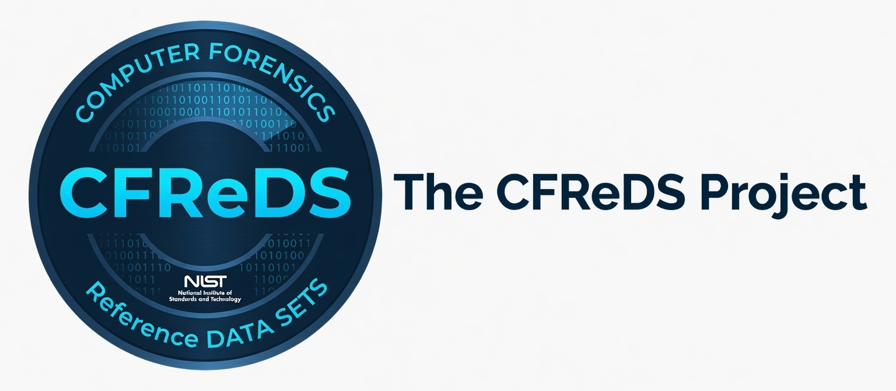

# Disk & Image Verification

## What are the hash values (MD5 & SHA-1) of all images?

## Does the acquisition and verification hash value match?

| Artifact     | Type            | MD5                                | SHA-1                                      | Notes                 |
| ------------ | --------------- | ---------------------------------- | ------------------------------------------ | --------------------- |
| PC           | System          | `A49D1254C873808C58E6F1BCD60B5BDE` | `AFE5C9AB487BD47A8A9856B1371C2384D44FD785` | Primary system image  |
| RM#2         | Removable Media | `B4644902ACAB4583A1D0F9F1A08FAA77` | `048961A85CA3ECED8CC73F1517442D31D4DCA0A3` | USB / external device |
| RM#3 (Type1) | Removable Media | `858C7250183A44DD83EB706F3F178990` | `471D3EEDCA9ADD872FC0708297284E1960FF44F8` | Same as Type2         |
| RM#3 (Type2) | Removable Media | `858C7250183A44DD83EB706F3F178990` | `471D3EEDCA9ADD872FC0708297284E1960FF44F8` | Duplicate of Type1    |
| RM#3 (Type3) | Removable Media | `DF914108FB3D86744EB688EBA482FBDF` | `7F3C2EB1F1E2DB97BE6E963625402A0E362A532C` | Different dataset     |

| Image File                              | MD5                                | SHA-256                                                            |
| --------------------------------------- | ---------------------------------- | ------------------------------------------------------------------ |
| cfreds_2015_data_leakage_pc.E01         | `7338dbed7d2293334801416613bc17b5` | `e6365e44f1004252171acb73e6779be05277cbd57d09d7febed22d2463a956a9` |
| cfreds_2015_data_leakage_pc.E02         | `51675274ad9eb6a15d0e562d10a4913f` | `3bc1c1cab227031e0a209972511d1e030f7cb60b76a89db0db7b412f56b660df` |
| cfreds_2015_data_leakage_pc.E03         | `7a21bf1b6db3ce433c55ac76749f12d9` | `f45a0cd89b1f1a6a805771014f2dcef42497ba421c7edf1597ee50b5ca6c0b3c` |
| cfreds_2015_data_leakage_pc.E04         | `62f6cce2ec9e1b1f7a21cef0d12e0e38` | `33cd294e44be91c5147296675fdbb40c270471480c4a1998d3a59fea3d944099` |
| cfreds_2015_data_leakage_rm#1.E01       | `7cd7bc148d3a1e5f329cb3580d4d4f8f` | `a14150a21bc1e3700b51912c2ab20cd9587ad3e27ee67475af64508a7e760121` |
| cfreds_2015_data_leakage_rm#2.E01       | `6cfbfdb14e0a504684a338b87362d753` | `25215f9bcb51ceee9147886ed3f5c13ef148de634fc5114491e0f8dad8b15696` |
| cfreds_2015_data_leakage_rm#3_type3.E01 | `b49cb0c7dfccb8cd0e39424e3f1abc86` | `336e1307721ef5f63679379961d1716b74f986e69df8c40117d9cea7858d512b` |

# Partition & System Information

## Identify the partition information of PC image.


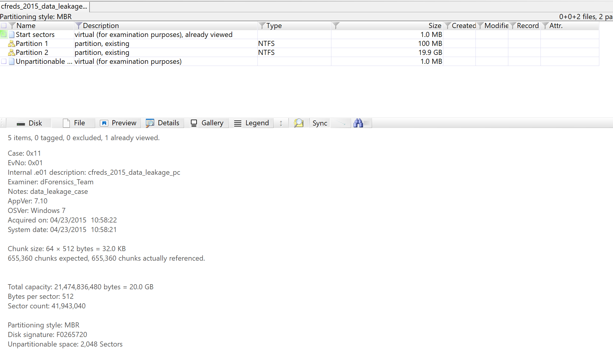

| No. | Bootable | File System | Start Sector | Total Sectors | Size    |
| --- | -------- | ----------- | ------------ | ------------- | ------- |
| 1   |          | NTFS        | 2,048        | 204,800       | 100 MB  |
| 2   | *        | NTFS        | 206,848      | 41,734,144    | 19.9 GB |

## Explain installed OS information in detail. (OS name, install date, registered owner…)

### System Registry Hives

| Hive Name | File Path                           | SHA-256 Hash                                                     |
| --------- | ----------------------------------- | ---------------------------------------------------------------- |
| SYSTEM    | C:\Windows\System32\config\SYSTEM   | e896ef300843a3efd1c1f96b25fd2b209cd1ad28d653ab6bc05699f910bbd3d1 |
| SOFTWARE  | C:\Windows\System32\config\SOFTWARE | 03422334efaca3c9cd2657518b5706fb9ef42ef7abe49cc3dddaa98dabb394ac |
| SAM       | C:\Windows\System32\config\SAM      | 6aecc0b2b5fb86a71498cb688bb59df43f85547723bff898a534fadef26c428f |
| SECURITY  | C:\Windows\System32\config\SECURITY | 1170568731c717d4d8c84ae52bd9ade737c3b0d4173127c68c3cc2ea8ff3b143 |

### User Registry Hives

| User      | File Name               | SHA-256 Hash                                                     |
| --------- | ----------------------- | ---------------------------------------------------------------- |
| admin11   | admin11_NTUSER.DAT      | b8e18d84ad84735998805a25e22ae7b3c696aba2ff36c73a1e294862805aaf4c |
| informant | informant_NTUSER.DAT    | 2190b57e2908d36f835589cc530c8c471ea48952f8edea70cc91488d9b5d1f64 |
| temporary | tamporary_NTUSER.DAT    | 0edc2037f4daf584f4142808aa52863262af746aa9ac2f1d415f5cc102649297 |
| admin11   | admin11_UsrClass.dat    | d3a120dfd44e275dfd16ecec14da3d770e462cf8966e740c812e6f9c5492a648 |
| informant | informant_UsrClass.dat  | a26fe02da57e6c84a911edf9dd39021ecf200d66d168841331dae0be9dd2f1b7 |
| temporary | tamporary_UsrClass.datT | d36330d2553c21e3df4708fc3d88d1ae1542be8c1c5154676994e92820e1c231 |


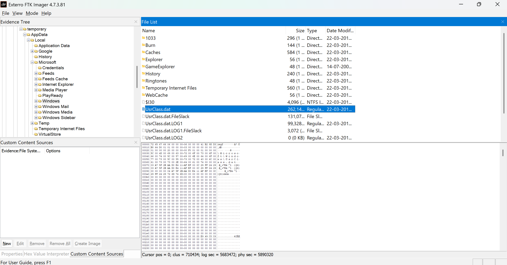

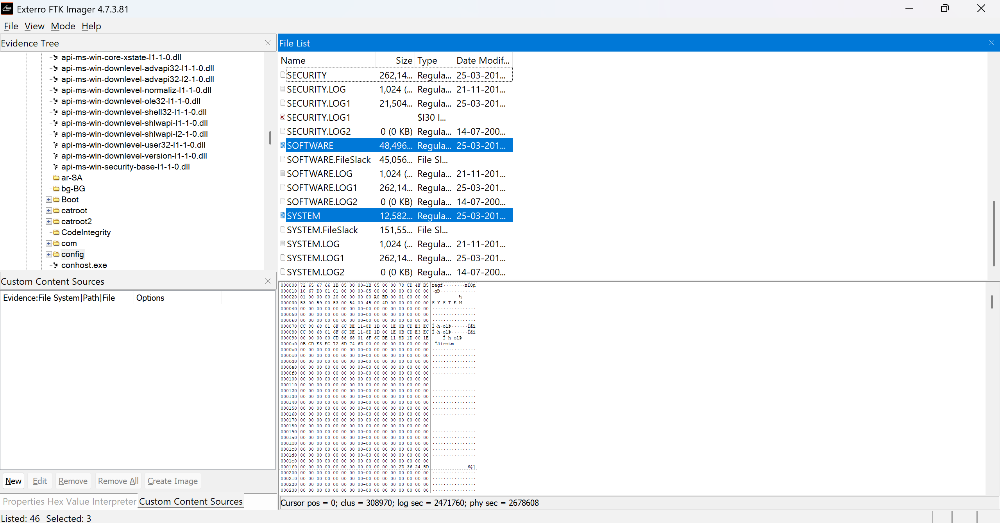

- Opened the `SOFTWARE` hive in `RegExplorer`,
- `HKLM\SOFTWARE\Microsoft\Windows NT\CurrentVersion`

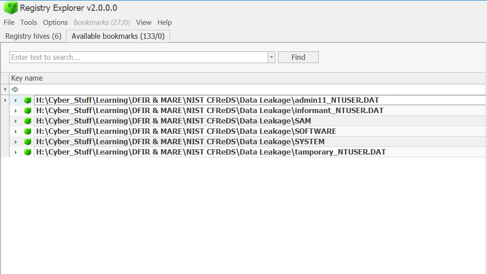

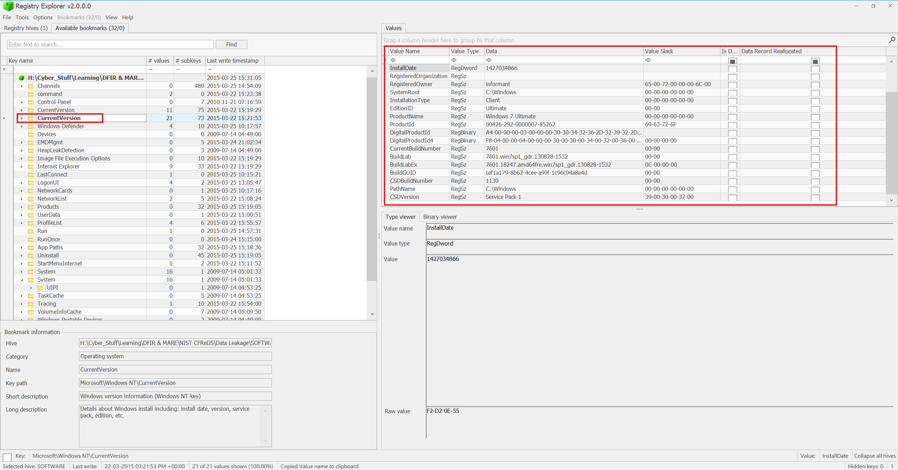

### Installed OS Information

| Field                   | Value                        |
| ----------------------- | ---------------------------- |
| OS Name                 | Windows 7 Ultimate           |
| Edition                 | Ultimate                     |
| Version                 | 6.1                          |
| Build Number            | 7601                         |
| Service Pack            | Service Pack 1               |
| Architecture            | Multiprocessor Free (64-bit) |
| Installation Type       | Client                       |
| System Root             | C:\Windows                   |
| Registered Owner        | informant                    |
| Registered Organization | —                            |
| Product ID              | 00426-292-0000007-85262      |

## What is the time zone setting?

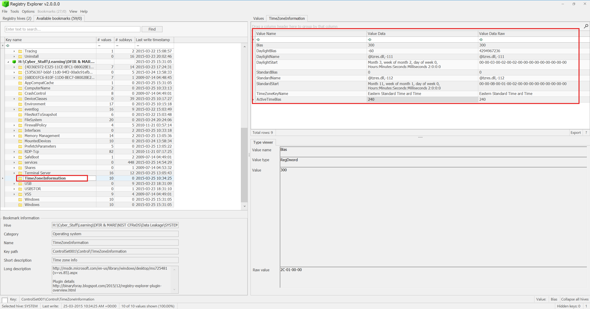

- `HKLM\SYSTEM\ControlSet###\Control\TimeZoneInformation`

### Time Zone Configuration

| Field             | Value                 |
| ----------------- | --------------------- |
| Time Zone Name    | Eastern Standard Time |
| Bias (UTC Offset) | UTC -5 hours          |
| Active Bias       | UTC -4 hours          |
| Standard Bias     | 0                     |
| Daylight Bias     | -60 minutes           |
### Daylight Saving Time (DST) Rules

| Setting   | Value                           |
| --------- | ------------------------------- |
| DST Start | 2nd Sunday of March at 02:00    |
| DST End   | 1st Sunday of November at 02:00 |
### Raw Interpretation (Important for Report)

| Registry Field       | Meaning                                  |
| -------------------- | ---------------------------------------- |
| Bias = 300           | Base offset = UTC -5 hours (300 minutes) |
| DaylightBias = -60   | DST adjustment = -1 hour → UTC -4        |
| ActiveTimeBias = 240 | System was in DST at acquisition time    |
| StandardStart        | DST ends → November                      |
| DaylightStart        | DST begins → March                       |
## What is the computer name?

- `HKLM\SYSTEM\ControlSet###\Control\ComputerName\ComputerName
- `HKLM\SYSTEM\ControlSet###\Services\Tcpip\Parameters

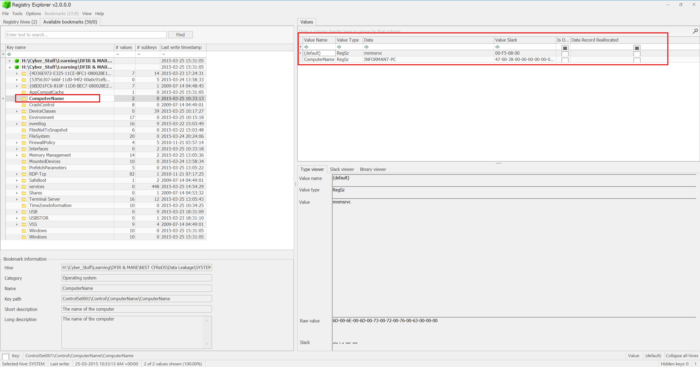

| Registry Value | Data         | Purpose                            |
| -------------- | ------------ | ---------------------------------- |
| ComputerName   | INFORMANT-PC | Primary system name                |
| Hostname       | informant-PC | Network hostname                   |
| NV Hostname    | informant-PC | Persistent hostname (non-volatile) |
# User Accounts & Activity

## List all accounts in OS except system accounts. (Account name, login count, last logon date…)

- `HKLM\SAM\USERS`

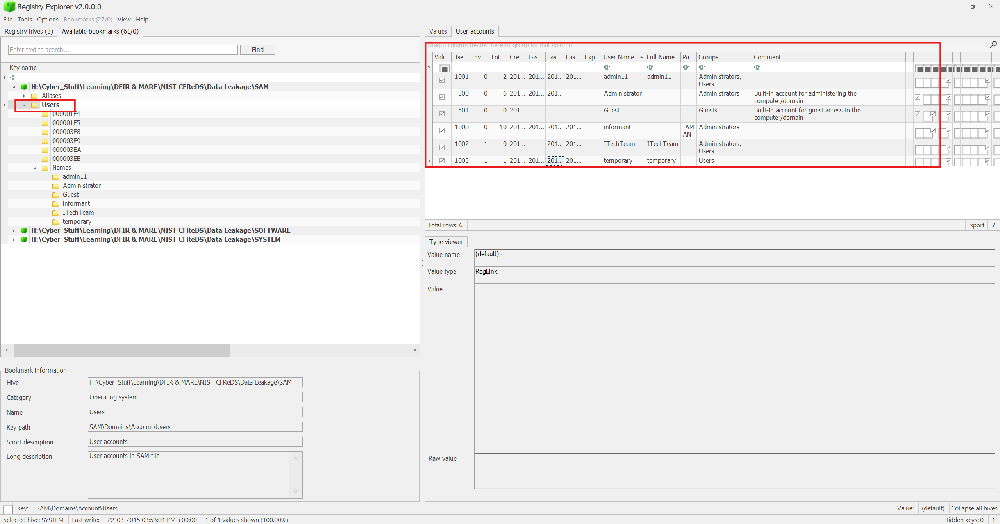

| User Name | User ID (RID) | Total Login Count | Last Logon Time     | Created On          | Last Password Change | Invalid Login Count |
| --------- | ------------- | ----------------- | ------------------- | ------------------- | -------------------- | ------------------- |
| informant | 1000          | 10                | 2015-03-25 14:45:59 | 2015-03-22 14:33:54 | 2015-03-22 14:33:54  | 0                   |
| admin11   | 1001          | 2                 | 2015-03-22 15:57:02 | 2015-03-22 15:51:54 | 2015-03-22 15:52:10  | 0                   |
| ITechTeam | 1002          | 0                 | —                   | 2015-03-22 15:52:30 | 2015-03-22 15:52:45  | 1                   |
| temporary | 1003          | 1                 | 2015-03-22 15:55:57 | 2015-03-22 15:53:01 | 2015-03-22 15:53:11  | 1                   |

## Who was the last user to logon into PC?

| User Name | User ID (RID) | Total Login Count | Last Logon Time     | Created On          | Last Password Change | Invalid Login Count |
| --------- | ------------- | ----------------- | ------------------- | ------------------- | -------------------- | ------------------- |
| informant | 1000          | 10                | 2015-03-25 14:45:59 | 2015-03-22 14:33:54 | 2015-03-22 14:33:54  | 0                   |

## When was the last recorded shutdown date/time?

- `HKLM\SYSTEM\ControlSet###\Control\Windows (value: ShutdownTime)`

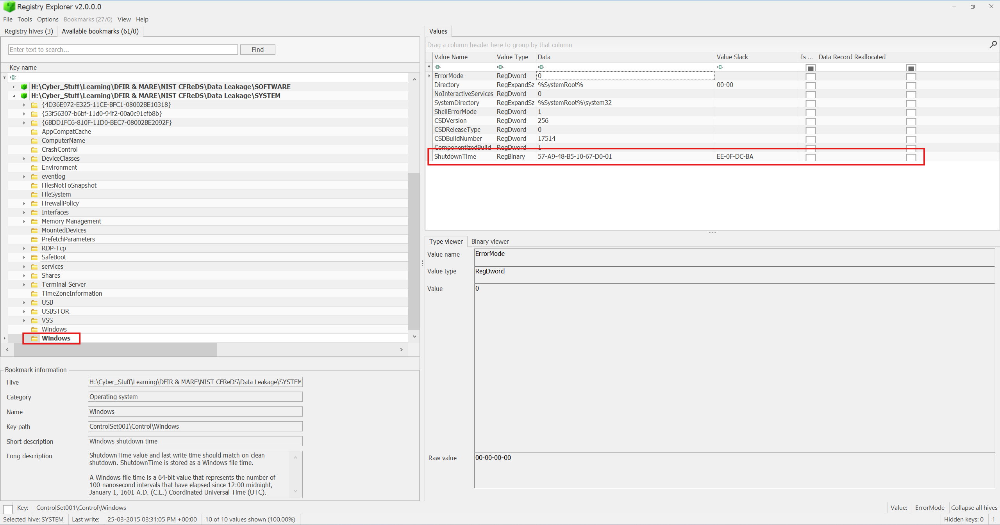

### Raw Value

```bash
57-A9-48-B5-10-67-D0-01
```

- This is a **Windows FILETIME** (little-endian, 64-bit).

| Field                          | Value               |
| ------------------------------ | ------------------- |
| Last Shutdown Time (UTC)       | 2015-03-25 15:31:05 |
| Time zone Applied (EDT, UTC-4) | 2015-03-25 11:31:05 |

# Network Information

## Explain network interface(s) with DHCP assigned IP.

- `HKLM\System\ControlSet00x\Services\Tcpip\Parameters\Interfaces\{GUID}`

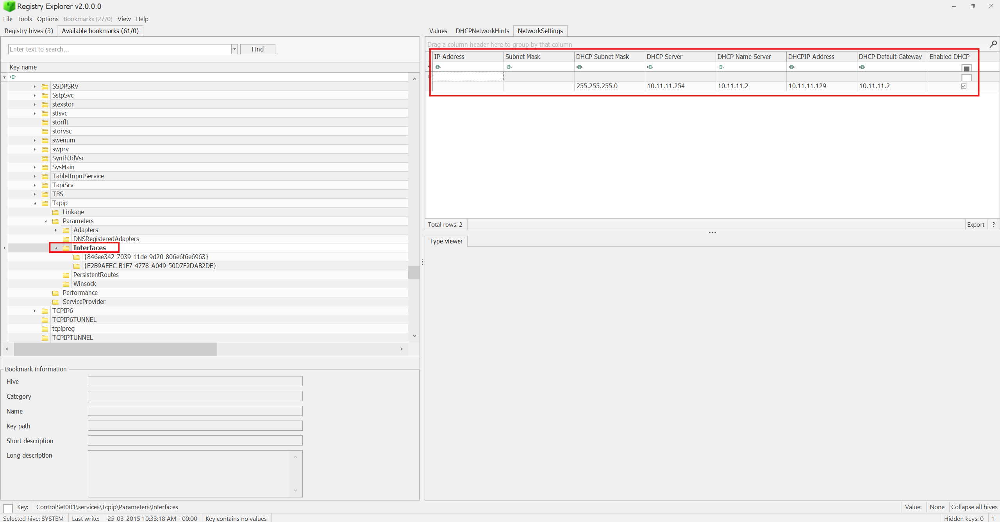

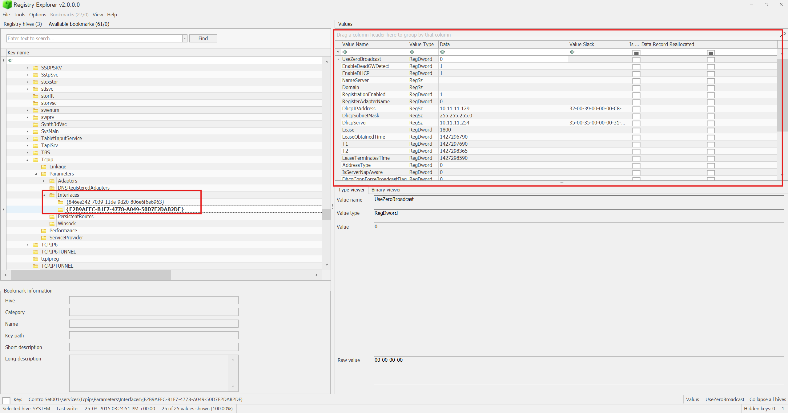

### Network Interface (DHCP Assigned)

| Field           | Value         |
| --------------- | ------------- |
| IP Address      | 10.11.11.129  |
| Subnet Mask     | 255.255.255.0 |
| Default Gateway | 10.11.11.2    |
| DHCP Server     | 10.11.11.254  |
| DNS Server      | 10.11.11.2    |
| Domain          | localdomain   |
| DHCP Enabled    | Yes           |
### DHCP Lease Information

| Field          | Value                     |
| -------------- | ------------------------- |
| Lease Obtained | 2015-03-25 13:59:50       |
| Lease Expiry   | 2015-03-25 14:29:50       |
| Lease Duration | 1800 seconds (30 minutes) |
# Applications & Execution

## What applications were installed by the suspect after installing OS?

-  `HKLM\SOFTWARE\Microsoft\Windows\CurrentVersion\Uninstall`
- **64-bit Systems:** `HKLM\SOFTWARE\WOW6432Node\Microsoft\Windows\CurrentVersion\Uninstall`

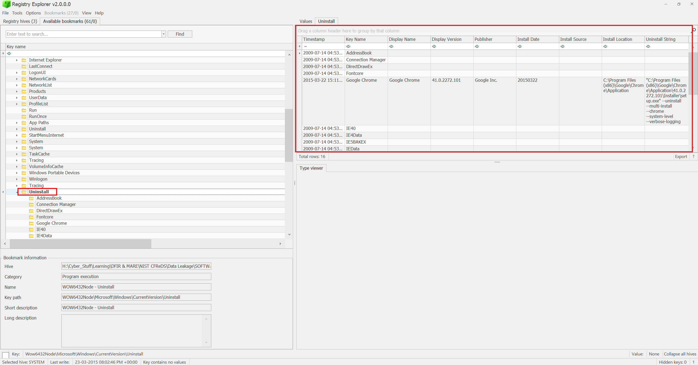

| Timestamp           | Key Name                               | Display Name              | Version        | Publisher    | Install Date | Install Source                                                                                                                                                             | Install Location                                     | Uninstall String                                                                                                                                           |
| ------------------- | -------------------------------------- | ------------------------- | -------------- | ------------ | ------------ | -------------------------------------------------------------------------------------------------------------------------------------------------------------------------- | ---------------------------------------------------- | ---------------------------------------------------------------------------------------------------------------------------------------------------------- |
| 2009-07-14 04:53:25 | AddressBook                            | —                         | —              | —            | —            | —                                                                                                                                                                          | —                                                    | —                                                                                                                                                          |
| 2009-07-14 04:53:25 | Connection Manager                     | —                         | —              | —            | —            | —                                                                                                                                                                          | —                                                    | —                                                                                                                                                          |
| 2009-07-14 04:53:25 | DirectDrawEx                           | —                         | —              | —            | —            | —                                                                                                                                                                          | —                                                    | —                                                                                                                                                          |
| 2009-07-14 04:53:25 | Fontcore                               | —                         | —              | —            | —            | —                                                                                                                                                                          | —                                                    | —                                                                                                                                                          |
| 2015-03-22 15:11:51 | Google Chrome                          | Google Chrome             | 41.0.2272.101  | Google Inc.  | 20150322     | —                                                                                                                                                                          | C:\Program Files (x86)\Google\Chrome\Application     | "C:\Program Files (x86)\Google\Chrome\Application\41.0.2272.101\Installer\setup.exe" --uninstall --multi-install --chrome --system-level --verbose-logging |
| 2009-07-14 04:53:25 | IE40                                   | —                         | —              | —            | —            | —                                                                                                                                                                          | —                                                    | —                                                                                                                                                          |
| 2009-07-14 04:53:25 | IE4Data                                | —                         | —              | —            | —            | —                                                                                                                                                                          | —                                                    | —                                                                                                                                                          |
| 2009-07-14 04:53:25 | IE5BAKEX                               | —                         | —              | —            | —            | —                                                                                                                                                                          | —                                                    | —                                                                                                                                                          |
| 2009-07-14 04:53:25 | IEData                                 | —                         | —              | —            | —            | —                                                                                                                                                                          | —                                                    | —                                                                                                                                                          |
| 2009-07-14 04:53:25 | MobileOptionPack                       | —                         | —              | —            | —            | —                                                                                                                                                                          | —                                                    | —                                                                                                                                                          |
| 2009-07-14 04:53:25 | SchedulingAgent                        | —                         | —              | —            | —            | —                                                                                                                                                                          | —                                                    | —                                                                                                                                                          |
| 2009-07-14 04:53:25 | WIC                                    | —                         | —              | —            | —            | —                                                                                                                                                                          | —                                                    | —                                                                                                                                                          |
| 2015-03-22 15:16:03 | {60EC980A-BDA2-4CB6-A427-B07A5498B4CA} | Google Update Helper      | 1.3.26.9       | Google Inc.  | 20150322     | C:\Program Files (x86)\Google\Update\1.3.26.9\|—                                                                                                                           | MsiExec.exe /I{60EC980A-BDA2-4CB6-A427-B07A5498B4CA} |                                                                                                                                                            |
| 2015-03-23 20:02:46 | {6C36881B-0E51-4231-9D02-BF2149664D34} | Google Drive              | 1.20.8672.3137 | Google, Inc. | 20150323     | C:\Program Files (x86)\Google\Update\Install{FADF8BBF-DB89-448E-BC51-AFDB1CF3B0D1}\|—                                                                                      | MsiExec.exe /X{6C36881B-0E51-4231-9D02-BF2149664D34} |                                                                                                                                                            |
| 2015-03-23 20:00:45 | {78002155-F025-4070-85B3-7C0453561701} | Apple Application Support | 3.0.6          | Apple Inc.   | 20150323     | C:\Users\INFORM~1\AppData\Local\Temp\IXP374.TMP\|C:\Program Files (x86)\Common Files\Apple\Apple Application Support\|MsiExec.exe /I{78002155-F025-4070-85B3-7C0453561701} |                                                      |                                                                                                                                                            |
| 2015-03-23 20:01:01 | {789A5B64-9DD9-4BA5-915A-F0FC0A1B7BFE} | Apple Software Update     | 2.1.3.127      | Apple Inc.   | 20150323     | C:\Users\INFORM~1\AppData\Local\Temp\IXP374.TMP\|C:\Program Files (x86)\Apple Software Update\|MsiExec.exe /I{789A5B64-9DD9-4BA5-915A-F0FC0A1B7BFE}                        |                                                      |                                                                                                                                                            |

## List application execution logs. (Executable path, execution time, execution count...)


| Artifact Type                         | Source Type | Location / Registry Path                                                                             | Data Extracted                                                |
| ------------------------------------- | ----------- | ---------------------------------------------------------------------------------------------------- | ------------------------------------------------------------- |
| Windows Prefetch                      | File        | `C:\Windows\Prefetch\*.pf`                                                                           | Executable file paths, execution timestamps, execution counts |
| IconCache                             | File        | `C:\Users\informant\AppData\Local\IconCache.db`                                                      | Executable file paths, associated icon images                 |
| UserAssist                            | Registry    | `HKU\informant\Software\Microsoft\Windows\CurrentVersion\Explorer\UserAssist\*\Count\`               | Executable file paths, execution timestamps, execution counts |
| Application Compatibility (Shimcache) | Registry    | `HKLM\SYSTEM\ControlSet###\Control\Session Manager\AppCompatCache\`                                  | Executable file paths, last modified timestamps               |
| Application Compatibility Cache       | Registry    | `HKU\informant\Software\Microsoft\Windows NT\CurrentVersion\AppCompatFlags\Compatibility Assistant\` | Executable file paths, last modified timestamps               |
| MuiCache                              | Registry    | `HKU\informant\Software\Classes\Local-Settings\Software\Microsoft\Windows\Shell\MuiCache\`           | Executable file paths                                         |

- UserAssist

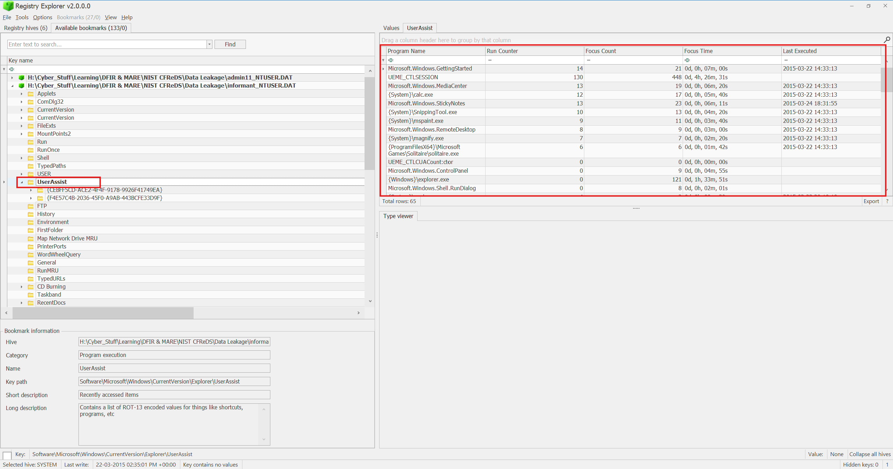

- Application Compatibility (`Shimcache`)

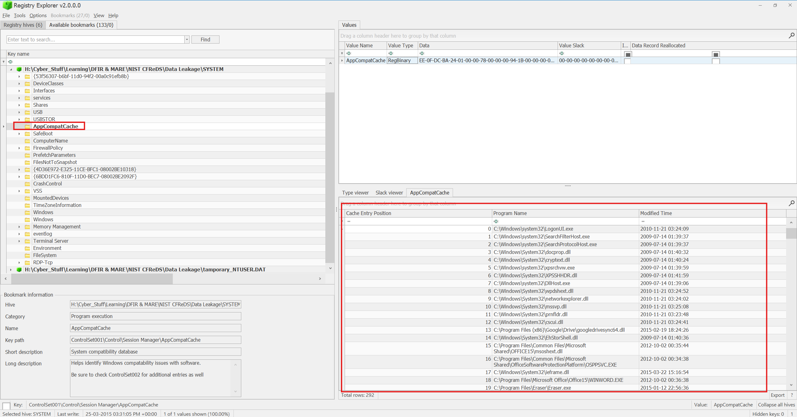

- Application Compatibility Cache

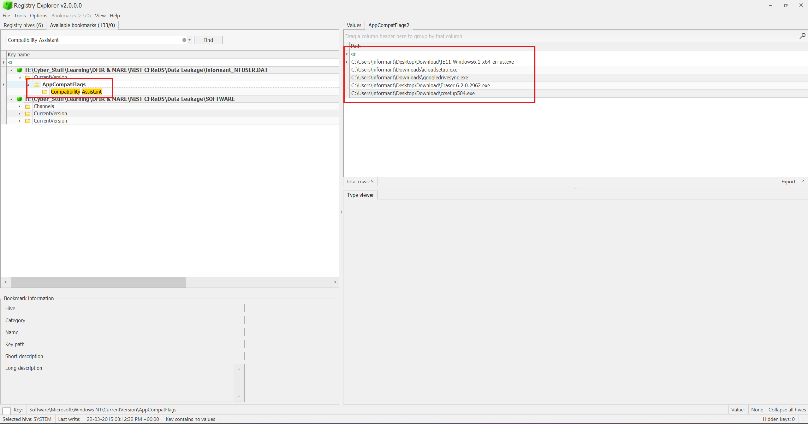

- (Some Windows executables and duplicated items are excluded)
- Execution Count may not be accurate. 
- Timestamps of `UserAssist` and `Prefetch`: Execution Time
- Timestamps of `Shimcache`: Last Modified Time from filesystem metadata

| Timestamp           | Execution Path                                                                           | Count | Source     |
| ------------------- | ---------------------------------------------------------------------------------------- | ----- | ---------- |
| 2015-03-22 11:11:04 | C:\Users\informant\Desktop\temp\IE11-Windows6.1-x64-en-us.exe                            | N/A   | ShimCache  |
| 2015-03-22 11:11:04 | C:\Users\informant\Desktop\Download\IE11-Windows6.1-x64-en-us.exe                        | N/A   | ShimCache  |
| 2015-03-22 11:12:32 | C:\Users\informant\Desktop\Download\IE11-Windows6.1-x64-en-us.exe                        | 1     | UserAssist |
| 2015-03-23 15:56:33 | C:\Users\informant\Downloads\googledrivesync.exe                                         | N/A   | ShimCache  |
| 2015-03-23 15:56:33 | C:\Users\informant\Downloads\icloudsetup.exe                                             | N/A   | ShimCache  |
| 2015-03-23 15:56:33 | C:\Users\INFORM~1\AppData\Local\Temp\GUMA150.tmp\GoogleUpdateSetup.exe                   | N/A   | ShimCache  |
| 2015-03-23 16:00:59 | C:\Windows\Installer{GUID}\AppleSoftwareUpdateIco.exe                                    | N/A   | ShimCache  |
| 2015-03-23 16:02:07 | C:\Users\INFORM~1\AppData\Local\Temp\GUMA150.tmp\GoogleUpdate.exe                        | N/A   | ShimCache  |
| 2015-03-23 16:02:09 | C:\Program Files (x86)\GUMA94B.tmp\GoogleUpdate.exe                                      | N/A   | ShimCache  |
| 2015-03-23 16:26:50 | C:\Program Files\Microsoft Office\Office15\EXCEL.EXE                                     | 1     | UserAssist |
| 2015-03-23 16:27:33 | C:\Program Files\Microsoft Office\Office15\POWERPNT.EXE                                  | 2     | UserAssist |
| 2015-03-24 14:29:07 | C:\Program Files\Microsoft Games\Solitaire\solitaire.exe                                 | 1     | Prefetch   |
| 2015-03-24 14:31:55 | C:\Windows\System32\StikyNot.exe                                                         | 2     | Prefetch   |
| 2015-03-24 14:31:55 | Microsoft.Windows.StickyNotes                                                            | 13    | UserAssist |
| 2015-03-24 17:05:38 | C:\Program Files (x86)\Google\Chrome\Application\chrome.exe                              | 71    | Prefetch   |
| 2015-03-25 10:41:03 | C:\Program Files\Microsoft Office\Office15\OUTLOOK.EXE                                   | 1     | Prefetch   |
| 2015-03-25 10:41:03 | C:\Program Files\Microsoft Office\Office15\OUTLOOK.EXE                                   | 5     | UserAssist |
| 2015-03-25 10:42:47 | C:\Program Files (x86)\Windows Media Player\wmplayer.exe                                 | 1     | Prefetch   |
| 2015-03-25 10:42:47 | Microsoft.Windows.MediaPlayer32                                                          | 1     | UserAssist |
| 2015-03-25 10:47:40 | C:\Users\informant\Desktop\Download\Eraser 6.2.0.2962.exe                                | N/A   | ShimCache  |
| 2015-03-25 10:48:28 | C:\Users\informant\Desktop\Download\ccsetup504.exe                                       | N/A   | ShimCache  |
| 2015-03-25 10:50:14 | C:\Users\informant\Desktop\Download\Eraser 6.2.0.2962.exe                                | 1     | Prefetch   |
| 2015-03-25 10:50:14 | C:\Users\informant\Desktop\Download\Eraser 6.2.0.2962.exe                                | 1     | UserAssist |
| 2015-03-25 10:50:15 | C:\Users\INFORM~1\AppData\Local\Temp\eraserInstallBootstrapper\dotNetFx40_Full_setup.exe | N/A   | ShimCache  |
| 2015-03-25 10:50:15 | C:\Users\INFORM~1\AppData\Local\Temp\eraserInstallBootstrapper\dotNetFx40_Full_setup.exe | 1     | Prefetch   |
| 2015-03-25 10:57:56 | C:\Users\informant\Desktop\Download\ccsetup504.exe                                       | 1     | Prefetch   |
| 2015-03-25 10:57:56 | C:\Users\informant\Desktop\Download\ccsetup504.exe                                       | 1     | UserAssist |
| 2015-03-25 11:12:28 | C:\Program Files\Eraser\Eraser.exe                                                       | 1     | UserAssist |
| 2015-03-25 11:13:30 | C:\Program Files\Eraser\Eraser.exe                                                       | 2     | Prefetch   |
| 2015-03-25 11:15:50 | C:\Program Files\CCleaner\CCleaner64.exe                                                 | 1     | UserAssist |
| 2015-03-25 11:15:50 | C:\Program Files\CCleaner\CCleaner64.exe                                                 | 2     | Prefetch   |
| 2015-03-25 11:16:00 | C:\Program Files (x86)\Google\Update\GoogleUpdate.exe                                    | 38    | Prefetch   |
| 2015-03-25 11:18:29 | C:\Program Files\CCleaner\uninst.exe                                                     | 1     | Prefetch   |
| 2015-03-25 11:21:30 | C:\Program Files (x86)\Google\Drive\googledrivesync.exe                                  | 1     | UserAssist |
| 2015-03-25 11:21:31 | C:\Program Files (x86)\Google\Drive\googledrivesync.exe                                  | 2     | Prefetch   |
| 2015-03-25 11:22:06 | C:\Program Files\Internet Explorer\iexplore.exe                                          | 2     | Prefetch   |
| 2015-03-25 11:22:07 | C:\Program Files (x86)\Internet Explorer\iexplore.exe                                    | 14    | Prefetch   |
| 2015-03-25 11:24:48 | C:\Program Files\Microsoft Office\Office15\WINWORD.EXE                                   | 3     | Prefetch   |
| 2015-03-25 11:24:48 | C:\Program Files\Microsoft Office\Office15\WINWORD.EXE                                   | 4     | UserAssist |
| 2015-03-25 11:28:47 | C:\Windows\System32\xpsrchvw.exe                                                         | 1     | Prefetch   |
| 2015-03-25 11:28:47 | C:\Windows\System32\xpsrchvw.exe                                                         | 1     | UserAssist |

# System Activity Timeline

## List all traces about the system on/off and the user logon/logoff. (Time range: 09:00–18:00)

- For this task, we have to carve all the `Event logs` from `C:\Windows\System32\winevt\Logs\*`,
- So i carved all the logs include important one,
	- `Application.evtx`
	- `Security.evtx`
	- `System.evtx`
	- `Setup.evtx`
- Parse all the important logs and convert it to csv using [EvtxeCmd](https://github.com/EricZimmerman/evtx) tool.

```bash
EvtxECmd.exe -f "Evtx Logs\<LogFileName>.evtx" --csv <DirectoryName>
```

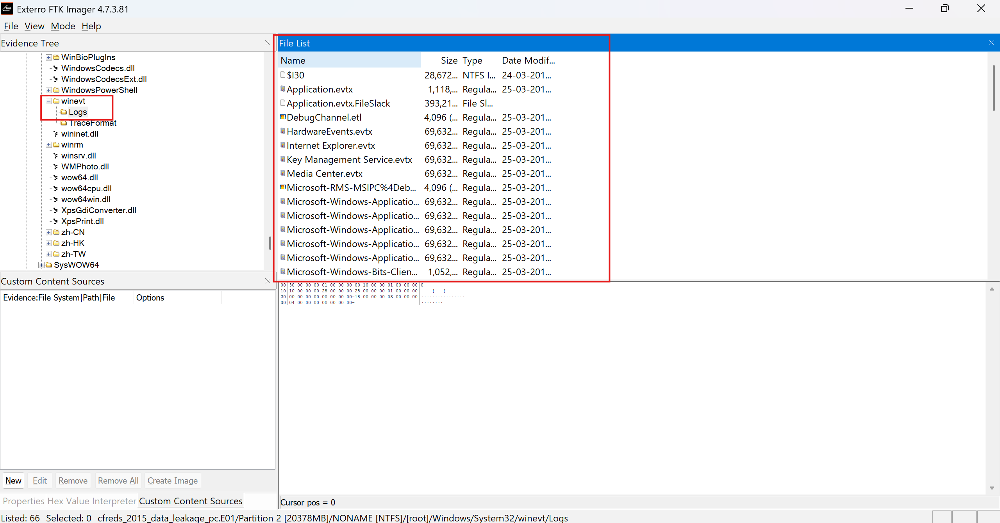

- Now we can analyze it using [Timeline Explorer](https://ericzimmerman.github.io/#forensic-tools), 


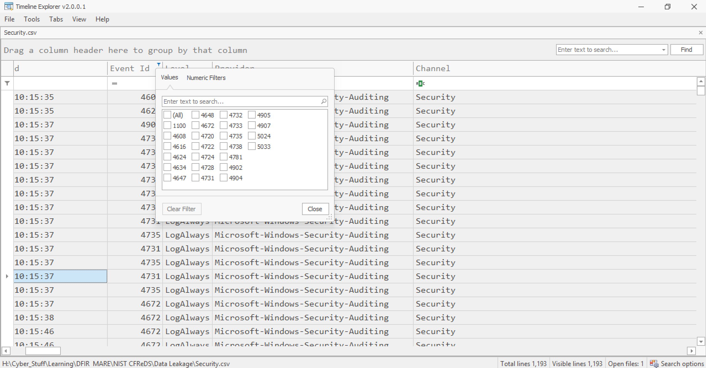

### Core Logon / System Events (your timeline ones)

| Event ID | Meaning                           | DFIR Insight                                          |
| -------- | --------------------------------- | ----------------------------------------------------- |
| **4608** | Windows is starting up            | System boot — start of activity window                |
| **4624** | Successful logon                  | User/session access (interactive, RDP, service, etc.) |
| **4634** | Logoff (session ended)            | Session terminated (not always user-initiated)        |
| **4647** | User initiated logoff             | Clean logoff (user clicked sign out)                  |
| **4637** | User account logoff (token ended) | Less common, system-driven logoff                     |
| **1100** | Event logging service shutdown    | System shutdown (or logging stopped)                  |

### Authentication / Credential / Privilege Events

| Event ID                           | Meaning                          | DFIR Insight                         |
| ---------------------------------- | -------------------------------- | ------------------------------------ |
| **4648**                           | Logon using explicit credentials | `runas`, lateral movement indicator  |
| **4672**                           | Special privileges assigned      | Admin/root-level login important     |
| **4673**                           | Privileged service called        | Sensitive API usage                  |
| **4674**                           | Operation on privileged object   | Access to sensitive system resources |
| **4625** (not shown but important) | Failed logon                     | Brute force / incorrect creds        |

### Account & Policy Changes

| Event ID | Meaning                   | DFIR Insight                   |
| -------- | ------------------------- | ------------------------------ |
| **4720** | User account created      | Persistence / attacker account |
| **4722** | Account enabled           | Re-activation                  |
| **4724** | Password reset attempt    | Possible takeover              |
| **4728** | Added to privileged group | Privilege escalation           |
| **4732** | Added to local group      | Local privilege change         |
| **4733** | Removed from group        | Cleanup / stealth              |
| **4735** | Group changed             | Membership modification        |
| **4738** | User account changed      | Attribute change               |


### System & Logon/Logoff Event Timeline

| Time Generated      | Event ID | Description |
| ------------------- | -------- | ----------- |
| 2015-03-22 10:51:14 | 4608     | Starting up |
| 2015-03-22 11:00:08 | 4624     | Logon       |
| 2015-03-22 11:22:54 | 4624     | Logon       |
| 2015-03-22 12:00:08 | 4647     | Logoff      |
| 2015-03-22 12:00:09 | 1100     | Shutdown    |
| 2015-03-23 13:24:23 | 4608     | Starting up |
| 2015-03-23 13:24:23 | 4624     | Logon       |
| 2015-03-23 14:36:07 | 4624     | Logon       |
| 2015-03-23 16:00:22 | 4624     | Logon       |
| 2015-03-23 16:01:02 | 4624     | Logon       |
| 2015-03-23 17:02:53 | 4647     | Logoff      |
| 2015-03-23 17:02:59 | 1100     | Shutdown    |
| 2015-03-24 09:21:29 | 4608     | Starting up |
| 2015-03-24 09:21:29 | 4624     | Logon       |
| 2015-03-24 09:23:40 | 4624     | Logon       |
| 2015-03-24 11:14:30 | 4624     | Logon       |
| 2015-03-24 11:22:39 | 4624     | Logon       |
| 2015-03-24 11:46:14 | 4624     | Logon       |
| 2015-03-24 14:28:38 | 4624     | Logon       |
| 2015-03-24 16:58:52 | 4624     | Logon       |
| 2015-03-24 17:07:25 | 4647     | Logoff      |
| 2015-03-24 17:07:26 | 1100     | Shutdown    |
| 2015-03-25 09:05:41 | 4608     | Starting up |
| 2015-03-25 09:05:41 | 4624     | Logon       |
| 2015-03-25 09:07:49 | 4624     | Logon       |
| 2015-03-25 09:23:59 | 4624     | Logon       |
| 2015-03-25 10:31:53 | 4624     | Logon       |
| 2015-03-25 10:45:59 | 4637     | Logoff      |
| 2015-03-25 10:50:28 | 4624     | Logon       |
| 2015-03-25 10:50:30 | 4624     | Logon       |
| 2015-03-25 10:50:50 | 4624     | Logon       |
| 2015-03-25 10:56:55 | 4624     | Logon       |
| 2015-03-25 10:57:18 | 4624     | Logon       |
| 2015-03-25 11:18:54 | 4624     | Logon       |
| 2015-03-25 11:30:57 | 4647     | Logoff      |
| 2015-03-25 11:31:00 | 1100     | Shutdown    |

# Web & Browser Forensics

## What web browsers were used?

- `HKLM\SOFTWARE\Microsoft\Internet Explorer` (value: svcVersion) 
- `HKU\informant\Software\Google\Chrome\BLBeacon` (value: version)

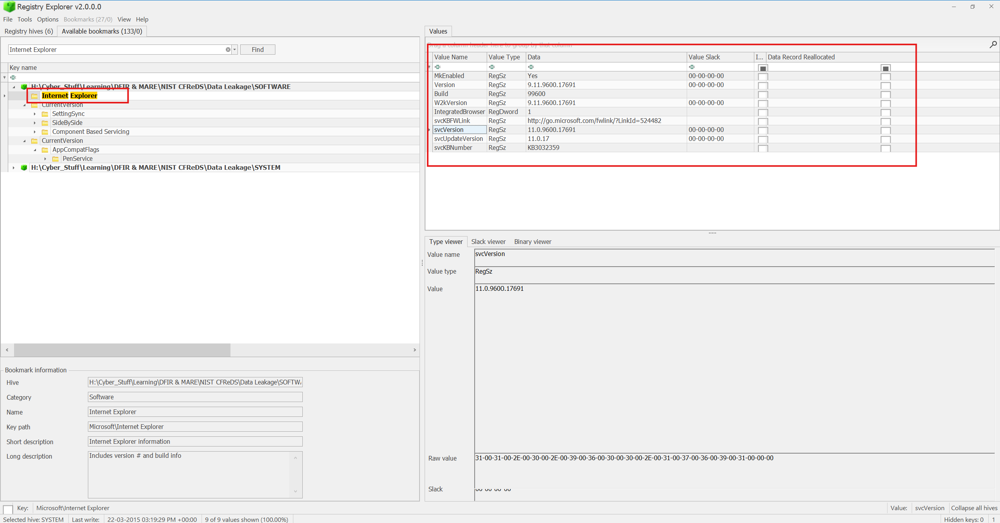

| Value Name        | Value / Data                                                                                   | Interpretation                                           |
| ----------------- | ---------------------------------------------------------------------------------------------- | -------------------------------------------------------- |
| MkEnabled         | Yes                                                                                            | Feature enabled flag (likely Microsoft component active) |
| Version           | 9.11.9600.17691                                                                                | Main software/version build identifier                   |
| Build             | 99600                                                                                          | Internal build number (Windows component)                |
| W2kVersion        | 9.11.9600.17691                                                                                | Compatibility version string                             |
| IntegratedBrowser | 1                                                                                              | Internet Explorer integration enabled (1 = true)         |
| svcKBFWLink       | [http://go.microsoft.com/fwlink/?LinkId=524482](http://go.microsoft.com/fwlink/?LinkId=524482) | Microsoft update/help reference URL                      |
| **svcVersion**    | **11.0.9600.17691**                                                                            | **IE/Windows service version**                           |
| svcUpdateVersion  | 11.0.17                                                                                        | Update branch/version of service component               |
| svcKBNumber       | KB3032359                                                                                      | Installed KB patch identifier                            |

## Identify browser history paths.

- MS IE (9 or lower) :
	- `C:\Users\informant\AppData\Local\Microsoft\Windows\History\ `
	- `C:\Users\informant\AppData\Local\Microsoft\Windows\Temporary Internet Files\ `
	- `C:\Users\informant\AppData\Roaming\Microsoft\Windows\Cookies\ `
- MS IE 11 :
	- `C:\Users\informant\AppData\Local\Microsoft\Windows\WebCache\WebCacheV01.dat `
- Chrome :
	- `C:\Users\informant\AppData\Local\Google\Chrome\User Data\Default\History `
	- `C:\Users\informant\AppData\Local\Google\Chrome\User Data\Default\Application Cache\ `
	- ` C:\Users\informant\AppData\Local\Google\Chrome\User Data\Default\Media Cache\ `
	- `C:\Users\informant\AppData\Local\Google\Chrome\User Data\Default\GPUCache\` 
	- `C:\Users\informant\AppData\Local\Google\Chrome\User Data\Default\Cookies\ `
	- `C:\Users\informant\AppData\Local\Google\Chrome\User Data\Default\Extension Cookies`
	- `C:\Users\informant\AppData\Local\Google\Chrome\User Data\Default\Extensions\`

- Considerations 
	- History, Cache, Cookie… - 
		- Windows Search database ([[Digital Forensics Investigation Questions#Windows Search Analysis]])
		- `C:\ProgramData\Microsoft\Search\Data\Applications\Windows\Windows.edb`
## What websites were accessed? (Timestamp, URL)

- To analyze `Internet Explorer` History,  
- `C:\Users\informant\AppData\Local\Microsoft\Windows\WebCache\WebCacheV01.dat ` file, we need some kind of parser [IE10Analyzer](https://github.com/moaistory/IE10Analyzer).

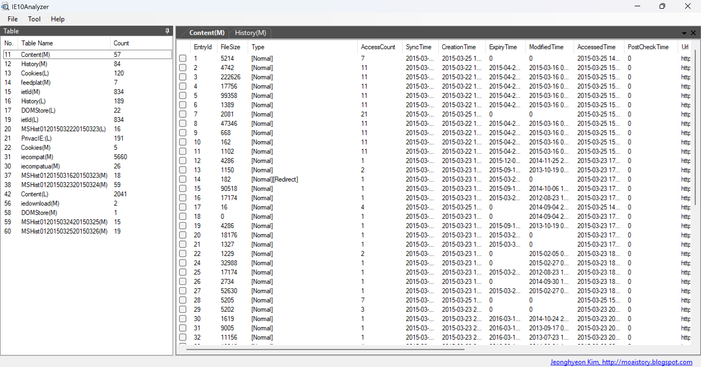

- For Chrome Browser History, 
	- `C:\Users\informant\AppData\Local\Google\Chrome\User Data\Default\History `
	- This website is useful to parse SQLite Database file, https://inloop.github.io/sqlite-viewer/.

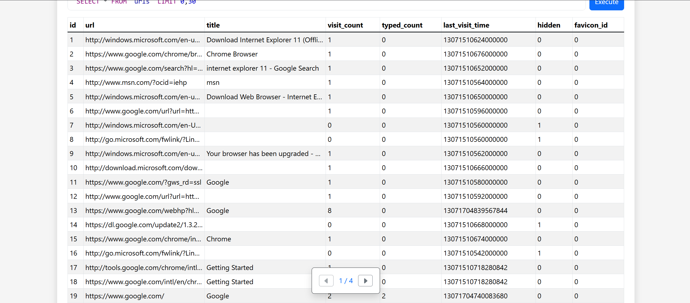

### Software Download / Installation

| Timestamp           | Activity                  | Link                                                                                                                                                                                                                               | Browser |
| ------------------- | ------------------------- | ---------------------------------------------------------------------------------------------------------------------------------------------------------------------------------------------------------------------------------- | ------- |
| 2015-03-22 11:10:50 | IE download page          | [http://windows.microsoft.com/en-us/internet-explorer/download-ie](http://windows.microsoft.com/en-us/internet-explorer/download-ie)                                                                                               | IE 8    |
| 2015-03-22 11:11:04 | IE11 installer download   | [http://download.microsoft.com/download/7/1/7/7179A150-F2D2-4502-9D70-4B59EA148EAA/IE11-Windows6.1-x64-en-us.exe](http://download.microsoft.com/download/7/1/7/7179A150-F2D2-4502-9D70-4B59EA148EAA/IE11-Windows6.1-x64-en-us.exe) | IE 8    |
| 2015-03-22 11:11:06 | Chrome installer download | [https://dl.google.com/update2/1.3.26.9/GoogleInstaller_en.application](https://dl.google.com/update2/1.3.26.9/GoogleInstaller_en.application)                                                                                     | IE 8    |
| 2015-03-23 15:56:15 | Google Drive download     | [https://www.google.com/drive/download/](https://www.google.com/drive/download/)                                                                                                                                                   | Chrome  |
| 2015-03-23 15:55:28 | iCloud setup page         | [https://www.apple.com/icloud/setup/pc.html](https://www.apple.com/icloud/setup/pc.html)                                                                                                                                           | Chrome  |

### Data Leakage / Suspicious Research

| Timestamp           | Activity                          | Link                                                                                                                                                                                       |
| ------------------- | --------------------------------- | ------------------------------------------------------------------------------------------------------------------------------------------------------------------------------------------ |
| 2015-03-23 14:02:09 | Search: data leakage methods      | [https://www.google.com/search?q=data+leakage+methods](https://www.google.com/search?q=data+leakage+methods)                                                                               |
| 2015-03-23 14:02:18 | Read SANS paper                   | [http://www.sans.org/reading-room/whitepapers/awareness/data-leakage-threats-mitigation_1931](http://www.sans.org/reading-room/whitepapers/awareness/data-leakage-threats-mitigation_1931) |
| 2015-03-23 14:02:44 | Search: leaking confidential info | [https://www.google.com/search?q=leaking+confidential+information](https://www.google.com/search?q=leaking+confidential+information)                                                       |
| 2015-03-23 14:03:40 | Search: leakage cases             | [https://www.google.com/search?q=information+leakage+cases](https://www.google.com/search?q=information+leakage+cases)                                                                     |
| 2015-03-23 14:05:55 | FBI IP theft page                 | [http://www.fbi.gov/about-us/investigate/white_collar/ipr/ipr](http://www.fbi.gov/about-us/investigate/white_collar/ipr/ipr)                                                               |
| 2015-03-23 14:06:27 | Search: how to leak a secret ⚠️   | [https://www.google.com/search?q=how+to+leak+a+secret](https://www.google.com/search?q=how+to+leak+a+secret)                                                                               |
| 2015-03-23 14:06:53 | Research paper (leak secret)      | [http://research.microsoft.com/en-us/um/people/yael/publications/2001-leak_secret.pdf](http://research.microsoft.com/en-us/um/people/yael/publications/2001-leak_secret.pdf)               |

### Forensics Awareness 

| Timestamp           | Activity                             | Link                                                                                                                                                                                                                   |
| ------------------- | ------------------------------------ | ---------------------------------------------------------------------------------------------------------------------------------------------------------------------------------------------------------------------- |
| 2015-03-23 14:10:03 | Search: email forensic investigation | [http://www.bing.com/search?q=Forensic+Email+Investigation](http://www.bing.com/search?q=Forensic+Email+Investigation)                                                                                                 |
| 2015-03-23 14:10:27 | Search: Windows artifacts            | [http://www.bing.com/search?q=what+is+windows+system+artifacts](http://www.bing.com/search?q=what+is+windows+system+artifacts)                                                                                         |
| 2015-03-23 14:11:12 | Read forensic article                | [http://resources.infosecinstitute.com/windows-systems-and-artifacts-in-digital-forensics-part-i-registry/](http://resources.infosecinstitute.com/windows-systems-and-artifacts-in-digital-forensics-part-i-registry/) |
| 2015-03-23 14:12:35 | Search: event logs                   | [http://www.bing.com/search?q=windows+event+logs](http://www.bing.com/search?q=windows+event+logs)                                                                                                                     |
| 2015-03-23 14:12:52 | Event Viewer info                    | [http://en.wikipedia.org/wiki/Event_Viewer](http://en.wikipedia.org/wiki/Event_Viewer)                                                                                                                                 |
| 2015-03-23 14:14:24 | USB forensic artifact                | [http://www.forensicswiki.org/wiki/USB_History_Viewing](http://www.forensicswiki.org/wiki/USB_History_Viewing)                                                                                                         |

### Data Exfiltration Methods


| Timestamp           | Activity                 | Link                                                                                                                                                                                                                                 |
| ------------------- | ------------------------ | ------------------------------------------------------------------------------------------------------------------------------------------------------------------------------------------------------------------------------------ |
| 2015-03-23 14:07:58 | Search: file sharing     | [http://www.bing.com/news/search?q=file+sharing+and+tethering](http://www.bing.com/news/search?q=file+sharing+and+tethering)                                                                                                         |
| 2015-03-23 14:08:18 | File sharing article     | [http://sysinfotools.com/blog/tethering-internet-files-sharing/](http://sysinfotools.com/blog/tethering-internet-files-sharing/)                                                                                                     |
| 2015-03-23 14:13:20 | Search: CD burning       | [http://www.bing.com/search?q=cd+burning+method](http://www.bing.com/search?q=cd+burning+method)                                                                                                                                     |
| 2015-03-23 14:14:11 | Search: external devices | [http://www.bing.com/search?q=external+device+and+forensics](http://www.bing.com/search?q=external+device+and+forensics)                                                                                                             |
| 2015-03-23 14:15:09 | Search: cloud storage    | [https://www.google.com/search?q=cloud+storage](https://www.google.com/search?q=cloud+storage)                                                                                                                                       |
| 2015-03-23 14:15:32 | Compare cloud tools      | [http://www.pcadvisor.co.uk/test-centre/internet/3506734/best-cloud-storage-dropbox-google-drive-onedrive-icloud/](http://www.pcadvisor.co.uk/test-centre/internet/3506734/best-cloud-storage-dropbox-google-drive-onedrive-icloud/) |
### Anti-Forensics (CRITICAL EVIDENCE)


| Timestamp           | Activity                    | Link                                                                                                                                                                                                     |
| ------------------- | --------------------------- | -------------------------------------------------------------------------------------------------------------------------------------------------------------------------------------------------------- |
| 2015-03-23 14:17:14 | Search: anti-forensics      | [https://www.google.com/search?q=antiforensics](https://www.google.com/search?q=antiforensics)                                                                                                           |
| 2015-03-23 14:17:19 | Anti-forensic techniques    | [http://forensicswiki.org/wiki/Anti-forensic_techniques](http://forensicswiki.org/wiki/Anti-forensic_techniques)                                                                                         |
| 2015-03-23 14:18:00 | DEFCON anti-forensics paper | [https://defcon.org/images/defcon-20/dc-20-presentations/Perklin/DEFCON20-Perklin-AntiForensics.pdf](https://defcon.org/images/defcon-20/dc-20-presentations/Perklin/DEFCON20-Perklin-AntiForensics.pdf) |
| 2015-03-23 14:16:55 | Search: delete data         | [https://www.google.com/search?q=how+to+delete+data](https://www.google.com/search?q=how+to+delete+data)                                                                                                 |
| 2015-03-23 14:19:03 | Search: data recovery tools | [https://www.google.com/search?q=data+recovery+tools](https://www.google.com/search?q=data+recovery+tools)                                                                                               |

### Evidence Destruction Tools

| Timestamp           | Activity                    | Link                                                                                                                                                                         |
| ------------------- | --------------------------- | ---------------------------------------------------------------------------------------------------------------------------------------------------------------------------- |
| 2015-03-25 10:46:44 | Search: anti-forensic tools | [http://www.bing.com/search?q=antiforensic+tools](http://www.bing.com/search?q=antiforensic+tools)                                                                           |
| 2015-03-25 10:46:59 | Eraser official site        | [http://eraser.heidi.ie/](http://eraser.heidi.ie/)                                                                                                                           |
| 2015-03-25 10:47:34 | Download Eraser             | [http://iweb.dl.sourceforge.net/project/eraser/Eraser%206/6.2/Eraser%206.2.0.2962.exe](http://iweb.dl.sourceforge.net/project/eraser/Eraser%206/6.2/Eraser%206.2.0.2962.exe) |
| 2015-03-25 10:47:51 | Search: CCleaner            | [http://www.bing.com/search?q=ccleaner](http://www.bing.com/search?q=ccleaner)                                                                                               |
| 2015-03-25 10:48:12 | Download CCleaner           | [http://www.piriform.com/ccleaner/download](http://www.piriform.com/ccleaner/download)                                                                                       |

## List browser search keywords.

### User Search Activity (Cleaned & Relevant)

| Timestamp           | Search Query                     | URL                                                                                                                                                        | Browser |
| ------------------- | -------------------------------- | ---------------------------------------------------------------------------------------------------------------------------------------------------------- | ------- |
| 2015-03-23 14:02:09 | data leakage methods             | [https://www.google.com/webhp?hl=en#hl=en&q=data+leakage+methods](https://www.google.com/webhp?hl=en#hl=en&q=data+leakage+methods)                         | Chrome  |
| 2015-03-23 14:02:44 | leaking confidential information | [https://www.google.com/webhp?hl=en#hl=en&q=leaking+confidential+information](https://www.google.com/webhp?hl=en#hl=en&q=leaking+confidential+information) | Chrome  |
| 2015-03-23 14:03:40 | information leakage cases        | [https://www.google.com/webhp?hl=en#hl=en&q=information+leakage+cases](https://www.google.com/webhp?hl=en#hl=en&q=information+leakage+cases)               | Chrome  |
| 2015-03-23 14:05:48 | intellectual property theft      | [https://www.google.com/search?q=intellectual+property+theft](https://www.google.com/search?q=intellectual+property+theft)                                 | Chrome  |
| 2015-03-23 14:06:27 | how to leak a secret ⚠️          | [https://www.google.com/search?q=how+to+leak+a+secret](https://www.google.com/search?q=how+to+leak+a+secret)                                               | Chrome  |
| 2015-03-23 14:07:58 | file sharing and tethering       | [http://www.bing.com/news/search?q=file+sharing+and+tethering](http://www.bing.com/news/search?q=file+sharing+and+tethering)                               | IE 11   |
| 2015-03-23 14:08:31 | DLP DRM                          | [http://www.bing.com/search?q=DLP+DRM](http://www.bing.com/search?q=DLP+DRM)                                                                               | IE 11   |
| 2015-03-23 14:08:54 | email investigation              | [http://www.bing.com/search?q=email+investigation](http://www.bing.com/search?q=email+investigation)                                                       | IE 11   |
| 2015-03-23 14:10:03 | forensic email investigation     | [http://www.bing.com/search?q=Forensic+Email+Investigation](http://www.bing.com/search?q=Forensic+Email+Investigation)                                     | IE 11   |
| 2015-03-23 14:10:27 | windows system artifacts         | [http://www.bing.com/search?q=what+is+windows+system+artifacts](http://www.bing.com/search?q=what+is+windows+system+artifacts)                             | IE 11   |
| 2015-03-23 14:11:50 | investigation on windows machine | [http://www.bing.com/search?q=investigation+on+windows+machine](http://www.bing.com/search?q=investigation+on+windows+machine)                             | IE 11   |
| 2015-03-23 14:12:35 | windows event logs               | [http://www.bing.com/search?q=windows+event+logs](http://www.bing.com/search?q=windows+event+logs)                                                         | IE 11   |
| 2015-03-23 14:13:20 | CD burning method                | [http://www.bing.com/search?q=cd+burning+method](http://www.bing.com/search?q=cd+burning+method)                                                           | IE 11   |
| 2015-03-23 14:13:37 | CD burning in Windows            | [http://www.bing.com/search?q=cd+burning+method+in+windows](http://www.bing.com/search?q=cd+burning+method+in+windows)                                     | IE 11   |
| 2015-03-23 14:14:11 | external device forensics        | [http://www.bing.com/search?q=external+device+and+forensics](http://www.bing.com/search?q=external+device+and+forensics)                                   | IE 11   |
| 2015-03-23 14:14:50 | cloud storage                    | [https://www.google.com/search?q=cloud+storage](https://www.google.com/search?q=cloud+storage)                                                             | Chrome  |
| 2015-03-23 14:15:44 | digital forensics                | [https://www.google.com/search?q=digital+forensics](https://www.google.com/search?q=digital+forensics)                                                     | Chrome  |
| 2015-03-23 14:16:55 | how to delete data ⚠️            | [https://www.google.com/search?q=how+to+delete+data](https://www.google.com/search?q=how+to+delete+data)                                                   | Chrome  |
| 2015-03-23 14:17:14 | anti-forensics ⚠️                | [https://www.google.com/search?q=anti-forensics](https://www.google.com/search?q=anti-forensics)                                                           | Chrome  |
| 2015-03-23 14:18:10 | system cleaner ⚠️                | [https://www.google.com/search?q=system+cleaner](https://www.google.com/search?q=system+cleaner)                                                           | Chrome  |
| 2015-03-23 14:18:30 | how to recover data              | [https://www.google.com/search?q=how+to+recover+data](https://www.google.com/search?q=how+to+recover+data)                                                 | Chrome  |
| 2015-03-23 14:19:03 | data recovery tools              | [https://www.google.com/search?q=data+recovery+tools](https://www.google.com/search?q=data+recovery+tools)                                                 | Chrome  |
| 2015-03-23 15:55:09 | Apple iCloud                     | [https://www.google.com/webhp?hl=en#hl=en&q=apple+icloud](https://www.google.com/webhp?hl=en#hl=en&q=apple+icloud)                                         | Chrome  |
| 2015-03-23 15:56:04 | Google Drive                     | [https://www.google.com/webhp?hl=en#hl=en&q=google+drive](https://www.google.com/webhp?hl=en#hl=en&q=google+drive)                                         | Chrome  |
| 2015-03-24 17:06:50 | security checkpoint CD-R         | [https://www.google.com/#q=security+checkpoint+cd-r](https://www.google.com/#q=security+checkpoint+cd-r)                                                   | Chrome  |
| 2015-03-25 10:46:44 | anti-forensic tools ⚠️           | [http://www.bing.com/search?q=antiforensic+tools](http://www.bing.com/search?q=antiforensic+tools)                                                         | IE 11   |
| 2015-03-25 10:46:54 | eraser (secure delete tool) ⚠️   | [http://www.bing.com/search?q=eraser](http://www.bing.com/search?q=eraser)                                                                                 | IE 11   |
| 2015-03-25 10:47:51 | CCleaner ⚠️                      | [http://www.bing.com/search?q=ccleaner](http://www.bing.com/search?q=ccleaner)                                                                             | IE 11   |

## List all user keywords at the search bar in Windows Explorer. (Timestamp, Keyword)

- `HKU\informant\Software\Microsoft\Windows\CurrentVersion\Explorer\WordWheelQuery\`

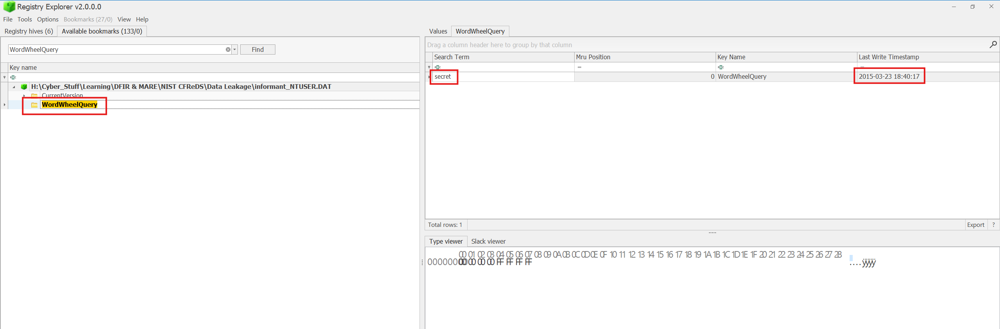

```yml
secret, 2015-03-23 18:40:17
```

# Email Investigation

- `HKLM\SOFTWARE\Classes\mailto\shell\open\command (Microsoft Outlook)` 
- `HKLM\SOFTWARE\Clients\Mail (Microsoft Outlook)`
- `HKU\informant\Software\Microsoft\Office\15.0\Outlook`

## What application was used for e-mail communication?

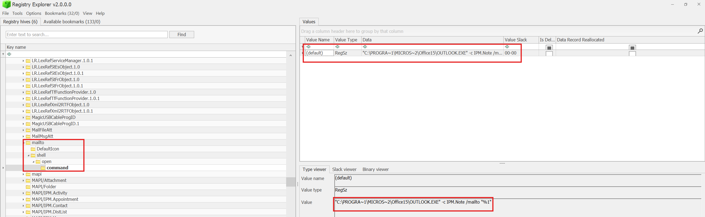

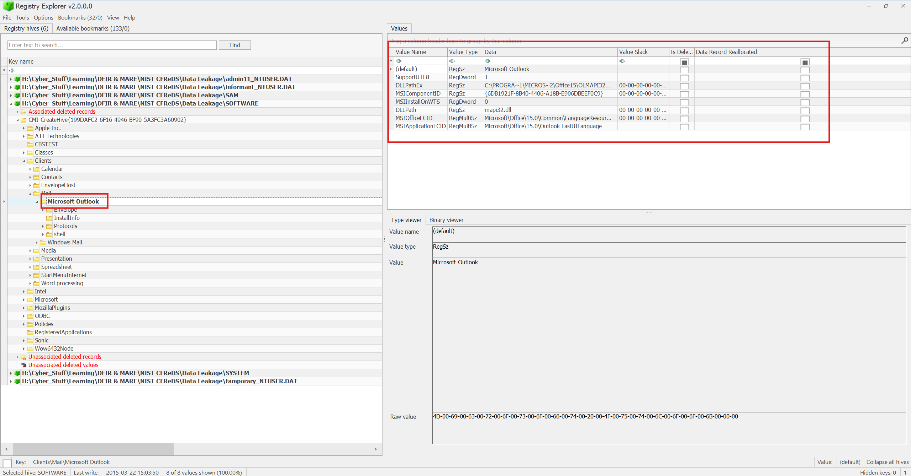

| Value Name         | Data                                       | Forensic Relevance                                    |
| ------------------ | ------------------------------------------ | ----------------------------------------------------- |
| (default)          | Microsoft Outlook                          | Confirms Outlook is installed/configured              |
| SupportUTF8        | 1                                          | UTF-8 support enabled (modern email handling)         |
| DLLPathEx          | C:\PROGRA~1\MICROS~2\Office15\OLMAPI32.DLL | Points to Outlook MAPI library (execution dependency) |
| DLLPath            | mapi32.dll                                 | Core MAPI DLL used by Outlook                         |
| MSIComponentID     | {6DB1921F-8B40-4406-A18B-E906DBEEF0C9}     | Unique Office installation component ID               |
| MSIOfficeLCID      | Office language resources path             | Indicates installed Office language settings          |
| MSIApplicationLCID | Outlook UI language settings               | Tracks Outlook language usage                         |
| MSIInstallOnWTS    | 0                                          | Not installed on Terminal Services                    |

## Where is the e-mail file located and List all e-mails (including deleted).  What was the e-mail account used?

- File is located at,
- `C:\Users\informant\AppData\Local\Microsoft\Outlook\iaman.informant@nist.gov.ost`

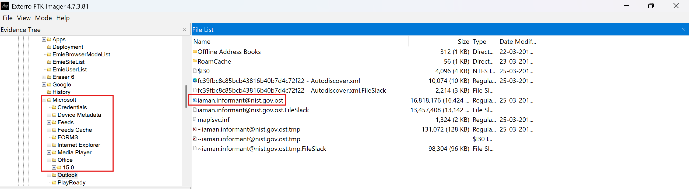

- To read this email `pff-tools` this utility can be used,

```bash
sudo apt install pff-tools
pffexport iaman.informant@nist.gov.ost
```

- I found 4 deleted messages under, 
	- `iaman.informant@nist.gov.ost.expor/Root - Mailbox/IPM_SUBTREE/`
	- `/Sent Items/`
		- Message00001
			- ConversationIndex.txt
			- InternetHeaders.txt
			- Message.html
			- OutlookHeaders.txt
			- Recipients.txt
		- Message00002
			- ...
	- `/Inbox/`
		-  Message00001
			- ConversationIndex.txt
			- InternetHeaders.txt
			- Message.html
			- OutlookHeaders.txt
			- Recipients.txt
		- Message00002
			- ...
		- Message00003
			- ...
		- Message00004
			- …
		- Message00005
			- ...
	- `/Deleted Items/`
		- Message00001
			- ConversationIndex.txt
			- InternetHeaders.txt
			- Message.html
			- OutlookHeaders.txt
			- Recipients.txt
		- Message00002
			- ...
		- Message00003
			- ...
		- Message00004
			- ...

### Sent Items

#### Message00001

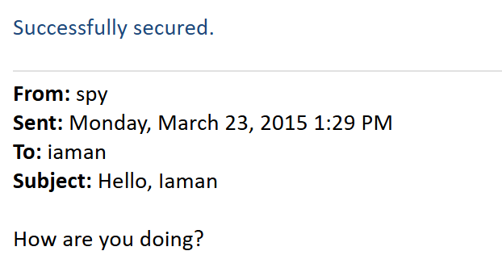

#### Message00002

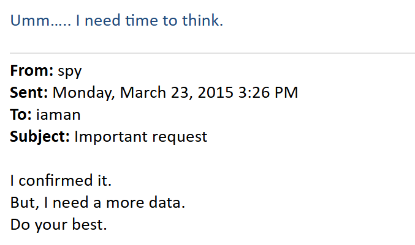

### Inbox messages

#### Message00001


#### Message00002


#### Message00003

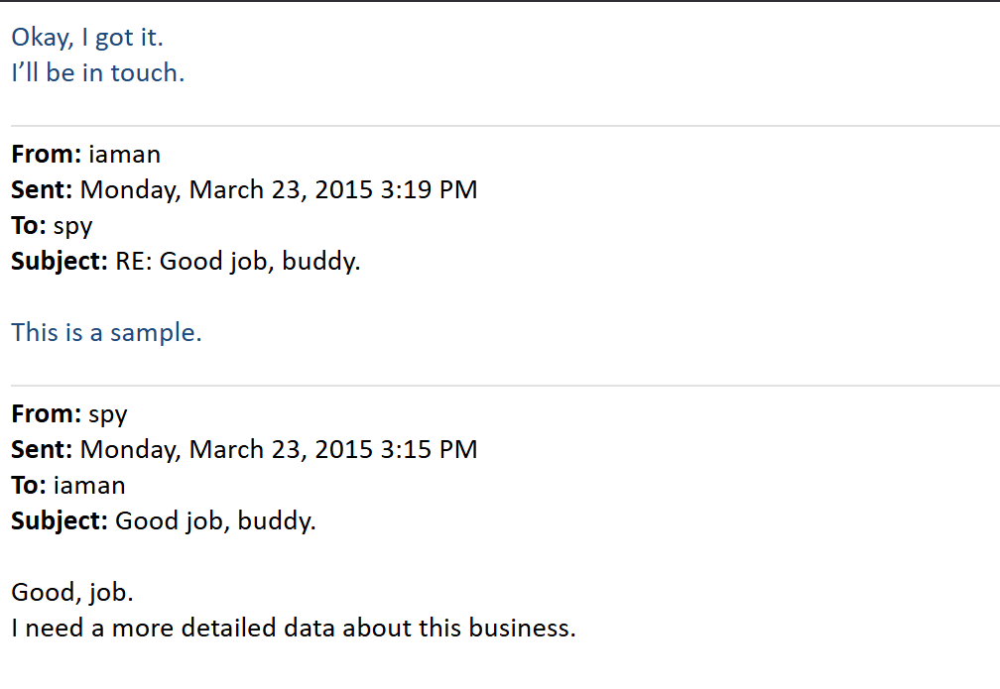

#### Message00004


#### Message00005


### Deleted Messages
#### Message00001

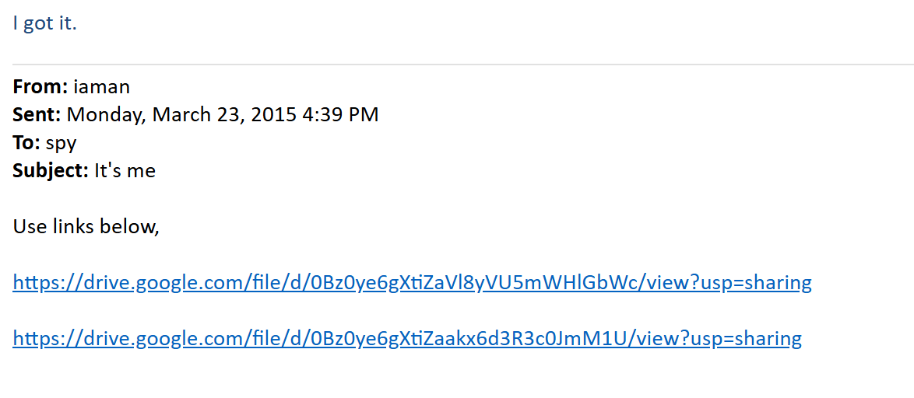

```
https://drive.google.com/file/d/0Bz0ye6gXtiZaVl8yVU5mWHlGbWc/view?usp=sharing
https://drive.google.com/file/d/0Bz0ye6gXtiZaVl8yVU5mWHlGbWc/view?usp=sharing
```


#### Message00002

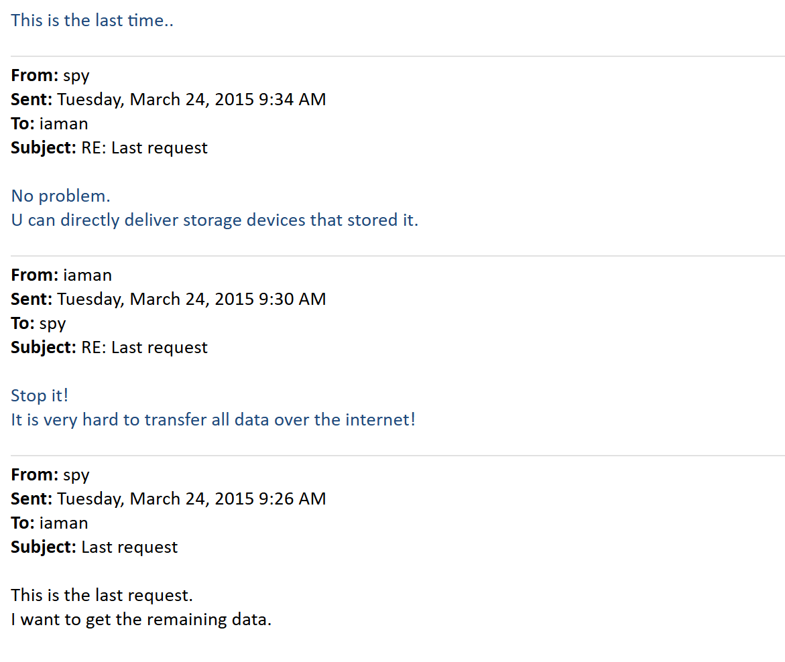

#### Message00003


```
I am trying.

-----Original Message-----
From: spy 
Sent: Tuesday, March 24, 2015 3:33 PM
To: iaman
Subject: Watch out!

USB device may be easily detected. 

So, try another method.
```

#### Message00004


```yml
spy.conspirator@nist.gov <-> iaman.informant@nist.gov
```

| Timestamp                    | Source                | From → To                                                                                                                 | Subject               | Key Content / Insight                                |
| ---------------------------- | --------------------- | ------------------------------------------------------------------------------------------------------------------------- | --------------------- | ---------------------------------------------------- |
| 2015-03-23 13:29:27          | Inbox                 | [spy.conspirator@nist.gov](mailto:spy.conspirator@nist.gov) → [iaman.informant@nist.gov](mailto:iaman.informant@nist.gov) | Hello, Iaman          | Initial contact (“How are you doing?”)               |
| 2015-03-23 14:44:31          | Sent                  | [iaman.informant@nist.gov](mailto:iaman.informant@nist.gov) → [spy.conspirator@nist.gov](mailto:spy.conspirator@nist.gov) | RE: Hello, Iaman      | “Successfully secured” → ⚠️ Task acknowledgment      |
| 2015-03-23 15:14:58          | Inbox                 | spy → iaman                                                                                                               | Good job, buddy       | Requests **more detailed data**                      |
| 2015-03-23 15:20:41          | Inbox                 | spy ↔ iaman                                                                                                               | RE: Good job, buddy   | iaman agrees to continue (“I’ll be in touch”)        |
| 2015-03-23 15:26:22          | Inbox                 | spy → iaman                                                                                                               | Important request     | Confirms operation, asks for **more data**           |
| 2015-03-23 15:27:05          | Sent                  | iaman → spy                                                                                                               | RE: Important request | Needs time → possible hesitation                     |
| 2015-03-23 16:38:47          | Recovered (OST slack) | iaman → spy                                                                                                               | It's me               | ⚠️ **Google Drive links shared (data exfiltration)** |
| 2015-03-23 16:41:19          | Deleted               | spy ↔ iaman                                                                                                               | RE: It's me           | “I got it” → confirms receipt of data                |
| 2015-03-24 09:25:57          | Inbox                 | spy → iaman                                                                                                               | Last request          | Requests **remaining data**                          |
| 2015-03-24 09:35:10          | Deleted               | iaman ↔ spy                                                                                                               | RE: Last request      | iaman: “hard to transfer all data over internet”     |
| 2015-03-24 09:34:00 (approx) | Thread                | spy → iaman                                                                                                               | RE: Last request      | ⚠️ Suggests **physical transfer (storage devices)**  |
| 2015-03-24 15:34:02          | Deleted               | iaman ↔ spy                                                                                                               | Watch out!            | ⚠️ Avoid USB → suggests detection awareness          |
| 2015-03-24 17:05:09          | Deleted               | iaman → spy                                                                                                               | Done                  | ⚠️ Final confirmation (“It’s done”)                  |

# External Devices & File Activity

- `HKLM\SYSTEM\MountedDevices\ `
- `HKLM\SYSTEM\ControlSet###\Enum\USBSTOR\ `
-` HKLM\SYSTEM\ControlSet###\Control\DeviceClasses\{a5dcbf10-6530-11d2-901f-00c04fb951ed}\ `
- `HKLM\SYSTEM\ControlSet###\Control\DeviceClasses\{53f56307-b6bf-11d0-94f2-00a0c91efb8b}\`
- `HKU\informant\Software\Microsoft\Windows\CurrentVersion\Explorer\MountPoints2\ `
- `HKLM\SOFTWARE\Microsoft\Windows Search\VolumeInfoCach`

## List external storage devices.

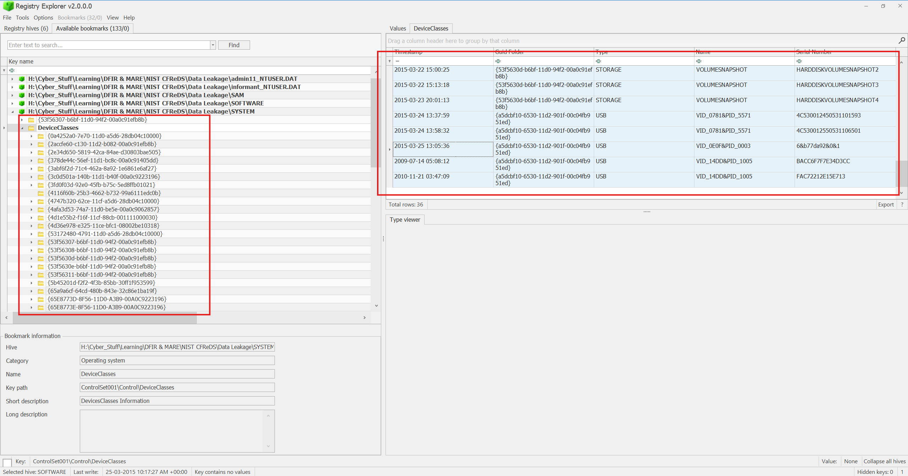

| Timestamp           | Device Type | Device Name                            | Serial Number                          | Forensic Relevance                                  |
| ------------------- | ----------- | -------------------------------------- | -------------------------------------- | --------------------------------------------------- |
| 2015-03-24 13:37:59 | USB         | VID_0781&PID_5571 (SanDisk Cruzer Fit) | 4C530012450531101593                   | USB inserted (first device)                         |
| 2015-03-24 13:38:00 | USBSTOR     | Disk&Ven_SanDisk&Prod_Cruzer_Fit       | 4C530012450531101593                   | Mass storage mounted                                |
| 2015-03-24 13:58:32 | USB         | VID_0781&PID_5571 (SanDisk Cruzer Fit) | 4C530012550531106501                   | Second USB device inserted                          |
| 2015-03-24 13:58:33 | USBSTOR     | Disk&Ven_SanDisk&Prod_Cruzer_Fit       | 4C530012550531106501                   | Second storage mounted                              |
| 2015-03-24 13:58:34 | Volume      | Mounted Volume                         | {A2F2048C-D228-11E4-B630-000C29FF2429} | Volume created (data access)                        |
| 2015-03-25 13:05:36 | USB         | VID_0E0F&PID_0003 (VMware Virtual USB) | 6&b77da92&0&1                          | Virtual device (lab artifact, ignore operationally) |

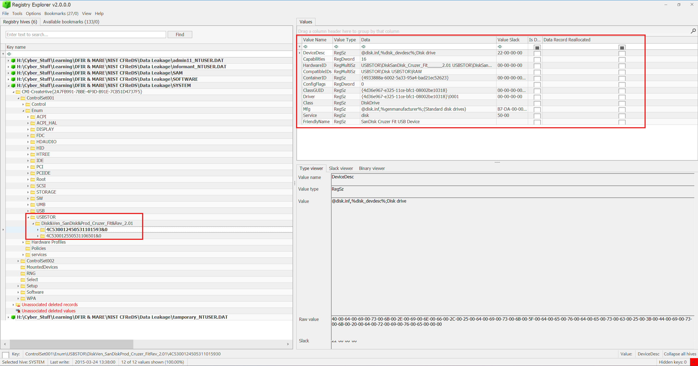


| Device Name                   | Serial Number        | First Seen (System) | First Connected     | Last Connected      | Notes                                |
| ----------------------------- | -------------------- | ------------------- | ------------------- | ------------------- | ------------------------------------ |
| SanDisk Cruzer Fit USB Device | 4C530012450531101593 | 2015-03-23 14:31:10 | 2015-03-24 09:38:00 | 2015-03-24 13:38:00 | First USB used, short session        |
| SanDisk Cruzer Fit USB Device | 4C530012550531106501 | 2015-03-24 09:58:32 | 2015-03-24 09:58:32 | 2015-03-24 13:58:33 | Second USB, likely main exfil device |

## Identify file renaming traces (Desktop, date range).

- (It should be considered only during a date range between 2015-03-23 and 2015-03-24.) [Hint: the parent directories of renamed files were deleted and their MFT entries were also overwritten. Therefore, you may not be able to find their full paths.]
- NTFS journal file analysis (`UsnJrnl`) - `\$Extend\$UsnJrnl·$J` (+ `$MFT` for identifying full paths of files)
- With NTFS journal file only, it may be hard to find full paths. 
- We can consider the Registry `ShellBags` for further information.
- I carved both `UsnJournal` and `Master File Table` files from `\$Extend`,

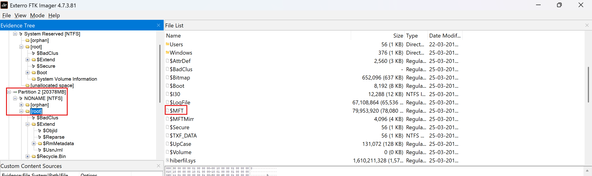

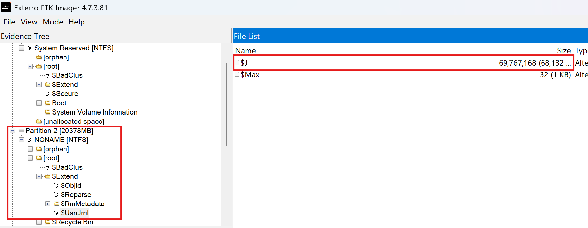

### Converting $MFT and $J to CSV

- It can be parse using [MFTECmd.exe](https://github.com/EricZimmerman/MFTECmd), 
- By corelating it, we found the names.

```bash
MFTECmd.exe -f "$MFT" --csv MFT
MFTECmd.exe -f "$J" --csv J
```

| Timestamp           | USN (Old → New)     | Original File (Sensitive)                    | Renamed To (Cover File)         |
| ------------------- | ------------------- | -------------------------------------------- | ------------------------------- |
| 2015-03-23 14:41:40 | 56306184 → 56306328 | [secret_project]\_detailed\_proposal.docx    | landscape.png                   |
| 2015-03-23 14:41:55 | 56307712 → 56307848 | [secret_project]\_design\_concept.ppt        | space_and_earth.mp4             |
| 2015-03-23 16:30:44 | 58506640 → 58506776 | (secret_project)\_pricing_decision.xlsx      | happy_holiday.jpg               |
| 2015-03-23 16:31:02 | 58510288 → 58510424 | [secret_project]_final_meeting.pptx          | do_u_wanna_build_a_snow_man.mp3 |
| 2015-03-24 09:49:51 | 59801680 → 59801816 | [secret_project]_detailed_design.pptx        | winter_weather_advisory.zip     |
| 2015-03-24 09:50:08 | 59802408 → 59802544 | [secret_project]_revised_points.ppt          | winter_storm.amr                |
| 2015-03-24 09:50:49 | 59803456 → 59803592 | [secret_project]_design_concept.ppt          | space_and_earth.mp4             |
| 2015-03-24 09:52:35 | 59814352 → 59814488 | [secret_project]_final_meeting.pptx          | do_u_wanna_build_a_snow_man.mp3 |
| 2015-03-24 09:52:56 | 59814904 → 59815040 | (secret_project)_market_analysis.xlsx        | new_years_day.jpg               |
| 2015-03-24 09:53:08 | 59815232 → 59815360 | (secret_project)_market_shares.xls           | super_bowl.avi                  |
| 2015-03-24 09:53:38 | 59815536 → 59815680 | (secret\_project)\_price\_analysis_#1.xlsx   | my_favorite_movies.7z           |
| 2015-03-24 09:53:52 | 59815968 → 59816104 | (secret\_project)\_price\_analysis_#2.xls    | my_favorite_cars.db             |
| 2015-03-24 09:54:05 | 59816312 → 59816448 | (secret\_project)_pricing_decision.xlsx      | happy_holiday.jpg               |
| 2015-03-24 09:54:23 | 59816880 → 59817008 | [secret\_project]\_progress_#1.docx          | my_smartphone.png               |
| 2015-03-24 09:54:43 | 59817984 → 59818112 | [secret\_project]\_progress_#2.docx          | new_year_calendar.one           |
| 2015-03-24 09:54:52 | 59818320 → 59818448 | [secret\_project]\_progress_#3.doc           | my_friends.svg                  |
| 2015-03-24 09:55:08 | 59818624 → 59818768 | [secre\t_project]\_detailed_proposal.docx    | a_gift_from_you.gif             |
| 2015-03-24 09:55:17 | 59818976 → 59819096 | [secret\_project]\_proposal.docx             | landscape.png                   |
| 2015-03-24 09:55:32 | 59819272 → 59819416 | [secret\_project]\_technical\_review_#1.docx | diary_#1d.txt                   |
| 2015-03-24 09:55:42 | 59819592 → 59819736 | [secret\_project]\_technical\_review_#1.pptx | diary_#1p.txt                   |
| 2015-03-24 09:55:53 | 59819912 → 59820056 | [secret\_project]\_technical\_review_#2.docx | diary_#2d.txt                   |
| 2015-03-24 09:56:09 | 59823280 → 59823424 | [secret\_project]\_technical\_review_#2.ppt  | diary_#2p.txt                   |
| 2015-03-24 09:56:14 | 59823600 → 59823744 | [secret\_project]\_technical\_review_#3.doc  | diary_#3d.txt                   |
| 2015-03-24 09:56:20 | 59823920 → 59824064 | [secret\_project]\_technical\_review_#3.ppt  | diary_#3p.txt                   |


# Network Drive Analysis

- `HKU\informant\Software\Microsoft\Windows\CurrentVersion\Explorer\RunMRU\`
- `HKU\informant\Software\Microsoft\Windows\CurrentVersion\Explorer\Map Network Drive MRU\ `
- `HKU\informant\Software\Classes\Local Settings\Software\Microsoft\Windows\Shell\BagMRU\8\0\`

## IP address of company shared network drive?


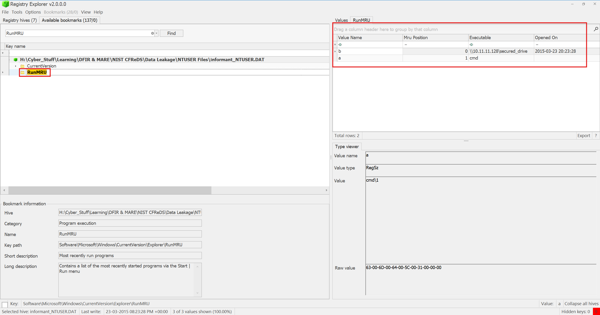

```bash
\\10.11.11.128\secured_drive	: 2015-03-23 20:23:28
```

## Directories traversed in RM#2.


- Timestamp may not be accurate. 
- `E:\` can be inferred from external storage devices attached to PC in Question 22. 
- You can consider a created timestamp and a last accessed timestamp of each `ShellBag` entry. 
- `HKU\informant\Software\Classes\Local Settings\Software\Microsoft\Windows\Shell\BagMRU\1\0\1~`
- We can open the `UsrClass.dat` into [ShellBags Explorer](https://ericzimmerman.github.io/#forensic-tools). 

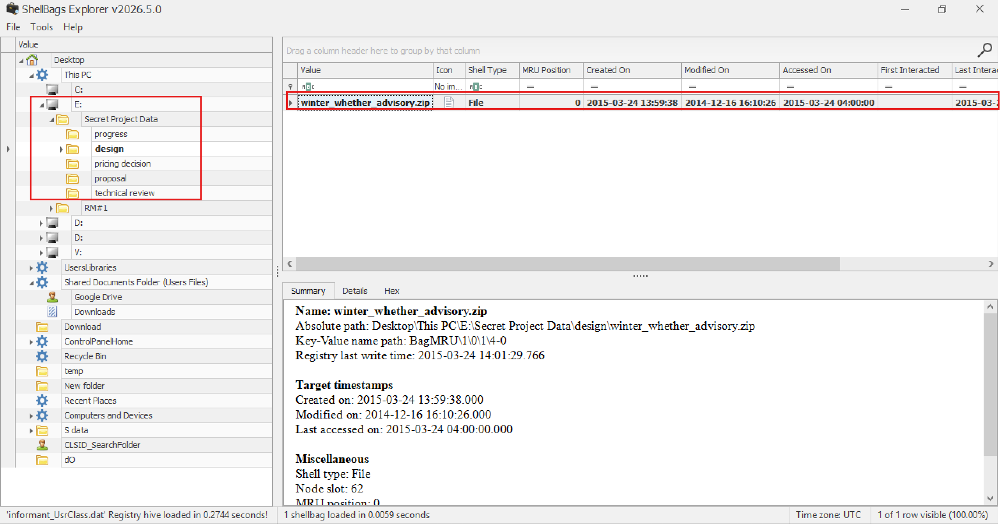

| Timestamp           | Directory Path                          | Source        |
| ------------------- | --------------------------------------- | ------------- |
| 2015-03-24 10:00:19 | E:\Secret Project Data                  | Created       |
| 2015-03-24 10:01:11 | E:\Secret Project Data\technical        | Created       |
| 2015-03-24 10:01:14 | E:\Secret Project Data\proposal         | Created       |
| 2015-03-24 10:01:15 | E:\Secret Project Data\progress         | Created       |
| 2015-03-24 10:01:17 | E:\Secret Project Data\pricing decision | Created       |
| 2015-03-24 10:01:29 | E:\Secret Project Data\design           | Last Accessed |
| 2015-03-24 16:54:07 | E:\Secret Project Data                  | Last Accessed |
| 2015-03-24 16:54:07 | E:\Secret Project Data\progress         | Last Accessed |
## List all files that were opened in RM#2.


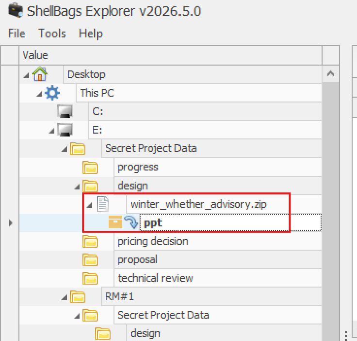

| Timestamp           | Path                                                          | Action   | Source   |
| ------------------- | ------------------------------------------------------------- | -------- | -------- |
| 2015-03-24 10:01:23 | E:\Secret Project Data\design\winter_whether_advisory.zip     | Accessed | JumpList |
| 2015-03-24 10:01:29 | E:\Secret Project Data\design\winter_whether_advisory.zip\ppt | Accessed | JumpList |
| 2015-03-24 10:01:29 | E:\Secret Project Data\design                                 | Created  | ShellBag |
## Directories in company network drive.


- 'Timestamp' may not be accurate. 
- V:\ is mapped on `\\10.11.11.128` 
- `HKU\informant\Software\Classes\Local Settings\Software\Microsoft\Windows\Shell\BagMRU\8\0\~ `

- `\User\informant\AppData\Roaming\Microsoft\Windows\Recent\AutomaticDestinations `
- `\User\informant\AppData\Roaming\Microsoft\Windows\Recent\CustomDestinations` 
- `\User\informant\AppData\Roaming\Microsoft\Windows\Recent\*.lnk `
- `\User\informant\AppData\Roaming\Microsoft\Office\Recent\*.lnk`

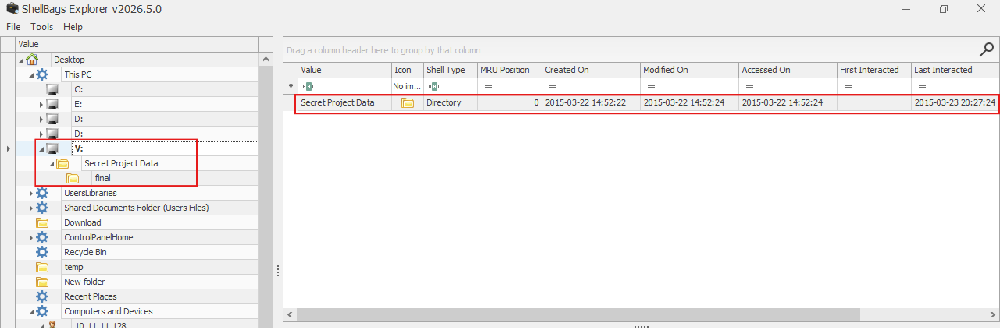

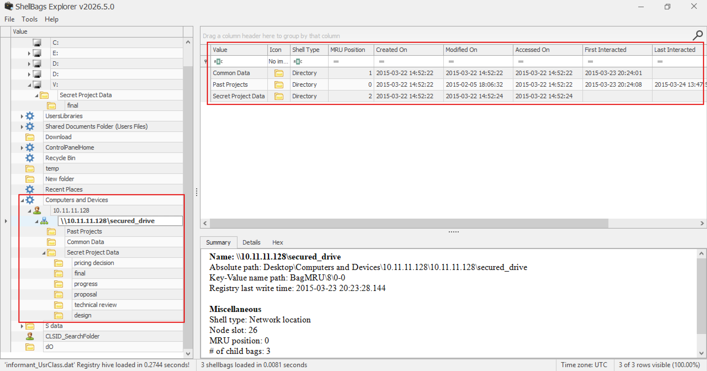

| Timestamp           | Path                                                                            | Action        | Source   |
| ------------------- | ------------------------------------------------------------------------------- | ------------- | -------- |
| 2015-03-23 16:24:01 | \10.11.11.128\secured_drive\Common Data                                         | Created       | ShellBag |
| 2015-03-23 16:24:08 | \10.11.11.128\secured_drive\Past Projects                                       | Created       | ShellBag |
| 2015-03-23 16:24:12 | \10.11.11.128\secured_drive\Secret Project Data\design                          | Created       | ShellBag |
| 2015-03-23 16:24:15 | \10.11.11.128\secured_drive\Secret Project Data\pricing decision                | Created       | ShellBag |
| 2015-03-23 16:24:16 | \10.11.11.128\secured_drive\Secret Project Data\final                           | Created       | ShellBag |
| 2015-03-23 16:24:18 | \10.11.11.128\secured_drive\Secret Project Data\technical review                | Created       | ShellBag |
| 2015-03-23 16:24:20 | \10.11.11.128\secured_drive\Secret Project Data\proposal                        | Created       | ShellBag |
| 2015-03-23 16:24:27 | \10.11.11.128\secured_drive\Secret Project Data\progress                        | Created       | ShellBag |
| 2015-03-23 16:26:53 | \10.11.11.128\secured_drive\Secret Project Data\pricing decision                | Accessed      | JumpList |
| 2015-03-23 16:26:54 | \10.11.11.128\secured_drive\Secret Project Data\pricing decision\               | Accessed      | LNK File |
| 2015-03-23 16:27:24 | V:\Secret Project Data                                                          | Created       | ShellBag |
| 2015-03-23 16:27:29 | V:\Secret Project Data\final                                                    | Created       | ShellBag |
| 2015-03-23 16:27:33 | V:\Secret Project Data\final\                                                   | Accessed      | JumpList |
| 2015-03-23 16:27:33 | V:\Secret Project Data\final\                                                   | Accessed      | LNK File |
| 2015-03-23 16:28:17 | \10.11.11.128\secured_drive\Secret Project Data                  | Last Accessed | ShellBag |
| 2015-03-23 16:28:17 | \10.11.11.128\secured_drive\Secret Project Data\pricing decision | Last Accessed | ShellBag |
| 2015-03-24 09:47:54 | \10.11.11.128\secured_drive                                      | Last Accessed | ShellBag |
| 2015-03-24 09:47:54 | \10.11.11.128\secured_drive\Past Projects                        | Last Accessed | ShellBag |

## Files opened in company network drive.

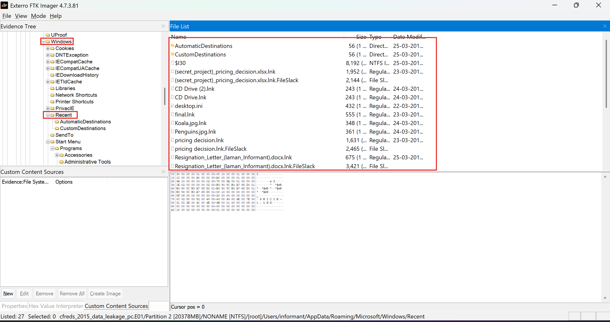

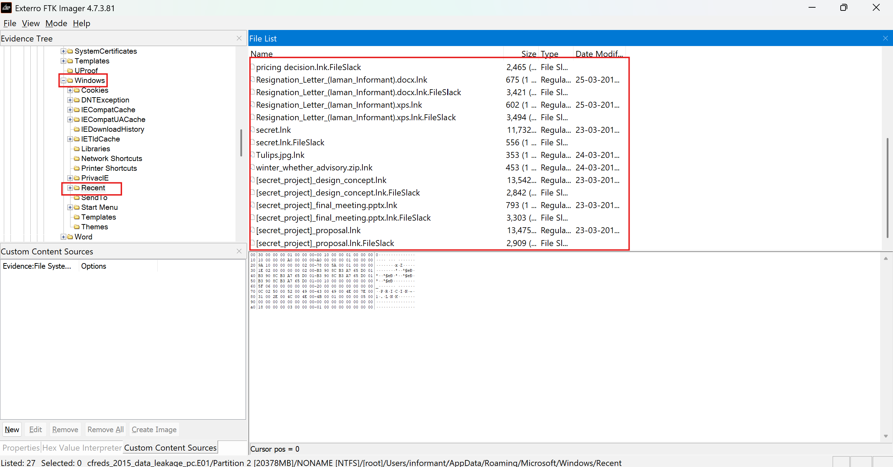

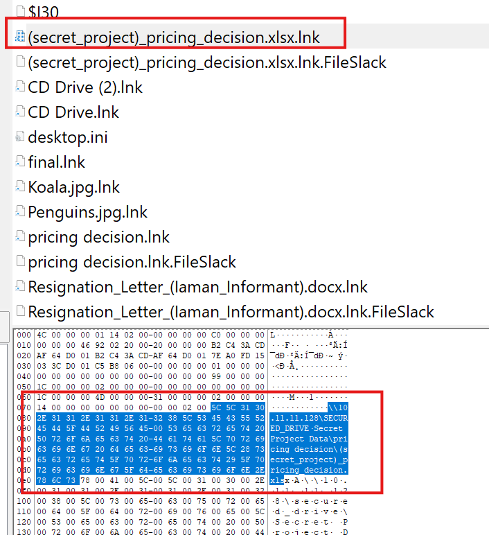

| Timestamp           | File Path                                                                                              | Action   | Source            |
| ------------------- | ------------------------------------------------------------------------------------------------------ | -------- | ----------------- |
| 2015-03-23 16:26:53 | \10.11.11.128\SECURED_DRIVE\Secret Project Data\pricing decision(secret_project)_pricing_decision.xlsx | Accessed | JumpList          |
| 2015-03-23 16:26:53 | \10.11.11.128\SECURED_DRIVE\Secret Project Data\pricing decision(secret_project)_pricing_decision.xlsx | Accessed | LNK (Windows)     |
| 2015-03-23 16:26:53 | \10.11.11.128\SECURED_DRIVE\Secret Project Data\pricing decision(secret_project)_pricing_decision.xlsx | Accessed | LNK (Office)      |
| 2015-03-23 16:26:56 | \10.11.11.128\secured_drive\Secret Project Data\pricing decision(secret_project)_pricing_decision.xlsx | Accessed | Registry (Office) |
| 2015-03-23 16:27:33 | V:\Secret Project Data\final[secret_project]_final_meeting.pptx                                        | Accessed | JumpList          |
| 2015-03-23 16:27:33 | V:\Secret Project Data\final[secret_project]_final_meeting.pptx                                        | Accessed | LNK (Windows)     |
| 2015-03-23 16:27:37 | V:\Secret Project Data\final[secret_project]_final_meeting.pptx                                        | Accessed | LNK (Office)      |
| 2015-03-23 16:27:37 | V:\Secret Project Data\final[secret_project]_final_meeting.pptx                                        | Accessed | Registry (Office) |

# Cloud Forensics

## Find traces related to cloud services on PC. (Service name, log files...)

- Installation directory 
- Registry (Configuration, Uninstall Information, Autoruns, UserAssist, Classes…)

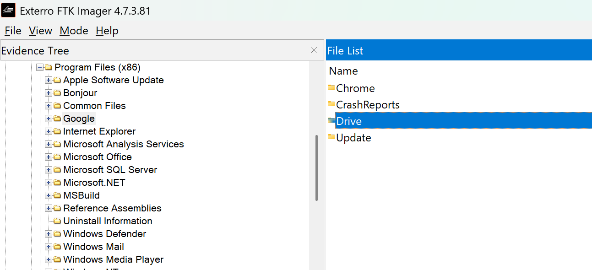

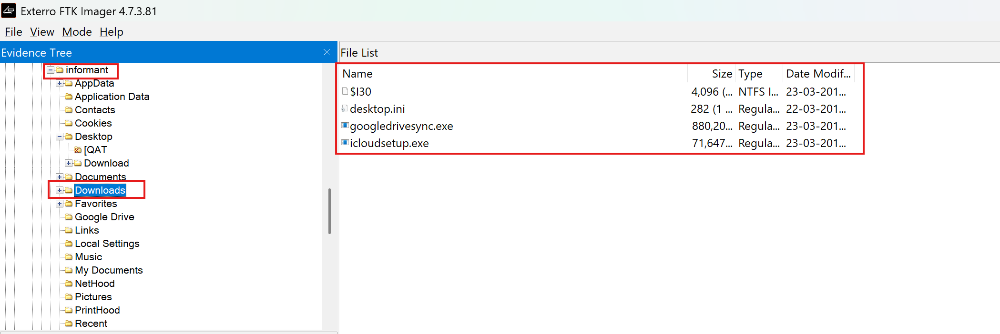

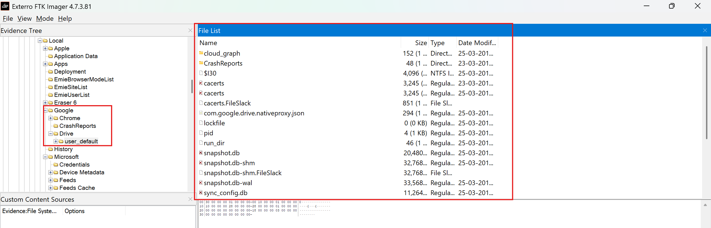

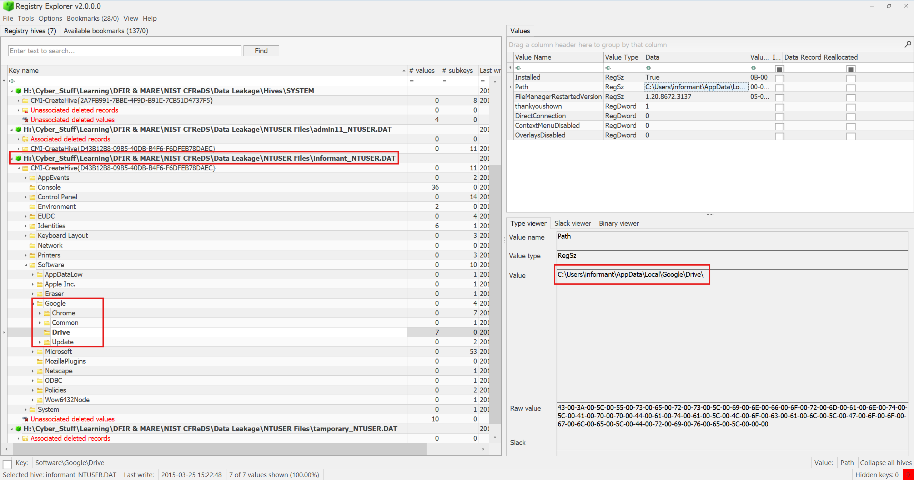

| Service      | Artifact Type | Location / Path                                                             | Details           |
| ------------ | ------------- | --------------------------------------------------------------------------- | ----------------- |
| Google Drive | File/Dir      | C:\Program Files (x86)\Google\Drive\|Installation directory                 |                   |
| Google Drive | File/Dir      | C:\Users\informant\AppData\Google\Drive\user_default\|User config directory |                   |
| Google Drive | File          | C:\Users\informant\AppData\Google\Drive\user_default\sync_config.db         | Deleted           |
| Google Drive | File          | C:\Users\informant\AppData\Google\Drive\user_default\snapshot.db            | Deleted           |
| Google Drive | File          | C:\Users\informant\AppData\Google\Drive\user_default\sync_log.log           | Log file          |
| Google Drive | File          | C:\Users\informant\Downloads\googledrivesync.exe                            | Installer         |
| Google Drive | Registry      | HKU\informant\Software\Google\Drive                                         | Configuration     |
| Google Drive | Registry      | HKU\informant\Software\Classes\GoogleDrive.*                                | File associations |
| Apple iCloud | File          | C:\Users\informant\Downloads\icloudsetup.exe                                | Installer         |


## Deleted files from Google Drive.

- Path of google drive logs,
	- `\User\informant\AppData\Google\Drive\user_default\sync_log.log`
- We carve it and parse it using this tool, https://toolbox.googleapps.com/apps/loggershark/.

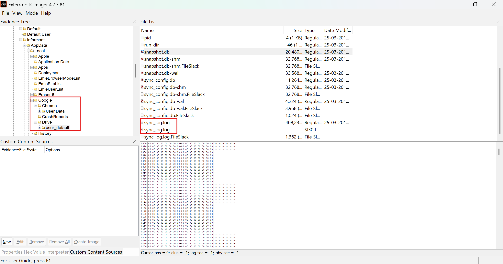

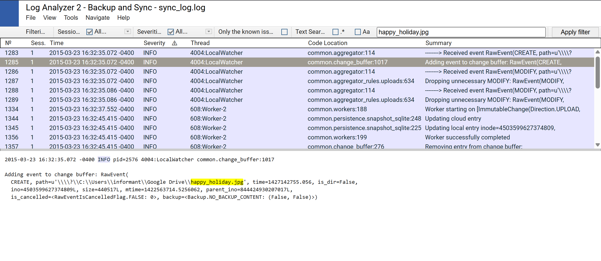

```yml
2015-03-23 16:32:35.072 -0400 INFO pid=2576 4004:LocalWatcher common.change_buffer:1017

Adding event to change buffer: RawEvent(  
  CREATE, path=u'\\\\?\\C:\\Users\\informant\\Google Drive\\happy_holiday.jpg', time=1427142755.056, is_dir=False,  
  ino=4503599627374809L, size=440517L, mtime=1422563714.5256062, parent_ino=844424930207017L,  
  is_cancelled=<RawEventIsCancelledFlag.FALSE: 0>, backup=<Backup.NO_BACKUP_CONTENT: (False, False)>)
```

- It indicates that `C:\\Users\\informant\\Google Drive\\happy_holiday.jpg` this file is uploaded to drive.
- Another one,

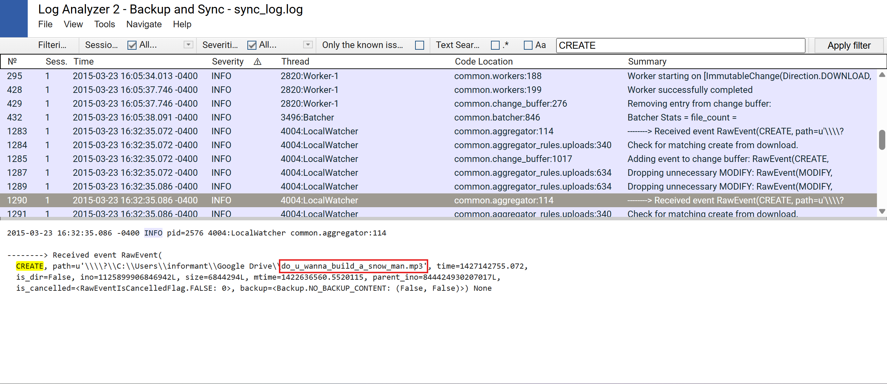

### File Metadata (Recovered / Observed Files)

| Timestamp           | File Name                       | Original Modified Time |
| ------------------- | ------------------------------- | ---------------------- |
| 2015-03-23 16:42:17 | happy_holiday.jpg               | 2015-01-30 11:49:20    |
| 2015-03-23 16:42:17 | do_u_wanna_build_a_snow_man.mp3 | 2015-01-29 15:35:14    |
### Google Drive Sync Activity (LocalWatcher Events)

| Timestamp           | File Path                                                       | Action  | Size        |
| ------------------- | --------------------------------------------------------------- | ------- | ----------- |
| 2015-03-23 16:32:35 | C:\Users\informant\Google Drive\happy_holiday.jpg               | Created | 440,517 B   |
| 2015-03-23 16:32:35 | C:\Users\informant\Google Drive\do_u_wanna_build_a_snow_man.mp3 | Created | 6,844,294 B |
| 2015-03-23 16:42:17 | C:\Users\informant\Google Drive\happy_holiday.jpg               | Deleted | —           |
| 2015-03-23 16:42:17 | C:\Users\informant\Google Drive\do_u_wanna_build_a_snow_man.mp3 | Deleted | —           |
## Google Drive account information.

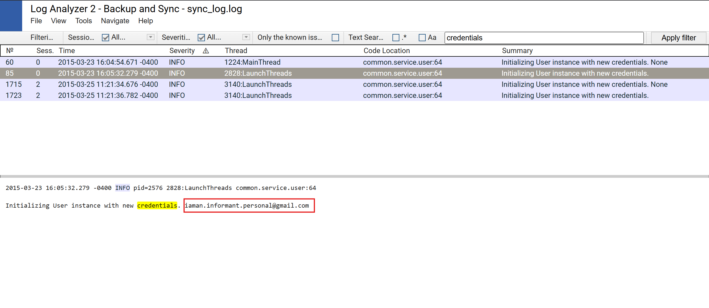

| Logon Time          | Account                               |
| ------------------- | ------------------------------------- |
| 2015-03-23 16:05:32 |  `iaman.informant.personal@gmail.com` |
