- **Category: Malware Analysis and Reverse Engineering**
- **Difficulty: Easy/Medium/Hard**
- File:- [PracticalMalwareAnalysis-Labs.tar.gz](/uploads/PMT_Labs/PracticalMalwareAnalysis-Labs.tar.gz)


# 1. Basic Static Techniques

## Lab 1-1

### 1. Upload the files to http://www.VirusTotal.com/ and view the reports. Does either file match any existing antivirus signatures?

```bash
┌──(b14cky㉿DESKTOP-VRSQRAJ)-[~/]
└─$ sha256sum Lab01-01.exe
58898bd42c5bd3bf9b1389f0eee5b39cd59180e8370eb9ea838a0b327bd6fe47  Lab01-01.exe

┌──(b14cky㉿DESKTOP-VRSQRAJ)-[~/]
└─$ sha256sum Lab01-01.dll
f50e42c8dfaab649bde0398867e930b86c2a599e8db83b8260393082268f2dba  Lab01-01.dll
```

- Lab01-01.exe
- Code insights: 
	- The sample is a file infector and system hijacker that employs DLL search order hijacking through `typosquatting`. 
	- It copies a malicious payload `Lab01-01.dll` to `'%WINDIR%\System32\kerne132.dll'` (mimicking the legitimate `kernel32.dll`). 
	- The malware then recursively scans the `C:` drive for executable files (.exe) and modifies their PE headers, specifically **patching the Import Address Table (IAT)** to replace references to '`kernel32.dll`' with the malicious `kerne132.dll`. 
	- This ensures the malicious library is loaded whenever infected applications are executed.

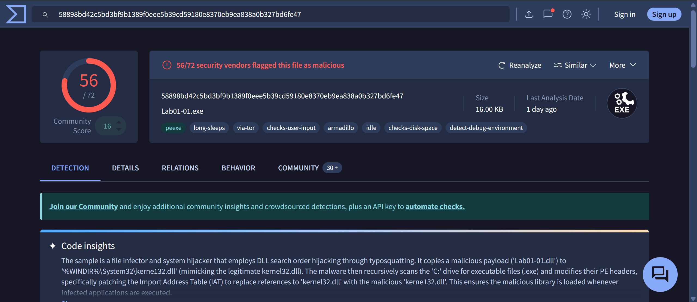

- Lab01-01.dll (`kerne132.dll`)

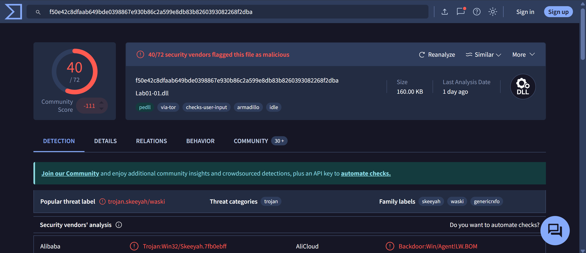
### 2. When were these files compiled?

- We can see these info inside the details tab of VT,
- Lab-01-01.exe

```yml
Creation Time: 2010-12-19 16:16:19 UTC 
First Seen In The Wild: 2012-01-08 02:19:06 UTC 
First Submission: 2012-02-16 07:31:54 UTC 
Last Submission: 2026-02-02 07:25:44 UTC 
Last Analysis: 2026-02-01 03:58:36 UTC
```

- Lab-01-01.dll

```yml
Creation Time: 2010-12-19 16:16:38 UTC 
First Seen In The Wild: 2010-12-19 09:16:38 UTC 
First Submission: 2011-07-04 19:57:48 UTC 
Last Submission: 2026-02-02 07:27:31 UTC 
Last Analysis: 2026-01-31 11:23:05 UTC
```

### 3. Are there any indications that either of these files is packed or obfuscated. If so, what are these indicators?

- We can use `Detect it Easy (DiE)` for this task, it has entropy section which shows the randomness of each section, which can be indicators to see obfuscation.
- Lab-01-01.exe (Not Packed)

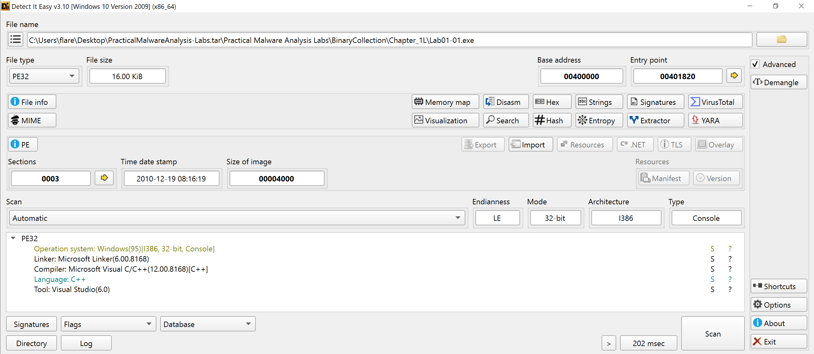

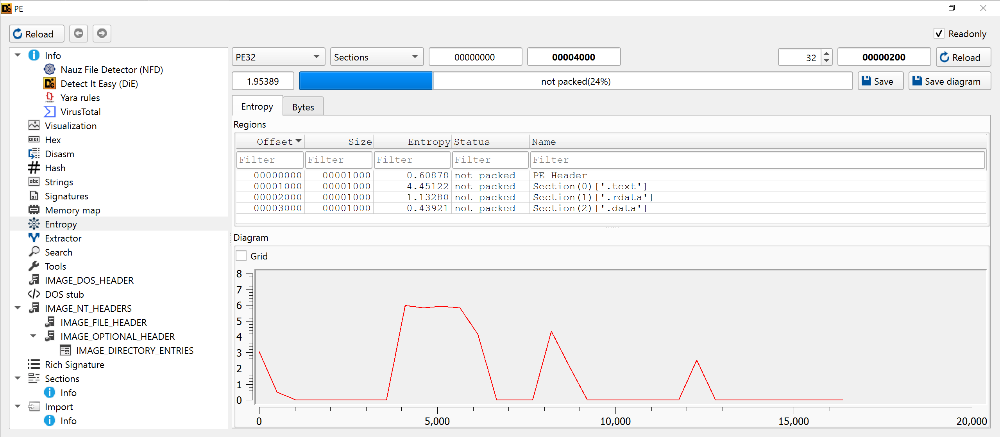

- Lab 01-01.dll (Not Packed)

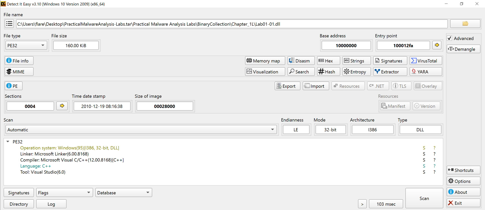

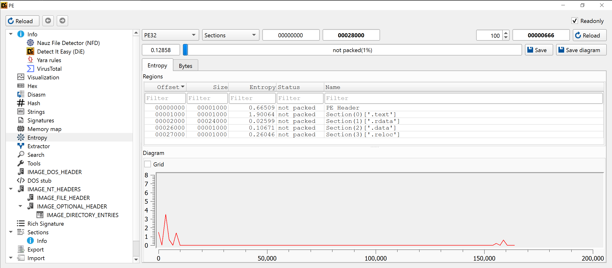

### 4. Do any imports hint at what this malware does? If so, which imports are they?

- To see imports we can use `pestudio`,
- Lab-01-01.exe
	- Imports = Windows API functions that the program **calls from DLLs (like KERNEL32.dll)**.  

```cpp
Start
 └─► CopyFileA()
      └─► Drop malicious DLL
           "Lab01-01.dll"
           ↓
           "%WINDIR%\\System32\\kerne132.dll"
 └─► FindFirstFileA("C:\\*")
      └─► FindNextFileA()
           ├─► If directory
           │     └─► Recurse (FindFirstFileA)
           └─► If *.exe
                 └─► CreateFileA(target.exe)
                      └─► CreateFileMappingA()
                           └─► MapViewOfFile()
                                └─► Parse PE headers
                                     └─► Locate Import Table
                                          └─► Replace:
                                               "kernel32.dll"
                                               ↓
                                               "kerne132.dll"
                                └─► UnmapViewOfFile()
                      └─► CloseHandle()
      └─► Repeat until no files left
 └─► FindClose()
End
```

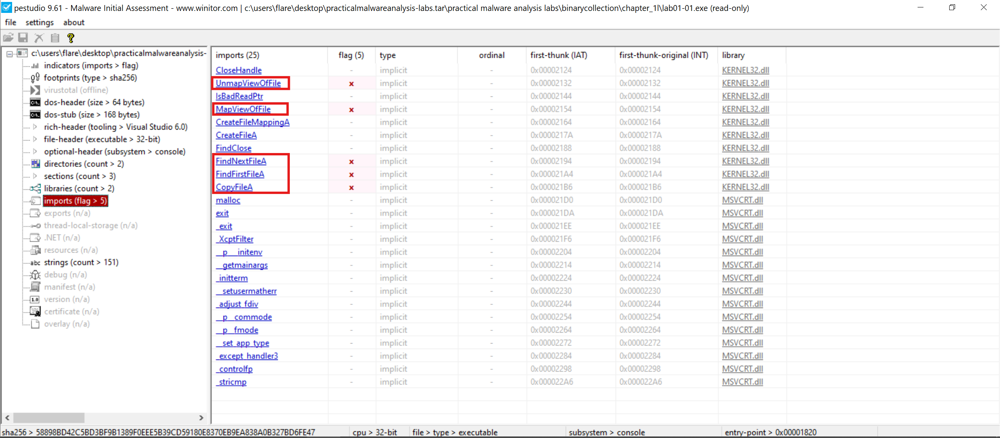

- Lab-01-01.dll

```cpp
DLL Loaded (via infected EXE)
 └─► DllMain(DLL_PROCESS_ATTACH)
      └─► CreateMutexA()
           └─► OpenMutexA()
                └─► Ensure single instance (avoid double execution)
      └─► Sleep()
           └─► Timing / sandbox evasion
      └─► WSAStartup()
           └─► Initialize Winsock
      └─► socket()
           └─► Create TCP socket
      └─► inet_addr()
           └─► Convert hardcoded IP address
      └─► htons()
           └─► Convert hardcoded port
      └─► connect()
           └─► Connect to remote C2 server
      └─► send()
           └─► Transmit host data / beacon
      └─► recv()
           └─► Receive attacker commands / response
      └─► shutdown()
           └─► Graceful connection close
      └─► closesocket()
           └─► Release socket
      └─► WSACleanup()
           └─► Cleanup Winsock
      └─► CreateProcessA()
           └─► Execute command or spawn process
      └─► CloseHandle()
End
```

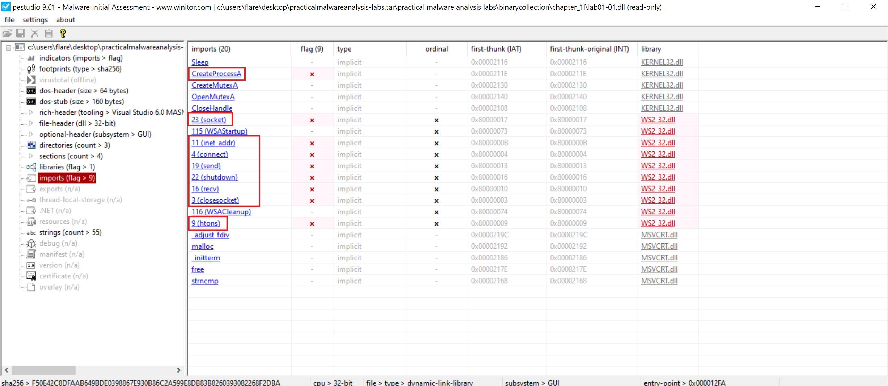

### 5. Are there any other files or host-based indicators that you could look for on infected systems?

- Examining the strings contained within Lab01-01.exe more closely reveals that it is referencing a file called `C:\windows\system32\kerne132.dll`. 
- This is a very subtle misspelling of the legitimate `Kernel32.dll` file (notice the use of **1** instead of **l**) because of this it is likely malicious and we are able to use this to search for infected systems.
- I used `floss` tool for strings analysis,

```bash
┌──(b14cky㉿DESKTOP-VRSQRAJ)-[~/]
└─$ /opt/floss Lab01-01.exe

INFO: floss: extracting static strings
finding decoding function features: 100%|██████████████| 13/13 [00:00<00:00, 1565.44 functions/s, skipped 1 library functions (7%)]
INFO: floss.stackstrings: extracting stackstrings from 9 functions
extracting stackstrings: 100%|███████████████████████████████████████████████████████████████| 9/9 [00:00<00:00, 55.13 functions/s]
INFO: floss.tightstrings: extracting tightstrings from 0 functions...
extracting tightstrings: 0 functions [00:00, ? functions/s]
INFO: floss.string_decoder: decoding strings
emulating function 0x401951 (call 1/1): 100%|████████████████████████████████████████████████| 9/9 [00:01<00:00,  5.48 functions/s]
INFO: floss: finished execution after 6.46 seconds
INFO: floss: rendering results


FLARE FLOSS RESULTS (version v3.1.1-0-g3cd3ee6)

+------------------------+------------------------------------------------------------------------------------+
| file path              | Lab01-01.exe                                                                       |
| identified language    | unknown                                                                            |
| extracted strings      |                                                                                    |
|  static strings        | 71 (648 characters)                                                                |
|   language strings     |  0 (  0 characters)                                                                |
|  stack strings         | 0                                                                                  |
|  tight strings         | 0                                                                                  |
|  decoded strings       | 0                                                                                  |
+------------------------+------------------------------------------------------------------------------------+

.
.
.
CloseHandle
UnmapViewOfFile
IsBadReadPtr
MapViewOfFile
CreateFileMappingA
CreateFileA
FindClose
FindNextFileA
FindFirstFileA
CopyFileA
.
.
.
KERNEL32.dll
malloc
exit
MSVCRT.dll
.
.
.
kerne132.dll
kernel32.dll
.exe
C:\*
C:\windows\system32\kerne132.dll
Kernel32.
Lab01-01.dll
C:\Windows\System32\Kernel32.dll
WARNING_THIS_WILL_DESTROY_YOUR_MACHINE

+------------------------------------+
| FLOSS STATIC STRINGS: UTF-16LE (4) |
+------------------------------------+

@jjj
@jjj
@jjj
@jjj

 ─────────────────────────
  FLOSS STACK STRINGS (0)
 ─────────────────────────

 ─────────────────────────
  FLOSS TIGHT STRINGS (0)
 ─────────────────────────

 ───────────────────────────
  FLOSS DECODED STRINGS (0)
 ───────────────────────────
```

- So this is the `C:\windows\system32\kerne132.dll` which is loaded so this can be another indicator in host system. 
### 6. What network-based indicators could be used to find this malware on infected machines?

- Lab-01-01.dll
- Examining the strings contained within Lab01-01.dll more closely reveals that there is what appears to be an IP address. 
- Because of this and the network imports, it is highly likely that this DLL contacts this IP address, and as such we are able to use this to find infected systems which have contacted `127.26.152.13`.

```bash
┌──(b14cky㉿DESKTOP-VRSQRAJ)-[~/]
└─$ /opt/floss Lab01-01.dll

INFO: floss: extracting static strings
finding decoding function features: 100%|███████████████| 5/5 [00:00<00:00, 2200.12 functions/s, skipped 2 library functions (40%)]
INFO: floss.stackstrings: extracting stackstrings from 1 functions
extracting stackstrings: 100%|███████████████████████████████████████████████████████████████| 1/1 [00:00<00:00, 40.17 functions/s]
INFO: floss.tightstrings: extracting tightstrings from 0 functions...
extracting tightstrings: 0 functions [00:00, ? functions/s]
INFO: floss.string_decoder: decoding strings
emulating function 0x10001010 (call 1/1): 100%|██████████████████████████████████████████████| 1/1 [00:00<00:00, 60.43 functions/s]
INFO: floss: finished execution after 4.67 seconds
INFO: floss: rendering results


FLARE FLOSS RESULTS (version v3.1.1-0-g3cd3ee6)

+------------------------+------------------------------------------------------------------------------------+
| file path              | Lab01-01.dll                                                                       |
| identified language    | unknown                                                                            |
| extracted strings      |                                                                                    |
|  static strings        | 37 (301 characters)                                                                |
|   language strings     |  0 (  0 characters)                                                                |
|  stack strings         | 0                                                                                  |
|  tight strings         | 0                                                                                  |
|  decoded strings       | 0                                                                                  |
+------------------------+------------------------------------------------------------------------------------+


 ───────────────────────────
  FLOSS STATIC STRINGS (37)
 ───────────────────────────

+----------------------------------+
| FLOSS STATIC STRINGS: ASCII (37) |
+----------------------------------+

!This program cannot be run in DOS mode.
Rich
.text
`.rdata
@.data
.
.
.
CloseHandle
Sleep
CreateProcessA
CreateMutexA
OpenMutexA
KERNEL32.dll
WS2_32.dll
.
.
.
exec
sleep
hello
127.26.152.13
.
.
.
+------------------------------------+
| FLOSS STATIC STRINGS: UTF-16LE (0) |
+------------------------------------+

 ─────────────────────────
  FLOSS STACK STRINGS (0)
 ─────────────────────────

 ─────────────────────────
  FLOSS TIGHT STRINGS (0)
 ─────────────────────────

 ───────────────────────────
  FLOSS DECODED STRINGS (0)
 ───────────────────────────
```

### 7. What would you guess is the purpose of these files?

- Based on the observations above, the executable appears to function primarily as a loader for a malicious DLL that acts as a backdoor or `remote access trojan (RAT)`. 
- Analysis of its imported functions suggests that the executable checks for the presence of `C:\Windows\System32\kerne132.dll` and, if absent, copies the malicious DLL to this location to establish persistence. 
- Once loaded, the DLL likely initiates outbound communication to a command-and-control (C2) server at `127.26.152.13`.

## Lab 1-2

### 1. Upload the Lab01-02.exe file to http://www.VirusTotal.com/. Does it match any existing antivirus definitions?

- Lab-01-02.exe
- Code insights
	- The binary is a packed (UPX) malware that establishes persistence by installing itself as a Windows service. 
	- It uses `CreateServiceA` to create a service named `Malservice` configured to start automatically.
	- It also ensures only a single instance runs by creating a mutex named `HGL345`.  
	- Network capabilities are present via `InternetOpenUrlA` to connect to `www[.]malwareanalysisbook[.]com`, likely for C2 communication or downloading a next-stage payload.

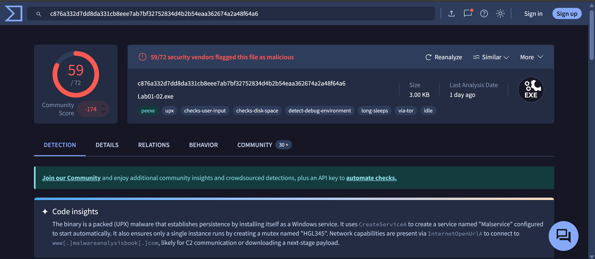

### 2. Are there any indications that this file is packed or obfuscated? If so, what are these indicators? If the file is packed, unpack it if possible.

- It is packed with `UPX` which is a popular packer,
- As we can see in entropy section, there are 2 section named `UPX`,
- The first UPX section (UPX1) contains the compressed payload, while the second section (UPX2) contains the unpacking stub and runtime code.

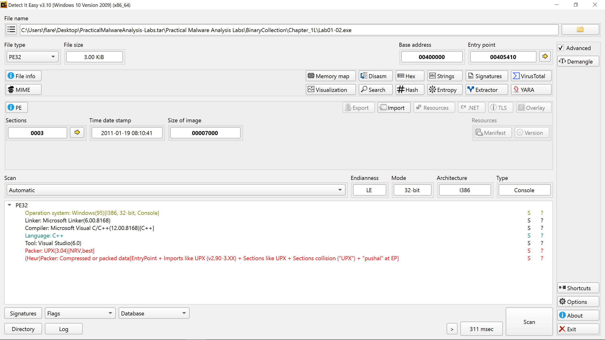

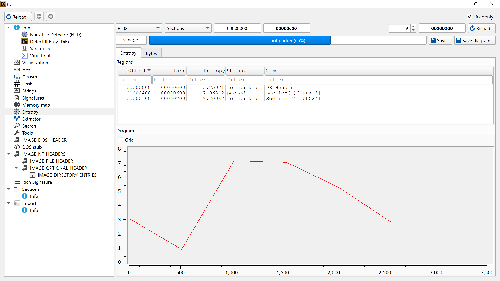

- To unpack this file we can use `upx` itself,

```bash
┌──(b14cky㉿DESKTOP-VRSQRAJ)-[~/]
└─$ upx -d Lab01-02.exe
                       Ultimate Packer for eXecutables
                          Copyright (C) 1996 - 2024
UPX 4.2.4       Markus Oberhumer, Laszlo Molnar & John Reiser    May 9th 2024

        File size         Ratio      Format      Name
   --------------------   ------   -----------   -----------
     16384 <-      3072   18.75%    win32/pe     Lab01-02.exe

Unpacked 1 file.

┌──(b14cky㉿DESKTOP-VRSQRAJ)-[~]
└─$ mv Lab01-02.exe Lab01-02.exe.enpacked
```

- Lab-01-02.exe.unpacked,
	- Everything is unpacked and we can see all he section.

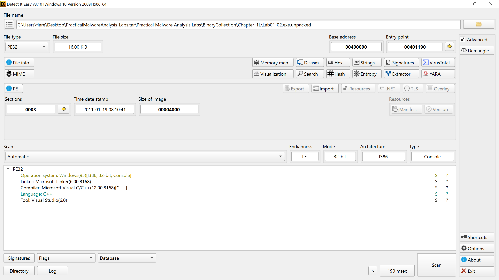

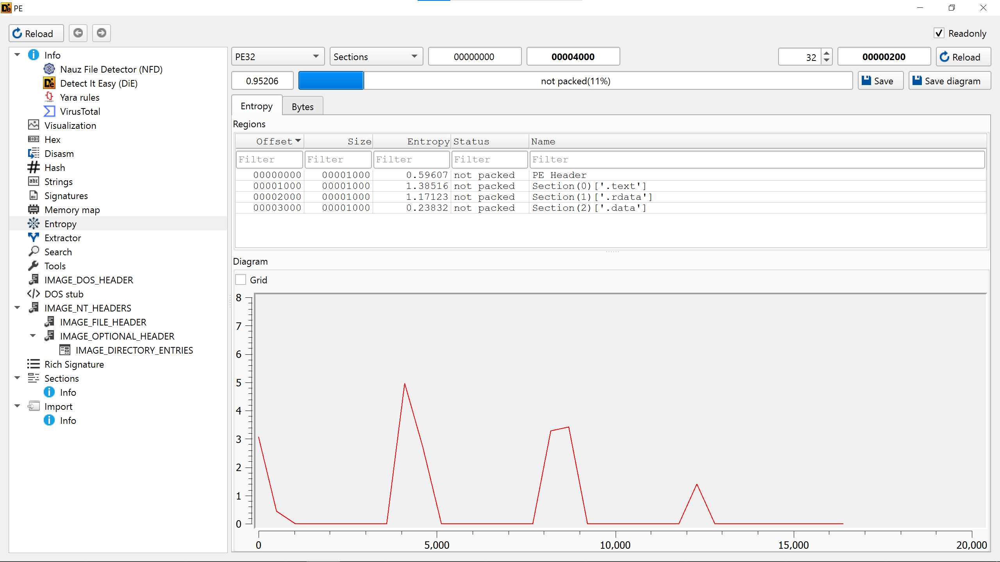
### 3. Do any imports hint at this program’s functionality? If so, which imports are they and what do they tell you?

- Again, we can use `pestudio` to see imports, 

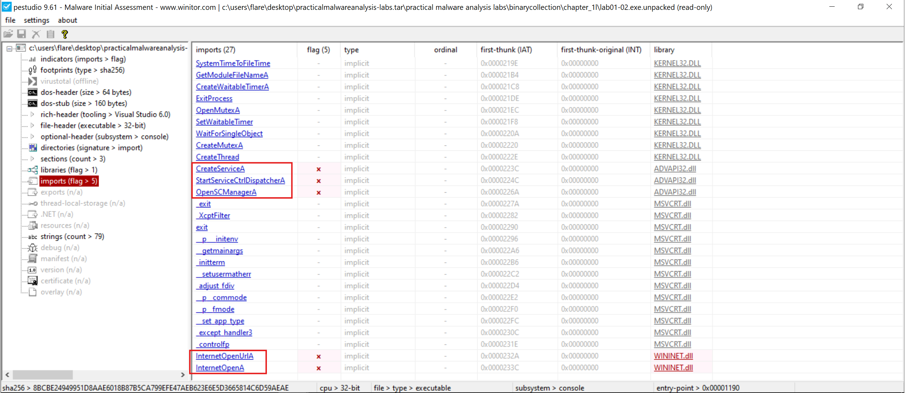

```cpp
Start
 └─► CreateMutexA()
      └─► OpenMutexA()
           └─► Ensure single instance
 └─► GetModuleFileNameA()
      └─► Resolve own executable path
 └─► CreateThread()
      └─► Run main malicious routine asynchronously
 └─► CreateWaitableTimerA()
      └─► SetWaitableTimer()
           └─► WaitForSingleObject()
                └─► Periodic || delayed execution
 └─► OpenSCManagerA()
      └─► Connect to Service Control Manager
 └─► CreateServiceA()
      └─► Install malicious service
 └─► StartServiceCtrlDispatcherA()
      └─► Register service entry point
 └─► InternetOpenA()
      └─► Initialize WinINet
 └─► InternetOpenUrlA()
      └─► Connect to remote URL (C2 / payload host)
```

### 4. What host- or network-based indicators could be used to identify this malware on infected machines?

- I used `floss` for strings analysis,
		- We got the C2 domain, `hxxp://www[.]malwareanalysisbook[.]com`

```bash
┌──(b14cky㉿DESKTOP-VRSQRAJ)-[~/]
└─$ /opt/floss Lab01-02.exe.unpacked

INFO: floss: extracting static strings
finding decoding function features: 100%|█████████████| 10/10 [00:00<00:00, 4278.59 functions/s, skipped 1 library functions (10%)]
INFO: floss.stackstrings: extracting stackstrings from 6 functions
extracting stackstrings: 100%|██████████████████████████████████████████████████████████████| 6/6 [00:00<00:00, 167.70 functions/s]
INFO: floss.tightstrings: extracting tightstrings from 0 functions...
extracting tightstrings: 0 functions [00:00, ? functions/s]
INFO: floss.string_decoder: decoding strings
emulating function 0x4012c1 (call 1/1): 100%|████████████████████████████████████████████████| 6/6 [00:00<00:00, 58.90 functions/s]
INFO: floss: finished execution after 4.92 seconds
INFO: floss: rendering results


FLARE FLOSS RESULTS (version v3.1.1-0-g3cd3ee6)

+------------------------+------------------------------------------------------------------------------------+
| file path              | Lab01-02.exe.unpacked                                                              |
| identified language    | unknown                                                                            |
| extracted strings      |                                                                                    |
|  static strings        | 58 (625 characters)                                                                |
|   language strings     |  0 (  0 characters)                                                                |
|  stack strings         | 0                                                                                  |
|  tight strings         | 0                                                                                  |
|  decoded strings       | 0                                                                                  |
+------------------------+------------------------------------------------------------------------------------+


 ───────────────────────────
  FLOSS STATIC STRINGS (58)
 ───────────────────────────

+----------------------------------+
| FLOSS STATIC STRINGS: ASCII (55) |
+----------------------------------+

!This program cannot be run in DOS mode.
Rich
.text
`.rdata
@.data
.
.
.
KERNEL32.DLL
ADVAPI32.dll
MSVCRT.dll
WININET.dll
SystemTimeToFileTime
GetModuleFileNameA
CreateWaitableTimerA
ExitProcess
OpenMutexA
SetWaitableTimer
WaitForSingleObject
CreateMutexA
CreateThread
CreateServiceA
StartServiceCtrlDispatcherA
OpenSCManagerA
.
.
.
InternetOpenUrlA
InternetOpenA
MalService
Malservice
HGL345
http://www.malwareanalysisbook.com
Internet Explorer 8.0


+------------------------------------+
| FLOSS STATIC STRINGS: UTF-16LE (3) |
+------------------------------------+

@jjjj
@jjj
@jjj


 ─────────────────────────
  FLOSS STACK STRINGS (0)
 ─────────────────────────

 ─────────────────────────
  FLOSS TIGHT STRINGS (0)
 ─────────────────────────

 ───────────────────────────
  FLOSS DECODED STRINGS (0)
 ───────────────────────────
```
## Lab 1-3

### 1. Upload the Lab01-03.exe file to http://www.VirusTotal.com/. Does it match any existing antivirus definitions?

- Lab01-03.exe 
- Code insights
	- The sample demonstrates behavior typical of adware or a `Trojan-Clicker`. 
	- It initializes `OLE/COM` and uses `CoCreateInstance` to instantiate a web browser object (likely `IWebBrowser2`). 
	- It then invokes the Navigate method (offset `0x2c`) to automatically redirect the user to a hardcoded URL: http://www.malwareanalysisbook.com/ad.html. 
	- This action is performed without user interaction immediately upon execution.

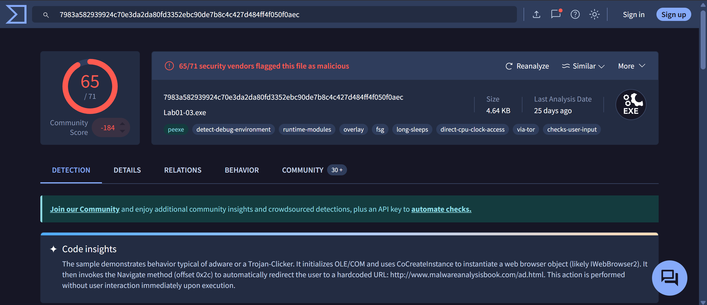
### 2. Are there any indications that this file is packed or obfuscated? If so, what are these indicators? If the file is packed, unpack it if possible.

- Here is the output of Detect-it-Easy, and entropy show nothing,
	- Here is the Breakdown:
		- **OS & Architecture:** Windows 95/32-bit : just an identification hint, likely the minimum required OS.
		- **Language:** `ASMx86` - compiled from low-level assembly (common in small labs or malware).
		- **Protection:**
		    - `Generic[Strange sections + Custom DOS]` - unusual PE structure, maybe packed or manually crafted.
		- **Packer:**
		    - `Compressed or packed data[Section names repeating]` - file is likely **packed or obfuscated** (maybe UPX or custom packer).

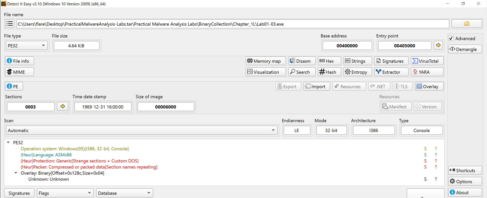)

- So i used another tool `pe-detective` and it shows that it `FSG v1.00 (Eng) → dulek/xt`,
- The binary is **packed with FSG (Fast Small Good) v1.00**, a **PE executable packer**, written by **dulek** from the **xt (Xtream / Xtreme) group**.

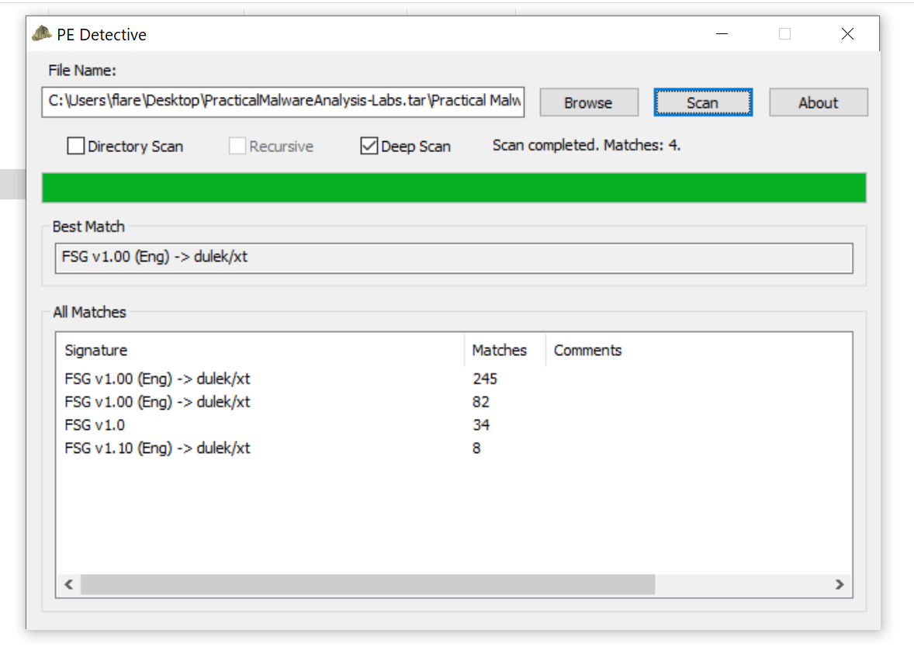

### 3. Do any imports hint at this program’s functionality? If so, which imports are they and what do they tell you?

- I used `pestudio` to see imports, it has only 2.

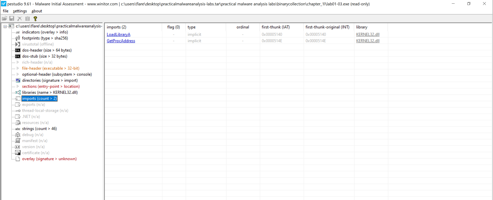
### 4. What host- or network-based indicators could be used to identify this malware on infected machines?

- It is a future topic that will be covered so for now we pause here.

## Lab 1-4

### 1. Upload the Lab01-04.exe file to http://www.VirusTotal.com/. Does it match any existing antivirus definitions?

- Lab-01-04.exe
	- Code Insights
		- This binary is a downloader. 
		- It uses the `URLDownloadToFileA` function to download an executable from `http://www.practicalmalwareanalysis.com/updater.exe`. 
		- The downloaded file is saved to the system directory as `C:\Windows\system32\wupdmgrd.exe` and then executed via `WinExec`. 
		- This behavior of downloading and executing a remote payload is unequivocally malicious.

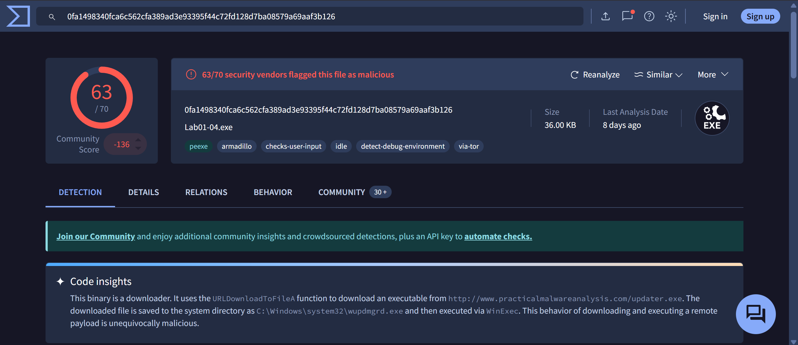
### 2. Are there any indications that this file is packed or obfuscated? If so, what are these indicators? If the file is packed, unpack it if possible.

- This time i used `diec` which is CLI version of Detect-it-Easy,
	- Which shows that it is build using `cpp` in visual studio.
	- And entropy says that it is not packed indeed.

```bash
┌──(b14cky㉿DESKTOP-VRSQRAJ)-[~/]
└─$ diec -u --verbose Lab01-04.exe

[HEUR/About] Generic Heuristic Analysis by DosX (@DosX_dev)
[HEUR] Scanning has begun!
[HEUR] Scanning to programming language has started!
[HEUR/Any] C library present -> "msvcrt.dll"
[HEUR] Scan completed.
PE32
    Operation system: Windows(95)[I386, 32-bit, GUI]
    Linker: Microsoft Linker(6.00.8168)
    Compiler: Microsoft Visual C/C++(12.00.8168)[C++/std]
    Language: C++
    Tool: Visual Studio(6.0)
    
    
┌──(b14cky㉿DESKTOP-VRSQRAJ)-[~/]
└─$ diec Lab01-04.exe -e

Total 1.17687: not packed
  0|PE Header|0|4096|0.671276: not packed
  1|Section(0)['.text']|4096|4096|3.12359: not packed
  2|Section(1)['.rdata']|8192|4096|1.59136: not packed
  3|Section(2)['.data']|12288|4096|0.50793: not packed
  4|Section(3)['.rsrc']|16384|20480|0.712982: not packed
```

### 3. When was this program compiled?

- For this task i can use `readpe` which is cli alternative of `pestudio`,
	- Fri, 30 Aug 2019 22:26:59 UTC

```bash
┌──(b14cky㉿DESKTOP-VRSQRAJ)-[~/]
└─$ readpe -H Lab01-04.exe | grep time
    Date/time stamp:                 1567204019 (Fri, 30 Aug 2019 22:26:59 UTC)
```

### 4. Do any imports hint at this program’s functionality? If so, which imports are they and what do they tell you?

- There is another tool `pecli` used for which can be used to get PE info like imports etc.

```bash
┌──(b14cky㉿DESKTOP-VRSQRAJ)-[~/]
└─$ pecli info Lab01-04.exe

Metadata
================================================================================
...

Sections
================================================================================
...

Imports
================================================================================
KERNEL32.dll
        0x402010 GetProcAddress
        0x402014 LoadLibraryA
        0x402018 WinExec
        0x40201c WriteFile
        0x402020 CreateFileA
        0x402024 SizeofResource
        0x402028 CreateRemoteThread
        0x40202c FindResourceA
        0x402030 GetModuleHandleA
        0x402034 GetWindowsDirectoryA
        0x402038 MoveFileA
        0x40203c GetTempPathA
        0x402040 GetCurrentProcess
        0x402044 OpenProcess
        0x402048 CloseHandle
        0x40204c LoadResource
ADVAPI32.dll
        0x402000 OpenProcessToken
        0x402004 LookupPrivilegeValueA
        0x402008 AdjustTokenPrivileges
MSVCRT.dll
        0x402054 _snprintf
        0x402058 _exit
        0x40205c _XcptFilter
        0x402060 exit
        0x402064 __p___initenv
        0x402068 __getmainargs
        0x40206c _initterm
        0x402070 __setusermatherr
        0x402074 _adjust_fdiv
        0x402078 __p__commode
        0x40207c __p__fmode
        0x402080 __set_app_type
        0x402084 _except_handler3
        0x402088 _controlfp
        0x40208c _stricmp


Resources:
================================================================================
...
```

- This is `pestudio` output because it gives sus potential malicious imports as red flags,

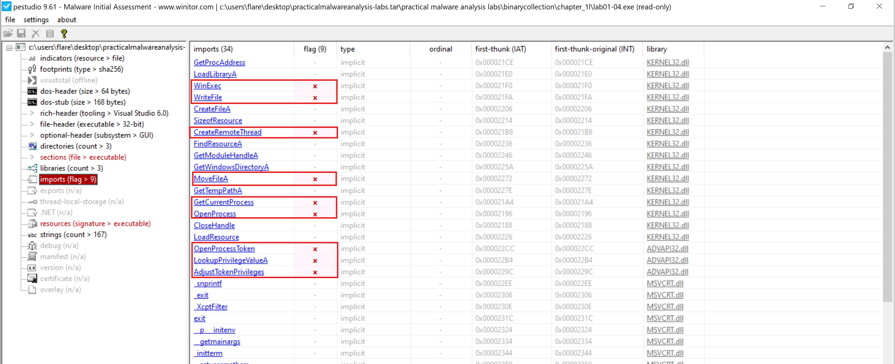

- Potential Program Flow,
	- This executable extracts an embedded payload, writes it to disk, elevates privileges, and executes or injects the payload into another process, indicating a dropper with privilege escalation and injection capabilities.

```cpp
Start
 └─► LoadLibraryA()
      └─► GetProcAddress()
           └─► Dynamically resolve APIs (evasion || flexibility)
 └─► FindResourceA()
      └─► SizeofResource()
           └─► LoadResource()
                └─► Extract embedded payload from resources
 └─► GetTempPathA()
      └─► CreateFileA(temp_file)
           └─► WriteFile()
                └─► Drop extracted payload to disk
 └─► GetWindowsDirectoryA()
      └─► MoveFileA()
           └─► Relocate payload to Windows directory
 └─► OpenProcessToken(GetCurrentProcess())
      └─► LookupPrivilegeValueA()
           └─► AdjustTokenPrivileges()
                └─► Enable elevated privileges
 └─► GetCurrentProcess()
      └─► OpenProcess()
           └─► CreateRemoteThread()
                └─► Inject payload into target process
 └─► WinExec()
      └─► Execute dropped payload
 └─► CloseHandle()
 └─► ExitProcess()
End
```

### 5. What host or network-based indicators could be used to identify this malware on infected machines?

- I used `floss` for strings analysis,
- This is the C2 domain which is downloading stage2, `hxxp[:]//www[.]practicalmalwareanalysis[.]com/updater[.]exe` and it is being put into `\system32\wupdmgrd.exe` with this name and being executed using `WinExec`.

```bash
┌──(b14cky㉿DESKTOP-VRSQRAJ)-[~/]
└─$ /opt/floss Lab01-04.exe

INFO: floss: extracting static strings
finding decoding function features: 100%|██████████████| 13/13 [00:00<00:00, 2269.17 functions/s, skipped 1 library functions (7%)]
INFO: floss.stackstrings: extracting stackstrings from 8 functions
extracting stackstrings: 100%|██████████████████████████████████████████████████████████████| 8/8 [00:00<00:00, 105.67 functions/s]
INFO: floss.tightstrings: extracting tightstrings from 0 functions...
extracting tightstrings: 0 functions [00:00, ? functions/s]
INFO: floss.string_decoder: decoding strings
emulating function 0x401701 (call 1/1): 100%|████████████████████████████████████████████████| 8/8 [00:00<00:00, 46.70 functions/s]
INFO: floss: finished execution after 4.77 seconds
INFO: floss: rendering results


FLARE FLOSS RESULTS (version v3.1.1-0-g3cd3ee6)

+------------------------+------------------------------------------------------------------------------------+
| file path              | Lab01-04.exe                                                                       |
| identified language    | unknown                                                                            |
| extracted strings      |                                                                                    |
|  static strings        | 114 (1210 characters)                                                              |
|   language strings     |   0 (   0 characters)                                                              |
|  stack strings         | 0                                                                                  |
|  tight strings         | 0                                                                                  |
|  decoded strings       | 0                                                                                  |
+------------------------+------------------------------------------------------------------------------------+


 ────────────────────────────
  FLOSS STATIC STRINGS (114)
 ────────────────────────────

+-----------------------------------+
| FLOSS STATIC STRINGS: ASCII (114) |
+-----------------------------------+

!This program cannot be run in DOS mode.
Rich
.
.
.
CloseHandle
OpenProcess
GetCurrentProcess
CreateRemoteThread
GetProcAddress
LoadLibraryA
WinExec
WriteFile
CreateFileA
SizeofResource
LoadResource
FindResourceA
GetModuleHandleA
GetWindowsDirectoryA
MoveFileA
GetTempPathA
KERNEL32.dll
AdjustTokenPrivileges
LookupPrivilegeValueA
OpenProcessToken
ADVAPI32.dll
_snprintf
.
.
.
%s%s
\winup.exe
%s%s
!This program cannot be run in DOS mode.
Rich
.text
.
.
.
GetWindowsDirectoryA
WinExec
GetTempPathA
KERNEL32.dll
URLDownloadToFileA
urlmon.dll
.
.
.
\winup.exe
%s%s
\system32\wupdmgrd.exe
%s%s
http://www.practicalmalwareanalysis.com/updater.exe

+------------------------------------+
| FLOSS STATIC STRINGS: UTF-16LE (0) |
+------------------------------------+

 ─────────────────────────
  FLOSS STACK STRINGS (0)
 ─────────────────────────

 ─────────────────────────
  FLOSS TIGHT STRINGS (0)
 ─────────────────────────

 ───────────────────────────
  FLOSS DECODED STRINGS (0)
 ───────────────────────────
```

### 6. This file has one resource in the resource section. Use Resource Hacker to examine that resource, and then use it to extract the resource. What can you learn from the resource? 

- In `PEstudio`, if we inspect resource of this file we can see that it has another exe embedded so we can carve it. 
- By saving this as a binary (executable) file, we can then run using `pecli` and see this is the file which not only contains the `winexec` imported function of `kernel32.dll`, but also the `URLDownloadToFile` function of `URLMON.DLL` which indicates it will likely download and execute a file.

```bash
┌──(b14cky㉿DESKTOP-VRSQRAJ)-[~/~]
└─$ file Lab01-04_res.exe

Lab01-04_res.exe: PE32 executable for MS Windows 4.00 (GUI), Intel i386, 3 sections
```

```bash
┌──(b14cky㉿DESKTOP-VRSQRAJ)-[~/]
└─$ pecli info Lab01-04_res.exe

Imports
================================================================================
...
urlmon.dll
        0x40204c URLDownloadToFileA
...
```

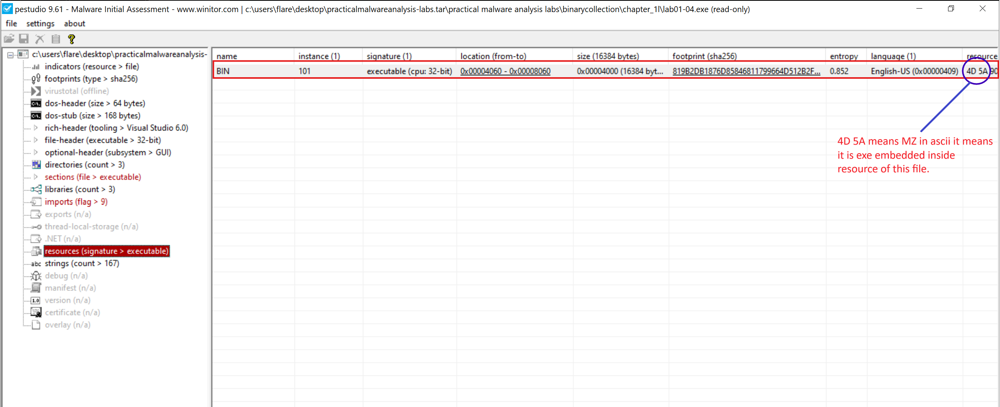