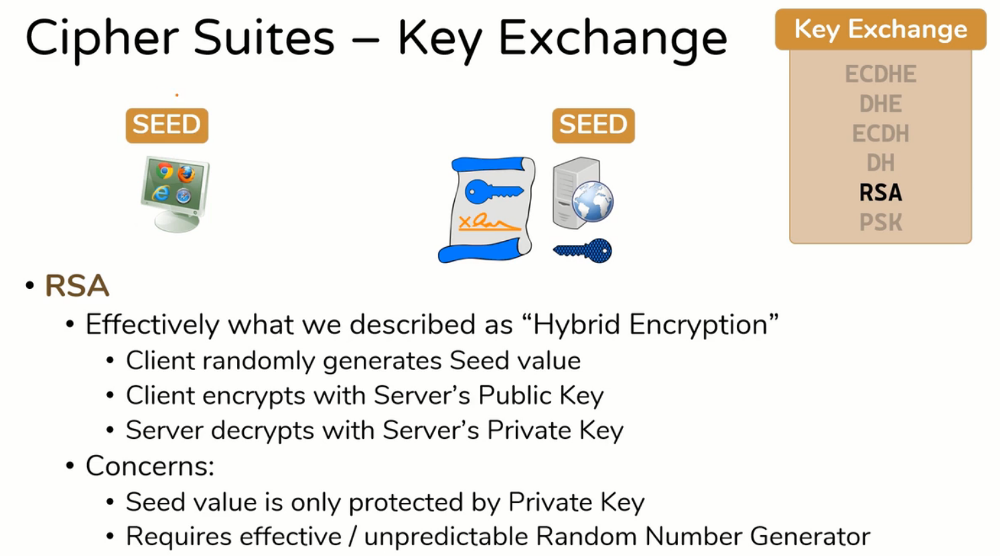
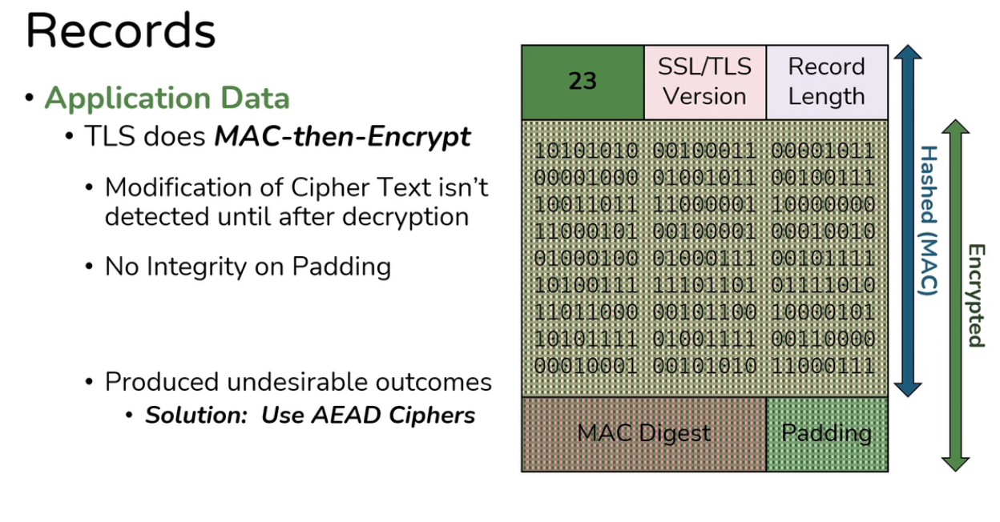

# TLS Structure and Working
## Cipher Suites in Handshake


- This Field is present to the TLS Client Hello Packet in Application Layer


- From Most Secure to Least Secure
- There can be different suites for different version of TLS

```perl
Cipher Suites (21 suites) 
    Cipher Suite: TLS_ECDHE_RSA_WITH_AES_128_GCM_SHA256 (0xc02f)
    Cipher Suite: TLS_ECDHE_ECDSA_WITH_AES_128_GCM_SHA256 (0xc02b)
    Cipher Suite: TLS_DHE_RSA_WITH_AES_128_GCM_SHA256 (0x009e)
    Cipher Suite: TLS_ECDHE_ECDSA_WITH_CHACHA20_POLY1305_SHA256 (0xcc14)
    Cipher Suite: TLS_ECDHE_RSA_WITH_CHACHA20_POLY1305_SHA256 (0xcc13)
    Cipher Suite: TLS_DHE_RSA_WITH_CHACHA20_POLY1305_SHA256 (0xcc15)
    Cipher Suite: TLS_ECDHE_RSA_WITH_AES_256_CBC_SHA (0xc014)
    Cipher Suite: TLS_ECDHE_ECDSA_WITH_AES_256_CBC_SHA (0xc00a)
    Cipher Suite: TLS_DHE_RSA_WITH_AES_256_CBC_SHA (0x0039)
    Cipher Suite: TLS_ECDHE_RSA_WITH_AES_128_CBC_SHA (0xc013)
    Cipher Suite: TLS_ECDHE_ECDSA_WITH_AES_128_CBC_SHA (0xc009)
    Cipher Suite: TLS_DHE_RSA_WITH_AES_128_CBC_SHA (0x0033)
    Cipher Suite: TLS_ECDHE_RSA_WITH_RC4_128_SHA (0xc011)
    Cipher Suite: TLS_ECDHE_ECDSA_WITH_RC4_128_SHA (0xc007)
    Cipher Suite: TLS_RSA_WITH_AES_128_GCM_SHA256 (0x009c)
    Cipher Suite: TLS_RSA_WITH_AES_256_CBC_SHA (0x0035)
    Cipher Suite: TLS_RSA_WITH_AES_128_CBC_SHA (0x002f)
    Cipher Suite: TLS_RSA_WITH_RC4_128_SHA (0x0005)
    Cipher Suite: TLS_RSA_WITH_RC4_128_MD5 (0x0004)
    Cipher Suite: TLS_RSA_WITH_3DES_EDE_CBC_SHA (0x000a)
    Cipher Suite: TLS_EMPTY_RENEGOTIATION_INFO_SCSV (0x00ff)
```

>[!seealso]
><b>Transport Layer Security (TLS) Parameters</b> : https://www.iana.org/assignments/tls-parameters/tls-parameters.xhtml
>
><b>TLS Cipher Suites Pre-build List</b> : >(https://www.iana.org/assignments/tls-parameters/tls-parameters.xhtml#tls-parameters-4)

### Key Exchange

1. First, We need to generate ==seed value (Secret key for HMAC, Secret key for Symmetric Encryption)==

>[!note]
>From this seed value any number of keys can be generate in future for both parties so key exchange is one time process.

- Here are numbers of algorithms for key exchange,
	1. PSK
	2. RSA
	3. DH
	4. ECDH
	5. DHE
	6. ECDHE

#### PSK (Pre-Shared Key)

- it ==will not provides forward secrecy==.


#### RSA (Rivest-Shamir-Adleman)

- it ==will not provides forward secrecy==.



#### DH (Diffie-Helman)


- DH (Diffie-Helman) Variations,
	- **Elliptic curve Diffie-Helman Ephemeral (DE Parameters are temporary into cert and key file) ECDHE** ==provides forward secrecy==. (More Efficient and Secure then DHE) 
	- **DHE Diffie-Helman Ephemeral** ==provides forward secrecy==.
	- **Elliptic curve Diffie-Helman ECDH (DE Parameters are static into cert and key file)** ==will not provides forward secrecy==.(More Efficient and Secure then DH)
	- **Diffie-Helman DH** ==will not provides forward secrecy==.
	- Parameters such as **P, G, Private Key** 


#### Forward Secrecy 

- Definition : **" Once encrypted always encrypted "** meaning that asymmetric private key never compromise whether we are using it or not.

- Without Forward Secrecy
- The ==Parameters (P, G, Private Key) are statically stored in private key itself== which is not safe because attacker ==get that private key by chance then it can generate seed value== out of it. 


- With Forward Secrecy
- For ECDHE and DHE the Parameters (P, G, Private Key) are ==discarded after getting seed== value so even ==if attacker gets the private key it can't get the seed==. 


#### Avoid, Accept, Prefer


### Authentication

- Verify if server is truly who they say are
- Here are numbers of algorithms for authentication,
	1. PSK
	2. DSS
	3. RSA
	4. ECDSA

#### PSK


#### DSS (Digital Signature Standard)


- DSA
	- Random Number is very important
	- MUST be unique for each message or DSA fails catastrophically
	- If Random # is ever re-used, Private Key can be extracted
	- RFC 6979 u— Generate random # deterministically based on Message


#### RSA vs DSS (DSA)


>[!summary]
>Between RSA and DSS, RSA better performing in terms of security and largely acceptance


#### RSA vs ECDSA


>[!summary]
>Between RSA and ECDSA .. choose ECDSA

>[!note]
>BUT, you don't actually have to choose - you can use both!
>
>Cipher Suite is selected before Certificate is sent
>
>If client only supports RSA: present RSA certificate
>
>If client supports RSA or ECDSA: present ECDSA certificate

#### Avoid, Accept, Prefer


### Encryption

- Here are numbers of Encryption algorithms,
- <font color="red">Red: Stream Cipher</font>, <font color="green">Green: Block Cipher</font> 
	- <font color="red">CHACHA20</font>
	- <font color="green">AES-256-GCM</font>
	- <font color="green">AES-128-GCM</font>
	- <font color="green">AES-256-CBC</font>
	- <font color="green">AES-128-CBC</font>
	- <font color="green">3DES-CBC</font>
	- <font color="red">RC4-128</font>
	- <font color="green">DES-CBC</font>

```json
Key Sizes
< 128 bits : not secure
= 128 bits : secure
> 128 bits : very secure
```


#### Block cipher vs Stream Cipher


#### What is Diffusion?


#### Block Cipher Modes

##### CBC (Cipher Block Chaining)

- it suffers from **"padding oracle"**
- Cannot be parallelized (next block is dependent on previous one makes it slower)

- Encryption 


- Decryption


##### CTR (Counter)

- Cipher blocks are not tied to blocks before or after so its vulnerable to changing block in cipher text so **must pair with MAC know as Galois Counter Mode (GCM)**.
- its a **AEAD (Authenticated Encryption with Associated Data) cipher**
	- can do ==symmetric encryption and MAC== at the same time
- Can be parallelized 

- Encryption / Decryption


#### 3DES-CBC, RC4-128, DES-CBC


#### AES-128/256-GCM/CBC

- Given <font color="cyan">2 Encryption Algorithms</font> are known to be much secure then other two.


#### ChaCha20


#### Summarization

>[!summary]
><b>AEAD (Authenticated Encryption with Associated Data)</b> ciphers provide both ==confidentiality== and ==integrity== by combining ==encryption== and ==authentication== in a single operation.
>
>Examples: ChaCha20-Poly1305, AES-CCM (Counter with CBC-MAC Mode), AES-GCM (Galois/Counter Mode), AES-GCM-SIV (Synthetic Initialization Vector), OCB (Offset Codebook Mode)

#### Avoid, Accept, Prefer


### Hashing

- Hashing algorithm which will be used as a MAC (Message Authentication Code) Provides Integrity and Authentication for Bulk Data
	- Poty1305
	- SHA384
	- SHA256
	- SHA
	- MD5

#### MD5


#### SHA-1/256/384/512

- SHA1 Family


- SHA-2 Family


#### Poly1305


#### Avoid, Accept, Prefer


## Cipher Suites Task

### Netflix Cipher Suite Analysis

```yml
Starting Nmap 7.94SVN ( https://nmap.org ) at 2025-02-23 00:28 IST
Nmap scan report for netflix.com (54.73.148.110)
Host is up (0.16s latency).
Other addresses for netflix.com (not scanned): 18.200.8.190 54.155.246.232 2a05:d018:76c:b685:c898:aa3a:42c7:9d21 2a05:d018:76c:b684:b233:ac1f:be1f:7 2a05:d018:76c:b683:e1fe:9fbf:c403:57f1
rDNS record for 54.73.148.110: ec2-54-73-148-110.eu-west-1.compute.amazonaws.com

PORT    STATE SERVICE        VERSION
443/tcp open  ssl/http-proxy (bad gateway)
| ssl-enum-ciphers: 
|   TLSv1.0: 
|     ciphers: 
|       TLS_ECDHE_RSA_WITH_AES_128_CBC_SHA (ecdh_x25519) - A
|       TLS_ECDHE_RSA_WITH_AES_256_CBC_SHA (ecdh_x25519) - A
|       TLS_RSA_WITH_AES_128_CBC_SHA (rsa 2048) - A
|       TLS_RSA_WITH_AES_256_CBC_SHA (rsa 2048) - A
|     compressors: 
|       NULL
|     cipher preference: server
|   TLSv1.1: 
|     ciphers: 
|       TLS_ECDHE_RSA_WITH_AES_128_CBC_SHA (ecdh_x25519) - A
|       TLS_ECDHE_RSA_WITH_AES_256_CBC_SHA (ecdh_x25519) - A
|       TLS_RSA_WITH_AES_128_CBC_SHA (rsa 2048) - A
|       TLS_RSA_WITH_AES_256_CBC_SHA (rsa 2048) - A
|     compressors: 
|       NULL
|     cipher preference: server
|   TLSv1.2: 
|     ciphers: 
|       TLS_ECDHE_RSA_WITH_AES_128_GCM_SHA256 (ecdh_x25519) - A
|       TLS_ECDHE_RSA_WITH_AES_256_GCM_SHA384 (ecdh_x25519) - A
|       TLS_ECDHE_RSA_WITH_AES_128_CBC_SHA (ecdh_x25519) - A
|       TLS_ECDHE_RSA_WITH_AES_256_CBC_SHA (ecdh_x25519) - A
|       TLS_RSA_WITH_AES_128_GCM_SHA256 (rsa 2048) - A
|       TLS_RSA_WITH_AES_128_CBC_SHA (rsa 2048) - A
|       TLS_RSA_WITH_AES_256_GCM_SHA384 (rsa 2048) - A
|       TLS_RSA_WITH_AES_256_CBC_SHA (rsa 2048) - A
|     compressors: 
|       NULL
|     cipher preference: server
|   TLSv1.3: 
|     ciphers: 
|       TLS_AKE_WITH_AES_128_GCM_SHA256 (ecdh_x25519) - A
|       TLS_AKE_WITH_AES_256_GCM_SHA384 (ecdh_x25519) - A
|       TLS_AKE_WITH_CHACHA20_POLY1305_SHA256 (ecdh_x25519) - A
|     cipher preference: client
|_  least strength: A
|_http-server-header: envoy
| fingerprint-strings: 
|   FourOhFourRequest: 
|     HTTP/1.1 502 Bad Gateway
|     Via: 1.1 i-0aba3ec878b310dc9 (eu-west-1)
|     X-Originating-URL: https://100.86.75.66/nice%20ports%2C/Tri%6Eity.txt%2ebak
|     Set-Cookie: nfvdid=BQFmAAEBEIdGmZncsdqD_2VD-Pr0zWJA9x9aJw1FMTZTb0NkJIQPaAs0R5lb3RYJrtJSa6ZebRN9sSeehEbz9cV_qcrsSAAn9GHxBxPeslAht6l9IVBBeg%3D%3D; Domain=.netflix.com; Path=/; Max-Age=31536000
|     X-Netflix.nfstatus: 2_16
|     X-Netflix.proxy.execution-time: 1378
|     transfer-encoding: chunked
|     Connection: close
|   GetRequest: 
|     HTTP/1.1 404 Not Found
|     Content-Length: 7
|     Connection: close
|     BLOCKED
|   HTTPOptions: 
|     HTTP/1.1 200 OK
|     Content-Length: 0
|     Access-Control-Allow-Origin: *
|     Access-Control-Allow-Credentials: true
|     Allow: GET, HEAD, POST, PUT, DELETE, TRACE, OPTIONS, SCRIPT
|     Access-Control-Allow-Methods: GET, HEAD, POST, PUT, DELETE, TRACE, OPTIONS, SCRIPT
|     Accept-CH: Sec-CH-UA-Model,Sec-CH-UA-Platform-Version
|_    Access-Control-Allow-Headers: Authorization,Content-Type,Content-Encoding,Accept,X-Netflix.application.name,X-Netflix.application.version,X-Netflix.esn,X-Netflix.device.type,X-Netflix.certification.version,X-Netflix.request.uuid,X-Netflix.originating.request.uuid,X-Netflix.user.id,X-Netflix.oauth.consumer.key,X-Netflix.oauth.token,X-Netflix.ichnaea.request.type,X-Netflix.Request.Routing,X-NETFLIX-PREAPP-PARTNER-ID,X-NETFLIX-PREAPP-INTEGRITY-VALUE,X-Netflix.Request.Priority,X-Netflix.Retry.Client.Policy,X-Netflix.Client.Request.Name,X-Netflix.Request.Retry.Policy,X-Netflix.Request.Retry
1 service unrecognized despite returning data. If you know the service/version, please submit the following fingerprint at https://nmap.org/cgi-bin/submit.cgi?new-service :
SF-Port443-TCP:V=7.94SVN%T=SSL%I=7%D=2/23%Time=67BA1E7B%P=x86_64-pc-linux-
SF:gnu%r(GetRequest,47,"HTTP/1\.1\x20404\x20Not\x20Found\r\nContent-Length
SF::\x207\r\nConnection:\x20close\r\n\r\nBLOCKED")%r(HTTPOptions,893,"HTTP
SF:/1\.1\x20200\x20OK\r\nContent-Length:\x200\r\nAccess-Control-Allow-Orig
SF:in:\x20\*\r\nAccess-Control-Allow-Credentials:\x20true\r\nAllow:\x20GET
SF:,\x20HEAD,\x20POST,\x20PUT,\x20DELETE,\x20TRACE,\x20OPTIONS,\x20SCRIPT\
SF:r\nAccess-Control-Allow-Methods:\x20GET,\x20HEAD,\x20POST,\x20PUT,\x20D
SF:ELETE,\x20TRACE,\x20OPTIONS,\x20SCRIPT\r\nAccept-CH:\x20Sec-CH-UA-Model
SF:,Sec-CH-UA-Platform-Version\r\nAccess-Control-Allow-Headers:\x20Authori
SF:zation,Content-Type,Content-Encoding,Accept,X-Netflix\.application\.nam
SF:e,X-Netflix\.application\.version,X-Netflix\.esn,X-Netflix\.device\.typ
SF:e,X-Netflix\.certification\.version,X-Netflix\.request\.uuid,X-Netflix\
SF:.originating\.request\.uuid,X-Netflix\.user\.id,X-Netflix\.oauth\.consu
SF:mer\.key,X-Netflix\.oauth\.token,X-Netflix\.ichnaea\.request\.type,X-Ne
SF:tflix\.Request\.Routing,X-NETFLIX-PREAPP-PARTNER-ID,X-NETFLIX-PREAPP-IN
SF:TEGRITY-VALUE,X-Netflix\.Request\.Priority,X-Netflix\.Retry\.Client\.Po
SF:licy,X-Netflix\.Client\.Request\.Name,X-Netflix\.Request\.Retry\.Policy
SF:,X-Netflix\.Request\.Retry")%r(FourOhFourRequest,1C7,"HTTP/1\.1\x20502\
SF:x20Bad\x20Gateway\r\nVia:\x201\.1\x20i-0aba3ec878b310dc9\x20\(eu-west-1
SF:\)\r\nX-Originating-URL:\x20https://100\.86\.75\.66/nice%20ports%2C/Tri
SF:%6Eity\.txt%2ebak\r\nSet-Cookie:\x20nfvdid=BQFmAAEBEIdGmZncsdqD_2VD-Pr0
SF:zWJA9x9aJw1FMTZTb0NkJIQPaAs0R5lb3RYJrtJSa6ZebRN9sSeehEbz9cV_qcrsSAAn9GH
SF:xBxPeslAht6l9IVBBeg%3D%3D;\x20Domain=\.netflix\.com;\x20Path=/;\x20Max-
SF:Age=31536000\r\nX-Netflix\.nfstatus:\x202_16\r\nX-Netflix\.proxy\.execu
SF:tion-time:\x201378\r\ntransfer-encoding:\x20chunked\r\nConnection:\x20c
SF:lose\r\n\r\n0\r\n\r\n");

Service detection performed. Please report any incorrect results at https://nmap.org/submit/ .
Nmap done: 1 IP address (1 host up) scanned in 37.05 seconds
```


---

- TLSv1.3 (Most Secure)
- Client Side Cipher Suites
	- `TLS_AKE_WITH_AES_128_GCM_SHA256` (ecdh_x25519) - **Grade A**
	- `TLS_AKE_WITH_AES_256_GCM_SHA384` (ecdh_x25519) - **Grade A**
	- `TLS_AKE_WITH_CHACHA20_POLY1305_SHA256` (ecdh_x25519) - **Grade A**
- ✅ **Security Notes:**
	- TLS 1.3 **removes all weak ciphers** and uses only AEAD encryption (AES-GCM, ChaCha20).
	- No RSA key exchange (only ECDHE, which supports forward secrecy).
	- TLS 1.3 cipher preference is **client-driven**, unlike earlier versions.

---

-  TLSv1.2 (Secure)
- Server-Proposed Cipher Suites
    - `TLS_ECDHE_RSA_WITH_AES_128_GCM_SHA256` (ecdh_x25519) - **Grade A**
    - `TLS_ECDHE_RSA_WITH_AES_256_GCM_SHA384` (ecdh_x25519) - **Grade A**
    - `TLS_ECDHE_RSA_WITH_AES_128_CBC_SHA` (ecdh_x25519) - **Grade A**
    - `TLS_ECDHE_RSA_WITH_AES_256_CBC_SHA` (ecdh_x25519) - **Grade A**
    - `TLS_RSA_WITH_AES_128_GCM_SHA256` (rsa 2048) - **Grade A**
    - `TLS_RSA_WITH_AES_256_GCM_SHA384` (rsa 2048) - **Grade A**
    - `TLS_RSA_WITH_AES_128_CBC_SHA` (rsa 2048) - **Grade A**
    - `TLS_RSA_WITH_AES_256_CBC_SHA` (rsa 2048) - **Grade A**
- ✅ **Security Notes:**
	- TLS 1.2 **supports modern cryptographic algorithms** (AES-GCM).
	- AES-CBC is **not ideal** due to previous padding oracle vulnerabilities.
	- RSA-based key exchange is **not forward secure**, but ECDHE provides **forward secrecy**..

---

- TLSv1.0 (Insecure & Deprecated)
- Server-Proposed Cipher Suites:
    - `TLS_ECDHE_RSA_WITH_AES_128_CBC_SHA` (ecdh_x25519) - **Grade A**
    - `TLS_ECDHE_RSA_WITH_AES_256_CBC_SHA` (ecdh_x25519) - **Grade A**
    - `TLS_RSA_WITH_AES_128_CBC_SHA` (rsa 2048) - **Grade A**
    - `TLS_RSA_WITH_AES_256_CBC_SHA` (rsa 2048) - **Grade A**
- ❌ Security Notes:
    - TLS 1.0 is **vulnerable to BEAST attacks** (CBC mode attack).
    - Uses **weaker key exchange mechanisms**, lacks **modern AEAD ciphers**.
    - **No protection** against downgrade attacks.
    - **Officially deprecated** – should be **disabled** in favor of TLS 1.2 or 1.3.

---

- TLSv1.1 (Insecure & Deprecated)
- Server-Proposed Cipher Suites:
    - `TLS_ECDHE_RSA_WITH_AES_128_CBC_SHA` (ecdh_x25519) - **Grade A**
    - `TLS_ECDHE_RSA_WITH_AES_256_CBC_SHA` (ecdh_x25519) - **Grade A**
    - `TLS_RSA_WITH_AES_128_CBC_SHA` (rsa 2048) - **Grade A**
    - `TLS_RSA_WITH_AES_256_CBC_SHA` (rsa 2048) - **Grade A**
- ❌ Security Notes:
    - **No major improvements** over TLS 1.0.
    - Still **vulnerable to BEAST and downgrade attacks**.
    - Lacks **AES-GCM** and other **modern cryptographic enhancements**.
    - **Officially deprecated** – should be **disabled** in favor of TLS 1.2 or 1.3.


>[!summary]
>Conclusion:
>1. Also TLS 1.0 and 1.1 is supported but not in used by Netflix.
>2. TLS 1.2 is secure but should prioritize AES-GCM over CBC.
>3. TLS 1.3 is the best, with ChaCha20 and AES-GCM offering strong encryption.
>4. Server prefers TLS 1.2 and 1.3 ciphers, but TLS 1.3 ciphers are client-driven
>If Netflix's clients support TLS 1.3, they should prioritize ChaCha20 or AES-GCM for maximum security.

## Attacks on TLS

### 1. SSL 3.0 (Predecessor of TLS)

- **POODLE (Padding Oracle On Downgraded Legacy Encryption) [2014]**
    - Exploits SSL 3.0's fallback to CBC mode, allowing attackers to decrypt data.
    - **Mitigation:** Disable SSL 3.0 and use TLS 1.2+.

### 2. TLS 1.0 & TLS 1.1

- **BEAST (Browser Exploit Against SSL/TLS) [2011]**
    - Affects TLS 1.0 (and SSL 3.0), allowing attackers to decrypt cookies via CBC attacks.
    - **Mitigation:** Use AES-GCM or TLS 1.2+.
- **LUCKY13 (Timing Attack on CBC Mode) [2013]**
    - Exploits how TLS handles CBC padding, leading to plaintext recovery.
    - **Mitigation:** Use AEAD ciphers like AES-GCM or TLS 1.2+.
- **CRIME (Compression Ratio Info-leak Made Easy) [2012]**
    - Targets TLS compression (e.g., DEFLATE) to steal session cookies.
    - **Mitigation:** Disable TLS compression.
- **RC4 Weaknesses**
    - TLS 1.0/1.1 allowed RC4, which has significant cryptographic weaknesses.
    - **Mitigation:** Disable RC4.

### 3. TLS 1.2

- **DROWN (Decrypting RSA with Obsolete and Weakened eNcryption) [2016]**
    - Exploits servers supporting both TLS and vulnerable SSLv2, allowing RSA decryption.
    - **Mitigation:** Disable SSLv2.
- **ROBOT (Return of Bleichenbacher's Oracle Threat) [2017]**
    - A padding oracle attack against RSA encryption in TLS.
    - **Mitigation:** Use modern key exchange algorithms (ECDHE, DHE).
- **FREAK (Factoring RSA Export Keys) [2015]**
    - Exploits weak RSA "export-grade" keys to break encryption.
    - **Mitigation:** Disable weak ciphers.
- **Logjam [2015]**
    - Exploits weak Diffie-Hellman parameters, allowing an attacker to downgrade key exchanges.
    - **Mitigation:** Use at least 2048-bit DH parameters or ECDH.
- **SWEET32 [2016]**
    - Exploits small block ciphers (e.g., 3DES) using birthday attacks.
    - **Mitigation:** Disable 3DES.
- **Padding Oracle Attacks (e.g., Vaudenay’s attack)**
    - Exploits CBC mode's padding error responses.
    - **Mitigation:** Use AEAD ciphers like AES-GCM.
- **Session Resumption Hijacking**
    - If a session ticket is stolen, it can be used to impersonate a client.
    - **Mitigation:** Rotate session keys frequently.

### 4. TLS 1.3 (Latest and Most Secure)

TLS 1.3 was designed to eliminate older vulnerabilities, but new theoretical attacks still exist.

- **Downgrade Attacks (Forced TLS 1.2) [2018]**
    - Attackers force a downgrade to TLS 1.2 by manipulating handshake messages.
    - **Mitigation:** TLS 1.3 uses downgrade detection.
- **Curve25519 Key Exchange Timing Attacks**
    - Side-channel attacks on ECC cryptography.
    - **Mitigation:** Constant-time implementations.
- **Encrypted Client Hello (ECH) Attacks**
    - Potential weaknesses in ECH if implemented incorrectly.
    - **Mitigation:** Proper implementation and updates.

| **TLS Version**   | **Major Attacks**                                                                                                                                                                        | **Mitigation**                                                                     |
| ----------------- | ---------------------------------------------------------------------------------------------------------------------------------------------------------------------------------------- | ---------------------------------------------------------------------------------- |
| **SSL 3.0**       | POODLE (Padding Oracle On Downgraded Legacy Encryption)                                                                                                                                  | Disable SSL 3.0                                                                    |
| **TLS 1.0 & 1.1** | BEAST (CBC attack), LUCKY13 (Padding attack), CRIME (Compression attack), RC4 Weaknesses                                                                                                 | Disable CBC mode, RC4, TLS compression                                             |
| **TLS 1.2**       | DROWN (SSLv2 flaw), ROBOT (RSA padding attack), FREAK (Weak RSA keys), Logjam (Weak DH parameters), SWEET32 (3DES birthday attack), Padding Oracle Attacks, Session Resumption Hijacking | Disable weak ciphers, use AEAD ciphers like AES-GCM, use strong DH/ECDH parameters |
| **TLS 1.3**       | Downgrade Attacks (forcing TLS 1.2), ECC Timing Attacks (Curve25519), Encrypted Client Hello (ECH) vulnerabilities                                                                       | Use modern cryptography, downgrade detection, constant-time implementations        |

## TLS/SSL Handshake

### Records and its parameters


- Multiple Records can be sent at a time with different parameters


### Record Header


#### Change Cipher Specs


#### Alert Record


#### Handshake Records


- There are <font color="cyan">certain fields</font> which sends encrypted.


- Client Hello


- Server hello


- Certificate


- Server Key Exchange


- Server Hello Done


- Client Key Exchange


#### Application Data


- This MAC-then-Encrypt is vulnerable to **Padding Oracle On Downgraded Legacy Encryption (Poodle)** attack because padding is seprated.




### Actual Handshake

- Working Flow of TLS Handshake


#### Client Hello


#### Server Hello


#### Certificate


#### Server Hello Done


#### Client Key Exchange

- Client Generates a **PreMasterSecret** 
	- Used for generate session keys


>[!question]
>Why 4 Symmetric Session Keys??

>[!abstract]
>Client and Server creates ==two different tunnel== for data transfer one for ==client to server== and another for ==server to client==.
>
>If Attacker by chance successful to bruteforce one pair or keys then they only able to compromise half of conversations. 

>[!hint]
>In this demonstration we have used RSA but there are other algorithms like ECDHE and DHE which has some different mechanisms.

#### Change Cipher Spec from Client to Server

- Indicates that client has everything necessary to speak securely


#### Finished from Client to Server


#### Change Cipher Spec from Server to Client

- Indicates that server has everything necessary to speak securely


#### Finished from Server to Client


#### Application Data


